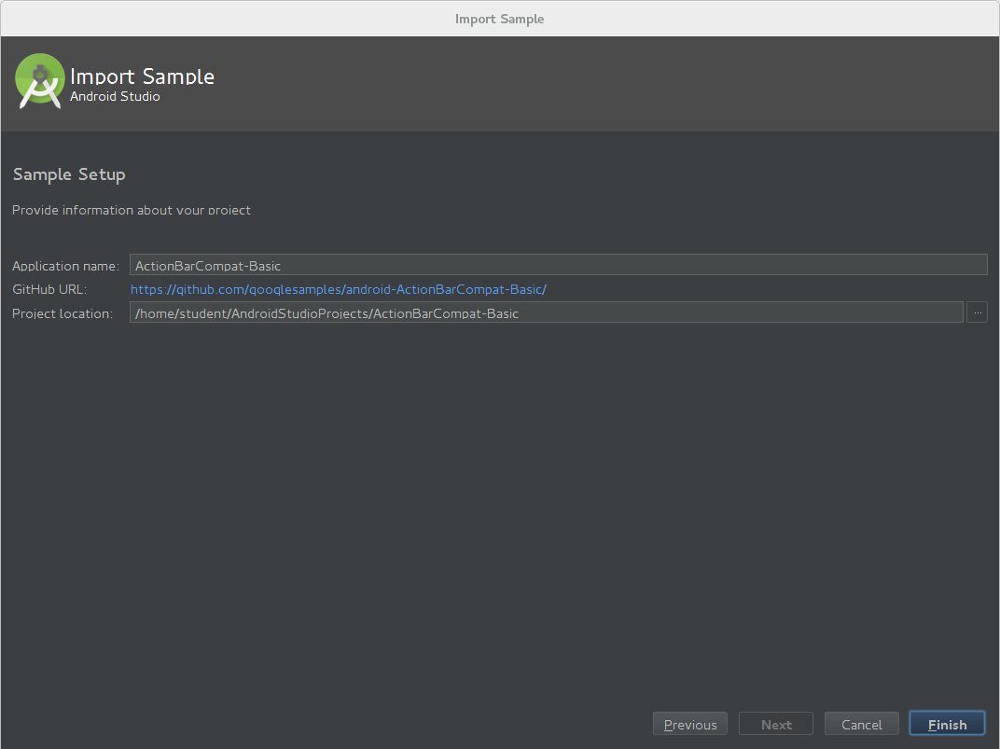

### Crearea unei aplicații Android în Android Studio 

Pentru a crea o aplicație Android se selectează **Start a New Android
Studio project**.

Configurarea proiectului presupune specificarea unor parametri:

* denumirea aplicației;
* domeniul companiei care dezvoltă aplicația respectivă.

Pe baza valorilor introduse, se generează denumirea pachetului care va
identifica în mod unic aplicația. Acesta este format din domeniu (scris
în formă inversă) la care se adaugă denumirea aplicației (din care sunt
eliminate caracterele albe).

De asemenea, este necesar să se indice locația la care va fi plasat
proiectul respectiv.

Se indică platforma căreia îi este destinată aplicația Android:

* dispozitiv mobil (telefon sau tabletă), caz în care trebuie să se precizeze valoarea minimă a nivelului de API pentru care se dezvoltă aplicația (cea mai scăzută valoare a platformei pe care poate rula aplicația);
* obiect vestimentar (ceas, brățară);
* televizor;
* dispozitiv pentru automobil;
* ochelari inteligenția;

Este selectat tipul de actvitate care va fi vizualizată în momentul în
care aplicația Android este pornită (//Blank Activity//, //Empty
Activity//, //Fullscreen Activity//, //Google AdMob Activity//, //Google
Maps Activity//, //Login Activity//, //Master/Detail Flow//,
//Navigation Drawer Activity//, //Scrolling Activity//, //Settings
Activity//, //Tabbed Activity//).

Se stabilește o denumire pentru activitatea principală, precum și
denumirea fișierelor în care vor fi plasate structura interfeței
grafice, respectiv a meniului asociat. Se poate preciza, de asemenea,
folosirea de fragmente în cadrul activității.

Se apasă butonul **Finish**.

Rularea unei aplicații Android se face prin intermediul unei pictograme
asociate unei liste de selecție, în care sunt plasate toate aplicațiile
disponibile în cadrul mediului integrat de dezvoltare. Se poate folosi
și prescurtarea *Shift + F10*.

Utilizatorul are posibilitatea de a selecta dispozitivul pe care va fi
rulată aplicația, dintre cele conectate la mașina pe care se rulează.

#### Testarea exemplelor de aplicații Android în Android Studio

Accesarea unui exemplu de aplicație Android se face prin intermediul
opțiunii //Import an Android code sample//.

Pot fi consultate mai multe proiecte Android, pentru fiecare existând
posibilitatea de a vizualiza codul sursă, disponibil în cadrul unui
depozit GitHub. Gruparea aplicațiilor Android este realizată pe
categorii tematice.

Un exemplu de aplicație Android, care se descarcă din contextul
depozitului Github, poate fi redenumită, stabilindu-se și locația la
care va fi stocată.

