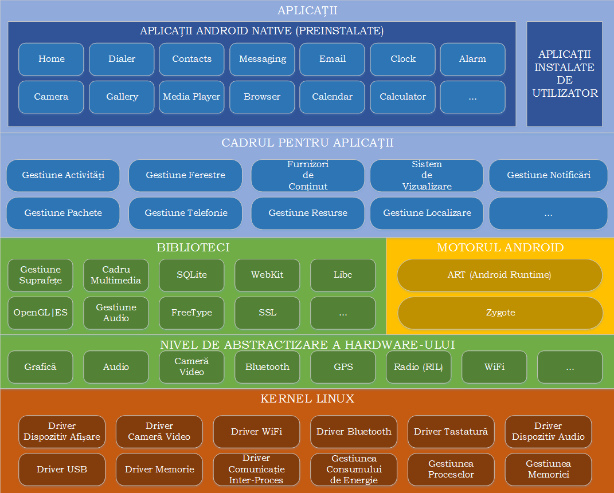

### Arhitectura Android

Arhitectura sistemului de operare Android are la baza kernel-ul Linux si aduce peste el mai multe modificari:

**Kernelul Linux** (cu unele modificări) conține driver-ele pentru diferitele
componente hardware (ecran, cameră foto, tastatură, antenă WiFi, memorie flash,
dispozitive audio), fiind responsabil cu gestiunea proceselor, memoriei,
perifericelor (audio/video, GPS, WiFi), dispozitivelor de intrare/ieșire,
rețelei și a consumului de energie; de asemenea, au fost implementate și unele
îmbunătățiri.

**Binder**, sistemul de comunicație inter-proces, a fost adaptat, întrucât
reprezintă mediul de comunicație principal dintre aplicații și sistemul de
operare, inclusiv funcțiile (serviciile) dispozitivului mobil; expunerea sa este
realizată prin intermediul AIDL (Android Interface Definition Language) prin
care pot fi manipulate obiecte transformate în primitive utilizate la
comunicația propriu-zisă dintre aplicații și sistemul de operare.

**Logger**, sistemul de jurnalizare, este esențial în cazul în care trebuie
realizată depanarea aplicațiilor, în special pentru a detecta anumite situații
particulare (informații cu privire la rețea, senzori); acesta este capabil să
agrege datele provenite atât de la aplicația propriu-zisă cât și de la sistemul
de operare, datele fiind disponibile prin intermediul unor utilitare
specializate.

**YAFFS2** (Yet Another Flash File System) este un sistem de fișiere adecvat
pentru cipuri flash bazate pe porți NAND; platforma Android este stocată pe mai
multe partiții, ceea ce îi conferă flexibilitate la actualizări, împiedicând
modificarea sa în timpul rulării (**/boot** - conține secvența de pornire,
**/system** - stochează fișierele de sistem și aplicațiile încorporate,
**/recovery** - deține o imagine din care se poate restaura sistemul de
operare, **/data** - include aplicațiile instalate și datele aferente
acestora, **/cache** - utilizată pentru fișiere temporare, folosind memoria
RAM, pentru acces rapid).

**Bibliotecile** (user-space) conțin codul care oferă principalele
funcționalități a sistemului de operare Android, făcând legătura între kernel și
aplicații. Sunt incluse aici motorul open-source pentru navigare WebKit,
biblioteca FreeType pentru suportul seturilor de caractere, baza de date SQLite
utilizată atât ca spațiu de stocare cât și pentru partajarea datelor specifice
aplicațiilor, biblioteca libc (Bionic),  biblioteca de sistem C bazată pe BSD și
optimizată pentru dispozitive mobile bazate pe Linux, biblioteci pentru redarea
și înregistrarea de conținut audio/video (bazate pe OpenCORE de la PacketVideo),
biblioteci SSL pentru asigurarea securității pe Internet și Surface Manager,
bibliotecă pentru controlul accesului la sistemul de afișare care suportă 2D și
3D. Aceste biblioteci nu sunt expuse prin API, reprezentând detalii de
implementare Android.

**Motorul Android** rulează serviciile de platformă precum și aplicațiile care
le utilizează, fiind reprezentat de:
- **ART (Android Runtime)** este mașina virtuală Java care a fost implementată
începând cu versiunea 5.0, folosind un tip de compilare AOH (Ahead of Time), în
care bytecode-ul este transpus în cod mașină la momentul instalării, astfel
încât acesta este executat direct de mediul dispozitivului mobil;
compatibilitatea cu versiuni anterioare (care folosesc mașina virtuală Dalvik,
ce se bazează pe un compilator JIT - Just in Time) este asigurată prin
transformarea pachetelor în format .dex (Dalvik Executable) la momentul
compilării, urmând ca translatarea în format .oat să se realizeze la momentul
instalării; fiecare aplicație Android rulează în procesul propriu, într-o
instanță a mașinii virtuale ART, izolând astfel codul și datele sale prin
intermediul unor permisiuni, care se aplică inclusiv la comunicația prin
intermediul interfețelor de comunicare oferite de sistemul de operare Android;
- **Zygote** este procesul care gestionează toate aplicațiile, fiind lansat în
execuție odată cu sistemul de operare:
  - inițial, creează o instanță a mașinii virtuale Java pentru sistemul de operare
Android, în contextul căreia plasează serviciile de bază: gestiunea energiei,
telefonie, furnizori de conținut, gestiunea pachetelor, serviciul de localizare,
serviciul de notificări;
  - atunci când este necesar să lanseze în execuție o anumită aplicație, se clonează, partajând astfel componentele sistemului de operare Android, astfel încât să se asigure performanța (timp de execuție) și eficiența (memorie folosită), de vreme ce fiecare aplicație trebuie rulată în propria sa instanță a mașinii virtuale Java;
- **Cadrul pentru Aplicații** expune diferitele funcționalități ale sistemului
de operare Android către programatori, astfel încât aceștia să le poată utiliza
în aplicațiile lor.
- La nivelul de **aplicații** se regăsesc atât produsele împreună cu care este
livrat dispozitivul mobil (Browser, Calculator, Camera, Contacts, Clock, FM
Radio, Launcher, Music Player, Phone, S Note, S Planner, Video Player, Voice
Recorder), cât și produsele instalate de pe Play Store sau cele dezvoltate de
programatori.
