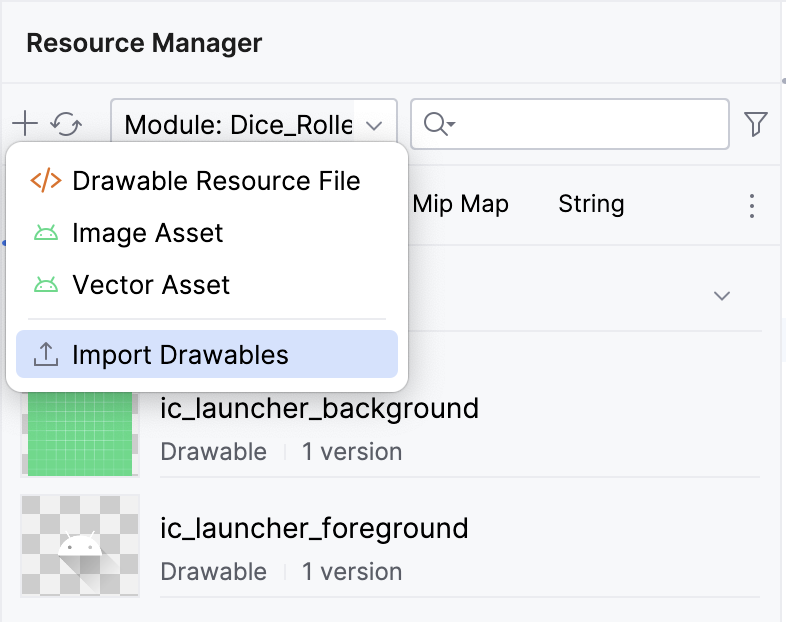
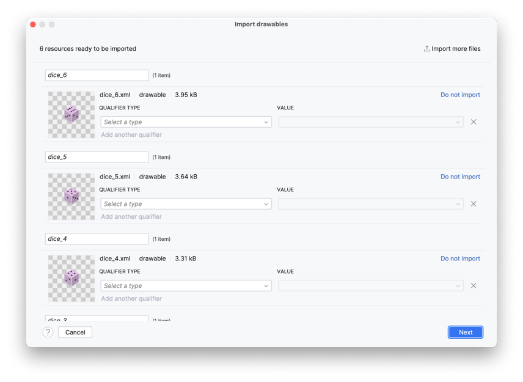
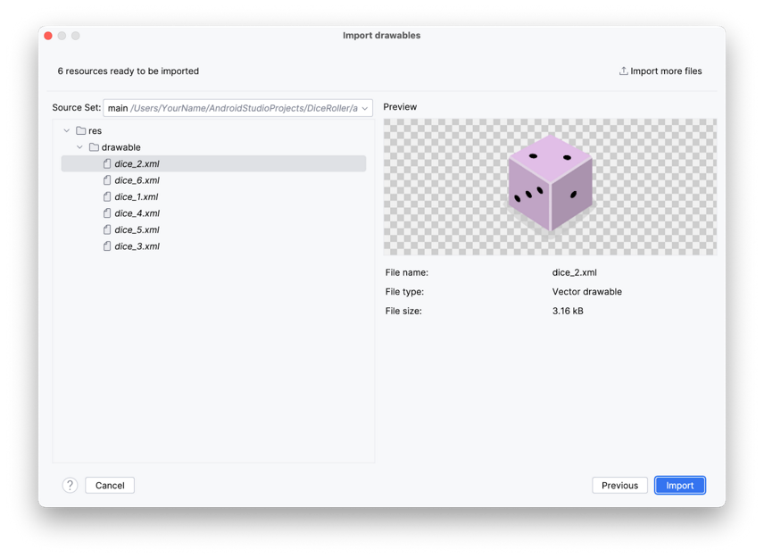
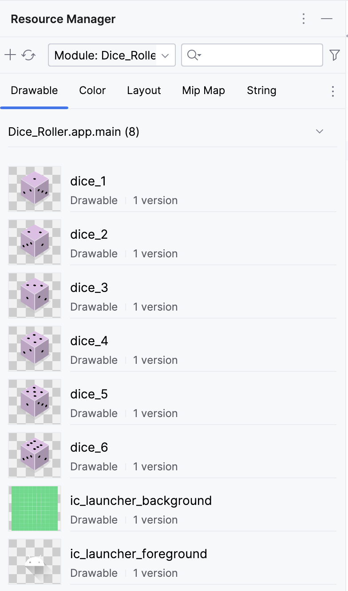
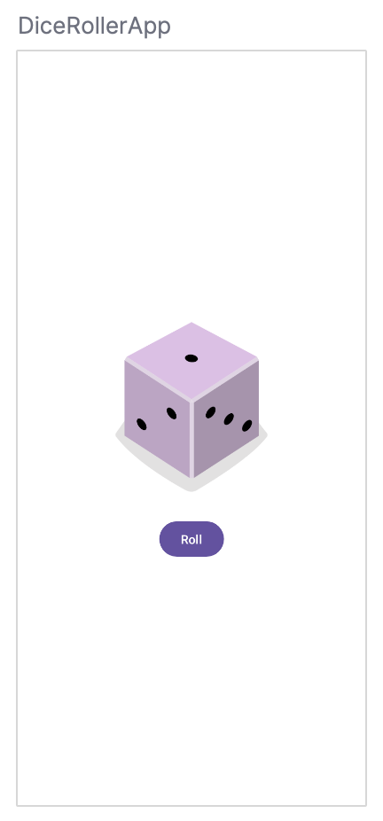

# Adaugarea unei imagini

O altă componentă esențială a aplicației noastre este imaginea zarului, care
afișează rezultatul atunci când utilizatorul atinge butonul Roll (Aruncă).
Adăugăm imaginea cu un element compozabil Image, dar acesta necesită o resursă
de imagine, așa că mai întâi trebuie să descărcăm câteva imagini furnizate
pentru această aplicație.

Vom folosi imaginile de la acest [URL](https://github.com/google-developer-training/basic-android-kotlin-compose-training-dice-roller/raw/main/dice_images.zip)

### Adăugarea imaginilor cu zaruri în aplicația noastră

1. În Android Studio, facem clic pe **View > Tool Windows > Resource Manager**.
2. Facem clic pe **+ > Import Drawables** pentru a deschide un browser de fișiere.



3. Găsim și selectăm folderul cu cele șase imagini de zaruri și procedăm la încărcarea lor.



4. Facem clic pe Next.



5. Apare dialogul Import Drawables și arată unde merg fișierele de resurse în structura de fișiere.

6. Facem clic pe Import pentru a confirma că dorim să importăm cele șase imagini.

Imaginile ar trebui să apară în panoul Resource Manager.



**Important!** Putem face referire la aceste imagini în codul nostru Kotlin cu ID-urile lor de resurse:

- R.drawable.dice_1
- R.drawable.dice_2
- R.drawable.dice_3
- R.drawable.dice_4
- R.drawable.dice_5
- R.drawable.dice_6


### Adăugarea unui element compozabil Image

Imaginea zarului ar trebui să apară deasupra butonului Roll. Compose plasează
în mod inerent componentele UI secvențial. Cu alte cuvinte, orice element
compozabil declarat primul se afișează primul. Aceasta ar putea însemna că
prima declarație se afișează deasupra sau înaintea elementului compozabil
declarat după ea. Elementele compozabile din interiorul unui element compozabil
Column vor apărea unul deasupra celuilalt pe dispozitiv. În această aplicație,
folosim o Column pentru a stivui elementele compozabile vertical, prin urmare,
orice element compozabil declarat primul în interiorul funcției `Column()` se
afișează înaintea elementului compozabil declarat după el în aceeași funcție
`Column()`.

Pentru a adăuga un element compozabil **Image**:

**1.** În corpul funcției `Column()`, creăm o funcție `Image()` înainte de funcția `Button()`.

```kotlin
/* MainActivity.kt */

Column(
    modifier = modifier,
    horizontalAlignment = Alignment.CenterHorizontally
) {
    Image()
    Button(onClick = { /*TODO*/ }) {
        Text(stringResource(R.string.roll))
    }
}
```


**2.** Transmitem funcției `Image()` un argument painter și îi atribuim o valoare painterResource care acceptă un argument de id de resurse drawable. Pentru moment, transmitem următorul id de resurse: `R.drawable.dice_1`.

```kotlin
Image(
    painter = painterResource(R.drawable.dice_1)
)
```

**3.** Ori de câte ori creăm o Image în aplicația noastră, ar trebui să oferim ceea ce se numește o "descriere a conținutului". Descrierile conținutului sunt o parte importantă a dezvoltării Android. Ele atașează descrieri componentelor UI respective pentru a crește accesibilitatea. 

```kotlin
Image(
    painter = painterResource(R.drawable.dice_1),
    contentDescription = "1"
)
```

Acum toate componentele UI necesare sunt prezente. Dar butonul și imaginea se înghesuie. 



**4.** Pentru a remedia acest lucru, adăugăm un element compozabil `Spacer` între elementele compozabile `Image` și `Button`. Un Spacer primește un Modifier ca parametru. În acest caz, Image este deasupra lui Button, deci trebuie să existe un spațiu vertical între ele. Prin urmare, înălțimea Modifier-ului poate fi setată pentru a se aplica la Spacer. Încercăm să setăm înălțimea la 16.dp. De obicei, dimensiunile dp sunt modificate în incremente de 4.dp.

```kotlin
Spacer(modifier = Modifier.height(16.dp))
```
