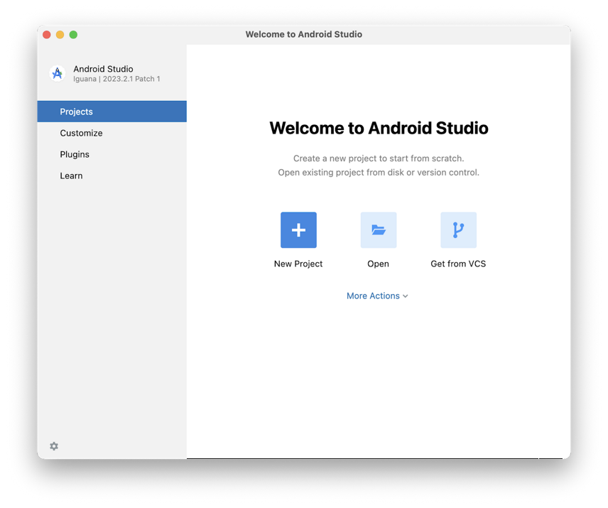
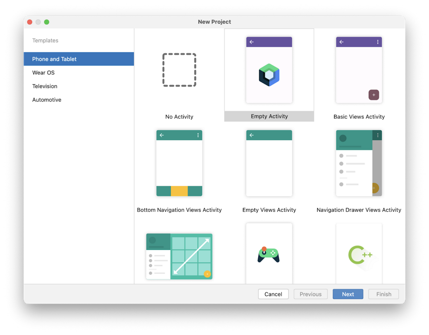

# Prima Aplicatie

Pentru a crea un proiect în Android Studio:

1. Porniți Android Studio.

2. În dialogul **Welcome to Android Studio**, faceți clic pe **New Project**.

Se deschide fereastra **New Project** cu o listă de Project Templates furnizate de Android Studio.

În Android Studio, Project Template este un proiect Android care oferă
blueprint pentru un anumit tip de aplicație. Template-urile creează
structura proiectului și fișierele necesare pentru ca Android Studio să
construiască proiectul.

3. Asigurați-vă că **Phone and Tablet** este selectată.

4. Faceți clic pe template-ul **Empty Activity** pentru a-l selecta ca template pentru proiect. Șablonul **Empty Activity** este utilizat pentru crearea unei aplicatii simple. Are un singur ecran și afișează textul `"Hello Android!"`.

5. Faceți clic pe **Next**. Se deschide dialogul **New Project**. Acesta are câteva câmpuri pentru configurarea proiectului.

6. Configurați proiectul după cum urmează:

În câmpul **Name**, introduceți numele proiectului, de exemplu `Hello Android`.

Lăsați câmpul **Package name** așa cum este. Acesta reprezintă modul în care fișierele vor fi organizate în structura de fișiere. În acest caz, numele pachetului va fi `com.example.greetingcard`.

Lăsați câmpul **Save location** așa cum este. Acesta conține locația unde sunt salvate toate fișierele legate de proiect. 

Selectați **API 24: Android 7.0 (Nougat)** din meniul din câmpul **Minimum SDK**. Minimum SDK indică versiunea minimă de Android pe care aplicația poate rula.

7. Faceți clic pe **Finish**. Acest lucru poate dura ceva timp - este un moment bun pentru a vă lua o ceașcă de ceai! În timp ce Android Studio se configurează, o bară de progres și un mesaj indică dacă Android Studio încă configurează proiectul. Ar putea arăta astfel:

Un mesaj care arată similar cu acesta vă informează când configurarea proiectului este finalizată.

8. Faceți clic pe **Split** în partea dreaptă sus a Android Studio, acest lucru vă permite să vizualizați atât codul, cât și designul. De asemenea, puteți face clic pe **Code** pentru a vizualiza doar codul sau faceți clic pe **Design** pentru a vizualiza doar designul.

După apăsarea **Split**, ar trebui să vedeți trei zone:

* Vizualizarea **Project** (1) arată fișierele și directoarele proiectului 
* Vizualizarea **Code** (2) este locul unde editați codul
* Vizualizarea **Design** (3) este locul unde previzualizați cum arată aplicația

8. Faceți clic pe **Build & Refresh**. Poate dura ceva timp pentru a se construi, dar când este gata, previzualizarea arată o casetă de text care spune "**Hello Android!**". Empty Compose activity conține tot codul necesar pentru a crea această aplicație.

