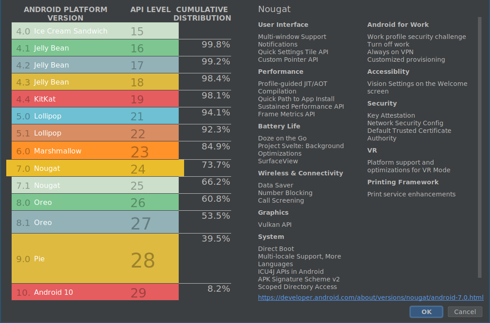

### Versiuni Android

Pana in acest moment au fost lansate mai multe versiune de Android. In tabelul
de mai jos le putem observa.

| Versiune Android | Nivel API | Data Lansării |  Nume de Cod       | Cota de Piață |
|------------------|-----------|---------------|--------------------|---------------|
|   10             |    29     |  03.09.2019   |      ??            |      0.?%     |
|   9              |    28     |  21.08.2017   |      Pie           |      0.?%     |
|   8.1 - 8.1      |    26-27  |  21.08.2017   |      Oreo          |      0.?%     |
|   7.1 - 7.1.1    |    25     |  04.10.2016   |      Nougat        |      0.3%     |
|       7.0        |    24     |  22.08.2016   |      Nougat        |      0.9%     |
|   6.0 - 6.0.1    |    23     |  05.10.2015   |    Marshmellow     |     30.7%     |
|   5.1 - 5.1.1    |    22     |  09.03.2015   |      Lollipop      |     23.1%     |
|   5.0 - 5.0.2    |    21     |  12.11.2014   |      Lollipop      |      9.8%     |
|  4.4W - 4.4W.2   |    20     |  25.06.2014   |  KitKat ext        |               |
|   4.4 - 4.4.4    |    19     |  31.10.2013   |       KitKat       |     21.9%     |
|       4.3        |    18     |  24.07.2013   |     Jelly Bean     |      1.6%     |
|      4.2.x       |    17     |  13.11.2012   |     Jelly Bean     |      5.7%     |
|      4.1.x       |    16     |  09.07.2012   |     Jelly Bean     |      4.0%     |
|  4.0.3 - 4.0.4   |    15     |  16.12.2011   |  Ice Cream Sandwich|     1.0%      |
|   4.0 - 4.0.2    |    14     |  19.10.2011   |  Ice Cream Sandwich|               |
|       3.2        |    13     |  15.07.2011   |     Honeycomb      |               |
|       3.1        |    12     |  10.05.2011   |     Honeycomb      |               |
|       3.0        |    11     |  22.02.2011   |     Honeycomb      |               |
|  2.3.3 - 2.3.7   |    10     |  09.02.2011   |    Gingerbread     |     1.0%      |
|   2.3 - 2.3.2    |     9     |  06.12.2010   |    Gingerbread     |               |
|   2.2 - 2.2.3    |     8     |  20.05.2010   |       Froyo        |               |
|       2.1        |     7     |  12.01.2010   |       Eclair       |               |
|      2.0.1       |     6     |  03.12.2009   |       Eclair       |               |
|       2.0        |     5     |  26.10.2009   |       Eclair       |               |
|       1.6        |     4     |  15.09.2009   |       Donut        |               |
|       1.5        |     3     |  30.04.2009   |      Cupcake       |               |
|       1.1        |     2     |  09.02.2009   |                    |               |
|       1.0        |     1     |  23.09.2008   |                    |               |

Pentru identificarea versiunilor se folosesc, de regulă, trei sisteme:

- un număr, ce respectă formatul major.minor[.build], desemnând dacă
modificările aduse sunt substanțiale sau reprezintă ajustări ale unor probleme
identificate anterior; versiunea curentă este 10, lansată la sfârșitul anului
2019;
- un nivel de API (același putând grupa un număr de mai multe versiuni), prin
care se indică funcționalitățile expuse către programatori; versiunea curentă
are nivelul de API 29;
- o denumire, având un nume de cod inspirat din lumea dulciurilor; termenii
respectivi încep cu inițiale care respectă ordinea alfabetică; versiunea curentă
este Q.

În momentul în care se ia decizia cu privire la versiunea pentru care se
dezvoltă o aplicație Android, trebuie avute în vedere și cotele de piață ale
dispozitivelor mobile. Dezvoltarea unei aplicații Android pentru cea mai nouă
versiune are avantajul de a se putea utiliza cele mai noi funcționalități expuse
prin API. Dezvoltarea unei aplicații Android pentru cea mai veche versiune are
avantajul unei adresabilități pe scară largă. Un compromis în acest sens poate
fi obținut prin intermediul **bibliotecilor de suport**, dezvoltate pentru
fiecare versiune, prin intermediul cărora pot fi utilizate la niveluri de API
mai mici funcționalități din niveluri de API mai mari (în limita capabilităților
dispozitivului mobil respectiv). Utilizarea acestora reprezintă o practică
recomandată în dezvoltarea aplicațiilor Android.