# Laborator 10. Gestiunea Apelurilor Multimedia folosind SIP & VoIP

## SIP (Session Initiation Protocol)

SIP (Session Initiation Protocol) este un protocol de nivel aplicație,
definit de [RFC 3261](https:*www.ietf.org/rfc/rfc3261.txt), folosit
împreună cu alte protocoale pentru a gestiona sesiunile de comunicație
multimedia la nivelul Internetului. Este frecvent folosit în cadrul
tehnologiei VoIP, una dintre cele mai ieftine, portabile, flexibile și
facile soluții pentru transmiterea de conținut audio și video prin
intermediul rețelei de calculatoare. Singura cerință impusă pentru
folosirea tehnologiei VoIP este existența unei legături la Internet.

Prin intermediul SIP sunt gestionate **sesiuni** care reprezintă o
legătură punct la punct, un canal de comunicație între două entități.
Este inspirat de HTTP și SMTP, de la care a preluat arhitectura
client-server, respectiv schemele de codificare ale mesajelor, împărțite
în antet și corp. SIP folosește SDP (Session Decription Protocol) pentru
a califica o sesiune (unicast sau multicast) și RTP (Real Time Transport
Protocol) pentru a transmite conținutul multimedia prin intermediul
Internetului.

În cadrul infrastructurii de comunicație, fiecare element este
identificat prin intermediul unui URI (Uniform Resource Identifier),
având un rol determinat:

-   **agent utilizator** (*eng.* user agent) reprezintă o entitate care
    comunică (telefon mobil, tabletă, calculator): aceasta poate porni
    sau opri o sesiune și de asemenea poate opera modificări asupra ei;
    poate fi de mai multe tipuri:
    -   UAC (User Agent Client) - entitatea care trimite cererea și
        primește răspunsul;
    -   UAS (User Agent Service) - entutatea care primește cererea și
        trimite răspunsul;
-   **agent intermediar** (*eng.* proxy server) reprezintă un element
    din cadrul rețelei de calculatoare care retransmite mesajul între
    agenți; acesta poate înțelege conținutul mesajului, pe baza căruia
    decide pe ce rută să îl ghideze; numărul de astfel de elemente între
    doi agenți utilizatori este de maximum 70; poate fi de mai multe
    tipuri:
    -   cu stare (*eng.* stateful) - reține informații despre mesajele
        pe care le-a prelucrat și le poate folosi (în situația în care
        nu se primește nici un răspuns sau în situația în care mesajul
        ajunge încă o dată sub aceeași formă);
    -   fără stare (*eng.* stateless) - nu reține informații despre
        mesajele pe care le-a prelucrat;
-   **serverul de înregistrare** (*eng.* registrar server) reține
    URI-uri despre entități pe care le stochează într-o bază de date și
    pe care le partajează cu alte servere de înregistrare din cadrul
    aceluiași domeniu; prin intermediul său, agenții utilizatori se
    autentifică în cadrul rețelei de calculatoare;
-   **serverul de redirectare** (*eng.* redirect server) verifică baza
    de date cu locații, transmițând un răspuns către agentul utilizator;
-   **serverul de localizare** (*eng.* location server) oferă informații
    cu privire la plasarea posibilă a agentului utilizator către
    serverele intermediare sau serverele de redirectare (doar acestea îl
    pot accesa)

Un **flux operațional** standard al unei sesiuni SIP implică următoarele
operații:

1.  tranzacția 1:
    1.  un agent utilizator (sursă) trimite o cerere de tip `INVITE`
        către un agent intermediar în scopul de a contacta un alt agent
        utilizator (destinație);
    2.  agentul intermediar
        1.  trimite înapoi (imediat) un răspuns de tip `100 Trying`
            către agentul utilizator sursă (pentru ca acesta să nu mai
            transmită nimic);
        2.  caută agentul utilizator destinație folosind un server de
            localizare și îi trimite (mai departe) cererea de tip
            `INVITE`;
    3.  agentul utilizator destinație transmite, prin intermediul
        agentului intermediar, un răspuns de tipul `180 Ringing`, către
        agentul utilizator sursă;
2.  tranzacția 2: în momentul în care agentul utilizator destinație este
    contactat, acesta transmite, tot prin intermediul agentului
    intermediar, un răspuns de tipul `200 OK`, către agentul utilizator
    sursă și, din acest moment, **conexiunea este realizată**,
    transmițându-se pachete RTP în ambele sensuri;
3.  tranzacția 3: orice participant poate transmite un mesaj de tipul
    `BYE` pentru a termina legătura, fiind necesar ca acesta să fie
    confirmat prin `200 OK` de către cealaltă parte.


Se observă faptul că o sesiune de comunicare este împărțită în mai multe
**tranzacții** care împreună alcătuiesc un **dialog**.

**Mesajele** în protocolul SIP sunt de două tipuri:

-   **cereri** au forma `<METODĂ> <URI>` unde metodele pot fi:
    -   de bază
        -   `INVITE` reprezintă o cerere pentru deschiderea unei sesiuni
            cu un agent utilizator, putând conține informații de tip
            multimedia în corpul său; aceasta este considerată că a fost
            îndeplinită cu succes dacă s-a primit un cod de răspuns de
            tipul `2xx` sau s-a transmis un `ACK`; un dialog stabilit
            între doi agenți utilizatori continuă până în momentul în
            care se transmite un mesaj de tipul `BYE`;
        -   `BYE` este metoda folosită pentru a închide o sesiune cu un
            agent utilizator, putând fi trimisă de oricare dintre
            entitățile din canalul de comunicație, fără a trece prin
            serverul de înregistrare;
        -   `REGISTER` indică o cerere de înregistrare a unui agent
            utilizator către un server de înregistrare; un astfel de
            mesaj este transmis mai departe până ajunge la o entitate
            care deține autoritatea de a realiza această operație; o
            înregistrare poate fi realizată de un agent utilizator în
            numele altui agent utilizator (*eng.* third party
            registration);
        -   `CANCEL` este operația folosită pentru a închide o sesiune
            care nu a fost încă deschisă, putând fi transmisă fie de
            către un agent utilizator fie de către un agent intermediar;
        -   `ACK` este folosit pentru a confirma o cerere de tip
            `INVITE`;
        -   `OPTIONS` este utilizat pentru a interoga un agent
            utilizator sau un server intermediar despre capabilitățile
            sale și pentru a determina disponibilitatea sa, rezultatul
            fiind o listă a funcționalităților entității respective;
    -   extensii: `SUBSCRIBE`, `NOTIFY`, `REFER`, `INFO`, `UPDATE`,
        `PRACK`, `MESSAGE`;
-   **răspunsuri** reprezintă un mesaj generat de un agent utilizator de
    tip server sau de un server SIP în replică la o cerere provenită de
    la un agent utilizator de tip client; acesta poate reprezenta
    inclusiv o confirmare formală pentru a preveni retransmisiile;
    există mai multe tipuri de coduri de răspuns:

| CLASA | TIP        | DESCRIERE        | ACȚIUNE                                                                                                                                                       |
|-------|------------|------------------|---------------------------------------------------------------------------------------------------------------------------------------------------------------|
| 1xx   | Provizoriu | Informație       | Se precizează starea unui apel înainte ca un rezultat să fie disponibil.                                                                                      |
| 2xx   | Definitiv  | Succes           | Cererea a fost procesată cu succes. Pentru cereri de tip `INVITE` se întoarce `ACK`. Pentru alte tipuri cereri, se oprește retransmiterea acestora.           |
| 3xx   | :::        | Redirectare      | Se indică faptul că au fost furnizate mai multe locații posibile astfel încât ar trebui interogat un alt server pentru a se putea obține informația necesară. |
| 4xx   | :::        | Eroare la Client | Cererea nu a fost procesată cu succes datorită unei erori la client, fiind necesar ca aceasta să fie reformulată.                                             |
| 5xx   | :::        | Eroare la Server | Cererea nu a fost procesată cu succes datorită unei erori la server, putând fi retransmisă către o altă entitate.                                             |
| 6xx   | :::        | Eroare Globală   | Cererea a eșuat și nu există nici o șansă de a fi procesată corect pe o altă entitate, nici măcar dacă este reformulată.                                      |

Exemple:

-   `100 Trying`, `180 Ringing`, `181 Call is Being Forwarded`,
    `182 Call Queue`, `183 Session Progress`;
-   `200 OK`, `202 Accepted`;
-   `300 Multiple Choices`, `301 Moved Permanently`,
    `302 Moved Temporarily`, `305 Use Proxy`, `380 Alternative Service`;
-   `400 Bad Request`, `401 Unauthorized`, `403 Forbidden`,
    `404 Not Found`, `405 Method Not Allowed`, `406 Not Acceptable`,
    `407 Proxy Authentication Required`, `408 Request Timeout`,
    `422 Session Timer Interval Too Small`, `423 Interval Too Brief`,
    `480 Temporarily Unavailable`,
    `481 Dialog/Transaction Does Not Exist`, `483 Too Many Hops`,
    `486 Busy Here`, `487 Request Terminated`;
-   `500 Server Internal Error`, `501 Not Implemented`,
    `502 Bad Gateway`, `503 Service Unavailable`, `504 Gateway Timeout`,
    `505 Version Not Supported`, `513 Message Too Large`,
    `580 Preconditions Failure`;
-   `600 Busy Everywhere`, `603 Decline`, `604 Does Not Exist Anywhere`,
    `606 Not Acceptable`.

## Configurare

---
**Note**

În cadrul acestui laborator este necesar un dispozitiv
mobil fizic sau un emulator cu acces la microfonul sistemului de
operare. De asemenea, pe dispozitivul mobil trebuie să fie instalat
Google Play Services întrucât este necesară descărcarea și instalarea
unei aplicații Android
([CSipSimple](https:*github.com/eim-lab/util/blob/master/apk/CSipSimple_v1.02.03.com.apk),
sau Linphone din Playstore) pentru realizarea de apeluri telefonice
folosind SIP & VoIP.\

---

Se va utiliza, la alegere, un furnizor (gratuit) de servicii SIP,
accesibil ulterior înregistrării (creării unui cont):

-   recomandare 1: [Linphone](https:*www.linphone.org/freesip/)
-   recomandare 2: [PBXES](https:*www1.pbxes.com/index.php)
-   sunt mulți alți provideri de SIP care oferă diverse servicii contra
    cost: numere de telefon stabile în diverse țări, SMS, cutii poștale
    vocale, rutarea apelurilor de la și căre PSTN prin SIP, etc
-   În această secțiune vă veti crea un cont, si veti obtine credențiale
    de acest tip:

| Phone Configuration                | SIP account              |
|------------------------------------|--------------------------|
| Address of Record:                 | eim-lab@sip.linphone.org |
| SIP Password:                      | YoUrPaSs                 |
| Username:                          | eim-lab                  |
| Domain/<Proxy:%7Csip.linphone.org> |                          |

### OnSIP

Serviciul [OnSIP](https:*www.onsip.com/getonsip) nu mai este ușor de
folosit pentru conturi free din 2021 m(

### Utilizare pe Dispozitivul Mobil

#### Adrese SIP pentru Testare

Un contact de tip SIP poate fi realizat folosind aplicația nativă
*Contacts*, folosind, în mod obișnuit, opțiunea *Create a New Contact*.

<center>

|                                                                                                                       |                                                                                                                                       |
|-----------------------------------------------------------------------------------------------------------------------|---------------------------------------------------------------------------------------------------------------------------------------|
| ![](images/testcall01new.png" class="align-center" width="300" alt="testcall01new.png" /> | = 5                                                                                                                      |

|                                                                                                                       |                                                                                                                                       |
|-----------------------------------------------------------------------------------------------------------------------|---------------------------------------------------------------------------------------------------------------------------------------|
| .

<center>

|                                                                                                                       |                                                                                                                                       |
|-----------------------------------------------------------------------------------------------------------------------|---------------------------------------------------------------------------------------------------------------------------------------|
| .

În agenda telefonică, contactul respectiv va fi identificat printr-o
pictogramă specifică (indicând faptul că acesta este de tip SIP), fiind
apelat în mod implicit folosind protocolul respectiv.

<center>

|                                                                                                                       |                                                                                                                                       |
|-----------------------------------------------------------------------------------------------------------------------|---------------------------------------------------------------------------------------------------------------------------------------|
| , în kernelul
Android a fost implementat protocolul SIP, acesta putând fi accesat în
aplicația *Phone*, secțiunea *Settings* → *Internet Calling* →
*Accounts* (sau *Settings* → *Calls* → *Calling Accounts* → *SIP
Accounts*) și **utilizat exclusiv pentru apeluri de voce**. Totuși, nu
sunt încă implementate toate funcționalitățile specifice (apeluri video,
mesagerie instantanee).

Se accesează aplicația *Phone* și din meniul acesteia intrarea
*Settings*.

<center>

|                                                                                                                               |                                                                                                                                               |
|-------------------------------------------------------------------------------------------------------------------------------|-----------------------------------------------------------------------------------------------------------------------------------------------|
| ![](images/androidstack01new.png" class="align-center" width="300" alt="androidstack01new.png" /> | = 5                                                                                                                              |

</center>

În sistemele de operare Android cu versiuni mai mici decât 5, se
accesează *Call settings* → *Internet call settings* → *Accounts*:

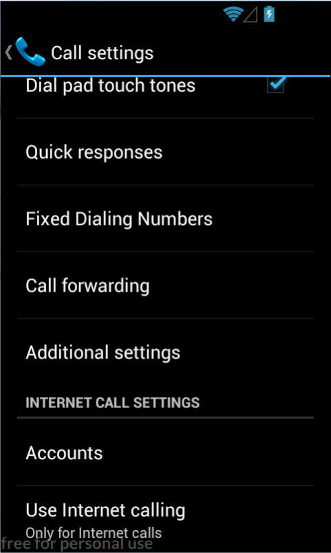

În sistemele de operare Android cu versiuni mai mari sau egale cu 5, se
parcurg următoarele ecrane *Calls* → *Calling Accounts* → *SIP
Accounts*:

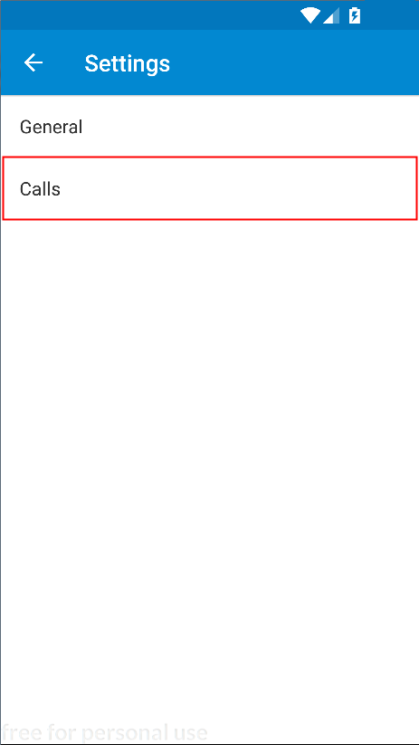

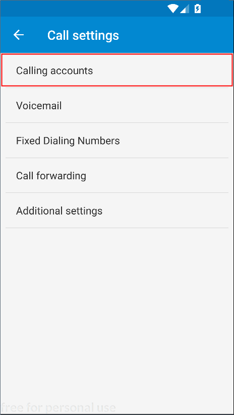

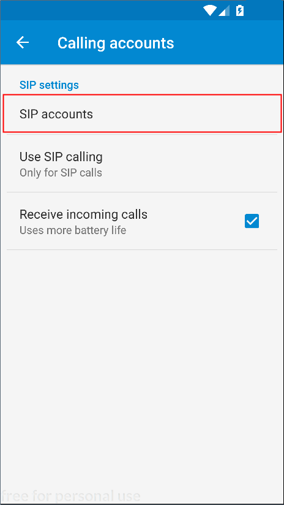

---
**Note**

Pentru a se putea recepționa apeluri VoIP, este necesar
să se selecteze opțiunea *Receive incoming calls*. O astfel de abordare
poate conduce însă la un consum de energie mult mai rapid și la
epuizarea bateriei.\

---

Definirea unui cont de tip SIP se realizează prin accesarea opțiunii
*Add Account*:

<center>

|                                                                                                                               |                                                                                                                                               |
|-------------------------------------------------------------------------------------------------------------------------------|-----------------------------------------------------------------------------------------------------------------------------------------------|
| ;
-   transmiterea de mesaje de tip keep-alive.

<center>

|                                                                                                                               |                                                                                                                                               |
|-------------------------------------------------------------------------------------------------------------------------------|-----------------------------------------------------------------------------------------------------------------------------------------------|
| .

<center>

|                                                                                                                               |                                                                                                                                               |
|-------------------------------------------------------------------------------------------------------------------------------|-----------------------------------------------------------------------------------------------------------------------------------------------|
| ![](images/androidstack05new.png" class="align-center" width="300" alt="androidstack05new.png" /> | = 5                                                                                                                              |

</center>

Începând cu versiunea 5 a sistemului de operare Android, în secțiunea
*Calling accounts* există posibilitatea de a preciza ce cont este
folosit în mod implicit pentru realizarea de apeluri telefonice. Se
recomandă selectarea opțiunii *Ask first* astfel încât pentru fiecare
contact să se poată preciza mecanismul utilizat pentru plasarea sa.

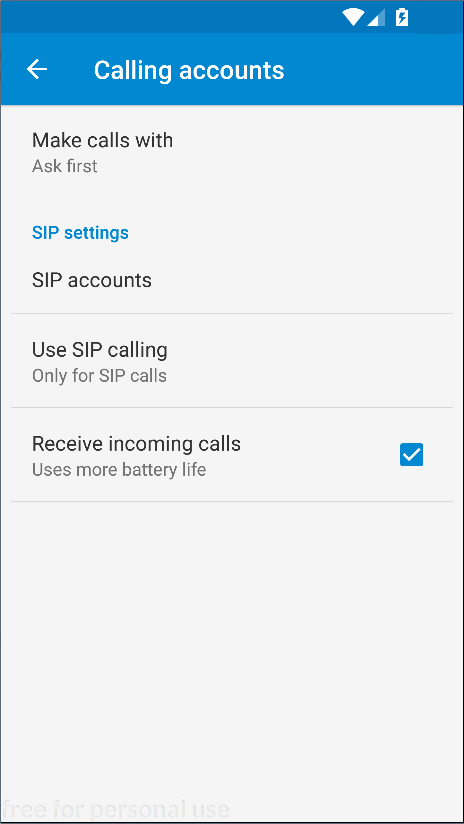

Prin accesarea unui contact de tip SIP din agenda telefonică, se va
utiliza contul specific pentru realizarea apelului telefonic.

<center>

|                                                                                                                               |                                                                                                                                               |
|-------------------------------------------------------------------------------------------------------------------------------|-----------------------------------------------------------------------------------------------------------------------------------------------|
| .
Ulterior descărcării, utilizatorului îi sunt solicitate acordarea de
permisiuni pentru ca această aplicație să poată fi instalată.

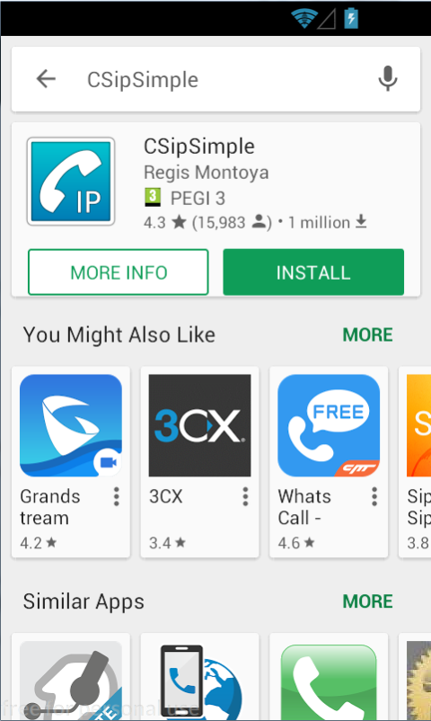

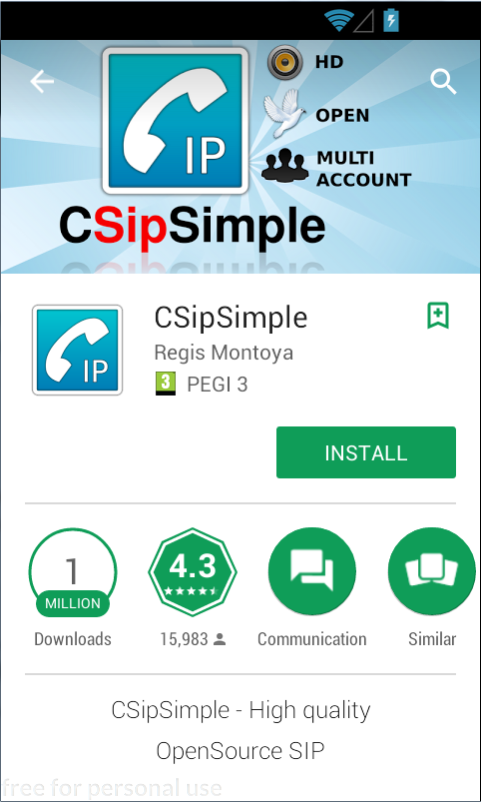

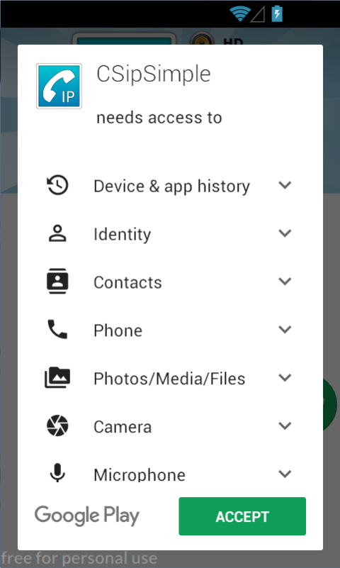

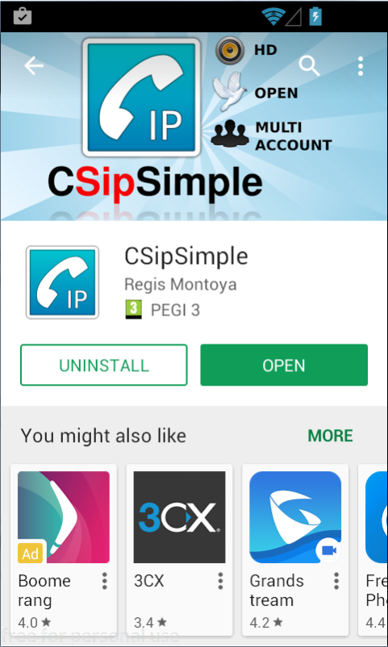

Aplicația CSipSimple pune la dispoziția utilizatorilor mai multe
șabloane pentru definirea unui cont SIP. Se recomandă să se utilizeze
șabloanele corespunzătoare furnizorului de servicii SIP dorit, iar în
situația în care acesta nu este disponibil, se poate folosi opțiunea
*Generic* care permite configurarea tuturor parametrilor:

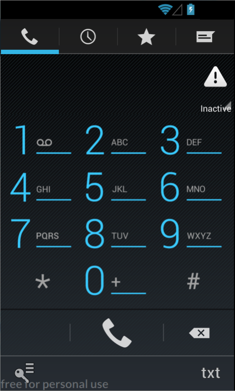

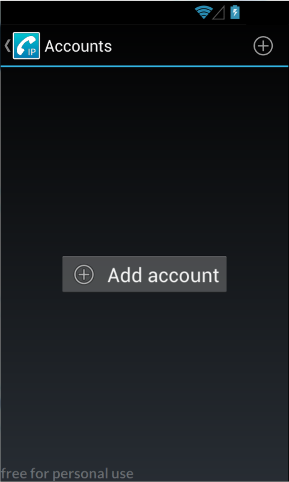

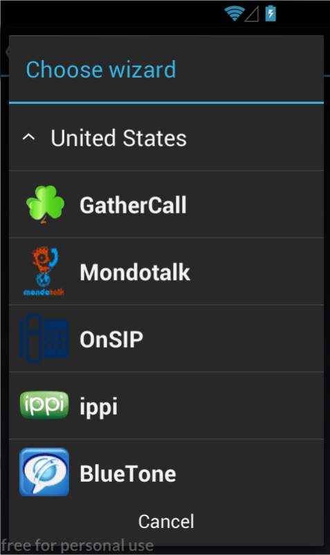

Pentru **contul de tip `OnSIP`** se precizează următorii parametri:

-   denumirea contului: `OnSIP`
-   numele de utilizator: `informaticamobila2017`
-   identificatorul folosit pentru autentificare, de regulă același cu
    denumirea domeniului: `upb`;
-   parola (din secțiunea *View Profile*, nu cea folosită la definirea
    contului);
-   domeniul: `upb.onsip.com`

---
**Note**

În situația în care se folosește emulatorul Genymotion,
pentru a se evita transcrierea parolelor foarte lungi, se poate realiza
operația de tip Copy-Paste din mașina fizică în mașina virtuală folosind
operația de tip apăsare cu o durată de timp mai mare (*eng.* long
press).\

---

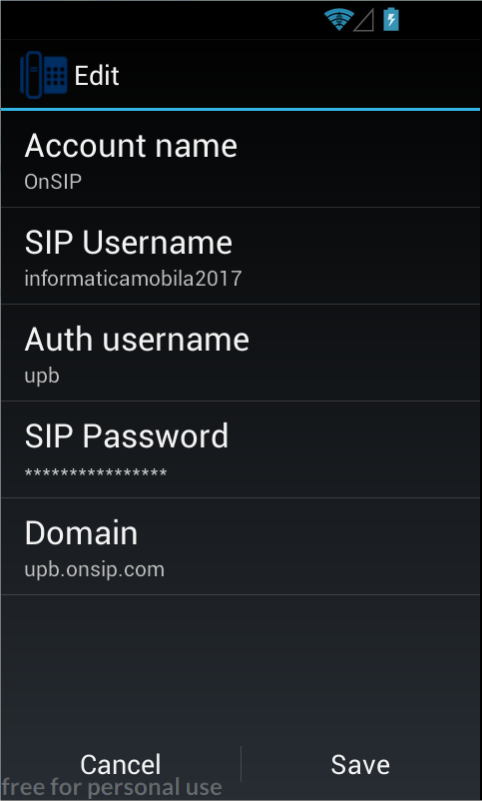

Contactele de tip SIP sunt vizibile în meniul aplicației CSipSimple
astfel încât să poată fi plasate apeluri de tip SIP / VoIP:

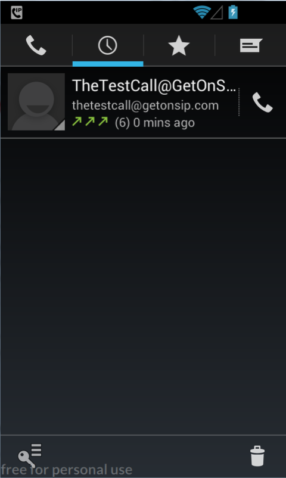

Și pentru **contul de tip PBXes** există un șablon predefinit:

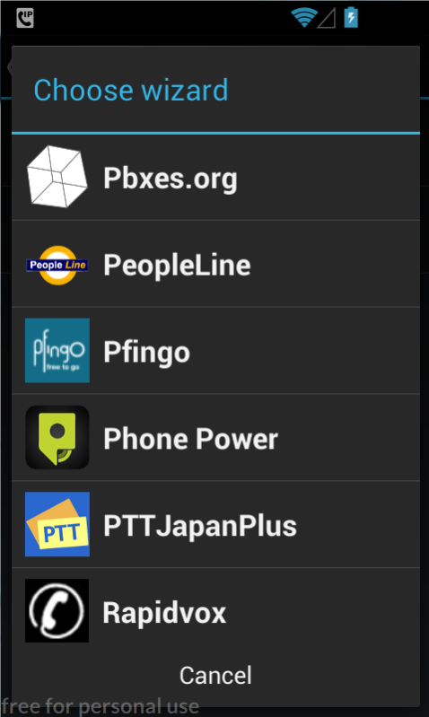

Trebuie să fie specificați următorii parametrii:

-   denumirea contului: `Pbxes.org`
-   numele de utilizator (**se utilizează extensia**):
    `informatmob2017-100`
-   parola (**se utilizează extensia**);

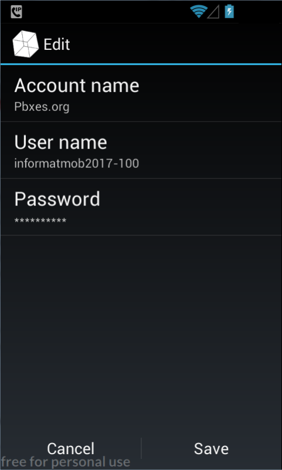

În secțiunea *Accounts*, contul SIP poate fi în orice moment activat sau
dezactivat. Starea acestuia este vizibilă sub denumirea sa, culoarea
folosită fiind sugestivă pentru rezultatul operației de înregistrare:

-   verde: operația a fost realizată cu succes;
-   roșu: s-a produs o eroare; eroarea de tipul *Registration timeout*
    denotă faptul că în NAT/SIP nu se translatează corect adresele
    interne
    -   rețeaua Digi.Mobil/4G funcționează corespunzător;
    -   în facultate, rețelele wireless `ACS-UPB-OPEN`, `eduroam`,
        `Java-ED117` nu creează probleme; în schimb, rețeaua `change`
        blochează anumite porturi ceea ce împiedică comunicația cu
        serverul SIP.

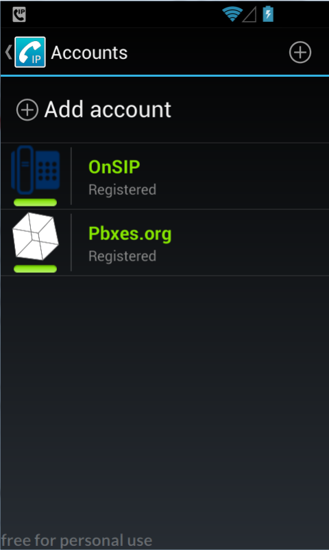

## Android NGN Stack

[Stiva
SIP](http:*developer.android.com/guide/topics/connectivity/sip.html)
face parte din SDK-ul Android începând cu versiunea 2.3 (Gingerbread,
API level 9), însă nu dispune încă de toate funcționalitățile (mesagerie
instantanee, apeluri video). Totuși, poate fi utilizat pentru apeluri
audio, funcționalitatea fiind disponibilă în *Phone* → *Settings* →
*Internet Calling* (începând cu versiunea 5 a sistemului de operare
Android, *SIP Accounts*).

Se preferă însă utilizarea API-ului NGN (New Generation Networking),
care implementează o stivă SIP completă, dispunând și de documentarea
metodelor care pot fi utilizate:
<https:*imsdroid.googlecode.com/svn-history/r381/branches/2.0/android-ngn-stack-00.pdf>.

Pentru integrarea acestei funcționalități în cadrul unui proiect Android
Studio, este necesat ca inițial să se cloneze depozitul `imsdroid`
corespunzător [contului Github al organizației Doubango
Telecom](https:*github.com/DoubangoTelecom/imsdroid).

    student@eim-lab:~$ git clone https:*github.com/DoubangoTelecom/imsdroid.git

Din cadrul acestui depozit la distanță, nu se va reține decât proiectul
`android-ngn-stack`, din care vor fi eliminate fișierele corepunzătoare
depozitului GitHub.

Pentru a integra această funcționalitate în cadrul aplicației Android,
proiectul trebuie să fie referit în fișierul `build.gradle`, după ce
este adus în structura de directoare sub formă de modul, astfel încât
acesta să fie compilat în momentul în care se construiește fișierul
.apk:


``` build.gradle
dependencies {
  ...
  compile project(':android-ngn-stack')
}
```

Cu toate acestea, proiectul `android-ngn-stack` nu poate fi folosit ca
atare, fiind necesar să îi fie aduse o serie de modificări pentru a
putea fi utilizat:

**1.** În fișierul `build.gradle` corespunzător proiectului
`android-ngn-stack` trebuie să se utilizeze aceeași versiune pentru
SDK-ul de Android și pentru utilitarele de construire a aplicației,
astfel încât să nu fie necesar să fie descărcate mai multe versiuni pe
aceeași mașină. Mai mult, dacă se folosește o versiune de SDK mai mare
sau egală cu 23, este necesar să se specifice explicit folosirea
bibliotecii Apache HTTP Components, întrucât începând de la acest nivel,
suportul pentru ea a fost întrerupt.

``` build.gradle
android {
  compileSdkVersion 25
  buildToolsVersion "25.0.2"
  ...
  useLibrary 'org.apache.http.legacy'
}
```

**2.** În fișierul `AndroidManifest.xml` corespunzător proiectului
`android-ngn-stack` trebuie să se elimine proprietatea `android:icon`
din elementul `<application>` de vreme ce și proiectul principal deține
o astfel de proprietate, generându-se astfel un conflict în momentul în
care se construiește aplicația:

``` xml
<manifest ...>
  <application
    android:name="NgnApplication"
    android:label="@string/app_name">
    <string name="doubango_revision">1309</string>
    <service android:name="NgnNativeService"/>
  </application>
  <!-- ... -->
</manifest>
```

**3.** În clasa `NgnEngine.java` poate fi necesar să se modifice
biblioteca partajată încărcată în momentul în care se detectează că
dispozitivul mobil deține [un procesor cu capabilități SIMD (ARM v7 /
ARM v8)](https:*developer.android.com/ndk/guides/cpu-arm-neon.html).
Acest lucru este în special valabil pentru emulatoare, care publică
anumite capabilități pe care nu le implementează însă propriu-zis.
Într-o astfel de situație, este necesar să se încarce biblioteca
partajată `tinyWrap.so` în loc de `tinyWRAP_neon.so`.

``` java
private static void initialize2() {
  * ...
  
  * lines 104-116
  boolean haveLibUtils = new File(String.format("%s/%s", NgnEngine.LIBS_FOLDER, "libutils_armv5te.so")).exists();
  if (haveLibUtils) { * only "armeabi-v7a" comes with "libutils.so"
    System.loadLibrary("utils_armv5te");
    Log.d(TAG,"CPU_Feature="+AndroidUtils.getCpuFeatures());
    if(NgnApplication.isCpuNeon()){
      Log.d(TAG,"isCpuNeon()=YES");
      System.loadLibrary("tinyWRAP");
    }
    else{
      Log.d(TAG,"isCpuNeon()=NO");
      System.loadLibrary("tinyWRAP");
    }
  }
  
  * ...

}
```

Inițial, este necesar să se obțină o referință către obiectul de tip
`NgnEngine`. Acest lucru poate fi realizat prin intermediul metodei
statice `getInstance()` (așa cum era de așteptat, `NgnEngine` este
singleton). De regulă, o astfel de operație este realizată pe metoda
`onCreate()` a activității principale a aplicației Android.

``` java
ngnEngine = NgnEngine.getInstance();
if (ngnEngine == null) {
  Log.i(Constants.TAG, "Failed to obtain the NGN engine!");
}
```

Motorul NGN trebuie configurat, prin specificarea unor parametri,
reținuți sub forma unor perechi de tipul (cheie, valoare).

Pentru ca serviciul SIP să poată fi accesat, trebuie specificate:

-   `NgnConfigurationEntry.IDENTITY_IMPI`: identificatorul
    utilizatorului folosit pentru autorizare (`upb`);
-   `NgnConfigurationEntry.IDENTITY_IMPU`: adresa SIP (sub forma
    `sip:<username>@<domain>`) - `informaticamobila2017@upb.onsip.com`;
-   `NgnConfigurationEntry.IDENTITY_PASSWORD`: parola
-   `NgnConfigurationEntry.NETWORK_PCSCF_HOST`: adresa proxy-ului la
    care se realizează conexiunea (`sip.onsip.com`);
-   `NETWORK_PCSCF_PORT`: portul pe care se face acest lucru (5060)
-   `NETWORK_REALM`: rețeaua din care face parte (`upb.onsip.com`).

Pot fi indicate și utilizarea rețelei 3G (implicit, dezactivată) precum
și timpul de așteptare în cazul operației de înregistrare.

``` java
public void configureStack() {
  NgnEngine ngnEngine = NgnEngine.getInstance();
  INgnConfigurationService ngnConfigurationService = ngnEngine.getConfigurationService();
  ngnConfigurationService.putString(NgnConfigurationEntry.IDENTITY_IMPI, Constants.IDENTITY_IMPI);
  ngnConfigurationService.putString(NgnConfigurationEntry.IDENTITY_IMPU, String.format("sip:%s@%s", Constants.USERNAME, Constants.DOMAIN));
  ngnConfigurationService.putString(NgnConfigurationEntry.IDENTITY_PASSWORD, Constants.IDENTITY_PASSWORD);
  ngnConfigurationService.putString(NgnConfigurationEntry.NETWORK_PCSCF_HOST, Constants.NETWORK_PCSCF_HOST);
  ngnConfigurationService.putInt(NgnConfigurationEntry.NETWORK_PCSCF_PORT, Constants.NETWORK_PCSCF_PORT);
  ngnConfigurationService.putString(NgnConfigurationEntry.NETWORK_REALM, Constants.NETWORK_REALM);

  ngnConfigurationService.putBoolean(NgnConfigurationEntry.NETWORK_USE_3G, true);
  ngnConfigurationService.putInt(NgnConfigurationEntry.NETWORK_REGISTRATION_TIMEOUT, Constants.NETWORK_REGISTRATION_TIMEOUT);

  ngnConfigurationService.commit();
}
```

Ulterior, motorul NGN trebuie să fie pornit.

``` java
public boolean startNgnEngine() {
  if (!ngnEngine.isStarted()) {
    if (!ngnEngine.start()) {
      Log.e(Constants.TAG, "Failed to start the NGN engine!");
      return false;
    }
  }
  return true;
}
```

Pe baza acestui obiect, se poate obține un serviciu SIP de tipul
`INgnSipService` care pune la dispoziție metodele pentru obținerea de
sesiuni pe baza operațiilor de înregistrare / deînregistrare.

``` java
ngnSipService = ngnEngine.getSipService();
```

Operația de înregistrare presupune transmiterea unui context (al
aplicației Android) care este asociat serviciului SIP.

``` java
public void registerSipService() {
  if (!ngnSipService.isRegistered()) {
    ngnSipService.register(this);
  }
}
```

Pentru operația (simetrică) de deînregistrare, furnizarea unui astfel de
argument nu mai este necesară. Utilizatorul este cel care ar trebui să
dețină controlul asupra acestui tip de operații, prin intermediul unor
elemente din cadrul interfeței grafice.

``` java
public void unregisterSipService() {
  if (ngnSipService.isRegistered()) {
    ngnSipService.unRegister();
  }
}
```

Motorul NGN trebuie să fie oprit atunci când aplicația Android este
terminată. De regulă, o astfel de operație este realizată pe metoda
`onDestroy()` a activității principale.

``` java
public boolean stopNgnEngine() {
  if (ngnEngine.isStarted()) {
    if (!ngnEngine.stop()) {
      Log.e(Constants.TAG, "Failed to stop the NGN engine!");
      return false;
    }
  }
  return true;
}
```

---
**Note**

Este mai puțin frecvent ca operațiile de înregistrare /
deînregistrare să se realizeze pe metodele `onStart()` respectiv
`onStop()` deoarece execuția acestora poate fi destul de îndelungată
având un impact negativ asupra responsivității sistemului de
operare.\

---

În cazul **operațiilor de înregistrare / deînregistrare**, se poate
defini un **ascultător pentru mesaje cu difuzare**, care gestionează
acțiunile de tipul `NgnRegistrationEventArgs.ACTION_REGISTRATION_EVENT`.

Evenimentele ce pot fi tratate de un astfel de obiect sunt legate de:

-   rezultatul operației de înregistrare:
    -   `REGISTRATION_NOK`
    -   `REGISTRATION_OK`
    -   `REGISTRATION_INPROGRESS`
-   rezultatul operației de deînregistrare:
    -   `UNREGISTRATION_NOK`
    -   `UNREGISTRATION_OK`
    -   `UNREGISTRATION_INPROGRESS`

Operațiile de înregistrare (activare) respectiv deînregistrare
(dezactivare) a acestui ascultător pentru mesaje cu difuzare se face pe
metodele `onCreate()` respectiv `onDestroy()` ale activității.

``` java
public void enableRegistrationBroadcastReceiver() {
  registrationBroadcastReceiver = new RegistrationBroadcastReceiver(registrationStatusTextView);
  registrationIntentFilter = new IntentFilter();
  registrationIntentFilter.addAction(NgnRegistrationEventArgs.ACTION_REGISTRATION_EVENT);
  registerReceiver(registrationBroadcastReceiver, registrationIntentFilter);
}
```

``` java
public void disableRegistrationStateBroadcastReceiver() {
  if (registrationBroadcastReceiver != null) {
    unregisterReceiver(registrationBroadcastReceiver);
    registrationBroadcastReceiver = null;
  }
}
```

Implementarea ascultătorului pentru intenții cu difuzare având asociată
acțiunea `NgnRegistrationEventArgs.ACTION_REGISTRATION_EVENT` presupune
realizarea următoarelor operații:

-   verificarea acțiunii corespunzătoare intenției, aceasta trebuie să
    fie de tipul `NgnRegistrationEventArgs.ACTION_REGISTRATION_EVENT`;
-   se obțin argumentele asociate intenției cu difuzare; acestea au
    tipul `NgnRegistrationEventArgs` și pot fi obținute din câmpul
    `extra` al intenției, fiind regăsite sub cheia
    `NgnEventArgs.EXTRA_EMBEDDED`:
    -   se verifică tipul argumentului care reprezintă de fapt răspunsul
        care a fost obținut pentru operația de înregistrare /
        deînregistrare - în acest sens se folosește metoda
        `getEventType()` a obiectului de tip `NgnRegistrationEventArgs`;
    -   de regulă, tratarea fiecărui caz în parte nu presupune decât
        jurnalizarea sa și actualizarea corespunzătoare a controalelor
        din cadrul interfeței grafice.

``` java
public class RegistrationBroadcastReceiver extends BroadcastReceiver {

  @Override
  public void onReceive(Context context, Intent intent) {
    String action = intent.getAction();

    if (NgnRegistrationEventArgs.ACTION_REGISTRATION_EVENT.equals(action)) {

      NgnRegistrationEventArgs arguments = intent.getParcelableExtra(NgnEventArgs.EXTRA_EMBEDDED);

      if (arguments == null) {
        Log.d(Constants.TAG, "Invalid event arguments");
        return;
      }

      switch (arguments.getEventType()) {
        case REGISTRATION_NOK:
          Toast.makeText(context, "Failed to register", Toast.LENGTH_SHORT).show();
          Log.d(Constants.TAG, "Failed to register");
          break;
        case REGISTRATION_OK:
          Log.d(Constants.TAG, "You are now registered");
          break;
        case REGISTRATION_INPROGRESS:
          Log.d(Constants.TAG, "Trying to register...");
          break;
        case UNREGISTRATION_NOK:
          Toast.makeText(context, "Failed to unregister", Toast.LENGTH_SHORT).show();
          Log.d(Constants.TAG, "Failed to unregister");
          break;
        case UNREGISTRATION_OK:
          Log.d(Constants.TAG, "You are now unregistered");
          break;
        case UNREGISTRATION_INPROGRESS:
          Log.d(Constants.TAG, "Trying to unregister...");
          break;
      }
    }
  }
}
```

Se pot deschide sesiuni audio-video (`NgnAVSession`) respectiv pentru
mesagerie instantanee (`NgnMessagingSession`).

Obiectul de tip `NgnAVSession` este partajat la nivelul întregii
aplicații întrucât furnizează aproximativ toate metodele pentru
gestiunea apelurilor telefonice, indiferent de entitățile implicate.

``` java
NgnAVSession ngnAVSession = NgnAVSession.createOutgoingSession(
  NgnEngine.getInstance().getSipService().getSipStack(),
  NgnMediaType.AudioVideo
);
```

Obiectul de tip `NgnMessagingSession` va fi creat pentru fiecare
operație în parte ce implică comunicația dintre două entități, fiind
necesar ca aceasta să fie eliberată după ce operația respectivă a fost
procesată.

``` java
NgnMessagingSession instantMessagingSession = NgnMessagingSession.createOutgoingSession(
  NgnEngine.getInstance().getSipService().getSipStack(),
  remotePartyUri
);
```

``` java
NgnMessagingSession.releaseSession(instantMessagingSession);
```

Pentru gestiunea **apelurilor telefonice** se folosesc metodele
`makeCall()`, respectiv `hangUpCall()`, puse la dispoziție de obiectul
`INgnAVSession`.

-   metoda `makeCall()` primește ca argument un șir de caractere
    formatat, reprezentând un URI valid, acesta fiind furnizat prin
    intermediul metodei statice `NgnUriUtils.makeValidSipUri()`; de
    regulă, se respectă formatul `protocol:utilizator@domeniu`, în cazul
    de față protocolul fiind `sip`; metoda furnizează un rezultat de tip
    adevărat / fals;
-   metoda `hangUpCall()` nu primește nici un argument și furnizează un
    rezultat de tip adevărat / fals.

``` java
String validUri = NgnUriUtils.makeValidSipUri(SIPAddressEditText.getText().toString());
* ...
if (ngnAVSession != null && ngnAVSession.makeCall(validUri)) {
  Log.d(Constants.TAG, "Call succeeded");
} else {
  Log.d(Constants.TAG, "Call failed");
}
```

``` java
if (ngnAVSession != null) {
  ngnAVSession.hangUpCall();
  Log.d(Constants.TAG, "Hang up");
}
```

De asemenea, interfața `INgnAVSession` pune la dispoziție și metodele:

-   `acceptCall()`, prin intermediul căreia poate fi acceptat un apel
    audio-video, de îndată ce este detectată o comunicație de acest tip;
-   `getRemotePartyUri()`, prin intermediul căreia poate fi obținută
    adresa SIP (URI-ul) entității cu care se comunică la un moment dat.

În același scop, se poate defini un ascultător pentru mesaje cu
difuzare, care gestionează acțiunile de tipul
`NgnInviteEventArgs.ACTION_INVITE_EVENT`. Evenimentele ce pot fi tratate
de un astfel de obiect sunt:

-   `INCOMING`
-   `INCALL`
-   `TERMINATED` / `TERMINATING`
-   `NONE`

Operațiile de înregistrare (activare) respectiv deînregistrare
(dezactivare) a acestui ascultător pentru mesaje cu difuzare se face pe
metodele `onCreate()` respectiv `onDestroy()` ale activității.

``` java
public void enableVoiceCallBroadcastReceiver() {
  voiceCallBroadcastReceiver = new VoiceCallBroadcastReceiver(SIPAddressEditText, callStatusTextView);
  voiceCallIntentFilter = new IntentFilter();
  voiceCallIntentFilter.addAction(NgnInviteEventArgs.ACTION_INVITE_EVENT);
  registerReceiver(voiceCallBroadcastReceiver, voiceCallIntentFilter);
}
```

``` java
public void disableVoiceCallBroadcastReceiver() {
  if (voiceCallBroadcastReceiver != null) {
    unregisterReceiver(voiceCallBroadcastReceiver);
    voiceCallBroadcastReceiver = null;
  }
}
```

Implementarea ascultătorului pentru intenții cu difuzare având asociată
acțiunea `NgnInviteEventArgs.ACTION_INVITE_EVENT` presupune realizarea
următoarelor operații:

-   verificarea acțiunii corespunzătoare intenției, aceasta trebuie să
    fie de tipul `NgnInviteEventArgs.ACTION_INVITE_EVENT`;
-   se obțin argumentele asociate intenției cu difuzare; acestea au
    tipul `NgnInviteEventArgs` și pot fi obținute din câmpul `extra` al
    intenției, fiind regăsite sub cheia `NgnEventArgs.EXTRA_EMBEDDED`:
    -   se obține sesiunea curentă pentru comunicații audio-video,
        folosind metoda statică `getSession()` a clasei `NgnAVSession`,
        ce primește ca argument identificatorul (obținut ca rezultat al
        metodei getSessionId() al obiectului de tip
        `NgnInviteEventArgs`);
    -   metoda `getState()` a obiectului de tip `NgnAVSession`
        furnizează un obiect de tipul `NgnInviteSession.InviteState` ce
        reprezintă de fapt chiar rezultatul operației de comunicație
        prin intermediul apelurilor audio-video;
    -   pe starea `INCOMING` trebuie să se accepte apelul telefonic,
        prin intermediul metodei `acceptCall()` a obiectului
        `NgnAVSession`;
    -   pornirea tonului de apel se face doar pe starea `INCOMING`
        `ngnEngine.getSoundService().startRingTone();
        `
    -   oprirea tonului de apel se face pe stările `INCALL`,
        `TERMINATED`, `TERMINATING`
        `ngnEngine.getSoundService().stopRingTone();
        `

``` java
public class VoiceCallBroadcastReceiver extends BroadcastReceiver {
  @Override
  public void onReceive(Context context, Intent intent) {
    String action = intent.getAction();

    if (NgnInviteEventArgs.ACTION_INVITE_EVENT.equals(action)) {
      NgnInviteEventArgs arguments = intent.getParcelableExtra(NgnEventArgs.EXTRA_EMBEDDED);
      if (arguments == null) {
        Log.e(Constants.TAG, "Invalid event arguments");
        return;
      }

      final NgnAVSession ngnAVSession = NgnAVSession.getSession(arguments.getSessionId());
      if (ngnAVSession == null) {
        Log.e(Constants.TAG, "NgnAVSession could not be fetched for this session");
        return;
      }

      NgnInviteSession.InviteState inviteState = ngnAVSession.getState();
      NgnEngine ngnEngine = NgnEngine.getInstance();

      switch(inviteState) {
        case NONE:
        default:
          Log.i(Constants.TAG, "Call state: " + inviteState);
          break;
        case INCOMING:
          Log.i(Constants.TAG, "Incoming call");
          ngnEngine.getSoundService().startRingTone();
          Handler handler = new Handler();
          handler.postDelayed(new Runnable() {
            @Override
            public void run() {
              ngnAVSession.acceptCall();
            }
          }, Constants.ACCEPT_CALL_DELAY_TIME);
          break;
        case INCALL:
          Log.i(Constants.TAG, "Call started");
          Toast.makeText(context, "Call connected", Toast.LENGTH_SHORT).show();
          ngnEngine.getSoundService().stopRingTone();
          break;
        case TERMINATED:
        case TERMINATING:
          Log.i(Constants.TAG, "Call ended");
          Toast.makeText(context, "Call disconnected", Toast.LENGTH_SHORT).show();
          ngnEngine.getSoundService().stopRingTone();
          ngnEngine.getSoundService().stopRingBackTone();
          break;
      }
    }
  }
}
```

Pentru gestiunea **mesajelor ce se doresc a fi transmise instantaneu**
se folosește metoda `sendTextMessage()`, care primește ca argument șirul
de caractere care trebuie comunicat. Aceasta furnizează un rezultat de
tip adevărat / fals după cum operația a reușit respectiv a eșuat.

``` java
NgnMessagingSession instantMessagingSession = NgnMessagingSession.createOutgoingSession(
  VoiceCallActivity.getInstance().getNgnSipService().getSipStack(),
  remotePartyUri
);

if (!instantMessagingSession.sendTextMessage(messageEditText.getText().toString())) {
  Log.e(Constants.TAG, "Failed to send message");
} else {
  String conversation = conversationTextView.getText().toString();
  conversationTextView.setText(conversation + "Me: " + messageEditText.getText().toString() + "\n");
  messageEditText.setText("");
   Log.d(Constants.TAG, "Succeeded to send message");
}
NgnMessagingSession.releaseSession(instantMessagingSession);
```

---
**Note**

Așa cum se poate observa, în situația mesageriei instantanee,
este necesar să se creeze câte o sesiune pentru fiecare mesaj gestionat,
întrucât acesta reprezintă de fapt o legătură punct la punct între (cel
puțin) două sau mai multe entități.\

---

În același scop, se poate defini un ascultător pentru mesaje cu
difuzare, care gestionează acțiunile de tipul
`NgnMessagingEventArgs.ACTION_MESSAGING_EVENT`. Evenimentele ce pot fi
tratate de un astfel de obiect sunt:

-   `INCOMING`
-   `OUTGOING`
-   `SUCCESS`
-   `FAILURE`

Operațiile de înregistrare (activare) respectiv deînregistrare
(dezactivare) a acestui ascultător pentru mesaje cu difuzare se face pe
metodele `onCreate()` respectiv `onDestroy()` ale activității.

``` java
public void enableInstantMessagingBroadcastReceiver() {
  instantMessagingBroadcastReceiver = new InstantMessagingBroadcastReceiver(conversationTextView);
  instantMessagingIntentFilter = new IntentFilter();
  instantMessagingIntentFilter.addAction(NgnMessagingEventArgs.ACTION_MESSAGING_EVENT);
  registerReceiver(instantMessagingBroadcastReceiver, instantMessagingIntentFilter);
}
```

``` java
public void disableInstantMessagingBroadcastReceiver() {
  if (instantMessagingBroadcastReceiver != null) {
    unregisterReceiver(instantMessagingBroadcastReceiver);
    instantMessagingBroadcastReceiver = null;
  }
}
```

Implementarea ascultătorului pentru intenții cu difuzare având asociată
acțiunea `NgnMessagingEventArgs.ACTION_MESSAGING_EVENT` presupune
realizarea următoarelor operații:

-   verificarea acțiunii corespunzătoare intenției, aceasta trebuie să
    fie de tipul `NgnMessagingEventArgs.ACTION_MESSAGING_EVENT`;
-   se obțin argumentele asociate intenției cu difuzare; acestea au
    tipul `NgnMessagingEventArgs` și pot fi obținute din câmpul `extra`
    al intenției, fiind regăsite sub cheia
    `NgnEventArgs.EXTRA_EMBEDDED`; acesta pune la dispoziție următoarele
    metode:
    -   `getEventType()` furnizează tipul de eveniment corespunzător
        rezultatului operației legată de mesajul transmis instaneu;
    -   `getContentType()` reprezintă tipul mesajului; de regulă se
        procesează mesaje având tipul `NgnContentType.T140COMMAND`;
        pentru verificarea tipului de mesaj se utilizează metoda statică
        `equals()` a clasei `NgnStringUtils`;
    -   `getPayload()` întoarce mesajul propriu zis, ca tablou de octeți
        neinterpretați, reconstituirea acestuia realizându-se folosind o
        anumită schemă de codificare (cel mai frecvent, `UTF-8`).

``` java
public class InstantMessagingBroadcastReceiver extends BroadcastReceiver {

  @Override
  public void onReceive(Context context, Intent intent) {
    String action = intent.getAction();
    if (NgnMessagingEventArgs.ACTION_MESSAGING_EVENT.equals(action)) {
      NgnMessagingEventArgs arguments = intent.getParcelableExtra(NgnEventArgs.EXTRA_EMBEDDED);
      if (arguments == null) {
        Log.e(Constants.TAG, "Invalid messaging event arguments");
        return;
      }

      switch (arguments.getEventType()) {
        case INCOMING:
          if (!NgnStringUtils.equals(arguments.getContentType(), NgnContentType.T140COMMAND, true)) {
            byte[] contentBytes = arguments.getPayload();
            if (contentBytes != null && contentBytes.length > 0) {
              try {
                String content = new String(contentBytes, "UTF-8");
              } catch (UnsupportedEncodingException unsupportedEncodingException) {
                Log.e(Constants.TAG, unsupportedEncodingException.toString());
                if (Constants.DEBUG) {
                  unsupportedEncodingException.printStackTrace();
                }
              }
            }
          }
          break;
        default:
          break;
      }
    }
  }
}
```

## Activitate de Laborator

Se dorește implementarea unei aplicații Android care folosește stiva
Android NGN pentru a realiza apeluri de voce precum și comunicație prin
mesagerie instantanee folosind SIP.

<center>


</center>

Proiectul conține două activități:

-   `VoiceCallActivity`, folosit pentru operații de tip înregistrare /
    deînregistrare, apeluri de voce și transmiterea de coduri DTMF;
-   `InstantMessagingActivity`, utilizat pentru transferul de mesaje
    instantanee.

**1.** În contul Github personal, să se creeze un depozit denumit
'Laborator09'. Inițial, acesta trebuie să fie gol (nu trebuie să bifați
nici adăugarea unui fișier `README.md`, nici a fișierului `.gitignore`
sau a a fișierului `LICENSE`).

**2.** Să se cloneze în directorul de pe discul local conținutul
depozitului la distanță de la
[](https:*github.com/eim-lab/Laborator10).

În urma acestei operații, directorul Laborator09 va trebui să se conțină
directorul `labtasks`.

    student@eim-lab:~$ git clone https:*github.com/eim-lab/Laborator09.git

**3.** Să se încarce conținutul descărcat în cadrul depozitului
'Laborator09' de pe contul Github personal.
`student@eim-lab:~$ cd Laborator09
student@eim-lab:~/Laborator09$ git remote add Laborator09_perfectstudent https:*github.com/perfectstudent/Laborator09
student@eim-lab:~/Laborator09$ git push Laborator09_perfectstudent master
`

**4.** Să se importe în mediul integrat de dezvoltare Android Studio
proiectul `NgnSip`.

În interfața `Constants.java`, să se actualizeaze informațiile specifice
contului SIP.

\<spoiler Indicații de Rezolvare> Este necesar să se precizeze:

-   numele de utilizator: atributul `USERNAME`;
-   identificatorul utilizatorului: atributul `IDENTITY_IMPI`;
-   parola: atributul `IDENTITY_PASSWORD`;
-   domeniul: atributul `DOMAIN`;
-   rețeaua din care face parte entitatea: `NETWORK_REALM`.

Aceste informații pot fi preluate de la furnizorul de servicii SIP
[](http:*admin.onsip.com), secțiunea *Users*, pentru fiecare utilizator
în parte, în caseta *Phone Configuration*.

``` java
public interface Constants {
  final public static String USERNAME = "...";
  final public static String IDENTITY_IMPI = "...";
  final public static String IDENTITY_PASSWORD = "...";
  final public static String DOMAIN = "...";
  final public static String NETWORK_REALM = "...";
  * ...
}
```

\</spoiler>

**5**. În activitatea `VoiceCallActivity`, să se implementeze
ascultători pentru butoanele *Register* și *Unregister*:

-   *Register*
    1.  va configura motorul NGN, ai cărui parametri sunt plasați sub
        forma unor valori asociate unor chei (metoda
        `configureStack()`);
    2.  va porni motorul NGN (metoda `startNgnEngine()`) și va
        înregistra activitatea principală la serviciul SIP (metoda
        `registerSipService()`)
-   *Unregister* va deînregistra serviciul SIP (metoda
    `unregisterSipService()`).

În ambele cazuri, în situația în care se produce o eroare, aceasta va fi
jurnalizată folosind Logcat.

\<spoiler Indicații de Rezolvare>

``` java
private class RegisterButtonClickListener implements View.OnClickListener {
  @Override
  public void onClick(View view) {
    configureStack();
    if (!startNgnEngine()) {
      return;
    }
    registerSipService();
  }
}
```

``` java
private class UnregisterButtonClickListener implements View.OnClickListener {
  @Override
  public void onClick(View view) {
    unregisterSipService();
  }
}
```

\</spoiler>

**6.** Să se activeze / dezactiveze ascultătorul pentru mesaje cu
difuzare `RegistrationBroadcastReceiver`, folosind filtrul
`NgnRegistrationEventArgs.ACTION_REGISTRATION_EVENT`. Acesta prelucrează
mesajele legate de operațiile de înregistrare / deînregistrare, pe care
le jurnalizează în Logcat, utilizatorul putând să le vizualizeze și în
interfața grafică prin intermediul unor ferestre de tip `Toast` precum
și într-un câmp text care conține starea curentă (*Registered*,
*Registration in progress*, *Unregistration in progress*,
*Unregistered*, *Failed to register*, *Failed to unregster*).

\<spoiler Indicații de Rezolvare> Operațiile de activare / dezactivare
vor fi realizate pe metodele `onCreate()` respectiv `onDestroy()`.

``` java
public void enableRegistrationBroadcastReceiver() {
  registrationBroadcastReceiver = new RegistrationBroadcastReceiver(registrationStatusTextView);
  registrationIntentFilter = new IntentFilter();
  registrationIntentFilter.addAction(NgnRegistrationEventArgs.ACTION_REGISTRATION_EVENT);
  registerReceiver(registrationBroadcastReceiver, registrationIntentFilter);
}
```

``` java
public void disableRegistrationBroadcastReceiver() {
  if (registrationBroadcastReceiver != null) {
    unregisterReceiver(registrationBroadcastReceiver);
    registrationBroadcastReceiver = null;
  }
}
```

\</spoiler>

**7.** În aplicația Android, există un câmp text editabil în care se va
preciza adresa SIP destinație, precum și două butoane care pornesc /
opresc apelul.

Să se creeaze o sesiune către adresa SIP destinație:

``` java
NgnAVSession.createOutgoingSession(
  NgnEngine.getInstance().getSipService().getSipStack(),
  NgnMediaType.Audio
);
```

Pe baza acestei sesiuni, să se pornească apelul cu `makeCall()`, și să
se oprească cu `hangUpCall()`.

Să se implementeze metodele specifice, asociate claselor ascultător
pentru operația de apăsare a butoanelor *Make Call*, respectiv *Hang up
Call*.

\<spoiler Indicații de Rezolvare>

``` java
private class MakeCallButtonListener implements View.OnClickListener {
  @Override
  public void onClick(View view) {
    String validUri = NgnUriUtils.makeValidSipUri(SIPAddressEditText.getText().toString());
    if (validUri == null) {
      Log.e(Constants.TAG, "Invalid SIP address");
      return;
    }
    if (!ngnEngine.isStarted() || !ngnSipService.isRegistered()) {
      Log.e(Constants.TAG, "NGN Engine is not started or NGN Sip Service is not registered!");
      return;
    }
    ngnAVSession = NgnAVSession.createOutgoingSession(
      NgnEngine.getInstance().getSipService().getSipStack(),
      NgnMediaType.Audio
    );
    if (ngnAVSession.makeCall(validUri)) {
      callStatusTextView.setText(getResources().getString(R.string.calling));
      Log.d(Constants.TAG, "Call succeeded");
    } else {
      Log.d(Constants.TAG, "Call failed");
    }
  }
}
```

``` java
private class HangupCallButtonListener implements View.OnClickListener {
  @Override
  public void onClick(View view) {
    if (ngnAVSession != null) {
      ngnAVSession.hangUpCall();
      Log.d(Constants.TAG, "Hang Up");
    }
  }
}
```

\</spoiler>

---
**Note**

Sesiunea trebuie menținută ca membru al activității, deoarece
este necesară și pentru alte operații.\

---

**8.** Să se activeze / dezactiveze ascultătorul pentru mesaje cu
difuzare `CallStateBroadcastReceiver`, folosind filtrul
`NgnInviteEventArgs.ACTION_INVITE_EVENT`.

Acesta prelucrează mesajele legate de operațiile legate de apelurile de
voce, pe care le jurnalizează în Logcat, utilizatorul putând să le
vizualizeze și în interfața grafică prin intermediul unor ferestre de
tip `Toast` precum și într-un câmp text care conține starea curentă
(*Incoming call*, *Call started*, *Call ended*, *Call state*).

\<spoiler Indicații de Rezolvare> Operațiile de activare / dezactivare
vor fi realizate pe metodele `onCreate()` respectiv `onDestroy()`.

``` java
public void enableCallStateBroadcastReceiver() {
  callStateBroadcastReceiver = new CallStateBroadcastReceiver(SIPAddressEditText, callStatusTextView);
  callIntentFilter = new IntentFilter();
  callIntentFilter.addAction(NgnInviteEventArgs.ACTION_INVITE_EVENT);
  registerReceiver(callStateBroadcastReceiver, callIntentFilter);       
}
```

``` java
public void disableCallStateBroadcastReceiver() {
  if (callStateBroadcastReceiver != null) {
    unregisterReceiver(callStateBroadcastReceiver);
    callStateBroadcastReceiver = null;
  }
}
```

\</spoiler>

**9.** Să se testeze un apel de voce către o adresă SIP de test
(`thetestcall@getonsip.com`).

Să se analizeze conversația SIP la nivel pachet:

    student@eim-lab:/opt/android-sdk-linux/platform-tools$ ./adb -s 192.168.56.101:5555 shell

În consola sistemului de operare Android, se folosește utilitarul
`tcpdump` pentru monitorizarea traficului de pachete.

Binarele pentru acest utilitar, precompilate pentru sisteme de operare
Android, folosind arhitecturi ARM, pot fi descărcate de pe [Android TCP
Dump](http:*www.androidtcpdump.com).

În situația în care este necesar ca acest utilitar să fie instalat pe
alte arhitecturi (de exemplu, Genymotion folosește `x86`), binarul
acestuia poate fi obținut folosind utilitarul
[build-android-tcpdump](https:*github.com/imrivera/build-android-tcpdump)
care însă are nevoie de NDK precum și de alte programe (`flex`,
`bison`).

Transferul binarului `tcpdump` de pe mașina fizică pe dispozitivul mobil
(rootat) sau pe emulator se face astfel:

    student@eim-lab:/android/sdk/platform-tools$ ./adb -s 192.168.65.101:5555 push tcpdump /data/bin

---
**Note**

 Utilitarul `tcpdump` se instalează în `/data/bin`, apoi se
conferă drepturi de execuție pentru binar:

    root@android:/data/bin# chmod 777 tcpdump

\

---

Monitorizarea propriu-zisă a pachetelor UDP pe interfața de rețea `eth1`
poate fi realizată prin intermediul următoarei comenzi:

    root@android:/# ./tcpdump -s0 -ni eth1 -w /sdcard/DCIM/sip.pcap 'udp'

Se pornește apelul audio și după ce se termină mesajul, se oprește.

Programul `tcpdump` este terminat prin Ctrl-C.

Se obține dump-ul și se analizează folosind `wireshark`.

    student@eim-lab:/opt/android-sdk-linux/platform-tools$ ./adb -s 192.168.56.101:5555 pull /sdcard/DCIM/sip.pcap
    student@eim-lab:/opt/android-sdk-linux/platform-tools$ wireshark sip.pcap

-   Să se identifice operația `REGISTER`. Ce port se utilizează? Care
    este adresa serverului?

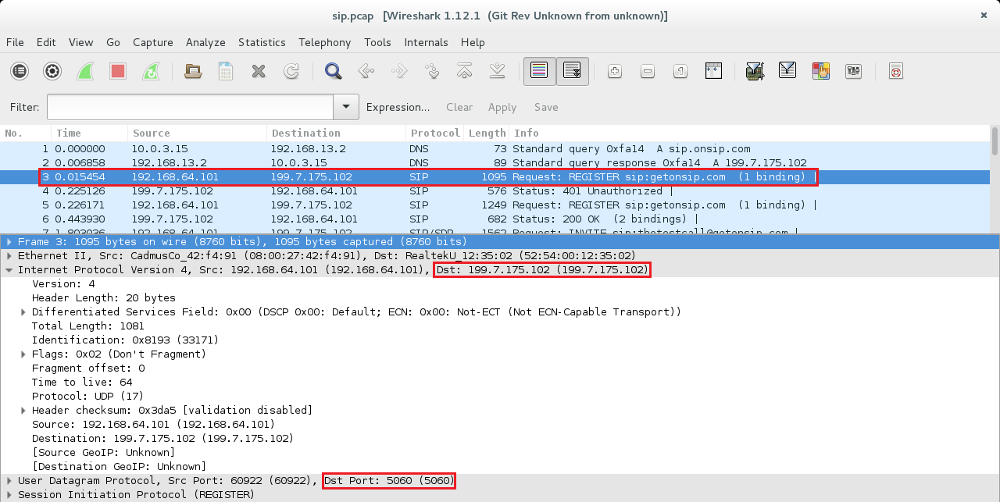

-   Să se găsească, în răspunsul de confirmare, adresele NAT prin care
    trece conversația, odată ce a fost acceptată cererea.

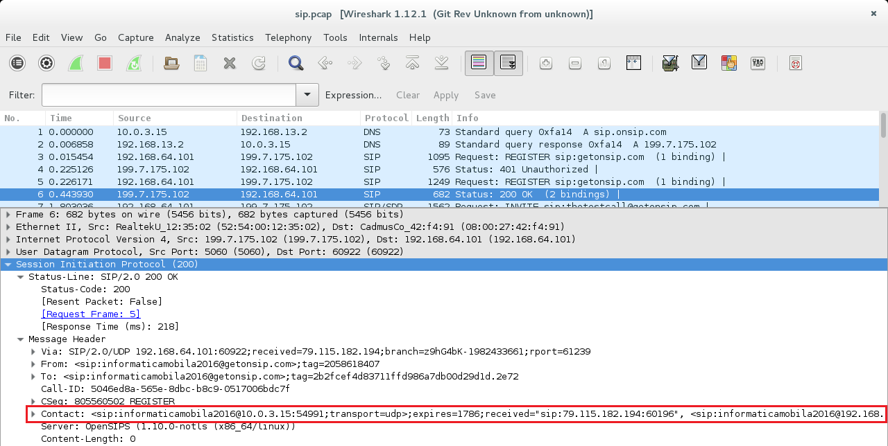

-   Să se identifice operația `INVITE`. Apar retransmisii?

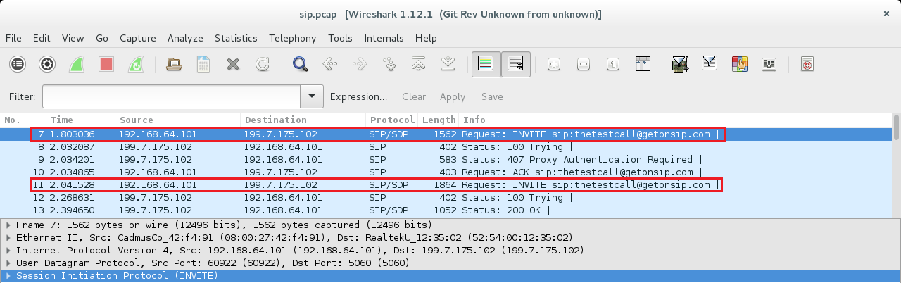

-   Ce fel de codificare este utilizată pentru semnalul audio?

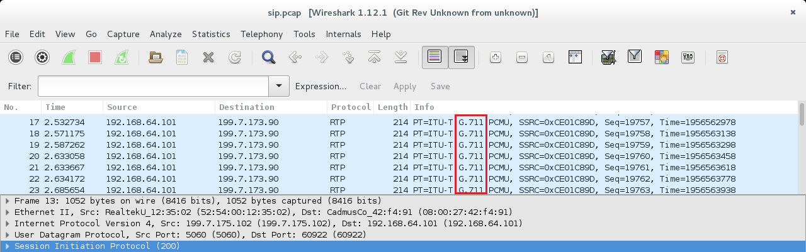

-   Ce parametri are fluxul de voce (protocol, dimensiune pachet, rata
    pachetelor)?


-   Ce adrese sunt folosite pentru traficul de voce și cum au fost
    negociate?

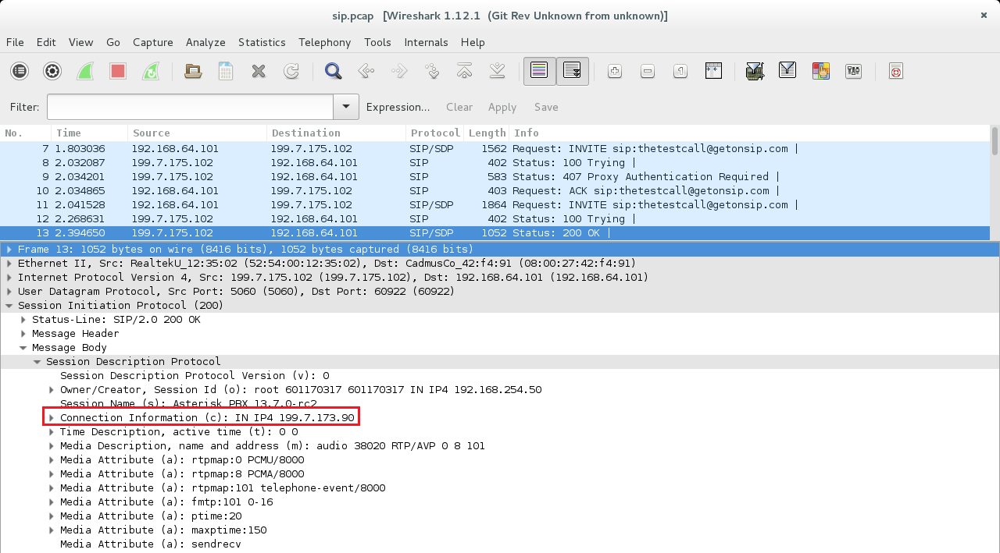

---
**Note**

Pornirea monitorizării (pornirea utilitarului `tcpdump`)
trebuie realizată anterior operației de înregistrare. Similar, oprirea
monitorizării trebuie realizată ulterior operației de deînregistrare. În
acest fel, pot fi surprinse toate operațiile.\

---

**10.** (opțional) Pentru a trimite coduri numerice DTMF (Dual Tone
Multi Frequency) se creează un buton și un câmp text editabil asociat.
Transmiterea unui astfel de caracter se realizează prin intermediul
metodei `sendDTMF()` a obiectului sesiune `NgnAVSession` cu valorile
întregi 0-9, sau 10 pentru \* și 11 pentru #. Folosind o adresa de test
(`thetestcall@getonsip.com` sau `904@mouselike.org`) să se testeze
codurile și navigarea prin meniuri.

Să se implementeze metoda asociată clasei ascultător corespunzătoare
operației de apăsare a butonului respectiv.

\<spoiler Indicații de Rezolvare>

``` java
private class DTMFButtonClickListener implements View.OnClickListener {
  @Override
  public void onClick(View view) {
    if (ngnAVSession != null) {
      int character = dtmfEditText.getText().toString().charAt(0);
      switch(character) {
        case '*':
          character = 10;
          break;
    case '#':
      character = 11;
          break;
        default:
      if (character >= '0' && character <= '9') {
            character -= '0';
          }
      }
      if (!ngnAVSession.sendDTMF(character)) {
    Log.e(Constants.TAG, "Failed to send DTMF " + character);
      } else {
    Log.d(Constants.TAG, "Succeeded to send DTMF " + character);
      }
    }           
  }
}
```

\</spoiler>

**11.** Activitatea `InstantMessagingActivity` poate fi lansată din
activitatea principală, doar ulterior operației de înregistrare. Aceasta
primește ca argument, în intenția cu care este lansată în execuție,
adresa SIP cu care se va desfașura sesiunea de mesagerie instantanee.
Funcționalitatea este împărțită între activitate și ascultătorul pentru
mesaje cu difuzare `MessageBroadcastReceiver` care trebuie să gestioneze
evenimentele de tipul `NgnMessagingEventArgs.ACTION_MESSAGING_EVENT`.

\<spoiler Indicații de Rezolvare> În activitate, se creează o sesiune
pentru fiecare mesaj, folosind

``` java
NgnMessagingSession instantMessagingSession = NgnMessagingSession.createOutgoingSession(
  ngnSipService.getSipStack(),
  remotePartyUri
);
```

Textul preluat din activitate este apoi transmis cu metoda
`sendTextMessage()`. Nu uitați să eliberați resursele folosite de
sesiune atunci când toate informațiile pe care aceasta le deține au fost
preluate.

``` java
if(!instantMessagingSession.sendTextMessage(messageEditText.getText().toString())) {
  Log.e(Constants.TAG, "Failed to send message");
} else {
  String conversation = conversationTextView.getText().toString();
  conversationTextView.setText(conversation + "Me: " + messageEditText.getText().toString() + "\n");
  messageEditText.setText("");
  Log.d(Constants.TAG, "Succeeded to send message"); 
}
NgnMessagingSession.releaseSession(instantMessagingSession);
```

În ascultătorul de mesaje cu difuzare, se tratează doar acțiunea
`NgnMessagingEventArgs.ACTION_MESSAGING_EVENT`, tipul evenimentului
`INCOMING`, pentru a extrage octeții mesajului folosind metoda
`getPayload()`. Aceștia se convertesc la șir de caractere și se afișează
în fereastra care conține conversația.

``` java
if(!NgnStringUtils.equals(arguments.getContentType(), NgnContentType.T140COMMAND, true)) {
  byte[] contentBytes = arguments.getPayload();
  if(contentBytes != null && contentBytes.length > 0) {
    try {
      String content = new String(contentBytes, "UTF-8");
      String conversation = conversationTextView.getText().toString();
      conversationTextView.setText(conversation + "Others: " + content + "\n");
    } catch (UnsupportedEncodingException unsupportedEncodingException) {
      Log.i(Constants.TAG, unsupportedEncodingException.toString());
      if (Constants.DEBUG) {
    unsupportedEncodingException.printStackTrace();
      }
    }
  }
}
```

\</spoiler>

**12.** Să se încarce modificările realizate în cadrul depozitului
'Laborator09' de pe contul Github personal, folosind un mesaj sugestiv.
`student@eim-lab:~/Laborator09$ git add *
student@eim-lab:~/Laborator09$ git commit -m "implemented taks for laboratory 08"
student@eim-lab:~/Laborator09$ git push Laborator09_perfectstudent master
`

## Resurse Utile

[Introduction to SIP - A Beginners' Tutorial as part of Internet
Multimedia](http:*www.siptutorial.net/index.html)  
[How VoIP Works?](http:*computer.howstuffworks.com/ip-telephony.htm)  
[Session Initiation Protocol (Tutorial's
Point)](http:*www.tutorialspoint.com/session_initiation_protocol/session_initiation_protocol_introduction.htm)  
[Session Initiation Protocol -
Wikipedia](https:*en.wikipedia.org/wiki/Session_Initiation_Protocol)  
[CSipSimple](https:*play.google.com/store/apps/details?id=com.csipsimple&hl=en)  
[WebRTC](https:*webrtc.org/)
