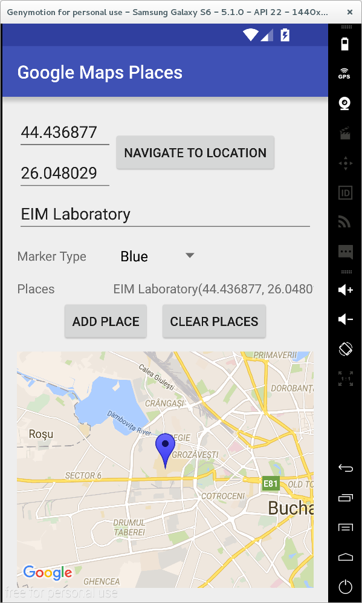
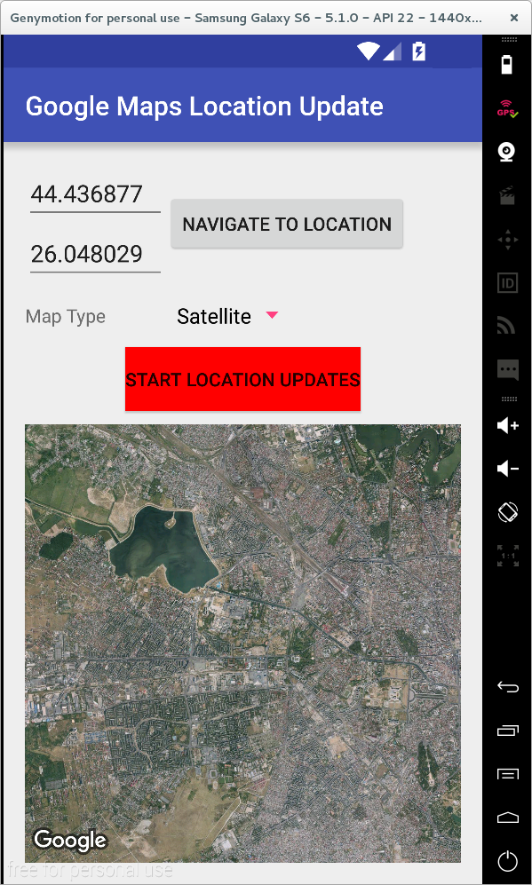
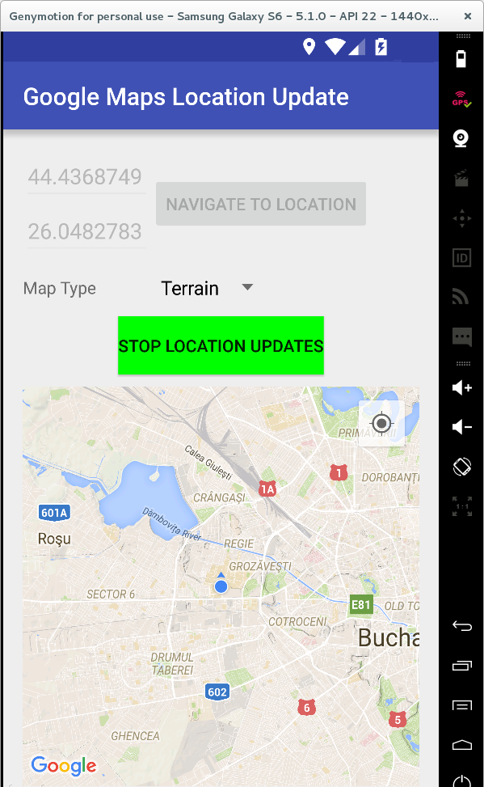
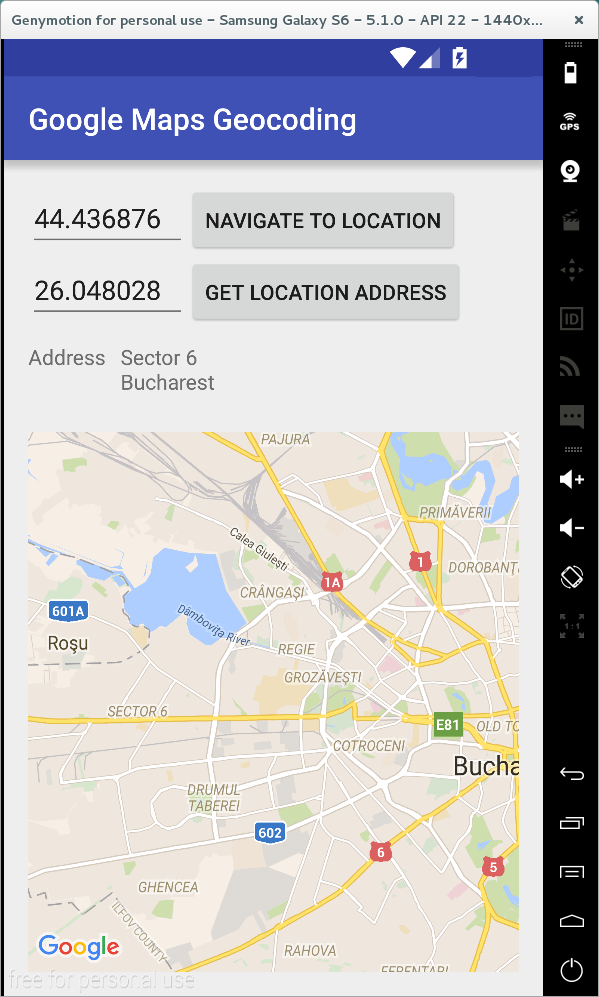
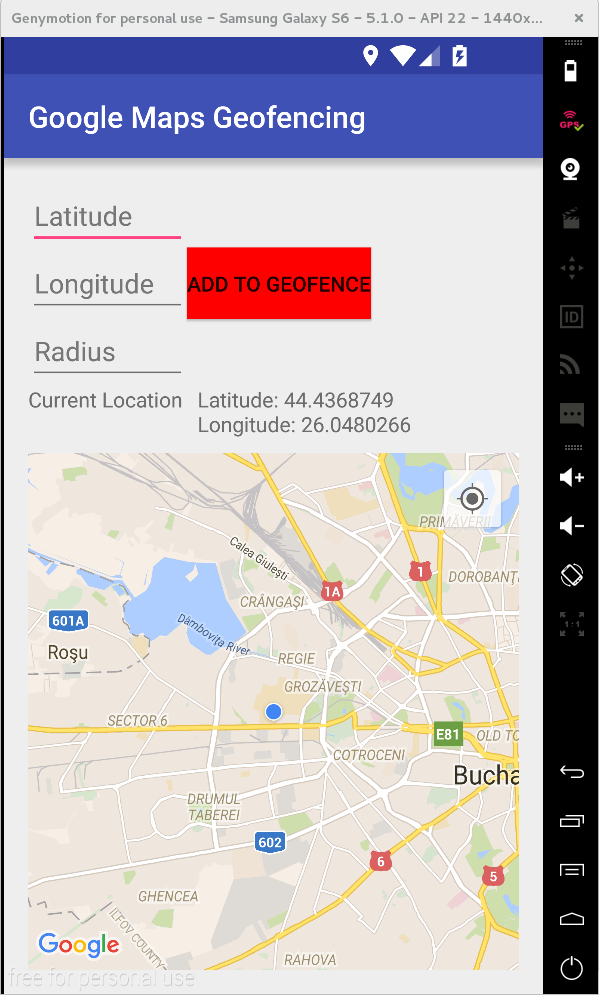

## Activitate de Laborator

**1.** Să se acceseze [Google Developer's
Console](https://console.developers.google.com), după ce a fost
realizată autentificarea cu datele contului Google (nume de utilizator,
parolă):

-   se obține un număr de proiect (dacă această operație nu a fost
    realizată anterior);
-   se activează serviciul *Google Maps Android API*;
-   se generează o semnătură digitală de tip SHA-1 folosind utilitarul
    Java `keytool`;
-   se creează o cheie publică pentru transmiterea de mesaje provenind
    de la un dispozitiv mobil, pe baza semnăturii digitale și a
    pachetului care identifică în mod unic aplicația respectivă.

---
**Note**

Pentru toate aplicațiile Android va trebui completată
cheia publică în fișierul `AndroidManifest.xml`.

---

Mai multe detalii pot fi obținute în secțiunea
[Configurare](/eim/laboratoare/laborator10#configurare).

**2.** În contul Github personal, să se creeze un depozit denumit
'Laborator10'. Inițial, acesta trebuie să fie gol (nu trebuie să bifați
nici adăugarea unui fișier `README.md`, nici a fișierului `.gitignore`
sau a a fișierului `LICENSE`).

**3.** Să se cloneze în directorul de pe discul local conținutul
depozitului la distanță de la
[](https:*www.github.com/eim-lab/Laborator10).

În urma acestei operații, directorul Laborator10 va trebui să se conțină
directoarele `labtasks` și `solutions`.

``` bash
    student@eg-106:~$ git clone https:*github.com/eim-lab/Laborator10.git
```

**4.** Să se încarce conținutul descărcat în cadrul depozitului
`Laborator10` de pe contul Github personal.
```bash
student@eg-106:~$ cd Laborator10
student@eg-106:~/Laborator10$ git remote add Laborator10_perfectstudent https://github.com/perfectstudent/Laborator10
student@eg-106:~/Laborator10$ git push Laborator10_perfectstudent master
```

**5.** Să se configureaze mașina pe care va rula aplicația:

-   în cazul în care se utilizează un emulator, se configurează astfel
    încât acesta să aibă instalat Google Play Services;
-   în cazul în care se utilizează un dispozitiv fizic, acesta trebuie
    să ruleze un sistem de operare Android cu o versiune ulterioară 2.2,
    având asociat un cont Google.

**6.** Să se importe în mediul integrat de dezvoltare Android Studio
proiectul `GoogleMapsPlaces` din directorul `labtasks`.

Se dorește să se implementeze o aplicație care să navigheze către o
locație specificată prin intermediul coordonatelor GPS (latitudine /
longitudine) și pentru care se dorește plasarea unui reper pe hartă,
însoțit de o denumire.



Reperele vor fi stocate în cadrul unei liste (obiect de tip `Spinner`),
astfel încât la selecția unui element din cadrul acesteia, se va
vizualiza obiectivul geografic marcat anterior.

Se cere să se implementeze funcționalitățile pentru adăugarea unui reper
și ștergerea tuturor reperelor de pe hartă:

**a)** pentru adăugarea unui reper:

1.  se obțin informațiile legate de latitudine, longitudine și denumire,
    din câmpurile text corespunzătoare și se verifică să fie completate
    (în caz contrar generându-se un mesaj de eroare);
2.  se realizează navigarea către locația respectivă;
3.  se instanțiază un obiect de tip `MarkerOptions`, desemnând reperul
    care va fi plasat pe harta Google;
    ```java
    `MarkerOptions marker = new MarkerOptions()
      .position(new LatLng(
        Double.parseDouble(latitudeContent), 
        Double.parseDouble(longitudeContent)
      ))
      .title(nameContent);
    marker.icon(BitmapDescriptorFactory.defaultMarker(Utilities.getDefaultMarker(markerTypeSpinner.getSelectedItemPosition())));
    ```
4.  se adaugă reperul pe harta Google;
5.  se adaugă reperul în lista de locații (`places`), notificându-se și
    adaptorul corespunzător obiectului de tip `Spinner`
    (`placesAdapter`) de această modificare, astfel încât acesta să fie
    actualizat corespunzător.

**b)** pentru ștergerea tuturor reperelor de pe hartă:

1.  se verifică să fie completate repere pe harta Google (în caz contrar
    generându-se un mesaj de eroare);
2.  se șterg toate reperele pe harta Google;
3.  se șterg toate reperele din lista de locații (`places`),
    notificându-se și adaptorul corespunzător obiectului de tip
    `Spinner` (`placesAdapter`) de această modificare, astfel încât
    acesta să fie actualizat corespunzător.

**7.** Să se importe în mediul integrat de dezvoltare Android Studio
proiectul `GoogleMapsLocationUpdate` din directorul `labtasks`.

Se dorește să se implementeze o aplicație pentru care să se implementeze
posibilitatea de actualizare periodică a poziției curente pe hartă, în
funcție de starea unui buton, prin care se controlează pornirea /
oprirea acestui serviciu.

1.  când serviciul este activat, se vizualizează pe hartă doar locația
    curentă, completându-se în mod automat informații precum latitudinea
    și longitudinea, actualizându-se corespunzător poziția;
2.  când serviciul este dezactivat, utilizatorul are posibilitatea de a
    controla poziția care se vizualizează pe hartă.

De asemenea, se dorește să se poată selecta tipul de hartă care să fie
afișat.





Se cere să se implementeze metodele pentru pornirea și oprirea
serviciului de actualizare periodică a locației de pe hartă:

**a)** metoda `startLocationUpdates()` din clasa `GoogleMapsActivity`:

1.  se apelează metoda `requestLocationUpdates()` din clasa
    ```java
    FusedLocationProviderApi`
    LocationServices.FusedLocationApi.requestLocationUpdates(
      googleApiClient,
      locationRequest,
      this
    );
    ```

3.  se actualizează starea serviciului de transmitere periodice a
    locației curente (`locationUpdatesStatus`);
4.  se vizualizează poziția curentă pe harta Google (se apelează metoda
    `setMyLocationEnabled(true)`);
5.  se modifică textul și culoarea butonului
    `locationUpdateStatusButton`;
6.  se navighează la locația curentă;
7.  se dezactivează controalele grafice `latitudeEditText`,
    `longitudeEditText`, `navigateToLocationButton`.

**b)** metoda `stopLocationUpdates()` din clasa `GoogleMapsActivity`

1.  se apelează metoda `removeLocationUpdates()` din clasa
    `FusedLocationProviderApi`
    ```java
    LocationServices.FusedLocationApi.removeLocationUpdates(
      googleApiClient,
      this
    );
    ```
2.  se actualizează starea serviciului de transmitere periodice a
    locației curente (`locationUpdatesStatus`);
3.  nu se vizualizează poziția curentă pe harta Google (se apelează
    metoda `setMyLocationEnabled(false)`);
4.  se modifică textul și culoarea butonului
    `locationUpdateStatusButton`;
5.  se activează controalele grafice `latitudeEditText`,
    `longitudeEditText`, `navigateToLocationButton`, acestea având un
    conținut vid.

**8.** (opțional - necesită Billing pentru Geocoding API) \<spoiler> Să
se importe în mediul integrat de dezvoltare Android Studio proiectul
`GoogleMapsGeocoding` din directorul `labtasks`.

Se dorește să se implementeze o aplicație care să realizeze procesul de
codificare geografică inversă: dându-se un set de coordonate GPS, se
dorește să se determine adresa poștală corespunzătoare.



Se cere să se implementeze procesul de conversie propriu-zis, în cadrul
serviciului `GetLocationAddressIntentService`, pe metoda
`onHandleIntent()`.

1.  se instanțiază un obiect de tip `Geocoder`
    ```java
    Geocoder geocoder = new Geocoder(this, Locale.getDefault());
    ```
3.  se obține lista de adrese prin invocarea metodei `getFromLocation()`
    care primește ca parametri:
    1.  latitudinea;
    2.  longitudinea;
    3.  numărul de adrese întoarse (`Constants.NUMBER_OF_ADDRESSES`);
4.  se tratează corespunzător tipurile de execepții ce pot fi generate
    (`IOException`, `IllegalArgumentException`) precum și situația în
    care nu este furnizat nici un rezultat;
5.  se parcurge lista de adrese: pentru fiecare adresă în parte se
    concatenează rândurile distincte, concatenându-se toate rezultatele
    obținute;
    1.  numărul de linii dintr-o adresă este furnizat de metoda
        `getMaxAddressLineIndex()`;
    2.  un rând de la o anumită poziție se obține prin intermediul
        metodei `getAddressLine()`;
6.  se transmite rezultatul către activitatea principală (se apelează
    metoda `handleResult()` cu codul numeric de rezultat
    (`Constants.RESULT_SUCCESS`, `Constants.RESULT_FAILURE`) și
    rezultatul obținut, respectiv mesajul de eroare, după caz.

**9.** Să se importe în mediul integrat de dezvoltare Android Studio
proiectul `GoogleMapsGeofencing` din directorul `labtasks`.

Se dorește să se implementeze o aplicație care să monitorizeze
activitatea unui dispozitiv mobil raportat la o zonă de restricție
geografică.

Serviciul referitor la monitorizarea unei anumite locații poate fi
activat sau dezactivat, specificându-se de fiecare dată coordonatele
zonei față de care sunt realizate comparațiile.

Aplicația va afișa pe hartă în permanență locația curentă prin
actualizările periodice care sunt transmise.



Notificările vor fi generate:

1.  când utilizatorul intră în zona de restricție geografică  
      
    

    
2.  când utilizatorul iese din zona de restricție geografică  
      
    
    

Detaliile cu privire la evenimentul produs vor putea fi vizualizate în
cadrul unei activități dedicate.

Se cere să se analizeze evenimentul legat de zona de restricție
geografică în cadrul serviciului `GeofenceTrackerIntentService`, pe
metoda `onHandleIntent()`.

1.  se obține evenimentul legat de zona de restricție geografică, din
    cadrul intenției cu care a fost lansat în execuție serviciul
    `GeofencingEvent geofencingEvent = GeofencingEvent.fromIntent(intent);
    `
2.  se verifică dacă evenimentul legat de zona de restricție geografică
    conține vreo eroare (prin apelul metodei `hasError()`), aceasta
    fiind tratată corespunzător (se jurnalizează eroarea și metoda se
    termină):
    1.  `GeofenceStatusCodes.GEOFENCE_NOT_AVAILABLE`
    2.  `GeofenceStatusCodes.GEOFENCE_TOO_MANY_GEOFENCES`
    3.  `GeofenceStatusCodes.GEOFENCE_TOO_MANY_PENDING_INTENTS`.
3.  se obține tipul de tranziție geografică
    `int geofenceTransition = geofencingEvent.getGeofenceTransition();
    `
4.  se construiește un mesaj explicativ conținând
    1.  tipul tranziției: `Geofence.GEOFENCE_TRANSITION_ENTER` /
        `Geofence.GEOFENCE_TRANSITION_EXIT`;
    2.  identificatorii restricțiilor legate de poziționarea geografică:
        1.  se obține lista tuturor restricțiilor legate de poziționarea
            geografică
            `List<Geofence> triggeringGeofences = geofencingEvent.getTriggeringGeofences();`
        2.  se parcurge lista și pentru fiecare obiect se obține
            identificatorul unic (`getRequestId()`);
5.  se transmite mesajul explicativ prin intermediul unei notificări (ca
    parametru al metodei `sendNotification()`).

**10.** Să se încarce modificările realizate în cadrul depozitului
'Laborator10' de pe contul Github personal, folosind un mesaj sugestiv.
```bash
student@eg-106:~/Laborator10$ git add *
student@eg-106:~/Laborator10$ git commit -m "implemented taks for laboratory 10"
student@eg-106:~/Laborator10$ git push Laborator10_perfectstudent master
```