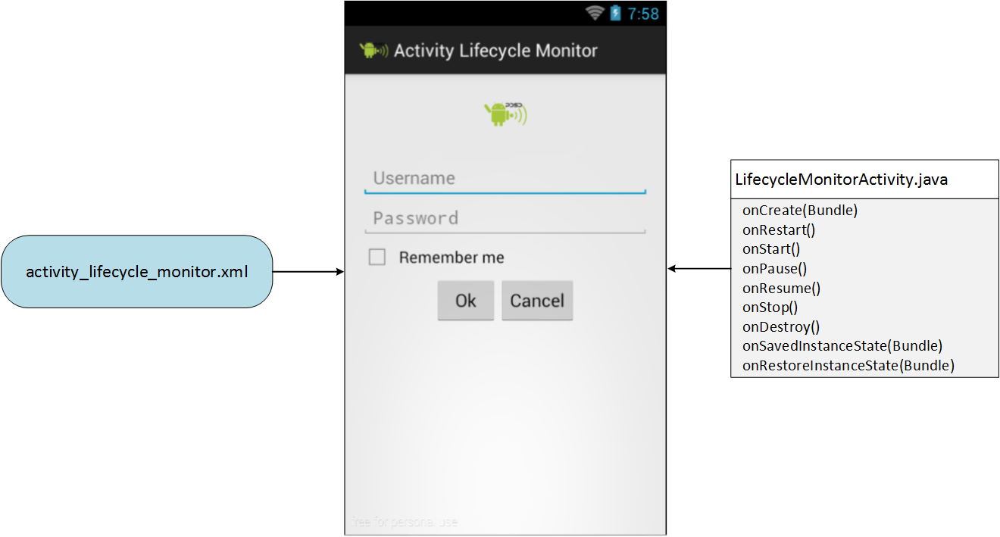

#### Componentele unei Activități

O activitate poate fi utilizată numai dacă este definită în fișierul
`AndroidManifest.xml`, în cadrul elementului de tip `<application>`.
Pentru fiecare activitate trebuie creată o intrare de tip
[\<activity>](http:*developer.android.com/guide/topics/manifest/activity-element.html)
pentru care se specifică diferite atribute, dintre care obligatoriu este
numai denumirea activității (`android:name`). Din momentul în care
aplicația Android este publicată, conținutul manifestului devine un
contract față de utilizatori, iar denumirile componentelor nu mai pot fi
modificate întrucât pot genera erori în cazul producerii unor
actualizări.

Pentru o activitate se poate specifica și un filtru de intenții, în
cadrul elementului
[\<intent-filter>](http:*developer.android.com/guide/topics/manifest/intent-filter-element.html),
spre a indica modul în care componentele aplicației o pot accesa. Acesta
este necesar pentru ca activitatea să poată fi rulată folosind intenții
implicite (furnizate de alte aplicații). Așadar, o astfel de intrare va
fi necesară pentru fiecare tip de intenție, precizând elementele
`<action>` și opțional `<category>` / `<data>`. În cazul activităților
care nu vor fi accesibile din cadrul altor aplicații Android, nu este
necesară definirea unui filtru de intenții.

---
**Note**

O activitate principală din cadrul unei aplicații Android
este caracterizată prin următoarele proprietăți:

-   acțiunea are valoarea `android.intent.action.MAIN`, întrucât
    reprezintă punctul de intrare al aplicației Android;
-   categoria are valoarea `android.intent.category.LAUNCHER`, întrucât
    activitatea trebuie inclusă în meniul dispozitivului mobil pentru a
    putea fi lansată în execuție.


---

``` xml
<?xml version="1.0" encoding="utf-8"?>
<manifest ... >
  <!-- ... -->
  <application ... >
    <activity
      android:name=".LifecycleMonitorActivity"
      android:label="@string/app_name" >
      <intent-filter>
        <action android:name="android.intent.action.MAIN" />
        <category android:name="android.intent.category.LAUNCHER" />
      </intent-filter>
    </activity>
  </application>
</manifest>
```

Ulterior, se va implementa și clasa identificată prin denumirea
activității. Aceasta trebuie să fie derivată din `android.app.Activity`
și să implementeze cel puțin metoda `onCreate()` în care sunt
inițializate componentele sale.

``` java
public class LifecycleMonitorActivity extends Activity {
    
  @Override
  protected void onCreate(Bundle savedInstanceState) {
    super.onCreate(savedInstanceState);
    setContentView(R.layout.activity_lifecycle_monitor);
    * ...
  }
    
  * ...

}
```

Este obligatoriu ca metoda `onCreate()` să apeleze metoda părinte, în
caz contrar generându-se o excepție.

Pentru fiecare activitate, este necesar să se descrie interfața grafică
în cadrul unui fișier .xml (încărcat manual, în cadrul metodei
`onCreate()`, printr-un apel al metodei `setContentView()`) în care
elementul părinte este un mecanism de dispunere a conținutului (derivat
din clasa `android.view.ViewGroup`). Acest fișier este plasat în
directorul `res/layout` și conține referințe către toate obiectele care
vor fi afișate în cadrul ferestrei. În urma compilării, vor fi generate
niște referințe (adrese în cadrul pachetului de resurse) prin
intermediul cărora resursele vor putea fi accesate.

``` xml
<LinearLayout xmlns:android="http:*schemas.android.com/apk/res/android"
    xmlns:tools="http:*schemas.android.com/tools"
    android:layout_width="match_parent"
    android:layout_height="wrap_content"
    android:paddingBottom="@dimen/activity_vertical_margin"
    android:paddingLeft="@dimen/activity_horizontal_margin"
    android:paddingRight="@dimen/activity_horizontal_margin"
    android:paddingTop="@dimen/activity_vertical_margin"
    android:orientation="vertical"
    tools:context="ro.pub.cs.systems.eim.lab02.graphicuserinterface.LifecycleMonitorActivity" >
    
    <!-- ... -->
    
</LinearLayout>
```

Prin urmare, componentele definitorii ale unei activități sunt clasa în
care este implementat comportamentul în urma interacțiunii cu
utilizatorul și fișierul .xml care descrie modelul static al interfeței
grafice.



O activitate poate fi pornită în mod explicit prin intermediul metodei
`startActivity()` care primește ca parametru un obiect de tip intenție
(căruia i se pot atașa și niște date, transferate activității). În cazul
în care se așteaptă ca activitatea să producă unele rezultate, se va
apela metoda `startActivityForResult()` - furnizându-se și un cod de
cerere -, fiind necesar ca activitatea astfel invocată să implementeze
metoda `onActivityResult()`.

O activitate poate fi oprită în mod explicit prin intermediul metodei
`finish()`. De regulă, folosirea unei astfel de metode este descurajată,
datorită impactului pe care îl poate avea asupra experienței
utilizatorului.