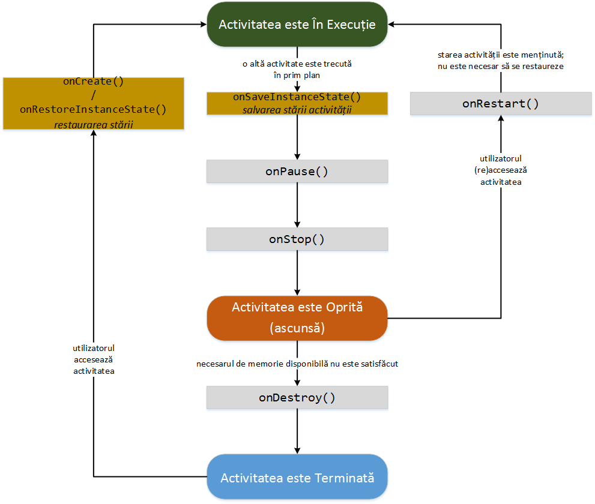

#### Gestiunea Stării unei Activități

Unele dintre metodele care gestionează ciclul de viață al unei
activități primesc ca parametru un obiect de tip
[Bundle](http:*developer.android.com/reference/android/os/Bundle.html),
utilizat pentru gestiunea stării în cazul în care activitatea este
distrusă din lipsă de memorie:

-   `onCreate()` - parametrul `savedInstance` poate să fie `null`, daca
    activitatea nu a mai fost rulată anterior, fie este o instanță a
    unui obiect de tip `Bundle` în care se găsește starea anterioară
    (așa cum a fost reținută de metoda `onSaveInstanceState()`);
-   `onSaveInstanceState()` - este apelată când activitatea urmează să
    fie ascunsă și există posibilitatea ca procesul acesteia să fie
    terminat din lipsă de memorie, pentru a salva starea activității;
-   `onRestoreInstanceState()` - este apelată doar dacă există o stare a
    activității care ar trebui să fie restaurată.

Obiectul de tip `Bundle` este o formă de hash map, în care cheia este
întotdeauna de tip `String`, iar valorile au tipul
`android.os.Parcelable` (asemănător cu `Serializable` din Java, deși
acesta nu este un mecanism de serializare în sine). Astfel, tipurile de
date care pot fi salvate și încărcate prin intermediul unui obiect de
tip `Bundle` sunt:

|                |                  |                           |
|----------------|------------------|---------------------------|
| `boolean`      | `boolean[]`      |                           |
| `Bundle`       |                  |                           |
| `byte`         | `byte[]`         |                           |
| `char`         | `char[]`         |                           |
| `CharSequence` | `CharSequence[]` | `ArrayList<CharSequence>` |
| `double`       | `double[]`       |                           |
| `float`        | `float[]`        |                           |
| `int`          | `int[]`          | `ArrayList<Integer>`      |
| `long`         | `long[]`         |                           |
| `Serializable` |                  |                           |
| `short`        | `short[]`        |                           |
| `SparseArray`  |                  |                           |
| `String`       | `String[]`       | `ArrayList<String>`       |

Starea unei activități este menținută atâta vreme cât ea este activă
(deci inclusiv când au fost apelate metodele `onPause()` și `onStop()`),
aceasta putând fi restaurată corespunzător. Necesitatea asigurării
consistenței activității de către programator apare în momentul în care
activitatea este terminată/distrusă și apoi (re)pornită. O astfel de
situație este frecventă în cazul în care se produce o schimbare de
configurație (se modifică orientarea dispozitivului de afișare -
portrait vs. landscape, limba, disponibilitatea tastaturii), întrucât de
fiecare dată este necesar să se (re)încarce resursele specifice pentru
valorile respective.

Ținându-se cont de faptul că activitatea poate fi terminată/distrusă în
orice moment după ce nu se mai găsește în prim-plan / este ascunsă,
asigurarea consistenței trebuie realizată de fiecare dată.