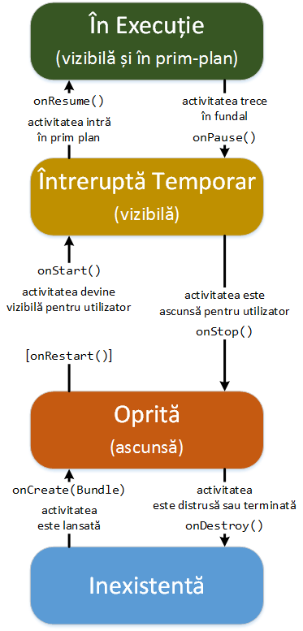
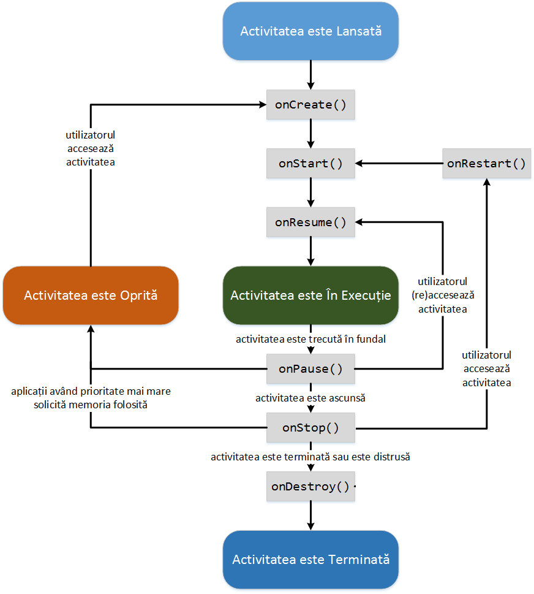

#### Ciclul de Viață al unei Activități

Din momentul în care activitatea este creată și până la momentul în care
este distrusă, ea trece printr-o serie de etape, cunoscute sub denumirea
de **ciclul de viață al activității**:

-   **în execuție** (*eng.* running) - activitatea se află în prim plan
    și este vizibilă, astfel încât utilizatorul poate interacționa cu
    aceasta prin intermediul interfeței grafice pe care o oferă;
-   **întreruptă temporar** (*eng.* paused) - activitatea se află în
    fundal și este (parțial) vizibilă; o astfel de situație este
    întâlnită în momentul în care o altă activitate a fost pornită, însă
    interfața sa grafică este transparentă sau nu ocupă întreaga
    suprafață a dispozitivului de afișare; în acest caz, activitatea
    este încă activă în sensul că obiectul de tip `Activity` este stocat
    în memorie, fiind atașată în continuare procesului responsabil cu
    gestiunea ferestrelor și menținându-se starea tuturor componentelor
    sale; totuși, ea poate fi distrusă de sistemul de operare dacă
    necesarul de memorie disponibilă nu poate fi întrunit din cauza sa;
-   **oprită** (*eng.* stopped) - activitatea se află în fundal și este
    complet ascunsă; o astfel de situație este întâlnită în momentul în
    care o altă activitate a fost pornită, iar interfața sa grafică
    ocupă întreaga suprafață a dispozitivului de afișare; și în acest
    caz, activitatea este activă în sensul că obiectul de tip `Activity`
    fiind stocat în memorie, menținându-se starea tuturor componentelor
    sale, dar detașându-se de procesul responsabil cu gestiunea
    ferestrelor; ea poate fi distrusă de sistemul de operare dacă
    necesarul de memorie disponibilă nu poate fi întrunit din cauza sa;
-   **inexistentă** - activitatea a fost terminată sau distrusă de
    sistemul de operare, rularea sa impunând crearea tuturor
    componentelor sale ca și când ar fi accesată inițial.



Tranziția unei activități dintr-o stare în alta este notificată prin
intermediul unor metode (*eng.* callbacks), care pot fi suprascrise
pentru a realiza diferite operații necesare pentru gestiunea memoriei,
asigurarea persistenței informațiilor și a consistenței aplicației
Android în situația producerii de diferite evenimente:

-   `onCreate(Bundle)` - apelată în momentul în care activitatea este
    creată; această metodă va fi folosită pentru inițializări statice:
    -   încărcarea interfeței grafice printr-un apel al metodei
        `setContentView(int)` (al cărei parametru reprezintă referința
        către resursa de tip `.xml` care descrie interfața grafică);
    -   obținerea de referințe către componentele interfeței grafice
        printr-un apel al metodei `findViewById(int)` (al cărei
        parametru reprezintă referința către componenta respectivă -
        *eng.* widget - așa cum apare în resurse);
    -   indicarea unor obiecte de tip ascultător care să gestioneze
        evenimentele legate de interacțiunea cu utilizatorul;
    -   realizarea unor conexiuni către alte modele de date.

---
**Note**

Crearea activității este diferită de apariția acesteia
pe ecran.\

---

\<note>Metoda `onCreate()` este întotdeauna urmată de metoda
`onStart()`.\

---

-   `onRestart()` - apelată atunci când activitatea a fost oprită și
    ulterior repornită; este urmată întotdeauna de metoda `onStart()`;
-   `onStart()` - apelată înainte ca activitatea să apară pe ecran;
    poate fi urmată de metoda `onResume()` dacă activitatea trece în
    prim-plan sau de metoda `onPause()` dacă activitatea trece în
    fundal;
-   `onResume()` - apelată înainte ca activitatea să interacționeze cu
    utilizatorul; această metodă va fi folosită pentru a porni servicii
    sau cod care trebuie să ruleze atâta timp cât aplicația este afișată
    pe ecran; este urmată întotdeauna de metoda `onPause()`;
-   `onPause()` - apelată înainte ca activitatea să fie întreruptă
    temporar, iar o altă activitate să fie reluată; această metodă va fi
    utilizată pentru a opri servicii sau cod care nu trebuie să ruleze
    atâta timp cât activitatea se află în fundal (întrucât consumă timp
    de procesor) și pentru a salva starea diferitelor componente în
    vederea asigurării persistenței și a consistenței aplicației înainte
    și după evenimentul care a produs suspendarea sa; poate fi urmată de
    metoda `onResume()` dacă activitatea trece în prim-plan sau de
    metoda `onStop()` dacă activitatea este ascunsă;

---
**Note**

Procesările realizate în metoda `onPause()` nu trebuie să
ocupe un interval de timp prea mare întrucât în caz contrar ar bloca
noua activitate care urmează să fie lansată în execuție.\

---

---
**Note**

Procesul în contextul căruia rulează o activitate nu poate fi
distrus de sistemul de operare până ce nu s-a terminat apelul metodei
`onPause()`, aceasta fiind singura metodă care este apelată în mod
garantat **înainte** de a se solicita memoria pe care activitatea o
folosește.\

---

-   `onStop()` - apelată în momentul în care activitatea este ascunsă,
    fie din cauză că urmează să fie distrusă, fie din cauză că o altă
    activitate, a cărei interfață grafică ocupă întreaga suprafață a
    dispozitivului de afișare, urmează să devină vizibilă; poate fi
    urmată de metoda `onRestart()`, dacă activitatea urmează să
    interacționeze (din nou) cu utilizatorul, sau de metoda
    `onDestroy()` dacă activitatea urmează să fie terminată sau distrusă
    de sistemul de operare;
-   `onDestroy()` - apelată înainte ca activitatea să se termine sau să
    fie distrusă de către sistemul de operare (fie manual, fie automat)
    din lipsă de memorie; această metodă va fi utilizată pentru a
    elibera resursele ocupate.

---
**Note**

Distincția între cele două situații în care o activitate este
distrusă poate fi realizată prin intermediul metodei
`isFinishing()`.\

---



---
**Note**

Fiecare dintre metodele ce gestionează ciclul de viață
al activității trebuie să apeleze metoda părintelui. În cazul metodei
`onCreate()`, este necesar ca acest lucru să fie realizat la începutul
metodei.\

---

---
**Note**

În cadrul unei activități, este interzisă apelarea
manuală a metodelor legate de ciclul de viață, acestea fiind invocate în
mod automat de sistemul de operare Android la producerea diferitelor
evenimente.\

---

``` java
public class LifecycleMonitorActivity extends Activity {

  @Override
  protected void onCreate(Bundle savedInstanceState) {
    super.onCreate(savedInstanceState);
    * ...
  }
 
  @Override
  protected void onStart() {
    super.onStart();
    * ...
  }
    
  @Override
  protected void onResume() {
    super.onResume();
    * ...
  }
    
  @Override
  protected void onPause() {
    super.onPause();
    * ...
  }
   
  @Override
  protected void onStop() {
    super.onStop();
    * ...
  }
    
  @Override
  protected void onDestroy() {
    super.onDestroy();
    * ...
  }
 
  @Override
  protected void onRestart() {
    super.onRestart();
    * ...
  }
 
  * metode folosite pentru salvarea si restaurarea starii    
 
  @Override
  protected void onSaveInstanceState(Bundle savedInstanceState) {
    * apelarea metodei din activitatea parinte este recomandata, dar nu obligatorie
    super.onSaveInstanceState(savedInstanceState);
    * ...
  }
 
  @Override
  protected void onRestoreInstanceState(Bundle savedInstanceState) {
    * apelarea metodei din activitatea parinte este recomandata, dar nu obligatorie
    super.onRestoreInstanceState(savedInstanceState);
    * ...
  }
  
}
```