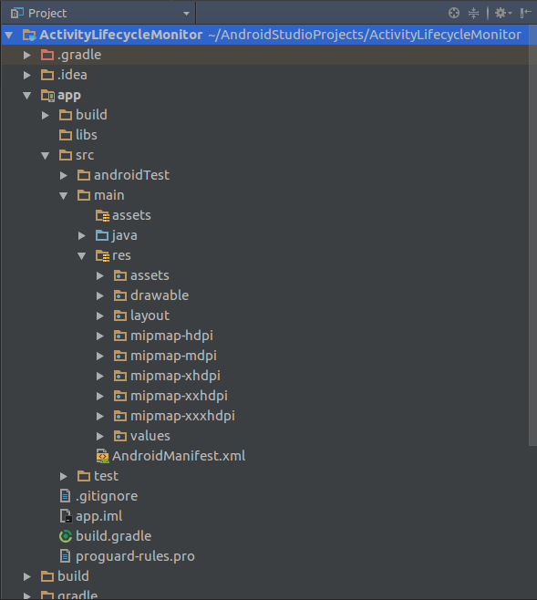

#### Android Studio

\<spoiler> În Android Studio, există mai multe perspective sub care
poate fi vizualizată structura unui proiect:

-   Project (reprezintă structura de pe discul fizic)
-   Packages
-   Scratches
-   Android (reprezintă gruparea logică a modulelor aplicației Android)
-   Project Files
-   Problems
-   Production
-   Tests
-   Local Unit Tests
-   Android Instrumented Tests

Cele mai frecvent utilizate perspective sunt *Project* și *Android*.

Organizarea unui proiect Android Studio conține următoarele directoare:

-   .gradle - fișiere temporare Gradle (biblioteci descărcate, fișiere
    de configurare)
-   .idea - fișiere temporare Android Studio
-   app
    -   build - fișiere generate conținând referințe (adrese) către
        resursele definite (spre exemplu, în directorul
        `generated/source` se găsesc clasele `BuildConfig` și `R`);
    -   src
        -   androidTest - cazuri de test
        -   main
            -   assets - resurse necompilate
            -   java - codul sursă java
            -   res
                -   drawable - resurse grafice
                -   layout - interfețe grafice definite static în
                    fișiere XML
                -   midmap-\<resolution> - pictograma aplicației, pentru
                    diferite rezoluții
                -   values - constante care vor fi referite în text
                    -   colors.xml
                    -   dimens.xml
                    -   strings.xml
                    -   styles.xml
                -   AndroidManifest.xml - doar componentele aplicației
                    Android: activități, servicii, receptoare cu
                    difuzare, filtre de intenții pentru fiecare
                    componentă
        -   test - surse pentru teste unitare
-   build - cache pentru fișiere .dex
-   gradle
-   External Libraries
-   alte fișiere (în rădăcină):
    -   .gitignore
    -   \<project>.iml
    -   build.gradle
    -   gradle.properties
    -   gradlew
    -   local.properties
    -   settings.gradle

\</spoiler>