# Laborator 02. Structura unei Aplicații (I)

O aplicație Android poate conține mai multe componente:

1.  [contextul](http:*developer.android.com/reference/android/content/Context.html)
    reprezintă punctul central al unei aplicații Android, oferind acces
    către mai multe funcționalități ale acesteia (inclusiv la resursele
    dizpozitivului mobil, serviciile sistemului de operare, diferite
    fișiere de configurare); este instanțiat sub forma unui obiect de
    tip `android.app.Application`;
2.  [activitatea](http:*developer.android.com/reference/android/app/Activity.html)
    realizează sarcini a căror execuție nu influențează timpul de
    răspuns al aplicației Android, astfel încât să nu aibă un impact
    asupra experienței utilizatorului; de aceea, este asociată unei
    ferestre (interfețe grafice), o aplicație Android fiind formată din
    una sau mai multe activități;
3.  [fragmentul](http:*developer.android.com/reference/android/app/Fragment.html)
    conține interfața grafică și logica aplicației corespunzătoare unei
    părți din cadrul unei activități; motivul pentru care se recurge la
    modularizarea unei activități prin intermediul a mai multor
    fragmente este asigurarea consistenței și flexibilității aplicației
    Android pe mai multe echipamente mobile, cu dispozitive de afișare
    de dimensiuni și rezoluții diferite;
4.  [serviciul](http:*developer.android.com/reference/android/app/Service.html)
    încapsulează procese mai complexe, executate în fundal (și posibil
    la intervale de timp regulate) a căror rulare durează o perioadă de
    timp semnificativă, astfel încât să nu poată fi plasate în cadrul
    aceluiași fir de execuție ca și interfața grafică prin care se
    asigură interacțiunea cu utilizatorul;
5.  [intenția](http:*developer.android.com/reference/android/content/Intent.html)
    este mecanismul de comunicare între elementele unei aplicații
    Android (activități și servicii); prin intermediul unui sistem de
    mesagerie (asincronă), sistemul de operare Android mapează o
    solicitare (împachetată sub forma unei intenții) către componenta
    adecvată.


## Contextul

Contexul este utilizat pentru a implementa diferite funcționalități la
nivelul întregii aplicații:

-   obținerea de referințe la resursele aplicației (șiruri de caractere,
    elemente grafice, fișiere XML);
-   accesarea preferințelor aplicației;
-   gestiunea sistemului de fișiere corespunzător aplicației;
-   lucrul cu resurse necompilate ale aplicației;
-   utilizarea serviciilor de sistem;
-   folosirea unei baza de date SQLite;
-   administrarea permisiunilor aplicației.

În clasele de tip `Activity` sau `Service`, contextul aplicației poate
fi obținut printr-un apel de forma:

``` java
Context context = getApplicationContext(); * definita in clasa Context
```

``` java
Context context = getApplication();        * definita in clasa Activity
```

---
**Note**

Pentru a se evita utilizarea ineficientă a memoriei (*eng.*
memory leak), în situația în care obiectele trebuie să existe pe toată
durata aplicației, se recomandă ca acestea să refere contextul
aplicației (nu al activității), astfel încât să nu fie condiționate de
diverse evenimente din ciclul de viață al acestora.\

---

## Activitatea

Activitatea reprezintă o componenta a aplicației Android ce oferă o
interfață grafică cu care utilizatorul poate să interacționeze. Cele mai
multe activități ocupă întreaga suprafață de afișare, însă acest lucru
nu este obligatoriu.

O aplicație Android este formată din una sau mai multe activități (slab
cuplate între ele). Există întotdeauna o activitate principală care este
afișată atunci când aplicația Android este lansată în execuție inițial.

O activitate poate invoca o altă activitate pentru a realiza diferite
sarcini, prin intermediul unei intenții. În acest moment, activitatea
veche este oprită și salvată pe stivă (*eng.* back stack), după care
este pornită activitatea nouă. Restaurarea și (re)începerea activității
vechi este realizată în momentul în care activitatea nouă (curentă) este
terminată. Un comportament similar are loc în momentul în care se
produce un eveniment (primirea unui apel telefonic, apăsarea tastelor
*Home* sau *Back*, lansarea altei aplicații).

---
**Note**

O activitate trebuie să își gestioneze corespunzător
comportamentul (inclusiv folosirea memoriei) în cazul producerii
diferitelor evenimente, salvând și restaurând starea de fiecare dată
când aplicația este oprită, respectiv (re)pornită.\

---

### Componentele unei Activități

O activitate poate fi utilizată numai dacă este definită în fișierul
`AndroidManifest.xml`, în cadrul elementului de tip `<application>`.
Pentru fiecare activitate trebuie creată o intrare de tip
[\<activity>](http:*developer.android.com/guide/topics/manifest/activity-element.html)
pentru care se specifică diferite atribute, dintre care obligatoriu este
numai denumirea activității (`android:name`). Din momentul în care
aplicația Android este publicată, conținutul manifestului devine un
contract față de utilizatori, iar denumirile componentelor nu mai pot fi
modificate întrucât pot genera erori în cazul producerii unor
actualizări.

Pentru o activitate se poate specifica și un filtru de intenții, în
cadrul elementului
[\<intent-filter>](http:*developer.android.com/guide/topics/manifest/intent-filter-element.html),
spre a indica modul în care componentele aplicației o pot accesa. Acesta
este necesar pentru ca activitatea să poată fi rulată folosind intenții
implicite (furnizate de alte aplicații). Așadar, o astfel de intrare va
fi necesară pentru fiecare tip de intenție, precizând elementele
`<action>` și opțional `<category>` / `<data>`. În cazul activităților
care nu vor fi accesibile din cadrul altor aplicații Android, nu este
necesară definirea unui filtru de intenții.

---
**Note**

O activitate principală din cadrul unei aplicații Android
este caracterizată prin următoarele proprietăți:

-   acțiunea are valoarea `android.intent.action.MAIN`, întrucât
    reprezintă punctul de intrare al aplicației Android;
-   categoria are valoarea `android.intent.category.LAUNCHER`, întrucât
    activitatea trebuie inclusă în meniul dispozitivului mobil pentru a
    putea fi lansată în execuție.

\

---

``` xml
<?xml version="1.0" encoding="utf-8"?>
<manifest ... >
  <!-- ... -->
  <application ... >
    <activity
      android:name=".LifecycleMonitorActivity"
      android:label="@string/app_name" >
      <intent-filter>
        <action android:name="android.intent.action.MAIN" />
        <category android:name="android.intent.category.LAUNCHER" />
      </intent-filter>
    </activity>
  </application>
</manifest>
```

Ulterior, se va implementa și clasa identificată prin denumirea
activității. Aceasta trebuie să fie derivată din `android.app.Activity`
și să implementeze cel puțin metoda `onCreate()` în care sunt
inițializate componentele sale.

``` java
public class LifecycleMonitorActivity extends Activity {
    
  @Override
  protected void onCreate(Bundle savedInstanceState) {
    super.onCreate(savedInstanceState);
    setContentView(R.layout.activity_lifecycle_monitor);
    * ...
  }
    
  * ...

}
```

Este obligatoriu ca metoda `onCreate()` să apeleze metoda părinte, în
caz contrar generându-se o excepție.

Pentru fiecare activitate, este necesar să se descrie interfața grafică
în cadrul unui fișier .xml (încărcat manual, în cadrul metodei
`onCreate()`, printr-un apel al metodei `setContentView()`) în care
elementul părinte este un mecanism de dispunere a conținutului (derivat
din clasa `android.view.ViewGroup`). Acest fișier este plasat în
directorul `res/layout` și conține referințe către toate obiectele care
vor fi afișate în cadrul ferestrei. În urma compilării, vor fi generate
niște referințe (adrese în cadrul pachetului de resurse) prin
intermediul cărora resursele vor putea fi accesate.

``` xml
<LinearLayout xmlns:android="http:*schemas.android.com/apk/res/android"
    xmlns:tools="http:*schemas.android.com/tools"
    android:layout_width="match_parent"
    android:layout_height="wrap_content"
    android:paddingBottom="@dimen/activity_vertical_margin"
    android:paddingLeft="@dimen/activity_horizontal_margin"
    android:paddingRight="@dimen/activity_horizontal_margin"
    android:paddingTop="@dimen/activity_vertical_margin"
    android:orientation="vertical"
    tools:context="ro.pub.cs.systems.eim.lab02.graphicuserinterface.LifecycleMonitorActivity" >
    
    <!-- ... -->
    
</LinearLayout>
```

Prin urmare, componentele definitorii ale unei activități sunt clasa în
care este implementat comportamentul în urma interacțiunii cu
utilizatorul și fișierul .xml care descrie modelul static al interfeței
grafice.


O activitate poate fi pornită în mod explicit prin intermediul metodei
`startActivity()` care primește ca parametru un obiect de tip intenție
(căruia i se pot atașa și niște date, transferate activității). În cazul
în care se așteaptă ca activitatea să producă unele rezultate, se va
apela metoda `startActivityForResult()` - furnizându-se și un cod de
cerere -, fiind necesar ca activitatea astfel invocată să implementeze
metoda `onActivityResult()`.

O activitate poate fi oprită în mod explicit prin intermediul metodei
`finish()`. De regulă, folosirea unei astfel de metode este descurajată,
datorită impactului pe care îl poate avea asupra experienței
utilizatorului.

### Ciclul de Viață al unei Activități

Din momentul în care activitatea este creată și până la momentul în care
este distrusă, ea trece printr-o serie de etape, cunoscute sub denumirea
de **ciclul de viață al activității**:

-   **în execuție** (*eng.* running) - activitatea se află în prim plan
    și este vizibilă, astfel încât utilizatorul poate interacționa cu
    aceasta prin intermediul interfeței grafice pe care o oferă;
-   **întreruptă temporar** (*eng.* paused) - activitatea se află în
    fundal și este (parțial) vizibilă; o astfel de situație este
    întâlnită în momentul în care o altă activitate a fost pornită, însă
    interfața sa grafică este transparentă sau nu ocupă întreaga
    suprafață a dispozitivului de afișare; în acest caz, activitatea
    este încă activă în sensul că obiectul de tip `Activity` este stocat
    în memorie, fiind atașată în continuare procesului responsabil cu
    gestiunea ferestrelor și menținându-se starea tuturor componentelor
    sale; totuși, ea poate fi distrusă de sistemul de operare dacă
    necesarul de memorie disponibilă nu poate fi întrunit din cauza sa;
-   **oprită** (*eng.* stopped) - activitatea se află în fundal și este
    complet ascunsă; o astfel de situație este întâlnită în momentul în
    care o altă activitate a fost pornită, iar interfața sa grafică
    ocupă întreaga suprafață a dispozitivului de afișare; și în acest
    caz, activitatea este activă în sensul că obiectul de tip `Activity`
    fiind stocat în memorie, menținându-se starea tuturor componentelor
    sale, dar detașându-se de procesul responsabil cu gestiunea
    ferestrelor; ea poate fi distrusă de sistemul de operare dacă
    necesarul de memorie disponibilă nu poate fi întrunit din cauza sa;
-   **inexistentă** - activitatea a fost terminată sau distrusă de
    sistemul de operare, rularea sa impunând crearea tuturor
    componentelor sale ca și când ar fi accesată inițial.


Tranziția unei activități dintr-o stare în alta este notificată prin
intermediul unor metode (*eng.* callbacks), care pot fi suprascrise
pentru a realiza diferite operații necesare pentru gestiunea memoriei,
asigurarea persistenței informațiilor și a consistenței aplicației
Android în situația producerii de diferite evenimente:

-   `onCreate(Bundle)` - apelată în momentul în care activitatea este
    creată; această metodă va fi folosită pentru inițializări statice:
    -   încărcarea interfeței grafice printr-un apel al metodei
        `setContentView(int)` (al cărei parametru reprezintă referința
        către resursa de tip `.xml` care descrie interfața grafică);
    -   obținerea de referințe către componentele interfeței grafice
        printr-un apel al metodei `findViewById(int)` (al cărei
        parametru reprezintă referința către componenta respectivă -
        *eng.* widget - așa cum apare în resurse);
    -   indicarea unor obiecte de tip ascultător care să gestioneze
        evenimentele legate de interacțiunea cu utilizatorul;
    -   realizarea unor conexiuni către alte modele de date.

---
**Note**

Crearea activității este diferită de apariția acesteia
pe ecran.\

---

\<note>Metoda `onCreate()` este întotdeauna urmată de metoda
`onStart()`.\

---

-   `onRestart()` - apelată atunci când activitatea a fost oprită și
    ulterior repornită; este urmată întotdeauna de metoda `onStart()`;
-   `onStart()` - apelată înainte ca activitatea să apară pe ecran;
    poate fi urmată de metoda `onResume()` dacă activitatea trece în
    prim-plan sau de metoda `onPause()` dacă activitatea trece în
    fundal;
-   `onResume()` - apelată înainte ca activitatea să interacționeze cu
    utilizatorul; această metodă va fi folosită pentru a porni servicii
    sau cod care trebuie să ruleze atâta timp cât aplicația este afișată
    pe ecran; este urmată întotdeauna de metoda `onPause()`;
-   `onPause()` - apelată înainte ca activitatea să fie întreruptă
    temporar, iar o altă activitate să fie reluată; această metodă va fi
    utilizată pentru a opri servicii sau cod care nu trebuie să ruleze
    atâta timp cât activitatea se află în fundal (întrucât consumă timp
    de procesor) și pentru a salva starea diferitelor componente în
    vederea asigurării persistenței și a consistenței aplicației înainte
    și după evenimentul care a produs suspendarea sa; poate fi urmată de
    metoda `onResume()` dacă activitatea trece în prim-plan sau de
    metoda `onStop()` dacă activitatea este ascunsă;

---
**Note**

Procesările realizate în metoda `onPause()` nu trebuie să
ocupe un interval de timp prea mare întrucât în caz contrar ar bloca
noua activitate care urmează să fie lansată în execuție.\

---

---
**Note**

Procesul în contextul căruia rulează o activitate nu poate fi
distrus de sistemul de operare până ce nu s-a terminat apelul metodei
`onPause()`, aceasta fiind singura metodă care este apelată în mod
garantat **înainte** de a se solicita memoria pe care activitatea o
folosește.\

---

-   `onStop()` - apelată în momentul în care activitatea este ascunsă,
    fie din cauză că urmează să fie distrusă, fie din cauză că o altă
    activitate, a cărei interfață grafică ocupă întreaga suprafață a
    dispozitivului de afișare, urmează să devină vizibilă; poate fi
    urmată de metoda `onRestart()`, dacă activitatea urmează să
    interacționeze (din nou) cu utilizatorul, sau de metoda
    `onDestroy()` dacă activitatea urmează să fie terminată sau distrusă
    de sistemul de operare;
-   `onDestroy()` - apelată înainte ca activitatea să se termine sau să
    fie distrusă de către sistemul de operare (fie manual, fie automat)
    din lipsă de memorie; această metodă va fi utilizată pentru a
    elibera resursele ocupate.

---
**Note**

Distincția între cele două situații în care o activitate este
distrusă poate fi realizată prin intermediul metodei
`isFinishing()`.\

---


---
**Note**

Fiecare dintre metodele ce gestionează ciclul de viață
al activității trebuie să apeleze metoda părintelui. În cazul metodei
`onCreate()`, este necesar ca acest lucru să fie realizat la începutul
metodei.\

---

---
**Note**

În cadrul unei activități, este interzisă apelarea
manuală a metodelor legate de ciclul de viață, acestea fiind invocate în
mod automat de sistemul de operare Android la producerea diferitelor
evenimente.\

---

``` java
public class LifecycleMonitorActivity extends Activity {

  @Override
  protected void onCreate(Bundle savedInstanceState) {
    super.onCreate(savedInstanceState);
    * ...
  }
 
  @Override
  protected void onStart() {
    super.onStart();
    * ...
  }
    
  @Override
  protected void onResume() {
    super.onResume();
    * ...
  }
    
  @Override
  protected void onPause() {
    super.onPause();
    * ...
  }
   
  @Override
  protected void onStop() {
    super.onStop();
    * ...
  }
    
  @Override
  protected void onDestroy() {
    super.onDestroy();
    * ...
  }
 
  @Override
  protected void onRestart() {
    super.onRestart();
    * ...
  }
 
  * metode folosite pentru salvarea si restaurarea starii    
 
  @Override
  protected void onSaveInstanceState(Bundle savedInstanceState) {
    * apelarea metodei din activitatea parinte este recomandata, dar nu obligatorie
    super.onSaveInstanceState(savedInstanceState);
    * ...
  }
 
  @Override
  protected void onRestoreInstanceState(Bundle savedInstanceState) {
    * apelarea metodei din activitatea parinte este recomandata, dar nu obligatorie
    super.onRestoreInstanceState(savedInstanceState);
    * ...
  }
  
}
```

### Gestiunea Stării unei Activități

Unele dintre metodele care gestionează ciclul de viață al unei
activități primesc ca parametru un obiect de tip
[Bundle](http:*developer.android.com/reference/android/os/Bundle.html),
utilizat pentru gestiunea stării în cazul în care activitatea este
distrusă din lipsă de memorie:

-   `onCreate()` - parametrul `savedInstance` poate să fie `null`, daca
    activitatea nu a mai fost rulată anterior, fie este o instanță a
    unui obiect de tip `Bundle` în care se găsește starea anterioară
    (așa cum a fost reținută de metoda `onSaveInstanceState()`);
-   `onSaveInstanceState()` - este apelată când activitatea urmează să
    fie ascunsă și există posibilitatea ca procesul acesteia să fie
    terminat din lipsă de memorie, pentru a salva starea activității;
-   `onRestoreInstanceState()` - este apelată doar dacă există o stare a
    activității care ar trebui să fie restaurată.


Obiectul de tip `Bundle` este o formă de hash map, în care cheia este
întotdeauna de tip `String`, iar valorile au tipul
`android.os.Parcelable` (asemănător cu `Serializable` din Java, deși
acesta nu este un mecanism de serializare în sine). Astfel, tipurile de
date care pot fi salvate și încărcate prin intermediul unui obiect de
tip `Bundle` sunt:

<center>

|                |                  |                           |
|----------------|------------------|---------------------------|
| `boolean`      | `boolean[]`      |                           |
| `Bundle`       |                  |                           |
| `byte`         | `byte[]`         |                           |
| `char`         | `char[]`         |                           |
| `CharSequence` | `CharSequence[]` | `ArrayList<CharSequence>` |
| `double`       | `double[]`       |                           |
| `float`        | `float[]`        |                           |
| `int`          | `int[]`          | `ArrayList<Integer>`      |
| `long`         | `long[]`         |                           |
| `Serializable` |                  |                           |
| `short`        | `short[]`        |                           |
| `SparseArray`  |                  |                           |
| `String`       | `String[]`       | `ArrayList<String>`       |

</center>

Starea unei activități este menținută atâta vreme cât ea este activă
(deci inclusiv când au fost apelate metodele `onPause()` și `onStop()`),
aceasta putând fi restaurată corespunzător. Necesitatea asigurării
consistenței activității de către programator apare în momentul în care
activitatea este terminată/distrusă și apoi (re)pornită. O astfel de
situație este frecventă în cazul în care se produce o schimbare de
configurație (se modifică orientarea dispozitivului de afișare -
portrait vs. landscape, limba, disponibilitatea tastaturii), întrucât de
fiecare dată este necesar să se (re)încarce resursele specifice pentru
valorile respective.

Ținându-se cont de faptul că activitatea poate fi terminată/distrusă în
orice moment după ce nu se mai găsește în prim-plan / este ascunsă,
asigurarea consistenței trebuie realizată de fiecare dată.

#### Salvarea Stării

Metoda `onSaveInstanceState()` este înainte de metoda `onStop()` și
posibil înainte de metoda `onPause()`, deși acest lucru nu este
garantat. Ea primește ca parametru un obiect de tip `Bundle` în care vor
fi plasate datele din cadrul activității care se doresc a fi salvate,
acestea putând fi identificate prin intermediul unei chei (de tip
`String`).

\<note>Apelul metodei `onSaveInstanceState()` nu este garantat să fie
realizat de fiecare dată întrucât pot fi situații în care nu este
necesar ca starea activității să fie restaurată (utilizatorul a terminat
activitatea prin apăsarea butonului *Back*).\

---

În cazul în care se dorește salvarea explicită a conținutului unui
obiect `EditText`, se poate proceda astfel:

``` java
@Override
protected void onSaveInstanceState(Bundle savedInstanceState) {
  super.onSaveInstanceState(savedInstanceState);
  EditText usernameEditText = (EditText)findViewById(R.id.username_edit_text);
  savedInstanceState.putString(Constants.USERNAME_EDIT_TEXT, usernameEditText.getText().toString());
}
```

Valoarea introdusă de utilizator va fi salvată în obiectul de tip
`Bundle` sub denumirea `userNameEditText`, acesta fiind menținut și prin
urmare utilizat între mai multe instanțe ale acestei activități.

Apelarea metodei părinte este necesară întrucât API-ul Android
furnizează o implementare implicită pentru salvarea stării unei
activități, parcurgând ierarhia de componente grafice (obiecte de tip
`View`) care au asociat un identificator (`android:id`), folosit drept
cheie în obiectul `Bundle`. Astfel, de regulă, pentru elementele
interfeței grafice, nu este necesar să se mențină starea, acest lucru
fiind realizat în mod automat, cu respectarea condiției menționate. De
aceea, în metoda `onSaveInstanceState`, va fi realizată salvarea unor
informații (obiecte ale clasei) pentru care procesul de salvare a stării
nu este apelat. Totuși, asigurarea persistenței datelor nu se va realiza
niciodată aici (întrucât nu se garantează apelarea sa), ci în metoda
`onPause()`.

În obiectul de tip `Bundle`, prin cheia `android:viewHierarchyState` se
va reține un alt obiect de tip `Bundle` care reține starea tuturor
obiectelor de tip `View` din cadrul activității (care sunt identificate
prin intermediul unui câmp `android:id`). În cadrul acestuia, prin cheia
`android:views` se reține un obiect de tip `SparseArray` (un tip de dată
specific Android care realizează mapări între întregi și obiecte, mai
eficient decât un hashmap) care conține starea fiecărui obiect de tip
`View` prin intermediul identificatorului său.

``` java
Bundle viewHierarchy = savedInstanceState.getBundle("android:viewHierarchyState");
if (viewHierarchy != null) {
  SparseArray<? extends Parcelable> views = viewHierarchy.getSparseParcelableArray("android:views");
  for (int k=0; k < views.size(); k++) {
    Log.d(Constants.TAG, views.get(k) + "->" + views.valueAt(k));
  }
}
else {
  Log.d(Constants.TAG, "No view information was saved!");
}
```

Prin urmare, dacă aplicația este oprită și apoi pornită din nou,
obiectele de tip `View` vor avea conținutul existent în prealabil.
Pentru a dezactiva această opțiune, trebuie specificată în fișierul .xml
care descrie interfața grafică a activității, în elementul corespunzător
obiectului de tip `View` proprietatea `android:saveEnabled="false"`.

\<note>Dezactivarea se poate realiza și programatic, folosind metoda
`setSaveEnabled(boolean)`.\

---

#### Restaurarea Stării

Încărcarea conținutului din obiectul de tip `Bundle` (în vederea
restaurării stării) poate fi realizată:

1.  în metoda `onCreate()`  
    `@Override
    protected void onCreate(Bundle savedInstanceState) {
      super.onCreate(savedInstanceState);
      setContentView(R.layout.activity_lifecycle_monitor);
      EditText usernameEditText = (EditText)findViewById(R.id.username_edit_text);
      if ((savedInstanceState != null) && (savedInstanceState.getString(Constants.USERNAME_EDIT_TEXT) != null)) {
        usernameEditText.setText(bundle.getString(Constants.USERNAME_EDIT_TEXT));
      }
    }
    `
2.  prin intermediul metodei `onRestoreInstanceState()`, apelată în mod
    automat între metodele `onStart()` și `onResume()`; această abordare
    permite separarea dintre codul folosit la crearea ferestrei și codul
    utilizat la restaurarea stării unei ferestre  
    `@Override
    protected void onRestoreInstanceState(Bundle savedInstanceState) {
      super.onRestoreInstanceState(bundle);
      EditText usernameEditText= (EditText)findViewById(R.id.username_edit_text);
      if (savedInstanceState.getString(Constants.USERNAME_EDIT_TEXT) != null) {
          usernameEditText.setText(savedInstanceState.getString(Constants.USERNAME_EDIT_TEXT));
      }
    }
    `

### Coordonarea Activităților

\<spoiler> În situația în care o activitate nouă este pornită în timp ce
o activitate veche este în execuție, fiind necesară transmiterea de
informații dintre acestea, este util să se cunoască ordinea în care sunt
apelate metodele care gestionează ciclul de viață al celor două
activități, astfel încât comunicarea dintre acestea să se realizeze în
mod corect:

1.  se apelează metoda `onPause()` a activității vechi - aici trebuie
    realizată partea de scriere a informațiilor care trebuie să fie
    trimise;
2.  se apelează metodele `onCreate()`, `onStart()` și `onResume()` ale
    activității noi - aici trebuie realizată partea de citire a
    informațiilor care trebuie să fie primite;
3.  se apelează metoda `onStop()` a activității vechi;
4.  în situația în care necesarul de memorie nu este satisfăcut, este
    posibil să se apeleze metoda `onDestroy()` a activității vechi.

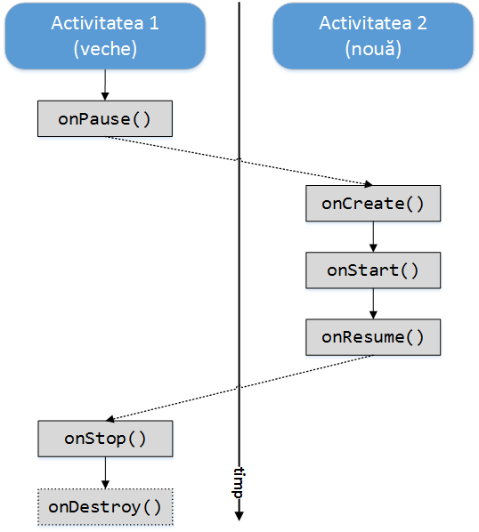
\</spoiler>

## Structura unui Proiect Android

### Android Studio

\<spoiler> În Android Studio, există mai multe perspective sub care
poate fi vizualizată structura unui proiect:

-   Project (reprezintă structura de pe discul fizic)
-   Packages
-   Scratches
-   Android (reprezintă gruparea logică a modulelor aplicației Android)
-   Project Files
-   Problems
-   Production
-   Tests
-   Local Unit Tests
-   Android Instrumented Tests

Cele mai frecvent utilizate perspective sunt *Project* și *Android*.

Organizarea unui proiect Android Studio conține următoarele directoare:


-   .gradle - fișiere temporare Gradle (biblioteci descărcate, fișiere
    de configurare)
-   .idea - fișiere temporare Android Studio
-   app
    -   build - fișiere generate conținând referințe (adrese) către
        resursele definite (spre exemplu, în directorul
        `generated/source` se găsesc clasele `BuildConfig` și `R`);
    -   src
        -   androidTest - cazuri de test
        -   main
            -   assets - resurse necompilate
            -   java - codul sursă java
            -   res
                -   drawable - resurse grafice
                -   layout - interfețe grafice definite static în
                    fișiere XML
                -   midmap-\<resolution> - pictograma aplicației, pentru
                    diferite rezoluții
                -   values - constante care vor fi referite în text
                    -   colors.xml
                    -   dimens.xml
                    -   strings.xml
                    -   styles.xml
                -   AndroidManifest.xml - doar componentele aplicației
                    Android: activități, servicii, receptoare cu
                    difuzare, filtre de intenții pentru fiecare
                    componentă
        -   test - surse pentru teste unitare
-   build - cache pentru fișiere .dex
-   gradle
-   External Libraries
-   alte fișiere (în rădăcină):
    -   .gitignore
    -   \<project>.iml
    -   build.gradle
    -   gradle.properties
    -   gradlew
    -   local.properties
    -   settings.gradle

\</spoiler>

### Gradle

Android Studio folosește un mecanism automat pentru construirea
aplicației Android, denumit **Gradle**, responsabil cu aducerea
bibliotecilor referite de pe un depozit la distanță, cu definirea
proprietăților aplicației Android, cu compilarea și împachetarea tuturor
resurselor folosite, pentru rularea și instalarea aplicației astfel
rezultate.

Regulile pentru construiea aplicației Android sunt precizate în fișiere
`build.gradle`, care se definesc pentru fiecare modul și proiect
constituent.

Un fișier de configurare Gradle pentru o aplicație Android conține de
regulă două secțiuni:

-   `android` - conține proprietățile aplicației Android
    -   `compileSdkVersion` - reprezintă versiunea de SDK care va fi
        utilizată pentru compilarea proiectului Android
    -   `buildToolsVersion` - reprezintă versiunea de Android SDK Build
        Tools folosită pentru construirea fișierului care va fi instalat
        pe dispozitivul mobil
    -   defaultConfig - conține diferite configurări
        -   `applicationId` - pachetul care identifică **în mod unic**
            aplicația Android
        -   `midSdkVersion` - platforma minimă pe care se garantează că
            aplicația Android va rula; astfel, se vor folosi numai
            funcționalități definite la acest nivel sau funcționalități
            definite în API-uri superioare, dar care sunt disponibile la
            nivelul bibliotecilor de suport;
        -   `targetSdkVersion` - platforma maximă la care se garantează
            că aplicația Android va rula (de regulă, este versiunea cea
            mai recentă și este aceeași versiune folosită pentru
            compilarea codului sursă);
        -   `versionCode` - versiunea curentă a aplicației (număr
            întreg)
        -   `versionName` - versiunea curentă a aplicației, afișată
            către utilizator (format lizibil, de tip șir de caractere)
        -   `testInstrumentationRunner` - biblioteca folosită pentru
            testele aplicației Android
-   `dependencies` - reprezintă bibliotecile de care depinde aplicația
    Android pentru a putea fi compilată / rulată, precum și reguli de
    compilare
    -   `compile` - se precizează care fișiere sunt luate în considerare
        pentru classpath
        -   directiva `include` se folosește pentru a indica tipuri de
            fișiere care conțin diverse biblioteci);
        -   directiva `fileTree` este utilizată pentru a indica o
            structura de directoare
    -   `testCompile` și `androidTestCompile` - indică pachete care
        conțin biblioteci pentru teste unitare.

``` .gradle
apply plugin: 'com.android.application'

android {
    compileSdkVersion 25
    buildToolsVersion "25.0.2"
    defaultConfig {
        applicationId "ro.pub.systems.eim.lab02.activitylifecyclemonitor"
        minSdkVersion 16
        targetSdkVersion 25
        versionCode 1
        versionName "1.0"
        testInstrumentationRunner "android.support.test.runner.AndroidJUnitRunner"
    }
    buildTypes {
        release {
            minifyEnabled false
            proguardFiles getDefaultProguardFile('proguard-android.txt'), 'proguard-rules.pro'
        }
    }
}
dependencies {
    compile fileTree(dir: 'libs', include: ['*.jar'])
    compile 'com.android.support:appcompat-v7:25.2.0'
}
```

## Rularea și Depanarea unei aplicații Android

### Rularea unei aplicații Android

Pentru a rula aplicația, este necesar un dispozitiv mobil fizic sau un
dispozitiv mobil virtual (emulator).

-   În cazul în care se folosește **GenyMotion**, se pornește un
    dispozitiv virtual, starea acestuia putând fi monitorizată folosind
    Genymotion Virtual Devices Manager, fereastră ce se deschide în
    momentul în care se accesează plugin-ul de Eclipse corespunzător
    (`Ctrl+6`).  
    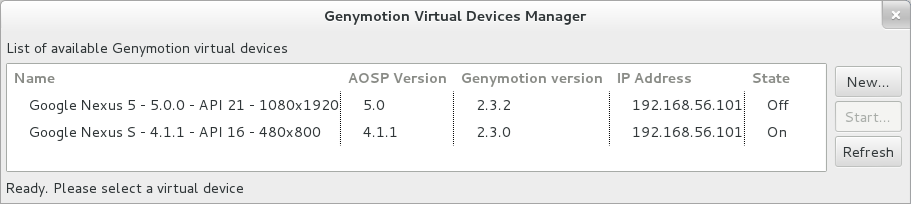
-   În cazul în care se folosește **emulatorul AVD** livrat împreună cu
    SDK-ul de Android, se va crea un dispozitiv virtual accesând
    *Window* → *Android Virtual Device Manager*  
    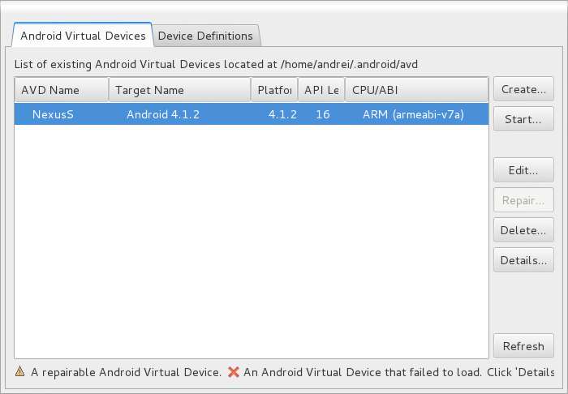  
    Acesta permite gestiunea dispozitivelor virtuale (*New* / *Edit* /
    *Delete*) prin specificarea unor parametrii precum dispozitivul
    (poate fi utilizat un dispozitiv predefinit sau un dispozitiv
    definit de utilizator, pornind de la configurațiile existente în
    *Device Definitions*), versiunea de Android pe care se va rula,
    caracteristicile referitoare la memorie (RAM, heap-ul pentru mașina
    virtuală), dimensiunea spațiului de stocare, emularea unui card de
    memorie (dimensiune, fișier pe disc). Pornirea propriu-zisă a
    dispozitivului se face prin opțiunea *Start*.  
    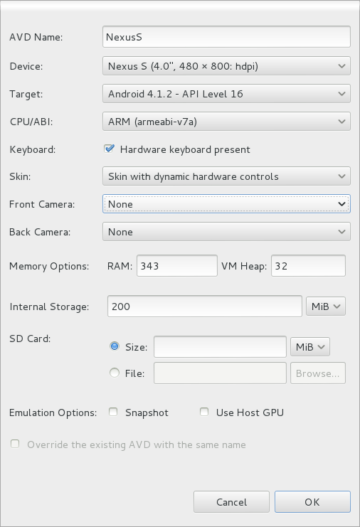

Ulterior se poate rula aplicația, accesând din meniul contextual al
proiectului (click dreapta) *Run As..* → *Android Application* (sau
`Ctrl+F11`). În acest moment, se vor identifica toate dispozitivele
Android (fizice sau virtuale) care sunt disponibile (conectate) și care
rulează un sistem de operare având cel puțin un nivel de API specificat
de proprietatea `android:minSdkVersion` în cadrul fișierului
`AndroidManifest.xml`, afișându-se lista acestora, astfel încât
utilizatorul să își poată alege unul dintre ele.

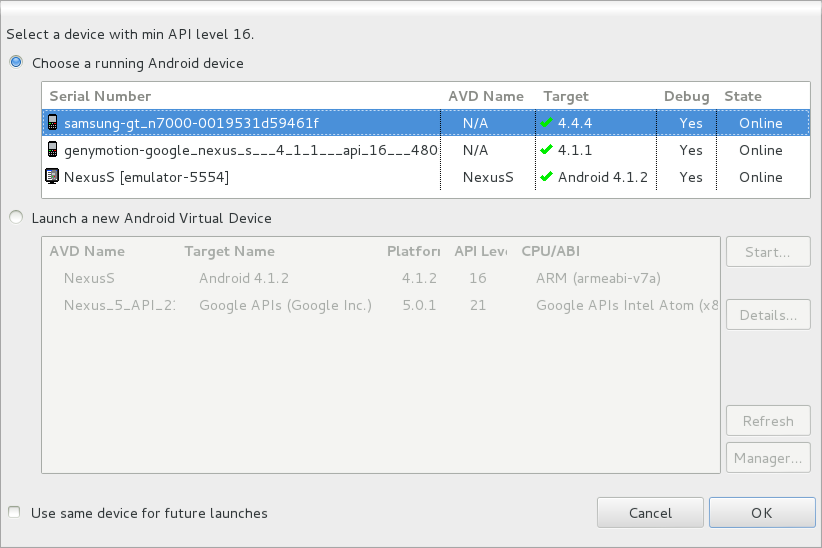

### Depanarea unei aplicații Android

Depanarea unei aplicații Android poate fi realizată în mod clasic, ca în
cazul oricărui proiect (prin stabilirea unor puncte în care execuția
codului sursă este întreruptă și rularea pas cu pas) sau prin
intermediul unor utilitare specifice.

#### Android Debug Bridge (ADB)

Android Debug Bridge este un utilitar în linie de comandă care permite
comunicarea cu cu un dispozitiv mobil fizic sau cu un emulator, prin
intermediul unui program client-server ce include 3 componente:

-   un client, apelat prin comanda `adb` (alți clienți sunt plugin-ul
    ADT, ADM-ul, Layout Inspector);
-   un server (rulează ca proces de fundal), care gestionează
    comunicarea dintre client și daemonul ce rulează pe emulator sau
    dispozitivul mobil fizic;
-   un daemon, care rulează ca un proces de fundal pentru fiecare
    emulator sau dispozitiv mobil fizic.

ADB este integrat în SDK-ul de Android, regăsindu-se în directorul
`platform-tools`.

**Comenzi ADB**

-   pentru a folosi ADB shell, device-ul Android trebuie să fie root-at
    (imaginile genymotion sunt deja).
-   comenzile ADB pot fi rulate din linia de comandă sau din script,
    având următorul
    format:`student@eim-lab:/opt/android-sdk-linux/platform-tools$ adb [-d|-e|-s <serialNumber>] <command>
    `
-   înainte de a utiliza comenzi `adb` este important să fie cunoscut
    identificatorul dispozitivului care este conectat la serverul adb,
    acesta putând fi identificat prin comanda
    `adb devices`:`student@eim-lab:/opt/android-sdk-linux/platform-tools$ adb devices
    List of devices attached 
    emulator-5556           device
    192.168.56.101:5555 device
    0123456789ABCDEF    device
    `
-   conexiunea la emulator se realizează folosind comanda
    `adb -s <serialNumber> shell`

Depanarea este foarte importantă în procesul de realizare a aplicațiilor
pentru dispozitive mobile. Există însă unele diferențe față de depanarea
programelor pentru calculator, întrucât aplicațiile rulează pe un alt
dispozitiv, fiind necesare programe specializate. De asemenea, fiind
vorba de dispozitive mobile, apar și anumite evenimente specifice, cum
ar fi apeluri telefonice, primirea unui mesaj, descărcărea bateriei,
întreruperi ce trebuie tratate intr-un fel sau altul.

#### LogCat

Jurnalele sistemului de operare conțin cele mai importante informații
pentru programator. Acestea descriu toate acțiunile realizate de către
dispozitivul mobil, excepțiile apărute precum și alte informații
necesare depanării. Ele pot fi vizualizate în panoul denumit **LogCat**.

---
**Note**

LogCat nu trebuie confundat cu Console, în care sunt
afișate mesajele provenind de la Eclipse.\

---

De regulă, la pornirea unei aplicații, utilizatorul este întrebat dacă
dorește să monitorizeze mesajele provenind de la dispozitivul mobil,
indicându-se și nivelul de prioritate prin care acestea vor fi filtrate
(`verbose`, `debug`, `info`, `warning`, `error`, `assert`).

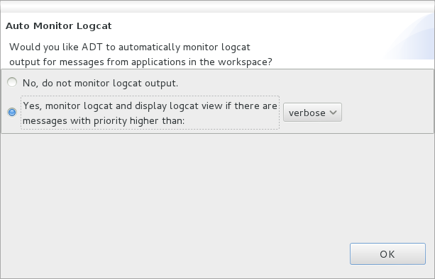

Ulterior, acest *Window* → *Show View* → *Other...* → *Android* →
*LogCat*

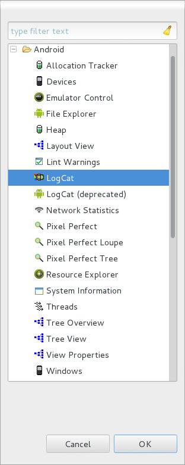

Fiecare mesaj din această listă este insoțit de următoarele informații
(fiecare pe cate o coloană):

-   *Level* (tipul mesajului)
    -   **V** - *Verbose* - informații suplimentare afișate de programe
        (de obicei la cerere, se folosesc la depistarea problemelor de
        funcționare rezultate din cauza configurării greșite a
        programelor)
    -   **D** - *Debug* - mesaj utile la depanare
    -   **I** - *Information* - mesaj informativ
    -   **W** - *Warning* - mesaj de avertizare (excepțiile ce nu sunt
        foarte importante, neavând un impact semnificativ asupra
        componentei)
    -   **E** - *Error* - mesaj de eroare (excepțiile ce întrerup o
        componentă)
    -   **A** - *Assert* - mesaj ce indică faptul că o condiție
        esențială pentru rularea aplicației nu a fost îndeplinită
-   *Time* - data și ora la care a fost generat mesajul
-   *PID* - identificatorul procesului ce a generat mesajul
-   *TID* - identificatorul firului de execuție ce a general mesajul
-   *Application* - aplicațtia care a generat mesajul
-   *Tag* - eticheta sau categoria mesajului (util pentru definirea de
    filtre)
-   *Text* - conținutul propriu-zis al mesajului

Este de remarcat faptul că fiecare mesaj reprezintă câte o linie de
text. În cazul excepțiilor, întrucât acestea conțin în general mai multe
linii, cuprinzând foarte multă informație, ele vor fi reprezentate de
mai multe mesaje.


Există două mecanisme prin care utilizatorii pot genera astfel de
mesaje:

-   metodele statice ale clasei
    [Log](http:*developer.android.com/reference/android/util/Log.html),
    care primesc ca parametru prioritatea mesajului, eticheta și mesajul
    propriu
    zis`Log.[wdiea] (Log.DEBUG, "log sample", "this is a log message using 'log sample' tag");`Pentru
    a se evita specificarea priorității mesajului de fiecare dată, se
    pot utiliza metode specifice, care primesc ca parametrii doar
    denumirea etichetei și mesajul ce se dorește a fi jurnalizat:

<center>

| Nivel de Prioritate | Metodă       | Observații                                                      |
|---------------------|--------------|-----------------------------------------------------------------|
| `ERROR`             | `Log.e(...)` | erori                                                           |
| `WARNING`           | `Log.w(...)` | avertismente                                                    |
| `INFO`              | `Log.i(...)` | mesaje de informare                                             |
| `DEBUG`             | `Log.d(...)` | mesaje utilizate pentru depanare; pot fi filtrate (ignorate)    |
| `VERBOSE`           | `Log.v(...)` | utilizate doar de programatori, pentru dezvoltarea aplicațiilor |

</center>

-   *System.out.println* mesajele către consola standard
    (stdout)`System.out.println("this is a message to the standard console");`Mesajele
    transmise sub această formă vor fi de tipul `Information` și vor
    avea eticheta `System.out`.

O altă funcționalitate importantă este posibilitatea de filtrare a
mesajelor de tip jurnal. Deoarece LogCat afișează toate mesajele de log
din sistem, urmărirea unor anumite mesaje poate fi dificilă. Pentru a
facilita această sarcină, se pot genera filtre în funcție de anumite
valori ale:

-   etichetei
-   mesajului propriu-zis
-   PID
-   denumirii aplicației
-   nivelului minim al tipului de mesaj (`verbose` → `assert`)

Un filtru se creează prin apăsarea butonului plus de culoare verde din
bara panoului Log (respectiv LogCat în Eclipse). In Android Studio,
LogCat se poate accesa din partea stânga jos a IDE-ului.


Se recomandă să se configureze un număr cât mai mare de mesaje de
jurnalizare care să fie stocate în memoria tampon (*Window* →
*Preferences* → *Android* → *LogCat*) întrucât după depășirea valorii
respective, monitorizarea nu va mai fi posibilă.

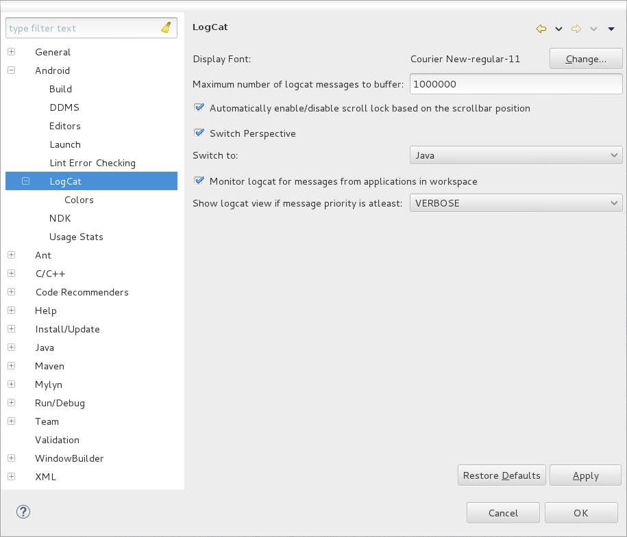

**Simularea unor evenimente de tip întrerupere pentru emulator**
\<spoiler> Întrucât emulatorul de Android nu poate simula toate
funcțiile unui telefon real, pentru a se putea testa comportamentul
aplicațiilor în cazul apariției unor evenimente de tip întrerupere,
DDMS(deprecated) pune la dispoziție un panou ***Emulator Control***,
prin care pot fi controlate:

-   starea conexiunii de voce / date
-   primirea unui apel telefonic / SMS (apel, pierdere apel)
-   date primite de la GPS


---
**Note**

În cazul testării pe dispozitive mobile reale, aceste
funcționalități nu vor fi disponibile prin intermediul ADM.\

---

---
**Note**

Emulatorul Genymotion nu permite simularea nici unuia
dintre evenimentele de mai sus prin intermediul DDMS.\

---

Din cadrul emulatoarelor (deci nu folosind DDMS) mai pot fi simulate
evenimente de tip:

-   cameră foto
-   accelerometru

\</spoiler>

#### Layout Inspector

\<spoiler> Un alt program foarte util pentru depanare este **Layout
Inspector** (anterior, purta denumirea Hierarchy View). Acesta permite
vizualizarea arborescentă a structurii ferestrelor. De asemenea,
afișează parametrii fiecărui `View`, inclusiv timpul de încărcare. O
altă funcționalitate pusă la dispoziția programatorilor este
posibilitatea capturării unei imagini a View-ului.

Întrucât prin acest utilitar se poate analiza orice aplicație
(componentă) care rulează pe un dispozitiv mobil, el poate fi utilizat
și ca sursă de inspirație asupra modului în care este construită
interfața grafică.

Layout Inspector este accesibil în Android Studio în *Tools* → *Android*
→ *Android Device Monitor*. Hierarchy View poate fi accesat în Eclipse
sub forma unei perspective, care va fi deschisă prin *Window* → *Open
Perspective* → *Hierarchy View*.

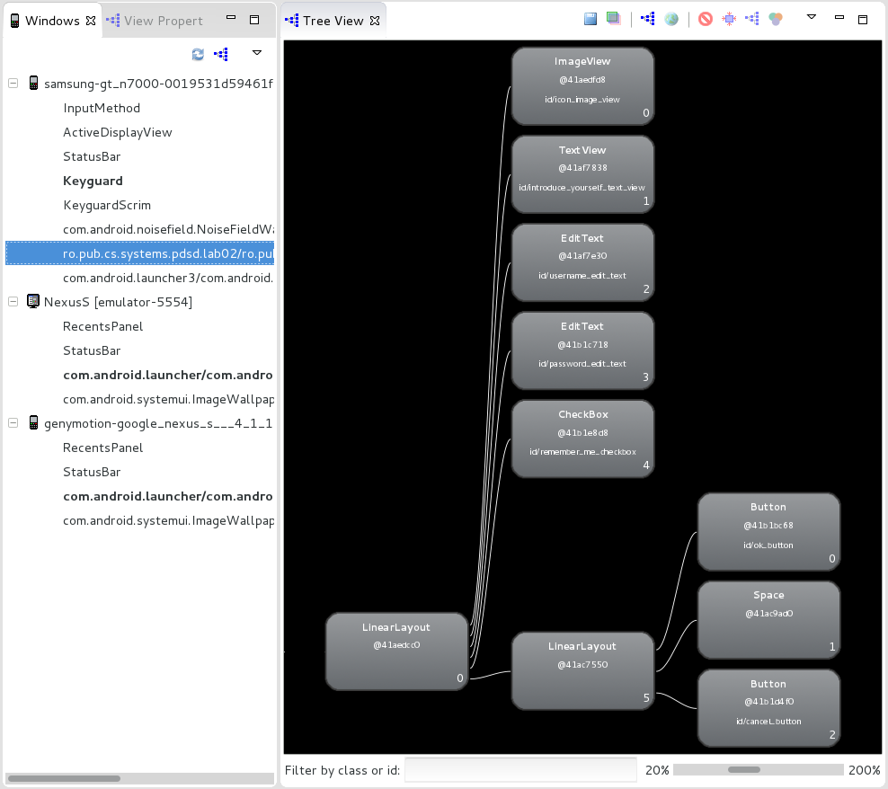

Utilitarul funcționează atât pentru emulatoare cât și cu dispozitive
fizice.

La pornire, în panoul *Windows* (stânga) este afișată lista tuturor
dispozitivelor mobile conectate. Se alege un dispozitiv mobil și o
componentă ce rulează pe acel dispozitiv (prin expandarea dispozitivului
mobil) și se apasă butonul *Load the view hierarchy into the tree view*.
Afișarea ierarhiei de View-uri se face în panoul *Tree View* (centru)
sub forma unui arbore. Panoul *Tree Overview* (dreapta) va prezenta o
imagine de ansamblu a ierarhiei, evidențiindu-se selecția vizibilă la
momentul respectiv în fereastra principală.

În momentul în care este selectat un element al arborelui, acesta va
putea fi previzualizat (se prezintă imaginea sa), indicându-se
componența sa, precum și unii parametrii ai acestuia (`measure`,
`layout`, `draw`).


Fereastra *View Properties* va conține toate proprietățile unei
componente grafice, grupate pe categorii.


Fereastra *Layout View* evidențiază componenta curentă în cadrul
interfeței grafice.


\</spoiler>

## Activitate de Laborator

**1.** În contul Github personal, să se creeze un depozit denumit
'Laborator02'. Inițial, acesta trebuie să fie gol (nu trebuie să bifați
nici adăugarea unui fișier `README.md`, nici a fișierului `.gitignore`
sau a a fișierului `LICENSE`).

**2.** Să se cloneze în directorul de pe discul local conținutul
depozitului la distanță de la
[](https:*www.github.com/eim-lab/Laborator02). În urma acestei
operații, directorul Laborator02 va trebui să se conțină un director
`labtasks` ce va deține proiectul Android Studio denumit
`ActivityLifecycleMonitor`, fișierul `README.md` și un fișier
`.gitignore` care indică tipurile de fișiere (extensiile) ignorate.
`student@eim-lab:~$ git clone https:*www.github.com/eim-lab/Laborator02.git
`

**3.** Să se încarce conținutul descărcat în cadrul depozitului
'Laborator02' de pe contul Github personal.
`student@eim-lab:~$ cd Laborator02
student@eim-lab:~/Laborator02$ git remote add Laborator02_perfectstudent https:*github.com/perfectstudent/Laborator02
student@eim-lab:~/Laborator02$ git push Laborator02_perfectstudent master
`

**4.** Să se încarce în mediul integrat de dezvoltare Android Studio
proiectul `ActivityLifecycleMonitor`, folosind opțiunea *Open an
Existing Android Studio Project*.

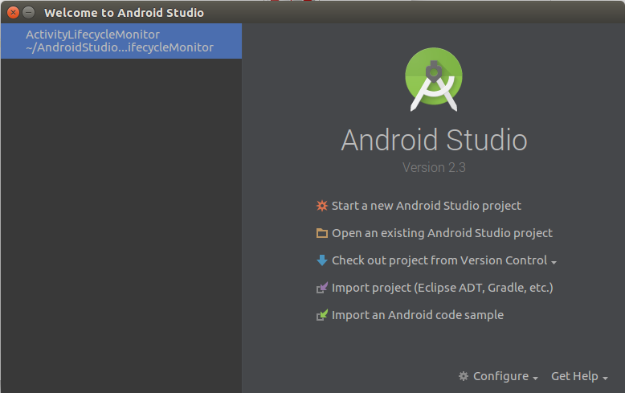

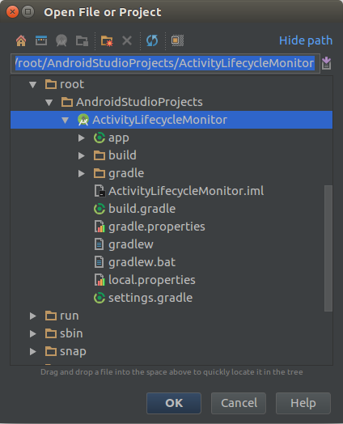

**5.** În clasa `LifecycleMonitorActivity` din pachetul
`ro.pub.cs.systems.eim.lab02.activitylifecyclemonitor.graphicuserinterface`,
să se suprascrie metodele care monitorizează ciclul de viață al unei
activități; fiecare dintre acestea va trebui **să apeleze metoda
părinte** și **să notifice apelarea sa prin intermediul unui mesaj**,
având prioritatea `DEBUG` și eticheta
`activitylifecyclemonitor`:`Log.d(Constants.TAG, "??? method was invoked");
`

      - ''onRestart()'' 
      - ''onStart()''
      - ''onResume()''
      - ''onPause()''
      - ''onStop()''
      - ''onDestroy()''

**6.** Să se creeze un filtru, denumit `ActivityLifecycleMonitor`,
astfel încât LogCat să afișeze doar mesajele care au eticheta
`activitylifecycle`, generate de aplicația
`ro.pub.systems.eim.lab02.activitylifecyclemonitor` și au cel puțin
prioritatea `debug`.

**7.** Să se modifice mesajul din metoda `onCreate()`, astfel încât să
se indice dacă activitatea a mai fost lansată în execuție anterior sau
nu (dacă există o stare a activității care trebuie restaurată).

**8.** Să se inspecteze mesajele care sunt generate la producerea
următoarelor evenimente:

      - se apasă butonul *Home*
      - se apasă butonul *Back*
      - se apasă butonul *OK* din cadrul aplicației (indiferent dacă datele de autentificare sunt corecte sau nu)
      - se apasă butonul *lista app* 
      - se primește un apel telefonic\\ a) pentru AVD, se poate folosi *ADM* → *Emulator Control*\\ b) pentru Genymotion se poate simula doar formarea unui număr de telefon <code>

student@eim-lab:/opt/android-sdk-linux/platform-tools$ adb devices List
of devices attached 192.168.56.101:5555 device
student@eim-lab:/opt/android-sdk-linux/platform-tools$ adb -s
192.168.56.101:5555 shell root@android:/ # am start -a
android.intent.action.CALL <tel:1122334455> Starting: Intent {
act=android.intent.action.CALL dat=<tel:xxxxxxxxxx> } \</code>

        - se acceptă convorbirea
        - se respinge convorbirea
      - se rotește ecranul (nu trebuie blocată opțiunea *Auto Rotate* din configurațiile dispozitivului mobil)

Să se observe ce metode sunt apelate în momentul în care se revine în
aplicație.

Pe baza mesajelor, să se completeze tabelul de mai jos, indicând ordinea
în care s-au apelat metodele respective:

|                              | `onCreate()` | `onRestart()` | `onStart()` | `onResume()` | `onPause()` | `onStop()` | `onDestroy()` |
|------------------------------|--------------|---------------|-------------|--------------|-------------|------------|---------------|
| 1\) buton *Home*             |              |               | 3           | 4            | 1           | 2          |               |
| 2\) buton *Back*             |              |               |             |              |             |            |               |
| 3\) buton *OK* din aplicație |              |               |             |              |             |            |               |
| 4\) buton *lista app*        |              |               |             |              |             |            |               |
| 5\) apel telefonic           |              |               |             |              |             |            |               |
| a\) acceptare                |              |               |             |              |             |            |               |
| b\) respingere               |              |               |             |              |             |            |               |
| 6\) rotire ecran             |              |               |             |              |             |            |               |

**9.** Să se dezactiveze opțiunea de salvare a stării.

---
**Note**

În fișierul `activity_lifecycle_monitor.xml`, pentru fiecare
dintre elementele grafice pentru care se dorește să se dezactiveze
opțiunea de salvare a stării, se va completa proprietatea
`android:saveEnabled="false"`.\

---

Să se observe care este comportamentul în privința informațiilor
reținute în elementele grafice de tip `EditText`, respectiv `CheckBox`,
în condițiile în care activitatea este distrusă (se apasă butonul
*Home*, astfel încât să se apeleze metodele `onPause()` și `onStop()`,
apoi se închide aplicația. Să se repornească aplicația din meniul
dispozitivului mobil.

**10.** Să se implementeze metoda `onSaveInstanceState()`, astfel încât,
**în condițiile în care este bifat elementul grafic de tip `CheckBox`**,
să se salveze informațiile din interfața cu utilizatorul.

---
**Note**

Se vor folosi metodele `putString()` și `putBoolean()` ale
clasei `Bundle`.  
  
Cheile sub care vor fi identificate valorile salvate sunt definite în
interfața `Constants` din pachetul
`ro.pub.cs.systems.eim.lab02.activitylifecyclemonitor.general`.  
  
Verificarea faptului că un element grafic de tip `CheckBox` este bifat
se face prin intermediul metodei `isChecked()`.\

---

Să se observe comportamentul aplicației în condițiile producerii
evenimentului descris anterior.

**11.** Să se implementeze metoda `onRestoreInstanceState()` astfel
încât să se restaureze starea elementelor grafice. Să se observe
comportamentul aplicației în condițiile producerii evenimentului descris
anterior.

Să se transfere comportamentul de restaurare a stării pe metoda
`onCreate()` și să se identifice diferențele de implementare
([Hint](https:*developer.android.com/guide/components/activities/activity-lifecycle.html#saras)).

**12.** Să se încarce modificările realizate în cadrul depozitului
'Laborator02' de pe contul Github personal, folosind un mesaj sugestiv.
`student@eim-lab:~/Laborator02$ git add labtasks/*
student@eim-lab:~/Laborator02$ git commit -m "implemented tasks for laboratory 02"
student@eim-lab:~/Laborator02$ git push Laborator02_perfectstudent master
`

## Resurse Utile

[Joseph ANNUZZI, Jr, Lauren DARCEY, Shane CONDER, Introduction to
Android Application Development - Developer's Library, 4th Edition,
Addison-Wesley,
2013](http:*ptgmedia.pearsoncmg.com/images/9780321940261/samplepages/0321940261.pdf)  
[Bill PHILLIPS, Brian HARDY, Android Programming. The Big Nerd Ranch
Guide, Pearson Technology Group,
2013](http:*www.bignerdranch.com/we-write/android-programming/)  
[Wei Meng LEE, Beginning Android 4 Application Development, Wiley,
2012](http:*eu.wiley.com/WileyCDA/WileyTitle/productCd-1118199545.html)  
[Satya KOMATINENI, Dave MACLEAN, Pro Android 4, Apress,
2012](http:*www.apress.com/9781430239307)  
[Android Programming Tutorials - Core
Servlets](http:*www.coreservlets.com/android-tutorial)  
[Android Programming Tutorial - Tutorial's
Point](http:*www.tutorialspoint.com/android/index.htm)  
[Dezvoltarea aplicațiilor pentru
Android](http:*android.rosedu.org/wiki/)  
[Saving (and Retrieving) Android Instance
State](http:*www.intertech.com/Blog/saving-and-retrieving-android-instance-state-part-1/)  
[Avoiding Memory
Leaks](http:*android-developers.blogspot.ro/2009/01/avoiding-memory-leaks.html)  
[Activities - Android
Developers](http:*developer.android.com/guide/components/activities.html)  
[Things that cannot
change](http:*android-developers.blogspot.ro/2011/06/things-that-cannot-change.html)
