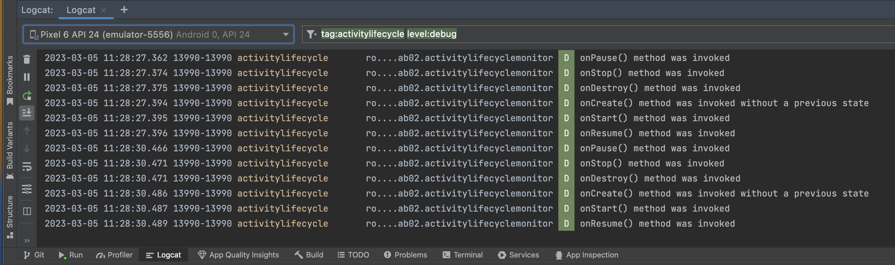
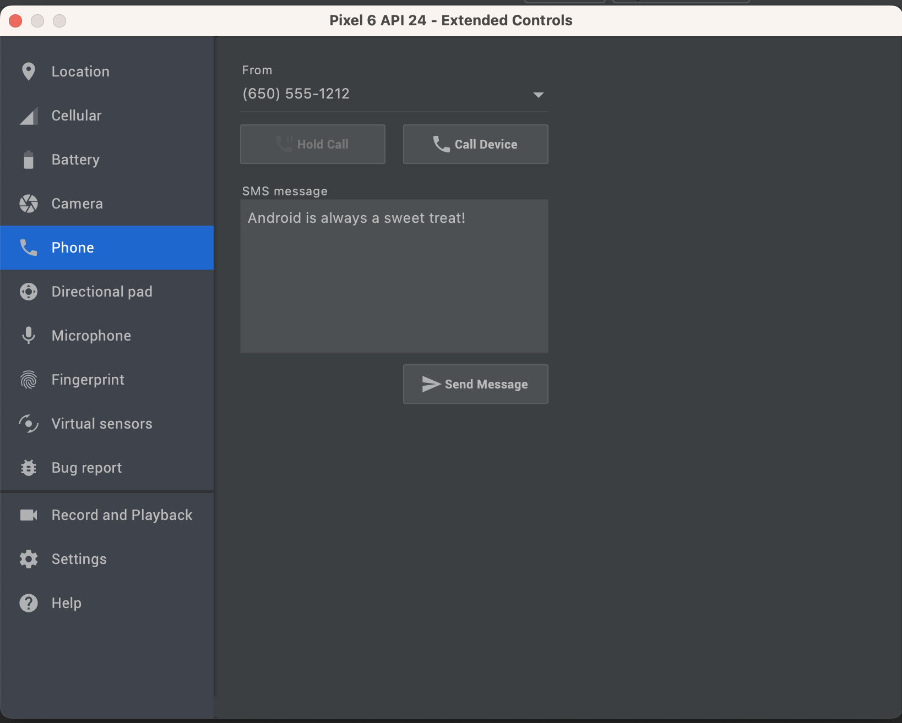

## Logcat

Jurnalele sistemului de operare conțin cele mai importante informații
pentru programator. Acestea descriu toate acțiunile realizate de către
dispozitivul mobil, excepțiile apărute precum și alte informații
necesare depanării. Ele pot fi vizualizate în panoul denumit **LogCat**. 
Dacă acesta nu este vizibil în bara de jos, el poate să fie accesat din bara de sus: View -> Tool Windows -> Logcat.

---

Fiecare mesaj din această listă este insoțit de următoarele informații
(fiecare pe cate o coloană):

-   *Level* (tipul mesajului)
    -   **V** - *Verbose* - informații suplimentare afișate de programe
        (de obicei la cerere, se folosesc la depistarea problemelor de
        funcționare rezultate din cauza configurării greșite a
        programelor)
    -   **D** - *Debug* - mesaj utile la depanare
    -   **I** - *Information* - mesaj informativ
    -   **W** - *Warning* - mesaj de avertizare (excepțiile ce nu sunt
        foarte importante, neavând un impact semnificativ asupra
        componentei)
    -   **E** - *Error* - mesaj de eroare (excepțiile ce întrerup o
        componentă)
    -   **A** - *Assert* - mesaj ce indică faptul că o condiție
        esențială pentru rularea aplicației nu a fost îndeplinită
-   *Time* - data și ora la care a fost generat mesajul
-   *PID* - identificatorul procesului ce a generat mesajul
-   *TID* - identificatorul firului de execuție ce a general mesajul
-   *Application* - aplicațtia care a generat mesajul
-   *Tag* - eticheta sau categoria mesajului (util pentru definirea de
    filtre)
-   *Text* - conținutul propriu-zis al mesajului

Este de remarcat faptul că fiecare mesaj reprezintă câte o linie de
text. În cazul excepțiilor, întrucât acestea conțin în general mai multe
linii, cuprinzând foarte multă informație, ele vor fi reprezentate de
mai multe mesaje.

Există două mecanisme prin care utilizatorii pot genera astfel de
mesaje:

-   metodele statice ale clasei
    [Log](http:developer.android.com/reference/android/util/Log.html),
    care primesc ca parametru prioritatea mesajului, eticheta și mesajul
    propriu
    zis`Log.[wdiea] (Log.DEBUG, "log sample", "this is a log message using 'log sample' tag");`Pentru
    a se evita specificarea priorității mesajului de fiecare dată, se
    pot utiliza metode specifice, care primesc ca parametrii doar
    denumirea etichetei și mesajul ce se dorește a fi jurnalizat:

| Nivel de Prioritate | Metodă       | Observații                                                      |
|---------------------|--------------|-----------------------------------------------------------------|
| `ERROR`             | `Log.e(...)` | erori                                                           |
| `WARNING`           | `Log.w(...)` | avertismente                                                    |
| `INFO`              | `Log.i(...)` | mesaje de informare                                             |
| `DEBUG`             | `Log.d(...)` | mesaje utilizate pentru depanare; pot fi filtrate (ignorate)    |
| `VERBOSE`           | `Log.v(...)` | utilizate doar de programatori, pentru dezvoltarea aplicațiilor |

-   *System.out.println* mesajele către consola standard
    (stdout)`System.out.println("this is a message to the standard console");`Mesajele
    transmise sub această formă vor fi de tipul `Information` și vor
    avea eticheta `System.out`.

O altă funcționalitate importantă este posibilitatea de filtrare a
mesajelor de tip jurnal. Deoarece LogCat afișează toate mesajele de log
din sistem, urmărirea unor anumite mesaje poate fi dificilă. Pentru a
facilita această sarcină, se pot genera filtre în funcție de anumite
valori ale:
- **package:mine** este folosit pentru a filtra mesajele care corespund doar aplicației noastre.
- **tag~:.\*lifecycle** Pentru etichetă se pot folosi expresii regulate cu ajutorul '~'.
- **level:debug** nivelul minim al tipului de mesaj
- **mesajului propriu-zis**
- **is:crash** pentru a păstra doar mesajele care conțin informații despre crash.

**Simularea unor evenimente de tip întrerupere pentru emulator**
Pentru a se putea testa comportamentul aplicațiilor în cazul apariției unor evenimente de tip întrerupere,
AVD pune la dispoziție **Extended Controls**, care oferă următoarele funcționalități:

-   primirea unui apel telefonic / SMS (apel, pierdere apel)
-   starea conexiunii de voce / date
-   date primite de la GPS

---
**Note**

Emulatorul Genymotion nu permite simularea nici unuia dintre evenimentele de mai sus.

---

Din cadrul emulatoarelor mai pot fi simulate evenimente de tip:

-   cameră foto
-   starea bateriei
-   accelerometru
-   proximitate
-   temperatura ambientală
