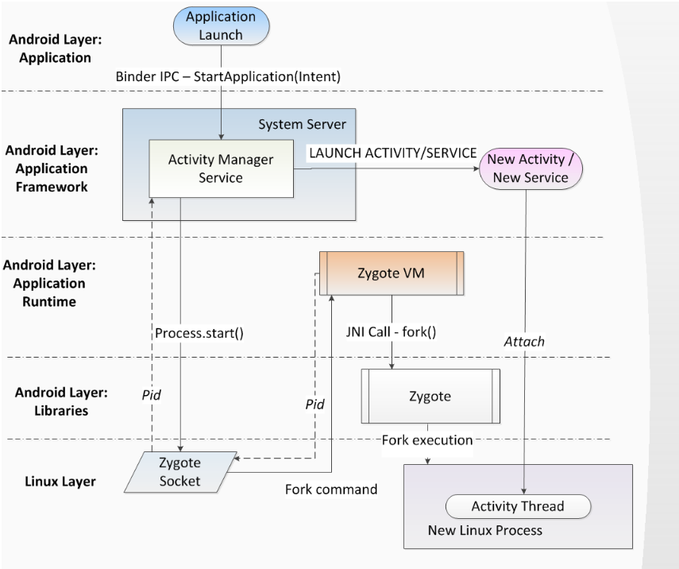

# Procese

Când o componentă a aplicației pornește și aplicația nu are alte componente în
execuție, sistemul Android **începe un nou proces Linux** pentru aplicație cu **un
singur thread**. În mod implicit, toate componentele aceleiași aplicații
rulează în același proces și fir, numit firul main.

Dacă o componentă a aplicației pornește și există deja un proces pentru acea
aplicație, deoarece o altă componentă din aplicație a pornit deja, atunci
componenta pornește în cadrul acelui proces și folosește același fir de
execuție. Cu toate acestea, puteți aranja ca diferite componente din aplicație
să ruleze în procese separate, și puteți crea extra threads
suplimentare pentru orice proces.

Pe langa proces, va fi creat is un thread. Când o aplicație este lansată,
sistemul creează un thread de execuție pentru aplicație, numit **main thread**. Acest
**thread** este foarte important, deoarece este responsabil pentru trimiterea
evenimentelor către widget-urile corespunzătoare ale interfeței utilizator,
inclusiv evenimentele de desenare. De asemenea, este aproape întotdeauna firul
în care aplicația interacționează cu componentele din pachetele
android.widget și android.view ale kit-ului de instrumente UI Android. Din
acest motiv, firul main este uneori numit **UI thread**.

Ce se intampla daca rulam o operatie blocanta pe main thread?

Mai jos avem o diagrama a cum un proces este creat pe Android atunci cand o
activitate o aplicatie este pornita (prima activitate este lansata).

> În mod implicit, toate componentele unei aplicații rulează în același proces, și majoritatea aplicațiilor nu modifică acest lucru. Cu toate acestea, dacă considerați că trebuie să controlați cărei proces îi aparține o anumită componentă, puteți face acest lucru în fișierul manifest.

