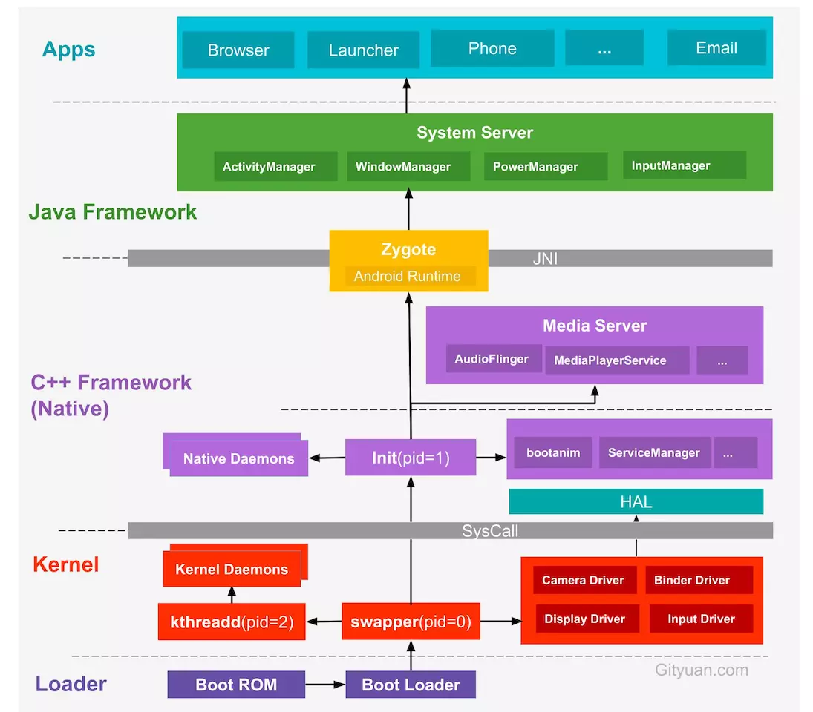

# Procese Zygote

Zygote este un proces în sistemul de operare Android care acționează ca
rădăcină a tuturor proceselor de sistem și aplicații cu aceeași interfață
binară a aplicației (ABI).

La ce este folosit Zygote?

* Demonul init generează procesul Zygote când sistemul de operare Android este
  inițializat. Pe unele sisteme cu arhitectură duală, sunt generate două
  procese Zygote (pe 64 de biți și 32 de biți). Această pagină acoperă doar
  sistemele cu arhitectură unică.

* Zygote poate genera imediat procese numite unspecialized app processes (USAP)
  sau poate aștepta să genereze procese după cum este necesar de către
  aplicații. 

