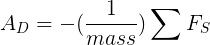
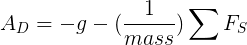

# Accelerometru

In general, pentru a cititi date de la senzori, vom avea nevoie de o instanta a
clasei `Sensors`.

<div class="tabbed-blocks">

  <pre><code class="language-java">

private SensorManager sensorManager;
private Sensor sensor;

sensorManager = (SensorManager) getSystemService(Context.SENSOR_SERVICE);
sensor = sensorManager.getDefaultSensor(Sensor.TYPE_ACCELEROMETER);

</code></pre>
<pre><code class="language-kotlin">

val sensorManager = getSystemService(Context.SENSOR_SERVICE) as SensorManager
val sensor: Sensor? = sensorManager.getDefaultSensor(Sensor.TYPE_ACCELEROMETER)

</code></pre>
</div>

Mai jos avem un exemplu complet de utilizare al accelerometrului:


<div class="tabbed-blocks">

  <pre><code class="language-java">

public class AccelerometerActivity extends Activity implements SensorEventListener {
    private SensorManager sensorManager;
    private Sensor accelerometer;
    private TextView xValueTextView, yValueTextView, zValueTextView;

    @Override
    protected void onCreate(Bundle savedInstanceState) {
        super.onCreate(savedInstanceState);
        setContentView(R.layout.activity_accelerometer);

        xValueTextView = findViewById(R.id.xValueTextView);
        yValueTextView = findViewById(R.id.yValueTextView);
        zValueTextView = findViewById(R.id.zValueTextView);

        sensorManager = (SensorManager) getSystemService(Context.SENSOR_SERVICE);
        if (sensorManager != null) {
            accelerometer = sensorManager.getDefaultSensor(Sensor.TYPE_ACCELEROMETER);
        }
    }

    @Override
    protected void onResume() {
        super.onResume();
        if (accelerometer != null) {
            sensorManager.registerListener(this, accelerometer, SensorManager.SENSOR_DELAY_NORMAL);
        }
    }

    @Override
    protected void onPause() {
        super.onPause();
        if (sensorManager != null) {
            sensorManager.unregisterListener(this);
        }
    }

    @Override
    public void onSensorChanged(SensorEvent event) {
        if (event.sensor.getType() == Sensor.TYPE_ACCELEROMETER) {
            float x = event.values[0];
            float y = event.values[1];
            float z = event.values[2];

            xValueTextView.setText("X: " + x);
            yValueTextView.setText("Y: " + y);
            zValueTextView.setText("Z: " + z);
        }
}

</code></pre>
<pre><code class="language-kotlin">

class AccelerometerActivity : AppCompatActivity(), SensorEventListener {
    private lateinit var sensorManager: SensorManager
    private var accelerometer: Sensor? = null
    private lateinit var xValueTextView: TextView
    private lateinit var yValueTextView: TextView
    private lateinit var zValueTextView: TextView

    override fun onCreate(savedInstanceState: Bundle?) {
        super.onCreate(savedInstanceState)
        setContentView(R.layout.activity_accelerometer)

        xValueTextView = findViewById(R.id.xValueTextView)
        yValueTextView = findViewById(R.id.yValueTextView)
        zValueTextView = findViewById(R.id.zValueTextView)

        sensorManager = getSystemService(Context.SENSOR_SERVICE) as SensorManager
        accelerometer = sensorManager.getDefaultSensor(Sensor.TYPE_ACCELEROMETER)
    }

    override fun onResume() {
        super.onResume()
        accelerometer?.let {
            sensorManager.registerListener(this, it, SensorManager.SENSOR_DELAY_NORMAL)
        }
    }

    override fun onPause() {
        super.onPause()
        sensorManager.unregisterListener(this)
    }

    override fun onSensorChanged(event: SensorEvent) {
        if (event.sensor.type == Sensor.TYPE_ACCELEROMETER) {
            val x = event.values[0]
            val y = event.values[1]
            val z = event.values[2]
            xValueTextView.text = "X: $x"
            yValueTextView.text = "Y: $y"
            zValueTextView.text = "Z: $z"
        }
    }
}

</code></pre>
</div>

La nivel conceptual, un senzor de accelerație determină accelerația care este
aplicată unui dispozitiv (Ad) prin măsurarea forțelor care sunt aplicate asupra
senzorului însuși (Fs) folosind următoarea relație:



Cu toate acestea, forța gravitațională influențează întotdeauna accelerația măsurată conform următoarei relații:



Din acest motiv, atunci când dispozitivul stă pe o masă (și nu accelerează),
accelerometrul indică o magnitudine de g = 9,81 m/s². În mod similar, când
dispozitivul este în cădere liberă și, prin urmare, accelerează rapid spre
pământ cu 9,81 m/s², accelerometrul său indică o magnitudine de g = 0 m/s².
Prin urmare, pentru a măsura accelerația reală a dispozitivului, contribuția
forței gravitaționale trebuie eliminată din datele accelerometrului. Acest
lucru poate fi realizat prin aplicarea unui filtru trece-sus. În mod invers, un
filtru trece-jos poate fi utilizat pentru a izola forța gravitațională.
Următorul exemplu arată cum puteți face acest lucru:


<div class="tabbed-blocks">

  <pre><code class="language-java">

@Override
public void onSensorChanged(SensorEvent event){
    // In this example, alpha is calculated as t / (t + dT),
    // where t is the low-pass filter's time-constant and
    // dT is the event delivery rate.

    final float alpha = 0.8;

    // Isolate the force of gravity with the low-pass filter.
    gravity[0] = alpha * gravity[0] + (1 - alpha) * event.values[0];
    gravity[1] = alpha * gravity[1] + (1 - alpha) * event.values[1];
    gravity[2] = alpha * gravity[2] + (1 - alpha) * event.values[2];

    // Remove the gravity contribution with the high-pass filter.
    linear_acceleration[0] = event.values[0] - gravity[0];
    linear_acceleration[1] = event.values[1] - gravity[1];
    linear_acceleration[2] = event.values[2] - gravity[2];
}

</code></pre>
<pre><code class="language-kotlin">

override fun onSensorChanged(event: SensorEvent) {
    // In this example, alpha is calculated as t / (t + dT),
    // where t is the low-pass filter's time-constant and
    // dT is the event delivery rate.

    val alpha: Float = 0.8f

    // Isolate the force of gravity with the low-pass filter.
    gravity[0] = alpha * gravity[0] + (1 - alpha) * event.values[0]
    gravity[1] = alpha * gravity[1] + (1 - alpha) * event.values[1]
    gravity[2] = alpha * gravity[2] + (1 - alpha) * event.values[2]

    // Remove the gravity contribution with the high-pass filter.
    linear_acceleration[0] = event.values[0] - gravity[0]
    linear_acceleration[1] = event.values[1] - gravity[1]
    linear_acceleration[2] = event.values[2] - gravity[2]
}

</code></pre>
</div>

### Permisiuni

In general, android are implementat un set de capabilitati la nivel de
aplicatie. Astfel, va trebui sa cerem permisiunea pentru a putea utiliza
senzorul. Mai jos gasiti un exemplu de cum putem realiza acest lucru.

<div class="tabbed-blocks">

  <pre><code class="language-java">

public class AccelerometerActivity extends Activity implements SensorEventListener {
    @Override
    protected void onCreate(Bundle savedInstanceState) {
        super.onCreate(savedInstanceState);
        setContentView(R.layout.activity_accelerometer);
        requestSensorPermission();
        // ...
    }

    private void requestSensorPermission() {
        if (ContextCompat.checkSelfPermission(this, Manifest.permission.BODY_SENSORS)
                != PackageManager.PERMISSION_GRANTED) {
            ActivityCompat.requestPermissions(this,
                    new String[]{Manifest.permission.BODY_SENSORS},
                    SENSOR_PERMISSION_CODE);
        } else {
            startAccelerometerListening();
        }
    }

    @Override
    public void onRequestPermissionsResult(int requestCode, @NonNull String[] permissions,
                                           @NonNull int[] grantResults) {
        super.onRequestPermissionsResult(requestCode, permissions, grantResults);
        if (requestCode == SENSOR_PERMISSION_CODE) {
            if (grantResults.length > 0 && grantResults[0] == PackageManager.PERMISSION_GRANTED) {
                startAccelerometerListening();
            } else {
                Toast.makeText(this, "Sensor permission denied", Toast.LENGTH_SHORT).show();
            }
        }
    }
}

</code></pre>
<pre><code class="language-kotlin">

class AccelerometerActivity : AppCompatActivity(), SensorEventListener {
    override fun onCreate(savedInstanceState: Bundle?) {
        super.onCreate(savedInstanceState)
        setContentView(R.layout.activity_accelerometer)
        requestSensorPermission()
        // ...
    }

    private fun requestSensorPermission() {
        if (ContextCompat.checkSelfPermission(this, Manifest.permission.BODY_SENSORS)
            != PackageManager.PERMISSION_GRANTED
        ) {
            ActivityCompat.requestPermissions(
                this,
                arrayOf(Manifest.permission.BODY_SENSORS),
                SENSOR_PERMISSION_CODE
            )
        } else {
            startAccelerometerListening()
        }
    }

    override fun onRequestPermissionsResult(
        requestCode: Int,
        permissions: Array<out String>,
        grantResults: IntArray
    ) {
        super.onRequestPermissionsResult(requestCode, permissions, grantResults)
        if (requestCode == SENSOR_PERMISSION_CODE) {
            if (grantResults.isNotEmpty() && grantResults[0] == PackageManager.PERMISSION_GRANTED) {
                startAccelerometerListening()
            } else {
                Toast.makeText(this, "Sensor permission denied", Toast.LENGTH_SHORT).show()
            }
        }
    }

    companion object {
        private const val SENSOR_PERMISSION_CODE = 1 // You need to define this constant
    }

</code></pre>
</div>

De asemenea, in `AndroidManifest.xml` va trebui sa actualizam cu o linie care anunta sistemul de operare ca vom avea nevoie de aceasta permisiune.

```xml
<uses-permission android:name="android.permission.BODY_SENSORS" />
```
