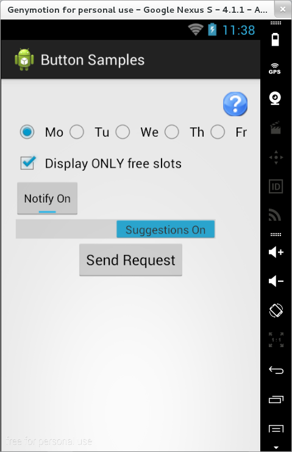

# Controale de tip buton

În Android pot fi utilizate mai multe tipuri de butoane, între care `Button`
(buton ce are atașat un text), `ImageButton` (buton ce are atașată o imagine),
`ToggleButton`, `CheckBox` și `Switch` (controale ce pot avea două stări -
selectat sau nu), `RadioButton` / `RadioGroup` (grupuri de butoane ce pot avea
două stări - selectat sau nu, asigurându-se totodată excluziunea mutuală între
acestea).

O componentă de tip buton ce are atașat un text este definită de clasa
`android.widget.Button`, fiind caracterizată prin proprietatea `text`,
ce conține mesajul pe care acesta îl va afișa.

Întrucât un buton este un tip de control ce interacționează cu
utilizatorul, pentru aceasta trebuie definită o clasă ascultător (ce
implementează `View.OnClickListener`) pentru tratarea evenimentelor de
tip apăsare. Aceasta definește o metodă `onClick()` ce primește ca
parametru componenta (de tip `android.view.View`) care a generat
evenimentul respectiv. Există două mecanisme de tratare a unui
eveniment:

1.  precizarea metodei care tratează evenimentul în fișierul XML
    corespunzător activității, având dezavantajul că nu se pot transmite
    parametrii clasei ascultător `android:onClick="myButtonClickHandler"
    `
2.  definirea unei clase ascultător în codul sursă
    1.  clasă dedicată, având dezavantajul că nu poate accesa decât
        acele resurse ale activității care sunt publice (referința către
        obiectul de tip `Activity` trebuind să fie transmisă ca
        parametru);
    2.  folosirea unei clase interne cu nume în cadrul activității,
        având avantajul posibilității accesării tuturor resurselor din
        cadrul acesteia, fără necesitatea transmiterii unei referințe
        către ea; **aceasta este abordarea recomandată pentru tratarea
        evenimentelor pentru orice tip de control**;
    3.  folosirea unei clasei interne anonime în cadrul activității,
        având dezavantajul că trebuie (re)definită pentru fiecare
        control în parte, ceea ce se poate dovedi ineficient în cazul în
        care se poate elabora un cod comun pentru tratarea evenimentelor
        mai multor componente din cadrul interfeței grafice;
    4.  utilizarea clasei corespunzătoare activității ca ascultător,
        prin implementarea interfeței respective și a metodei aferente,
        având dezavantajul unei scalări ineficiente în cazul în care
        există mai multe controale pentru care tratarea evenimentului se
        realizează în mod diferit.

  <pre><code class="language-java">

public class MainActivity extends AppCompatActivity {

    private Button mButton;
    private TextView mTextView;

    @Override
    protected void onCreate(Bundle savedInstanceState)
    {
        super.onCreate(savedInstanceState);
        setContentView(R.layout.activity_main);

        // Putting vaules in mButton and mTextView
        mButton = findViewById(R.id.button_send);
        mTextView = findViewById(R.id.text_after);

        mButton.setOnClickListener(new View.OnClickListener() {
            @Override
            public void onClick(View view)
            {    
                // Acest cod este chemat la apasarea unui buton
                mTextView.setText("This is the after Result");
            }
        });
    }
}

</code></pre>
<pre><code class="language-kotlin">

class MainActivity : AppCompatActivity() {
    private lateinit var mButton: Button
    private lateinit var mTextView: TextView

    override fun onCreate(savedInstanceState: Bundle?) {
        super.onCreate(savedInstanceState)
        setContentView(R.layout.activity_main)

        // Initializing mButton and mTextView
        mButton = findViewById(R.id.button_send)
        mTextView = findViewById(R.id.text_after)

        mButton.setOnClickListener {
            // Acest cod este chemat la apasarea unui buton
            mTextView.text = "This is the after Result"
        }
    }
}

</code></pre>

> În cazul folosirii de clase interne, membrii din clasa
părinte ce se doresc a fi accesați trebuie să aibă imutabili (trebuie
declarate cu atributul `final`).
