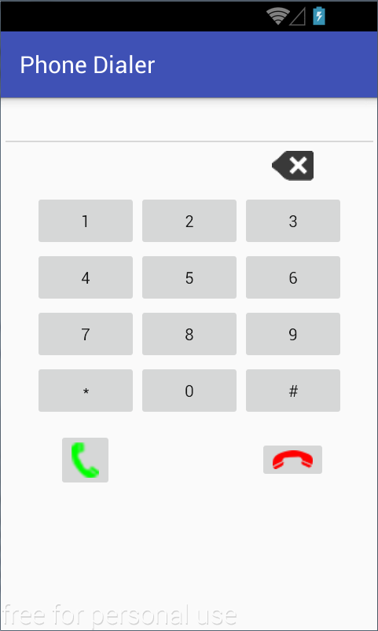

## Activitate de Laborator

Se dorește implementarea unei aplicații Android, conținând o singură
activitate, care să ofere utilizatorilor funcționalitatea necesară
pentru formarea unui număr de telefon (PhoneDialer).




**1.** Să se creeze un proiect Android Studio denumit *PhoneDialer*.

Se indică detaliile proiectului:

-   **Application name** - *Phone Dialer*
-   **Company domain** - *lab03.eim.systems.cs.pub.ro* (se va genera în
    mod automat **Package name** cu valoarea
    *ro.pub.cs.systems.eim.lab03.phonedialer*)
-   **Project location** - locația directorului de pe discul local unde
    a fost descărcat depozitul la distanță *Laborator03*

Se indică platforma pentru care se dezvoltă aplicația Android (se
bifează doar *Phone and Tablet*), iar SDK-ul Android (minim) pentru care
se garantează funcționarea este API 24 (Nougat, 7.0).

Se creează o activitate care inițial nu va conține nimic (*Empty
Activity*):

pentru care se precizează:

-   **Activity Name** (denumirea activității) - `PhoneDialerActivity`;
-   **Layout Name** (denumirea fișierului XML din `res/layout` în care
    va fi construită interfața grafică) - `activity_phone_dialer.xml`.

De asemeena:

-   se bifează opțiunea de a se genera în mod automat fișierul XML care
    conține descrierea interfeței grafice (*Generate Layout File*);
-   folosirea claselor din bibliotecile de suport care asigură
    posibilitatea de folosire a unor funcționalități din SDK-uri mai
    recente pe dispozitive mobile cu nivele de API mai vechi (*Backwards
    Compatibility (AppCompat)*).

**2.** În fișierul `activity_phone_dialer` din directorul `res/layout`
se construiește interfața grafică folosind:

-   editorul vizual (*Design*)
-   editorul XML (*Text*)

Aceasta va conține:

-   un obiect de tip `EditText`, care nu poate fi editat manual de
    utilizator, în care se va afișa numărul de telefon;
-   10 obiecte de tip `Button` corespunzătoare celor 10 cifre (0..9);
-   2 obiecte de tip `Button` corespunzătoare caracterelor speciale `*`
    și `#`;
-   un obiect de tip `ImageButton` pentru operaţia de editare a
    numărului de telefon, prin revenirea la caracterul anterior, în
    cazul în care s-a greșit;
-   2 obiecte de tip `ImageButton` pentru operaţiile de formare a
    numărului de telefon, respectiv de închidere.

Pentru iconite, va recomandam [flaticon](https://www.flaticon.com/).

Pentru dispunerea controalelor în cadrul interfeței grafice se va folosi
un mecanism de tip `LinearLayout` cu orientare verticală, iar tastatura
virtuală va fi realizată printr-un obiect de tip `GridLayout` cu 6 linii
și 3 coloane.

**3.** În clasa `PhoneDialerActivity` din pachetul
`ro.pub.cs.systems.eim.lab03.phonedialer`, să se implementeze o clasă
ascultător pentru tratarea evenimentelor de tip apăsare de buton.

-   pentru butoanele ce conțin cifre sau caracterele `*` / `#`, se va
    adăuga simbolul corespunzător la numărul de telefon care se dorește
    format;
-   pentru butonul de corecție, se va șterge ultimul caracter (în cazul
    în care numărul de telefon nu este vid);
-   pentru butonul de apel, se va invoca intenția care realizează
    legătura telefonică; întrucât se compilează proiectul Android
    folosind o versiune mai mare decât Marshmelow (6.0), este necesar să
    fie solicitată permisiunea de efectuare a apelului telefonic la
    momentul rulării:
<div class="tabbed-blocks">

  <pre><code class="language-java">
    if (ContextCompat.checkSelfPermission(PhoneDialerActivity.this, Manifest.permission.CALL_PHONE) != PackageManager.PERMISSION_GRANTED) {
      ActivityCompat.requestPermissions(
        PhoneDialerActivity.this,
        new String[]{Manifest.permission.CALL_PHONE},
        Constants.PERMISSION_REQUEST_CALL_PHONE);
    } else {
      Intent intent = new Intent(Intent.ACTION_CALL);
      intent.setData(Uri.parse("tel:" + phoneNumberEditText.getText().toString()));
      startActivity(intent);
    }
</code></pre>
<pre><code class="language-kotlin">

    if (ContextCompat.checkSelfPermission(
            this@PhoneDialerActivity,
            Manifest.permission.CALL_PHONE
        ) != PackageManager.PERMISSION_GRANTED
    ) {
        ActivityCompat.requestPermissions(
            this@PhoneDialerActivity,
            arrayOf(Manifest.permission.CALL_PHONE),
            Constants.PERMISSION_REQUEST_CALL_PHONE
        )
    } else {
        val intent = Intent(Intent.ACTION_CALL)
        intent.setData(Uri.parse("tel:" + phoneNumberEditText!!.text.toString()))
        startActivity(intent)
    }

</code></pre>
</div>

Se va defini o clasă internă cu nume, ce implementează
interfața `View.OnClickListener` (implementează metoda
`public void onClick(View view)`. Instanța acesteia va fi utilizată
pentru **toate** obiectele de tip buton din cadrul interfeței
grafice.\

---
**Note**

Pentru a putea apela, în fișierul `AndroidManifest.xml`
trebuie să se specifice o permisiune explicită în acest sens:  
`<uses-permission android:name="android.permission.CALL_PHONE" />`\

-   pentru butonul de oprire, se va închide activitatea (se va apela
    metoda `finish()`);

---


**4.** Să se gestioneze corespunzător evenimentul de tip rotire a
ecranului;

1.  să se blocheze tranziția între modurile portrait și landscape:
    1.  în fișierul AndroidManifest.xml 
        ```xml
        <manifest ...>
          <application ... >
            <activity ...
              android:screenOrientation="portrait" 
              ... />
              
            <!-- ... -->
          </application>
        </manifest>
        ```

    2.  programatic
        ```java
        @Override
        protected void onCreate(Bundle onCreateInstanceState) {
          super.onCreate(onCreateInstanceState);
          setRequestedOrientation(ActivityInfo.SCREEN_ORIENTATION_PORTRAIT);
          * ..
        }
        ````
2.  să se definească, în directorul `res/layout-land` o interfață
    grafică adecvată acestei configurații a dispozitivului de afișare:


În Android Studio, se creează un nou subdirector `layout-land` în
directorul `res` (din meniul contextual afișat cu right click, se
selectează *New* → *Android resource directory*, indicându-se denumirea
sa (`layout-land`), tipul de resursă (`layout`) și setul codului sursă
pentru care se definește resursa respectivă (`main`)):

Se trece în modul de vizualizare *Project* și în directorul
`res/layout-land` se copiază conținutul fișierului
`activity_phone.dialer.xml` prin operații de tip copy-paste și se
realizează modificările necesare SAU se poate preciza un fișier nou cu
aceeași denumire.


