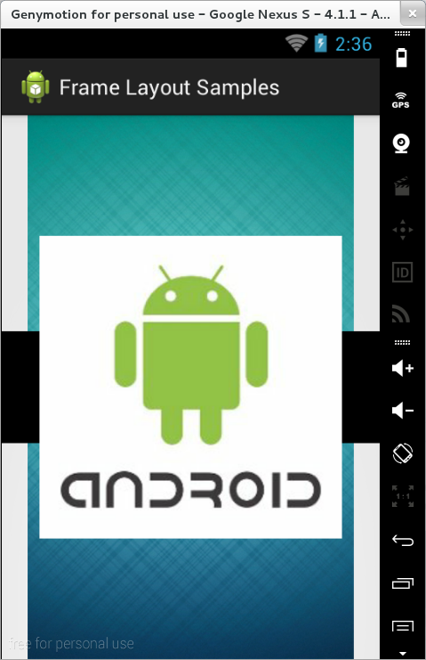

### FrameLayout

`FrameLayout` reprezintă o strategie de poziționare folosită pentru
afișarea unei singure componente la un moment dat. Totuși, aceasta poate
fi populată cu mai multe elemente grafice, recomandându-se ca doar una
singură să fie vizibilă. Vizibilitatea poate fi specificată în fișierul
XML prin proprietatea `android:visibility` care poate lua valorile
`visible` sau `gone`, respectiv programatic, folosind metoda
`setVisibility()` ce primește ca parametru constantele `View.VISIBLE`
sau `View.GONE`. De regulă, afișarea unei componente este realizată în
mod dinamic, ca rezultat al unei metode de tratare a unui eveniment.

---
**Note**

Dimensiunea obiectului de tip `FrameLayout` ar
trebui să fie preluată de la controlul cel mai voluminos, riscându-se
altfel ca pe măsură ce se afișează elemente de dimensiuni mai mari,
acestea să nu fie vizibile în totalitate. În acest scop, se va folosi
proprietatea XML `android:measureAllChildren="true"` sau se va apela
metoda `setMeasureAllChildren(true)`, astfel încât să se realizeze
redimensionarea continer-ului la toate elementele conținute, nu doar la
cele vizibile la un moment dat.\

---

De regulă, acest tip de layout se folosește atunci când se dorește să se
realizeze o animație folosind mai multe imagini, dintre care una singură
este vizibilă la un moment dat.

În cazul în care mai multe controale grafice sunt vizibile simultan, ele
vor fi afișate sub forma unei structuri de tip stivă, în funcție de
ordinea în care sunt declarate, elementele din vârful stivei având
vizibilitate maximă iar cele de la baza stivei vizibilitate minimă.

Alte atribute utilizate de acest mecanism de dispunere a conținutului
sunt:

-   `foreground`, indicând o resursă de tip grafic (din `res/drawable`)
    care va fi afișată peste conținutul interfeței grafice;
-   `foregroundGravity`, precizând poziționarea resursei de tip grafic
    care va fi afișată peste conținutul interfeței grafice (putând avea
    valorile `top`, `bottom`, `left`, `right`, `center_vertical`,
    `fill_vertical`, `center_horizontal`, `fill_horizontal`, `center`,
    `fill`, `clip_vertical`, `clip_horizontal` sau combinații ale
    acestora, realizate prin intermediul operatorului `|`, pe biți).

