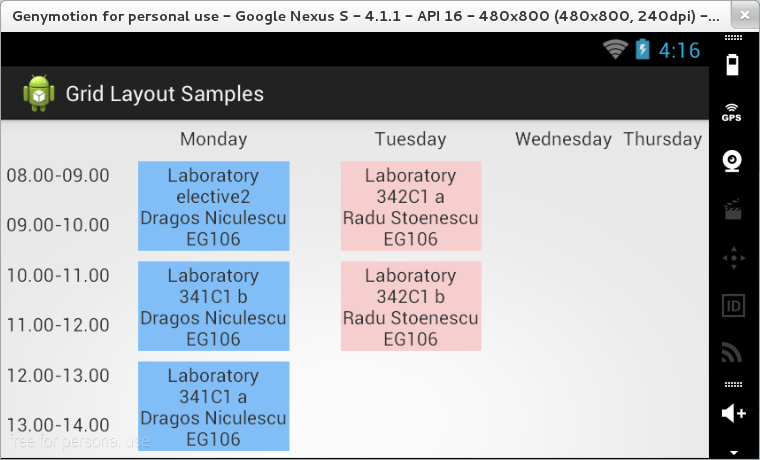

### GridLayout

Layout-ul de tip `GridLayout` este utilizat tot pentru dispunerea
componentelor într-un format tabelar, folosind însă o sintaxă mult mai
flexibilă. Totodată, acest mecanism este și mult mai eficient din
punctul de vedere al randării.

\<spoiler> Astfel, pentru specificarea numărului de rânduri și de
coloane se vor utiliza proprietățile `rowCount` și `columnCount`,
indicându-se pentru fiecare element grafic în parte poziția la care va
fi plasat, prin atributele `layout_row` și `layout_column`. În cazul în
care pentru o componentă grafică nu se specifică linia sau coloana din
care face parte, atributul `orientation` (având va valori posibile
`horizontal` sau `vertical` indică dacă elementul următor va fi plasat
pe linia sau pe coloana succesivă).

---
**Note**

Întrucât modul de dispunere `GridLayout` permite
plasarea mai multor componente la aceeași poziție (rând și coloană), nu
se garantează faptul că acestea nu se vor suprapune.\

---

În cazul în care se dorește extinderea unui element grafic pe mai multe
rânduri sau pe mai multe coloane, se vor utiliza atributele
`layout_rowSpan` și `layout_columnSpan`. Pentru controlul modului de
dispunere se va folosi proprietatea `layout_gravity`. Precizarea
`layout_width` și `layout_height` nu este neapărat necesară, valoarea
lor implicită în acest caz fiind `wrap_content`.

---
**Note**

Deși a fost introdus începând cu nivelul de API 14,
mecanismul de dispunere a conținutului `GridLayout` poate fi utilizat și
în aplicațiile Android folosind un SDK corespunzător nivelului de API 7,
folosind biblioteca de suport v7 (revizie ulterioara versiunii
13).\

---

\</spoiler>
