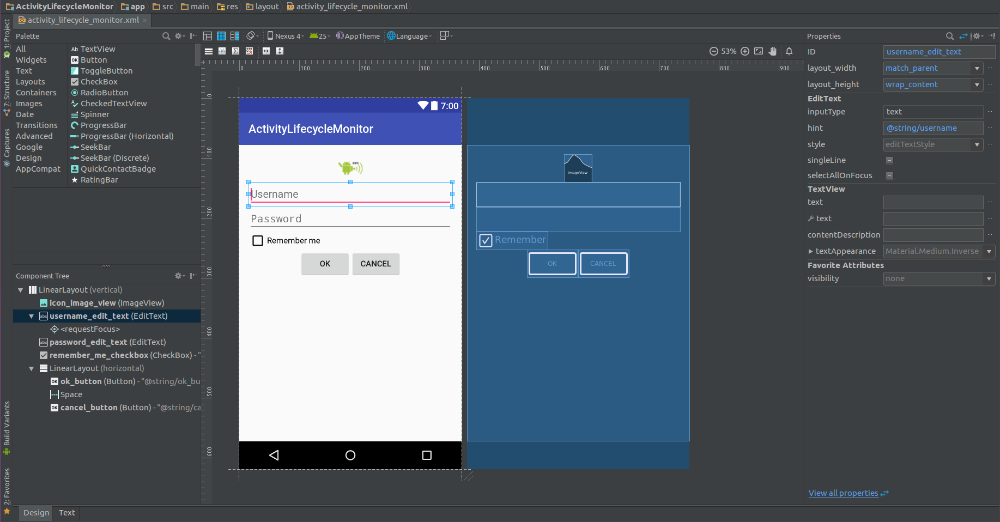

### Construirea unei interfețe grafice în XML

Pentru fiecare activitate se va construi un fișier .xml în directorul
`res/layout` care va descrie conținutul interfeței grafice precum și
modul de dispunere al controalelor componente.

---
**Note**

În cazul în care se dorește să se definească o altă intefață
grafică, adaptată la schimbarea orientării ecranului, se va folosi
directorul `res/layout-land` în care conținutul fișierului .xml (având
aceeași denumire) va fi modificat corespunzător. Selecția interfeței
grafice în funcție de dimensiunile suprafeței de afișare este realizată
în mod automat de sistemul de operare Android.\

---

Pentru fiecare resursă de acest tip, se va genera o referință în clasa
`layout` din fișierul generat `R.java`, care va putea fi utilizată
pentru încărcarea interfeței grafice în cadrul metodei
`onCreate(Bundle savedInstanceState)`.

``` java
setContentView(R.layout.activity_layout_sample_1);
```

După încărcarea propriu-zisă a elementelor din cadrul interfeței grafice
vor putea fi obținute referințe către ele prin intermediul metodei
`findViewById()`, care:

-   primește ca parametru un identificator (întreg) definit (automat) în
    clasa `id` din fișierul generat `R.java` pentru toate componentele
    din cadrul interfeței grafice care au definit atributul `android:id`
    (pe baza căruia pot fi referite);
-   returnează un obiect de tip `android.view.View`, fiind necesar să se
    realizeze conversia explicită către tipul de control grafic dorit.

``` java
TextView greetingTextView = (TextView)findViewById(R.id.greeting_text_view);
```

Mediul integrat de dezvoltare Android Studio pune la dispoziția
dezvoltatorilor atât un utilitar conținând biblioteci de controale, în
care interfața grafică poate fi definită prin operații de tip
drag-and-drop, cât și un editor text în care proprietățile acestor
elemente pot fi specificate manual. Schimbările realizate într-una
dintre aceste ferestre sunt transpuse automat și în cealaltă, astfel
încât modificările din mediul vizual generează etichetele XML
corespunzătoare, în timp ce efectul unor proprietăți stabilite în
fișierul XML poate fi vizualizat imediat în editorul grafic.



Astfel, utilitarul vizual poate fi accesat din panoul *Design*, putând
fi specificate (prin selecția dintr-o listă) dispozitivul mobil pentru
care se proiectează interfața grafică, orientarea ecranului (precum și
alte moduri în care se poate găsi acesta), tema aplicației (stilul
folosit), activitatea căreia îi este asociat, localizarea precum și
nivelul de API.

\<spoiler> În cadrul bibliotecii de controale, organizarea elementelor
grafice se face prin împărțirea lor în mai multe categorii:

-   forme de bază (*Widgets*);
-   câmpuri text (*Texts*);
-   mecanisme de dispunere a conținutului (*Layouts*);
-   controale grafice ce pot conține alte componente(*Containers*);
-   resurse multimedia (*Images*);
-   elemente pentru gestiunea datei calendaristice și a timpului
    (*Date*);
-   animații (*Transitions*);
-   componente complexe de interacțiune cu utilizatorul (*Advanced*);
-   componente Google (*Google*);
-   elemente grafice definite în Material Design (*Design*);
-   obiecte definite în bibliotecile de suport (*AppCompat*);

Structura interfeței grafice (ierarhia de controale grafice) poate fi
(pre)vizualizată, pentru fiecare obiect în parte indicându-se
identificatorul său (dacă este definit) și tipul (între paranteze
rotunde), în secțiunea *Component Tree*.

Pentru fiecare control grafic, atributele sale pot fi gestionate în
secțiunea *Properties*, fiind afișate toate proprietățile pe care le
poate avea (proprii sau moștenite de la părinte), împreună cu valorile
pe care le poate lua, utilizatorul putând alege dintre acestea.

``` xml
<RelativeLayout xmlns:android="http:*schemas.android.com/apk/res/android"
  xmlns:tools="http:*schemas.android.com/tools"
  android:layout_width="match_parent"
  android:layout_height="match_parent"
  android:paddingBottom="@dimen/activity_vertical_margin"
  android:paddingLeft="@dimen/activity_horizontal_margin"
  android:paddingRight="@dimen/activity_horizontal_margin"
  android:paddingTop="@dimen/activity_vertical_margin"
  tools:context="ro.pub.cs.systems.eim.lab03.examples.layoutsample1.LayoutSample1Activity" >

  <EditText
    android:id="@+id/introduce_yourself_edit_text"
    android:layout_width="wrap_content"
    android:layout_height="wrap_content"
    android:ems="10"
    android:hint="@string/introduce_yourself"
    android:inputType="text" >

    <requestFocus />

  </EditText>

  <CheckBox
    android:id="@+id/display_identity_check_box"
    android:layout_width="wrap_content"
    android:layout_height="wrap_content"
    android:layout_alignLeft="@id/introduce_yourself_edit_text"
    android:layout_below="@id/introduce_yourself_edit_text"
    android:text="@string/display_identity" />

  <Button
    android:id="@+id/submit_button"
    android:layout_width="wrap_content"
    android:layout_height="wrap_content"
    android:layout_alignLeft="@id/display_identity_check_box"
    android:layout_below="@id/display_identity_check_box"
    android:text="@string/submit" />
    
  <TextView
    android:id="@+id/greeting_text_view"
    android:layout_width="match_parent"
    android:layout_height="match_parent"
    android:layout_alignLeft="@id/submit_button"
    android:layout_below="@id/submit_button"
    android:text="@string/greeting"
    android:textSize="32sp"
    android:gravity="center"
    android:alpha="0" />

</RelativeLayout>
```

Fiecare control din cadrul interfeței grafice va fi reprezentat
printr-un element corespunzător, denumirea acestuia fiind identică cu
cea a clasei care îi implementează funcționalitatea (de regulă, din
pachetul `android.widget`).

---
**Note**

Un control care va fi referit ulterior (fie în codul
sursă, fie în fișierul XML) trebuie să aibă asociat un identificator,
indicat prin proprietatea `android:id`. Acesta are forma
`@+id/identificator` (în momentul în care este definit), respectiv
`@id/identificator` pentru referirile ulterioare. Pentru fiecare
componentă ce definește un element grafic, se generează o referință în
clasa `id` din fișierul `R.java`.\

---

Elementele interfeței grafice sunt caracterizate prin anumite
proprietăți, cum ar fi poziționarea, dimensiunile, conținutul pe care îl
afișează, tipurile de date acceptate de la utilizator, informațiile
ajutătoare. Fiecare parametru va fi indicat prin sintaxa
`android:proprietate="valoare"` unde `proprietate` și `valoare` trebuie
să respecte restricțiile definite în clasa ce descrie controlul
respectiv. \</spoiler>
