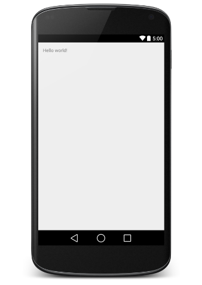

# Construirea unei interfețe grafice în XML


### Definirea interfetei

Pentru fiecare activitate se va construi un fișier .xml în directorul
`res/layout` care va descrie conținutul interfeței grafice precum și
modul de dispunere al controalelor componente.



``` xml
<!-- activity_layout_sample.xml-->

<RelativeLayout xmlns:android="http://schemas.android.com/apk/res/android"
   xmlns:tools="http://schemas.android.com/tools"
   android:layout_width="match_parent"
   android:layout_height="match_parent" >
   
   <TextView
      android:layout_width="wrap_content"
      android:layout_height="wrap_content"
      android:layout_centerHorizontal="true"
      android:layout_centerVertical="true"
      android:padding="@dimen/padding_medium"
      android:text="Hello world"

      <!-- ID il vom folosi pentru a face rost de o referinta din cod -->
      android:id="my_hello_world_text_id"
      tools:context=".MainActivity" />
      
</RelativeLayout>
```

Putem modifica interfata grafica direct din codul XML, sau prin intermediul
editorului integrat din Android Studio ce are suport de vizualizare a
interfetei (Design mode).

Fiecare control din cadrul interfeței grafice va fi reprezentat
printr-un element corespunzător, denumirea acestuia fiind identică cu
cea a clasei care îi implementează funcționalitatea (de regulă, din
pachetul `android.widget`).

Un control care va fi referit ulterior (fie în codul
sursă, fie în fișierul XML) trebuie să aibă asociat un identificator,
indicat prin proprietatea `android:id`. Acesta are forma
`@+id/identificator` (în momentul în care este definit), respectiv
`@id/identificator` pentru referirile ulterioare. Pentru fiecare
componentă ce definește un element grafic, se generează o referință în
clasa `id` din fișierul `R.java`.

Elementele interfeței grafice sunt caracterizate prin anumite
proprietăți, cum ar fi poziționarea, dimensiunile, conținutul pe care îl
afișează, tipurile de date acceptate de la utilizator, informațiile
ajutătoare. Fiecare parametru va fi indicat prin sintaxa
`android:proprietate="valoare"` unde `proprietate` și `valoare` trebuie
să respecte restricțiile definite în clasa ce descrie controlul
respectiv.

### Atasarea la o activitate

Pentru a atasa o interfata grafica descris in XML la o activitate, se va folosi
`layout` din binding-urile generate `R.java`, care va putea fi utilizată pentru
încărcarea interfeței grafice în cadrul metodei `onCreate(Bundle
savedInstanceState)`. 

<div class="tabbed-blocks">

  <pre><code class="language-java">

public class MainActivity extends AppCompatActivity {

    @Override
    protected void onCreate(Bundle savedInstanceState) {
        super.onCreate(savedInstanceState);
        // Aici atasam interfata grafica descrisa in fisierul
        // activty_layout_sample.xml din res/layouts la activitate
        setContentView(R.layout.activity_layout_sample);
        // ...
    }
}

</code></pre>
<pre><code class="language-kotlin">

class MainActivity : AppCompatActivity() {
    override fun onCreate(savedInstanceState: Bundle?) {
        super.onCreate(savedInstanceState)
        // Aici atasam interfata grafica descrisa in fisierul
        // activty_layout_sample.xml din res/layouts la activitate
        setContentView(R.layout.activity_main)
        // ...
    }
}

</code></pre>
</div>

După încărcarea propriu-zisă a elementelor din cadrul interfeței grafice
vor putea fi obținute referințe către ele prin intermediul metodei
`findViewById()`, care:

-   primește ca parametru un identificator (întreg) definit (automat) în
    clasa `id` din fișierul generat `R.java` pentru toate componentele
    din cadrul interfeței grafice care au definit atributul `android:id`
    (pe baza căruia pot fi referite);
-   returnează un obiect de tip `android.view.View`, fiind necesar să se
    realizeze conversia explicită către tipul de control grafic dorit.

Acum, vom putea chema mai multe functii, in functie de tipul de obiect UI. Pe
TextView vom putea chema set text, in schimb pentru butoane vom putea seta un
handler care sa fie apelat la apasarea acestuia.

<div class="tabbed-blocks">

  <pre><code class="language-java">

// Luam referinta la text field-ul cu 'Hello World'
TextView greetingTextView = (TextView)findViewById(R.id.my_hello_world_text_id);
// Il schimbam in Bye world.
greetingTextView.setText('Bye World')

</code></pre>
<pre><code class="language-kotlin">

val greetingTextView: TextView = findViewById(R.id.my_hello_world_text_id)
// Il schimbam in Bye world.
greetingTextView.text = "Bye World"

</code></pre>
</div>
