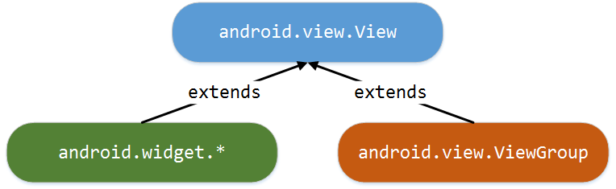

## Clase Android utilizate pentru definirea unei interfețe grafice

În cadrul unei aplicații Android, o interfață grafică conține elemente
care au capabilitatea de a afișa informații către utilizator, în
diferite formate, respectiv de a interacționa cu acesta, preluând datele
necesare realizării diverselor fluxuri operaționale din cadrul
aplicației. Există și o categorie specială de controale grafice,
responsabile numai cu gestiunea mecanismului de dispunere a celorlalte
componente, determinând modul în care vor fi plasate în cadrul ferestrei
precum și coordonatele la care vor fi poziționate.

Structura unei interfețe grafice este arborescentă. Întotdeauna,
elementul rădăcină va fi un control care gestionează modul în care sunt
dispuse componentele sale, în timp ce elementele frunză sunt controale
grafice propriu-zise, vizibile pe ecran, cu o funcționalitate bine
delimitată. Pe toate celelalte niveluri (intermediare) din această
ierarhie se pot regăsi elemente de ambele tipuri (atât elemente grafice
cât și mecanisme de dispunere a conținutului - care controlează în acest
fel o secțiune din cadrul interfeței cu utilizatorul).

Clasa `android.view.View` reprezintă baza pentru construirea oricărei
interfețe grafice dintr-o aplicație Android. Ea definește o zonă
rectangulară a dispozitivului de afișare (ecran), majoritatea
controalelor grafice și a mecanismelor de dispunere a conținutului fiind
derivate din aceasta.

**1.** Cele mai multe **elemente grafice** sunt definite în pachetul
`android.widget`, fiind implementate controale care implementează cele
mai multe dintre funcționalitățile uzuale (etichete, câmpuri text,
controale pentru redarea de conținut multimediat - imagini, filme -,
butoane, elemente pentru gestiunea datei calendaristice și a timpului).

\<note>Trebuie să se facă distincția între control, afișat în interfața
grafică a unei activități, definit în pachetul `android.widget` și
extensiile aplicațiilor, afișate în ecranul principal al dispozitivului
mobil, cunoscute sub denumirea de widget-uri, dar care fac parte din
clasa `android.appwidget.AppWidget`.\

---

**2.** Controalele pentru gestiunea **mecanismului de dispunere a
conținutului** au rolul de a determina modul în care sunt afișate
elementele conținute. Acestea sunt derivate din clasa
`android.view.ViewGroup`, definind mai multe reguli prin care se
determină poziția la care vor fi plasate componentele pe care le includ.
