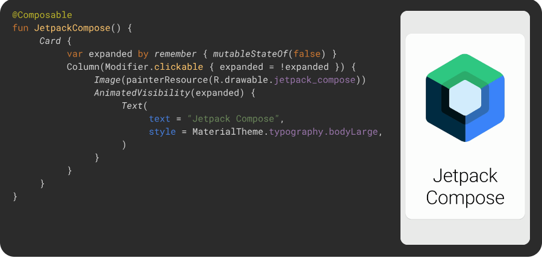

## Mecanisme pentru construirea unei interfețe grafice

O interfață grafică poate fi construită în mai multe moduri:

**I. Android View**

1.  prin definirea componentelor UI și a modului lor de dispunere
    în cadrul unui fișier .xml, asociat fiecarei activități (sau
    fragment) în parte, situație adecvată cazurilor în care interfața
    grafică este statică;
2.  programatic, prin instanțierea unor componente UI
    direct în codul sursă (cu stabilirea proprietăților
    respective) al activității (sau fragmentului), abordare potrivită
    pentru situațiile în care interfața grafică are o structură dinamică
    (este actualizată în funcție de unele condiții specifice
    identificate în momentul execuției).

**II. Jetpack Compose:**

Este complet declarativ, ceea ce înseamnă că descrieți UI-ul prin apelarea
unei serii de functions care transformă datele într-o ierarhie UI. Când
datele se schimbă, framework-ul reexecută automat aceste functii,
actualizând UI-ul.

> Pentru a putea oferii oportunitatea de a coda atat in Java cat si in Kotlin,
acest laborator se va concentra pe metoda "View file based", aceasta find
compatibila cu ambele limbaje de programare. (Compose este folosibil doar cu
Kotlin) 
