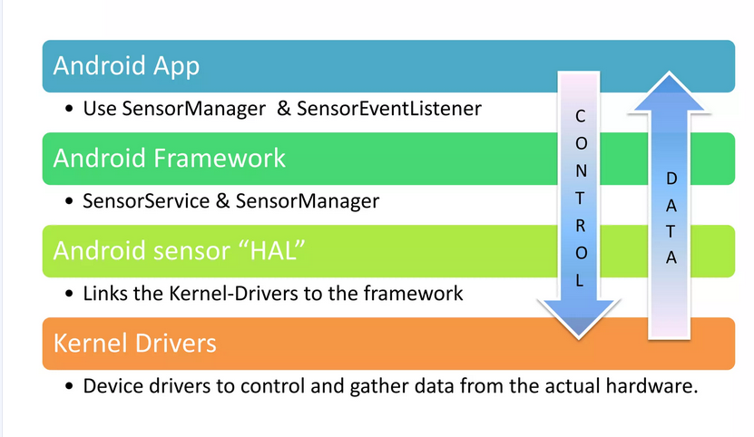

# Sensors Hardware Abstraction Layer

Cum telefoanele Android sunt facute de mai multi vendors, avem mai multe tipuri
de senzori, totusi am vrea ca interactiunea dintre o aplicatie si un senzor sa
fie standardizat. 

Astfel a fost dezvoltata ideea de Hardware Abstraction Layer (HAL) pentru a
crea o interfață standardizată între software-ul de nivel înalt (cum ar fi
sistemul de operare sau aplicațiile) și hardware-ul specific al dispozitivului.
Acest strat de abstractizare permite dezvoltatorilor de software să scrie cod
care funcționează pe o varietate de dispozitive fără a trebui să cunoască
detaliile specifice ale fiecărui hardware. În esență, HAL ascunde complexitatea
și variațiile hardware-ului, oferind o interfață consistentă și simplificată
pentru software. Acest lucru îmbunătățește portabilitatea software-ului, reduce
timpul și costurile de dezvoltare, și facilitează actualizările și
întreținererea sistemului, deoarece modificările hardware-ului pot fi
gestionate în mare parte în cadrul HAL, fără a afecta semnificativ nivelurile
superioare ale software-ului.

