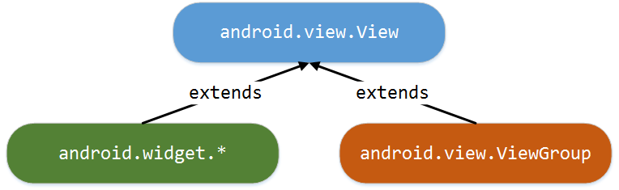
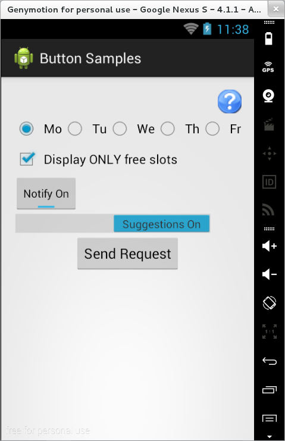
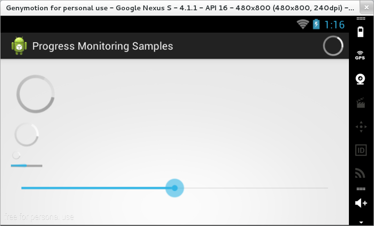
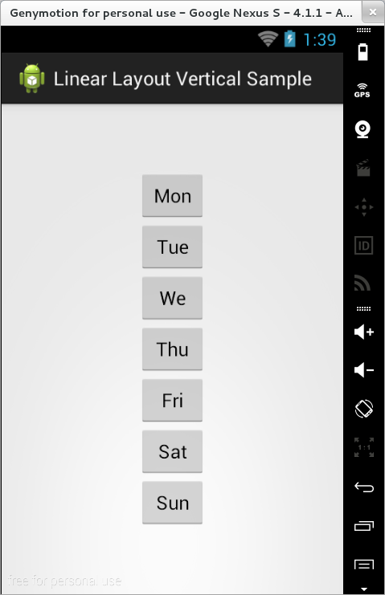
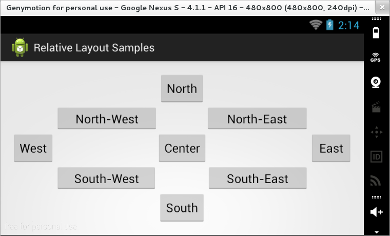
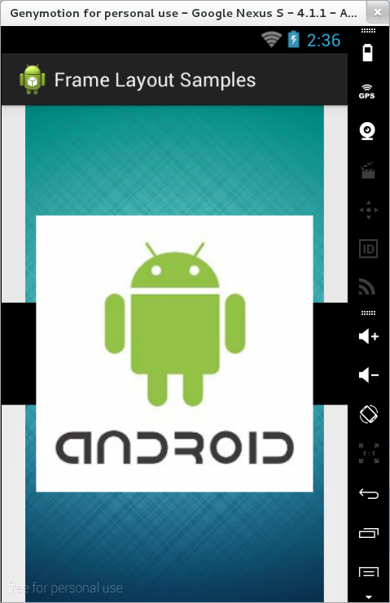
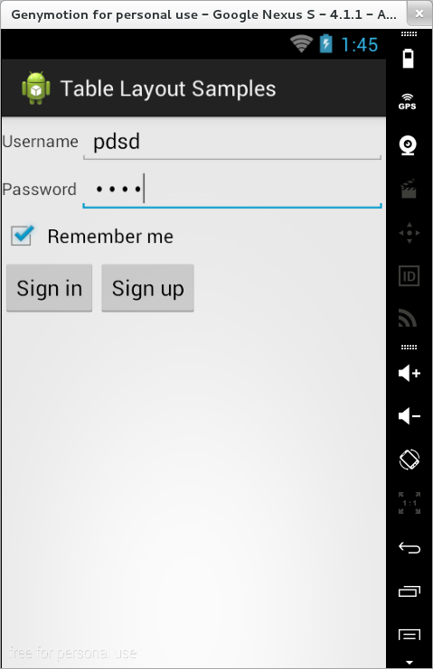
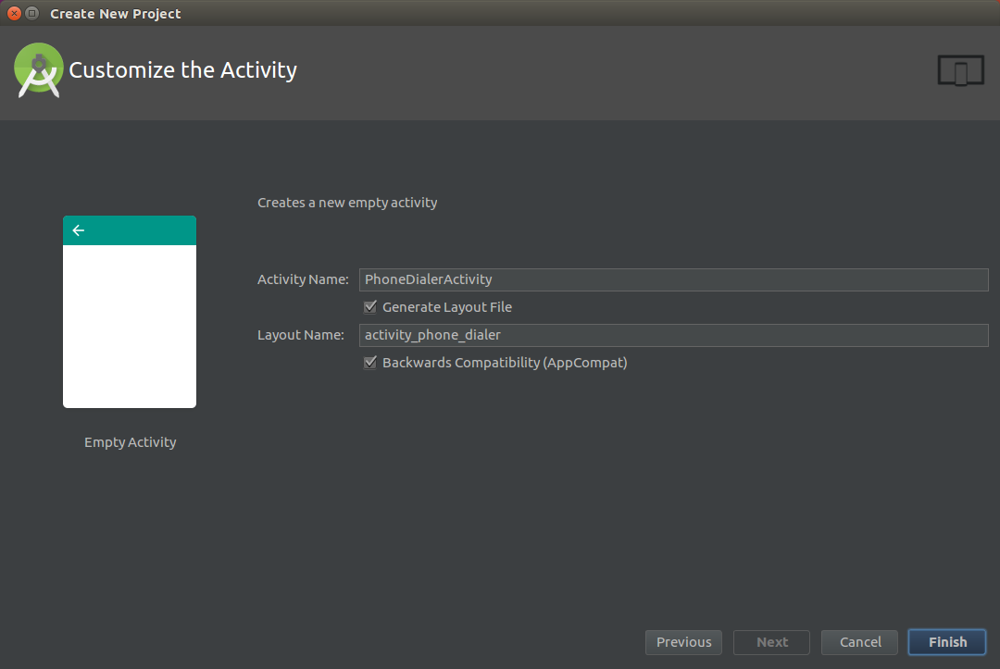

# Laborator 03. Proiectarea Interfețelor Grafice

## Clase Android utilizate pentru definirea unei interfețe grafice

În cadrul unei aplicații Android, o interfață grafică conține elemente
care au capabilitatea de a afișa informații către utilizator, în
diferite formate, respectiv de a interacționa cu acesta, preluând datele
necesare realizării diverselor fluxuri operaționale din cadrul
aplicației. Există și o categorie specială de controale grafice,
responsabile numai cu gestiunea mecanismului de dispunere a celorlalte
componente, determinând modul în care vor fi plasate în cadrul ferestrei
precum și coordonatele la care vor fi poziționate.

Structura unei interfețe grafice este arborescentă. Întotdeauna,
elementul rădăcină va fi un control care gestionează modul în care sunt
dispuse componentele sale, în timp ce elementele frunză sunt controale
grafice propriu-zise, vizibile pe ecran, cu o funcționalitate bine
delimitată. Pe toate celelalte niveluri (intermediare) din această
ierarhie se pot regăsi elemente de ambele tipuri (atât elemente grafice
cât și mecanisme de dispunere a conținutului - care controlează în acest
fel o secțiune din cadrul interfeței cu utilizatorul).

Clasa `android.view.View` reprezintă baza pentru construirea oricărei
interfețe grafice dintr-o aplicație Android. Ea definește o zonă
rectangulară a dispozitivului de afișare (ecran), majoritatea
controalelor grafice și a mecanismelor de dispunere a conținutului fiind
derivate din aceasta.



**1.** Cele mai multe **elemente grafice** sunt definite în pachetul
`android.widget`, fiind implementate controale care implementează cele
mai multe dintre funcționalitățile uzuale (etichete, câmpuri text,
controale pentru redarea de conținut multimediat - imagini, filme -,
butoane, elemente pentru gestiunea datei calendaristice și a timpului).

\<note>Trebuie să se facă distincția între control, afișat în interfața
grafică a unei activități, definit în pachetul `android.widget` și
extensiile aplicațiilor, afișate în ecranul principal al dispozitivului
mobil, cunoscute sub denumirea de widget-uri, dar care fac parte din
clasa `android.appwidget.AppWidget`.\

---

**2.** Controalele pentru gestiunea **mecanismului de dispunere a
conținutului** au rolul de a determina modul în care sunt afișate
elementele conținute. Acestea sunt derivate din clasa
`android.view.ViewGroup`, definind mai multe reguli prin care se
determină poziția la care vor fi plasate componentele pe care le includ.

## Mecanisme pentru construirea unei interfețe grafice

O interfață grafică poate fi construită în două moduri:

1.  prin definirea elementelor componente și a modului lor de dispunere
    în cadrul unui fișier .xml, asociat fiecarei activități (sau
    fragment) în parte, situație adecvată cazurilor în care interfața
    grafică este statică;
2.  programatic, prin instanțierea unor obiecte de tipul elementelor
    componente direct în codul sursă (cu stabilirea proprietăților
    respective) al activității (sau fragmentului), abordare potrivită
    pentru situațiile în care interfața grafică are o structură dinamică
    (este actualizată în funcție de unele condiții specifice
    identificate în momentul execuției).

De regulă, se preferă ca interfața grafică să fie definită în cadrul
unui fișier `.xml` pentru fiecare fereastră din cadrul aplicației
Android, întrucât acesta este mult mai ușor de întreținut, separând
sarcinile ce țin de proiectare propriu-zisă de cele care țin de
programare (putând fi realizate astfel de persoane diferite). Totuși,
pentru situațiile în care interfața grafică nu este cunoscută la
momentul compilării sau pentru cazul în care interfața grafică trebuie
modificată în funcție de anumite condiții identificate în momentul
compilării, pot fi utilizate metode programatice spre a obține o astfel
de funcționalitate.

### Construirea unei interfețe grafice în XML

Pentru fiecare activitate se va construi un fișier .xml în directorul
`res/layout` care va descrie conținutul interfeței grafice precum și
modul de dispunere al controalelor componente.

---
**Note**

În cazul în care se dorește să se definească o altă intefață
grafică, adaptată la schimbarea orientării ecranului, se va folosi
directorul `res/layout-land` în care conținutul fișierului .xml (având
aceeași denumire) va fi modificat corespunzător. Selecția interfeței
grafice în funcție de dimensiunile suprafeței de afișare este realizată
în mod automat de sistemul de operare Android.\

---

Pentru fiecare resursă de acest tip, se va genera o referință în clasa
`layout` din fișierul generat `R.java`, care va putea fi utilizată
pentru încărcarea interfeței grafice în cadrul metodei
`onCreate(Bundle savedInstanceState)`.

``` java
setContentView(R.layout.activity_layout_sample_1);
```

După încărcarea propriu-zisă a elementelor din cadrul interfeței grafice
vor putea fi obținute referințe către ele prin intermediul metodei
`findViewById()`, care:

-   primește ca parametru un identificator (întreg) definit (automat) în
    clasa `id` din fișierul generat `R.java` pentru toate componentele
    din cadrul interfeței grafice care au definit atributul `android:id`
    (pe baza căruia pot fi referite);
-   returnează un obiect de tip `android.view.View`, fiind necesar să se
    realizeze conversia explicită către tipul de control grafic dorit.

``` java
TextView greetingTextView = (TextView)findViewById(R.id.greeting_text_view);
```

Mediul integrat de dezvoltare Android Studio pune la dispoziția
dezvoltatorilor atât un utilitar conținând biblioteci de controale, în
care interfața grafică poate fi definită prin operații de tip
drag-and-drop, cât și un editor text în care proprietățile acestor
elemente pot fi specificate manual. Schimbările realizate într-una
dintre aceste ferestre sunt transpuse automat și în cealaltă, astfel
încât modificările din mediul vizual generează etichetele XML
corespunzătoare, în timp ce efectul unor proprietăți stabilite în
fișierul XML poate fi vizualizat imediat în editorul grafic.


Astfel, utilitarul vizual poate fi accesat din panoul *Design*, putând
fi specificate (prin selecția dintr-o listă) dispozitivul mobil pentru
care se proiectează interfața grafică, orientarea ecranului (precum și
alte moduri în care se poate găsi acesta), tema aplicației (stilul
folosit), activitatea căreia îi este asociat, localizarea precum și
nivelul de API.

\<spoiler> În cadrul bibliotecii de controale, organizarea elementelor
grafice se face prin împărțirea lor în mai multe categorii:

-   forme de bază (*Widgets*);
-   câmpuri text (*Texts*);
-   mecanisme de dispunere a conținutului (*Layouts*);
-   controale grafice ce pot conține alte componente(*Containers*);
-   resurse multimedia (*Images*);
-   elemente pentru gestiunea datei calendaristice și a timpului
    (*Date*);
-   animații (*Transitions*);
-   componente complexe de interacțiune cu utilizatorul (*Advanced*);
-   componente Google (*Google*);
-   elemente grafice definite în Material Design (*Design*);
-   obiecte definite în bibliotecile de suport (*AppCompat*);

Structura interfeței grafice (ierarhia de controale grafice) poate fi
(pre)vizualizată, pentru fiecare obiect în parte indicându-se
identificatorul său (dacă este definit) și tipul (între paranteze
rotunde), în secțiunea *Component Tree*.

Pentru fiecare control grafic, atributele sale pot fi gestionate în
secțiunea *Properties*, fiind afișate toate proprietățile pe care le
poate avea (proprii sau moștenite de la părinte), împreună cu valorile
pe care le poate lua, utilizatorul putând alege dintre acestea.

``` xml
<RelativeLayout xmlns:android="http:*schemas.android.com/apk/res/android"
  xmlns:tools="http:*schemas.android.com/tools"
  android:layout_width="match_parent"
  android:layout_height="match_parent"
  android:paddingBottom="@dimen/activity_vertical_margin"
  android:paddingLeft="@dimen/activity_horizontal_margin"
  android:paddingRight="@dimen/activity_horizontal_margin"
  android:paddingTop="@dimen/activity_vertical_margin"
  tools:context="ro.pub.cs.systems.eim.lab03.examples.layoutsample1.LayoutSample1Activity" >

  <EditText
    android:id="@+id/introduce_yourself_edit_text"
    android:layout_width="wrap_content"
    android:layout_height="wrap_content"
    android:ems="10"
    android:hint="@string/introduce_yourself"
    android:inputType="text" >

    <requestFocus />

  </EditText>

  <CheckBox
    android:id="@+id/display_identity_check_box"
    android:layout_width="wrap_content"
    android:layout_height="wrap_content"
    android:layout_alignLeft="@id/introduce_yourself_edit_text"
    android:layout_below="@id/introduce_yourself_edit_text"
    android:text="@string/display_identity" />

  <Button
    android:id="@+id/submit_button"
    android:layout_width="wrap_content"
    android:layout_height="wrap_content"
    android:layout_alignLeft="@id/display_identity_check_box"
    android:layout_below="@id/display_identity_check_box"
    android:text="@string/submit" />
    
  <TextView
    android:id="@+id/greeting_text_view"
    android:layout_width="match_parent"
    android:layout_height="match_parent"
    android:layout_alignLeft="@id/submit_button"
    android:layout_below="@id/submit_button"
    android:text="@string/greeting"
    android:textSize="32sp"
    android:gravity="center"
    android:alpha="0" />

</RelativeLayout>
```

Fiecare control din cadrul interfeței grafice va fi reprezentat
printr-un element corespunzător, denumirea acestuia fiind identică cu
cea a clasei care îi implementează funcționalitatea (de regulă, din
pachetul `android.widget`).

---
**Note**

Un control care va fi referit ulterior (fie în codul
sursă, fie în fișierul XML) trebuie să aibă asociat un identificator,
indicat prin proprietatea `android:id`. Acesta are forma
`@+id/identificator` (în momentul în care este definit), respectiv
`@id/identificator` pentru referirile ulterioare. Pentru fiecare
componentă ce definește un element grafic, se generează o referință în
clasa `id` din fișierul `R.java`.\

---

Elementele interfeței grafice sunt caracterizate prin anumite
proprietăți, cum ar fi poziționarea, dimensiunile, conținutul pe care îl
afișează, tipurile de date acceptate de la utilizator, informațiile
ajutătoare. Fiecare parametru va fi indicat prin sintaxa
`android:proprietate="valoare"` unde `proprietate` și `valoare` trebuie
să respecte restricțiile definite în clasa ce descrie controlul
respectiv. \</spoiler>

### Dezvoltarea programatică a unei interfețe grafice

O interfață grafică poate fi definită și în codul sursă, într-un mod
similar. Se creează inițial un obiect container (de tip `Layout`,
derivat din `android.view.ViewGroup`) care va cuprinde toate
controalele, acesta fiind argumentul cu care va fi apelată metoda
`setContentView()`.

\<spoiler> Pentru fiecare control vor fi specificate (manual, prin
apelul metodei corespunzătoare) diferitele caracteristici,
asociindu-i-se și un identificator (uzual, acesta poate fi orice număr
întreg). Pentru fiecare proprietate a unui control grafic, sunt definite
programatic metodele de tip getter și setter corespunzătoare.

---
**Note**

În situația în care unui control nu i se asociază un
identificator prin apelul metodei `setId()`, valoarea acestui parametru
va fi `NO_ID`, astfel încât acesta nu va mai putea fi referit în cod
(spre exemplu, pentru poziționarea elementelor interfeței grafice
relativ, unele față de altele). \

---

Ulterior, controlul va trebui asociat containerului din care face parte,
prin intermediul metodei `addView()`, specificându-se modul în care va
fi poziționat (precum și dimensiunile sale) prin intermediul unui obiect
de tip `LayoutParams`, specific mecanismului de dispunere respectiv.

``` java
public class LayoutSample2Activity extends Activity {

  final private static long TRANSPARENCY_EFFECT_DURATION = 5000;
  
  @Override
  protected void onCreate(Bundle savedInstanceState) {
    super.onCreate(savedInstanceState);
    
    RelativeLayout container = new RelativeLayout(this);
    container.setLayoutParams(new LayoutParams(LayoutParams.MATCH_PARENT, LayoutParams.MATCH_PARENT));
    
    final EditText introduceYourselfEditText = new EditText(this);
    introduceYourselfEditText.setId(1);
    introduceYourselfEditText.setEms(10);
    introduceYourselfEditText.setHint(getString(R.string.introduce_yourself));
    introduceYourselfEditText.setInputType(InputType.TYPE_CLASS_TEXT);
    introduceYourselfEditText.setFocusable(true);
    RelativeLayout.LayoutParams introduceYourselfEditTextLayoutParams = new RelativeLayout.LayoutParams(RelativeLayout.LayoutParams.WRAP_CONTENT, RelativeLayout.LayoutParams.WRAP_CONTENT);
    container.addView(introduceYourselfEditText, introduceYourselfEditTextLayoutParams);
    
    final CheckBox displayIdentityCheckBox = new CheckBox(this);
    displayIdentityCheckBox.setId(2);
    displayIdentityCheckBox.setText(getString(R.string.display_identity));
    RelativeLayout.LayoutParams displayIdentityCheckBoxLayoutParams = new RelativeLayout.LayoutParams(RelativeLayout.LayoutParams.WRAP_CONTENT, RelativeLayout.LayoutParams.WRAP_CONTENT);
    displayIdentityCheckBoxLayoutParams.addRule(RelativeLayout.ALIGN_LEFT, introduceYourselfEditText.getId());
    displayIdentityCheckBoxLayoutParams.addRule(RelativeLayout.BELOW, introduceYourselfEditText.getId());
    container.addView(displayIdentityCheckBox, displayIdentityCheckBoxLayoutParams);
    
    final Button submitButton = new Button(this);
    submitButton.setId(3);
    submitButton.setText(getString(R.string.submit));
    RelativeLayout.LayoutParams submitButtonLayoutParams = new RelativeLayout.LayoutParams(RelativeLayout.LayoutParams.WRAP_CONTENT, RelativeLayout.LayoutParams.WRAP_CONTENT);
    submitButtonLayoutParams.addRule(RelativeLayout.ALIGN_LEFT, displayIdentityCheckBox.getId());
    submitButtonLayoutParams.addRule(RelativeLayout.BELOW, displayIdentityCheckBox.getId());
    container.addView(submitButton, submitButtonLayoutParams);
    
    final TextView greetingTextView = new TextView(this);
    greetingTextView.setId(4);
    greetingTextView.setText(getString(R.string.greeting));
    greetingTextView.setTextSize(32);
    greetingTextView.setGravity(Gravity.CENTER);
    greetingTextView.setAlpha(0);
    RelativeLayout.LayoutParams greetingTextViewLayoutParams = new RelativeLayout.LayoutParams(RelativeLayout.LayoutParams.MATCH_PARENT, RelativeLayout.LayoutParams.MATCH_PARENT);
    greetingTextViewLayoutParams.addRule(RelativeLayout.ALIGN_LEFT, submitButton.getId());
    greetingTextViewLayoutParams.addRule(RelativeLayout.BELOW, submitButton.getId());
    container.addView(greetingTextView, greetingTextViewLayoutParams);
    
    submitButton.setOnClickListener(new View.OnClickListener() {
    
      @Override
      public void onClick(View view) {
        String identity = introduceYourselfEditText.getText().toString();
        greetingTextView.setText(getResources().getString(R.string.greeting).replace("???", (displayIdentityCheckBox.isChecked())?identity:getResources().getString(R.string.anonymous)));
        greetingTextView.setAlpha(1);
        AlphaAnimation fadeEffect = new AlphaAnimation(1.0f, 0.0f);
        fadeEffect.setDuration(TRANSPARENCY_EFFECT_DURATION);
        fadeEffect.setFillAfter(true);
        greetingTextView.setAnimation(fadeEffect);
      }
      
    });
    
    setContentView(container);
  }
  
  * ...

}
```

\</spoiler>

## Controale în Android (widget-uri)

În Android, un control (pentru care se utilizează și denumirea de
widget) este de regulă derivat din clasa `android.view.View`, unde sunt
definite câteva caracteristici de bază cu privire la dimensiuni și la
modul de dispunere:

| **ATRIBUT**           | **TIP OBIECT**       | **DESCRIERE**                                                                      |
|-----------------------|----------------------|------------------------------------------------------------------------------------|
| `layout_width`        | `View` / `ViewGroup` | lățimea obiectului                                                                 |
| `layout_height`       | `View` / `ViewGroup` | înălțimea obiectului                                                               |
| `layout_marginTop`    | `View` / `ViewGroup` | spațiu suplimentar ce trebuie alocat în partea de sus a obiectului                 |
| `layout_marginBottom` | `View` / `ViewGroup` | spațiu suplimentar ce trebuie alocat în partea de jos a obiectului                 |
| `layout_marginLeft`   | `View` / `ViewGroup` | spațiu suplimentar ce trebuie alocat în partea din stânga a obiectului             |
| `layout_marginRight`  | `View` / `ViewGroup` | spațiu suplimentar ce trebuie alocat în partea din dreapta a obiectului            |
| `layout_gravity`      | `View`               | modul de poziționare a elementelor componente în cadrul unui container             |
| `layout_weight`       | `View`               | proporția pe care o are controlul, raportată la întregul conținut al containerului |
| `layout_x`            | `View` / `ViewGroup` | poziția pe coordonata x                                                            |
| `layout_y`            | `View` / `ViewGroup` | poziția pe coordonata y                                                            |

Unele dintre aceste proprietăți pot fi specificate și pentru
containerele în care sunt cuprinse controalele, derivate din clasa
`android.view.ViewGroup`.

Valorile pe care le pot lua atributele `layout_width` și `layout_height`
sunt:

-   `match_parent` - dacă se dorește ca obiectul să ocupe tot spațiul pe
    care îl pune la dispoziție containerul său;

---
**Note**

Deși există și posibilitatea de a indica valoarea
`fill_parent` pentru lățimea și înălțimea unui control, aceasta trebuie
evitată, întrucât a fost înlocuită începând cu nivelul de API 8.\

---

-   `wrap_content` - dacă se dorește ca obiectul să fie restrâns la
    dimensiunile conținutului său.

\<note>În situația în care nu se specifică cel puțin valorile
`layout_width` și `layout_height` pentru un anumit control, se va genera
o excepție întrucât interfața grafică nu poate fi încărcată
corespunzător.\

---

De asemenea, pot fi specificate valori absolute, exprimate în una din
unitățile de măsură:

-   `dp` - **pixel independent de rezoluție**

---
**Note**

Se recomandă să se utilizeze această unitate de măsură în
momentul în care se specifică dimensiunea unui control în cadrul unui
container. Se asigură astfel faptul că se utilizează o proporție
adecvată pentru un control, indiferent de rezoluția ecranului, Android
scalându-i dimensiunea automat.\

---

-   `sp` - **pixel independent de scală**, echivalent cu `dp`

---
**Note**

Se recomandă să se utilizeze această unitate de măsură în
momentul în care se specifică dimensiunea unui set de caractere, cu care
va fi afișat un text.\

---

-   `pt` - **punct**, echivalent cu 1/72 inchi, bazat pe dimensiunile
    ecranului
-   `px` - **pixel**, corespunzător unui pixel al dispozitivului mobil

---
**Note**

Utilizarea acestei unități de măsură nu este recomandată,
întrucât interfața grafică definită în acești termeni nu se va afișa
corect pe dispozitive mobile cu altă rezoluție a ecranului.\

---

Specificarea dimensiunii ecranului unui dispozitiv mobil se face prin
indicarea numărului de pixeli pe orizontală și pe verticală. Pentru a
obține densitatea (rezoluția) dispozitivului respectiv, se împarte
dimensiunea exprimată în pixeli la dimensiunea exprimată în inchi. Se va
compara valoarea obținută cu una dintre valorile standard definite
pentru încadrarea dispozitivului mobil într-o anumită categorie de
rezoluție:

-   120 dpi - ldpi (Low Density)
-   160 dpi - mdpi (Medium Density)
-   240 dpi - hdpi (High Density)
-   320 dpi - xhdpi (Extra High Density)
-   480 dpi - xxhdpi (Extra Extra High Density)

Formula de conversie între pixeli (`px`) și pixeli independenți de
rezoluție (`dp`) este:

px = dp \* (resolution_category) / 160

\<note>Se observă că 1 `px` este echivalent cu 1 `dp` pe un ecran cu
rezoluția 160 dpi, considerată drept referință în Android.\

---

Dimensiunea (exprimată în pixeli) a unui control poate fi obținută
apelând metodele `getWidth()`, respectiv `getHeight()`.

### Controale de tip text

Android pune la dispoziția programatorilor un set complet de controale
de tip text, dintre care cele mai utilizate sunt `TextView`, `EditText`,
`AutoCompleteTextView` și `MultiCompleteTextView`.


#### TextView

Controlul de tip `TextView` este utilizat pentru afișarea unui text
către utilizator, fără ca acesta să aibă posibilitatea de a-l modifica.

\<spoiler>

Conținutul pe care îl afișează un obiect `TextView` este indicat de
proprietatea `text`. De regulă, acesta referă o constantă definită în
resursa care conține șirurile de caractere utilizate în cadrul
aplicației. Gestiunea acestui atribut poate fi realizată prin metodele
getter și setter respective.

---
**Note**

Metoda `getText()` întoarce un parametru de tip
[CharSequence](http:*developer.android.com/reference/java/lang/CharSequence.html),
astfel încât trebuie realizată conversia sa la o implementare a acestei
interfețe (cel mai frecvent, `String`), înainte de a putea folosi
valoarea respectivă.\

---

Pentru un control de tip `TextView` pot fi specificate mai multe
proprietăți, printre care `minLines`, `maxLines`, `minEms`, `maxEms` și
`textcolor`.

---
**Note**

Pentru a defini lățimea și înălțimea unui control de tip
`TextView`, este de preferat să se utilizeze următoarele unități de
măsură:

-   **ems** (pentru lățime) - termen folosit în tipografie relativ la
    dimensiunea punctului unui set de caractere, oferind un control mai
    bun asupra modului în care este vizualizat textul, independent de
    dimensiunea propriu-zisă a semnelor respective;
-   **număr de linii** (pentru înălțime) - garantează afișarea
    netrunchiată a textului, indiferent de dimensiunea caracterelor;

\

---

Pentru a avertiza utilizatorul de faptul că textul nu a fost afișat
complet, se poate folosi parametrul `ellipsible`, care atașează șirul de
caractere `(...)` în finalul secvenței vizibile. În cazul în care textul
este trunchiat și totuși textul afișat are sens, fără a exista indicii
că ar mai fi urmat și altceva, utilizarea acestui atribut este foarte
utilă.

O componentă de tip `TextView` NU implementează doar funcționalitatea
unei etichete, ea putând fi utilizată și pentru a realiza anumite
acțiuni, în cazul în care conținutul pe care îl afișează are un format
cunoscut:

-   `android:autoLink="none"` - dezactivează orice tip de acțiune care
    poate fi atașată unui text;
-   `android:autoLink="web"` - pentru pagini Internet care vor fi
    accesate prin intermediul unui navigator;
-   `android:autoLink="email"` - pentru adrese de poștă electronică la
    care se vor trimite mesaje prin intermediul unei aplicații dedicate;
-   `android:autoLink="phone"` - pentru numere de telefon care se doresc
    a fi formate;
-   `android:autoLink="map"` - pentru coordonate GPS care se doresc a fi
    vizualizate pe hartă;
-   `android:autoLink="all"` - activează orice tip de acțiune care poate
    fi atașată unui text.

---
**Note**

Se pot folosi și combinații ale acestor tipuri de legături,
agregate folosind operatorul `|` (pe biți).\

---

\<note>Nu întotdeauna este detectat tipul corect de informație și în
unele cazuri se poate realiza transferul către un alt tip de activitate
sau cu informații eronate.\

---

Programatic, comportamentul unui obiect de acest tip poate fi stabilit
prin intermediul metodei `setAutoLinkMask()`, care va primi ca parametru
o constantă a clasei `Linkify`.

---
**Note**

Alternativ, poate fi utilizată metoda statică `addLinks()`
din clasa `Linkify`, apelată cu un parametru de tip `TextView` și un
parametru care indică tipul de conținut. \

---

În situația în care se dorește ca informația să fie afișată într-un mod
care să o evidențieze, însă fără a permite utilizatorului să lanseze în
execuție o altă activitate prin intermediul ei, se poate utiliza
atributul `linksClickable` (având valoarea `false`).

\</spoiler>

#### EditText

`EditText` este o componentă utilizată pentru obținerea unui text de la
utilizator. Implementarea sa pornește de la obiectul de tip `TextView`,
astfel încât sunt moștenite toate proprietățile sale.

\<spoiler> În mod obișnuit, valoarea introdusă va fi afișată doar pe o
linie. Dacă se dorește redimensionarea controlului pe măsură ce este
introdus un text de dimensiuni mai mari, va trebui specificată
proprietatea `inputType="textMultiLine"`. De asemenea, se poate
specifica explicit numărul de linii prin intermediul proprietății
`lines` (în cazul în care aceasta nu este specificată, câmpul va fi
redimensionat în mod automat pentru ca textul introdus să poată fi
afișat; totuși indicarea acestui atribut este util pentru că impune o
dimensiune fixă, utilizatorul având posibilitatea de a naviga în cadrul
textului prin operația de derulare).

De asemenea, există posibilitatea indicării unei sugestii, care va fi
afișată pe fundal, semitransparentă, prin intermediul proprietății
`hint`. Aceasta precizează utilizatorului ce fel de informații ar trebui
specificate prin intermediul controlului. Ea va dispare în mod automat
în momentul în care utilizatorul începe să introducă textul respectiv.

Printre funcționalitățile elementului de tip `EditText` se numără și
posibilitatea de a corecta un text (proprietatea `inputType` are
valoarea `textAutoCorrect`) sau de a accepta doar valori care respectă
un anumit format (număr de telefon, adresă de poștă electronică, parolă,
număr zecimal (cu sau fără semn), dată calendaristică, oră). Totodată,
utilizatorul poate fi forțat să introducă valori care respectă doar un
anumit format, prin intermediul metodei `setFilters()` care primește ca
parametru un tablou de filtre (asigurându-se în acest mod îndeplinirea
concomitentă a condițiilor specificate de fiecare în parte):

-   predefinite în clasa
    [InputFilter](http:*developer.android.com/reference/android/text/InputFilter.html)
    -   `InputFilter.AllCaps` - toate caracterele trebuie scrise cu
        majusculă;
    -   `InputFilter.LengthFilter` - sunt acceptate doar șiruri de
        caractere care au o dimensiune fixă (precizată ca parametru în
        constructor);
-   definite de utilizator, prin implementarea metodei `filter()` din
    interfața `InputFilter`, indicându-se valoarea cu care se
    înlocuiește o anumită secvență.

Operația de tip apăsare lungă în cadrul unui control de tip `EditText`
invocă meniul contextual, care oferă facilități pentru copierea unui
text într-o / dintr-o zonă de memorie tampon (*eng.* copy-cut-paste),
schimbarea mecanismului de introducere a textului, modificarea
dicționarului ce conține cele mai frecvent folosite cuvinte. De
asemenea, poate fi selectată (evidențiată) un fragment din textul
respectiv (programatic, această funcționalitate poate fi obținută prin
metodele `setSelection()` / `selectAll()`).

\</spoiler>

#### AutoCompleteTextView

Controlul de tip `AutoCompleteTextView` indică utilizatorului anumite
valori cu care poate fi completat, în funcție de conținutul pe care
acesta îl are acesta la un moment dat, pe baza unei liste de sugestii.
Momentul la care sistemul de operare va oferi o sugestie este controlat
prin intermediul proprietății `completionThreshold`, care indică numărul
(minim) de caractere pe baza căruia se face potrivirea între șirul de
caractere introdus de utilizator și valorile existente în lista de
propuneri. Se poate afișa și un text sugestiv în cadrul listei de
sugestii, prin proprietatea `completionHint`.

\<spoiler>

``` java
AutoCompleteTextView coursesAutoCompleteTextView = (AutoCompleteTextView)findViewById(R.id.courses_auto_complete_text_view);

String[] suggestions = {"vlsi", "eim", "ts", "std", "so2", "idp", "ia", "scad", "pw", "ecom"};
ArrayAdapter<String> coursesArrayAdapter = new ArrayAdapter<String>(this, android.R.layout.simple_dropdown_item_1line, suggestions);

coursesAutoCompleteTextView.setAdapter(coursesArrayAdapter);
```

Sugestia este oferită pentru întregul conținut al componentei, astfel
încât dacă se dorește specificarea mai multor cuvinte, nu se va lua în
calcul fiecare dintre acestea.

\<note>Un astfel de control nu constrânge utilizatorul să introducă doar
valori din lista de sugestii, conținutul controlului grafic putând fi
oarecare.\

---

\</spoiler>

#### MultiAutoCompleteTextView

Controlul de tip `MultiAutoCompleteTextView` permite ca sugestiile
oferite să țină cont de fiecare componentă a textului introdus. Mai
exact, va fi specificat un delimitator (prin intermediul metodei
`setTokenizer()`) după apariția căruia vor fi luate în considerare
caracterele pentru determinarea sugestiei. Android pune la dispoziție
câteva clase standard pentru delimitatori (`CommaTokenizer` - separare
prin virgulă, `Rfc822Tokenizer` - conținutul de tip adresă de poștă
electronică) însă se pot utiliza și clase definite de utilizator, care
implementează interfața `MultiAutoCompleteTextView.Tokenizer`.

### Controale de tip buton

În Android pot fi utilizate mai multe tipuri de butoane, între care
`Button` (buton ce are atașat un text), `ImageButton` (buton ce are
atașată o imagine), `ToggleButton`, `CheckBox` și `Switch` (controale ce
pot avea două stări - selectat sau nu), `RadioButton` / `RadioGroup`
(grupuri de butoane ce pot avea două stări - selectat sau nu,
asigurându-se totodată excluziunea mutuală între acestea).



#### Button

O componentă de tip buton ce are atașat un text este definită de clasa
`android.widget.Button`, fiind caracterizată prin proprietatea `text`,
ce conține mesajul pe care acesta îl va afișa.

\<spoiler> ---
**Note**

În clasa `android.R.string` sunt definite mai
multe constante care pot fi utilizate ca etichete pentru butoane (*OK*,
*Cancel*, *Yes*, *No*).\

---

\<note>Se obișnuiește ca butoanele să fie stilizate, în sensul că sunt
afișate fără un chenar, prin precizarea atributului `style`, având
valoarea `"?android:attr/borderlessButtonStyle"`.\

---

Întrucât un buton este un tip de control ce interacționează cu
utilizatorul, pentru aceasta trebuie definită o clasă ascultător (ce
implementează `View.OnClickListener`) pentru tratarea evenimentelor de
tip apăsare. Aceasta definește o metodă `onClick()` ce primește ca
parametru componenta (de tip `android.view.View`) care a generat
evenimentul respectiv. Există două mecanisme de tratare a unui
eveniment:

1.  precizarea metodei care tratează evenimentul în fișierul XML
    corespunzător activității, având dezavantajul că nu se pot transmite
    parametrii clasei ascultător `android:onClick="myButtonClickHandler"
    `
2.  definirea unei clase ascultător în codul sursă
    1.  clasă dedicată, având dezavantajul că nu poate accesa decât
        acele resurse ale activității care sunt publice (referința către
        obiectul de tip `Activity` trebuind să fie transmisă ca
        parametru);
    2.  folosirea unei clase interne cu nume în cadrul activității,
        având avantajul posibilității accesării tuturor resurselor din
        cadrul acesteia, fără necesitatea transmiterii unei referințe
        către ea; **aceasta este abordarea recomandată pentru tratarea
        evenimentelor pentru orice tip de control**;
    3.  folosirea unei clasei interne anonime în cadrul activității,
        având dezavantajul că trebuie (re)definită pentru fiecare
        control în parte, ceea ce se poate dovedi ineficient în cazul în
        care se poate elabora un cod comun pentru tratarea evenimentelor
        mai multor componente din cadrul interfeței grafice;
    4.  utilizarea clasei corespunzătoare activității ca ascultător,
        prin implementarea interfeței respective și a metodei aferente,
        având dezavantajul unei scalări ineficiente în cazul în care
        există mai multe controale pentru care tratarea evenimentului se
        realizează în mod diferit.

---
**Note**

În cazul folosirii de clase interne, membrii din clasa
părinte ce se doresc a fi accesați trebuie să aibă imutabili (trebuie
declarate cu atributul `final`).\

--- \</spoiler>

#### ImageButton

Un obiect de tip `ImageButton` (definit de clasa
`android.widget.ImageButton`) este utilizat pentru afişarea unei
imagini, specificată în fişierul XML prin proprietatea `android:src` sau
programatic prin intermediul metodei `setImageResource()`.

\<spoiler> ---
**Note**

Imaginea asociată unui buton de tip `ImageButton`
este o resursă din directorul `/res/drawable/` (accesibilă în XML prin
adnotarea `@drawable/` sau programatic prin referinţa sa din clasa
`R.drawable`. \

---

Formatele suportate sunt `png`, `jpeg`, `gif` și `bmp`.

Dacă se doreşte să se omită afişarea propriu-zisă a butonului,
reţinându-se doar imaginea sa, se poate specifica un fundal vid (în XML,
`android:background="@null"` sau în codul sursă se poate apela
`setBackground(null)`).

Un buton de tip `ImageButton` poate avea şi una din următoarele stări:

-   `focus` - dacă este controlul ce captează toate evenimentele (în
    cazul în care selecția a fost mutată pe el)
-   `pressed` - dacă este apăsat de utilizator (înainte ca evenimentul
    corespunzător să fie procesat)

În funcție de aceste stări, unui buton de tip `ImageButton` i se pot
asocia diferite imagini, specificate într-un fișier XML din directorul
`/res/drawable`, care va fi referit ulterior ca sursă a acestuia:

``` xml
<?xml version="1.0" encoding="utf-8"?>
<selector xmlns:android="http:*schemas.android.com/apk/res/android">
  <item android:state_pressed="true"
        android:drawable="@drawable/button_pressed" />
  <item android:state_focused="true"
        android:drawable="@drawable/button_focused" />
  <item android:drawable="@drawable/button" />
</selector>
```

``` xml
<Button
  ... 
  android:src="@drawable/imagebuttonselector" 
  ... />
```

---
**Note**

Ordinea elementelor în fișierul XML pentru realizarea
selecției este important întrucât Android îl va verifica pe fiecare în
parte pentru a vedea dacă acesta corespunde stării controlului. De
aceea, imaginea pentru starea normală a controlului trebuie să se
regăsească întotdeauna după toate celelalte cazuri particulare, în caz
contrar aceasta fiind afișată întotdeauna de vreme ce nu impune nici o
restricție asupra componentei.\

--- \</spoiler>

#### ToggleButton

Un obiect `ToggleButton` (definit de `android.widget.ToggleButton`) este
un tip de buton care are asociată o stare cu două valori (selectat și
neselectat), asemenea unui checkbox sau radiobutton. Implicit, atunci
când este selectat, acesta afișează o bară de culoare albastră în partea
sa inferioară, iar atunci când nu este selectat, o bară de culoare gri.

\<spoiler> Textele afișate pentru valorile stărilor pot fi controlate în
fișierul XML prin intermediul proprietăților `android:textOn` respectiv
`android:textOff`, iar programatic prin metodele `setTextOn()` și
`setTextOff()`.

---
**Note**

Valorile implicite pentru proprietățile `textOn` și `textOff`
sunt *ON*, respectiv *OFF*.\

---

---
**Note**

Atributul `text`, moștenit de la obiectul de tip `Button`, nu
este utilizat cu toate că poate fi definit.\

--- \</spoiler>

#### CheckBox

Controlul de tip `CheckBox` (din clasa `android.widget.CheckBox`) este
tot un element de tip buton ce poate avea două stări (selectat și
neselectat), accesibile prin intermediul proprietății `checked`
(`android:checked` în fișierul XML și `setChecked()` sau `toggle()` în
codul sursă).

Deși este definit un tip de eveniment asociat selecției sau deselecției
acestei componente (specificat de interfața
`CompoundButton.OnCheckedChangeListener` pentru care trebuie
implementată metoda `onCheckedChange()`), de cele mai multe ori nu i se
asociază o clasă ascultător, verificându-se starea sa prin intermediul
metodei `isChecked()` la producerea unui alt eveniment.

#### Switch

Controlul de tip `Switch` (din clasa `android.widget.Switch`), introdus
începând cu nivelul de API 14, este tot un element de tip buton ce poate
avea două stări (selectat și neselectat), având forma unei bare
derulante prin care se poate realiza tranziția între cele două valori,
aflate la capatele acesteia.

#### RadioButton / RadioGroup

Un element de tip `android.widget.RadioButton` este tot un buton cu două
stări (selectat / neselectat), de obicei utilizat pentru selecția unei
singure opțiuni dintr-o listă, excluderea mutuală fiind realizată prin
includerea mai multor obiecte de acest tip într-o componentă de tip
`android.widget.RadioGropup`. \<spoiler> \<note>Un obiect de tip
`RadioButton` se poate afla și în afara unui grup la fel cum un obiect
de tip `RadioGroup` poate conține și alte controale decât
butoane.\

---

Inițial, toate butoanele din cadrul unui grup sunt deselectate, deși se
poate preciza această proprietate atât prin fișierul XML cât și
programatic. Odată ce un utilizator a selectat un buton radio din cadrul
unui grup, acesta nu mai poate fi deselectat (decât prin schimbarea
selecției pe un alt buton radio din cadrul grupului), anularea selecției
putând fi realizată prin metoda `clearCheck()` apelată pe obiectul
`RadioGroup` care conține obiectul de tip `RadioButton`.

Proprietățile care determină selecția unui `RadioButton` sunt aceleași
ca și în cazul celorlalte tipuri de butoane cu două stări.

Evenimentele de selecție a unui `RadioButton` în cadrul unui
`RadioGroup` pot fi realizate:

1.  prin definirea unei clase ascultător pe fiecare buton radio din
    cadrul grupului, aceasta implementând interfața
    `CompoundButton.OnCheckChangeListener` cu metoda
    `onCheckChanged(CompoundButton, boolean)` care transmite starea
    butonului radio (selectat, deselectat)
2.  prin definirea unei clase ascultător pe grupul de butoane, aceasta
    implementând interfața `RadioGroup.OnCheckChangeListener` cu metoda
    `onCheckChanged(RadioGroup, int)` care transmite identificatorul
    (din clasa `R.id`) butonului care a fost selectat

---
**Note**

Se va genera un eveniment de modificare a selecției și
atunci când aceasta este anulată (programatic).\

---

În situația în care nu se dorește generarea unui eveniment de fiecare
dată când se realizează o selecție, ci preluarea acesteia la un moment
dat de timp ulterior, va fi utilizată metoda `getCheckedRadioButtonId()`
din clasa `RadioGroup` care întoarce identificatorul butonului (din
clasa `R.id`) care a fost selectat (sau -1 dacă nu este selectat nici un
buton radio din cadrul grupului). \</spoiler>

### Controale de tip multimedia -- Opțional

Android pune la dispoziția utilizatorilor mai multe controale pentru
redarea conținuturilor de tip multimedia, dintre care cele mai folosite
sunt `ImageView` (pentru imagini) și `VideoView` (pentru conținut
video).

/\* TODO: de adaugat imagini avand controale multimedia \*/

#### ImageView

Controlul de tip `ImageView` este utilizat pentru afișarea unei imagini,
aceasta putând proveni:

-   dintr-o resursă a aplicației Android, ce poate fi specificată
    -   în fișierul XML prin proprietatea `android:src=@drawable/...`
        (se poate indica și codul unei culori în formatul `#RRGGBB`)
    -   programatic, folosind una din metodele
        -   `setImageResource()`, care primește ca parametru
            identificatorul resursei din clasa `R.drawable`
        -   `setImageBitmap()`, ce primește un parametru de tip `Bitmap`
            încărcat din resursa respectivă, ulterior putând fi
            realizate și unele modificări

\<spoiler>

``` java
ImageView someImageView = (ImageView)findViewById(R.id.some_image_view);
Bitmap someBitmap = BitmapFactory.decodeResource(this.getResources(), R.drawable.some_image);

* realizeaza modificari asupra obiectului Bitmap

someImageView.setImageBitmap(someBitmap);
```

---
**Note**

Clasa `BitmapFactory` pune la dispoziția programatorilor și
alte metode pentru crearea unui obiect de tip `Bitmap`, folosind un
vector de octeți sau un obiect de tip `InputStream` (mai ales pentru
încărcarea unor resurse de pe un server).\

---

-   dintr-un fișier local, apelând pentru obiectul de tip `ImageView`
    una dintre metodele:
    -   `setImageDrawable()` ce primește ca parametru rezultatul întors
        de metoda statică `createFromPath()` a clasei `Drawable` pentru
        indicarea locației la care se găsește fișierul ce conține
        imaginea
    -   `setImageURI()`, transmițându-se un URI care să indice locația
        la care se găsește fișierul ce conține imaginea; în acest caz,
        va putea fi utilizat doar protocolul `file`
-   de la un furnizor de conținut

Pentru un astfel de obiect pot fi precizate parametrii precum lățimea și
înălțimea maximă (`maxWidth`, respectiv `maxHeight`), precum și
mecanismul folosit pentru scalarea conținutului în situația în care
suprafața pe care se realizează afișarea este diferită de dimensiunile
reale ale resursei (`scaleType`). \</spoiler>

#### VideoView

Controlul de tip `VideoView` este utilizat pentru redarea de conținut
video, într-unul din formatele `H.263`, `H.264 AVC`, `MPEG-4 SP` sau
`VP8`.

\<spoiler> Conținutul acestui control poate fi specificat prin una din
metodele `setVideoPath(String)` sau `setVideoUri(Uri)`, prin care se
indică locația unui fișier stocat pe dispozitiv sau aflat la distanță,
pe un server.

---
**Note**

Pentru a se putea accesa conținutul aflat la distanță, în
fișierul `AndroidManifest.xml` trebuie să se specifice o permisiune
explicită în acest sens:  
`<uses-permission android:name="android.permission.INTERNET" />`\

---

Metodele pe care le pune la dispoziție un astfel de obiect pentru
controlul procesului de redare sunt `start()`, `pause()`, respectiv
`stopPlayback()`. De asemenea, se pot verifica anumiți parametri ai
conținutului prin metodele `isPlaying()`, `getDuration()` și
`getCurrentPosition()`.

De asemenea, pot fi monitorizate o serie de evenimente, cum ar fi
începutul și sfârșitul redării conținutului video, generarea unor
informații cu privire la redarea conținutului, producerea unei erori:

``` java
videoView.setOnPreparedListener(new MediaPlayer.OnPreparedListener() {
  @Override
  public void onPrepared(MediaPlayer mediaPlayer) {
    * TODO Auto-generated method stub
  }
});
videoView.setOnCompletionListener(new MediaPlayer.OnCompletionListener() {
  @Override
  public void onCompletion(MediaPlayer mediaPlayer) {
    * TODO Auto-generated method stub
  }
});
videoView.setOnInfoListener(new MediaPlayer.OnInfoListener() {
  @Override
  public boolean onInfo(MediaPlayer mediaPlayer, int what, int extra) {
    * TODO Auto-generated method stub
    return false;
  }
});
videoView.setOnErrorListener(new MediaPlayer.OnErrorListener() {
  @Override
  public boolean onError(MediaPlayer mediaPlayer, int what, int extra) {
    * TODO Auto-generated method stub
    return false;
  }
});
```

Pentru ca utilizatorul aplicației să poată controla redarea conținutului
video, obiectului de tip `VideoView` trebuie să i se asocieze un obiect
`MediaController` care va pune la dispoziție o serie de controale prin
care se poate realiza pornirea și oprirea procesului.

``` java
MediaController mediaController = new MediaController(this);
mediaController.setAnchorView(videoView);
videoView.setMediaController(mediaController);
```

Controalele obiectului `MediaController` pot fi afișate sau nu prin
metodele `show(int timeout)` respectiv `hide()`.

\</spoiler>

\<spoiler Controale pentru gestiunea datei calendaristice și a timpului
-- facultativ>

Majoritatea bibliotecilor de controale pun la dispoziția dezvoltatorilor
componente pentru gestiunea informațiilor legate de data calendaristică
și timp. În Android, cele mai frecvent uzitate elemente de acest tip
sunt `DatePicker`, `TimePicker`, `AnalogClock` și `DigitalClock`.


**DatePicker**

Obiectul de tip `DatePicker` este folosit pentru gestiunea componentelor
unei date calendaristice (zi, lună, an).

Inițializarea unei astfel de componente se realizează prin metoda
`init()`, ce primește ca parametrii anul, luna, ziua și o clasă
ascultător (ce implementează interfața
`DatePicker.OnDateChangedListener` cu metoda `onDateChanged()`). De
regulă, evenimentele pe acest control nu sunt monitorizate, preluându-se
conținutul său la un moment de timp ulterior. În cazul în care nu se
specifică nici o valoare pentru acest control, va fi preluată data
calendaristică a sistemului Android.

Conținutul controlului se obține prin metodele `getDayOfMonth()`,
`getMonth()`, respectiv `getYear()`.

---
**Note**

Numerotarea unei luni se face pornind de la 0, astfel
încât valoarea furnizată de acest control va trebui incrementată.
Invers, la inițializarea conținutului unei componente de tip
`DatePicker`, se va realiza operația de decrementare înainte de
transmiterea unei date calendaristice.\

---

Valorile pe care le poate lua acest element pot fi controlate prin
intermediul proprietăților `minDate` (respectiv `minYear`) și `maxDate`
(respectiv `maxYear`). De asemenea, dacă se dorește sau nu afișarea unui
calendar va fi indicat prin intermediul proprietății
`calendarViewShown`.

**TimePicker**

Obiectul de tip `TimePicker` este folosit pentru gestiunea componentelor
timpului (oră, minut).

Inițializarea unei astfel de componente se realizează prin metodele
`setCurrentHour()`, respectiv `setCurrentMinute()` care primesc ca
parametrii obiecte de tip `Integer`. Clasa ascultător pentru
evenimentele produse în legătură cu acest obiect implementează interfața
`TimePicker.OnTimeChangedListener` și metoda `onTimeChanged()`. În cazul
în care nu se specifică nici o valoare pentru acest control, va fi
preluat timpul sistemului Android.

\<note>Formatul utilizat pentru oră (12/24 ore) se precizează prin
intermediul proprietății `is24HourView`.\

---

Conținutul controlului se obține prin metodele `getCurrentHour()`,
respectiv `getCurrentMinute()`.

**AnalogClock**

Obiectul de tip `AnalogClock` este folosit pentru afișarea timpului
curent, folosind un ceas analogic. Utilizatorul nu poate interacționa cu
un astfel de control, actualizarea conținutului său fiind realizată în
mod automat, la fiecare minut.

---
**Note**

Un obiect de tip `AnalogClock` poate fi particularizat în
sensul că se pot specifica anumite resurse grafice pentru afișarea
cadranului orar și a limbilor care indică ora și minutul.\

---

DigitalClock (nivel API \< 17)

Obiectul de tip `DigitalClock` este folosit pentru afișarea timpului
curent, folosind un ceas digital. Este un control de tip `TextView` de
la care moștenește toate funcționalitățile. Utilizatorul nu poate
interacționa cu un astfel de control, actualizarea conținutului său
fiind realizată în mod automat, la fiecare secundă.

TextClock (nivel API \>= 17)

Obiectul de tip `TextClock` este folosit pentru afișarea datei
calendaristice și/sau a timpului curent (folosind formatul 12/24 ore și
permițând schimbarea zonei de timp).

Implicit, acest control nu afișează și secundele.

Chronometer

Un obiect de tip `Chronometer` este utilizat pentru monitorizarea
timpului scurs începând de la un anumit moment, pentru activitățile în
care un astfel de element este esențial.

Modul în care este afișat contorul ce indică trecerea timpului este
controlat prin intermediul parametrului `android:format`:

-   `%h` - număr de ore;
-   `%m` - număr de minute;
-   `%s` - număr de secunde.

Cronometrarea propriu-zisă este realizată între apelurile metodelor
`start()`, respectiv `stop()`. De asemenea, se poate indica momentul de
timp care este considerat drept referință pentru numărătoare, prin
intermediul metodei `setBase()`. Pornirea de la 0 se face transmițând
metodei `setBase()` un parametru de tip
`android.os.SystemClock.elapsedRealTime()`.

Monitorizarea evenimentelor legate de un obiect de tip `Chronometer` se
face prin implementarea unui obiect ascultător de tip
`Chronometer.OnChronometerTickListener` prin (re)definirea metodei
`onChronometerTick()`.

\</spoiler> \<spoiler Controale pentru monitorizarea progresului --
facultativ>

În momentul în care sunt realizate acțiuni care durează o perioadă de
timp mai mare, o practică uzuală este de a indica utilizatorului faptul
că un proces este în desfășurare și că aplicația nu s-a blocat prin
intermediu unei bare de progres. O altă situație în care se dorește să
se afișeze progresul este indicarea evoluției pe care a realizat-o un
utilizator în cadrul unei aplicații (rularea unui fișier multimedia -
timp scurs vs. timp rămas, nivelul la care s-a ajuns în cadrul unui joc)
sau chiar controlul acestei poziții.

SDK-ul de Android oferă mai multe controale care pot fi utile în
monitorizarea progresului: bară de progres (`ProgressBar`) sau bară de
căutare (`SeekBar`), precum și alte obiecte pentru a indica diferite
forme de activitate.



**ProgressBar**

Obiectul de tip `ProgressBar` are mai multe forme:

1.  un indicator circular animat, care nu oferă nici un fel de
    informații cu privire la procentul de completitudine al procesului
    realizat în fundal (util mai ales pentru operații a căror lungime nu
    poate fi determinată); stilurile care pot fi folosite pentru acest
    tip de bară de progress sunt `progressBarStyleLarge` și
    `progressBarStyleSmall`, animația fiind realizată în mod automat;
2.  o bară de progres orizontală care indică și măsura în care sarcina
    din fundal a fost realizată (poate fi însoțită și de o altă bară de
    progres orizontală care indică starea unui proces imbricat); stilul
    folosit în acest caz este `progressBarStyleHorizontal`, suportând
    proprietăți cum ar fi `progress` (valoarea curentă), respectiv `min`
    / `max`.

Se obișnuiește ca progresul să fie afișat direct în bara de titlu, ceea
ce poate economisi din spațiul folosit de interfața grafică, acesta
putând fi activat / dezactivat cu ușurință. Semnificația unui indicator
de progres în acest caz este aceea că trebuie așteptată încărcarea mai
multor resurse înainte ca utilizatorul să poată interacționa cu
aplicația respectivă.

\<columns 100% 50%>

``` java
@Override
protected void onCreate(Bundle savedInstanceState) {
  requestWindowFeature(Window.FEATURE_INDETERMINATE_PROGRESS);
  setContentView(R.layout.progress_bar_activity);
  setProgressBarIndeterminateVisibility(true);
}
```

\<newcolumn>

``` java
@Override
protected void onCreate(Bundle savedInstanceState) {
  requestWindowFeature(Window.FEATURE_PROGRESS);
  setContentView(R.layout.progress_bar_activity);
  setProgressBarVisibility(true);
  setProgress(0); * valoarea maxima implicita este 10000
}
```

\</columns>

De remarcat faptul că metoda `requestWindowFeature()` trebuie apelată
înainte de încărcarea propriu-zisă a interfeței grafice prin metoda
`setContentView()`. Implicit, indicatorul de progres este vizibil,
metodele `setProgressBarIndeterminateVisibility()` și
`setProgressBarVisibility()` având rolul de a-l activa, respectiv
dezactiva în funcție de parametrul care este transmis. În momentul în
care progresul atinge valoarea maximă, starea obiectului asociat trece
de la vizibil la non-vizibil, prin intermediul unei animații.

În situația în care nu se poate evalua progresul pe care îl
înregistrează un proces, se folosesc **indicatori de activitate**, care
pot avea forma unei bare de stare sau a unui cerc.

\<note>Fiecare operație care este realizată în fundal ar trebui
reprezentată în interfața grafică prin intermediul unui indicator de
activitate.\

---

Se folosesc tot obiecte de tip `ProgressBar`, pentru care se precizează
faptul că vor rula o perioadă de timp nedeterminată:

-   prin precizarea proprietății `android:indeterminate`;
-   prin invocarea metodei `setProgressBarIndeterminateVisibility()`.

**SeekBar**

În situația în care se dorește să se ofere utilizatorului posibilitatea
de a controla progresul unei anumite operații, se folosește un obiect de
tip `SeekBar`, care are în plus un selector a cărui locație poate fi
modificată manual prin interfața grafică, la orice poziție cuprinsă
între `0` și valoarea indicată de proprietatea `max`.

---
**Note**

Resursa grafică folosită pentru redarea selectorului poate fi
particularizată prin utilizarea oricărei imagini din directorul
`drawable`.\

---

Notificările cu privire la modificările operate pe un astfel de obiect
sunt primite prin intermediul unui obiect ascultător de tipul
`SeekBar.OnSeekBarChangeListener` pentru care se definește metoda
`onProgressChanged()` (aceasta primește și un parametru de tip `boolean`
care indică dacă actualizarea controlului a fost realizată în urma unei
intervenții a utilizatorului sau programatic):

``` java
SeekBar moviePlayerSeekBar = (SeekBar)findViewById(R.id.movie_player_seek_bar);
moviePlayerSeekBar.setOnSeekBarListener(new SeekBar.OnSeekBarChangeListener() {
  
  @Override
  public void onProgressChanged(SeekBar seekBar, int progress, boolean fromTouch) {
    * ...
  }
  
});
```

**Alte Tipuri de Controale Grafice** -- facultativ


**NumberPicker**

Un obiect de tip `NumberPicker` este folosit pentru a alege o valoare
dintr-un interval definit de proprietățile `min` și `max`. Forma în care
este afișat depinde de tema pe care o folosește aplicația:

-   dacă tema curentă este derivată din `Theme`, elementul este
    prezentat ca un câmp text editabil cu un buton de incrementare
    deasupra și un buton de decrementare dedesubt; operația de apăsare
    lungă a butoanelor determină schimbarea rapidă a valorii curente;
-   dacă tema curentă este derivată din `Theme_Holo` sau
    `Theme_Holo_Light`, elementul este prezentat ca un câmp text
    editabil, având o valoare mai mică deasupra și o valoare mai mare
    dedesubt; operația de apăsare lungă pe valorile mai mici / mai mari
    determină schimbarea rapidă a valorii curente; apăsarea pe valoarea
    curentă activează tastatura virtuală pentru a indica valoarea
    dorită; de asemenea, se poate folosi operația de derulare pentru a
    naviga prin întreaga gamă de valori.

Valoarea curentă este reprezentată de proprietatea `value`.

Identificarea momentului în care a fost modificată o valoare poate fi
realizată prin implementarea unui obiect ascultător de tip
`NumberPicker.OnValueChangeListener` și rederinirea valorii
`onValueChange()`.

**RatingBar**

Un obiect de tip `RatingBar` este utilizat pentru a gestiona
calificative, exprimate sub formă de număr de stele. Definirea unui
astfel de obiect implică:

-   precizarea calificativului maxim, prin intermediul proprietății
    `numStars` (număr întreg);
-   diferența utilizată între valori succesive, prin atributul
    `stepSize` (număr real, cu zecimale).

Evenimentele reprezentate de interacțiunea cu utilizatorul sunt
gestionate prin intermediul unui obiect ascultător de tip
`RatingBar.OnRatingBarChangeListener` și (re)definirea metodei
`onRatingChanged()`, apelată în momentul în care a fost înregistrată o
modificare a calificativului (în timpul selecției propriu-zise a valorii
nu se invocă metoda). \</spoiler>

### Mecanisme pentru dispunerea controalelor (layout) -- obligatoriu

Controalele Android fac parte din cadrul unui grup (obiect de tip
`android.view.ViewGroup`) care definește și modul în care acestea sunt
dispuse în cadrul interfeței grafice precum și dimensiunile pe care le
pot lua, motiv pentru care o astfel de componentă este referită și sub
denumirea de layout. Acest element nu vizează însă tratarea
evenimentelor legate de interacțiunea cu utilizatorul.

\<note>În Android, denumirea de layout este utilizată și pentru
fișierele de resurse care definesc interfața grafică corespunzătoare
unei activități, a unui fragment sau a unui alt element din interfața
grafică, plasate în `/res/layout` (respectiv în `/res/layout-land`).
Acestea nu trebuie însă confundate cu tipurile de controale care
gestionează mecanismul de dispunere a diferitelor elemente grafice în
cadrul interfeței.\

---

Cele mai utilizate tipuri de grupuri de componente vizuale sunt
`LinearLayout`, `AbsoluteLayout`, `RelativeLayout`, `FrameLayout`,
`TableLayout` și `GridLayout`.

\<note>Există și alte tipuri de controale derivate din pachetul
`android.view.ViewGroup`, care au rolul de containere pentru anumite
colecții de informații, cu care utilizatorul poate interacționa în mod
direct: `ListView`, `GridView`, `ScrollView`, `ImageSwitcher`.\

---

Elementele de tip layout pot fi imbricate (conținute) unele într-altele,
astfel încât se pot proiecta interfețe grafice în care modul de
dispunere al controalelor să fie foarte complex, prin combinarea
funcționalităților pe care le oferă fiecare dintre componentele de tip
`ViewGroup`. Restricția care trebuie respectată în acest caz este ca
spațiile de nume indicate prin proprietatea `xmlns` să fie precizate
doar o singură dată, de obiectul layout rădăcină.

Dezvoltarea unei interfețe grafice se poate realiza atât în fișierul XML
corespunzător activiții cât și programatic. În ambele cazuri, va trebui
precizat inițial obiectul de tip `ViewGroup` la care se va preciza
componența, prin specificarea elementelor de tip `View` pe care le
conțin.

Fiecare clasă de tip layout are și o clasă internă `LayoutParams` în
care proprietățile referitoare la dimensiuni și margini sunt reținute în
obiecte de tip `layout_...`. Ele vor fi aplicate tuturor controalelor
grafice conținute.Cele mai frecvent utilizate atribute sunt:

-   `layout_height`, `layout_width` - definesc lățimea și înălțimea
    componentei, putând avea valorile:

<!-- -->

        * ''match_parent'' - va ocupa tot spațiul pus la dispoziție de componenta în care este conținută (fără padding);
        * ''wrap_content'' - va ocupa doar spațiul solicitat de componentele pe care le conține (cu padding);
        * o valoare indicată explicit împreună cu unitatea de măsură.
    * ''layout_weight'' - proporția pe care o ocupă în raport cu alte componente;

\<note> Presupunând cazul unei interfețe cu trei componente:

-   dacă una are proprietatea `layout_weight` egală cu 1 (iar restul au
    specificată valoarea 0), aceasta va ocupa tot spațiul rămas liber
-   dacă valorile asociate proprietății `layout_weight` au valori egale
    cu 1, 2, respectiv 3, acestea vor ocupa 16% (1/6), 33% (2/6),
    respectiv 50% (3/6) din spațiul pe care îl pune la dispoziție
    componenta în care sunt incluse

\

---

-   `weightSum` - suma proporțiilor tuturor controalelor grafice
    conținute; valoarea implicită este 1;
-   `layout_gravity` - modul în care componenta este aliniată în cadrul
    grupului din care face parte (valorile posibile pe care le poate lua
    această proprietate sunt: `top`, `botttom`, `left`, `right`,
    `center_vertical`, `center_horizontal`, `center` (centrare pe ambele
    direcții), `fill_vertical`, `fill_horizontal`, `fill` (ocuparea
    spațiului pe ambele direcții), `clip_vertical`, `clip_horizontal`;
    aceste valori pot fi combinate prin intermediul operatorului `|` (pe
    biți);

---
**Note**

Această proprietate nu trebuie confundată cu `gravity`,
care controlează modul în care sunt dispuse elementele conținute în
cadrul componentei.\

---

-   marginile sunt precizate de proprietățile `layout_marginTop`,
    `layout_marginBottom`, `layout_marginLeft`, `layout_marginRight`,
    valorile precizate trebuind să aibă asociată și unitatea de măsură
    folosită; în situația în care se dorește să se folosească aceeași
    valoare pentru toate direcțiile, se va folosi atributul
    `layout_margin`;

---
**Note**

Pentru această proprietate este permisă și precizarea de
valori negative.\

---

-   spațiul de umplere (cu spații) este specificat prin `paddingTop`,
    `paddingBottom`, `paddingLeft`, `paddingRight`;
-   `background` poate specifica o culoare sau o imagine care vor fi
    afișate pe fundal;
-   `textColor` indică culoarea textului în format `#rrggbb` (sau
    `#aarrggbb`), putând fi referită și o culoare definită anterior
    într-un fișier `colors.xml` (sau cu orice altă denumire) din
    directorul `/res/values` în care elementul rădăcină este
    `<resources>` (elementele de aici fiind referite prin `@color/...`).

### LinearLayout (obligatoriu)

În cadrul unui grup de tip `LinearLayout`, componentele sunt dispuse fie
pe orizontală, fie pe verticală, în funcție de proprietatea
`orientation` (putând lua valorile `horizontal` - implicită sau
`vertical`).

\<spoiler>

``` xml
<LinearLayout xmlns:android="http:*schemas.android.com/apk/res/android"
  xmlns:tools="http:*schemas.android.com/tools"
  android:layout_width="match_parent"
  android:layout_height="match_parent"
  android:paddingBottom="@dimen/activity_vertical_margin"
  android:paddingLeft="@dimen/activity_horizontal_margin"
  android:paddingRight="@dimen/activity_horizontal_margin"
  android:paddingTop="@dimen/activity_vertical_margin"
  android:orientation="..."
  tools:context="..." >
    
  <!-- other layouts or widgets -->
    
</LinearLayout>    
```



\</spoiler>

### AbsoluteLayout

Într-o interfață grafică dezvoltată prin intermediul `AbsoluteLayout`,
poziția fiecărei componente trebuie specificată prin coordonatele sale
absolute, indicate prin intermediul proprietăților `layout_x` și
`layout_y`. De asemenea, dimensiunile acestora vor fi indicate prin
atributele `layout_width` și `layout_height`.

---
**Note**

Întrucât acest mecanism de poziționare nu scalează
corespunzător pentru dispozitive având alte rezoluții decât cea pentru
care a fost proiectată aplicația, utilizarea sa nu mai este recomandată
începând cu Android 1.5. Deși este încă suportat în versiunile curente,
există posibilitatea de a fi eliminat, astfel încât aplicațiile care îl
utilizează să nu mai ruleze pe dispozitivele implementând noile API. De
aceea, este bine ca acest tip de layout să fie evitat pe cât
posibil.\

---

### RelativeLayout

În cadrul unui grup de tip `RelativeLayout`, componentele pot fi dispuse
relativ la:

-   containerul din care fac parte, prin intermediul unor proprietăți ce
    pot lua valorile `true` sau `false`:
    -   pe verticală: `layout_alignParentTop`,
        `layout_alignParentBottom`;
    -   pe orizontală: `layout_alignParentLeft`,
        `layout_alignParentRight`;
    -   centrate: `layout_centerInParent`, `layout_centerHorizontal`,
        `layout_centerVertical`.
-   alte controale din cadrul aceluiași container, spre care există o
    referință prin intermediul unui identificator (`android:id`),
    accesat ca `@id/...`:
    -   `layout_alignTop`, `layout_alignBottom`, `layout_alignLeft`,
        `layout_alignRight`;
    -   `layout_toLeftOf`, `layout_toRightOf`, `layout_above`,
        `layout_below`.



### FrameLayout

`FrameLayout` reprezintă o strategie de poziționare folosită pentru
afișarea unei singure componente la un moment dat. Totuși, aceasta poate
fi populată cu mai multe elemente grafice, recomandându-se ca doar una
singură să fie vizibilă. Vizibilitatea poate fi specificată în fișierul
XML prin proprietatea `android:visibility` care poate lua valorile
`visible` sau `gone`, respectiv programatic, folosind metoda
`setVisibility()` ce primește ca parametru constantele `View.VISIBLE`
sau `View.GONE`. De regulă, afișarea unei componente este realizată în
mod dinamic, ca rezultat al unei metode de tratare a unui eveniment.

\<spoiler> ---
**Note**

Dimensiunea obiectului de tip `FrameLayout` ar
trebui să fie preluată de la controlul cel mai voluminos, riscându-se
altfel ca pe măsură ce se afișează elemente de dimensiuni mai mari,
acestea să nu fie vizibile în totalitate. În acest scop, se va folosi
proprietatea XML `android:measureAllChildren="true"` sau se va apela
metoda `setMeasureAllChildren(true)`, astfel încât să se realizeze
redimensionarea continer-ului la toate elementele conținute, nu doar la
cele vizibile la un moment dat.\

---

De regulă, acest tip de layout se folosește atunci când se dorește să se
realizeze o animație folosind mai multe imagini, dintre care una singură
este vizibilă la un moment dat.

În cazul în care mai multe controale grafice sunt vizibile simultan, ele
vor fi afișate sub forma unei structuri de tip stivă, în funcție de
ordinea în care sunt declarate, elementele din vârful stivei având
vizibilitate maximă iar cele de la baza stivei vizibilitate minimă.

Alte atribute utilizate de acest mecanism de dispunere a conținutului
sunt:

-   `foreground`, indicând o resursă de tip grafic (din `res/drawable`)
    care va fi afișată peste conținutul interfeței grafice;
-   `foregroundGravity`, precizând poziționarea resursei de tip grafic
    care va fi afișată peste conținutul interfeței grafice (putând avea
    valorile `top`, `bottom`, `left`, `right`, `center_vertical`,
    `fill_vertical`, `center_horizontal`, `fill_horizontal`, `center`,
    `fill`, `clip_vertical`, `clip_horizontal` sau combinații ale
    acestora, realizate prin intermediul operatorului `|`, pe biți).


\</spoiler>

### TableLayout

Într-un mecanism de poziționare de tip `TableLayout`, elementele
componente (layout-uri sau widget-uri) sunt plasate în cadrul unui
tabel, fără ca marginile să fie afișate și fără a se specifica în mod
explicit numărul de rânduri sau de coloane, acestea fiind determinate în
mod automat (numărul de rânduri este determinat ca sumă a elementelor de
tip `TableRow`, iar numărul de coloane ca maximul numărului de
componente de pe o linie; de asemenea, dimensiunea unei coloane este
dată de componenta cea mai voluminoasă afișată în cadrul ei).

\<spoiler> Cele mai importante proprietăți ale unui layout de acest tip
sunt:

-   `stretchColumns` - specifică o listă de indecși indicând coloanele
    care ar trebui mărite în cazul în care tabelul este mai mic decât
    spațiul de afișare pe care îl pune la dispoziție;
-   `shrinkColumns` - specifică o listă de indecși indicând coloanele
    care ar trebui micșorate în cazul în care tabelul este mai mare
    decât spațiul de afișare pe care îl are la dispoziție;
-   `collapseColumns` - specifică o listă de indecși indicând coloanele
    care ar trebui omise în totalitate.

---
**Note**

În referirea indecșilor, numerotarea se face de la 0.
Separarea indecșilor în cadrul listei se face prin virgulă.\

---

De obicei, componentele sunt plasate într-un obiect de tip `TableRow`.
De asemenea, este permisă definirea de componente și în afara acestui
element, dacă se dorește ca obiectul respectiv să ocupe întregul spațiu
al rândului respectiv.

Dacă se dorește ca unele coloane să fie lăsate goale, pot fi utilizate
și unele proprietăți:

-   `layout_column` - se folosește pentru a specifica o anumită coloană,
    lăsând coloanele anterioare fără nici un conținut (în mod obișnuit,
    ordinea de procesare a coloanelor este de la stânga la dreapta);
-   `layout_span` - este utilizat în situația în care se dorește
    afișarea unui anumit conținut în cadrul a mai multor coloane
    consecutive (`colspan`); numărul acestora este indicat prin
    intermediul acestei proprietăți.

---
**Note**

Nu există o proprietate pentru afișarea unui conținut
în cadrul a mai multe rânduri consecutive (`rowspan`). În acest sens,
trebuie folosite tabele imbricate.\

---

``` xml
<TableLayout xmlns:android="http:*schemas.android.com/apk/res/android"
  xmlns:tools="http:*schemas.android.com/tools"
  android:layout_width="match_parent"
  android:layout_height="match_parent"
  android:stretchColumns="1"
  tools:context="..." >
  <TableRow>
    <TextView 
      android:layout_width="match_parent"
      android:layout_height="match_parent"
      android:gravity="center_vertical"
      android:text="@string/username" />
    <EditText 
      android:layout_width="match_parent"
      android:layout_height="match_parent"
      android:inputType="text" />
  </TableRow>
  <TableRow>
    <TextView 
      android:layout_width="match_parent"
      android:layout_height="match_parent"
      android:gravity="center_vertical"
      android:text="@string/password" />
    <EditText 
      android:layout_width="match_parent"
      android:layout_height="match_parent"
      android:inputType="textPassword" />
  </TableRow>
  <TableRow>
    <CheckBox
      android:layout_width="match_parent"
      android:layout_height="match_parent"
      android:layout_span="2"
      android:text="@string/keepmesignedin" />
  </TableRow>   
  <TableLayout 
    android:layout_width="match_parent"
    android:layout_height="match_parent" >
    <TableRow>
      <Button
        android:layout_width="wrap_content"
        android:layout_height="wrap_content"
        android:text="@string/signin" />
      <Button 
    android:layout_width="wrap_content"
    android:layout_height="wrap_content"
    android:text="@string/signup" />
    </TableRow>         
  </TableLayout>
</TableLayout>
```


\</spoiler>

### GridLayout

Layout-ul de tip `GridLayout` este utilizat tot pentru dispunerea
componentelor într-un format tabelar, folosind însă o sintaxă mult mai
flexibilă. Totodată, acest mecanism este și mult mai eficient din
punctul de vedere al randării.

\<spoiler> Astfel, pentru specificarea numărului de rânduri și de
coloane se vor utiliza proprietățile `rowCount` și `columnCount`,
indicându-se pentru fiecare element grafic în parte poziția la care va
fi plasat, prin atributele `layout_row` și `layout_column`. În cazul în
care pentru o componentă grafică nu se specifică linia sau coloana din
care face parte, atributul `orientation` (având va valori posibile
`horizontal` sau `vertical` indică dacă elementul următor va fi plasat
pe linia sau pe coloana succesivă).

---
**Note**

Întrucât modul de dispunere `GridLayout` permite
plasarea mai multor componente la aceeași poziție (rând și coloană), nu
se garantează faptul că acestea nu se vor suprapune.\

---

În cazul în care se dorește extinderea unui element grafic pe mai multe
rânduri sau pe mai multe coloane, se vor utiliza atributele
`layout_rowSpan` și `layout_columnSpan`. Pentru controlul modului de
dispunere se va folosi proprietatea `layout_gravity`. Precizarea
`layout_width` și `layout_height` nu este neapărat necesară, valoarea
lor implicită în acest caz fiind `wrap_content`.

---
**Note**

Deși a fost introdus începând cu nivelul de API 14,
mecanismul de dispunere a conținutului `GridLayout` poate fi utilizat și
în aplicațiile Android folosind un SDK corespunzător nivelului de API 7,
folosind biblioteca de suport v7 (revizie ulterioara versiunii
13).\

---


\</spoiler>

### ScrollView

`ScrollView` este un mecanism de dispunere a elementelor din interfața
grafică utilizat pentru cazul în care dimensiunile acesteia depășesc
posibilitățile de afișare ale dispozitivului mobil. Acesta poate avea o
singură componentă care este de regulă un obiect de tip layout.

## Adaptarea interfeței grafice în funcție de orientarea ecranului

Dispozitivele Android suportă două moduri de orientare a ecranului:
`portrait` și `landscape`. În momentul în care se produce o modificare a
orientării dispozitivului de afișare, activitatea care rulează în mod
curent este distrusă și apoi recreată. Aplicațiile trebuie să gestioneze
astfel de situații, adaptând interfața grafică în funcție de suprafața
de care dispun.

\<spoiler> În acest scop, poate fi adoptată una din următoarele
abordări:

1.  **ancorarea** elementelor grafice (de regulă, de cele patru colțuri
    ale ecranului), folosind o dispunere de tip `RelativeLayout`
    împreună cu o combinație a proprietăților `layout_alignParentTop`,
    `layout_alignParentBottom`, `layout_alignParentLeft`,
    `layout_alignParentRight`, `layout_centerHorizontal`,
    `layout_centerVertical`
2.  **redimensionarea și repoziționarea**
    1.  creând un fișier XML corespunzător fiecărei activități pentru
        fiecare orientare a ecranului, plasate în `/res/layout`,
        respectiv în `/res/layout-land`
    2.  programatic, detectând modificarea dimensiunilor dispozitivului
        de afișare în metoda `onCreate()` `@Override
        public void onCreate(Bundle state) {
          super.onCreate(state);
          WindowManager windowManager = getWindowManager();
          Display display = windowManager.getDefaultDisplay();
          if (display.getWidth() <= display.getHeight()) {
            * create graphic user interface for portrait mode
          }
          else {
            * create graphic user interface for landscape mode
          }
        }
        `

De asemenea, o activitate poate fi forțată să afișeze conținutul
folosind un singur tip de orientare, indiferent de poziția în care se
află dispozitivul mobil:

1.  în fișierul AndroidManifest.xml, în elementul `<activity>`
    corespunzător, se specifică proprietatea `android:screenOrientation`
    cu valorile `portrait`, respectiv `landscape`;
2.  programatic, în metoda `onCreate()`, se apelează
    `setRequestedOrientation()` cu unul din parametrii
    `ActivityInfo.SCREEN_ORIENTATION_PORTRAIT` sau
    `ActivityInfo.SCREEN_ORIENTATION_LANDSCAPE`.

Deși în cadrul unui ecran pot fi utilizate combinații între mai multe
mecanisme de dispunere a conținutului, se recomandă ca o astfel de
abordare să fie evitată întrucât se poate ajunge la situația în care
interfața grafică nu scalează pe mai multe dispozitive de afișare cu
rezoluții diferite sau prezintă probleme de performanță.

În situația în care se dorește spațierea controalelor grafice, poate fi
utilizat un obiect de tip `android.widget.Space`.

Dacă se folosesc elemente grafice definite de utilizator, se poate
recurge la etichetele `<merge>` sau `<include>` pentru a le reutiliza
(în loc de a le duplica). De asemenea, un obiect de tip
[ViewStub](http:*developer.android.com/reference/android/view/ViewStub.html)
poate fi încărcat în mod dinamic la rulare (numai atunci când este
nevoie), în loc de a fi definit static în cadrul interfeței XML.

Pentru optimizarea unei interfețe grafice pot fi utilizate și alte
utilitare cum ar fi *Hierarchy View* sau
[Lint](http:*developer.android.com/tools/debugging/improving-w-lint.html).
\</spoiler>

## Activitate de Laborator

Se dorește implementarea unei aplicații Android, conținând o singură
activitate, care să ofere utilizatorilor funcționalitatea necesară
pentru formarea unui număr de telefon (PhoneDialer).


**1.** În contul Github personal, să se creeze un depozit denumit
'Laborator03'. Acesta trebuie să conțină unui fișier `README.md`, un
fișier `.gitignore` specific unei aplicații Android și un fișier
`LICENSE` care să descrie condițiile pentru utilizarea aplicației.


**2.** Să se cloneze într-un director de pe discul local conținutul
depozitului la distanță astfel creat. În urma acestei operații,
directorul Laborator03 va trebui să se conțină fișierele `README.md`,
`.gitignore` care indică tipurile de fișiere (extensiile) ignorate și
`LICENSE`.
`student@eg106:~$ git clone https:*www.github.com/perfectstudent/Laborator03.git
`

**3.** În directorul Laborator03 de pe discul local, să se creeze un
proiect Android Studio denumit *PhoneDialer* (se selectează *Start a new
Android Studio project*).


Se indică detaliile proiectului:

-   **Application name** - *Phone Dialer*
-   **Company domain** - *lab03.eim.systems.cs.pub.ro* (se va genera în
    mod automat **Package name** cu valoarea
    *ro.pub.cs.systems.eim.lab03.phonedialer*)
-   **Project location** - locația directorului de pe discul local unde
    a fost descărcat depozitul la distanță *Laborator03*


Se indică platforma pentru care se dezvoltă aplicația Android (se
bifează doar *Phone and Tablet*), iar SDK-ul Android (minim) pentru care
se garantează funcționarea este API 24 (Nougat, 7.0).


Se creează o activitate care inițial nu va conține nimic (*Empty
Activity*):


pentru care se precizează:

-   **Activity Name** (denumirea activității) - `PhoneDialerActivity`;
-   **Layout Name** (denumirea fișierului XML din `res/layout` în care
    va fi construită interfața grafică) - `activity_phone_dialer.xml`.

De asemeena:

-   se bifează opțiunea de a se genera în mod automat fișierul XML care
    conține descrierea interfeței grafice (*Generate Layout File*);
-   folosirea claselor din bibliotecile de suport care asigură
    posibilitatea de folosire a unor funcționalități din SDK-uri mai
    recente pe dispozitive mobile cu nivele de API mai vechi (*Backwards
    Compatibility (AppCompat)*).



**4.** În fișierul `activity_phone_dialer` din directorul `res/layout`
se construiește interfața grafică folosind:

-   editorul vizual (*Design*)
-   editorul XML (*Text*)

Aceasta va conține:

-   un obiect de tip `EditText`, care nu poate fi editat manual de
    utilizator, în care se va afișa numărul de telefon;
-   10 obiecte de tip `Button` corespunzătoare celor 10 cifre (0..9);
-   2 obiecte de tip `Button` corespunzătoare caracterelor speciale `*`
    și `#`;
-   un obiect de tip `ImageButton` pentru operaţia de editare a
    numărului de telefon, prin revenirea la caracterul anterior, în
    cazul în care s-a greșit;
-   2 obiecte de tip `ImageButton` pentru operaţiile de formare a
    numărului de telefon, respectiv de închidere.

Se pot folosi următoarea arhivă conținând resursele grafice necesare:
<embed src="/eim/laboratoare/laborator03/graphical_resources.zip" class="align-center" />.

Pentru dispunerea controalelor în cadrul interfeței grafice se va folosi
un mecanism de tip `LinearLayout` cu orientare verticală, iar tastatura
virtuală va fi realizată printr-un obiect de tip `GridLayout` cu 6 linii
și 3 coloane.

**5.** În clasa `PhoneDialerActivity` din pachetul
`ro.pub.cs.systems.eim.lab03.phonedialer`, să se implementeze o clasă
ascultător pentru tratarea evenimentelor de tip apăsare de buton.

-   pentru butoanele ce conțin cifre sau caracterele `*` / `#`, se va
    adăuga simbolul corespunzător la numărul de telefon care se dorește
    format;
-   pentru butonul de corecție, se va șterge ultimul caracter (în cazul
    în care numărul de telefon nu este vid);
-   pentru butonul de apel, se va invoca intenția care realizează
    legătura telefonică; întrucât se compilează proiectul Android
    folosind o versiune mai mare decât Marshmelow (6.0), este necesar să
    fie solicitată permisiunea de efectuare a apelului telefonic la
    momentul rulării:
    `if (ContextCompat.checkSelfPermission(PhoneDialerActivity.this, Manifest.permission.CALL_PHONE) != PackageManager.PERMISSION_GRANTED) {
      ActivityCompat.requestPermissions(
        PhoneDialerActivity.this,
        new String[]{Manifest.permission.CALL_PHONE},
        Constants.PERMISSION_REQUEST_CALL_PHONE);
    } else {
      Intent intent = new Intent(Intent.ACTION_CALL);
      intent.setData(Uri.parse("tel:" + phoneNumberEditText.getText().toString()));
      startActivity(intent);
    }
    `

---
**Note**

Pentru a putea apela, în fișierul `AndroidManifest.xml`
trebuie să se specifice o permisiune explicită în acest sens:  
`<uses-permission android:name="android.permission.CALL_PHONE" />`\

---

-   pentru butonul de oprire, se va închide activitatea (se va apela
    metoda `finish()`);

---
**Note**

Se va defini o clasă internă cu nume, ce implementează
interfața `View.OnClickListener` (implementează metoda
`public void onClick(View view)`. Instanța acesteia va fi utilizată
pentru **toate** obiectele de tip buton din cadrul interfeței
grafice.\

---

**6.** Să se gestioneze corespunzător evenimentul de tip rotire a
ecranului;

1.  să se blocheze tranziția între modurile portrait și landscape:
    1.  în fișierul AndroidManifest.xml `<manifest ...>
          <application ... >
            <activity ...
              android:screenOrientation="portrait" 
              ... />
              
            <!-- ... -->
          </application>
        </manifest>
        `
    2.  programatic `@Override
        protected void onCreate(Bundle onCreateInstanceState) {
          super.onCreate(onCreateInstanceState);
          setRequestedOrientation(ActivityInfo.SCREEN_ORIENTATION_PORTRAIT);
          * ..
        }
        `
2.  să se definească, în directorul `res/layout-land` o interfață
    grafică adecvată acestei configurații a dispozitivului de afișare:


În Android Studio, se creează un nou subdirector `layout-land` în
directorul `res` (din meniul contextual afișat cu right click, se
selectează *New* → *Android resource directory*, indicându-se denumirea
sa (`layout-land`), tipul de resursă (`layout`) și setul codului sursă
pentru care se definește resursa respectivă (`main`)):


Se trece în modul de vizualizare *Project* și în directorul
`res/layout-land` se copiază conținutul fișierului
`activity_phone.dialer.xml` prin operații de tip copy-paste și se
realizează modificările necesare SAU se poate preciza un fișier nou cu
aceeași denumire:


**7.** Să se încarce modificările realizate în cadrul depozitului
'Laborator03' de pe contul Github personal, folosind un mesaj sugestiv.
`student@eg106:~/Laborator03$ git add PhoneDialer/*
student@eg106:~/Laborator03$ git commit -m "implemented taks for laboratory 03"
student@eg106:~/Laborator03$ git push origin master
`

## Resurse Utile

[Cod Sursă
Exemple](https:*github.com/pdsd2015/Laborator03/tree/master/samples)  
[Joseph ANNUZZI, Jr, Lauren DARCEY, Shane CONDER, Introduction to
Android Application Development - Developer's Library, 4th Edition,
Addison-Wesley,
2013](http:*ptgmedia.pearsoncmg.com/images/9780321940261/samplepages/0321940261.pdf) -
capitolele 7, 8  
[Bill PHILLIPS, Brian HARDY, Android Programming. The Big Nerd Ranch
Guide, Pearson Technology Group,
2013](http:*www.bignerdranch.com/we-write/android-programming/) -
capitolul 8  
[Reto MEIER, Professional Android for Application Development, John
Wiley & Sons,
2012](http:*www.amazon.com/Professional-Android-4-Application-Development/dp/1118102274) -
capitolul 4  
[Ronan SCHWARZ, Phil DUTSON, James STEELE, Nelson TO, Android
Developer's Cookbook, Building Applications with the Android SDK, 2nd
Edition, Addison Wesley,
2013](http:*books.google.ro/books/about/The_Android_Developer_s_Cookbook.html?id=Y4JR2yI2Fo0C&redir_esc=y) -
capitolele 5, 6, 7, 8  
[Wei Meng LEE, Beginning Android 4 Application Development, Wiley,
2012](http:*eu.wiley.com/WileyCDA/WileyTitle/productCd-1118199545.html)  
[Satya KOMATINENI, Dave MACLEAN, Pro Android 4, Apress,
2012](http:*www.apress.com/9781430239307)  
[Android Programming Tutorials - Core
Servlets](http:*www.coreservlets.com/android-tutorial)  
[Android Programming Tutorial - Tutorial's
Point](http:*www.tutorialspoint.com/android/index.htm)  
[Dezvoltarea aplicațiilor pentru
Android](http:*android.rosedu.org/wiki/)  
[Building
Blocks](http:*developer.android.com/design/building-blocks/index.html)  
[User
Interface](http:*developer.android.com/guide/topics/ui/index.html)  
[Improving Your Code with
lint](http:*developer.android.com/tools/debugging/improving-w-lint.html)
