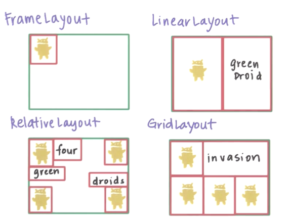

### Layouts

Controalele Android fac parte din cadrul unui grup (obiect de tip
`android.view.ViewGroup`) care definește și modul în care acestea sunt dispuse
în cadrul interfeței grafice precum și dimensiunile pe care le pot lua, motiv
pentru care o astfel de componentă este referită și sub denumirea de layout.
Acest element nu vizează însă tratarea evenimentelor legate de interacțiunea cu
utilizatorul.

În Android, denumirea de layout este utilizată și pentru
fișierele de resurse care definesc interfața grafică corespunzătoare
unei activități, a unui fragment sau a unui alt element din interfața
grafică, plasate în `/res/layout` (respectiv în `/res/layout-land`).
Acestea nu trebuie însă confundate cu tipurile de controale care
gestionează mecanismul de dispunere a diferitelor elemente grafice în
cadrul interfeței.

Cele mai utilizate tipuri de grupuri de componente vizuale sunt `LinearLayout`,
`AbsoluteLayout`, `RelativeLayout`, `FrameLayout`, `TableLayout` și
`GridLayout`.

Elementele de tip layout pot fi imbricate (conținute) unele într-altele,
astfel încât se pot proiecta interfețe grafice în care modul de
dispunere al controalelor să fie foarte complex, prin combinarea
funcționalităților pe care le oferă fiecare dintre componentele de tip
`ViewGroup`. Restricția care trebuie respectată în acest caz este ca
spațiile de nume indicate prin proprietatea `xmlns` să fie precizate
doar o singură dată, de obiectul layout rădăcină.

Fiecare clasă de tip layout are și o clasă internă `LayoutParams` în
care proprietățile referitoare la dimensiuni și margini sunt reținute în
obiecte de tip `layout_...`. Ele vor fi aplicate tuturor controalelor
grafice conținute. Cele mai frecvent utilizate atribute sunt:

- `layout_height`, `layout_width` - definesc lățimea și înălțimea
    componentei, putând avea valorile:

    - `match_parent` - va ocupa tot spațiul pus la dispoziție de componenta în care este conținută (fără padding);
    - `wrap_content` - va ocupa doar spațiul solicitat de componentele pe care le conține (cu padding);
    - o valoare indicată explicit împreună cu unitatea de măsură.
- `layout_weight` - proporția pe care o ocupă în raport cu alte componente;

- `weightSum` - suma proporțiilor tuturor controalelor grafice
    conținute; valoarea implicită este 1;
- `layout_gravity` - modul în care componenta este aliniată în cadrul
    grupului din care face parte (valorile posibile pe care le poate lua
    această proprietate sunt: `top`, `botttom`, `left`, `right`,
    `center_vertical`, `center_horizontal`, `center` (centrare pe ambele
    direcții), `fill_vertical`, `fill_horizontal`, `fill` (ocuparea
    spațiului pe ambele direcții), `clip_vertical`, `clip_horizontal`;
    aceste valori pot fi combinate prin intermediul operatorului `|` (pe
    biți);
