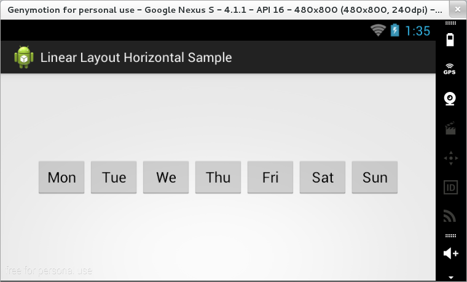
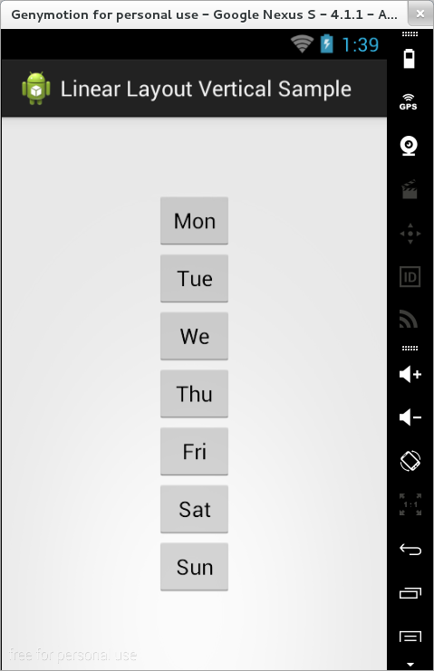

### LinearLayout (obligatoriu)

În cadrul unui grup de tip `LinearLayout`, componentele sunt dispuse fie
pe orizontală, fie pe verticală, în funcție de proprietatea
`orientation` (putând lua valorile `horizontal` - implicită sau
`vertical`).

``` xml
<LinearLayout xmlns:android="http:*schemas.android.com/apk/res/android"
  xmlns:tools="http:*schemas.android.com/tools"
  android:layout_width="match_parent"
  android:layout_height="match_parent"
  android:paddingBottom="@dimen/activity_vertical_margin"
  android:paddingLeft="@dimen/activity_horizontal_margin"
  android:paddingRight="@dimen/activity_horizontal_margin"
  android:paddingTop="@dimen/activity_vertical_margin"
  android:orientation="..."
  tools:context="..." >
    
  <!-- other layouts or widgets -->
    
</LinearLayout>    
```




