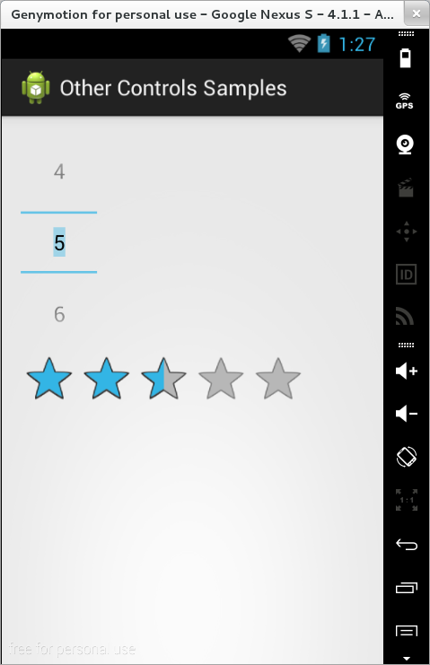

### Alte Tipuri de Controale Grafice -- facultativ

#### NumberPicker

Un obiect de tip `NumberPicker` este folosit pentru a alege o valoare
dintr-un interval definit de proprietățile `min` și `max`. Forma în care
este afișat depinde de tema pe care o folosește aplicația:

-   dacă tema curentă este derivată din `Theme`, elementul este
    prezentat ca un câmp text editabil cu un buton de incrementare
    deasupra și un buton de decrementare dedesubt; operația de apăsare
    lungă a butoanelor determină schimbarea rapidă a valorii curente;
-   dacă tema curentă este derivată din `Theme_Holo` sau
    `Theme_Holo_Light`, elementul este prezentat ca un câmp text
    editabil, având o valoare mai mică deasupra și o valoare mai mare
    dedesubt; operația de apăsare lungă pe valorile mai mici / mai mari
    determină schimbarea rapidă a valorii curente; apăsarea pe valoarea
    curentă activează tastatura virtuală pentru a indica valoarea
    dorită; de asemenea, se poate folosi operația de derulare pentru a
    naviga prin întreaga gamă de valori.

Valoarea curentă este reprezentată de proprietatea `value`.

Identificarea momentului în care a fost modificată o valoare poate fi
realizată prin implementarea unui obiect ascultător de tip
`NumberPicker.OnValueChangeListener` și rederinirea valorii
`onValueChange()`.

#### RatingBar

Un obiect de tip `RatingBar` este utilizat pentru a gestiona
calificative, exprimate sub formă de număr de stele. Definirea unui
astfel de obiect implică:

-   precizarea calificativului maxim, prin intermediul proprietății
    `numStars` (număr întreg);
-   diferența utilizată între valori succesive, prin atributul
    `stepSize` (număr real, cu zecimale).

Evenimentele reprezentate de interacțiunea cu utilizatorul sunt
gestionate prin intermediul unui obiect ascultător de tip
`RatingBar.OnRatingBarChangeListener` și (re)definirea metodei
`onRatingChanged()`, apelată în momentul în care a fost înregistrată o
modificare a calificativului (în timpul selecției propriu-zise a valorii
nu se invocă metoda). \</spoiler>
