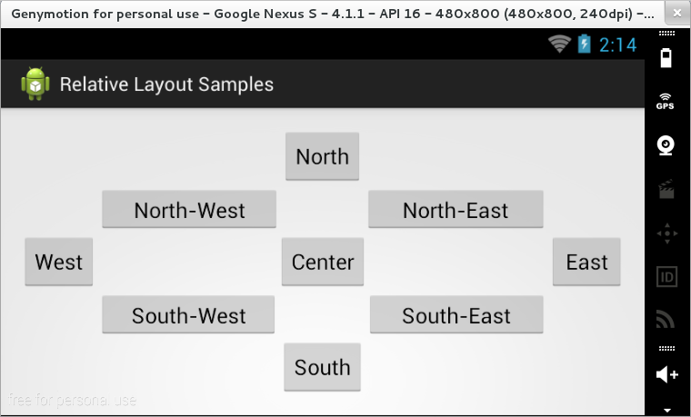

### RelativeLayout

În cadrul unui grup de tip `RelativeLayout`, componentele pot fi dispuse
relativ la:

-   containerul din care fac parte, prin intermediul unor proprietăți ce
    pot lua valorile `true` sau `false`:
    -   pe verticală: `layout_alignParentTop`,
        `layout_alignParentBottom`;
    -   pe orizontală: `layout_alignParentLeft`,
        `layout_alignParentRight`;
    -   centrate: `layout_centerInParent`, `layout_centerHorizontal`,
        `layout_centerVertical`.
-   alte controale din cadrul aceluiași container, spre care există o
    referință prin intermediul unui identificator (`android:id`),
    accesat ca `@id/...`:
    -   `layout_alignTop`, `layout_alignBottom`, `layout_alignLeft`,
        `layout_alignRight`;
    -   `layout_toLeftOf`, `layout_toRightOf`, `layout_above`,
        `layout_below`.

