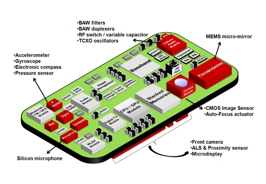

# Sensors

Majoritatea dispozitivelor cu sistem de operare Android au senzori încorporați
care măsoară mișcarea, orientarea și diverse condiții de mediu. Acești senzori
sunt capabili să furnizeze date brute cu precizie și acuratețe ridicată și sunt
utili dacă doriți să monitorizați mișcarea sau poziționarea tridimensională a
dispozitivului sau dacă doriți să monitorizați schimbările din mediul ambiant
din apropierea unui dispozitiv. De exemplu, un joc ar putea urmări citirile de
la senzorul de gravitație al unui dispozitiv pentru a deduce gesturi și mișcări
complexe ale utilizatorului, cum ar fi înclinarea, scuturarea, rotația sau
balansarea. De asemenea, o aplicație meteo ar putea folosi senzorul de
temperatură și senzorul de umiditate ale unui dispozitiv pentru a calcula și
raporta punctul de rouă, sau o aplicație de călătorie ar putea folosi senzorul
de câmp geomagnetic și accelerometrul pentru a raporta o direcție de busolă.

