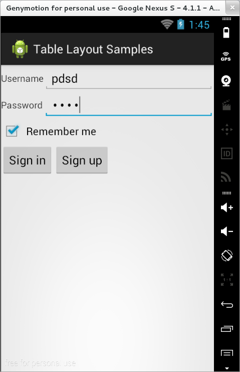

### TableLayout

Într-un mecanism de poziționare de tip `TableLayout`, elementele
componente (layout-uri sau widget-uri) sunt plasate în cadrul unui
tabel, fără ca marginile să fie afișate și fără a se specifica în mod
explicit numărul de rânduri sau de coloane, acestea fiind determinate în
mod automat (numărul de rânduri este determinat ca sumă a elementelor de
tip `TableRow`, iar numărul de coloane ca maximul numărului de
componente de pe o linie; de asemenea, dimensiunea unei coloane este
dată de componenta cea mai voluminoasă afișată în cadrul ei).

\<spoiler> Cele mai importante proprietăți ale unui layout de acest tip
sunt:

-   `stretchColumns` - specifică o listă de indecși indicând coloanele
    care ar trebui mărite în cazul în care tabelul este mai mic decât
    spațiul de afișare pe care îl pune la dispoziție;
-   `shrinkColumns` - specifică o listă de indecși indicând coloanele
    care ar trebui micșorate în cazul în care tabelul este mai mare
    decât spațiul de afișare pe care îl are la dispoziție;
-   `collapseColumns` - specifică o listă de indecși indicând coloanele
    care ar trebui omise în totalitate.

---
**Note**

În referirea indecșilor, numerotarea se face de la 0.
Separarea indecșilor în cadrul listei se face prin virgulă.\

---

De obicei, componentele sunt plasate într-un obiect de tip `TableRow`.
De asemenea, este permisă definirea de componente și în afara acestui
element, dacă se dorește ca obiectul respectiv să ocupe întregul spațiu
al rândului respectiv.

Dacă se dorește ca unele coloane să fie lăsate goale, pot fi utilizate
și unele proprietăți:

-   `layout_column` - se folosește pentru a specifica o anumită coloană,
    lăsând coloanele anterioare fără nici un conținut (în mod obișnuit,
    ordinea de procesare a coloanelor este de la stânga la dreapta);
-   `layout_span` - este utilizat în situația în care se dorește
    afișarea unui anumit conținut în cadrul a mai multor coloane
    consecutive (`colspan`); numărul acestora este indicat prin
    intermediul acestei proprietăți.

---
**Note**

Nu există o proprietate pentru afișarea unui conținut
în cadrul a mai multe rânduri consecutive (`rowspan`). În acest sens,
trebuie folosite tabele imbricate.\

---

``` xml
<TableLayout xmlns:android="http:*schemas.android.com/apk/res/android"
  xmlns:tools="http:*schemas.android.com/tools"
  android:layout_width="match_parent"
  android:layout_height="match_parent"
  android:stretchColumns="1"
  tools:context="..." >
  <TableRow>
    <TextView 
      android:layout_width="match_parent"
      android:layout_height="match_parent"
      android:gravity="center_vertical"
      android:text="@string/username" />
    <EditText 
      android:layout_width="match_parent"
      android:layout_height="match_parent"
      android:inputType="text" />
  </TableRow>
  <TableRow>
    <TextView 
      android:layout_width="match_parent"
      android:layout_height="match_parent"
      android:gravity="center_vertical"
      android:text="@string/password" />
    <EditText 
      android:layout_width="match_parent"
      android:layout_height="match_parent"
      android:inputType="textPassword" />
  </TableRow>
  <TableRow>
    <CheckBox
      android:layout_width="match_parent"
      android:layout_height="match_parent"
      android:layout_span="2"
      android:text="@string/keepmesignedin" />
  </TableRow>   
  <TableLayout 
    android:layout_width="match_parent"
    android:layout_height="match_parent" >
    <TableRow>
      <Button
        android:layout_width="wrap_content"
        android:layout_height="wrap_content"
        android:text="@string/signin" />
      <Button 
    android:layout_width="wrap_content"
    android:layout_height="wrap_content"
    android:text="@string/signup" />
    </TableRow>         
  </TableLayout>
</TableLayout>
```


\</spoiler>
