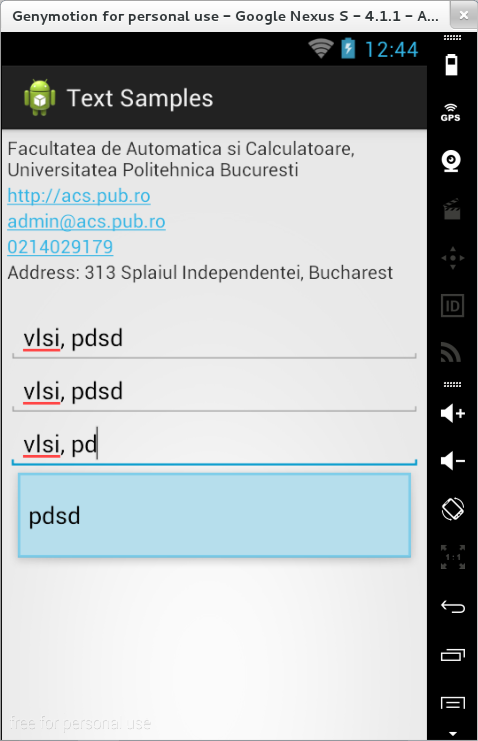

### Controale de tip text

Android pune la dispoziția programatorilor un set complet de controale
de tip text, dintre care cele mai utilizate sunt `TextView`, `EditText`,
`AutoCompleteTextView` și `MultiCompleteTextView`.

