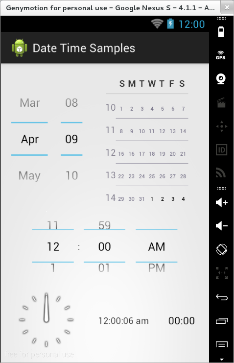
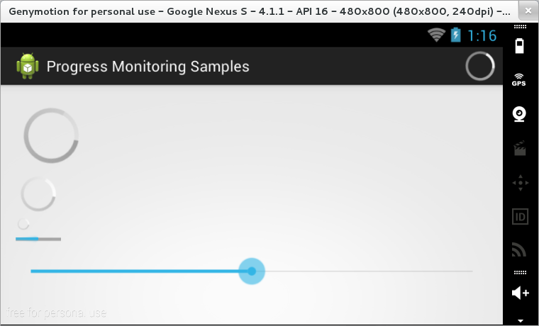
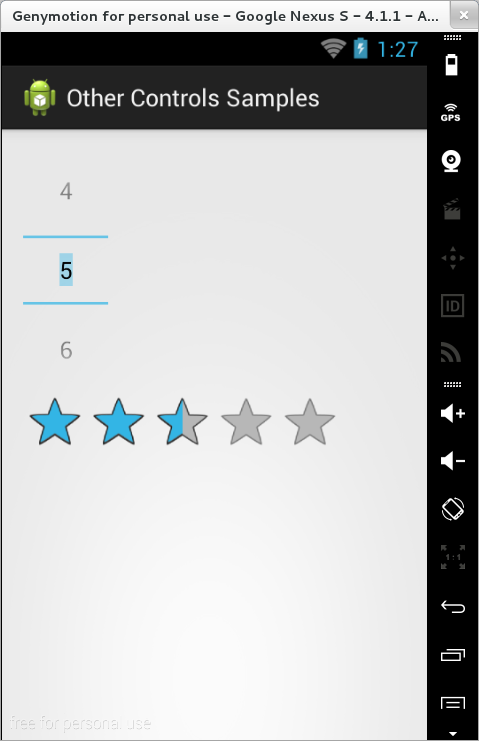

#### VideoView

Controlul de tip `VideoView` este utilizat pentru redarea de conținut
video, într-unul din formatele `H.263`, `H.264 AVC`, `MPEG-4 SP` sau
`VP8`.

\<spoiler> Conținutul acestui control poate fi specificat prin una din
metodele `setVideoPath(String)` sau `setVideoUri(Uri)`, prin care se
indică locația unui fișier stocat pe dispozitiv sau aflat la distanță,
pe un server.

---
**Note**

Pentru a se putea accesa conținutul aflat la distanță, în
fișierul `AndroidManifest.xml` trebuie să se specifice o permisiune
explicită în acest sens:  
`<uses-permission android:name="android.permission.INTERNET" />`\

---

Metodele pe care le pune la dispoziție un astfel de obiect pentru
controlul procesului de redare sunt `start()`, `pause()`, respectiv
`stopPlayback()`. De asemenea, se pot verifica anumiți parametri ai
conținutului prin metodele `isPlaying()`, `getDuration()` și
`getCurrentPosition()`.

De asemenea, pot fi monitorizate o serie de evenimente, cum ar fi
începutul și sfârșitul redării conținutului video, generarea unor
informații cu privire la redarea conținutului, producerea unei erori:

``` java
videoView.setOnPreparedListener(new MediaPlayer.OnPreparedListener() {
  @Override
  public void onPrepared(MediaPlayer mediaPlayer) {
    * TODO Auto-generated method stub
  }
});
videoView.setOnCompletionListener(new MediaPlayer.OnCompletionListener() {
  @Override
  public void onCompletion(MediaPlayer mediaPlayer) {
    * TODO Auto-generated method stub
  }
});
videoView.setOnInfoListener(new MediaPlayer.OnInfoListener() {
  @Override
  public boolean onInfo(MediaPlayer mediaPlayer, int what, int extra) {
    * TODO Auto-generated method stub
    return false;
  }
});
videoView.setOnErrorListener(new MediaPlayer.OnErrorListener() {
  @Override
  public boolean onError(MediaPlayer mediaPlayer, int what, int extra) {
    * TODO Auto-generated method stub
    return false;
  }
});
```

Pentru ca utilizatorul aplicației să poată controla redarea conținutului
video, obiectului de tip `VideoView` trebuie să i se asocieze un obiect
`MediaController` care va pune la dispoziție o serie de controale prin
care se poate realiza pornirea și oprirea procesului.

``` java
MediaController mediaController = new MediaController(this);
mediaController.setAnchorView(videoView);
videoView.setMediaController(mediaController);
```

Controalele obiectului `MediaController` pot fi afișate sau nu prin
metodele `show(int timeout)` respectiv `hide()`.

\</spoiler>

\<spoiler Controale pentru gestiunea datei calendaristice și a timpului
-- facultativ>

Majoritatea bibliotecilor de controale pun la dispoziția dezvoltatorilor
componente pentru gestiunea informațiilor legate de data calendaristică
și timp. În Android, cele mai frecvent uzitate elemente de acest tip
sunt `DatePicker`, `TimePicker`, `AnalogClock` și `DigitalClock`.



**DatePicker**

Obiectul de tip `DatePicker` este folosit pentru gestiunea componentelor
unei date calendaristice (zi, lună, an).

Inițializarea unei astfel de componente se realizează prin metoda
`init()`, ce primește ca parametrii anul, luna, ziua și o clasă
ascultător (ce implementează interfața
`DatePicker.OnDateChangedListener` cu metoda `onDateChanged()`). De
regulă, evenimentele pe acest control nu sunt monitorizate, preluându-se
conținutul său la un moment de timp ulterior. În cazul în care nu se
specifică nici o valoare pentru acest control, va fi preluată data
calendaristică a sistemului Android.

Conținutul controlului se obține prin metodele `getDayOfMonth()`,
`getMonth()`, respectiv `getYear()`.

---
**Note**

Numerotarea unei luni se face pornind de la 0, astfel
încât valoarea furnizată de acest control va trebui incrementată.
Invers, la inițializarea conținutului unei componente de tip
`DatePicker`, se va realiza operația de decrementare înainte de
transmiterea unei date calendaristice.\

---

Valorile pe care le poate lua acest element pot fi controlate prin
intermediul proprietăților `minDate` (respectiv `minYear`) și `maxDate`
(respectiv `maxYear`). De asemenea, dacă se dorește sau nu afișarea unui
calendar va fi indicat prin intermediul proprietății
`calendarViewShown`.

**TimePicker**

Obiectul de tip `TimePicker` este folosit pentru gestiunea componentelor
timpului (oră, minut).

Inițializarea unei astfel de componente se realizează prin metodele
`setCurrentHour()`, respectiv `setCurrentMinute()` care primesc ca
parametrii obiecte de tip `Integer`. Clasa ascultător pentru
evenimentele produse în legătură cu acest obiect implementează interfața
`TimePicker.OnTimeChangedListener` și metoda `onTimeChanged()`. În cazul
în care nu se specifică nici o valoare pentru acest control, va fi
preluat timpul sistemului Android.

\<note>Formatul utilizat pentru oră (12/24 ore) se precizează prin
intermediul proprietății `is24HourView`.\

---

Conținutul controlului se obține prin metodele `getCurrentHour()`,
respectiv `getCurrentMinute()`.

**AnalogClock**

Obiectul de tip `AnalogClock` este folosit pentru afișarea timpului
curent, folosind un ceas analogic. Utilizatorul nu poate interacționa cu
un astfel de control, actualizarea conținutului său fiind realizată în
mod automat, la fiecare minut.

---
**Note**

Un obiect de tip `AnalogClock` poate fi particularizat în
sensul că se pot specifica anumite resurse grafice pentru afișarea
cadranului orar și a limbilor care indică ora și minutul.\

---

DigitalClock (nivel API \< 17)

Obiectul de tip `DigitalClock` este folosit pentru afișarea timpului
curent, folosind un ceas digital. Este un control de tip `TextView` de
la care moștenește toate funcționalitățile. Utilizatorul nu poate
interacționa cu un astfel de control, actualizarea conținutului său
fiind realizată în mod automat, la fiecare secundă.

TextClock (nivel API \>= 17)

Obiectul de tip `TextClock` este folosit pentru afișarea datei
calendaristice și/sau a timpului curent (folosind formatul 12/24 ore și
permițând schimbarea zonei de timp).

Implicit, acest control nu afișează și secundele.

Chronometer

Un obiect de tip `Chronometer` este utilizat pentru monitorizarea
timpului scurs începând de la un anumit moment, pentru activitățile în
care un astfel de element este esențial.

Modul în care este afișat contorul ce indică trecerea timpului este
controlat prin intermediul parametrului `android:format`:

-   `%h` - număr de ore;
-   `%m` - număr de minute;
-   `%s` - număr de secunde.

Cronometrarea propriu-zisă este realizată între apelurile metodelor
`start()`, respectiv `stop()`. De asemenea, se poate indica momentul de
timp care este considerat drept referință pentru numărătoare, prin
intermediul metodei `setBase()`. Pornirea de la 0 se face transmițând
metodei `setBase()` un parametru de tip
`android.os.SystemClock.elapsedRealTime()`.

Monitorizarea evenimentelor legate de un obiect de tip `Chronometer` se
face prin implementarea unui obiect ascultător de tip
`Chronometer.OnChronometerTickListener` prin (re)definirea metodei
`onChronometerTick()`.

\</spoiler> \<spoiler Controale pentru monitorizarea progresului --
facultativ>

În momentul în care sunt realizate acțiuni care durează o perioadă de
timp mai mare, o practică uzuală este de a indica utilizatorului faptul
că un proces este în desfășurare și că aplicația nu s-a blocat prin
intermediu unei bare de progres. O altă situație în care se dorește să
se afișeze progresul este indicarea evoluției pe care a realizat-o un
utilizator în cadrul unei aplicații (rularea unui fișier multimedia -
timp scurs vs. timp rămas, nivelul la care s-a ajuns în cadrul unui joc)
sau chiar controlul acestei poziții.

SDK-ul de Android oferă mai multe controale care pot fi utile în
monitorizarea progresului: bară de progres (`ProgressBar`) sau bară de
căutare (`SeekBar`), precum și alte obiecte pentru a indica diferite
forme de activitate.



**ProgressBar**

Obiectul de tip `ProgressBar` are mai multe forme:

1.  un indicator circular animat, care nu oferă nici un fel de
    informații cu privire la procentul de completitudine al procesului
    realizat în fundal (util mai ales pentru operații a căror lungime nu
    poate fi determinată); stilurile care pot fi folosite pentru acest
    tip de bară de progress sunt `progressBarStyleLarge` și
    `progressBarStyleSmall`, animația fiind realizată în mod automat;
2.  o bară de progres orizontală care indică și măsura în care sarcina
    din fundal a fost realizată (poate fi însoțită și de o altă bară de
    progres orizontală care indică starea unui proces imbricat); stilul
    folosit în acest caz este `progressBarStyleHorizontal`, suportând
    proprietăți cum ar fi `progress` (valoarea curentă), respectiv `min`
    / `max`.

Se obișnuiește ca progresul să fie afișat direct în bara de titlu, ceea
ce poate economisi din spațiul folosit de interfața grafică, acesta
putând fi activat / dezactivat cu ușurință. Semnificația unui indicator
de progres în acest caz este aceea că trebuie așteptată încărcarea mai
multor resurse înainte ca utilizatorul să poată interacționa cu
aplicația respectivă.

\<columns 100% 50%>

``` java
@Override
protected void onCreate(Bundle savedInstanceState) {
  requestWindowFeature(Window.FEATURE_INDETERMINATE_PROGRESS);
  setContentView(R.layout.progress_bar_activity);
  setProgressBarIndeterminateVisibility(true);
}
```

\<newcolumn>

``` java
@Override
protected void onCreate(Bundle savedInstanceState) {
  requestWindowFeature(Window.FEATURE_PROGRESS);
  setContentView(R.layout.progress_bar_activity);
  setProgressBarVisibility(true);
  setProgress(0); * valoarea maxima implicita este 10000
}
```

\</columns>

De remarcat faptul că metoda `requestWindowFeature()` trebuie apelată
înainte de încărcarea propriu-zisă a interfeței grafice prin metoda
`setContentView()`. Implicit, indicatorul de progres este vizibil,
metodele `setProgressBarIndeterminateVisibility()` și
`setProgressBarVisibility()` având rolul de a-l activa, respectiv
dezactiva în funcție de parametrul care este transmis. În momentul în
care progresul atinge valoarea maximă, starea obiectului asociat trece
de la vizibil la non-vizibil, prin intermediul unei animații.

În situația în care nu se poate evalua progresul pe care îl
înregistrează un proces, se folosesc **indicatori de activitate**, care
pot avea forma unei bare de stare sau a unui cerc.

\<note>Fiecare operație care este realizată în fundal ar trebui
reprezentată în interfața grafică prin intermediul unui indicator de
activitate.\

---

Se folosesc tot obiecte de tip `ProgressBar`, pentru care se precizează
faptul că vor rula o perioadă de timp nedeterminată:

-   prin precizarea proprietății `android:indeterminate`;
-   prin invocarea metodei `setProgressBarIndeterminateVisibility()`.

**SeekBar**

În situația în care se dorește să se ofere utilizatorului posibilitatea
de a controla progresul unei anumite operații, se folosește un obiect de
tip `SeekBar`, care are în plus un selector a cărui locație poate fi
modificată manual prin interfața grafică, la orice poziție cuprinsă
între `0` și valoarea indicată de proprietatea `max`.

---
**Note**

Resursa grafică folosită pentru redarea selectorului poate fi
particularizată prin utilizarea oricărei imagini din directorul
`drawable`.\

---

Notificările cu privire la modificările operate pe un astfel de obiect
sunt primite prin intermediul unui obiect ascultător de tipul
`SeekBar.OnSeekBarChangeListener` pentru care se definește metoda
`onProgressChanged()` (aceasta primește și un parametru de tip `boolean`
care indică dacă actualizarea controlului a fost realizată în urma unei
intervenții a utilizatorului sau programatic):

``` java
SeekBar moviePlayerSeekBar = (SeekBar)findViewById(R.id.movie_player_seek_bar);
moviePlayerSeekBar.setOnSeekBarListener(new SeekBar.OnSeekBarChangeListener() {
  
  @Override
  public void onProgressChanged(SeekBar seekBar, int progress, boolean fromTouch) {
    * ...
  }
  
});
```

**Alte Tipuri de Controale Grafice** -- facultativ



**NumberPicker**

Un obiect de tip `NumberPicker` este folosit pentru a alege o valoare
dintr-un interval definit de proprietățile `min` și `max`. Forma în care
este afișat depinde de tema pe care o folosește aplicația:

-   dacă tema curentă este derivată din `Theme`, elementul este
    prezentat ca un câmp text editabil cu un buton de incrementare
    deasupra și un buton de decrementare dedesubt; operația de apăsare
    lungă a butoanelor determină schimbarea rapidă a valorii curente;
-   dacă tema curentă este derivată din `Theme_Holo` sau
    `Theme_Holo_Light`, elementul este prezentat ca un câmp text
    editabil, având o valoare mai mică deasupra și o valoare mai mare
    dedesubt; operația de apăsare lungă pe valorile mai mici / mai mari
    determină schimbarea rapidă a valorii curente; apăsarea pe valoarea
    curentă activează tastatura virtuală pentru a indica valoarea
    dorită; de asemenea, se poate folosi operația de derulare pentru a
    naviga prin întreaga gamă de valori.

Valoarea curentă este reprezentată de proprietatea `value`.

Identificarea momentului în care a fost modificată o valoare poate fi
realizată prin implementarea unui obiect ascultător de tip
`NumberPicker.OnValueChangeListener` și rederinirea valorii
`onValueChange()`.

**RatingBar**

Un obiect de tip `RatingBar` este utilizat pentru a gestiona
calificative, exprimate sub formă de număr de stele. Definirea unui
astfel de obiect implică:

-   precizarea calificativului maxim, prin intermediul proprietății
    `numStars` (număr întreg);
-   diferența utilizată între valori succesive, prin atributul
    `stepSize` (număr real, cu zecimale).

Evenimentele reprezentate de interacțiunea cu utilizatorul sunt
gestionate prin intermediul unui obiect ascultător de tip
`RatingBar.OnRatingBarChangeListener` și (re)definirea metodei
`onRatingChanged()`, apelată în momentul în care a fost înregistrată o
modificare a calificativului (în timpul selecției propriu-zise a valorii
nu se invocă metoda). \</spoiler>
