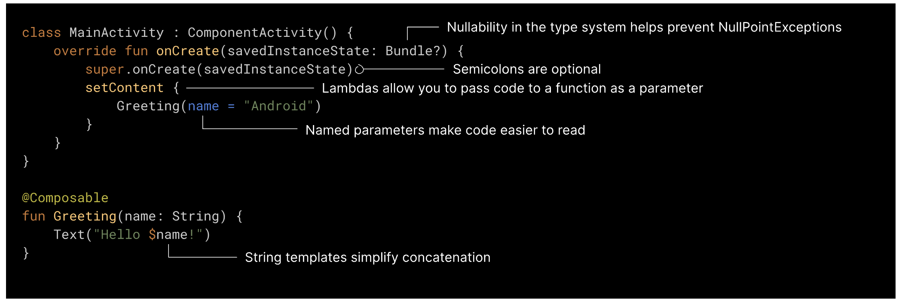

## Exercises (Kotlin version)

### Why Kotlin?

Kotlin has become a preferred language for Android development for several reasons, each contributing to its growing popularity over Java:
- Modern and Concise Syntax
- Null Safety: Kotlin introduces null safety features at the language level, significantly reducing the risk of null pointer exceptions, which are common in Java. 
- Coroutines for Asynchronous Programming: Kotlin's support for coroutines simplifies asynchronous programming, making it easier to handle operations that require long-running tasks, such as network calls or database transactions. 
- Extension Functions: This feature enables cleaner, more modular code by allowing the addition of useful utility functions to existing classes without modifying their source code.
- Language Features for Better Code Quality: Kotlin includes features like data classes, sealed classes, and type inference, which can lead to higher code quality, making it easier to model domain concepts and manage application state more effectively.
- Support for Jetpack Compose: newest UI toolkit for Android development.

#### What does Kotlin code look like?


----

### Crash Course for Kotlin

Variable Declarations:

val for read-only (immutable) variables (similar to final in Java).
var for mutable variables.

```kotlin
val immutableString: String = "Hello"
var mutableInt: Int = 42
```

Null Safety:

Kotlin types are non-nullable by default.
Use ? to mark a type as nullable.

```kotlin
var a: String = "abc"
// a = null // Compilation error
var b: String? = "abc" // Nullable string
b = null // Allowed
```

String Interpolation:

Use $ to insert variables and expressions into strings.

```kotlin
val name = "World"
println("Hello, $name!")
```

Type Inference:

Kotlin can often infer the type of a variable, reducing the need for explicit type declarations.

```kotlin
val message = "Hello, World!" // Type inferred as String
Functions
```

Function Definitions:

Functions are declared with the fun keyword.

```kotlin
fun sum(a: Int, b: Int): Int {
    return a + b
}
```

Expression Bodies:

Functions with a single expression can omit curly braces and specify the body after an =.

```kotlin
fun sum(a: Int, b: Int): Int = a + b
```

Default Arguments:
Kotlin supports default arguments, reducing the need for method overloading.

```Kotlin
fun greet(name: String, greeting: String = "Hello") {
    println("$greeting, $name!")
}
```

Named Arguments:

Call functions with named arguments for clearer code and flexibility in argument order.
```Kotlin
greet(name = "Alice", greeting = "Hi")
```

Classes Primary Constructors:

Kotlin classes can declare primary constructor parameters in the class header.
```Kotlin
class Person(val name: String, var age: Int)
```

Init Blocks:

Initialization code can be placed in init blocks.

```Kotlin
class Person(val name: String) {
    init {
        println("Person initialized with name: $name")
    }
}
```

Data Classes:

data keyword creates a class with automatically generated equals(), hashCode(), toString(), copy(), and componentN() functions.

```Kotlin
data class User(val name: String, val age: Int)
```

Control Flow
When Expression:

when replaces the switch statement, offering more flexible conditions.

```Kotlin
when (x) {
    1 -> print("x == 1")
    2 -> print("x == 2")
    else -> print("x is neither 1 nor 2")
}
```

For Loop:

for loop syntax is streamlined, using the in keyword.

```kotlin
val items = listOf("apple", "banana", "kiwi")
for (item in items) {
    println(item)
}
```

Standard Library Differences
Collection Processing:
Kotlin extends the collection API with a wide range of functional processing methods.

```Kotlin
val fruits = listOf("banana", "avocado", "apple", "kiwi")
fruits
    .filter { it.startsWith("a") }
    .sortedBy { it }
    .map { it.toUpperCase() }
    .forEach { println(it) }

```
Null Safety and Smart Casts
Safe Calls (?.) and Elvis Operator (?:):

Use ?. for safe access on nullable types and ?: for providing default values.

```kotlin
val length = b?.length ?: 0 // Returns b.length if b is not null; otherwise returns 0
```

Smart Casts:

Kotlin automatically casts types if they have been checked in a condition.

```kotlin
if (obj is String) {
    print(obj.length) // obj is automatically cast to String
}
```

### Resources to learn Kotlin: ###

[1. Kotlin for Android](https://developer.android.com/kotlin)

[2. Kotlin Syntax](https://kotlinlang.org/docs/kotlin-tour-welcome.html)

----

### Crash Course Jetpack Compose
Jetpack Compose is Android's modern toolkit for building native UIs. It simplifies and accelerates UI development on Android with less code, powerful tools, and intuitive Kotlin APIs. If you're coming from traditional Android development (using XML layouts and View-based frameworks), here are key concepts and syntax changes in Jetpack Compose to get you started:

**Composable Functions**
UI components in Jetpack Compose are built using composable functions, marked with the @Composable annotation. These functions define a part of the UI that can be composed and reused.

```Kotlin
@Composable
fun Greeting(name: String) {
    Text(text = "Hello, $name!")
}
```

**Composition**
 UIs are built by calling other composable functions from within a composable function. Composition happens in a declarative way, meaning you define what the UI should look like, not how to display it.

```kotlin
@Composable
fun MyApp() {
    Greeting(name = "Android")
}
```

**Layouts**
Layouts in Compose are built using composable functions like Column, Row, and Box, which can contain other composables. Modifiers are used to customize layout properties such as padding, size, and click actions.

```Kotlin
@Composable
fun MessageCard(name: String) {
    Row(modifier = Modifier.padding(all = 8.dp)) {
        Image(/*...*/)
        Column(modifier = Modifier.padding(start = 8.dp)) {
            Text(text = "Hello, $name")
            // More composables
        }
    }
}
```

**State Management**
 Compose uses a reactive programming model. When the state of your app changes, the UI automatically updates. You define state using remember and mutableStateOf. Compose intelligently recomposes only the parts of the UI that depend on the changed state.

```kotlin
@Composable
fun Counter() {
    var count by remember { mutableStateOf(0) }
    Button(onClick = { count++ }) {
        Text("Clicked $count times")
    }
}
```

**Themes and Styling**
Jetpack Compose integrates with Material Design components and theming. You can easily theme your app and use Material components like Button, Card, and Scaffold to ensure consistency with design guidelines.

```Kotlin
@Composable
fun ThemedGreeting(name: String) {
    MaterialTheme {
        Text(text = "Hello, $name!", style = MaterialTheme.typography.h5)
    }
}
```

**Navigation**
Jetpack Compose works with the Navigation component to handle navigation in your app. Define navigation graphs and use NavController to navigate between composables.

```Kotlin
val navController = rememberNavController()
NavHost(navController, startDestination = "profile") {
    composable("profile") { ProfileScreen() }
    // Add more destinations
}
```


**Interoperability**
You can interoperate with existing Android Views using the AndroidView composable, allowing for a gradual migration to Compose.

```Kotlin
AndroidView(factory = { context ->
    // Return a view instance
})
```

**Resources to learn more about:** 

[1. Jetpack Compose basics](https://developer.android.com/codelabs/jetpack-compose-basics#0)

[2. Jetpack compose advanced](https://developer.android.com/courses/jetpack-compose/course)

----

### Android architecture MVVM

Implementing the Model-View-ViewModel (MVVM) architecture in Android applications using Jetpack Compose involves structuring your app in a way that separates the user interface (View), the data and business logic (Model), and the decision-making and communication between the View and Model (ViewModel). This architecture enhances maintainability, testability, and scalability. Here's a quick guide on applying MVVM with Jetpack Compose:

1. **Model**

This layer is responsible for the data source and business logic of your application. It might include classes for handling database operations, network calls, and data manipulation.

```kotlin
data class User(val id: Int, val name: String)
```

2. **ViewModel**

ViewModels act as the middleman between the View and Model. They handle UI-related data and logic, expose state and events to the UI, and react to user interactions by updating the state or interacting with the Model.

```kotlin
class UserViewModel (private val userRepository: UserRepository) : ViewModel() {
    private val _userState = mutableStateOf(UserState())
    val userState: State<UserState> = _userState

    init {
        loadUser()
    }

    private fun loadUser() {
        viewModelScope.launch {
            val user = userRepository.getUser()
            _userState.value = userState.value.copy(user = user, isLoading = false)
        }
    }
}

data class UserState(val user: User? = null, val isLoading: Boolean = true)
```

3. **View**

The View layer is composed of composable functions that define your UI. It observes ViewModel state and reacts to changes, displaying the UI accordingly.
Use `remember` and `LaunchedEffect` for managing state and side effects in composables.
Use `viewModel()` to obtain an instance of your ViewModel in the composable.

```kotlin
@Composable
fun UserScreen(userViewModel: UserViewModel = viewModel()) {
    val state = userViewModel.userState.value

    if (state.isLoading) {
        CircularProgressIndicator()
    } else {
        state.user?.let { user ->
            Text("Hello, ${user.name}")
        }
    }
}
```

----

## Exercises
### 1. Create a new Android Project -> Empty Activity (by default the project will have jetpack compose setup)
### 2. Build UI

This will consist of two containers as follows:

- the first container includes several elements arranged vertically and occupying the entire available width:
    - a button (`Button`) with the message *Show Additional Fields* if the other container is not displayed, respectively the message *Hide Additional Fields* if the other container is displayed, causing its attachment/detachment from the activity;
    - four text field controls (`OutlinedTextField`) for entering:
        - the name;
        - the phone number;
        - the email address;
        - the postal address.
- the second container (which is not initially visible) contains four text field controls arranged vertically and occupying the entire available width, for entering:
    - the job title;
    - the company name;
    - the website;
    - the instant messaging identifier.

### 3. ViewModel (business logic)
- the *Show Additional Details* / *Hide Additional Details* button - shows/hides the second container depending on the current state, changing the text displayed on the button accordingly.
- the *Save* button - triggers the execution of the native Android app for saving a contact in the phonebook, after the information has been collected from the graphical controls: (more details [here]())

```Kotlin
    fun saveContact(
        name: String?,
        phone: String?,
        email: String?,
        address: String?,
        jobTitle: String?,
        company: String?,
        website: String?,
        im: String?,
        launcher: ActivityResultLauncher<Intent>

    ) {
        val intent = Intent(ContactsContract.Intents.Insert.ACTION).apply {
            type = ContactsContract.RawContacts.CONTENT_TYPE

            val contactData = arrayListOf<ContentValues>()
            website?.let {
                val websiteRow = ContentValues().apply {
                    put(ContactsContract.Data.MIMETYPE, ContactsContract.CommonDataKinds.Website.CONTENT_ITEM_TYPE)
                    put(ContactsContract.CommonDataKinds.Website.URL, website)
                }
                contactData.add(websiteRow)
            }
            im?.let {
                val imRow = ContentValues().apply {
                    put(ContactsContract.Data.MIMETYPE, ContactsContract.CommonDataKinds.Im.CONTENT_ITEM_TYPE)
                    put(ContactsContract.CommonDataKinds.Im.DATA, im)
                }
                contactData.add(imRow)
            }
            if (contactData.isNotEmpty()) {
                putParcelableArrayListExtra(ContactsContract.Intents.Insert.DATA, contactData)
            }

            name?.let { putExtra(ContactsContract.Intents.Insert.NAME, it) }
            // TODO for the rest of the fields

        }
        launcher.launch(intent)
    }
```


### 4. 