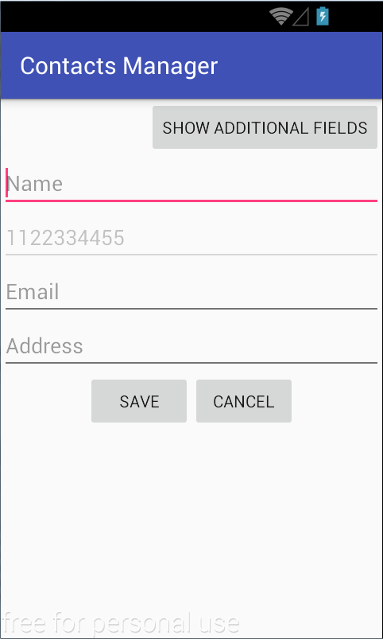
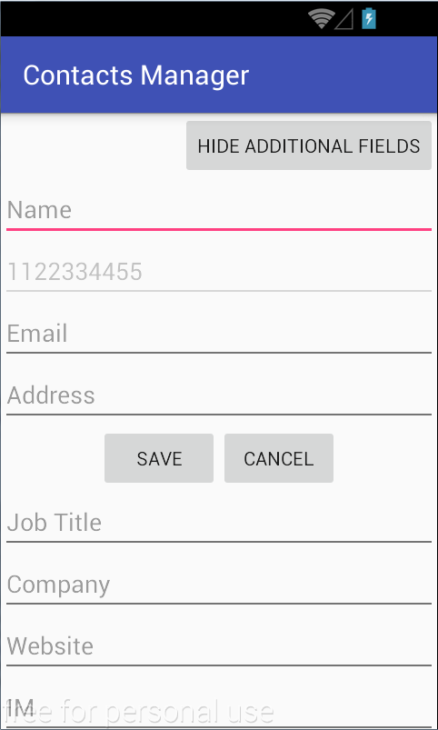
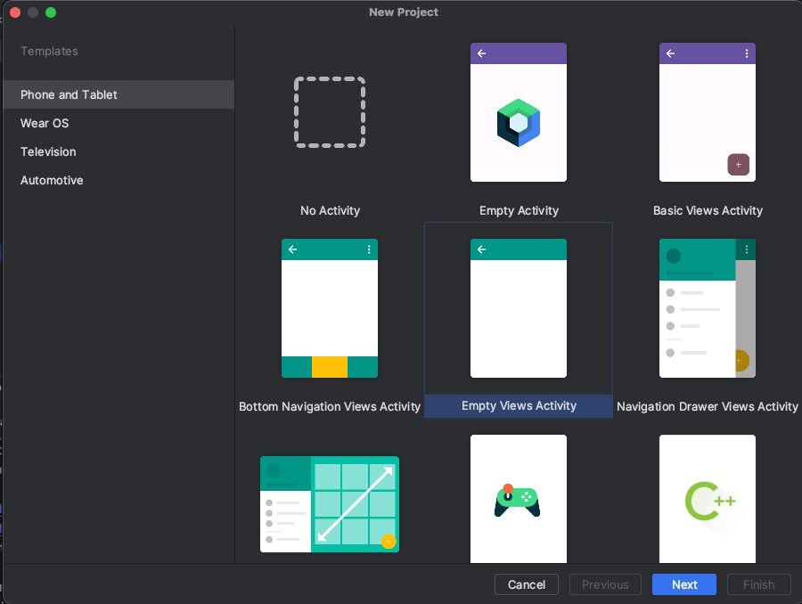
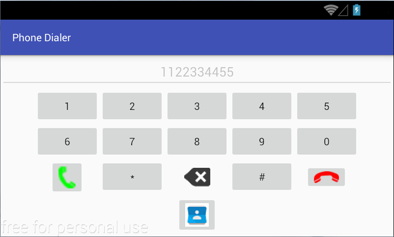
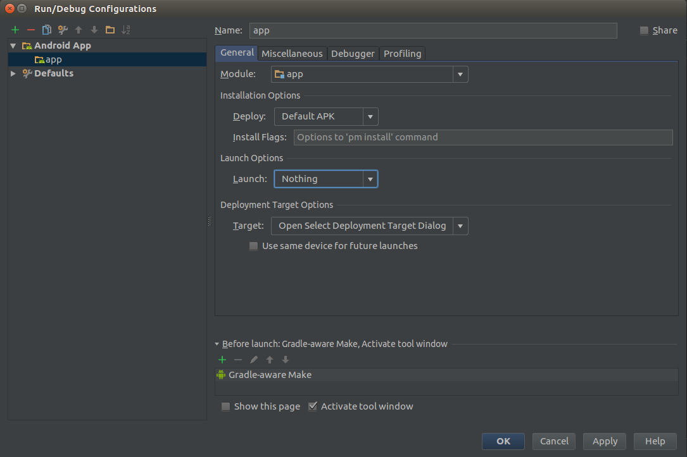

## Activitate de Laborator

Se dorește implementarea unei aplicații Android, conținând o activitate
care să ofere utilizatorilor funcționalitatea necesară pentru a stoca un
număr de telefon în agenda de contacte, specificând pentru acesta mai
multe informații. Pe langa documentatia din laborator,
vom folosi documentatia oficiala Android despre [Intents](https://developer.android.com/guide/components/intents-filters) si [Broadcasts](https://developer.android.com/develop/background-work/background-tasks/broadcasts).





**1.** Să se creeze un proiect Android Studio denumit *ContactsManager* (se selectează *Start a new Android Studio project -> Empty View Activity* -> pentru proiect **XML**).

Pentru un proiect cu **Jetpack Compose**, se selecteaza: *Start a new Android Studio project -> Empty Activity*
<details>
<summary>Imagini cu pasii</summary>


</details>

**2.** În fișierul `activity_contacts_manager` din directorul `res/layout` să se construiască interfața grafică folosind:

-   editorul vizual (*Graphical Layout*)
-   editorul XML (*Text*)

Acesta va fi format din două containere după cum urmează:

-   primul conține mai multe elemente dispuse vertical și ocupând pe
    lățime întregul spațiu avut la dispoziție:
    -   un buton (`Button`) având mesajul *Show Additional Fields* în
        cazul în care celălalt container nu este afișat, respectiv
        mesajul *Hide Additional Fields* în cazul în care celălalt
        container este afișat, determinând atașarea / detașarea acestuia
        la activitate;
    -   patru controale de tip câmpuri text (`EditText`) prin care se
        introduc:
        -   numele;
        -   numărul de telefon - acest câmp este dezactivat (are
            proprietatea `android:enabled="false"`), urmând ca valoarea
            sa să fie preluată din câmpul `extra` al unei intenții;
        -   adresa electronică;
        -   adresa poștală.
-   cel de-al doilea container (care nu este vizibil inițial) conține
    patru controale de tip câmpuri text dispuse vertical și ocupând pe
    lățime întregul spațiu avut la dispoziție, prin care se introduc:
    -   poziția ocupată;
    -   denumirea companiei;
    -   site-ul web;
    -   identificatorul pentru mesagerie instantanee.

Fiecare container poate fi inclus într-un mecanism de dispunere a
conținutului de tip `LinearLayout` cu dispunere verticală. Acestea vor
fi incluse într-un container de tip `ScrollView`, pentru a preîntâmpina
situația în care interfața grafică nu poate fi afișată pe ecranul
dispozitivului mobil.

Să se implementeaze interacțiunea cu utilizatorul a aplicației.

-   în metoda `onCreate()` a activității se obțin referințe către
    butoanele *Show Additional Details* / *Hide Additional Details*,
    respectiv *Save* și *Cancel* prin intermediul metodei
    `findViewById(R.id....)`;
-   se implementează o clasă ascultător pentru butoane, care
    implementează `View.OnClickListener` și implementează metoda
    `onClick(View v)`; în funcție de id-ul butonului care este transmis
    argument metodei, sunt realizate următoarele acțiuni:
    -   butonul *Show Additional Details* / *Hide Additional Details* -
        afișează / ascunde al doilea container în funcție de starea
        curentă , modificând corespunzător textul afișat pe buton.
        (Hint: atributul `visibility` al containerului, resepctiv metoda
        `setVisibility()` a clasei Java împreună cu constantele
        `View.VISIBLE`, `View.GONE`).
    -   butonul *Save* - lansează în execuție aplicația Android nativă
        pentru stocarea unui contact în agenda telefonică, după ce în
        prealabil au fost preluate informațiile din controalele grafice:
        ```java
        Intent intent = new Intent(ContactsContract.Intents.Insert.ACTION);
        intent.setType(ContactsContract.RawContacts.CONTENT_TYPE);
        if (name != null) {
          intent.putExtra(ContactsContract.Intents.Insert.NAME, name);
        }
        if (phone != null) {
          intent.putExtra(ContactsContract.Intents.Insert.PHONE, phone);
        }
        if (email != null) {
          intent.putExtra(ContactsContract.Intents.Insert.EMAIL, email);
        }
        if (address != null) {
          intent.putExtra(ContactsContract.Intents.Insert.POSTAL, address);
        }
        if (jobTitle != null) {
          intent.putExtra(ContactsContract.Intents.Insert.JOB_TITLE, jobTitle);
        }
        if (company != null) {
          intent.putExtra(ContactsContract.Intents.Insert.COMPANY, company);
        }
        ArrayList<ContentValues> contactData = new ArrayList<ContentValues>();
        if (website != null) {
          ContentValues websiteRow = new ContentValues();
          websiteRow.put(ContactsContract.Data.MIMETYPE, ContactsContract.CommonDataKinds.Website.CONTENT_ITEM_TYPE);
          websiteRow.put(ContactsContract.CommonDataKinds.Website.URL, website);
          contactData.add(websiteRow);
        }
        if (im != null) {
          ContentValues imRow = new ContentValues();
          imRow.put(ContactsContract.Data.MIMETYPE, ContactsContract.CommonDataKinds.Im.CONTENT_ITEM_TYPE);
          imRow.put(ContactsContract.CommonDataKinds.Im.DATA, im);
          contactData.add(imRow);
        }
        intent.putParcelableArrayListExtra(ContactsContract.Intents.Insert.DATA, contactData);
        startActivity(intent);
        ```
        - Intenția pentru realizarea acestei operații are asociată
        acțiunea `ContactsContract.Intents.Insert.ACTION` și tipul
        `ContactsContract.RawContacts.CONTENT_TYPE`. Informațiile care
        se doresc a fi completate sunt atașate în câmpul `extra` al
        acesteia, având cheile:  
         - ✔ `ContactsContract.Intents.Insert.NAME`;  
         - ✔ `ContactsContract.Intents.Insert.PHONE`;  
         - ✔ `ContactsContract.Intents.Insert.EMAIL`;  
         - `ContactsContract.Intents.Insert.POSTAL`;  
         - ✔ `ContactsContract.Intents.Insert.JOB_TITLE`;  
         - ✔ `ContactsContract.Intents.Insert.COMPANY`;  
        Pentru site-ul web și identificatorul de mesagerie instantanee,
        se folosește un tablou de elemente `ContentValues` în care se
        specifică înregistrări de tipul `CommonDataKinds.Website.URL`,
        respectiv `CommonDataKinds.Im.DATA`;  
        Pentru a putea gestiona agenda telefonică, este necesar ca în
        fișierul `AndroidManifest.xml` să fie specificate următoarele
        permisiuni: `
        ```xml
        <uses-permission
          android:name="android.permission.READ_CONTACTS" />
        <uses-permission
          android:name="android.permission.WRITE_CONTACTS" />
        ```
        `
    -   butonul *Cancel* - termină aplicația Android: `finish();`
-   se înregistrează o instanță a clasei ascultător ca mecanism de
    tratare a evenimentelor de tip accesare a butoanelor din cadrul
    interfeței grafice, prin apelul metodei `setOnClickListener()`.

**5.** Să se modifice aplicația Android [Phone
Dialer](https:*github.com/eim-lab/Laborator03.git) astfel încât să
conțină un buton suplimentar prin care este invocată aplicația *Contacts
Manager* căreia îi transmite numărul de telefon format și așteptând un
rezultat cu privire la stocarea contactului în agenda telefonică.




Ca imagine pentru butonul care invocă aplicația *Contacts Manager* se
poate folosi [această
resursă](http:*ocw.cs.pub.ro/courses/_media/eim/laboratoare/laborator04/contacts.png).

Metoda de tratare a evenimentului de tip accesare a butonului de stocare
a numărului de telefon în agenda telefonică invocă o intenție asociată
aplicației *Contacts Manager*, transmițând și numărul de telefon în
câmpul `extra` asociat acesteia, identificabil prin intermediul unei
chei. 
```java
String phoneNumber = phoneNumberEditText.getText().toString();
if (phoneNumber.length() > 0) {
  Intent intent = new Intent("ro.pub.cs.systems.eim.lab04.contactsmanager.intent.action.ContactsManagerActivity");
  intent.putExtra("ro.pub.cs.systems.eim.lab04.contactsmanager.PHONE_NUMBER_KEY", phoneNumber);
  startActivityForResult(intent, Constants.CONTACTS_MANAGER_REQUEST_CODE);
} else {
  Toast.makeText(getApplication(), getResources().getString(R.string.phone_error), Toast.LENGTH_LONG).show();
}
```

Definiți în prealabil constanta `CONTACTS_MANAGER_REQUEST_CODE` și
valoarea string `phone_error` în fișierele corespunzătoare din folderul
de resurse statice *res*.

**6.** Să se modifice aplicația Android *Contacts Manager* astfel încât
să poată fi lansată în execuție doar din contextul altei activități,
prin intermediul unei intenții care conține în câmpul `extra` un număr
de telefon, identificabil prin cheia
`ro.pub.cs.systems.eim.lab04.contactsmanager.PHONE_NUMBER_KEY`, acesta
fiind plasat în câmpul text needitabil corespunzător. Totodată, va
transmite înapoi rezultatul operației de stocare (`Activity.RESULT_OK`
sau `Activity.RESULT_CANCELED`).

-   în fișierul `AndroidManifest.xml` se modifică filtrul de intenții
    (acțiunea și categoria), astfel încât activitatea să poată fi rulată
    doar prin intermediul unei intenții 
    ```xml
    <manifest ...>
      <application ...>
        <activity
          android:name=".graphicuserinterface.ContactsManagerActivity"
          android:label="@string/app_name" >
          <intent-filter>
            <action android:name="ro.pub.cs.systems.eim.lab04.contactsmanager.intent.action.ContactsManagerActivity" />
            <category android:name="android.intent.category.DEFAULT" />
          </intent-filter>
        </activity>
      </application>
    </manifest>
    ```
    `
-   în metoda `onCreate()` a activității aplicației `ContactsManager`
    este verificată intenția cu care este pornită, și în cazul în care
    aceasta nu este nulă, este preluată informația din secțiunea
    `extra`, identificată prin cheia
    `ro.pub.cs.systems.eim.lab04.contactsmanager.PHONE_NUMBER_KEY`,
    conținutul său fiind plasat în cadrul câmpului text corespunzător:
    ```java
    Intent intent = getIntent();
    if (intent != null) {
      String phone = intent.getStringExtra("ro.pub.cs.systems.eim.lab04.contactsmanager.PHONE_NUMBER_KEY");
      if (phone != null) {
        phoneEditText.setText(phone);
      } else {
        Toast.makeText(this, getResources().getString(R.string.phone_error), Toast.LENGTH_LONG).show();
      }
    }
    ```

-   pe metodele de tratare a evenimentelor de accesare a butoanelor:
    -   *Save* - este lansată în execuție aplicația nativă pentru
        gestiunea agendei telefonice, folosind un cod de cerere prin
        intermediul căruia se va verifica rezultatul furnizat:
        `startActivityForResult(intent, Constants.CONTACTS_MANAGER_REQUEST_CODE);`
    -   *Cancel* - se transmite înapoi rezultatul
        `setResult(Activity.RESULT_CANCELED, new Intent());`
<!-- -->

-   în metoda `onActivityResult()` asociată activității aplicației
    *ContactsManager*, în momentul în care s-a părăsit aplicația nativă
    pentru gestiunea agendei telefonice, se verifică codul de cerere și
    se transmite înapoi un rezultat:
    ```java
    `public void onActivityResult(int requestCode, int resultCode, Intent intent) {
    switch(requestCode) {
      case Constants.CONTACTS_MANAGER_REQUEST_CODE:
        setResult(resultCode, new Intent());
        finish();
        break;
      }
    }
    ```
    `

Datorită faptului că aplicația Android *Contacts Manager* nu dispune de
o activitate principală (implicită), aceasta nu va mai putea fi lansată
în execuție folosind mediul integrat de dezvoltare Android Studio.
Pentru ca aceasta să fie doar instalată pe dispozitivul mobil, se
accesează meniul *Run* → *Edit Configurations...*, iar în secțiunea
*Launch Options* de pe panoul *General*, se selectează opțiunea
*Launch*: *Nothing*.




-   Să se verifice în emulator/telefon faptul că ContactsManager nu este
    o aplicație care poate fi lansată din launcher. Dacă aveți
    utilitarul MyAndroidTools, acesta va lista aplicația cu Activitatea
    definită.
-   Să se verifice în emulator/telefon pachetele instalate

``` shell
student@eg106:~$ aapt l -a ./app/build/outputs/apk/debug/app-debug.apk | sed -n -e '/manifest/,$p'  
student@eg106:~$ adb shell 
vbox86p:/ # pm list packages -f
vbox86p:/ # dumpsys package | grep  'eim'| grep Activity
vbox86p:/ # 
```
