# Laborator 04. Structura unei Aplicații (II)

## Intenții (obligatoriu)

Conceptul de intenție în Android este destul de complex (și unic),
putând fi definit ca o acțiune având asociată o serie de informații,
transmisă sistemului de operare Android pentru a fi executată sub forma
unui mesaj asincron. În acest fel, intenția asigură interacțiunea între
toate aplicațiile instalate pe dispozitivul mobil, chiar dacă fiecare în
parte are o existență autonomă. Din această perspectivă, sistemul de
operare Android poate fi privit ca o colecție de componente funcționale,
independente și interconectate.

De regulă, o intenție poate fi utilizată pentru:

-   a invoca activități din cadrul aceleiași aplicații Android;
-   a invoca alte activități, existente în contextul altor aplicații
    Android;
-   a transmite mesaje cu difuzare (*eng.* broadcast messages), care
    sunt propagate la nivelul întregului sistem de operare Android și pe
    care unele aplicații Android le pot prelucra, prin definirea unor
    clase ascultător specifice; un astfel de comportament este util
    pentru a implementa aplicații bazate pe evenimente.

---
**Note**

În sistemul de operare Android, evenimente de tipul primirea
unui apel telefonic / mesaj, modificarea nivelului de încărcare al
bateriei, schimbarea stării legate de conectivitatea la Internet sunt
transmise prin intermediul unor intenții prelucrate de aplicațiile
specifice. Un utilizator poate înlocui astfel aplicațiile native cu
propriile sale aplicații pentru a realiza operațiile specifice acestor
tipuri de evenimente.\

---

O intenție reprezintă o instanță a clasei `android.content.Intent`.
Aceasta este transmisă ca parametru unor metode (de tipul
`startActivity()` sau `startService()`, definite în clasa abstractă
`android.content.Context`), pentru a invoca anumite componente
(activități sau servicii). Un astfel de obiect poate încapsula anumite
date (împachetate sub forma unui `android.os.Bundle`), care pot fi
utilizate de componenta ce se dorește a fi executată prin intermediul
intenției.

În programarea Android, un principiu de bază este de folosi intenții
pentru a propaga acțiuni, chiar și în cadrul aceleiași aplicații, în
detrimentul încărcării clasei corespunzătoare. În acest fel, se asigură
cuplarea slabă a componentelor, oferind flexibilitate în cazul
înlocuirii acestora, permițând totodată extinderea funcționalității cu
ușurință.


### Structura unei Intenții

În structura unei intenții pot fi identificate mai multe elemente,
precizate în cadrul secțiunii `<intent-filter>`, prin intermediul cărora
se declară faptul că o componentă a unei aplicații poate realiza o
anumită acțiune pentru un anumit set de date (sau pe care un ascultător
al unei intenții cu difuzare îl poate procesa):

-   **acțiunea** (`action`) care trebuie executată este indicată prin
    proprietatea `android:name`, cele mai frecvent utilizate valori
    fiind: `MAIN`, `VIEW`, `DIAL`, `CALL`, `ANSWER`, `SEND`, `SENDTO`,
    `INSERT`, `EDIT`, `DELETE`, `SEARCH`, `WEB_SEARCH`; fiecare filtru
    de intenție trebuie să indice cel puțin o acțiune; este recomandat
    să se utilizeze convențiile folosite în Java pentru identificarea
    pachetelor pentru denumirile acțiunilor;

---
**Note**

Între o acțiune și componenta pe care aceasta o invocă
nu există o relație de tip 1:1, întrucât o acțiune poate determina
execuția unor componente diferite, în funcție de tipul de date care sunt
atașate acesteia. Astfel, fiecare activitate va defini ca atribute ale
alementului `data` din `<intent-filter>` informații legate de categoria
MIME ale datelor procesate (`mimeType`), de locația la care se găsesc
(`path`, `host`, `port`), de schema utilizată (`scheme`).\

---

-   **categoria** (`category`), indicată tot prin proprietatea
    `android:name` oferă informații suplimentare cu privire la acțiunea
    care trebuie realizată; fiecare filtru de intenție poate specifica
    mai multe categorii, putând fi utilizate valori definite de
    utilizator sau valori preexistente în sistemul de operare Android:
    -   `ALTERNATIVE` - acțiunea ar trebui să fie disponibilă ca o
        alternativă la activitatea implicită pentru tipul de date
        respectiv;
    -   `SELECTED_ALTERNATIVE` - acțiunea poate fi selectată, dintr-o
        listă, ca o alternativă la activitatea implicită pentru tipul de
        date respectiv;
    -   `BROWSABLE` - indică o acțiune disponibilă din cadrul
        navigatorului; pentru ca o activitate sau un serviciu să poată
        fi invocate din cadrul navigatorului trebuie să specifice în mod
        obligatoriu această categorie;
    -   `DEFAULT` - utilizat pentru ca activitatea sau serviciul să fie
        utilizate în mod implicit pentru tipul de date specificat în
        filtrul de intenții; de asemenea, este necesar pentru
        activitățile sau serviciile care se doresc a fi lansate în
        execuție prin intermediul unor intenții explicite;
    -   `HOME` - este folosit pentru a indica o alternativă la ecranul
        principal, dacă nu este indicată nici o acțiune;
    -   `LAUNCHER` - atunci când este specificat, face ca activitatea să
        fie inclusă în meniul de aplicații care pot fi lansate în
        execuție direct de către utilizator, prin accesarea lor;
    -   alte valori: `INFO`, `PREFERENCE`, `CAR_DOCK`, `DESK_DOCK`,
        `CAR_MODE`, `APP_MAKET`.

<!-- -->

-   **datele** (`data`) reprezință informațiile care vor fi procesate,
    fiind exprimate de obicei sub forma unui URI, fie că este vorba
    despre un număr de telefon (prefixat de `tel:`), despre datele unei
    persoane din lista de contacte (prefixate de
    `content:%%*%%contacts/people`), despre coordonate geografice
    (prefixate de `geo:`) sau o adresă Internet (prefixată de
    `http:%%*%%www.`); pot fi specificate o serie de proprietăți (în
    orice combinație) pentru a indica datele suportate de componenta
    respectivă:
    -   `android:host` - o adresă (accesibilă prin rețea - poate fi
        indicată denumirea sau adresa IP a gazdei) la care se găsesc
        datele ce pot fi procesate de componentă;
    -   `android:mimeType` - tipul de date;
    -   `android:path` - locația la care se găsesc datele;
    -   `android:port` - portul pe care se permite conexiunea pentru
        accesarea datelor;
    -   `android:scheme` - un protocol prin intermediul căruia pot fi
        accesate datele (spre exemplu, `file`, `http`, `mailto`,
        `content`, `tel`).
-   **tipul** (`type`) referă în mod explicit clasificarea MIME al
    datelor (deși aceasta poate fi dedus în mod automat din conținutul
    propriu-zis al datelor respective);
-   **componenta** (`component`) specifică în mod explicit denumirea
    unei clase care va fi invocată de intenție (deși aceasta putea fi
    dedusă în mod automat din denumirea acțiunii și categoria ei, datele
    și tipul lor);

\<note>În situația în care se specifică un nume de componentă, intenția
se numește explicită, iar în situația în care aceasta este determinată
în funcție de acțiune și de date, intenția se numește implicită.\

---

-   **extra** (`extra`) este un obiect de tip `Bundle` care conține
    informații suplimentare cu privire la componenta respectivă;
    informațiile conținute într-o intenție pot fi obținute folosind
    `intent.getExtras()`, în timp ce specificarea unor informații care
    vor fi atașate la o intenție va fi realizată printr-un apel al
    metodei `intent.putExtras(Bundle)`.

Dintre aceste componente, esențiale sunt acțiunea și datele:

-   acțiunea este transmisă ca parametru al constructorului clasei
    `Intent`;
-   datele sunt transmise prin intermediul metodei `setData()` (pentru
    acțiunile care necesită date); fiind vorba despre un URI, acesta va
    fi construit ca rezultat al `Uri.parse(...)`.

După ce a fost construit obiectul de tip `Intent` prin specificarea
acestor parametri, acțiunea poate fi executată prin transmiterea
acestuia ca parametru al metodei `startActivity()` sau `startService()`,
disponibile în clasa `android.content.Context`.

\<columns 100% 50%>

``` java
startActivity(intent);
```

\<newcolumn>

``` java
startService(intent);
```

\</columns>

Terminarea unei activități (moment în care se realizează revenirea la
activitatea părinte) este realizată prin apelul metodei `finish()`.

### Controlul fluxului de activități prin intenții

#### Intenții construite prin precizarea clasei încărcate

În fișierul `AndroidManifest.xml`, orice activitate definește în cadrul
elementului `<intent-filter>`, denumirea unei acțiuni care va putea fi
folosită de o intenție pentru a o invoca.

``` xml
<activity
  android:name="ro.pub.cs.systems.eim.lab04.MainActivity"
  android:label="@string/app_name" >
  <intent-filter>
    <action android:name="ro.pub.cs.systems.eim.lab04.intent.action.MainActivity" />
    <category android:name="android.intent.category.LAUNCHER" />
  </intent-filter>
</activity>
```

---
**Note**

Se obișnuiește ca denumirea unei acțiuni să respecte
convenția  
`<pachet-aplicație>.intent.action.ACȚIUNE`.\

---

---
**Note**

Pentru fiecare activitate trebuie să existe un element
de tip `<activity>` în fișierul `AndroidManifest.xml`.\

---

---
**Note**

Pentru ca o activitate să poată fi invocată, aceasta
trebuie să specifice la elementul `category` din `<intent-filter>`
valoarea `android.intent.category.DEFAULT`.\

---

Pentru ca o funcționalitatea expusă de o activitate să poată fi invocată
(în mod anonim) și din contextul altor componente ale sistemului de
operare Android, pentru tipul de acțiune și pentru tipurile de date
precizate, în cadrul secțiunii `<intent-filter>` se poate specifica
atributul `android:label` (șir de caractere care conține o descriere a
funcționalității implementate), indicându-se ca tip de categorie
valorile `ALTERNATIVE`, `SELECTED_ALTERNATIVE` sau ambele.

O activitate este în principiu invocată de o intenție care poate fi
identificată prin apelul metodei `getIntent()`. Rezultatul acestei
metode poate fi inclusiv `null`, în cazul în care activitatea nu a fost
pornită prin intermediul unei intenții.

Prin intermediul unei intenții, o aplicație poate invoca atât o
activitate din cadrul său, cât și o activitate aparținând altei
aplicații.

-   în situația în care se apelează o activitate din cadrul aceleiași
    aplicații, se poate folosi folosi metoda
    `startActivity(new Intent(this, AnotherActivity.class));
    `
-   dacă se dorește rularea unei activități existente în cadrul altei
    aplicații, aceasta va trebui referită prin numele său complet,
    inclusiv denumirea pachetului care o identifică
    `startActivity(new Intent("ro.pub.cs.systems.eim.lab04.AnotherActivity"));
    `

De remarcat faptul că în situația în care este pornită o activitate din
cadrul aceleiași aplicații Android, obiectul de tip `Intent` primește ca
parametru și contextul curent (`this`), în timp ce în cazul în care este
lansată în execuție o activitate din cadrul altei aplicații Android
acest parametru este omis.

În momentul în care este invocată metoda `startActivity()`, activitatea
respectivă este lansată în execuție (prin apelul metodelor `onCreate()`,
`onStart()`, `onResume()`) și plasată în vârful stivei care conține
toate componentele care au rulate anterior, fără a fi fost terminate. În
momentul în care se apelează metoda `finish()` (sau se apasă butonul
*Back*), activitatea este încheiată (prin apelul metodelor `onPause()`,
`onStop()`, `onDestroy()`), fiind scoasă din stivă, restaurându-se
activitatea anterioară.

#### Intenții construite prin precizarea acțiunii

O intenție poate fi definită și prin intermediul unei acțiuni care se
dorește a fi realizată, pentru care pot fi atașate opțional și anumite
date. Utilizatorul care folosește un astfel de mecanism nu cunoaște
activitatea (sau aplicația Android) care va fi lansată în execuție
pentru realizarea acțiunii respective. Pentru a putea îndeplini o astfel
de solicitare, sistemul de operare Android trebuie să identifice, la
momentul rulării, activitatea care este cea mai adecvată pentru a
rezolva acțiunea dorită. În acest fel, pot fi utilizate funcționalități
deja implementate în cadrul sistemului de operare Android, fără a
cunoaște în prealabil aplicația responsabilă de aceasta.

\<note>În cazul în care există mai multe activități care au specificat
la elementul `action` din `intent-filter` aceeași valoare care este
transmisă ca parametru constructorului clasei `Intent`, la execuția
intenției în cauză utilizatorului i se va prezenta o listă de opțiuni
dintre care poate alege. Dacă la realizarea selecției va fi precizată și
opțiunea *Use by default for this action*, preferințele vor fi salvate
astfel încât în continuare vor fi utilizate fără a se mai solicita
intervenția utilizatorului în acest sens.\

---

Procesul de rezolvare a unei intenții (*eng.* intent resolution) se face
prin intermediul analizei tuturor ascultătorilor înregistrați.

Cele mai frecvent utilizate acțiuni implicite ale unui obiect de tip
`Intent` sunt:

-   vizualizarea conținutului specificat în secțiunea `data` asociată
    intenției, sub forma unui URI, de către aplicații Android diferite,
    în funcție de schema (protocolul) utilizat (`http` - navigator,
    `tel` - aplicația pentru formarea unui număr de telefon, `geo` -
    Google Maps, `content` - aplicația pentru gestiunea contactelor din
    agenda telefonică): `Intent intent = new Intent(Intent.ACTION_VIEW);
    intent.setData(Uri.parse("http:*ocw.cs.pub.ro/eim"));
    `
-   căutarea unor informații pe Internet folosind un motor de căutare,
    termenul căutat fiind indicat în secțiunea `extra` asociată
    intenției, fiind identificată prin cheia `SearchManager.QUERY`:
    `Intent intent = new Intent(Intent.ACTION_WEB_SEARCH);
    intent.setData(Uri.parse("http:*www.google.ro"));
    `
-   invocarea aplicației Android pentru formarea unui număr de telefon
    (interfața grafică a aplicației Android poate fi populată deja cu
    numărul de telefon furnizat în secțiunea de date a intenției
    asociate, în cadrul unui URI); aplicația Android nativă poate
    normaliza majoritatea schemelor de numere de telefon (cod de țară,
    prefix, număr de telefon propriu-zis):
    `Intent intent = new Intent(Intent.ACTION_DIAL);
    `
-   invocarea aplicației pentru formarea unui număr de telefon și
    realizarea propriu-zisă a apelului telefonic, folosind valoarea
    furnizată în secțiunea de date a intenției asociate (în cadrul unui
    URI); se recomandă să fie folosită pentru activitățile care
    înlocuiesc aplicația Android nativă pentru formarea unui număr de
    telefon: `Intent intent = new Intent(Intent.ACTION_CALL);
    intent.setData(Uri.parse("tel:0214029466"));
    `

---
**Note**

Pentru a fi posibil ca aplicația să realizeze un apel
telefonic, în fișierul `AndroidManifest.xml` trebuie specificată
explicit permisiunea pentru o astfel de acțiune  
`<uses-permission android:name="android.permission.CALL_PHONE">`.
\

---

-   vizualizarea unei locații pe hartă pentru care s-au specificat
    coordonatele GPS `Intent intent = new Intent(Intent.ACTION_VIEW);
    intent.setData(Uri.parse("geo:44.436877,26.048029?z=100&q=Education"));
    `
-   selectarea unei valori din cadrul furnizorului de conținut indicat
    în cadrul secțiunii de date asociate intenției, sub forma unui URI;
    de regulă, este lansată în execuție ca subacvititate, fiind necesar
    să furnizeze un URI către valoarea care a fost accesată, atunci când
    este terminată `Intent intent = new Intent(Intent.ACTION_PICK);
    intent.setData(Uri.parse("content:*contacts/people"));
    `

Alte acțiuni implicite utilizate sunt:

-   `ACTION_ALL_APPS` - lansează în execuție o activitate care afișează
    toate aplicațiile Android instalate pe dispozitivul mobil; implicit,
    această acțiune este tratată de aplicația nativă care listează
    aplicațiile Android în meniul de aplicații din care pot fi rulate de
    utilizator prin accesarea pictogramei asociate;
-   `ACTION_ANSWER` - lansează în execuție o activitate care gestionează
    apelurile primite;
-   `ACTION_BUG_REPORT` - lansează în execuție o activitate prin
    intermediul căruia poate fi raportată funcționarea anormală a unei
    aplicații Android;
-   `ACTION_CALL_BUTTON` - lansează în execuție o activitate
    responsabilă cu formarea numărului de telefon; de regulă, o astfel
    de acțiune este generată în momentul în care utilizatorul accesează
    un buton dedicat;
-   `ACTION_DELETE` - lansează în execuție o activitate care permite
    ștergerea informațiilor specificate în secțiunea `data` asociată
    intenției, sub forma unui URI;
-   `ACTION_EDIT` - lansează în execuție o activitate care permite
    modificarea informațiilor specificate în secțiunea `data` asociată
    intenției, sub forma unui URI;
-   `ACTION_INSERT` - lansează în execuție o activitate care permite
    adăugarea unor informații în cursorul specificat în secțiunea de
    secțiunea `data` asociată intenției, sub forma unui URI (în cazul în
    care este rulată ca subactivitate, trebuie să furnizeze URI-ul
    informațiilor adăugate);
-   `ACTION_SEARCH` - lansează în execuție o activitate care
    implementează o activitate de căutare; termenul care este căutat
    trebuie să fie specificat în secțiunea `extra` a activității, fiind
    identificat prin cheia `SearchManager.QUERY`;
-   `ACTION_SEARCH_LONG_PRESS` - lansează în execuție o activitate care
    implementează o activitate de căutare, fiind generată în momentul în
    care este detectat un eveniment de tip apăsare prelungită a unui
    buton dedicat (implicit, lansează în execuție o activitate pentru a
    realiza o căutare vocală);
-   `ACTION_SENDTO` - lansează în execuție o activitate pentru a
    transmite anumite informații către un contact indicat în secțiunea
    `data` asociată intenției;
-   `ACTION_SEND` - lansează în execuție o activitate care transmite
    informațiile conținute în cadrul intenției către un contact care va
    fi selectat ulterior (aflat pe un alt dispozitiv mobil):
    -   tipul MIME trebuie indicat prin intermediul metodei `setType()`;
    -   informațiile propriu-zise trebnuie conținute în secțiunea
        `extra` asociată intenției, fiind identificate prin cheile
        `EXTRA_TEXT` sau `EXTRA_STREAM`, în funcție de tipul respectiv
        (pentru aplicațiile de poștă electronică sunt suportate și
        cheile `EXTRA_EMAIL`, `EXTRA_CC`, `EXTRA_BCC`, `EXTRA_SUBJECT`).

Totuși, un utilizator nu poate avea garanția că acțiunea pe care o
transmite ca parametru al unei intenții va putea fi rezolvată, întrucât
există posibilitatea să nu existe nici o activitate asociată acesteia
sau ca aplicația ce ar fi putut să o execute să nu fie instalată în
contextul sistemului de operare Android. Din acest motiv, o practică
curentă este de a verifica dacă o acțiune poate fi rezolvată **înainte**
de a apela metoda `startActivity()`. Astfel, procesul de gestiune a
pachetelor poate fi interogat (prin intermediul metodei
`resolveActivity()`) dacă există o activitate ce poate executa o acțiune
și în caz afirmativ, care este aceasta.

``` java
Intent applicationIntent = new Intent(...);
PackageManager packageManager = new PackageManager();
ComponentName componentName = applicationIntent.resolveActivity(packageManager);
if (componentName == null) {
  Intent marketIntent = new Intent(Intent.ACTION_VIEW, Uri.parse("market:*search?q=pname:..."));
  if (marketIntent.resolveActivity(packageManager) != null) {
    startActivity(marketIntent);
  } else {
    Toast.makeText(getApplicationContext(), "Google Play Store is not available", Toast.LENGTH_LONG).show();
  }
} else {
  startActivity(intent);
}
```

În situația în care nu este identificată nici o activitate asociată
acțiunii respective, utilizatorul poate dezactiva componenta grafică
asociată până în momentul în care aceasta devine disponibilă, prin
descărcarea aplicației Android corespunzătoare din Google Play Store.

Prin intermediul clasei `PackageManager` poate fi obținută lista tuturor
acțiunilor care pot fi realizate pentru un set de date, atașat unei
intenții, invocându-se metoda `queryIntentActivities()`:

``` java
Intent applicationIntent = new Intent();
intent.setData(...);
intent.addCategory(Intent.CATEGORY_SELECTED_ALTERNATIVE);

PackageManager packageManager = new PackageManager();
int flags = PackageManager.MATCH_DEFAULT_ONLY;

List<ResolveInfo> availableActions = packageManager.queryIntentActivities(applicationIntent, flags);
for (ResolveInfo availableAction: availableActions) {
  Log.d(Constants.TAG, "An available action for the data is "+getResources().getString(availableAction.labelRes));
}
```

Procesul de rezolvare a unei intenții pe baza unei acțiuni implică
următoarele etape:

1.  se construiește o listă cu toate filtrele de intenții asociate
    componentelor din aplicațiile Android existente;
2.  sunt eliminate toate filtrele de intenții care nu corespund acțiunii
    sau categoriei intenției care se dorește a fi rezolvată:
    1.  verificările în privința acțiunii sunt realizate numai în
        situația în care filtrul de intenție specifică o acțiune; sunt
        eliminate acele filtre de intenții pentru care **nici una**
        dintre acțiunile pe care le include nu corespund acțiunii
        intenției care se dorește a fi rezolvată;
    2.  verificările în privința categorie sunt realizate numai în
        situația în care filtrul de intenție specifică o categorie sau
        în cazul în care nu specifică nici o categorie, dacă nici
        intenția care se dorește a fi rezolvată nu include nici o
        categorie; sunt eliminate acele filtre de intenții care nu
        includ **toate** categoriile pe care le conține și intenția care
        se dorește a fi rezolvată (putând conține totuși și categorii
        suplimentare);
3.  fiecare parte a URI-ului datelor corespunzătoare intenției care se
    dorește a fi rezolvată este comparată cu secțiunea `data` din
    filtrul de intenție; gazda, autoritatea, tipul MIME, calea, portul,
    schema), orice neconcordanță conducând la eliminarea acestuia din
    listă (în situația în care filtrul de intenții nu specifică
    proprietăți în secțiunea `data`, acesta va fi considerat compatibil
    cu intenția care se dorește a fi rezolvată;
4.  în situația în care, ca urmare a acestui proces, există mai multe
    componente rămase în listă, utilizatorul va trebui să aleagă dintre
    toate aceste posibilități.

\<note>Aplicațiile Android native sunt supuse aceluiași proces în
momentul în care se realizează rezolvarea unei intenții ca și
aplicațiile Android instalate din alte surse, având aceeiași prioritate
și putând fi chiar înlocuite de acestea, dacă definesc filtre de
intenții cu aceleași acțiuni / categorii.\

---

În cazul în care o componentă a unei activități este lansată în execuție
prin intermediul unei intenții, aceasta trebuie să identifice acțiunea
pe care trebuie să o realizeze și datele pe care trebuie sp le
proceseze. În acest sens, clasa `Intent` pune la dispoziție metodele
`getAction()`, `getData()` și `getExtras()`.

``` java
@Override
protected void onCreate(Bundle state) {
  super.onCreate(state);
  setContentView(R.layout.activity_main);
  Intent intent = getIntent();
  if (intent != null) {
    String action = intent.getAction();
    Uri data = intent.getData();
    Bundle extras = intent.getExtras();
  }
}
```

---
**Note**

În anumite situații, o componentă poate primi și alte
intenții după ce a fost creată. De fiecare dată, va fi apelată în mod
automat metoda `onNewIntent()`: `@Override
public void onNewIntent(Intent newIntent) {
  super.onNewIntent(newIntent);
  * ...
}
` \

---

---
**Note**

O componentă are de asemenea posibilitatea de a transfera
responsabilitatea cu privire la gestiunea unei intenții către altă
componentă care corespunde criteriilor legate de acțiune și categorie,
prin intermediul metodei `startNextMatchingActivity()`:
`Intent intent = getIntent();
if (intent != null) {
  startNextMatchingActivity(intent);
}
` În acest mod, o componentă poate indica condiții suplimentare cu
privire la tratarea unei anumite acțiuni, în situația în care acestea nu
pot fi exprimate în cadrul filtrului de intenții, pentru a putea fi
luate în considerare în cadrul procesului automat de identificare a
componentei care deservește o intenție. \

---

#### Intenții construite prin intermediul unui URI (Optional)

\<spoiler> De asemenea, un obiect de tip `Intent` poate fi creat și prin
intermediul unui URI care identifică în mod unic o anumită activitate:

``` java
Uri uri = Uri.parse("myprotocol:*mynamespace/myactivity");
Intent intent = new Intent(Intent.ACTION_VIEW, uri);
intent.putExtra("someKey", someValue);
startActivity(intent);
```

Pentru a putea fi apelată folosind acest mecanism, activitatea va trebui
să definească elementul `data` în cadrul `<intent-filter>`:

``` xml
<activity
  android:name="ro.pub.cs.systems.eim.lab04.AnotherActivity"
  android:label="@string/app_name" >
  <intent-filter>
    <action android:name="ro.pub.cs.systems.eim.lab04.intent.action.AnotherActivity" />
    <category android:name="android.intent.category.DEFAULT" />
    <data
      android:scheme="myprotocol"
      android:host="mynamespace" />
  </intent-filter>
</activity>
```

De remarcat este faptul că în structura URI-ului, partea de după
`schemă:*protocol/` poate conține orice șir de caractere, rolul său
fiind strict acela de a respecta forma unui astfel de obiect (estetic),
fără a influența în vreo formă funcționalitatea acestuia. \</spoiler>

### Transmiterea de informații între componente prin intermediul intențiilor

Intențiile pot încapsula anumite informații care pot fi partajate de
componentele între care fac legătura (însă unidirecțional, de la
componenta care invocă spre componenta invocată!) prin intermediul
secțiunii `extra` care conține un obiect de tip `Bundle`. Obținerea
valorii secțiunii `extra` corespunzătoare unei intenții poate fi
obținute folosind metoda `getExtras()`, în timp ce specificarea unor
informații care vor fi asociate unei intenții poate fi realizată
printr-un apel al metodei `putExtras()`.

\<note>În cazul în care o intenție are deja atașat un obiect de tip
`Bundle` în momentul în care se apelează metoda `putExtras()`, perechile
(cheie, valoare) vor fi transferate din cadrul parametrului metodei în
obiectul deja existent.\

---

Construirea unui obiect de tip `Bundle` care să fie transmis ca
parametru al metodei `putExtras()` poate fi evitată prin utilizarea
metodei `putExtra()` apelată pe obiectul `Intent`, primind ca parametrii
denumirea cheii prin care datele vor fi identificate și o valoare având
un tip compatibil cu `android.os.Parcelable`. Obținerea datelor se
realizează apelând metoda pereche `getExtra()` căreia i se transmite
denumirea cheii ce identifică în mod unic informațiile respective. De
asemenea, sunt implementate și metode specifice pentru fiecare tip de
dată (`put<type>Extra()`, respectiv `get<type>Extra()`).

---
**Note**

Se recomandă ca pentru cheie să se utilizeze o denumire
prefixată de pachetul aplicației.\

---

O activitate copil, lansată în execuție prin intermediul metodei
`startActivity()`, este independentă de activitatea părinte, astfel
încât aceasta nu va fi notificată cu privire la terminarea sa. În
situațiile în care un astfel de comportament este necesar, activitatea
copil va fi pornită de activitatea părinte ca subactivitate care
transmite înapoi un rezultat. Acest lucru se realizează prin lansarea în
execuție a activității copil prin intermediul metodei
`startActivityForResult()`. În momentul în care este finalizată, va fi
invocată automat metoda `onActivityResult()` de la nivelul activității
părinte.

La nivelul **activității părinte**, vor trebui implementate:

-   metoda `startActivityForResult()` va primi ca parametrii obiectul de
    tip `Intent` precum și un cod de cerere (de tip întreg), utilizat
    pentru a identifica în mod unic activitatea copil care a transmis un
    rezultat;
-   metoda `onActivityResult()` care va fi apelată în mod automat în
    momentul în care activitatea copil a fost terminată; parametrii pe
    care îi furnizează aceasta sunt:
    -   codul de cerere (prin care se distinge între instanțe diferite
        ale activității copil);
    -   codul de rezultat transmis activității părinte (poate avea
        valorile `RESULT_OK` sau `RESULT_CANCELED`);
    -   un obiect `Intent` prin intermediul căruia pot fi furnizate date
        suplimentare.

``` java
final private static int ANOTHER_ACTIVITY_REQUEST_CODE = 2017;

@Override
protected void onCreate(Bundle state) {
  super.onCreate(state);
  setContentView(R.layout.activity_main);
  Intent intent = new Intent("ro.pub.cs.systems.eim.lab04.AnotherActivity");
  intent.putExtra("ro.pub.cs.systems.eim.eim.someKey", someValue);
  startActivityForResult(intent, ANOTHER_ACTIVITY_REQUEST_CODE);
  * start another activities with their own request codes
}

public void onActivityResult(int requestCode, int resultCode, Intent intent) {
  switch(requestCode) {
    case ANOTHER_ACTIVITY_REQUEST_CODE:
      if (resultCode == Activity.RESULT_OK) {
        Bundle data = intent.getExtras();
        * process information from data ...
      }
      break;
      
      * process other request codes
  }
}
```

În **activitatea copil**, înainte de apelul metodei `finish()`, va
trebui transmis activității părinte codul de rezultat
(`Activity.RESULT_OK`, `Activity.RESULT_CANCELED` sau orice fel de
rezultat de tip întreg) și obiectul de tip intenție care conține datele
(opțional, în situația în care trebuie întoarse rezultate explicit), ca
parametrii ai metodei `setResult()`.

``` java
@Override
protected void onCreate(Bundle state) {
  super.onCreate(state);
  setContentView(R.layout.activity_another);
    
  * intent from parent
  Intent intentFromParent = getIntent();
  Bundle data = intentFromParent.getExtras();
  * process information from data ...
    
  * intent to parent
  Intent intentToParent = new Intent();
  intent.putExtra("ro.pub.cs.systems.eim.lab04.anotherKey", anotherValue);
  setResult(RESULT_OK, intentToParent);
  finish();
}
```

În cazul folosirii unor intenții în care activitățile sunt invocate prin
intermediul unor URI-uri, datele vor putea fi concatenate direct în
cadrul acestuia (fără a utiliza un obiect de tip `Bundle`), restricția
constând în faptul că pot fi utilizate numai șiruri de caractere:

-   în activitatea părinte
    `Uri uri = Uri.parse("myprotocol:*mynamespace/myactivity?someKey=someValue&...");
    Intent intent = new Intent(Intent.ACTION_VIEW, uri);
    startActivity(intent);
    `
-   în activitatea copil `Uri uri = getIntent().getData();
    String someValue = uri.getQueryParameter("someKey");
    `

### Gestiunea evenimentelor cu difuzare prin intermediul intențiilor (Optional)

\<spoiler> Intențiile reprezintă și un mecanism de comunicație
inter-proces, asigurând transferul unor mesaje structurate. Astfel,
intențiile pot fi distribuite către toate componentele de la nivelul
sistemului de operare Android, pentru a notifica producerea unui
eveniment (legat de starea dispozitivului mobil sau a unor aplicații),
fiind procesate în cadrul unor obiecte ascultător dedicate tipului de
mesaj respectiv.

---
**Note**

Și sistemul de operare Android folosește acest mecanism
pentru a notifica producerea unor modificări la nivelul stării curente
(primirea unui apel telefonic / mesaj, schimbarea nivelului de încărcare
al bateriei sau a conectivității).\

---

\<note>Trebuie realizată distincția între intențiile cu difuzare
transmise la nivelul întregului sistem de operare Android și a celor
transmise doar la nivelul aplicației, prin intermediul unui obiect de
tipul `LocalBroadcastManager` (a cărui instanță se obține prin
intermediul metodei statice `getInstance()` ce primește ca parametru
contextul aplicației curente). Acesta operează într-un mod similar,
implementând metodele `sendBroadcast()` și `registerReceiver()`. În
plus, dispune de o metodă ce permite trimiterea sincronă a
notificărilor, apelul acesteia fiind blocant până la momentul în care
toți ascultătorii le-au primit.\

---

Pentru o aplicație Android, în momentul rulării, pot fi activate /
dezactivate oricare dintre componente (deci inclusiv ascultătorii pentru
intențiile cu difuzare) prin intermediul metodei
`setComponentEnabledSetting()` din cadrul clasei `PackageManager`. Un
astfel de comportament este util pentru a optimiza performanțele
aplicației atunci când o anumită funcționalitate nu este necesară.

``` java
PackageManager packageManager = getPackageManager();

ComponentName someEventBroadcastReceiver = new ComponentName(this, SomeEventBroadcastReceiver.class);

packageManager.setComponentEnabledSetting(someEventBroadcastReceiver ,
  PackageManager.COMPONENT_ENABLED_STATE_ENABLED,
  PackageManager.DONT_KILL_APP);

packageManager.setComponentEnabledSetting(someEventBroadcastReceiver ,
  PackageManager.COMPONENT_ENABLED_STATE_DISABLED,
  PackageManager.DONT_KILL_APP);
```

\</spoiler>

#### Trimiterea unei intenții cu difuzare

\<spoiler> Construirea unei intenții care urmează să fie difuzată la
nivelul sistemului de operare Android poate fi realizată prin definirea
unui obiect de tipul `Intent`, pentru care se vor specifica acțiunea,
datele și categoria, astfel încât obiectele de tip ascultător să îl
poată identifica cât mai exact. Ulterior, acesta va fi trimis tuturor
proceselor aferente aplicațiilor instalate pe dispozitivul mobil prin
intermediul metodei `sendBroadcast()`, căreia îi este atașat ca
parametru.

---
**Note**

Pot fi utilizate atât acțiuni predefinite (care vor fi
procesate atât de aplicațiile Android native cât și de eventuale
aplicații instalate din alte surse) cât și acțiuni definite de
utilizator, pentru care trebuie implementate aplicații dedicate,
responsabile cu procesarea acestora.\

---

``` java
final public static String SOME_ACTION = "ro.pub.cs.systems.eim.lab04.SomeAction.SOME_ACTION";

Intent intent = new Intent(SOME_ACTION);
intent.putExtra("ro.pub.cs.systems.eim.lab04.someKey", someValue);
sendBroadcast(intent);
```

\</spoiler>

#### Primirea unui intenții cu difuzare

\<spoiler> Pentru a putea primi o intenție cu difuzare, o componentă
trebuie să fie înregistrată în acest sens, definind un filtru de
intenții pentru a specifica ce tipuri de acțiuni și ce tipuri de date
asociate intenției poate procesa.

Acesta poate fi precizat:

-   în fișierul `AndroidManifest.xml` (caz în care nu este necesar ca
    aplicația să ruleze la momentul în care se produce evenimentul cu
    difuzare pentru a-l putea procesa); elementul `<receiver>` trebuie
    să conțină în mod obligatoriu filtrul de intenții prin care se
    indică acțiunea care poate fi procesată: `<manifest ... >
      <application ... >
        <receiver
          android:name=".SomeEventBroadcastReceiver">
          <intent-filter>
            <action android:name="ro.pub.cs.systems.eim.lab04.SomeAction.SOME_ACTION" />
          </intent-filter> 
        </receiver>
      </application>
    </manifest>
    `
-   programatic, în codul sursă (caz în care aplicația trebuie să fie în
    execuție la momentul în care se produce evenimentul cu difuzare
    pentru a-l putea procesa); o astfel de abordare este utilă când
    procesarea intenției cu difuzare implică actualizarea unor
    componente din cadrul interfeței grafice asociate activității:
    `private SomeEventBroadcastReceiver someEventBroadcastReceiver = new SomeEventBroadcastReceiver();
    private IntentFilter intentFilter = new IntentFilter(SOME_ACTION);

    @Override
    protected void onResume() {
      super.onResume();
      
      registerReceiver(someEventBroadcastReceiver, intentFilter);
    }

    @Override
    protected void onPause() {
      super.onPause();
      
      unregisterReceiver(someEventBroadcastReceiver);
    }
    `

---
**Note**

O regulă este de a înregistra obiectul ascultător pe metoda
`onResume()` și de a-l deînregistra pe metoda `onPause()`, astfel încât
acesta să nu reacționeze decât atunci când activitatea este
vizibilă.\

---

O clasă capabilă să proceseze intenții cu difuzare este derivată din
`android.content.BroadcastReceiver`, implementând metoda `onReceive()`
pe care realizează rutina de tratare propriu-zisă:

``` java
import android.content.BroadcastReceiver;
import android.content.Context;
import android.content.Intent;

public class SomeEventBroadcastReceiver extends BroadcastReceiver {
  @Override
  public void onReceive(Context context, Intent intent) {
    * ...
  }
}
```

Metoda `onReceive()` va fi invocată în mod automat în momentul în care
este primită o intenție cu difuzare, fiind executată pe firul de
execuție principal al aplicației. De regulă, în cadrul acestei metode
utilizatorul este anunțat asupra producerii evenimentului prin
intermediul serviciului de notificare (*Notification Manager*), este
lansat în execuție un serviciu sau sunt actualizate componente din
cadrul interfeței grafice.

---
**Note**

Este necesar ca metoda `onReceive()` să se termine în
maximum 5 secunde, în caz contrar fiind afișată o fereastră de dialog
pentru a determina oprirea sa forțată.\

---

\</spoiler>

#### Tipuri particulare de intenții cu difuzare

\<spoiler>

Există și tipuri particulare de intenții cu difuzare:

1.  intenții cu difuzare **ordonate**, utile în situația în care o
    intenție cu difuzare trebuie să fie procesată secvențial de mai
    mulți ascultători, fiecare dintre aceștia având posibilitatea de a
    modifica intenția respectivă;
2.  intenții cu difuzare **persistente**, care mențin valoarea care a
    fost transmisă cel mai recent.

\</spoiler>

##### Intenții cu difuzare ordonate

\<spoiler> Pentru ca o intenție cu difuzare să poate fi procesată de mai
mulți ascultători într-o anumită ordine, ar trebui să fie transmisă prin
intermediul metodei `sendOrderedBroadcast()` căreia i se poate atașa
(opțional) și o anumită permisiune, pe care clasa ascultător trebuie să
o dețină:

``` java
final public static String SOME_ORDERED_ACTION = "ro.pub.cs.systems.eim.lab04.SomeOrderedAction.SOME_ORDERED_ACTION";

Intent intent = new Intent(SOME_ORDERED_ACTION);
intent.putExtra("ro.pub.cs.systems.eim.lab04.someKey", someValue);
sendOrderedBroadcast(intent, "ro.pub.cs.systems.eim.lab04.SOME_PERMISSION");
```

Ordinea în care va fi procesată intenția de clasele ascultător
înregistrate în acest sens este dată de prioritatea pe care acestea o
precizează în filtrul de intenții, convenția fiind aceea că aceasta este
direct proporțională cu valoarea (ascultătorii cu prioritate mai mare
vor procesa intenția cu difuzare înaintea ascultătorilor cu prioritate
mai mică): `<manifest ... >
  <application ... >
    <receiver
      android:name=".SomeEventOrderedBroadcastReceiver"
      android:permission="ro.pub.cs.systems.eim.lab04.SOME_PERMISSION">
      <intent-filter
        android:permission="100">
        <action android:name="ro.pub.cs.systems.eim.lab04.SomeOrderedAction.SOME_ORDERED_ACTION" />
      </intent-filter> 
    </receiver>
  </application>
</manifest>
`

Frecvent, intențiile cu difuzare ordonate sunt folosite atunci când se
dorește transmiterea unor rezultate înapoi, către aplicația Android care
le-a transmis, după ce toți ascultătorii au realizat procesarea
acestora. În acest sens, metoda `sendOrderedBroadcast()` va primi
suplimentar ca parametrii și obiectul de tip `BroadcastReceiver` care va
procesa ultimul intenția cu difuzare, un obiect de tip `Handler` care va
primi rezultatul final (se transmite valoarea `null` dacă se dorește ca
acesta să fie aplicația care a transmis intenția), rezultatul,
secțiunile `data` / `extra` ale intenției pe care se poate opera.

\</spoiler>

##### Intenții cu difuzare persistente

\<spoiler> Pentru ca o intenție cu difuzare să își mențină cea mai
recentă valoare, ar trebui să fie transmisă prin intermediul metodei
`sendStickyBroadcast()`.

``` java
final public static String SOME_STICKY_ACTION = "ro.pub.cs.systems.eim.lab04.SomeStickyAction.SOME_STICKY_ACTION";

Intent intent = new Intent(SOME_STICKY_ACTION);
intent.putExtra("ro.pub.cs.systems.eim.lab04.someKey", someValue);
sendStickyBroadcast(intent);
```

---
**Note**

Pentru a fi posibil ca aplicația să transmită o
intenție cu difuzare persistentă, în fișierul `AndroidManifest.xml`
trebuie specificată explicit permisiunea pentru o astfel de acțiune  
`<uses-permission android:name="android.permission.BROADCAST_STICKY">`.
\

---

În momentul în care menținerea stării nu mai este necesară, se poate
apela metoda `removeStickyBroadcast()`.

Obținerea celei mai recente valori a intenției cu difuzare poate fi
obținută chiar fără a preciza un obiect ascultător, doar prin indicarea
filtrului de intenții:

``` java
IntentFilter intentFilter = new IntentFilter(SOME_STICKY_ACTION);
Intent intent = registerReceiver(null, intentFilter);
```

\<note>În Android, astfel de intenții sunt utilizate de sistemul de
operare pentru a indica starea dispozitivului mobil (nivelul de
încărcare al bateriei, conectivitatea la Internet) pentru a îmbunătăți
eficiența.\

---

\</spoiler>

#### Gestiunea intențiilor cu difuzare native

\<spoiler> Cele mai multe servicii de sistem transmit intenții cu
difuzare pentru a semnala faptul că s-au produs anumite modificări la
nivelul stării dispozitivului mobil sau al aplicațiilor (primirea unui
apel telefonic / mesaj, schimbarea nivelului de încărcare al bateriei,
conectivitatea la Internet).

<table>
<thead>
<tr class="header">
<th><strong>ACȚIUNE</strong></th>
<th><strong>DESCRIERE</strong></th>
</tr>
</thead>
<tbody>
<tr class="odd">
<td><code>ACTION_BATTERY_CHANGED</code></td>
<td>acțiune transmisă în momentul în care se modifică nivelul de încărcare al bateriei; starea bateriei este disponibilă în secțiunea <code>extra</code>, prin intermediul cheii <code>EXTRA_STATUS</code>, putând avea valorile:<br />
♦ <code>BatteryManager.BATTERY_STATUS_CHARGING</code><br />
♦ <code>BatteryManager.BATTERY_STATUS_FULL</code></td>
</tr>
<tr class="even">
<td><code>ACTION_BATTERY_LOW</code></td>
<td>acțiune transmisă în momentul în care nivelul de încărcare al bateriei este scăzut, impunându-se încărcarea acesteia</td>
</tr>
<tr class="odd">
<td><code>ACTION_BATTERY_OKAY</code></td>
<td>acțiune transmisă în momentul în care nivelul de încărcare al bateriei este acceptabil</td>
</tr>
<tr class="even">
<td><code>ACTION_BATTERY_CONNECTED</code></td>
<td>acțiune transmisă în momentul în care bateria este conectată la o sursă de energie externă</td>
</tr>
<tr class="odd">
<td><code>ACTION_BATTERY_DISCONNECTED</code></td>
<td>acțiune transmisă în momentul în care bateria este deconectată de la o sursă de energie externă</td>
</tr>
<tr class="even">
<td><code>ACTION_BOOT_COMPLETED</code></td>
<td>acțiune transmisă în momentul în care a fost realizată complet secvența de pornire a dispozitivului mobil (aplicația poate primi o astfel de intenție cu difuzare dacă deține permisiunea <code>RECEIVE_BOOT_COMPLETED</code>)</td>
</tr>
<tr class="odd">
<td><code>ACTION_CAMERA_BUTTON</code></td>
<td>acțiune transmisă în momentul în momentul în care este accesat butonul pentru pornirea camerei foto</td>
</tr>
<tr class="even">
<td><code>ACTION_DATE_CHANGED</code> / <code>ACTION_TIME_CHANGED</code></td>
<td>acțiuni transmise în momentul în care data calendaristică sau timpul sunt modificate manual (nu datorită progresului său natural)</td>
</tr>
<tr class="odd">
<td><code>ACTION_DOCK_EVENT</code></td>
<td>acțiune transmisă în momentul în care dispozitivul mobil este ancorat, printr-un dispozitiv de birou sau de mașină, stare plasată în secțiunea <code>extra</code> prin intermediul cheii <code>ETRA_DOCK_STATE</code></td>
</tr>
<tr class="even">
<td><code>ACTION_MEDIA_EJECT</code></td>
<td>acțiune transmisă în momentul în care este îndepărtat un mediu de stocare extern (util în situația în care aplicația scrie / citește de pe acesta, pentru a salva conținutul și pentru a le închide)</td>
</tr>
<tr class="odd">
<td><code>ACTION_MEDIA_MOUNTED</code> / <code>ACTION_MEDIA_UNMOUNTED</code></td>
<td>acțiuni transmise de fiecare dată când dispozitive de stocare externe sunt adăugate sau îndepărtate cu succes</td>
</tr>
<tr class="even">
<td><code>ACTION_NEW_OUTGOING_CALL</code></td>
<td>acțiune transmisă în momentul în care urmează să fie format un număr de telefon, a cărui valoare este plasată în secțiunea <code>extra</code>, prin intermediul cheii <code>EXTRA_PHONE_NUMBER</code> (aplicația poate primi o astfel de intenție cu difuzare dacă deține permisiunea <code>PROCESS_OUTGOING_CALLS</code></td>
</tr>
<tr class="odd">
<td><code>ACTION_SCREEN_OFF</code> / <code>ACTION_SCREEN_ON</code></td>
<td>acțiuni transmise în momentul în care ecranul este închis, respectiv este deschis</td>
</tr>
<tr class="even">
<td><code>ACTION_TIMEZONE_CHANGED</code></td>
<td>acțiune transmisă în momentul în care zona de timp a telefonului este modificată, a cărui valoare (identificator) este plasată în secțiunea <code>extra</code> prin intermediul cheii <code>time-zone</code></td>
</tr>
</tbody>
</table>

---
**Note**

Pentru aceste tipuri de intenții cu difuzare, înregistrarea
și deînregistrarea unor obiecte de tip ascultător poate fi realizată
numai programatic, în codul sursă.\

---

În cazul unei aplicații Android, foarte importante sunt și modificările
în privința conectivității la Internet (inclusiv parametrii precum
lățimea de bandă, latența) întrucât acestea pot fi semnificative în
privința luării unor decizii legate de realizarea anumitor actualizări
sau de descărcarea unor fișiere având dimensiuni mari. O astfel de
funcționalitate poate fi definită prin implementarea unui obiect
ascultător, care procesează acțiunea
`android.net.conn.CONNECTIVITY_CHANGE`
(`ConnectivityManager.CONNECTIVITY_ACTION`). Se transmise o intenție cu
difuzie nepersistentă care nu conține informații suplimentare cu privire
la schimbarea stării.

``` java
ConnectivityManager connectivityManager = (ConnectivityManager)context.getSystemService(Context.CONNECTIVITY_SERVICE);
NetworkInfo networkInfo = connectivityManager.getActiveNetworkInfo();
boolean isConnected = networkInfo.isConnectedOrConnecting();
boolean isMobile = (networkInfo.getType() == ConnectivityManager.TYPE_MOBILE);
```

\</spoiler> \<hidden>

## Fragmente (opțional)

Propun să nu mai facem fragente. Pare o complexitate nenecesară:


Un fragment este o componentă Android atomică, încapsulând o interfață
grafică ce poate fi reutilizată, definind un ciclu de viață propriu. O
activitate poate fi formată din unul sau mai multe fragmente, în funcție
de cerințele aplicației la un moment dat de timp.

\<note>Fragmentele sunt mai ales utilizate pentru a gestiona în mod
eficient suprafața de afișare și pentru a se evita dezvoltarea mai
multor interfețe grafice pentru diferite tipuri de rezoluții. Acestea
vor cuprinde un număr de fragmente corespunzător posibilităților
dispozitivului respectiv, distribuite pe una sau mai multe ferestre
(activități). Se permite astfel dezvoltarea unor interfețe grafice
flexibile în mod dinamic, asigurându-se adaptabilitatea la suprafațe de
afișare diverse (ceasuri și telefoane inteligente, tablete,
televizoare).\

---

Deși reprezintă un modul independent, un fragment este strâns legat de
activitatea din care face parte. Un fragment poate fi (re)utilizat în
cadrul mai multor activități, putând fi plasat în numeroase moduri în
funcție de capabilitățile ecranului dispozitivului mobil (tip,
dimensiune, densitate, rezoluție). Operațiile de atașare și detașare a
unui fragment la o activitate se realizează de regulă programatic, în
cadrul codului sursă.

---
**Note**

Utilizarea de fragmente nu este obligatorie, însă reprezintă
o recomandare pentru dezvoltarea aplicațiilor Android, întrucât ușurează
foarte mult posibilitatea de a adapta experiența utilizatorului la noi
configurații ale suprafeței de afișare.\

---

Fragmentele au fost introduse în Android începând cu nivelul de API 11
(Honeycomb), odată cu apariția tabletelor dotate cu un astfel de sistem
de operare. Ulterior, au fost incluse și în bibliotecile de suport,
astfel încât această funcționalitate să fie disponibilă pentru toate
dispozitivele mobile echipate cu un sistem de operare având minim
versiunea 1.6.

### Componentele unui Fragment

Un fragment este o clasă derivată din `android.app.Fragment`, care:

-   definește o interfața grafică (opțional);

\<note>Există și fragmente care nu conțin o interfață grafică, ci
furnizează un anumit comportament pentru o activitate\

---

-   implementează o anumită funcționalitate.

Pentru a construi interfața grafică corespunzătoare unui fragment, în
codul sursă se va suprascrie metoda `onCreateView()` ce utilizează:

-   un obiect de tip `LayoutInflator` pentru a încărca fișierul XML;
-   un obiect de tip `ViewGroup` ce referă containerul din care face
    parte fragmentul (de obicei, acesta aparține activității părinte);
-   un obiect de tip `Bundle` utilizat pentru restaurarea stării în
    situația fragmentul este reluat (după ce anterior a fost întrerupt
    temporar).

``` java
package ro.pub.cs.systems.eim.lab04;

import android.app.Fragment;
import android.os.Bundle;
import android.view.LayoutInflater;
import android.view.View;
import android.view.ViewGroup;

public class SomeFragment extends Fragment {

  @Override
  public View onCreateView(LayoutInflater layoutInflater, ViewGroup container, Bundle state) {
    return layoutInflater.inflate(R.layout.some_fragment, container, false);
  }

}
```

Se observă că metoda `inflate()` din clasa `LayoutInflater` primește
următorii parametrii:

-   un întreg, reprezentând identificatorul către o resursă de tip
    mecanism de control al conținutului;
-   un obiect de tip `android.view.ViewGroup`;
-   o valoare de tip adevărat/fals, care indică dacă parametrul anterior
    este folosit ca părinte pentru interfața grafică încărcată sau dacă
    acesta este utilizat numai pentru a-i prelua parametrii de tip
    `LayoutParams`, spre a afișa în mod corect componentele conținute.

Pentru fiecare fragment trebuie să existe în directorul `/res/layout` un
fișier XML corespunzător, descriind interfața grafică similar cu modul
în care se realiza acest lucru în cadrul unei activități (exceptând
atributul `tools:context` din cadrul elementului rădăcină de tip
layout):

``` xml
<?xml version="1.0" encoding="UTF-8"?>
<LinearLayout xmlns:android="http:*schemas.android.com/apk/res/android"
  xmlns:tools="http:*schemas.android.com/tools"
  android:layout_width="match_parent"
  android:layout_height="match_parent"
  android:orientation="vertical" >
  <ImageView
    android:id="@+id/some_image_view"
    android:layout_width="wrap_content"
    android:layout_height="wrap_content"
    android:src="@drawable/some_image" />
  <TextView
    android:id="@+id/some_text_view"
    android:layout_width="wrap_content"
    android:layout_height="wrap_content"
    android:text="@string/some_image_description" />
</LinearLayout>
```

De asemenea, există posibilitatea de a defini o interfață grafică
programatic, în codul sursă, folosind un obiect de tipul
`android.view.ViewGroup`, însă o astfel de abordare nu este recomandată,
nefiind scalabilă.

În fișierul `AndroidManifest.xml` NU este necesar să existe nici o
referință la fragmente, întrucât existența acestora este limitată la
activitatea în care sunt conținute.

### Ciclul de Viață al unui Fragment

Ca și în cazul unei activități, ciclul de viață al unui fragment poate
fi controlat prin intermediul unor metode care sunt apelate în mod
automat. În cazul în care sunt suprascrise, acestea trebuie să apeleze
în mod necesar metodele din clasa părinte. Pe lângă metodele apelate în
momentul în care fragmentul este creat, pornit, reluat, întrerupt, oprit
și distrus, există și metode specifice care semnalizează atașarea și
detașarea sa în cadrul unei activități, crearea și distrugerea ierarhiei
de controale grafice precum și crearea activității părinte.

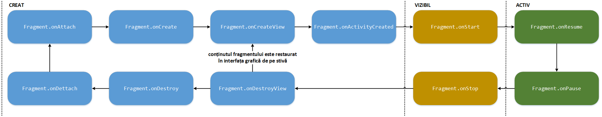

-   la creare sunt apelate metodele: `onAttach()`, `onCreate()`,
    `onCreateView()` și `onActivityCreated()`
-   în momentul în care devine vizibil, interacționând cu utilizatorul,
    sunt apelate `onStart()` și `onResume()`
-   în momentul în care nu mai este vizibil, nemaiinteracționând cu
    utilizatorul, sunt apelate `onPause()` și `onStop()`
-   la distrugere sunt apelate metodele `onDestroyView()`, `onDestroy()`
    și `onDetach()`

Unele dintre aceste metode sunt aceleași ca în cazul activităților,
având aceeași funcționalitate, în timp ce altele sunt specifice:

-   `onAttach(Activity)` - apelată în momentul în care fragmentul este
    atașat la activitate; de regulă, în această metodă se reține
    referința către activitate;
-   `onCreateView(LayoutInflator, ViewGroup, Bundle)` - apelată pentru a
    crea interfața grafică a fragmentului, fie prin încărcarea din
    fișierul XML corespunzător (folosind metoda `inflate()` din clasa
    `LayoutInflater`), fie prin construirea programatică; interfața
    grafică (obiect de tip `android.view.View`) trebuie întoarsă ca
    rezultat al acestei metode; pentru fragmentele care nu dețin o
    interfață grafică se întoarce `null`;
-   `onActivityCreated(Bundle)` - apelată în momentul în care s-a
    terminat metoda `onCreate()` a activității care conține fragmentul;
    în cadrul acestei metode este finalizat procesul de inițializare al
    fragmentului, fiind executate operații pentru care este necesar ca
    activitatea să fie creată;
-   `onDestroyView()` - apelată pentru a elibera resursele aferente
    controalelor din cadrul fragmentului, atunci când interfața grafică
    este descărcată;
-   `onDetach()` - apelată în momentul în care fragmentul este detașat
    de la activitate

\<note>Se observă faptul că restaurarea stării se poate face în oricare
din metodele `onCreate()`, `onCreateView()`, respectiv
`onActivityCreated()`.\

---

Se observă că ciclul de viață al unui fragment se desfășoară între
momentele în care acesta este atașat la activitatea din care face parte,
respectiv este detașat din cadrul acesteia, metodele corespunzătoare
fiind `onAttach()` și `onDetach()`.

Metoda `onAttach()` este apelată înainte de a se crea interfața grafică
a fragmentului, fragmentul însuși și chiar activitatea din care acesta
face parte. În cadrul său, de regulă se obține o referință către
activitate pentru a se realiza alte operații de inițializare.

Se consideră că un fragment există între metodele `onCreate()` și
`onDestroy()`.

În cadrul metodei `onCreate()` se recomandă să fie instanțiate orice
obiecte care vor fi utilizate în cadrul fragmentului. Tot aici sunt
realizate și alte operații de inițializare.

---
**Note**

Spre diferență de activități, interfața grafică a unui
fragment NU este încărcată în cadrul metodei `onCreate()`.\

---

În cazul unui fragment, interfața grafică este construită, respectiv
distrusă în cadrul metodelor `onCreateView()` și `onDestroyView()`.

În cadrul metodei `onCreateView()` se recomandă să se încarce interfața
grafică din fișierul XML asociat (respectiv să se creeze programatic),
obținându-se referințe către controalele grafice respective și
asociindu-li-se obiecte de tip ascultător pentru diferite tipuri de
evenimente din cadrul interacțiunii cu utilizatorul. Tot acum pot fi
pornite diferite servicii sau cronometre.

---
**Note**

Este obligatoriu ca metoda `onCreateView()` să întoarcă
un obiect de tip `android.view.View` reprezentând interfața grafică a
fragmentului respectiv.\

---

În cazul în care este necesar ca fragmentul să acceseze obiecte din
interfața grafică a activității din care face parte, astfel de operații
nu pot fi realizate decât după ce a fost apelată metoda
`onActivityCreated()`, semnificând faptul că procesul de inițializare al
acestuia a fost terminat. În caz contrar, este destul de probabil să se
genereze o excepție de tipul `NullPointerException`.

Stările unui fragment sunt strâns legate de cele ale activității din
care face parte. În plus, un fragment poate fi atașat sau detașat în mod
dinamic unei activități, astfel încât acesta poate parcurge stările de
creat, vizibil și activ de mai multe ori în timpul ciclului de viață al
containerului din care face parte.

Gestiunea tranzițiilor între diferitele stări din cadrul ciclului de
viață al unui fragment este foarte importantă pentru a se asigura o
experiență adecvată a utilizatorilor. Diferitele treceri între stările
de inactivitate și activitate ale fragmentului trebuie să se realizeze
în mod transparent pentru utilizatorii aplicației Android. De aceea,
este foarte important ca să se asigure persistența controalelor grafice
și a celorlalte date, salvându-se starea atunci când fragmentul este
întrerupt temporar și oprit, restaurarea fiind realizată atunci când
acesta este (re)pornit și reluat.

---
**Note**

Este posibil ca după întreruperea temporară a activității /
fragmentului să nu mai fie apelată nici o metodă, dacă necesarul de
memorie impune ca acestea să fie distruse.\

---

``` java
package ro.pub.cs.systems.eim.lab04;

import android.app.Activity;
import android.app.Fragment;
import android.os.Bundle;
import android.view.LayoutInflater;
import android.view.View;
import android.view.ViewGroup;

public class SomeFragment extends Fragment {

  @Override
  public void onAttach(Activity activity) {
    super.onAttach(activity);
    * ...
  }

  @Override
  public void onCreate(Bundle savedInstanceState) {
    super.onCreate(savedInstanceState);
    * ...
  }
  
  @Override
  public View onCreateView(LayoutInflater inflater, ViewGroup container, Bundle savedInstanceState) {
    return inflater.inflate(R.layout.some_fragment, container, false);
  }

  @Override
  public void onActivityCreated(Bundle savedInstanceState) {
    super.onActivityCreated(savedInstanceState);
    * ...
  }

  @Override
  public void onStart() {
    super.onStart();
    * ...
  }

  @Override
  public void onResume() {
    super.onResume();
    * ...
  }

  @Override
  public void onPause(){
    super.onPause();
    * ...
  }

  @Override
  public void onSaveInstanceState(Bundle savedInstanceState) {
    super.onSaveInstanceState(savedInstanceState);
    * ...
  }

  @Override
  public void onStop() {
    super.onStop();
    * ...
  }

  @Override
  public void onDestroyView() {
    super.onDestroyView();
    * ...
  }

  @Override
  public void onDestroy() {
    super.onDestroy();
    * ...
  }

  @Override
  public void onDetach() {
    super.onDetach();
    * ...
  }
}
```

### Gestiunea Fragmentelor din cadrul unei Activități

Fiecare activitate dispune de un proces de gestiune a fragmentelor
conține, acesta fiind o instanță a clasei `FragmentManager`, putând fi
obținut din cadrul contextului asociat și punând la dispoziția
utilizatorilor metode pentru adăugarea și scoaterea, respectiv
înlocuirea unui fragment din cadrul său.

``` java
FragmentManager fragmentManager = getFragmentManager();
```

#### Adăugarea unui Fragment

Operația de adăugare a unui fragment poate fi realizată:

1.  static, în cadrul fișierului XML, prin intermediul elementului
    `<fragment>`, în situația în care sunt definite interfețe grafice
    pentru fiecare dintre tipurile de suprafețe de afișare suportate;
    `<LinearLayout xmlns:android="http:*schemas.android.com/apk/res/android"
      xmlns:tools="http:*schemas.android.com/tools"
      android:layout_width="match_parent"
      android:layout_height="match_parent"
      android:paddingBottom="@dimen/activity_vertical_margin"
      android:paddingLeft="@dimen/activity_horizontal_margin"
      android:paddingRight="@dimen/activity_horizontal_margin"
      android:paddingTop="@dimen/activity_vertical_margin"
      android:orientation="vertical"
      tools:context=".MainActivity" >
      <fragment
        android:name="ro.pub.cs.systems.eim.labo04.Fragment1"
        android:id="@+id/fragment1"
        android:layout_weight="1"
        android:layout_width="match_parent"
        android:layout_height="wrap_content" />
      <fragment
        android:name="ro.pub.cs.systems.eim.labo04.Fragment2"
        android:id="@+id/fragment2"
        android:layout_weight="1"
        android:layout_width="match_parent"
        android:layout_height="wrap_content" />
    </LinearLayout>
    `
2.  dinamic (programatic), în cadrul codului sursă, prin definirea unor
    containere (obiecte de tip `FrameLayout`, care pot conține un sigur
    element vizibil) în cadrul interfețele grafice în care pot fi
    plasate fragmentele la diferite momente de timp.
    `<LinearLayout xmlns:android="http:*schemas.android.com/apk/res/android"
      xmlns:tools="http:*schemas.android.com/tools"
      android:layout_width="match_parent"
      android:layout_height="match_parent"
      android:paddingBottom="@dimen/activity_vertical_margin"
      android:paddingLeft="@dimen/activity_horizontal_margin"
      android:paddingRight="@dimen/activity_horizontal_margin"
      android:paddingTop="@dimen/activity_vertical_margin"
      android:orientation="vertical"
      tools:context=".MainActivity" >
      <FrameLayout
        android:id="@+id/frame1"
        android:layout_weight="1"
        android:layout_width="match_parent"
        android:layout_height="wrap_content" />
      <FrameLayout
        android:id="@+id/frame2"
        android:layout_weight="1"
        android:layout_width="match_parent"
        android:layout_height="wrap_content" />
    </LinearLayout>
    ` În metoda `onCreate()` corespunzătoare activității, se creează un
    obiect de tip `FragmentManager` pentru care se definesc operațiile
    care trebuie realizate (atomic) în cadrul unei tranzacții (obiectul
    de tip `FragmentTransaction` fiind obținut prin invocarea metodei
    `beginTransaction()`). O tranzacție poate specifica suplimentar
    animațiile asociate unei tranziții prcum și dacă se dorește ca
    tranzacție să fie stocată și pe stivă. Realizarea propriu-zisă a
    operațiilor indicate se realizează doar atunci când se apelează
    metoda `commit()`.  
    Pentru adăugarea unui fragment în cadrul unei activități, trebuie să
    se precizeze, ca parametrii ai metodei `add()` din clasa
    `FragmentTransaction` identificatorul containerului în care va fi
    plasat fragmentul, obiectul de tip fragment și (opțional) o etichetă
    (de tip șir de caractere) prin intermediul căreia acesta poate fi
    ulterior referit.`@Override
    protected void onCreate(Bundle savedInstanceState) {
      FragmentManager fragmentManager = getFragmentManager();
      FragmentTransaction fragmentTransaction = fragmentManager.beginTransaction();
      fragmentTransaction.add(R.id.frame1, new Fragment1());
      fragmentTransaction.add(R.id.frame2, new Fragment2(), Constants.FRAGMENT2_TAG);
      fragmentTransaction.commit();
    }
    ` De remarcat faptul că referințele `R.id.frame1` și `R.id.frame2`
    se referă la conținutul activității.

Pentru a asigura o experiență a utilizatorului consistentă, sistemul de
operare Android asigură în mod automat persistența mecanismului de
dispunere a fragmentelor și stiva asociată atunci când activitatea
părinte este distrusă și (re)creată din cauza unei modificări a
configurației. Din acest motiv, se recomandă ca toate interfețele
grafice corespunzătoare diferitelor configurații să conțină toate
containerele implicate în tranzacții de fragmente. Altfel, atunci când
se va încerca restaurarea unor fragmente (în containere care nu exista
în configurația respectivă), se pot produce anumite excepții. Dacă nu se
dorește ca un container să fie afișat în cadrul unei interfețe grafice
aferente unei configurații, se poate folosi atributul `visibility`.

\<columns 100% 50%>

``` xml
<LinearLayout ... >
  <FrameLayout
    android:id=@+id/frame1
    ... />
  <FrameLayout
    android:id=@+id/frame2
    android:visibility="gone"
    ... />
</LinearLayout>
```

\<newcolumn>

``` java
FrameLayout frame1 = (FrameLayout)findViewById(R.id.frame1);
FrameLayout frame2 = (FrameLayout)findViewById(R.id.frame2);
frame2.setVisibility(Visibility.GONE);
```

\</columns>

#### Scoaterea unui Fragment

Pentru scoaterea unui fragment din cadrul unei activități, trebuie ca
anterior să se obțină o referință către acesta, pe baza
identificatorului (metoda `findFragmentById()`), respectiv pe baza
etichetei (metoda `findFragmentByTag()`). Ulterior, se apelează metoda
`remove()` din clasa `FragmentTransaction` care primește ca parametru
această referință.

``` java
FragmentManager fragmentManager = getFragmentManager();
FragmentTransaction fragmentTransaction = fragmentManager.beginTransaction();
Fragment fragment1 = fragmentManager.findFragmentById(R.id.fragment1);
Fragment fragment2 = fragmentManager.findFragmentByTag(Constants.FRAGMENT2_TAG);
fragmentTransaction.remove(fragment1);
fragmentTransaction.remove(fragment2);
fragmentTransaction.commit();
```

Metoda `findViewById()` poate primi ca parametru și identificatorul
containerului care conține fragmentul. În cazul în care aceasta nu are
nici un conținut, rezultatul metodei este `null`.

#### Înlocuirea unui Fragment

Pentru înlocuirea unui fragment din cadrul unei activități, trebuie să
se precizeze, ca parametrii ai metodei `replace()` din clasa
`FragmentTransaction` identificatorul containerului în care va fi plasat
fragmentul, obiectul de tip fragment și (opțional) o etichetă (de tip
șir de caractere) prin intermediul căreia acesta poate fi ulterior
referit.

``` java
FragmentManager fragmentManager = getFragmentManager();
FragmentTransaction fragmentTransaction = fragmentManager.beginTransaction();
Fragment fragment2 = new Fragment2();
fragmentTransaction.replace(R.id.frame1, fragment2, Constants.FRAGMENT2_TAG);
fragmentTransaction.commit();
```

#### Utilizarea Stivei de Fragmente

Prin intermediul fragmentelor, se oferă posibilitatea de a se crea
interfețe grafice asociate activităților în mod dinamic. Unele
modificări între diferite stări pot fi considerate de utilizatori ca
fiind ecrane noi, comportamentul așteptat fiind acela de restaurare a
acestora atunci când se accesează butonul *Back*. Un astfel de
comportament presupune realizarea unei tranzacții de fragmente în sens
invers. Această funcționalitate poate fi obținută prin utilizarea unei
stive de fragmente, în care o tranzacție poate fi identificată prin
intermediul unei etichete.

În acest sens, va trebui apelată explicit metoda `addToBackStack()`
pentru obiectul de tip `FragmentTransaction` care se ocupă de atașarea
și detașarea fragmentelor de la activitate, înainte de a se apela metoda
`commit()`.

``` java
FragmentManager fragmentManager = getFragmentManager();
FragmentTransaction fragmentTransaction = fragmentManager.beginTransaction();
fragmentTransaction.add(R.id.frame1, new Fragment1(), Constants.FRAGMENT1_TAG);
Fragment fragment2 = fragmentManager.findFragmentByTag(Constants.FRAGMENT2_TAG);
fragmentTransaction.remove(fragment2);
fragmentTransaction.addToBackStack(null);
fragmentTransaction.commit();
```

Astfel, atunci când se apelează metoda `commit()`, fragmentul 2 este
oprit și salvat pe stiva de fragmente (în loc să fie distrus). Când
utilizatorul accesează butonul *Back* fragmentul 1 este distrus și
fragmentul 2 este restaurat de pe stivă și (re)pornit.

#### Folosirea de Animații la Tranziția dintre Fragmente

Tranzițiile între diferitele stări ale activității care implică operații
cu fragmente pot fi realizate:

1.  folosind metoda `setTransition()` a unui obiect de tip
    `FragmentTransaction`, utilizând oricare dintre variantele
    predefinite, de tipul `FragmentTransaction.TRANSIT_FRAGMENT_...`
    `fragmentTransaction.setTransition(FragmentTransaction.TRANSIT_FRAGMENT_...);
    `
2.  folosind metoda `setCustomAnimation()` a unui obiect de tip
    `FragmentTransaction`, pentru utilizarea de animații definite de
    utilizator; metoda primește două argumente, indicând referințele
    către fișiere XML care descriu animațiile folosite pentru
    fragmentele care sunt adăugate, respectiv pentru fragmentele care
    sunt scoase
    `fragmentTransaction.setCustomAnimations(R.animator.fade_in, R.animator.fade_out);
    `

### Interacțiunea dintre fragmente

Elementele grafice dintr-un fragment al unei activități pot fi accesate
și din alt fragment al activității, prin obținerea unei referințe către
activitatea părinte (folosind metoda `getActivity()`) și accesarea
controlului respectiv prin intermediul identificatorului său din cadrul
fragmentului (folosind metoda `findViewById()`).

O astfel de abordare (folosind obiectul de tip `Activity` ca intermediar
al comunicației) este recomandată pentru a asigura cuplarea slabă și
autonomia fragmentelor. Altfel, este permisă comunicația directă prin
intermediul obiectului de tip `FragmentManager` asociat activității.

În cazul evenimentelor produse la nivelul unui fragment, decizia cu
privire la impactul pe care acesta îl are asupra interfeței grafice
trebuie să aparțină activității. Astfel, fragmentul va invoca o metodă
de callback la nivelul activității care va determina modul în care va fi
tratat evenimentul.

``` java
public interface OnEventProducedListener {
  public void onEventProduced(Event event);
};
```

``` java
public class SomeFragment extends Fragment {

  OnEventProducedListener onEventProducedListener;

  @Override
  public void onAttach(Activity activity) {
    super.onAttach(activity);
    try {
      onEventProducedListener = (OnEventProducedListener)activity;
    } catch (ClassCastException classCastException) {
      Log.e(Constants.TAG, "Parent activity does not implement OnEventProducedListener!");
    }
  }
  
  private void onEventProduced(Event event) {
    onEventProducedListener.onEventProduced(event);
  }
}
```

``` java
public class SomeActivity extends Activity implements OnEventProducedListener {
  @Override
  protected void onCreate(Bundle savedStateInstance) {
    super.onCreate(savedInstanceState);
    FragmentManager framentManager = new FragmentManager();
    FragmentTransaction fragmentTransaction = fragmentManager.beginTransaction();
    fragmentTransaction.add(R.id.frame, new SomeFragment(), Constants.SOME_FRAGMENT_TAG);
    fragmentTransaction.commit();
    * ...
  }
  
  @Override
  public void onEventProduced(Event event) {
    * ...
  }
}
```

\</hidden>

\</spoiler>

## Activitate de Laborator

Se dorește implementarea unei aplicații Android, conținând o activitate
care să ofere utilizatorilor funcționalitatea necesară pentru a stoca un
număr de telefon în agenda de contacte, specificând pentru acesta mai
multe informații.

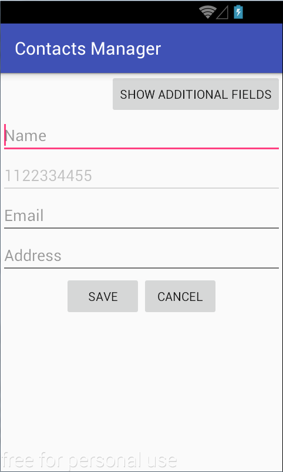

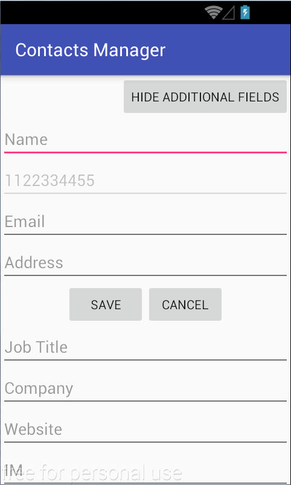

**1.** În contul Github personal, să se creeze un depozit denumit
'Laborator04'. Acesta trebuie să conțină unui fișier `README.md`, un
fișier `.gitignore` specific unei aplicații Android și un fișier
`LICENSE` care să descrie condițiile pentru utilizarea aplicației.

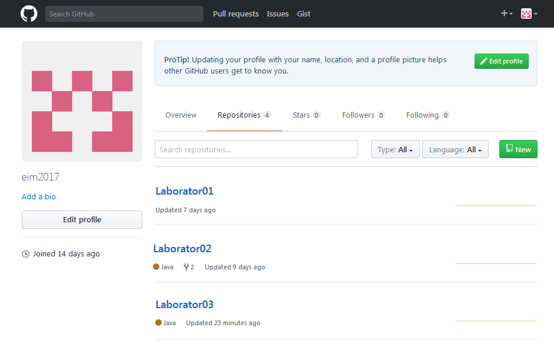


**2.** Să se cloneze într-un director de pe discul local conținutul
depozitului la distanță astfel creat. În urma acestei operații,
directorul Laborator04 va trebui să se conțină fișierele `README.md`,
`.gitignore` care indică tipurile de fișiere (extensiile) ignorate și
`LICENSE`.
`student@eim-lab:~$ git clone https:*www.github.com/perfectstudent/Laborator04.git
`

**3.** În directorul Laborator04 de pe discul local, să se creeze un
proiect Android Studio denumit *ContactsManager* (se selectează *Start a
new Android Studio project*).

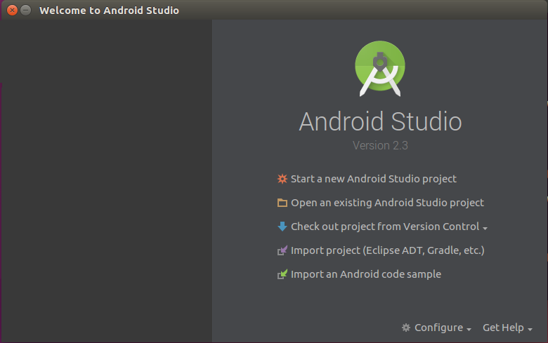

Se indică detaliile proiectului:

-   **Application name** - *Contacts Manager*
-   **Company domain** - *lab04.eim.systems.cs.pub.ro* (se va genera în
    mod automat **Package name** cu valoarea
    *ro.pub.cs.systems.eim.lab04.contactsmanager*)
-   **Project location** - locația directorului de pe discul local unde
    a fost descărcat depozitul la distanță *Laborator04*

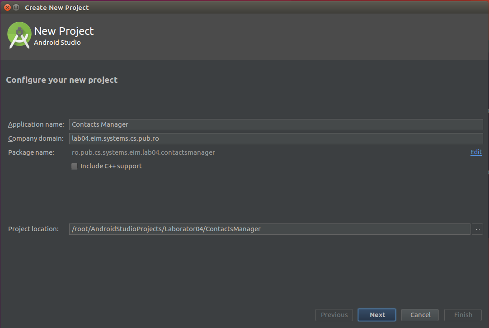

Se indică platforma pentru care se dezvoltă aplicația Android (se
bifează doar *Phone and Tablet*), iar SDK-ul Android (minim) pentru care
se garantează funcționarea este API 24 (Nougat).

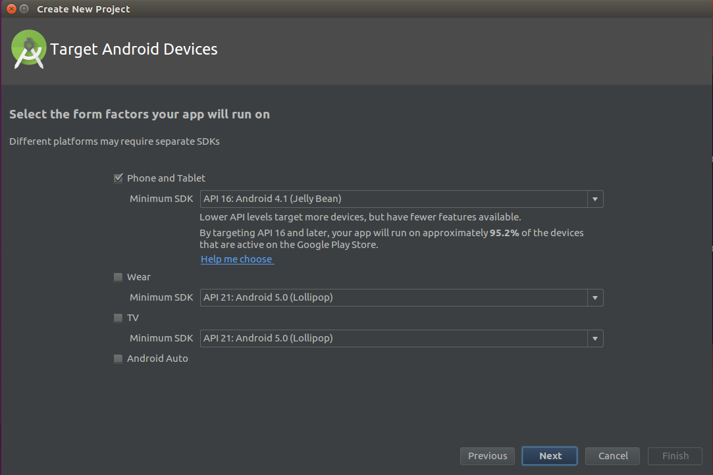

Se creează o activitate care inițial nu va conține nimic (*Empty
Activity*):

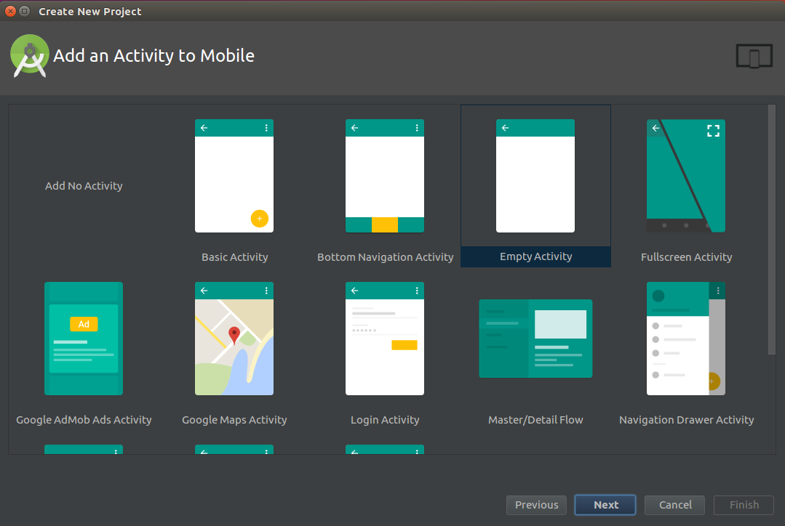

pentru care se precizează:

-   **Activity Name** (denumirea activității) -
    `ContactsManagerActivity`;
-   **Layout Name** (denumirea fișierului XML din `res/layout` în care
    va fi construită interfața grafică) -
    `activity_contacts_manager.xml`.

De asemenea:

-   se bifează opțiunea de a se genera în mod automat fișierul XML care
    conține descrierea interfeței grafice (*Generate Layout File*);
-   folosirea claselor din bibliotecile de suport care asigură
    posibilitatea de folosire a unor funcționalități din SDK-uri mai
    recente pe dispozitive mobile cu nivele de API mai vechi (*Backwards
    Compatibility (AppCompat)*).

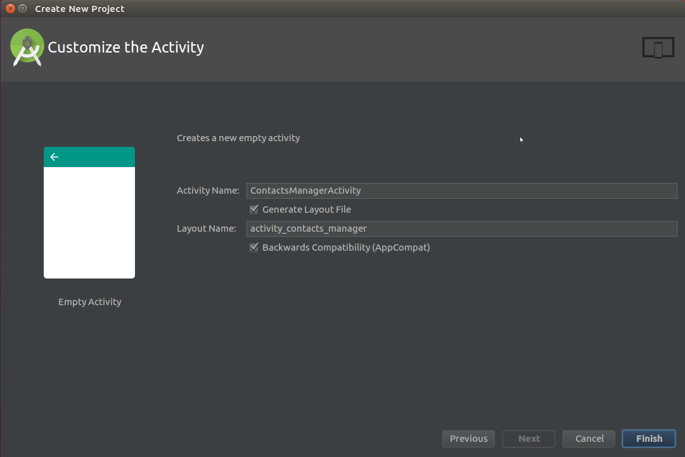

**4.** În fișierul `activity_contacts_manager` din directorul
`res/layout` să se construiască interfața grafică folosind:

-   editorul vizual (*Graphical Layout*)
-   editorul XML (*Text*)

Acesta va fi format din două containere după cum urmează:

-   primul conține mai multe elemente dispuse vertical și ocupând pe
    lățime întregul spațiu avut la dispoziție:
    -   un buton (`Button`) având mesajul *Show Additional Fields* în
        cazul în care celălalt container nu este afișat, respectiv
        mesajul *Hide Additional Fields* în cazul în care celălalt
        container este afișat, determinând atașarea / detașarea acestuia
        la activitate;
    -   patru controale de tip câmpuri text (`EditText`) prin care se
        introduc:
        -   numele;
        -   numărul de telefon - acest câmp este dezactivat (are
            proprietatea `android:enabled="false"`), urmând ca valoarea
            sa să fie preluată din câmpul `extra` al unei intenții;
        -   adresa electronică;
        -   adresa poștală.
-   cel de-al doilea container (care nu este vizibil inițial) conține
    patru controale de tip câmpuri text dispuse vertical și ocupând pe
    lățime întregul spațiu avut la dispoziție, prin care se introduc:
    -   poziția ocupată;
    -   denumirea companiei;
    -   site-ul web;
    -   identificatorul pentru mesagerie instantanee.

Fiecare container poate fi inclus într-un mecanism de dispunere a
conținutului de tip `LinearLayout` cu dispunere verticală. Acestea vor
fi incluse într-un container de tip `ScrollView`, pentru a preîntâmpina
situația în care interfața grafică nu poate fi afișată pe ecranul
dispozitivului mobil.

Să se implementeaze interacțiunea cu utilizatorul a aplicației.

-   în metoda `onCreate()` a activității se obțin referințe către
    butoanele *Show Additional Details* / *Hide Additional Details*,
    respectiv *Save* și *Cancel* prin intermediul metodei
    `findViewById(R.id....)`;
-   se implementează o clasă ascultător pentru butoane, care
    implementează `View.OnClickListener` și implementează metoda
    `onClick(View v)`; în funcție de id-ul butonului care este transmis
    argument metodei, sunt realizate următoarele acțiuni:
    -   butonul *Show Additional Details* / *Hide Additional Details* -
        afișează / ascunde al doilea container în funcție de starea
        curentă , modificând corespunzător textul afișat pe buton.
        (Hint: atributul `visibility` al containerului, resepctiv metoda
        `setVisibility()` a clasei Java împreună cu constantele
        `View.VISIBLE`, `View.GONE`).
    -   butonul *Save* - lansează în execuție aplicația Android nativă
        pentru stocarea unui contact în agenda telefonică, după ce în
        prealabil au fost preluate informațiile din controalele grafice:
        `Intent intent = new Intent(ContactsContract.Intents.Insert.ACTION);
        intent.setType(ContactsContract.RawContacts.CONTENT_TYPE);
        if (name != null) {
          intent.putExtra(ContactsContract.Intents.Insert.NAME, name);
        }
        if (phone != null) {
          intent.putExtra(ContactsContract.Intents.Insert.PHONE, phone);
        }
        if (email != null) {
          intent.putExtra(ContactsContract.Intents.Insert.EMAIL, email);
        }
        if (address != null) {
          intent.putExtra(ContactsContract.Intents.Insert.POSTAL, address);
        }
        if (jobTitle != null) {
          intent.putExtra(ContactsContract.Intents.Insert.JOB_TITLE, jobTitle);
        }
        if (company != null) {
          intent.putExtra(ContactsContract.Intents.Insert.COMPANY, company);
        }
        ArrayList<ContentValues> contactData = new ArrayList<ContentValues>();
        if (website != null) {
          ContentValues websiteRow = new ContentValues();
          websiteRow.put(ContactsContract.Data.MIMETYPE, ContactsContract.CommonDataKinds.Website.CONTENT_ITEM_TYPE);
          websiteRow.put(ContactsContract.CommonDataKinds.Website.URL, website);
          contactData.add(websiteRow);
        }
        if (im != null) {
          ContentValues imRow = new ContentValues();
          imRow.put(ContactsContract.Data.MIMETYPE, ContactsContract.CommonDataKinds.Im.CONTENT_ITEM_TYPE);
          imRow.put(ContactsContract.CommonDataKinds.Im.DATA, im);
          contactData.add(imRow);
        }
        intent.putParcelableArrayListExtra(ContactsContract.Intents.Insert.DATA, contactData);
        startActivity(intent);
        ` Intenția pentru realizarea acestei operații are asociată
        acțiunea `ContactsContract.Intents.Insert.ACTION` și tipul
        `ContactsContract.RawContacts.CONTENT_TYPE`. Informațiile care
        se doresc a fi completate sunt atașate în câmpul `extra` al
        acesteia, având cheile:  
        ✔ `ContactsContract.Intents.Insert.NAME`;  
        ✔ `ContactsContract.Intents.Insert.PHONE`;  
        ✔ `ContactsContract.Intents.Insert.EMAIL`;  
        ✔ `ContactsContract.Intents.Insert.POSTAL`;  
        ✔ `ContactsContract.Intents.Insert.JOB_TITLE`;  
        ✔ `ContactsContract.Intents.Insert.COMPANY`;  
        Pentru site-ul web și identificatorul de mesagerie instantanee,
        se folosește un tablou de elemente `ContentValues` în care se
        specifică înregistrări de tipul `CommonDataKinds.Website.URL`,
        respectiv `CommonDataKinds.Im.DATA`;  
        Pentru a putea gestiona agenda telefonică, este necesar ca în
        fișierul `AndroidManifest.xml` să fie specificate următoarele
        permisiuni: `<uses-permission
          android:name="android.permission.READ_CONTACTS" />
        <uses-permission
          android:name="android.permission.WRITE_CONTACTS" />
        `
    -   butonul *Cancel* - termină aplicația Android: `finish();
        `
-   se înregistrează o instanță a clasei ascultător ca mecanism de
    tratare a evenimentelor de tip accesare a butoanelor din cadrul
    interfeței grafice, prin apelul metodei `setOnClickListener()`.

**5.** Să se modifice aplicația Android [Phone
Dialer](https:*github.com/eim-lab/Laborator03.git) astfel încât să
conțină un buton suplimentar prin care este invocată aplicația *Contacts
Manager* căreia îi transmite numărul de telefon format și așteptând un
rezultat cu privire la stocarea contactului în agenda telefonică.

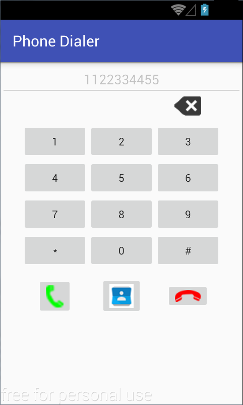

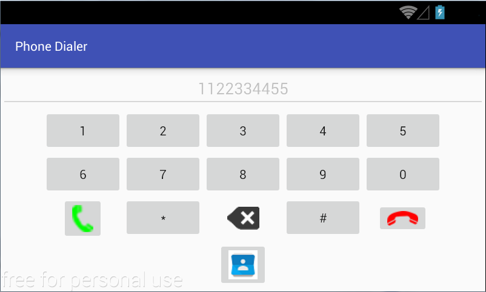

Ca imagine pentru butonul care invocă aplicația *Contacts Manager* se
poate folosi [această
resursă](http:*ocw.cs.pub.ro/courses/_media/eim/laboratoare/laborator04/contacts.png).

Metoda de tratare a evenimentului de tip accesare a butonului de stocare
a numărului de telefon în agenda telefonică invocă o intenție asociată
aplicației *Contacts Manager*, transmițând și numărul de telefon în
câmpul `extra` asociat acesteia, identificabil prin intermediul unei
chei. `String phoneNumber = phoneNumberEditText.getText().toString();
if (phoneNumber.length() > 0) {
  Intent intent = new Intent("ro.pub.cs.systems.eim.lab04.contactsmanager.intent.action.ContactsManagerActivity");
  intent.putExtra("ro.pub.cs.systems.eim.lab04.contactsmanager.PHONE_NUMBER_KEY", phoneNumber);
  startActivityForResult(intent, Constants.CONTACTS_MANAGER_REQUEST_CODE);
} else {
  Toast.makeText(getApplication(), getResources().getString(R.string.phone_error), Toast.LENGTH_LONG).show();
}
`

Definiți în prealabil constanta `CONTACTS_MANAGER_REQUEST_CODE` și
valoarea string `phone_error` în fișierele corespunzătoare din folderul
de resurse statice *res*.

**6.** Să se modifice aplicația Android *Contacts Manager* astfel încât
să poată fi lansată în execuție doar din contextul altei activități,
prin intermediul unei intenții care conține în câmpul `extra` un număr
de telefon, identificabil prin cheia
`ro.pub.cs.systems.eim.lab04.contactsmanager.PHONE_NUMBER_KEY`, acesta
fiind plasat în câmpul text needitabil corespunzător. Totodată, va
transmite înapoi rezultatul operației de stocare (`Activity.RESULT_OK`
sau `Activity.RESULT_CANCELED`).

-   în fișierul `AndroidManifest.xml` se modifică filtrul de intenții
    (acțiunea și categoria), astfel încât activitatea să poată fi rulată
    doar prin intermediul unei intenții `<manifest ...>
      <application ...>
        <activity
          android:name=".graphicuserinterface.ContactsManagerActivity"
          android:label="@string/app_name" >
          <intent-filter>
            <action android:name="ro.pub.cs.systems.eim.lab04.contactsmanager.intent.action.ContactsManagerActivity" />
            <category android:name="android.intent.category.DEFAULT" />
          </intent-filter>
        </activity>
      </application>
    </manifest>
    `
-   în metoda `onCreate()` a activității aplicației `ContactsManager`
    este verificată intenția cu care este pornită, și în cazul în care
    aceasta nu este nulă, este preluată informația din secțiunea
    `extra`, identificată prin cheia
    `ro.pub.cs.systems.eim.lab04.contactsmanager.PHONE_NUMBER_KEY`,
    conținutul său fiind plasat în cadrul câmpului text corespunzător:
    `Intent intent = getIntent();
    if (intent != null) {
      String phone = intent.getStringExtra("ro.pub.cs.systems.eim.lab04.contactsmanager.PHONE_NUMBER_KEY");
      if (phone != null) {
        phoneEditText.setText(phone);
      } else {
        Toast.makeText(this, getResources().getString(R.string.phone_error), Toast.LENGTH_LONG).show();
      }
    } 
    `
-   pe metodele de tratare a evenimentelor de accesare a butoanelor:
    -   *Save* - este lansată în execuție aplicația nativă pentru
        gestiunea agendei telefonice, folosind un cod de cerere prin
        intermediul căruia se va verifica rezultatul furnizat:
        `startActivityForResult(intent, Constants.CONTACTS_MANAGER_REQUEST_CODE);
        `
    -   *Cancel* - se transmite înapoi rezultatul
        `setResult(Activity.RESULT_CANCELED, new Intent());
        `

<!-- -->

-   în metoda `onActivityResult()` asociată activității aplicației
    *ContactsManager*, în momentul în care s-a părăsit aplicația nativă
    pentru gestiunea agendei telefonice, se verifică codul de cerere și
    se transmite înapoi un rezultat:
    `public void onActivityResult(int requestCode, int resultCode, Intent intent) {
    switch(requestCode) {
      case Constants.CONTACTS_MANAGER_REQUEST_CODE:
        setResult(resultCode, new Intent());
        finish();
        break;
      }
    }
    `

Datorită faptului că aplicația Android *Contacts Manager* nu dispune de
o activitate principală (implicită), aceasta nu va mai putea fi lansată
în execuție folosind mediul integrat de dezvoltare Android Studio.
Pentru ca aceasta să fie doar instalată pe dispozitivul mobil, se
accesează meniul *Run* → *Edit Configurations...*, iar în secțiunea
*Launch Options* de pe panoul *General*, se selectează opțiunea
*Launch*: *Nothing*.


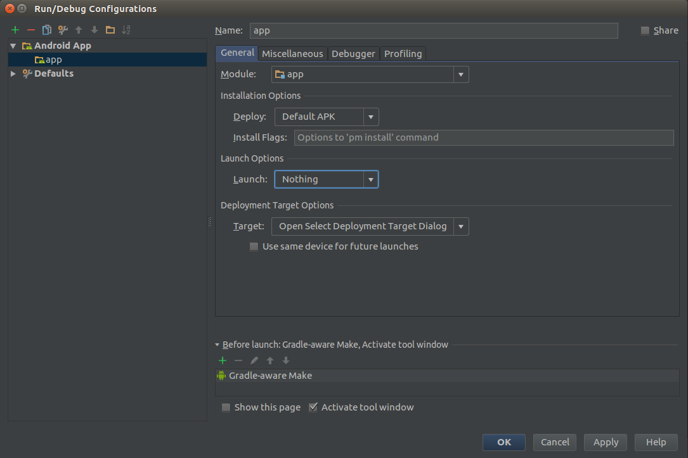

-   Să se verifice în emulator/telefon faptul că ContactsManager nu este
    o aplicație care poate fi lansată din launcher. Dacă aveți
    utilitarul MyAndroidTools, acesta va lista aplicația cu Activitatea
    definită.
-   Să se verifice în emulator/telefon pachetele instalate

``` shell
student@eg106:~$ adb shell 
vbox86p:/ # pm list packages -f
```

**7.** Să se încarce modificările realizate în cadrul depozitului
'Laborator04' de pe contul Github personal, folosind un mesaj sugestiv.
`student@eim-lab:~/Laborator04$ git add *
student@eim-lab:~/Laborator04$ git commit -m "implemented taks for laboratory 04"
student@eim-lab:~/Laborator04$ git push origin master
`

## Resurse Utile

[Intents and Intent
Filters(android.com)](https:*developer.android.com/guide/components/intents-filters.html)  
[Joseph ANNUZZI, Jr, Lauren DARCEY, Shane CONDER, Introduction to
Android Application Development - Developer's Library, 4th Edition,
Addison-Wesley,
2013](http:*ptgmedia.pearsoncmg.com/images/9780321940261/samplepages/0321940261.pdf) -
capitolul 4, subcapitolele *Organizing Activity Components with
Fragments*, *Managing Activity Transition with Intents*, *Working with
Services*, *Receiving and Broadcasting Intents*  
[Bill PHILLIPS, Brian HARDY, Android Programming. The Big Nerd Ranch
Guide, Pearson Technology Group,
2013](http:*www.bignerdranch.com/we-write/android-programming/) -
capitolele 5, 7, 10, 21, 23, 29, 30  
[Reto MEIER, Professional Android for Application Development, John
Wiley & Sons,
2012](http:*www.amazon.com/Professional-Android-4-Application-Development/dp/1118102274) -
capitolul 4 (*Introducing Fragments*), 5 (*Introducing Intents*)  
[Ronan SCHWARZ, Phil DUTSON, James STEELE, Nelson TO, Android
Developer's Cookbook, Building Applications with the Android SDK, 2nd
Edition, Addison Wesley,
2013](http:*books.google.ro/books/about/The_Android_Developer_s_Cookbook.html?id=Y4JR2yI2Fo0C&redir_esc=y) -
capitolele 2, 7  
[Wei Meng LEE, Beginning Android 4 Application Development, Wiley,
2012](http:*eu.wiley.com/WileyCDA/WileyTitle/productCd-1118199545.html)  
[Satya KOMATINENI, Dave MACLEAN, Pro Android 4, Apress,
2012](http:*www.apress.com/9781430239307)  
[Dezvoltarea aplicațiilor pentru
Android](http:*android.rosedu.org/wiki/)  
[Android Programming Tutorials - Core
Servlets](http:*www.coreservlets.com/android-tutorial) - secțiunile
Intents - part I, II & III  
[Android Intents -
Tutorial](http:*www.vogella.com/tutorials/AndroidIntent/article.html)

## Android Fundamentals

[Android
Intents](https:*docs.google.com/presentation/d/1kjxsI9brdVRIx3rqoB0H-1-PmVlzJbiQNf4PyqzZKJM/edit#slide=id.g116e4ee7f0_0_171)
[Explicit and Implicit
Intents](https:*docs.google.com/presentation/d/1DSl-LNN7Kp3gQ9ZadBe8clWNGhs_8xdcYQoxZbF5cRk/edit#slide=id.g116d7d9d49_3_13)
