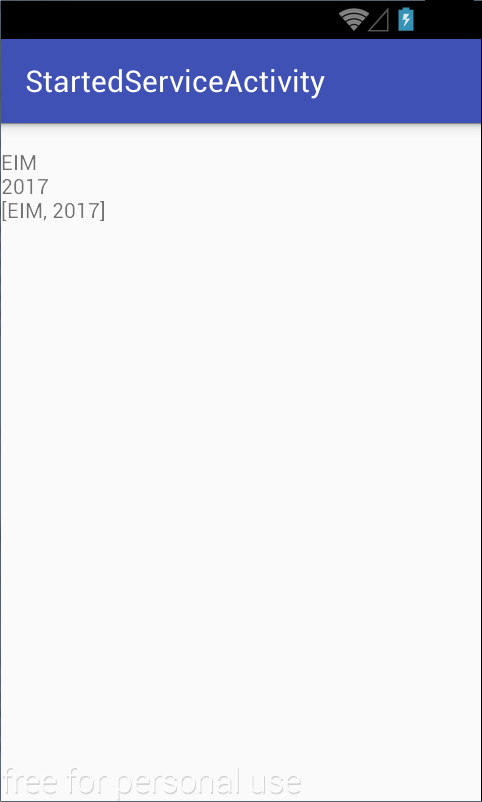

# Android Services

## Objectives
1. Learn the basics of how to perform background work in an Android app
2. Understand the concept of Service as an Android component
3. Use and differentiate between Started, Bound and Foreground services
4. Understand the services' lifecycle in relation with the app's and its activities' lifecycle

## Definition
[Services](https://developer.android.com/guide/components/services) are the application components that execute logic even in background, when the activities of the app are not visible. Services do not have an UI and run on the main thread of the hosting process.

## Types
1. [**Started Service**](https://developer.android.com/guide/components/services#CreatingAService)
- it will continue to live even if no other component is bound to it
- we just call [startService](https://developer.android.com/reference/android/content/Context.html#startService(android.content.Intent))

2. [**Bound Service**](https://developer.android.com/guide/components/bound-services)
- bounds a component to a service. Binding creates a connection between these components and they can use it for communication.
- a bound service that is not started will “die” when no component is bound to it
- calling [bindService](https://developer.android.com/reference/android/content/Context.html#bindService(android.content.Intent,%20android.content.ServiceConnection,%20int))binds it but does not start it. If the service doesn't exist this call will also create it.

3. [**Foreground Services**](https://developer.android.com/guide/components/services.html#Foreground)
- a service that is considered running in the foreground, with the user being aware of it.
- such a service is less likely to be killed by the system
- it requires a [notification](https://developer.android.com/guide/topics/ui/notifiers/notifications#foreground-service) to be permanently shown to the user.
- since API Level 26 (Android 8) services cannot be started in the background using the startService method, they need to be started as foreground services

Not only activities, but also services can bind to other services.

Services must be unbound in onDestroy or an earlier callback. If a stopped bound service still has ServiceConnection objects bound to it, the system will not destroy it until all of the bindings are removed.

## Running in background concerns:

Since Android 8 (Oreo, API level 26), the system provides more limitations regarding background work and also the phone vendors have become more aggressive regarding the resources the apps use, killing apps such as Spotify when they are running in background as part of their “battery optimizations”. It is important when designing the app to consider its resource consumption while in background.

A “trick” to run a service in background and be less likely to be killed is to start the service in foreground (startForeground). Because of the notification required for it, the app is considered in foreground. The downside is that the notification needs to stay in the notification bar and can have a negative impact on the user experience.

----

## Exercises

**1.** Să se cloneze în directorul de pe discul local conținutul
depozitului la [distanță](https://www.github.com/eim-lab/Laborator05).
 În urma acestei operații,
directorul Laborator05 va trebui să se conțină un director `labtasks` ce
va deține proiectele AndroidStudio, fișierul README.md și un fișier
.gitignore care indică tipurile de fișiere (extensiile) ignorate.

    student@eim:~$ git clone https://www.github.com/eim-lab/Laborator05.git

----

**2.** Să se încarce în mediul integrat de dezvoltare Android Studio
proiectele **StartedService** respectiv **StartedServiceActivity** din
directorul `labtasks/StartedService - Kotlin`.

-   Proiectul *StartedService* conține codul sursă pentru un serviciu de
    tip started care transmite mai multe valori, de diferite tipuri (șir
    de caractere, întreg, vector), temporizate la un anumit interval
    (dată de valoarea `SLEEP_TIME` din interfața `Constants`). Aceste
    valori sunt transmise prin intermediul unor broadcast intents, la nivelul întregului sistem de operare
    Android.
-   Proiectul *StartedServiceActivity* conține codul sursă pentru o
    aplicație Android care utilizează un BroadcastReceiver, pentru tipurile de mesaje
    propagate la nivelul sistemului de operare de către serviciu, pe
    care le afișează în interfața grafică, prin intermediul unui câmp
    text.



----

**3.** În proiectul *StartedService*, în clasa `StartedService` să se
completeze metoda `onStartCommand()` astfel încât aceasta să pornească
un fir de execuție în cadrul căruia să fie propagate 3 broadcast intents la nivelul sistemului de operare Android.

Pentru fiecare intenție, se vor specifica:

-   **acțiunea**, care va avea valorile definite în interfața
    `Constants` (`Constants.ACTION_STRING`, `Constants.ACTION_INTEGER`,
    `Constants.ACTION_ARRAY_LIST`); se va utiliza metoda
    [setAction()](http:developer.android.com/reference/android/content/Intent.html#setAction%28java.lang.String%29);
-   **informațiile transmise**, plasate în câmpul `extra` (având cheia
    `Constants.DATA` și valoarea dată de `Constants.STRING_DATA`,
    `Constants.INTEGER_DATA`, `Constants.ARRAY_LIST_DATA`); se va
    utiliza metoda
    [putExtra()](http:developer.android.com/reference/android/content/Intent.html#putExtra%28java.lang.String,%20android.os.Bundle%29)
    care primește ca argumente cheia și valoarea.

Transmiterea propriu-zisă a intenției se face prin intermediul metodei
[sendBroadcast()](http://developer.android.com/reference/android/content/Context.html#sendBroadcast%28android.content.Intent%29).

Cele trei mesaje vor fi temporizate la intervalul indicat de valoarea
`Constants.SLEEP_TIME` (propagarea mesajelor va fi intercalată de
apeluri
[Thread.sleep()](https://docs.oracle.com/javase/8/docs/api/java/lang/Thread.html#sleep-long-).

**a)** De ce este necesar ca serviciul să realizeze operațiile pe un fir
de execuție dedicat?

**b)** Ce alternativă s-ar fi putut folosi pentru a se evita o astfel de
abordare? Ce avantaj și ce dezavantaj prezintă această alternativă?

Se implementează o clasă derivată din
[Thread](https://docs.oracle.com/javase/8/docs/api/java/lang/Thread.html)
pentru care se va suprascrie metoda
[run()](https://docs.oracle.com/javase/8/docs/api/java/lang/Thread.html#run--).
Pe firul de execuție dedicat, se vor propaga intențiile cu difuzare la
nivelul sistemului de operare Android, după care acesta își va încheia
activitatea.

```Kotlin
package ro.pub.cs.systems.eim.lab05.startedservice.service

import android.content.Context
import android.content.Intent
import ro.pub.cs.systems.eim.lab05.startedservice.general.Constants

class ProcessingThread(private val context: Context) : Thread() {

    override fun run() {
        while (true) {
            sendMessage(Constants.MESSAGE_STRING)
            sleep()
            // ... continue with other cases or logic as needed
        }
    }

    private fun sleep() {
        try {
            Thread.sleep(Constants.SLEEP_TIME)
        } catch (interruptedException: InterruptedException) {
            interruptedException.printStackTrace()
        }
    }

    private fun sendMessage(messageType: Int) {
        val intent = Intent()
        when (messageType) {
            Constants.MESSAGE_STRING -> {
                intent.action = Constants.ACTION_STRING
                intent.putExtra(Constants.DATA, Constants.STRING_DATA)
                // ... continue with other cases as needed
            }
            // Add other message types here
        }
        context.sendBroadcast(intent)
    }
}
```


Monitorizați ciclurile din Thread.run() in logcat:

``` kotlin
Log.d(Constants.TAG, "Thread.run() was invoked, PID: ${android.os.Process.myPid()} TID: ${android.os.Process.myTid()}")

```

-----

**4.** În proiectul **StartedServiceActivity**, să se pornească serviciul,
printr-un apel al metodei
`startService()` sau `startForegroundService` dupa versiunea `Oreo`;
intenția care va fi transmisă ca argument metodei `startService()`
trebuie să refere **explicit** serviciul care urmează a fi pornit, din
motive de securitate (se folosește metoda
[setComponent()](http://developer.android.com/reference/android/content/Intent.html#setComponent%28android.content.ComponentName%29),
care indică atât pachetul corespunzător aplicației Android care conține
serviciul, cât și clasa corespunzătoare acestuia - calificată complet).


``` kotlin
val intent = Intent().apply {
    component = ComponentName("ro.pub.cs.systems.eim.lab05.startedservice", "ro.pub.cs.systems.eim.lab05.startedservice.service.StartedService")
}

if (Build.VERSION.SDK_INT >= Build.VERSION_CODES.O) {
    startForegroundService(intent)
} else {
    startService(intent)
}

```

In serviciu, vom face urmatoarea actualizare pentru ca serviciul sa anunte pornirea catre 
activitate:
``` kotlin
companion object {
    private const val TAG = "ForegroundService"
    private const val CHANNEL_ID = "11"
    private const val CHANNEL_NAME = "ForegroundServiceChannel"
}

private fun dummyNotification() {
    if (Build.VERSION.SDK_INT >= Build.VERSION_CODES.O) {
        val channel = NotificationChannel(CHANNEL_ID, CHANNEL_NAME, NotificationManager.IMPORTANCE_HIGH)
        val manager = getSystemService(Context.NOTIFICATION_SERVICE) as NotificationManager
        manager.createNotificationChannel(channel)

        val notification = Notification.Builder(applicationContext, CHANNEL_ID).build()
        startForeground(1, notification)
    } else {
        // For devices below Android Oreo, create and start the foreground service without setting a channel ID.
        val notification = Notification.Builder(applicationContext).build()
        startForeground(1, notification)
    }
}

override fun onStartCommand(intent: Intent?, flags: Int, startId: Int): Int {
    // ...
    // Added this line
    dummyNotification()
    // ...
    return super.onStartCommand(intent, flags, startId)
}

```

**a)** Să se ruleze aplicațiile. Se va rula aplicația *StartedService*
care instalează serviciul pe dispozitivul mobil. Ulterior se va rula
aplicația *StartedServiceActivity*. Verificați faptul că serviciul a
fost pornit și oprit corespunzător prin mesajele afișate în consolă.

----

**5.** În proiectul *StartedServiceActivity*, să se implementeze un
ascultător pentru intenții cu difuzare, în clasa
`StartedServiceBroadcastReceiver` din pachetul
`ro.pub.cs.systems.eim.lab05.startedserviceactivity.view`. Acesta
extinde clasa
[BroadcastReceiver](http://developer.android.com/reference/android/content/BroadcastReceiver.html)
și implementează metoda
[onReceive()](http://developer.android.com/reference/android/content/BroadcastReceiver.html#onReceive%28android.content.Context,%20android.content.Intent%29),
având ca argumente **contextul** din care a fost invocată și
**intenția** prin intermediul căreia a fost transmis mesajul respectiv.
Astfel, datele extrase din intenție (având cheia indicată de
`Constants.DATA`) vor fi afișate într-un câmp text (`messageTextView`)
din cadrul interfeței grafice.

`onReceive(Context, Intent)` din clasa
`StartedServiceBroadcastReceiver`, se verifică:

-   acțiunea corespunzătoare intenției, folosind metoda
    [getAction()](http://developer.android.com/reference/android/content/Intent.html#getAction%28%29);
-   informațiile transmise conținute în câmpul `extra`, folosind
    metodele corespunzătoare tipului de date identificat pe baza
    intenției
    ([getStringExtra()](http://developer.android.com/reference/android/content/Intent.html#getStringExtra%28java.lang.String%29),
    [getIntExtra()](http://developer.android.com/reference/android/content/Intent.html#getIntExtra%28java.lang.String,%20int%29),
    [getStringArrayListExtra()](http:*developer.android.com/reference/android/content/Intent.html#getStringArrayListExtra%28java.lang.String%29)).

Acestea vor fi afișate în cadrul câmpului text din cadrul interfeței
grafice (`messageTextView`), transmis ca argument la instanțierea
ascultătorului pentru intenții cu difuzare.

``` kotlin
package ro.pub.cs.systems.eim.lab05.startedserviceclient.view

import android.content.BroadcastReceiver
import android.content.Context
import android.content.Intent
import android.widget.TextView
import ro.pub.cs.systems.eim.lab05.startedserviceclient.general.Constants

class StartedServiceBroadcastReceiver(private val messageTextView: TextView?) : BroadcastReceiver() {

    override fun onReceive(context: Context, intent: Intent) {
        val action = intent.action
        var data: String? = null
        if (Constants.ACTION_STRING == action) {
            data = intent.getStringExtra(Constants.DATA)
        }
        // ... continue with other actions as needed

        messageTextView?.text = "${messageTextView?.text}\n$data"
    }
}

```


**6.** În proiectul *StartedServiceActivity*, în cadrul metodei
`onCreate()` a activității `StartedServiceActivity` (din pachetul
`ro.pub.cs.systems.eim.lab05.startedserviceactivity`), să se realizeze
următoarele operații:

**a)** să se creeze o instanță a ascultătorului pentru intenții cu
difuzare;


``` kotlin
startedServiceBroadcastReceiver = StartedServiceBroadcastReceiver(messageTextView)
```


**b)** să se creeze o instanță a unui obiect de tipul
[IntentFilter](http://developer.android.com/reference/android/content/IntentFilter.html),
la care să se adauge toate acțiunile corespunzătoare intențiilor cu
difuzare propagate de serviciu; se va folosi metoda
[addAction()](http://developer.android.com/reference/android/content/IntentFilter.html#addAction%28java.lang.String%29);


``` kotlin
startedServiceIntentFilter = IntentFilter().apply {
    addAction(Constants.ACTION_STRING)
}

* ...
```


**c)** să se atașeze, respectiv să se detașeze ascultătorul de intenții
cu difuzare, astfel încât acesta să proceseze mesajele primite de la
serviciu doar în situația în care activitatea este vizibilă pe suprafața
de afișare; în acest sens, vor fi utilizate metodele
[registerReceiver()](http://developer.android.com/reference/android/content/Context.html#registerReceiver%28android.content.BroadcastReceiver,%20android.content.IntentFilter%29),
respectiv
[unregisterReceiver()](http://developer.android.com/reference/android/content/Context.html#unregisterReceiver%28android.content.BroadcastReceiver%29),
apelate pe metodele de callback ale activității corespunzătoare stării
în care aceasta este vizibilă pe suprafața de afișare (`onResume()`,
respectiv `onPause()`).

Este necesar ca activarea
ascultătorului să se realizeze pe metoda de callback `onResume()`, iar
dezactivarea sa să fie realizată pe metoda de callback `onPause()`.

``` kotlin
override fun onResume() {
    super.onResume()
    registerReceiver(startedServiceBroadcastReceiver, startedServiceIntentFilter)
}

override fun onPause() {
    unregisterReceiver(startedServiceBroadcastReceiver)
    super.onPause()
}

```


**d)** Să se oprească serviciul printr-un apel al metodei
[stopService()](http://developer.android.com/reference/android/content/Context.html#stopService%28android.content.Intent%29).
Unde ar putea fi plasată aceasta? Care sunt avantajele și dezavantajele
unei astfel de abordări?

----

**7.** Rulați din nou aplicația, întrerupând temporar activitatea
(printr-o apăsare a tastei *Home*) în timp ce sunt procesate intențiile
cu difuzare transmise de serviciu. Ce observați la revenirea în
activitate?

Modificați modul de implementare al ascultătorului de intenții cu
difuzare astfel încât în momentul în care se primește un mesaj, să
repornească activitatea (dacă este cazul), asigurându-se astfel faptul
că nu se mai pierde nici o informație transmisă de serviciu dacă aceasta
nu este vizibilă pe suprafața de afișare.

Pentru ca ascultătorul de intenții cu difuzare să poată procesa mesaje chiar și în situația în care activitatea nu este vizibilă pe suprafața de afișare, el trebuie
declarat, împreună cu filtrul de intenții, în fișierul
`AndroidManifest.xml`:

``` xml
<?xml version="1.0" encoding="utf-8"?>
<manifest ...>
  <application ...>
    <receiver
      android:name=".view.StartedServiceBroadcastReceiver">
      <intent-filter>
        <action android:name="ro.pub.cs.systems.eim.lab05.startedservice.string" />
      </intent-filter>
      <!-- other intent filters for other activities -->
    </receiver>
  </application>
</manifest>
```

În acest scop, va trebui declarat și un constructor implicit care va fi
folosit pentru instanțierea filtrului de intenții. Astfel, nu se va mai
putea obține o referință către câmpul text în care să se realizeze
afișarea informațiilor obținute în urma procesării intenției cu
difuzare. Aceasta va fi realizată de către activitate, care va fi
invocată de ascultătorul de mesaje cu difuzare, în cadrul metodei
`onReceive()`, prin intermediul unei intenții (datele fiind plasate în
câmpul `extra`):

``` kotlin
override fun onReceive(context: Context, intent: Intent) {
    val action = intent.action
    var data: String? = null
    if (Constants.ACTION_STRING == action) {
        data = intent.getStringExtra(Constants.DATA)
    }

    val startedServiceActivityIntent = Intent(context, StartedServiceActivity::class.java).apply {
        putExtra(Constants.MESSAGE, data)
        addFlags(Intent.FLAG_ACTIVITY_NEW_TASK or Intent.FLAG_ACTIVITY_SINGLE_TOP)
    }
    context.startActivity(startedServiceActivityIntent)
}

```

De remarcat faptul că activitatea poate fi pornită din contextul
ascultătorului pentru mesaje cu difuzare, folosind următorii parametri:

-   [Intent.FLAG_ACTIVITY_NEW_TASK](https:*developer.android.com/reference/android/content/Intent.html#FLAG_ACTIVITY_NEW_TASK) -
    prin care activitatea este plasată într-un nou set de sarcini pe
    stivă, pe care utilizatorul le poate gestiona independent;
-   [Intent.FLAG_ACTIVITY_SINGLE_TOP](https:*developer.android.com/reference/android/content/Intent.html#FLAG_ACTIVITY_SINGLE_TOP) -
    prin care activitatea nu este repornită dacă se găsește deja la baza
    stivei care reține istoricul operațiunilor realizate de utilizator.

Astfel, activitatea va fi invocată prin intermediul intenției, în
condițiile în care aceasta este activă (se găsește în memorie, fiind
plasată pe stiva de activități, fără a fi vizibilă). De aceea, aceasta
va invoca metoda de callback
[onNewIntent()](http://developer.android.com/reference/android/app/Activity.html#onNewIntent%28android.content.Intent%29)
pe care trebuie realizată afișarea informațiilor transmise în câmpul
`extra` al intenției.

``` kotlin
override fun onNewIntent(intent: Intent?) {
    super.onNewIntent(intent)
    intent?.getStringExtra(Constants.MESSAGE)?.let { message ->
        messageTextView.text = "${messageTextView.text}\n$message"
    }
}

```

----

## Resurse
1. [Background work in Android](https://developer.android.com/develop/background-work/background-tasks#recommended-approaches)
2. [SMD](https://ocw.cs.pub.ro/courses/smd/laboratoare/03)
3. [Foreground Services Tutorial](https://youtu.be/YZL-_XJSClc?si=ySa6BxpHWTFrE-sO)
