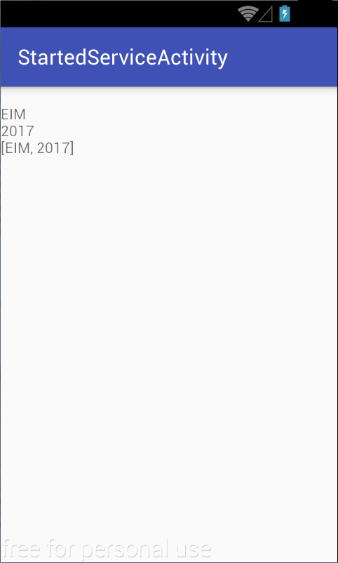

# Activitate de Laborator


**1.** Vom porni de la urmatorul [schelet](https://www.github.com/eim-lab/Laborator05).

**2.** Astazi vom lucra cu doua proiecte in paralel, 
proiectel **StartedService**, respectiv **StartedServiceActivity** din
directorul `labtasks/StartedService`.

-   Proiectul *StartedService* conține codul sursă pentru un serviciu de
    tip started care transmite mai multe valori, de diferite tipuri (șir
    de caractere, întreg, vector), temporizate la un anumit interval
    (dată de valoarea `SLEEP_TIME` din interfața `Constants`). Aceste
    valori sunt transmise prin intermediul unor broadcast intents,
    la nivelul întregului sistem de operare Android.

> **Aplicația StartedService nu are o activitate atașată. Astfel, aplicația pornită nu va avea o interfață grafică. Când o pornim, nu vom observa nimic pe partea de GUI.**

-   Proiectul *StartedServiceActivity* conține codul sursă pentru o
    aplicație Android care utilizează un ascultător pentru intenții cu
    difuzare (*eng.* BroadcastReceiver), pentru tipurile de mesaje
    propagate la nivelul sistemului de operare de către serviciu, pe
    care le afișează în interfața grafică, prin intermediul unui câmp
    text.




**3.** În proiectul *StartedService*, în clasa `StartedService` din
pachetul `ro.pub.cs.systems.eim.lab05.startedservice.service`, să se
completeze metoda `onStartCommand()` astfel încât aceasta să pornească
un thrad în cadrul căruia să fie trimise 3 broadcast intents la nivelul sistemului de operare Android.

- puteți testa recepția mesajelor de broadcast folosind comanda shell
``` shell
adb shell 'am broadcast -a "ro.pub.cs.systems.eim.lab05.startedservice.string" --es  "ro.pub.cs.systems.eim.lab05.startedservice.data" "******** hello world!"'
```

Pentru fiecare broadcast intent, se vor specifica:

-   **acțiunea**, care va avea valorile definite în interfața
    `Constants` (`Constants.ACTION_STRING`, `Constants.ACTION_INTEGER`,
    `Constants.ACTION_ARRAY_LIST`); se va utiliza metoda
    [setAction()](http:*developer.android.com/reference/android/content/Intent.html#setAction%28java.lang.String%29);
-   **informațiile transmise**, plasate în câmpul `extra` (având cheia
    `Constants.DATA` și valoarea dată de `Constants.STRING_DATA`,
    `Constants.INTEGER_DATA`, `Constants.ARRAY_LIST_DATA`); se va
    utiliza metoda
    [putExtra()](http:*developer.android.com/reference/android/content/Intent.html#putExtra%28java.lang.String,%20android.os.Bundle%29)
    care primește ca argumente cheia și valoarea.

Transmiterea propriu-zisă a intenției se face prin intermediul metodeih
[sendBroadcast()](https://developer.android.com/develop/background-work/background-tasks/broadcasts#sending-broadcasts).

```java
Intent intent = new Intent();
intent.setAction("com.example.broadcast.MY_NOTIFICATION");
intent.putExtra("data", "Nothing to see here, move along.");
sendBroadcast(intent);
```

Cele trei mesaje vor fi temporizate la intervalul indicat de valoarea
`Constants.SLEEP_TIME` (propagarea mesajelor va fi intercalată de
apeluri
[Thread.sleep()](https://docs.oracle.com/javase/8/docs/api/java/lang/Thread.html#sleep-long-).

**a)** De ce este necesar ca serviciul să realizeze operațiile pe un fir
de execuție dedicat?

**b)** Ce alternativă s-ar fi putut folosi pentru a se evita o astfel de
abordare? Ce avantaj și ce dezavantaj prezintă această alternativă?

Se implementează o clasă derivată din
[Thread](https://docs.oracle.com/javase/8/docs/api/java/lang/Thread.html)
pentru care se va suprascrie metoda
[run()](https://docs.oracle.com/javase/8/docs/api/java/lang/Thread.html#run--).
Pe firul de execuție dedicat, se vor propaga intențiile cu difuzare la
nivelul sistemului de operare Android, după care acesta își va încheia
activitatea.

``` java
package ro.pub.cs.systems.eim.lab05.startedservice.service;

import android.content.Context;
import android.content.Intent;

import ro.pub.cs.systems.eim.lab05.startedservice.general.Constants;

public class ProcessingThread extends Thread {

  private Context context;

  public ProcessingThread(Context context) {
    this.context = context;
  }

  @Override
  public void run() {
    while(true){ 
      sendMessage(Constants.MESSAGE_STRING);
      sleep();
      * ...
    }
  }

  private void sleep() {
    try {
      Thread.sleep(Constants.SLEEP_TIME);
    } catch (InterruptedException interruptedException) {
      interruptedException.printStackTrace();
    }
  }

  private void sendMessage(int messageType) {
    Intent intent = new Intent();
    switch(messageType) {
      case Constants.MESSAGE_STRING:
         intent.setAction(Constants.ACTION_STRING);
         intent.putExtra(Constants.DATA, Constants.STRING_DATA);
         break;
      * ...
    }
    context.sendBroadcast(intent);
  }
}
```

Monitorizați ciclurile din Thread.run() in logcat:

``` java
Log.d(Constants.TAG, "Thread.run() was invoked, PID: " + android.os.Process.myPid() + " TID: " + android.os.Process.myTid());
```

**4.** În proiectul **StartedServiceActivity**, să se pornească serviciul,
printr-un apel al metodei
`startService()` sau `startForegroundService` dupa versiunea `Oreo`;
intenția care va fi transmisă ca argument metodei `startService()`
trebuie să refere **explicit** serviciul care urmează a fi pornit, din
motive de securitate (se folosește metoda
[setComponent()](http://developer.android.com/reference/android/content/Intent.html#setComponent%28android.content.ComponentName%29),
care indică atât pachetul corespunzător aplicației Android care conține
serviciul, cât și clasa corespunzătoare acestuia - calificată complet).


``` java
Intent intent = new Intent();
intent.setComponent(new ComponentName("ro.pub.cs.systems.eim.lab05.startedservice", "ro.pub.cs.systems.eim.lab05.startedservice.service.StartedService"));
// De la oreo in sus se foloseste startForegroundService
if (Build.VERSION.SDK_INT >= Build.VERSION_CODES.O) {
    startForegroundService(intent);
}
else {
    startService(intent);
}

```

In serviciu, vom face urmatoarea actualizare pentru ca serviciul sa anunte pornirea catre 
activitate:
```java
  private static final String TAG = "ForegroundService";
  private static final String CHANNEL_ID = "11";
  private static final String CHANNEL_NAME = "ForegroundServiceChannel";
  private void dummyNotification() {
    NotificationChannel channel = null;
    if (Build.VERSION.SDK_INT >= Build.VERSION_CODES.O) {
      channel = new NotificationChannel(CHANNEL_ID,CHANNEL_NAME,
        NotificationManager.IMPORTANCE_HIGH);
    }
    NotificationManager manager = (NotificationManager) getSystemService(Context.NOTIFICATION_SERVICE);
    if (Build.VERSION.SDK_INT >= Build.VERSION_CODES.O) {
      manager.createNotificationChannel(channel);
    }
    Notification notification = null;
    if (android.os.Build.VERSION.SDK_INT >= android.os.Build.VERSION_CODES.O) {
      notification = new Notification.Builder(getApplicationContext(),CHANNEL_ID).build();
    }
    startForeground(1, notification);
  }
 
   @Override
  public int onStartCommand(Intent intent, int flags, int startId) {
    /* ... */
    // Am adaugat aceasta linie
    dummyNotification();
    /* ... */
  }
```

**a)** Să se ruleze aplicațiile. Se va rula aplicația *StartedService*
care instalează serviciul pe dispozitivul mobil. Ulterior se va rula
aplicația *StartedServiceActivity*. Verificați faptul că serviciul a
fost pornit și oprit corespunzător prin mesajele afișate în consolă.

**b)** Monitorizați în DDMS procesele asociate activității și
serviciului. Ce se întâmplă dacă activitatea este eliminată
(`onDestroy()`)?

**c)** Explicați ce se întâmplă dacă repornim activitatea (monitorizați
în DDMS si logcat).

**5.** În proiectul *StartedServiceActivity*, să se implementeze un
ascultător pentru intenții cu difuzare, în clasa
`StartedServiceBroadcastReceiver` din pachetul
`ro.pub.cs.systems.eim.lab05.startedserviceactivity.view`. Acesta
extinde clasa
[BroadcastReceiver](http://developer.android.com/reference/android/content/BroadcastReceiver.html)
și implementează metoda
[onReceive()](http://developer.android.com/reference/android/content/BroadcastReceiver.html#onReceive%28android.content.Context,%20android.content.Intent%29),
având ca argumente **contextul** din care a fost invocată și
**intenția** prin intermediul căreia a fost transmis mesajul respectiv.
Astfel, datele extrase din intenție (având cheia indicată de
`Constants.DATA`) vor fi afișate într-un câmp text (`messageTextView`)
din cadrul interfeței grafice.

`onReceive(Context, Intent)` din clasa
`StartedServiceBroadcastReceiver`, se verifică:

-   acțiunea corespunzătoare intenției, folosind metoda
    [getAction()](http://developer.android.com/reference/android/content/Intent.html#getAction%28%29);
-   informațiile transmise conținute în câmpul `extra`, folosind
    metodele corespunzătoare tipului de date identificat pe baza
    intenției
    ([getStringExtra()](http://developer.android.com/reference/android/content/Intent.html#getStringExtra%28java.lang.String%29),
    [getIntExtra()](http://developer.android.com/reference/android/content/Intent.html#getIntExtra%28java.lang.String,%20int%29),
    [getStringArrayListExtra()](http:*developer.android.com/reference/android/content/Intent.html#getStringArrayListExtra%28java.lang.String%29)).

Acestea vor fi afișate în cadrul câmpului text din cadrul interfeței
grafice (`messageTextView`), transmis ca argument la instanțierea
ascultătorului pentru intenții cu difuzare.

``` java
package ro.pub.cs.systems.eim.lab05.startedserviceclient.view;

import android.content.BroadcastReceiver;
import android.content.Context;
import android.content.Intent;
import android.widget.TextView;

import ro.pub.cs.systems.eim.lab05.startedserviceclient.general.Constants;

public class StartedServiceBroadcastReceiver extends BroadcastReceiver {

  private TextView messageTextView;

  public StartedServiceBroadcastReceiver(TextView messageTextView) {
    this.messageTextView = messageTextView;
  }

  @Override
  public void onReceive(Context context, Intent intent) {
    String action = intent.getAction();
    String data = null;
    if (Constants.ACTION_STRING.equals(action)) {
      data = intent.getStringExtra(Constants.DATA);
    }
    * ...
    if (messageTextView != null) {
      messageTextView.setText(messageTextView.getText().toString() + "\n" + data);
    }
  }
}
```


**6.** În proiectul *StartedServiceActivity*, în cadrul metodei
`onCreate()` a activității `StartedServiceActivity` (din pachetul
`ro.pub.cs.systems.eim.lab05.startedserviceactivity`), să se realizeze
următoarele operații:

**a)** să se creeze o instanță a ascultătorului pentru intenții cu
difuzare;


``` java
startedServiceBroadcastReceiver = new StartedServiceBroadcastReceiver(messageTextView);
```


**b)** să se creeze o instanță a unui obiect de tipul
[IntentFilter](http://developer.android.com/reference/android/content/IntentFilter.html),
la care să se adauge toate acțiunile corespunzătoare intențiilor cu
difuzare propagate de serviciu; se va folosi metoda
[addAction()](http://developer.android.com/reference/android/content/IntentFilter.html#addAction%28java.lang.String%29);


``` java
startedServiceIntentFilter = new IntentFilter();
startedServiceIntentFilter.addAction(Constants.ACTION_STRING);
* ...
```


**c)** să se atașeze, respectiv să se detașeze ascultătorul de intenții
cu difuzare, astfel încât acesta să proceseze mesajele primite de la
serviciu doar în situația în care activitatea este vizibilă pe suprafața
de afișare; în acest sens, vor fi utilizate metodele
[registerReceiver()](http://developer.android.com/reference/android/content/Context.html#registerReceiver%28android.content.BroadcastReceiver,%20android.content.IntentFilter%29),
respectiv
[unregisterReceiver()](http://developer.android.com/reference/android/content/Context.html#unregisterReceiver%28android.content.BroadcastReceiver%29),
apelate pe metodele de callback ale activității corespunzătoare stării
în care aceasta este vizibilă pe suprafața de afișare (`onResume()`,
respectiv `onPause()`).

Este necesar ca activarea
ascultătorului să se realizeze pe metoda de callback `onResume()`, iar
dezactivarea sa să fie realizată pe metoda de callback `onPause()`.

``` java
@Override
protected void onResume() {
  super.onResume();
  registerReceiver(startedServiceBroadcastReceiver, startedServiceIntentFilter);
}

@Override
protected void onPause() {
  unregisterReceiver(startedServiceBroadcastReceiver);
  super.onPause();
}
```


**d)** Să se oprească serviciul printr-un apel al metodei
[stopService()](http://developer.android.com/reference/android/content/Context.html#stopService%28android.content.Intent%29).
Unde ar putea fi plasată aceasta? Care sunt avantajele și dezavantajele
unei astfel de abordări?

**7.** Rulați din nou aplicația, întrerupând temporar activitatea
(printr-o apăsare a tastei *Home*) în timp ce sunt procesate intențiile
cu difuzare transmise de serviciu. Ce observați la revenirea în
activitate?

Modificați modul de implementare al ascultătorului de intenții cu
difuzare astfel încât în momentul în care se primește un mesaj, să
repornească activitatea (dacă este cazul), asigurându-se astfel faptul
că nu se mai pierde nici o informație transmisă de serviciu dacă aceasta
nu este vizibilă pe suprafața de afișare.

\<spoiler Indicații de Rezolvare> Pentru ca ascultătorul de intenții cu
difuzare să poată procesa mesaje chiar și în situația în care
activitatea nu este vizibilă pe suprafața de afișare, el trebuie
declarat, împreună cu filtrul de intenții, în fișierul
`AndroidManifest.xml`:

``` xml
<?xml version="1.0" encoding="utf-8"?>
<manifest ...>
  <application ...>
    <receiver
      android:name=".view.StartedServiceBroadcastReceiver">
      <intent-filter>
        <action android:name="ro.pub.cs.systems.eim.lab05.startedservice.string" />
      </intent-filter>
      <!-- other intent filters for other activities -->
    </receiver>
  </application>
</manifest>
```

În acest scop, va trebui declarat și un constructor implicit care va fi
folosit pentru instanțierea filtrului de intenții. Astfel, nu se va mai
putea obține o referință către câmpul text în care să se realizeze
afișarea informațiilor obținute în urma procesării intenției cu
difuzare. Aceasta va fi realizată de către activitate, care va fi
invocată de ascultătorul de mesaje cu difuzare, în cadrul metodei
`onReceive()`, prin intermediul unei intenții (datele fiind plasate în
câmpul `extra`):

``` java
@Override
public void onReceive(Context context, Intent intent) {
  String action = intent.getAction();
  String data = null;
  if (Constants.ACTION_STRING.equals(action)) {
    data = intent.getStringExtra(Constants.DATA);
  }
  * ...
  Intent startedServiceActivityIntent = new Intent(context, StartedServiceActivity.class);
  startedServiceActivityIntent.putExtra(Constants.MESSAGE, data);
  startedServiceActivityIntent.addFlags(Intent.FLAG_ACTIVITY_NEW_TASK|Intent.FLAG_ACTIVITY_SINGLE_TOP);
  context.startActivity(startedServiceActivityIntent);
}
```

De remarcat faptul că activitatea poate fi pornită din contextul
ascultătorului pentru mesaje cu difuzare, folosind următorii parametri:

-   [Intent.FLAG_ACTIVITY_NEW_TASK](https:*developer.android.com/reference/android/content/Intent.html#FLAG_ACTIVITY_NEW_TASK) -
    prin care activitatea este plasată într-un nou set de sarcini pe
    stivă, pe care utilizatorul le poate gestiona independent;
-   [Intent.FLAG_ACTIVITY_SINGLE_TOP](https:*developer.android.com/reference/android/content/Intent.html#FLAG_ACTIVITY_SINGLE_TOP) -
    prin care activitatea nu este repornită dacă se găsește deja la baza
    stivei care reține istoricul operațiunilor realizate de utilizator.

Astfel, activitatea va fi invocată prin intermediul intenției, în
condițiile în care aceasta este activă (se găsește în memorie, fiind
plasată pe stiva de activități, fără a fi vizibilă). De aceea, aceasta
va invoca metoda de callback
[onNewIntent()](http://developer.android.com/reference/android/app/Activity.html#onNewIntent%28android.content.Intent%29)
pe care trebuie realizată afișarea informațiilor transmise în câmpul
`extra` al intenției.

``` java
@Override
protected void onNewIntent(Intent intent) {
  super.onNewIntent(intent);
  String message = intent.getStringExtra(Constants.MESSAGE);
  if (message != null) {
    messageTextView.setText(messageTextView.getText().toString() + "\n" + message);
  }
}
```
