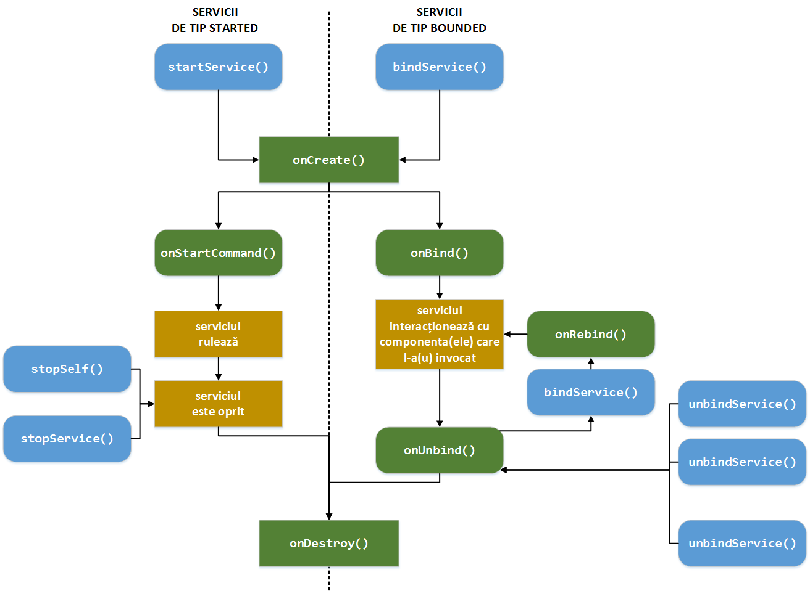
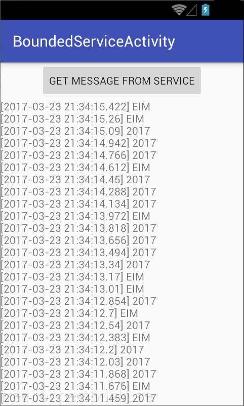

# Structura unei Aplicații (III)

## Servicii

În Android, clasa
[android.app.Service](http:*developer.android.com/reference/android/app/Service.html)
este utilizată pentru componente a căror funcționalitate implică
procesări complexe, de lungă durată, necesitând acces la anumite
resurse, fără a fi necesar să pună la dispoziție o interfață grafică sau
un mecanism de interacțiune cu utilizatorul. Prin intermediul unui
serviciu, se asigură faptul că aplicația Android continuă să se găsească
în execuție, chiar și atunci când interfața grafică a acesteia nu este
vizibilă.

---
**Note**

Întrucât prioritatea unui serviciu este mai mare decât a unei
activități inactive, este mai puțin probabil ca acestea să fie distruse
atunci când trebuie eliberate resursele sistemului de operare. De
altfel, un serviciu poate fi configurat să fie repornit imediat ce este
posibil sau chiar pentru a i se asocia o prioritate echivalentă cu a
unei activități active (dacă distrugerea serviciului are un impact la
nivelul interfeței grafice).\

---

Astfel, un serviciu nu trece prin evenimentele ce fac parte din ciclul
de viață al unei activități. Totuși, un serviciu poate fi controlat
(pornit, oprit) din contextul altor componente ale unei aplicații
Android (activități, ascultători de intenții cu difuzare, alte
servicii).

**Serviciul este rulat pe firul de execuție principal al aplicației
Android**. De aceea, în situația în care operațiile pe care le
realizează poate influența experiența utilizatorului, acestea trebuie
transferate pe alte fire de execuție din fundal (folosind clasele
`HandlerThread` sau `AsyncTask`).

Un serviciu continuă să se ruleze chiar și în situația în care
componenta aplicației Android care l-a invocat prin intermediul unei
intenții devine inactivă (nu mai este vizibilă) sau chiar este distrusă.
Acest comportament este adecvat în situația în care serviciul realizează
operații de intrare/ieșire intensive, interacționează cu diverse
servicii accesibile prin intermediul rețelei sau cu furnizori de
conținut.

---
**Note**

Opțiunea de a utiliza un serviciu în Android trebuie luată în
considerare numai în situația în care este necesar ca o anumită
funcționalitate să fie realizată independent de starea componentei care
a invocat-o. Dacă este necesar ca o operație să fie executată în tandem
cu o anumită componentă (doar în perioada în care aceasta este vizibilă,
spre exemplu), dar fără a avea un impact asupra experienței
utilizatorului (fără a influența timpul de răspuns al aplicației
Android), se va utiliza un fir de execuție dedicat, a cărui stare va fi
gestionată pe metodele de callback ce guvernează ciclul de viață al
componentei respective.\

---

### Tipuri de Servicii

În programarea Android, există două tipuri de servicii:

1.  servicii **pornite explicit** (*eng.* started), lansate în execuție
    prin intermediul metodei
    [startService()](http:*developer.android.com/reference/android/content/Context.html#startService%28android.content.Intent%29),
    invocată din contextul unei componente (activitate, serviciu,
    ascultător al unor mesaje cu difuzare); astfel de servicii nu
    furnizează un rezultat (către componenta care l-a apelat), fiind
    utilizate pentru a realiza o anumită operație la finalizarea căreia,
    de regulă, sunt terminate (apelându-se, în rutina lor, metoda
    [stopSelf()](http:*developer.android.com/reference/android/app/Service.html#stopSelf%28int%29));
    există posibilitatea ca o altă componentă să îl oprească explicit
    prin metoda
    [stopService()](http:*developer.android.com/reference/android/content/Context.html#stopService%28android.content.Intent%29);
    **un serviciu de tip started continuă să ruleze chiar și în situația
    în care componenta care l-a invocat nu mai există**;
2.  servicii **atașate unei (unor) componente** (*eng.* bounded) sunt
    lansate în execuție prin intermediul metodei
    [bindService()](http:*developer.android.com/reference/android/content/Context.html#bindService%28android.content.Intent,%20android.content.ServiceConnection,%20int%29),
    invocată din contextul unei componente (activitate, serviciu,
    ascultător al unor mesaje cu difuzare) care interacționează cu
    acesta prin funcționalități pe care le expune; la un moment dat, pot
    exista mai multe componente atașate aceluiași serviciu; detașarea
    unei componente la un serviciu se realizează prin intermediul
    metodei
    [unbindService()](http:*developer.android.com/reference/android/content/Context.html#unbindService%28android.content.ServiceConnection%29);
    **atunci când nu mai există nici o componentă asociată serviciului,
    acesta se consideră încheiat**.

Un serviciu poate avea, în același timp, ambele tipuri (started și
bounded). Acesta va putea rula o perioadă de timp nedefinită (până în
momentul în care procesarea pe care o realizează este încheiată),
permițând totodată componentelor unei aplicații Android să
interacționeze cu el prin intermediul unor metode pe care le expune.

Indiferent de modul în care este folosit un serviciu, invocarea sa este
realizată, ca pentru orice componentă Android, prin intermediul unei
intenții. În cazul serviciilor, se preferă să se utilizeze intenții
explicite, în detrimentul intențiilor implicite, din motive de
securitate.

Categoria în care se încadrează un anumit serviciu este determinată de
metodele pe care acesta le implementează:

1.  pentru un serviciu de tip started, va fi implementată metoda
    [onStartCommand()](http:*developer.android.com/reference/android/app/Service.html#onStartCommand%28android.content.Intent,%20int,%20int%29),
    apelată în mod automat în momentul în care serviciul este pornit
    prin intermediul metodei `startService()`;
2.  pentru un serviciu de tip bounded, vor fi implementate metodele:
    -   [onBind()](http:*developer.android.com/reference/android/app/Service.html#onBind%28android.content.Intent%29),
        apelată în mod automat în momentul în care o componentă este
        atașată serviciului, prin intermediul metodei `bindService()`;
    -   [onUnbind()](http:*developer.android.com/reference/android/app/Service.html#onUnbind%28android.content.Intent%29),
        apelată în mod automat în momentul în care o componentă este
        detașată de la serviciu, prin intermediul metodei
        `unbindService()`.

### Gestiunea unui Serviciu

Pentru a putea fi utilizat, orice serviciu trebuie să fie declarat în
cadrul fișierului `AndroidManifest.xml`, prin intermediul etichetei
[\<service>](http:*developer.android.com/guide/topics/manifest/service-element.html)
în cadrul elementului
[\<application>](http:*developer.android.com/guide/topics/manifest/application-element.html).
Eventual, se poate indica o permisiune necesară pentru pornirea și
oprirea serviciului, astfel încât aceste operații să poată fi realizate
numai de anumite aplicații Android.

``` xml
<manifest ...>
  <application ...>
    <service
      android:name="ro.pub.cs.systems.eim.lab05.SomeService"
      android:enabled="true"
      android:exported="true"
      android:permission="ro.pub.cs.systems.eim.lab05.SOME_SERVICE_PERMISSION" />
  </application>
</manifest>
```

Αtributul
[android:name](http:*developer.android.com/guide/topics/manifest/service-element.html#nm)
este singurul **obligatoriu** în cadrul elementului `<service>`,
desemnând clasa care gestionează operațiile specifice serviciului
respectiv. Din momentul în care aplicația Android este publicată,
această valoare nu mai poate fi modificată, întrucât poate avea un efect
asupra componentelor care utilizează acest serviciu prin intermediul
unei intenții explicite folosită la pornirea serviciului sau la
asocierea componentei cu serviciul respectiv.

---
**Note**

Pentru a asigura securitatea aplicației Android, se
recomandă să se folosească numai **intenții explicite** pentru pornirea
unui serviciu. Nu este recomandat să se utilizeze filtre de intenții,
astfel încât acestea nu ar trebui să se regăsească în fișierul
`ΑndroidManifest.xml`. Totuși, în situația în care acest lucru este
absolut necesar, ar trebui să se indice intenției măcar pachetul în care
se regăsește serviciul respectiv. Începând cu Android 5.0, tentativa de
pornire a unui serviciu folosind intenții implicite determină excepție,
fiind nepermisă.\

---

Atributul `android:enabled` indică dacă serviciul poate fi instanțiat de
către sistemul de operare.

Atributul `android:exported` specifică posibilitatea ca alte componente
(aparținând altor aplicații) să poată interacționa cu serviciul. În
situația în care serviciul nu conține filtre de intenții, acesta poate
fi invocat numai prin precizarea explicită a numelui clasei care îl
gestionează (calificată complet), valoarea sa fiind `false`, fiind
destinat invocării din contextul unor componente aparținând aceleiași
aplicații Android ca și el. În cazul în care serviciul definește cel
puțin un filtru de intenții, valoarea sa este `true`, fiind destinat
invocării din contextul altor aplicații Android.

Atributul `android:permission` precizează denumirea unei permisiuni pe
care entitatea trebuie să o dețină pentru a putea lansa în execuție un
serviciu sau pentru a i se putea asocia. Aceasta trebuie indicată în
cadrul intențiilor transmise ca argumente metodelor utilizate pentru a
invoca serviciul respectiv (`startService()`, respectiv
`bindService()`), altfel intenția respectivă nu va fi livrată către
serviciu.

Alte atribute ale elementului `<service>` sunt: `android:icon`,
`android:isolatedProcess`, `android:label`, `android:process`.

Un serviciu este o clasă derivată din `android.app.Service` (sau din
subclasele sale), implementând o serie de metode din ciclul de viață al
serviciului:

-   [onCreate()](http:*developer.android.com/reference/android/app/Service.html#onCreate%28%29) -
    realizând operațiile (unice) asociate construirii serviciului
    respectiv (legate de configurarea sa); această metodă este invocată
    doar atunci când este realizată o nouă instanță a serviciului; în
    situația în care serviciul este invocat, însă acesta există deja în
    memorie, metoda nu va mai fi apelată;
-   [onStartCommand()](http:*developer.android.com/reference/android/app/Service.html#onStartCommand%28android.content.Intent,%20int,%20int%29) -
    apelată în mod automat, **numai pentru serviciile de tip started**,
    în momentul în care serviciul este invocat printr-un apel al metodei
    `startService()`; serviciul va fi executat imediat după această
    metodă; **este responsabilitatea programatorului să oprească
    serviciul printr-un apel al uneiea dintre metodele `stopSelf()`,
    respectiv `stopService()`**, altfel serviciul va rula pentru o
    perioadă de timp nedefinită; nu este necesar ca metoda să fie
    implementată, dacă serviciul este de tip bounded;
-   [onBind()](http:*developer.android.com/reference/android/app/Service.html#onBind%28android.content.Intent%29) -
    apelată în mod automat, **numai pentru serviciile de tip bounded**,
    în momentul în care o componentă a fost atașată unui serviciu
    printr-un apel al metodei `bindService()`; implementarea acestei
    metode trebuie să furnizeze un obiect ce implementează interfața
    [ΙBinder](http:*developer.android.com/reference/android/os/IBinder.html),
    prin intermediul căruia serviciul să poată interacționa cu
    componenta care l-a invocat, punând la dispoziție o anumită
    funcționalitate, descrisă de metode publice; **toate tipurile de
    serviciu trebuie să implementeze această metodă**, însă pentru
    serviciile de tip started, valoarea întoarsă va fi `null`;
-   [onUnbind()](http:*developer.android.com/reference/android/app/Service.html#onUnbind%28android.content.Intent%29) -
    apelată în mod automat, **numai pentru serviciile de tip bounded**,
    în momentul în care toate componentele au fost detașate unui
    serviciu;
-   [onRebind()](http:*developer.android.com/reference/android/app/Service.html#onRebind%28android.content.Intent%29) -
    apelată în mod automat, **numai pentru serviciile de tip bounded**,
    în momentul în care o componentă a fost atașată unui serviciu după
    ce acesta a fost notificat anterior că toate componentele care îi
    erau asociate au fost detașate (s-a apelat metoda `οnUnbind()`); o
    astfel de metodă va fi invocată numai dacă rezultatul întors de
    metoda `οnUnbind()` este `true`;
-   [onDestroy()](http:*developer.android.com/reference/android/app/Service.html#onDestroy%28%29) -
    realizând operațiile asociate distrugerii serviciului respectiv,
    atunci când acesta nu mai este utilizat (a fost oprit sau sistemul
    de operare Android solicită memoria pe care o folosește); în cadrul
    acestei metode sunt eliberate resursele utilizate de serviciu (fire
    de execuție, obiecte, fluxuri de intrare / ieșire).

\<columns 100% 50%>

``` java
import android.app.Service;
import android.content.Intent;
import android.os.IBinder;

public class SomeStartedService extends Service {

  private int startMode;

  @Override
  public void onCreate() {
    super.onCreate();
    * ...
  }

  @Override
  public int onStartCommand(Intent intent, 
                            int flags,
                            int startId) {
    * ...
    return startMode;
  }

  @Override
  public IBinder onBind(Intent intent) {
    * ...
    return null;
  }
  
  @Override
  public void onDestroy() {
    super.onDestroy();
    * ...
  }
}
```

\<newcolumn>

``` java
import android.app.Service;
import android.content.Intent;
import android.os.IBinder;

public class SomeBoundedService extends Service {
  
  private IBinder iBinder;
  private boolean allowRebind;

  @Override
  public void onCreate() {
    super.onCreate();
    * ...
  }

  @Override
  public IBinder onBind(Intent intent) {
    * ...
    return iBinder;
  }
  
  @Override
  public boolean onUnbind(Intent intent) {
    * ...
    return allowRebind;
  }
  
  @Override
  public void onRebind(Intent intent) {
    * ...
  }
  
  @Override
  public void onDestroy() {
    super.onDestroy();
    * ...
  }
}
```

\</columns>

---
**Note**

În cazul metodelor care guvernează ciclul de viață al
unui serviciu, NU este obligatoriu să se apeleze metodele din clasa
părinte (nu se va genera nici o excepție în această situație).\

---



Se observă faptul că ciclul de viață al unui serviciu are loc între
metodele `onCreate()` și `onDestroy()`. De cele mai multe ori, este
necesar ca un serviciu să folosească unul sau mai multe fire de execuție
(dedicate) astfel încât să nu influențeze responsivitatea aplicației
Android. Într-o astfel de situație, firul de execuție va fi pornit pe
metoda `onCreate()` și va fi oprit pe metoda `onDestroy()`. De asemenea,
în cadrul metodei `onCreate()` au loc diferite operații de configurare
(inițializări), în timp ce în cadrul metodei `onDestroy()` realizează
eliberarea resurselor folosite. Metodele `onCreate()` și `onDestroy()`
sunt invocate pentru toate tipurile de servicii, atât pentru cele de tip
started, cât și pentru cele de tip bounded.

În cazul unui serviciu de tip started, perioada activă din ciclul de
viață este cuprinsă între apelul metodei `onStartCommand()` (apelată în
mod automat atunci când o componentă apelează metoda `startService()`,
primind ca argument obiectul de tip `Intent` care a fost folosit la
invocarea sa) și apelul metodei `onDestroy()` (apelat atunci când
serviciul este oprit, prin intermediul uneia dintre metodele
`stopSelf()` sau `stopService()`).

În cazul unui serviciu de tip bounded, perioada activă din ciclul de
viață este cuprinsă între apelul metodei `onBind()` (apelată în mod
automat atunci când o componentă apelează metoda `bindService()`,
primind ca argument obiectul de tip `Intent` care a fost folosit la
invocarea sa) și apelul metodei `onUnbind()` (apelată în mod automat
atunci când toate componentele asociate serviciului au apelat metoda
`unbindService()`).

\<note>Întrucât un serviciu poate fi simultan atât de tip started cât li
de tip bouned, nu este exclus ca ulterior metodei `onStartCommand()` să
fie apelată și metoda `onBind()`. În această situație serviciul va fi
activ până când nu va mai deține nici o componentă asociată. Apelurile
metodelor `stopSelf()` sau `stopService()` nu vor avea așadar efect
atâta timp cât mai există componente conectate la serviciu.\

---

#### Servicii de tip Started

În momentul în care este pornit (printr-un apel al metodei
`startService()` din cadrul altei componente), un serviciu apelează în
mod automat metoda `onStartCommand()`. În cadrul acestei metode trebuie
realizată procesarea pe care o presupune serviciul respectiv. Pentru
serviciile de tip started, este necesar ca **serviciul să fie oprit
explicit**, fie din propriul său context, printr-un apel al metodei
`stopSelf()`, fie de către o componentă (aceeași sau alta decât cea care
l-a invocat), prin intermediul metodei `stopService()`.

Metoda `onStartCommand()` este apelată în mod automat în momentul în
care serviciul este pornit prin intermediul metodei `startService()` și
primește ca parametrii:

-   intenția care a invocat serviciul (argumentul transmis la apelul
    metodei `startService()`); **acesta poate fi `null`** în situația în
    care serviciul este repornit după ce procesul din care făcea parte a
    fost distrus;
-   anumite valori prin care poate fi semnalat modul în care a fost
    pornit:
    -   [START_FLAG_REDELIVERY](http:*developer.android.com/reference/android/app/Service.html#START_FLAG_REDELIVERY) -
        serviciul a fost repornit ca urmare a distrugerii sale de către
        sistemul de operare înainte de se fi terminat corespunzător;
    -   [START_FLAG_RETRY](http:*developer.android.com/reference/android/app/Service.html#START_FLAG_RETRY) -
        serviciul a fost repornit după o execuție anormală;
-   un identificator unic prin care se poate face distincția între
    apeluri diferite ale aceluiași serviciu.

Având în vedere faptul că această metodă poate fi apelată de mai multe
ori pe parcursul ciclului de viață al unui serviciu, tot aici trebuie
implementat și comportamentul în cazul în care acesta este repornit.

Comportamentul serviciului în situația în care este repornit poate fi
controlată prin intermediul valorii întregi care este furnizată ca
valoare întoarsă:

-   [Service.START_STICKY](http:*developer.android.com/reference/android/app/Service.html#START_STICKY) -
    mecanism standard, folosit de serviciile care își gestionează
    propriile stări și care sunt pornite și oprite în funcție de
    necesități (prin intermediul metodelor `startService()` și
    `stopService()`); prin aceasta, se indică faptul că metoda
    `onStartCommand()` va fi invocată de fiecare dată când serviciul
    este (re)pornit după ce a fost distrus de sistemul de operare
    Android (situație în care parametrul de tip `Intent` va avea
    valoarea `null`, dacă între timp serviciul nu a mai fost invocat);
-   [Service.START_NOT_STICKY](http:*developer.android.com/reference/android/app/Service.html#START_NOT_STICKY) -
    mecanism folosit de serviciile utilizate pentru a procesa anumite
    comenzi, care se opresc singure (printr-un apel al metodei
    `stopSelf()`) atunci când operațiile pe care trebuiau să le
    realizeze s-au terminat; serviciul este (re)pornit după ce a fost
    distrus de sistemul de operare Android numai în situația în care
    între timp au mai fost realizate apeluri ale metodei
    `startService()`, altfel nu este recreat; un astfel de comportament
    este adecvat pentru procese care sunt realizate periodic;
-   [Service.START_REDELIVER_INTENT](http:*developer.android.com/reference/android/app/Service.html#START_REDELIVER_INTENT) -
    mecanism utilizat atunci când se dorește să se asigure faptul că
    procesările asociate serviciului sunt terminate; în situația în care
    serviciul a fost distrus de sistemul de operare Android, este
    (re)pornit apelând metoda `onStartCommand()` folosind ca parametru
    intenția originală, a cărei procesare nu a fost terminată
    corespunzător.

``` java
@Override
public int onStartCommand(Intent intent, int flags, int startId) {
  processInBackground(intent, startId);
  return startMode;
}
```

În toate aceste cazuri, oprirea serviciului trebuie realizată explicit,
prin apelul metodelor:

-   `stopService()` din contextul componentei care l-a pornit;
-   `stopSelf()` din contextul serviciului.

##### Pornirea unui Serviciu

Un serviciu este pornit printr-un apel al metodei `startService()`.
Aceasta primește ca parametru un obiect de tip `Intent` care poate fi
creat:

-   explicit, pe baza denumirii clasei care implementează serviciul
    respectiv; `Intent intent = new Intent(this, SomeService.class);
    startService(intent);
    `
-   implicit, indicând componenta care gestionează serviciul respectiv
    (se va indica atât denumirea pachetului cât și denumirea clasei ca
    argument al metodei `setComponent()` asociat intenției respective):
    `Intent intent = new Intent();
    intent.setComponent(new ComponentName("SomePackage", "SomeService"));
    startService(intent);
    `

Transmiterea de informații suplimentare către serviciu poate fi
realizată prin intermediul metodelor `putExtras(Bundle)`,
`putExtra(String, Parcelable)` sau `put<type>Extra(String, <type>)`.

Metoda `startService()` presupune livarea unui mesaj asincron la nivelul
sistemului de operare Android, astfel încât aceasta se execută
instantaneu. Fiecare apel al acestei metode invocarea, în mod automat,
al metodei `onStartCommand()`.

De regulă, comunicația dintre o componentă și un serviciu este
unidirecțională, dintre componenta care invocă către serviciul invocat,
prin intermediul datelor încapsulate în intenție. În situația în care se
dorește ca serviciul să transmită date către componentă, se utilizează
un obiect de tip
[PendingIntent](http:*developer.android.com/reference/android/app/PendingIntent.html),
prin intermediul căruia pot fi transmise mesaje cu difuzare.

##### Oprirea unui Serviciu

Un serviciu poate fi oprit:

-   de către o componentă (aceeași care l-a pornit sau alta), printr-un
    apel al metodei `stopService()`, ce primește ca parametru un obiect
    de tip `Intent` care poate fi creat explicit sau implicit;

---
**Note**

Întrucât apelurile metodei `startService()` nu sunt
imbricate, invocarea metodei `stopService()` oprește numai serviciul
corespunzător (dacă se află în execuție).\

---

-   chiar de el însuși, în momentul în care procesările pe care trebuie
    să le realizeze s-au terminat, printr-un apel al metodei
    `stopSelf()`, eliberând resursele pe care sistemul de operare le-ar
    fi folosit pentru a-l menține în execuție; metoda poate fi apelată:
    -   fără parametri, pentru a forța oprirea imediată;
    -   transmițând un parametru de tip întreg, reprezentând
        identificatorul instanței care rulează, pentru a se asigura
        faptul că procesarea a fost realizată pentru fiecare apel care a
        fost realizat; dacă între timp serviciul a mai fost invocat,
        identificatorul folosit nu va corespunde celui mai recent apel
        (transmis ca argument al metodei `onStartCommand()`) și metoda
        nu va avea nici un efect.

Pentru oprirea unui serviciu este suficient un singur apel al uneia
dintre metodele `stopSelf()` sau `stopService()`.

##### Utilizarea clasei IntentService

Recursul la clasa
[IntentService](http:*developer.android.com/reference/android/app/IntentService.html)
este adecvată în situația în care se dorește implementarea unor servicii
care rulează în fundal, **pe un fir de execuție dedicat** realizând un
set de operații la un moment dat de timp, atunci când sunt solicitate.
În situația în care serviciul este accesat simultan de mai multe
componente ale unei (unor) aplicații Android, procesarea acestora va fi
realizată secvențial.

Un obiect de acest tip este lansat în execuție prin pornirea unui
serviciu și transmiterea unui obiect de tip `Intent` care conține toți
parametrii necesari pentru realizarea sarcinii respective. Toate
operațiile solicitate sunt înregistrate într-o coadă de așteptare și
executate succesiv, prin invocarea automată a metodei
[onHandleIntent()](http:*developer.android.com/reference/android/app/IntentService.html#onHandleIntent(android.content.Intent)).
După ce procesarea a fost finalizată, procesul se oprește singur (nu
este necesar să se apeleze metodele `stopSelf()` sau `stopService()`
explicit).

---
**Note**

Clasa `IntentService` oferă o implementare implicită a
metodelor `onStartCommand()` care plasează intenția către coada de
așteptare și invocă metoda `onHandleIntent()` precum și a metodei
`onBind()` care întoarce valoarea `null`.\

---

Prin urmare, o implementare presupune definirea unei clase derivată din
`IntentService` care suprascrie metoda `onHandleIntent()`, ce primește
ca parametru intenția conținând parametrii ce se doresc a fi procesați,
execuția sa fiind realizată (în mod transparent) pe un fir de execuție
ce rulează în fundal. De asemenea, trebuie furnizat și un constructor
implicit.

``` java
import android.app.IntentService;
import android.content.Intent;

public class SomeStartedService extends IntentService {

  private final String name = "SomeStartedService";

  public SomeIntentService() {
    super(name);
    * ...
  }

  @Override
  protected void onHandleIntent(Intent intent) {
    * ...
  }
}
```

În situația în care este necesar să se suprascrie metodele `onCreate()`,
`onDestroy()` sau `onStartCommand()`, este recomandat să se apeleze și
metodele din clasa părinte, astfel încât ciclul de viață al firului de
execuție pe care sunt realizate procesările să fie actualizat
corespunzător.

``` java
@Override
public int onStartCommand(Intent intent, int flags, int startId) {
  * ...
  return super.onStartCommand(intent, flags, startId);
}
```

##### Utilizarea clasei Service

În situația în care este necesar ca serviciul să gestioneze mai multe
solicitări concomitent, se implementează o clasă derivată din `Service`,
definindu-se (intern) o clasă de tip fir de execuție (uzual, se
folosește o instanță a clasei
[Handler](http:*developer.android.com/reference/android/os/Handler.html),
care permite transmiterea de mesaje) pe care vor fi realizate toate
procesările.

``` java
public class SomeStartedService extends Service {
  private Looper looper;
  private ServiceHandler serviceHandler;
  private final static String handlerThreadName = "HandlerThread";

  private final class ServiceHandler extends Handler {
    public ServiceHandler(Looper looper) {
      super(looper);
    }
    
    @Override
    public void handleMessage(Message message) {
      * ...
      stopSelf(message.arg1);
    }
  }

  @Override
  public void onCreate() {
    HandlerThread handlerThread = new HandlerThread(handlerThreadName, Process.THREAD_PRIORITY_BACKGROUND);
    handlerThread.start();
    looper = handlerThread.getLooper();
    serviceHandler = new ServiceHandler(looper);
  }

  @Override
  public int onStartCommand(Intent intent, int flags, int startId) {
    Message message = serviceHandler.obtainMessage();
    message.arg1 = startId;
    serviceHandler.sendMessage(message);
    return START_STICKY;
  }

  @Override
  public IBinder onBind(Intent intent) {
    return null;
  }
}
```

Procesarea este realizată în cadrul metodei
[handleMessage()](http:*developer.android.com/reference/android/os/Handler.html#handleMessage%28android.os.Message%29)
a clasei de tip `Handler`. O instanță a acesteia este creată de fiecare
dată când este invocată metoda
[sendMessage()](http:*developer.android.com/reference/android/os/Handler.html#sendMessage%28android.os.Message%29),
care are drept argument un obiect de tip
[Message](http:*developer.android.com/reference/android/os/Message.html).
Prin intermediul mesajului (obținut ca rezultat al metodei
[obtainMessage()](http:*developer.android.com/reference/android/os/Handler.html#obtainMessage%28%29)
care furnizează o instanță dintr-o colecție globală), trebuie să se
transmită și identificatorul cu care a fost invocat serviciul, astfel
încât acesta să fie transmis către metoda `stopSelf()`, necesară pentru
oprirea serviciului. Astfel, se asigură faptul că serviciul nu se
termină până ce nu este tratată și cea mai recentă invocare a sa.

#### Servicii de tip Bounded

\<spoiler (Opțional)> Un serviciu de tip bounded implică o interacțiune
permanentă cu una sau mai multe componente ale unei (unor) aplicații
Android. Astfel, serviciul poate expune o anumită funcționalitate către
componentele aplicației Android (prin intermediul unei interfețe) sau
poate fi utilizat ca mecanism de comunicație inter-proces, pentru
transmiterea de informații între acestea.

Arhitectura utilizată într-o astfel de situație este client-server, unde
clientul este reprezentat de componenta aplicației Android, iar serverul
de către serviciul de tip bounded. Existența unui serviciu de tip
bounded este condiționată de existența unor componente atașate la el.

Implementarea unui serviciu de tip bounded presupune suprascrierea
metodei
[onBind()](http:*developer.android.com/reference/android/app/Service.html#onBind%28android.content.Intent%29),
apelată în mod automat în momentul în care o componentă a unei aplicații
Android este atașată acestuia, printr-un apel al metodei
[bindService()](http:*developer.android.com/reference/android/content/Context.html#bindService%28android.content.Intent,%20android.content.ServiceConnection,%20int%29).
Acesta furnizează ca rezultat un obiect de tip
[IBinder](http:*developer.android.com/reference/android/os/IBinder.html).

De regulă, se definește o clasă internă de tip
[Binder](http:*developer.android.com/reference/android/os/Binder.html),
utilizată pentru apelul de metode la distanță în Android. Aceasta
furnizează o metodă pentru obținerea unei referințe către serviciu, prin
intermediul căreia pot fi accesate funcționalitățile pe care acesta le
pune la dispoziție. O astfel de abordare este utilă mai ales în situația
în care serviciul este folosit de o singură aplicație Android, **în
cadrul aceluiași proces** (nefiind deci necesară comunicația
inter-proces).

``` java
import android.app.Service;
import android.content.Intent;
import android.os.IBinder;

public class SomeBoundedService extends Service {

  final private IBinder binder = new SomeBinder();

  public class SomeBinder extends Binder {
    SomeBoundedService getService() {
      return SomeBoundedService.this;
    }
  }

  @Override
  public void onCreate() {
    super.onCreate();
    * ...
  }

  @Override
  public IBinder onBind(Intent intent) {
    return binder;
  }
  
  public void doWork() {
    * ...
  }
}
```

Legătura dintre serviciu și o componentă a unei aplicații Android
(locale) este reprezentată sub forma unui obiect de tipul
[ServiceConnection](http:*developer.android.com/reference/android/content/ServiceConnection.html),
responsabil cu monitorizarea conexiunii dintre acestea. Implementarea sa
presupune definirea metodelor
[onServiceConnected()](http:*developer.android.com/reference/android/content/ServiceConnection.html#onServiceConnected%28android.content.ComponentName,%20android.os.IBinder%29),
respectiv
[onServiceDisconnected()](http:*developer.android.com/reference/android/content/ServiceConnection.html#onServiceDisconnected%28android.content.ComponentName%29).
Acestea sunt apelate automat în momentul în care componenta este
conectată la serviciu (ca urmare a apelului `bindService()`), respectiv
este deconectată (drept rezultat al apelului `unbindService()`).

Metoda `onServiceConnected()` primește ca argumente, un parametru de tip
`ComponentName` care descrie pachetul și clasa coresunzătoare
serviciului, respectiv un parametru de tip `IBinder` ce reprezintă
rezultatul furnizat de metoda de callback `onBind()` de la nivelul
serviciului. Aceasta este utilizată pentru a accesa funcționalitatea
pusă la dispoziție de către serviciu. În situația în care conexiunea
dintre componentă și serviciu este coruptă, va fi aruncată excepția
[DeadObjectException](http:*developer.android.com/reference/android/os/DeadObjectException.html),
care ar trebui să fie tratată pentru a asigura un comportament adecvat
al aplicației Android.

Metoda `onServiceDisconnected()` primește ca argument un parametru de
tip `ComponentName` care descrie pachetul și clasa coresunzătoare
serviciului. De regulă, în cadrul acestei metode sunt eliberate
resursele utilizate pentru comunicația dintre componentă și serviciu.

``` java
public class SomeActivity extends Activity {

  * ...
  
  private SomeBoundedService someBoundedService = null;
  private int status;

  private ServiceConnection serviceConnection = new ServiceConnection() {
    @Override
    public void onServiceConnected(ComponentName className, IBinder service) {
      someBoundedService = ((SomeBoundedService.SomeBinder)service).getService();
      status = BOUNDED;
    }
  
    @Override
    public void onServiceDisconnected(ComponentName className) {
      someBoundedService = null;
      status = UNBOUNDED;
    }
  };
}
```

Atașarea propriu-zisă a unei componente a unei aplicații Android la un
serviciu este realizată de metoda `bindService()` care primește ca
parametri:

-   intenția reprezentând serviciul care se asociază activității;
-   un obiect de tip `ServiceConnection`;
-   anumite valori prin care se controlează modul în care este făcută
    asocierea între cele două componente ale aplicației Android:
    -   [Context.BIND_AUTO_CREATE](http:*developer.android.com/reference/android/content/Context.html#BIND_AUTO_CREATE) -
        serviciul trebuie creat în momentul în care se realizează
        asocierea;
    -   [Context.BIND_ADJUST_WITH_ACTIVITY](http:*developer.android.com/reference/android/content/Context.html#BIND_ADJUST_WITH_ACTIVITY) -
        modifică prioritatea serviciului în funcție de importanța
        activității de care este legat (mai mare atunci când este
        activă, mai mică atunci când este inactivă);
    -   [Context.BIND_ABOVE_CLIENT](http:*developer.android.com/reference/android/content/Context.html#BIND_ABOVE_CLIENT)
        /
        [Context.BIND_IMPORTANT](http:*developer.android.com/reference/android/content/Context.html#BIND_IMPORTANT) -
        specifică faptul că prioritatea serviciului este mai mare decât
        a activității asociate;
    -   [Context.BIND_NOT_FOREGROUND](http:*developer.android.com/reference/android/content/Context.html#BIND_NOT_FOREGROUND) -
        asigură faptul că serviciul atașat activității nu va avea
        niciodată prioritatea necesară pentru a rula în prim-plan;
    -   [Context.BIND_WAIVE_PRIORITY](http:*developer.android.com/reference/android/content/Context.html#BIND_WAIVE_PRIORITY) -
        face ca prioritatea serviciului asociat să nu fie modificată
        (implicit, prioritatea relativă a serviciului este mărită).

Asocierea este realizată, de obicei, în cadrul metodei `onStart()` a
unei activități.

Detașarea unei componente a unei aplicații Android la un serviciu este
realizată de metoda `unbindService()` care primește ca argument un
obiect de tip `ServiceConnection` (care monitorizează starea
conectivității dintre componentă și serviciu). Decuplarea este
realizată, de obicei, în cadrul metodei `onStop()` a unei activități.

``` java
public class SomeActivity extends Activity {

  * ...
  
  @Override
  protected void onStart() {
    super.onStart();
    Intent intent = new Intent(this, SomeBoundedService.class);
    bindService(intent, serviceConnection, Context.BIND_AUTO_CREATE);
  }
  
  @Override
  protected void onStop() {
    super.onStop();
    if (status == BOUNDED) {
      unbindService(serviceConnection);
    }
  }
  
}
```

În situația în care este necesar ca serviciul să fie utilizat și atunci
când activitatea se află în fundal, metodele `bindService()` și
`unbindService()` pot fi apelate pe metodele de callback `onCreate()`
respectiv `onDestroy()`. Totuși, aceasta implică o probabilitate mai
mare ca memoria utilizată de serviciu să fie solicitată de sistemul de
operare Android, dacă acesta nu rulează în contextul aceluiași proces ca
și componenta cu care interacționează.

Nu se recomandă ca atașarea, respectiv detașarea unei componente la / de
un servicu să fie realizată pe metodele `onResume()` și `onPause()`
întrucât acestea sunt apelate frecvent, astfel încât procesările
realizate în aceste momente să poată determina deprecieri ale
performanței sistemului de operare Android. Mai mult, în cazul în care
mai multe activități interacționează cu același serviciu, atunci când se
realizează transferul între ele, serviciul ar putea fi distrus (pe
metoda `onPause()` se apelează `unbindService()`, deci toate
componentele au fost detașate serviciului), respectiv recreat (pe metoda
`onResume()` se apelează `bindService()`, deci serviciul are o
componentă atașată).

În situația în care este necesar ca serviciul să poată fi atașat la mai
multe componente simultan, aparținând unor procese diferite
(realizându-se astfel comunicația inter-proces), realizând procesări pe
fire de execuție dedicate, se folosește un obiect de tip
[Messenger](http:*developer.android.com/reference/android/os/Messenger.html).
Obiectul de tip `Binder` asociat acestuia va fi transmis ca rezultat al
metodei `onBind()`. De asemenea, el va încapsula un obiect de tip
`Handler` pe a cărui metodă `handleMessage()` va fi realizată procesarea
corespunzătoare serviciului, acesta putând gestiona tipuri de mesaje
diferite, corespunzătoare fiecărui tip specific de componentă. Obiectul
`Messenger` plasează toate apelurile către serviciu într-o coadă de
așteptare, toate fiind procesate, secvențial, în contextul aceluiași fir
de execuție.

``` java
public class SomeBoundedService extends Service {

  class SomeHandler extends Handler {
    @Override
    public void handleMessage(Message message) {
      switch (msg.arg1) {
        * ...
        default:
          super.handleMessage(message);
      }
    }
  }
  
  final Messenger messenger = new Messenger(new SomeHandler());

  @Override
  public IBinder onBind(Intent intent) {
    return messenger.getBinder();
  }
}
```

Dacă este necesar ca procesarea să fie realizată simultan, poate fi
utilizat AIDL (Android Interface Definition Language) care realizează
transformarea dintre obiecte și primitive la nivelul sistemului de
operare prin intermediul cărora se realizează comunicația inter-proces.
În această situație, trebuie avut în vedere faptul că sincronizarea
dintre diferitele fire de execuție trebuie realizată manual, operație
destul de complexă. Pe baza fișierului `.aidl` care descrie interfața de
programare, se va genera o clasă abstractă responsabilă cu comunicația
inter-proces, din care va fi derivat serviciul respectiv. \</spoiler>

### Prioritatea unui Serviciu

În situația în care este necesar, sistemul de operare Android poate
solicita memoria utilizată de un anumit serviciu, în funcție de
prioritatea pe care acesta o are.

Un serviciu de tip started are o prioritate mai mare decât o activitate
inactivă, dar mai mică decât o activitate activă. Din acest motiv, este
necesar ca programatorul să trateze cazurile în care serviciul este
repornit, ca urmare a distrugerii sale de către sistemul de operare
Android, în vederea satisfacerii necesarului de memorie.

Un serviciu de tip bounded are de obicei o prioritate similară cu a
activității cu care interacționează, deși aceasta poate fi controlată
prin intermediul unor parametrii transmiși în momentul în care este
realizată legătura. Este puțin probabil ca un serviciu atașat unei
activități active să fie distrus la fel cum este destul de probabil ca
un serviciu pentru care toate activitățile atașate sunt inactive să fie
distrus.

Un serviciu care rulează în prim-plan nu este aproape niciodată distrus.

### Categorii de Procesări

În funcție de firul de execuție pe care rulează precum și de prioritatea
care le este atribuită (în funcție de care sistemul de operare Android
poate reclama resursele pe care acestea le utilizează), operațiile
complexe pot fi realizate prin intermediul unor:

-   servicii care rulează în prim-plan;
-   procesări realizate în fundal.

#### Servicii ce Rulează în Prim-Plan

În situația în care un serviciu interacționează cu utilizatorul (sau
utilizatorul este conștient de existența sa), prioritatea acestuia
trebuie mărită, astfel încât sistemul de operare Android să nu poată
reclama resursele pe care le utilizează. Un astfel de serviciu trebuie
să poată oferi o notificare în bara de stare, care nu poate fi ascunsă
decât atunci când serviciul este distrus sau nu mai rulează în
prim-plan.

Un astfel de comportament poate fi obținut prin marcarea serviciului ca
rulând în prim-plan, prin invocarea metodei
[startForeground()](http:*developer.android.com/reference/android/app/Service.html#startForeground(int,%20android.app.Notification))
care primește ca parametri:

-   identificatorul unei notificări, care **trebuie să fie diferit de
    zero**;
-   un obiect de tip
    [Notification](http:*developer.android.com/reference/android/app/Notification.html),
    care va fi afișată cât timp serviciul se află în prim-plan, întrucât
    se presupune că serviciul trebuie să aibă o reprezentare vizuală cu
    care utilizatorul să poată interacționa.

``` java
NotificationCompat.Builder notificationBuilder =
    new NotificationCompat.Builder(this)
    .setSmallIcon(R.drawable.notification_icon)
    .setContentTitle("...")
    .setContentText("...");
Intent intent = new Intent(this, SomeActivity.class);
PendingIntent pendingIntent = PendingIntent.getActivity(this, 0, intent, PendingIntent.FLAG_UPDATE_CURRENT);
notificationBuilder.setContentIntent(pendingIntent);
Notification notification = notificationBuilder.build();
startForeground(NOTIFICATION_ID, notification);
```

Este recomandat ca utilizatorii să poată dezactiva ei înșiși rularea
serviciului în prim-plan, de regulă prin intermediul obiectului de tip
`Notification`. Același lucru trebuie realizat și în momentul în care
rularea serviciului în prim-plan nu mai este necesară. În acest sens,
trebuie apelată metoda `stopForeground(true)` (argumentul metodei indică
dacă se dorește și terminarea notificării), aceasta anulând în mod
automat notificarea asociată.

---
**Note**

Nu este indicat să existe mai multe servicii care rulează în
prim-plan simultan întrucât acestea nu pot fi distruse de sistemul de
operare Android și în situația în care necesarul de memorie devine o
problemă critică, performanțele dispozitivului mobil se vor deprecia
considerabil.\

---

#### Procesări Realizate în Fundal

Întrucât responsivitatea aplicației Android reprezintă un criteriu
foarte important, asigurarea unei experiențe corespunzătoare a
utilizatorului poate fi obținută prin transferul operațiilor complexe de
procesare și a operațiilor de intrare / ieșire în fundal, pe un alt fir
de execuție. Acest lucru este necesar datorită faptului că pe firul de
execuție principal sunt rulate mai multe componente ale aplicației
Android (activități, servicii, ascultători ai intențiilor cu difuzare),
astfel încât interacțiunea cu utilizatorul poate fi blocată în situația
în care procesarea realizată de servicii nu este transferată în fundal.

\<note>În Android, o activitate care nu răsunde la un eveniment în
decurs de 5 secunde sau un ascultător al unei intenții cu difuzare a
cărei metodă `onReceive()` nu se termină în 5 secunde sunt considerate
blocate.\

---

De regulă, sunt plasate pe fire de execuție dedicate operații cu fișiere
(scrieri, citiri), căutări în rețea, tranzacții cu baza de date, calcule
complexe.

Android oferă mai multe mecanisme pentru gestiunea serviciilor care
rulează în fundal:

1.  utilizarea clasei
    [AsyncTask](http:*developer.android.com/reference/android/os/AsyncTask.html)
    permite definirea unei operații care va fi realizată pe un fir de
    execuție separat, oferind metode care oferă informații cu privire la
    progres, ce pot fi consultate de alte fire de execuție;
2.  definirea unei clase derivate din
    [Loader](http:*developer.android.com/reference/android/content/Loader.html);
3.  utilizarea clasei
    [Handler](http:*developer.android.com/reference/android/os/Handler.html);
4.  implementarea unui fir de execuție definit de utilizator,
    transmiterea valorilor către interfața grafică fiind realizat prin
    intermediul clasei
    [Handler](http:*developer.android.com/reference/android/os/Handler.html).

##### Clasa AsyncTask

Prin intermediul clasei `AsyncTask` se permite mutarea operațiilor
costisitoare din punct de vedere al utilizării procesorului și al
memoriei pe fire de execuție rulate în fundal, oferind **sincronizarea**
cu firul de execuție ce randează interfața grafică, acesta fiind
notificat cu privire la progresul realizat cât și cu privire la momentul
în care procesarea a fost terminată.

---
**Note**

Întrucât clasa `AsyncTask` nu este persistentă în cazul
(re)pornirii unei activități (situație în care firul de execuție asociat
este distrus), se recomandă utilizarea sa pentru procese de fundal care
nu durează o perioadă de timp prea mare.\

---

O implementare a clasei `AsyncTask` poate fi parametrizată cu tipurile
de date care sunt folosite pentru intrare, pentru raportarea progresului
și pentru ieșire (rezultate).

---
**Note**

În situația în care nu se dorește transmiterea unor
parametrii de intrare / ieșire sau nu este necesară raportarea
progresului, se poate utiliza valoarea `Void` pentru toate aceste
tipuri.\

---

Este necesară suprascrierea următoarelor metode:

-   [doInBackground()](http:*developer.android.com/reference/android/os/AsyncTask.html#doInBackground(Params...)) -
    metoda care va fi executată pe firul de execuție dedicat, care
    primește parametrii de intrare de tipul specificat; acesta trebuie
    să conțină procesările complexe care se doresc a fi realizate fără a
    interacționa însă cu firul de execuție principal; notificările sunt
    realizate:
    -   prin intermediul metodei
        [publishProgress()](http:*developer.android.com/reference/android/os/AsyncTask.html#publishProgress(Progress...)),
        care primește ca parametru progresul realizat, valorile fiind
        transmise metodei
        [onProgressUpdate()](http:*developer.android.com/reference/android/os/AsyncTask.html#onProgressUpdate(Progress...));
    -   prin întoarcerea unui rezultat, atunci când procesarea este
        terminată, valoarea fiind transmisă metodei
        [onPostExecute()](http:*developer.android.com/reference/android/os/AsyncTask.html#onPostExecute(Result));
-   `onProgressUpdate()` - folosită pentru actualizarea interfeței
    grafice, cu valorile primite de la metoda `publishProgress()`;
    metoda este sincronizată cu firul de execuție principal (care
    randează interfața grafică), astfel încât diferitele controale pot
    fi accesate de aici;
-   `onPreExecute()` - apelată în contextului firului de execuție al
    interfeței grafice, înainte de metoda `doInBackground()`;
-   `onPostExecute()` - apelată în momentul în care procesarea este
    terminată, primind ca parametru rezultatul întors de metoda
    `doInBackground()`; metoda este sincronizată cu firul de execuție
    principal (care randează interfața grafică), astfel încât diferitele
    controale pot fi accesate de aici.

``` java
private class SomeAsyncTask extends AsyncTask<String, Integer, String> {
  @Override
  protected String doInBackground(String... parameter) {
    String result = new String();
    int progress = 0;
    for (int step = 1; step <= parameter[0].length(); step++) {
      progress = step;
      result += parameter[0].charAt(parameter[0].length() - step);
      try {
        Thread.sleep(100);
      } catch (InterruptedException interruptedException) {
        Log.e(Constants.TAG, "An exception has occurred: " + interruptedException.getMessage());
      }
      publishProgress(progress);
    }
    return result;
  }

  @Override
  protected void onProgressUpdate(Integer... progress) {
    progressTextView.setText(progress[0].toString());
  }

  @Override
  protected void onPreExecute() {
    * ...
  }

  @Override
  protected void onPostExecute(String result) {
    progressTextView.setText(result);
  }
}
```

Rularea unui obiect de tip `AsyncTask` se face prin invocarea metodei
`execute()` care primește ca parametru informațiile care se doresc a fi
procesate.

---
**Note**

Fiecare obiect de tip `AsyncTask` poate fi rulat o
singură dată. Apelurile ulterioare ale metodei `execute()` vor genera
excepții. \

---

##### Clasa Loader

Clasa abstractă `Loader` implementează practicile recomandate pentru
încărcarea asincronă a informațiilor în cadrul unor controale grafice
din interfața cu utilizatorul (afișate în activități sau fragmente).

O astfel de abordare este utilizată pentru:

-   a încărca date asincron;
-   a monitoriza sursele din care sunt încărcate datele, oferind
    informații cu privire la rezultatele obținute.

De regulă, se folosește o implementare a clasei `AsyncTaskLoader`.

##### Clasa Handler

Clasa `Handler` gestionează transmiterea de mesaje sau execuția unor
rutine asociate unor fire de execuție prin intermediul unei cozi de
așteptare (de tipul
[MessageQueue](http:*developer.android.com/reference/android/os/MessageQueue.html)).
Un obiect de acest tip este asociat unui singur fir de execuție. Acesta
este creat în momentul în care este realizată instanța, cătrea cesta
fiind transmise toate mesajele, **secvențial**.

Prin intermediul acestui obiect, se permite:

-   planificarea mesajelor spre a fi procesate la un moment fix din
    viitor (metodele de tip `send...()`: `sendEmptyMessage()`,
    `sendMessage()`, `sendMessageAtTime()`, `sendMessageDelayed()`);
-   încapsularea unei acțiuni care va fi executată pe un alt fir de
    execuție decât firul de execuție al interfeței grafice (metodele de
    tip `post...()`: `post()`, `postAtTime()`, `postDelayed()`).

##### Utilizarea firelor de execuție definite de utilizator

Folosirea unor fire de execuție definite de utilizator și sincronizarea
manuală cu interfața grafică poate fi necesară în situația în care
trebuie realizată o gestiune mai complexă decât cea oferită de clasele
`AsyncTask`, `Handler` sau `Loader`.

În acest sens, este folosită o implementare a clasei `Thread`,
procesarea pe un fir de execuție separat fiind realizată în cadrul
metodei `run()`.

``` java
private void executeOnDedicatedThread() {
  Thread dedicatedThread = new Thread(new Runnable() {
    @Override
    public void run() {
      * ...
    }
  });
  dedicatedThread.start();
}
```

Dacă se dorește actualizarea controalelor din cadrul interfeței grafice,
este necesar ca firele de execuție care rulează în fundal să fie
sincronizate cu firul de execuție principal anterior acestei operații.
Acest lucru poate fi realizat:

1.  folosind metoda
    [Activity.runOnUiThread()](http:*developer.android.com/reference/android/app/Activity.html#runOnUiThread(java.lang.Runnable))
    care forțează codul transmis să fie executat pe același fir de
    execuție care redă interfața grafică:
    `runOnUiThread(new Runnable() {
      @Override
      public void run() {
        * ...
      }
    });
    `
2.  utilizând un obiect de tip `Handler` pentru a realiza actualizări în
    contextul firului de execuție în care acesta a fost creat, utilizând
    metoda
    [post()](http:*developer.android.com/reference/android/os/Handler.html#post(java.lang.Runnable)):
    `private Handler handler = new Handler(); * created on the main thread

    private void executeOnSeparateThread() {
      Thread separateThread = new Thread(new Runnable() {
        @Override
        public void run() {
          * do some background processing here
          handler.post(new Runnable() {
            @Override
            public void run() {
              * access the graphical user interface here
            }
          });
        }
      });
      separateThread.start();
    }
    ` Clasa `Handler` pune la dispoziție și metode pentru a executa
    anumite metode la un moment dat de timp:

-   [postDelayed()](http:*developer.android.com/reference/android/os/Handler.html#postDelayed(java.lang.Runnable,%20long)) -
    realizează o modificare la nivelul interfeței grafice cu o
    întârziere specificată ca parametru (exprimat în milisecunde);
-   [postAtTime()](http:*developer.android.com/reference/android/os/Handler.html#postAtTime(java.lang.Runnable,%20long)) -
    realizează o modificare la nivelul interfeței grafice la un moment
    de timp specificat ca parametru (exprimat ca număr de milisecunde ce
    au trecut de la 1 ianuarie 1970.

### Realizarea de Procesări prin Intermediul Alarmelor

\<spoiler (Opțional)>

O alarmă reprezintă un mecanism de transmitere a unor intenții la
momente predefinite de timp sau periodic, după trecerea unui anumit
interval. Acestea există în afara domeniului de existență a unei
aplicații Android, astfel încât acestea pot fi utilizate pentru a
realiza anumite acțiuni chiar și în situația în care acestea nu mai
există. Din acest motiv, alarmele reprezintă o metodă foarte utilă
pentru a difuza intenții, pentru a porni servicii sau lansa în execuție
activități, fără a fi necesar ca aplicația să se afle în execuție. Se
asigură astfel și optimizarea cerințelor legate de resursele utilizate
de aplicație.

Cele mai frecvente utilizări ale alarmelor sunt legate de planificarea
unor actualizări bazate pe căutări în rețea, programarea unor operații
(consumatoare de resurse) la momente de timp în care solicitările sunt
mai reduse, organizarea unor noi încercări pentru operații care nu au
putut fi realizate anterior.

---
**Note**

Evenimentele care pot fi produse doar pe parcursul ciclului
de viață al unei aplicații Android trebuie tratate prin fire de execuție
separate implementate de utilizator și sincronizate (manual) cu
interfața grafică. Utilizarea de alarme trebuie limitată doar la
evenimente programate în afara ferestrei temporale în care se desfășoară
aplicația.\

---

\<note>În Android, alarmele rămân active chiar și atunci când
dispozitivul mobil se găsește într-o stare de latență (*eng.* sleep
mode), putând fi utilizate pentru a-l scoate din aceasta. Totuși, ele
devin inactive în momentul în care dispozitivul mobil este
repornit.\

---

Operațiile cu alarme sunt realizate prin intermediul serviciului de
sistem
[AlarmManager](http:*developer.android.com/reference/android/app/AlarmManager.html)
care poate fi accesat prin intermediul metodei
[Context.getSystemService()](http:*developer.android.com/reference/android/content/Context.html#getSystemService%28java.lang.String%29)
care primește ca parametru argumentul
[Context.ALARM_SERVICE](http:*developer.android.com/reference/android/content/Context.html#ALARM_SERVICE).

Există mai multe tipuri de alarme:

-   [RTC_WAKEUP](http:*developer.android.com/reference/android/app/AlarmManager.html#RTC_WAKEUP) -
    scoate dispozitivul mobil din starea de latență prin transmiterea
    unei intenții în așteptare, la un anumit moment de timp specificat;
-   [RTC](http:*developer.android.com/reference/android/app/AlarmManager.html#RTC) -
    transmite o intenție în așteptare, la un anumit moment de timp
    specificat, fără a scoate dispozitivul mobil din starea de latență;
-   [ELAPSED_REALTIME](http:*developer.android.com/reference/android/app/AlarmManager.html#ELAPSED_REALTIME) -
    transmite o intenție în așteptare, la un anumit interval de timp
    scurs de la momentul în care dispozitivul mobil a fost pornit, fără
    a-l scoate din starea de latență;
-   [ELAPSED_REALTIME_WAKEUP](http:*developer.android.com/reference/android/app/AlarmManager.html#ELAPSED_REALTIME_WAKEUP) -
    scoate dispozitivul mobil din starea de latență prin transmiterea
    unei intenții în așteptare, la un anumit interval de timp scurs de
    la momentul în care acesta a fost pornit.

În funcție de aceste valori, parametrul furnizat metodei
[set()](http:*developer.android.com/reference/android/app/AlarmManager.html#set(int,%20long,%20android.app.PendingIntent))
a obiectului de tip `AlarmManager` reprezintă un moment de timp sau un
interval.

În momentul în care se declanșează, obiectul de tip `PendingIntent` este
distribuit la nivelul tuturor componentelor sistemului de operare.

---
**Note**

Specificarea unei alte alarme folosind același obiect de tip
`PendingIntent` o înlocuiește pe cea existentă.\

---

``` java
AlarmManager alarmManager = (AlarmManager)getSystemService(Context.ALARM_SERVICE);
alarmManager.set(AlarmManager.ELAPSED_REALTIME_WAKEUP, 1000, PendingIntent.getBroadcast(this, 0, new Intent("ALARM_ACTION"), 0));
```

Anularea unei alarme se face prin intermediul metodei
[cancel()](http:*developer.android.com/reference/android/app/AlarmManager.html#cancel(android.app.PendingIntent))
a obiectului de tip `AlarmManager` care primește ca parametru intenția
în așteptare care nu mai trebuie transmisă.

``` java
alarmManager.cancel(PendingIntent.getBroadcast(this, 0, new Intent("ALARM_ACTION"), 0));
```

Utilizatorul are și posibilitatea de a indica anumite intervale de timp
la care alarma este repetată, prin intermediul unor metode definite în
clasa `AlarmManager`:

-   [setRepeating()](http:*developer.android.com/reference/android/app/AlarmManager.html#setRepeating(int,%20long,%20long,%20android.app.PendingIntent)) -
    utilizată când se dorește un control foarte exact asupra
    intervalului de timp la care alarma este repetată, exprimat la nivel
    de milisecunde;
-   [setInexactRepeating()](http:*developer.android.com/reference/android/app/AlarmManager.html#setInexactRepeating(int,%20long,%20long,%20android.app.PendingIntent)) -
    folosit pentru a economisi consumul de baterie realizat la scoaterea
    dispozitivului mobil din starea de latență de fiecare dată când este
    necesară realizarea unor sarcini planificate (care nu se suprapun);
    astfel, sistemul de operare Android va sincroniza mai multe alarme
    cu modul de repetare inexact, declanșându-le simultan; metoda
    primește ca parametru una dintre constantele:
    -   [INTERVAL_FIFTEEN_MINUTES](http:*developer.android.com/reference/android/app/AlarmManager.html#INTERVAL_FIFTEEN_MINUTES)
    -   [INTERVAL_HALF_HOUR](http:*developer.android.com/reference/android/app/AlarmManager.html#INTERVAL_HALF_DAY)
    -   [INTERVAL_HOUR](http:*developer.android.com/reference/android/app/AlarmManager.html#INTERVAL_HALF_HOUR)
    -   [INTERVAL_HALF_DAY](http:*developer.android.com/reference/android/app/AlarmManager.html#INTERVAL_HALF_DAY)
    -   [INTERVAL_DAY](http:*developer.android.com/reference/android/app/AlarmManager.html#INTERVAL_DAY)

Ambele metode primesc ca parametrii tipul de alarmă, un moment de timp
la care alarma va fi declanșată inițial și o intenție în așteptare care
va fi transmisă.

``` java
AlarmManager alarmManager = (AlarmManager)getSystemService(Context.ALARM_SERVICE);
alarmManager.setInexactRepeating(AlarmManager.ELAPSED_REALTIME_WAKEUP, AlarmManager.INTERVAL_FIFTEEN_MINUTES, AlarmManager.INTERVAL_DAY, PendingIntent.getBroadcast(this, 0, new Intent("ALARM_ACTION"), 0));
```

---
**Note**

Impactul pe care alarmele recurente îl au asupra
consumului de baterie poate fi semnificativ. De aceea, este recomandat
ca frecvența de repetare a alarmei să fie cât mai mică, scoțând
dispozitivul mobil din starea de latență numai atunci când este necesar
și utilizând tipul de repetare inexact, dacă este posibil.\

---

Anularea unei alarme recurente se face tot prin intermediul metodei
[cancel()](http:*developer.android.com/reference/android/app/AlarmManager.html#cancel(android.app.PendingIntent))
a obiectului de tip `AlarmManager` care primește ca parametru intenția
în așteptare care nu mai trebuie transmisă. \</spoiler>

## Utilitare

-   Listare servicii din acest laborator \<code> adb shell dumpsys
    activity services \| grep lab05 \</code>, doar cele pornite sunt
    afișate
-   Listare pachete \<code> adb shell pm list packages -f \| grep
    lab05\</code>
-   Oprire forțată a unui serviciu
    `am force-stop ro.pub.cs.systems.eim.lab05.startedservice`
-   Pornire
    `am startservice ro.pub.cs.systems.eim.lab05.startedservice/.service.StartedService `
-   Pornire în oreo
    `am start-foreground-service ro.pub.cs.systems.eim.lab05.startedservice/.service.StartedService `
-   Utilitarul MyAndroidTools (preinstalat în genymotion) listează
    activitățile și serviciile unei aplicații. Pentru servicii sunt două
    coloane: servicii pornite (albastru) si servicii disponibile(negru).
-   În Android Studio/Tool/Android/Android Device Monitor - se deschide
    perspectiva DDMS care oferă control asupra proceselor și
    thread-urilor care rulează în emulator/telefon.

## Activitate de Laborator

**1.** În contul Github personal, să se creeze un depozit denumit
'Laborator05'. Inițial, acesta trebuie să fie gol (nu trebuie să bifați
nici adăugarea unui fișier README.md, nici a fișierului .gitignore sau a
a fișierului LICENSE).

**2.** Să se cloneze în directorul de pe discul local conținutul
depozitului la distanță de la
<https:*www.github.com/eim-lab/Laborator05>. În urma acestei operații,
directorul Laborator05 va trebui să se conțină un director `labtasks` ce
va deține proiectele AndroidStudio, fișierul README.md și un fișier
.gitignore care indică tipurile de fișiere (extensiile) ignorate.

    student@eim:~$ git clone https:*www.github.com/eim-lab/Laborator05.git

**3.** Să se încarce conținutul descărcat în cadrul depozitului
'Laborator05' de pe contul Github personal.

    student@eim:~$ cd Laborator05
    student@eim:~/Laborator05$ git remote add Laborator05_perfectstudent https:*github.com/perfectstudent/Laborator05
    student@eim:~/Laborator05$ git push Laborator05_perfectstudent master

**4.** Să se încarce în mediul integrat de dezvoltare Android Studio
proiectele *StartedService* respectiv *StartedServiceActivity* din
directorul `labtasks/StartedService`.

-   Proiectul *StartedService* conține codul sursă pentru un serviciu de
    tip started care transmite mai multe valori, de diferite tipuri (șir
    de caractere, întreg, vector), temporizate la un anumit interval
    (dată de valoarea `SLEEP_TIME` din interfața `Constants`). Aceste
    valori sunt transmise prin intermediul unor intenții cu difuzare
    (*eng.* broadcast intents), la nivelul întregului sistem de operare
    Android.
-   Proiectul *StartedServiceActivity* conține codul sursă pentru o
    aplicație Android care utilizează un ascultător pentru intenții cu
    difuzare (*eng.* BroadcastReceiver), pentru tipurile de mesaje
    propagate la nivelul sistemului de operare de către serviciu, pe
    care le afișează în interfața grafică, prin intermediul unui câmp
    text.


**5.** În proiectul *StartedService*, în clasa `StartedService` din
pachetul `ro.pub.cs.systems.eim.lab05.startedservice.service`, să se
completeze metoda `onStartCommand()` astfel încât aceasta să pornească
un fir de execuție în cadrul căruia să fie propagate 3 intenții cu
difuzare la nivelul sistemului de operare Android.

Pentru fiecare intenție, se vor specifica:

-   **acțiunea**, care va avea valorile definite în interfața
    `Constants` (`Constants.ACTION_STRING`, `Constants.ACTION_INTEGER`,
    `Constants.ACTION_ARRAY_LIST`); se va utiliza metoda
    [setAction()](http:*developer.android.com/reference/android/content/Intent.html#setAction%28java.lang.String%29);
-   **informațiile transmise**, plasate în câmpul `extra` (având cheia
    `Constants.DATA` și valoarea dată de `Constants.STRING_DATA`,
    `Constants.INTEGER_DATA`, `Constants.ARRAY_LIST_DATA`); se va
    utiliza metoda
    [putExtra()](http:*developer.android.com/reference/android/content/Intent.html#putExtra%28java.lang.String,%20android.os.Bundle%29)
    care primește ca argumente cheia și valoarea.

Transmiterea propriu-zisă a intenției se face prin intermediul metodei
[sendBroadcast()](http:*developer.android.com/reference/android/content/Context.html#sendBroadcast%28android.content.Intent%29).

Cele trei mesaje vor fi temporizate la intervalul indicat de valoarea
`Constants.SLEEP_TIME` (propagarea mesajelor va fi intercalată de
apeluri
[Thread.sleep()](https:*docs.oracle.com/javase/8/docs/api/java/lang/Thread.html#sleep-long-).

**a)** De ce este necesar ca serviciul să realizeze operațiile pe un fir
de execuție dedicat?

**b)** Ce alternativă s-ar fi putut folosi pentru a se evita o astfel de
abordare? Ce avantaj și ce dezavantaj prezintă această alternativă?

\<spoiler Indicații de Rezolvare> Se implementează o clasă derivată din
[Thread](https:*docs.oracle.com/javase/8/docs/api/java/lang/Thread.html)
pentru care se va suprascrie metoda
[run()](https:*docs.oracle.com/javase/8/docs/api/java/lang/Thread.html#run--).
Pe firul de execuție dedicat, se vor propaga intențiile cu difuzare la
nivelul sistemului de operare Android, după care acesta își va încheia
activitatea.

``` java
package ro.pub.cs.systems.eim.lab05.startedservice.service;

import android.content.Context;
import android.content.Intent;

import ro.pub.cs.systems.eim.lab05.startedservice.general.Constants;

public class ProcessingThread extends Thread {

  private Context context;

  public ProcessingThread(Context context) {
    this.context = context;
  }

  @Override
  public void run() {
    while(true){ 
      sendMessage(Constants.MESSAGE_STRING);
      sleep();
      * ...
    }
  }

  private void sleep() {
    try {
      Thread.sleep(Constants.SLEEP_TIME);
    } catch (InterruptedException interruptedException) {
      interruptedException.printStackTrace();
    }
  }

  private void sendMessage(int messageType) {
    Intent intent = new Intent();
    switch(messageType) {
      case Constants.MESSAGE_STRING:
         intent.setAction(Constants.ACTION_STRING);
         intent.putExtra(Constants.DATA, Constants.STRING_DATA);
         break;
      * ...
    }
    context.sendBroadcast(intent);
  }
}
```

\</spoiler>

Monitorizați ciclurile din Thread.run() in logcat:

``` java
Log.d(Constants.TAG, "Thread.run() was invoked, PID: " + android.os.Process.myPid() + " TID: " + android.os.Process.myTid());
```

**6.** În proiectul *StartedServiceActivity*, să se pornească serviciul,
printr-un apel al metodei
[startService()](http:*developer.android.com/reference/android/content/Context.html#startService%28android.content.Intent%29);
intenția care va fi transmisă ca argument metodei `startService()`
trebuie să refere **explicit** serviciul care urmează a fi pornit, din
motive de securitate (se folosește metoda
[setComponent()](http:*developer.android.com/reference/android/content/Intent.html#setComponent%28android.content.ComponentName%29),
care indică atât pachetul corespunzător aplicației Android care conține
serviciul, cât și clasa corespunzătoare acestuia - calificată complet).

\<spoiler Indicații de Rezolvare>

``` java
Intent intent = new Intent();
intent.setComponent(new ComponentName("ro.pub.cs.systems.eim.lab05.startedservice", "ro.pub.cs.systems.eim.lab05.startedservice.service.StartedService"));
startService(intent);
```

\</spoiler>

**a)** Să se ruleze aplicațiile. Se va rula aplicația *StartedService*
care instalează serviciul pe dispozitivul mobil. Ulterior se va rula
aplicația *StartedServiceActivity*. Verificați faptul că serviciul a
fost pornit și oprit corespunzător prin mesajele afișate în consolă.

**b)** Monitorizați în DDMS procesele asociate activității și
serviciului. Ce se întâmplă dacă activitatea este eliminată
(`onDestroy()`)?

**c)** Explicați ce se întâmplă dacă repornim activitatea (monitorizați
în DDMS si logcat).

**7.** În proiectul *StartedServiceActivity*, să se implementeze un
ascultător pentru intenții cu difuzare, în clasa
`StartedServiceBroadcastReceiver` din pachetul
`ro.pub.cs.systems.eim.lab05.startedserviceactivity.view`. Acesta
extinde clasa
[BroadcastReceiver](http:*developer.android.com/reference/android/content/BroadcastReceiver.html)
și implementează metoda
[onReceive()](http:*developer.android.com/reference/android/content/BroadcastReceiver.html#onReceive%28android.content.Context,%20android.content.Intent%29),
având ca argumente **contextul** din care a fost invocată și
**intenția** prin intermediul căreia a fost transmis mesajul respectiv.
Astfel, datele extrase din intenție (având cheia indicată de
`Constants.DATA`) vor fi afișate într-un câmp text (`messageTextView`)
din cadrul interfeței grafice.

\<spoiler Indicații de Rezolvare> În cadrul metodei
`onReceive(Context, Intent)` din clasa
`StartedServiceBroadcastReceiver`, se verifică:

-   acțiunea corespunzătoare intenției, folosind metoda
    [getAction()](http:*developer.android.com/reference/android/content/Intent.html#getAction%28%29);
-   informațiile transmise conținute în câmpul `extra`, folosind
    metodele corespunzătoare tipului de date identificat pe baza
    intenției
    ([getStringExtra()](http:*developer.android.com/reference/android/content/Intent.html#getStringExtra%28java.lang.String%29),
    [getIntExtra()](http:*developer.android.com/reference/android/content/Intent.html#getIntExtra%28java.lang.String,%20int%29),
    [getStringArrayListExtra()](http:*developer.android.com/reference/android/content/Intent.html#getStringArrayListExtra%28java.lang.String%29)).

Acestea vor fi afișate în cadrul câmpului text din cadrul interfeței
grafice (`messageTextView`), transmis ca argument la instanțierea
ascultătorului pentru intenții cu difuzare.

``` java
package ro.pub.cs.systems.eim.lab05.startedserviceclient.view;

import android.content.BroadcastReceiver;
import android.content.Context;
import android.content.Intent;
import android.widget.TextView;

import ro.pub.cs.systems.eim.lab05.startedserviceclient.general.Constants;

public class StartedServiceBroadcastReceiver extends BroadcastReceiver {

  private TextView messageTextView;

  public StartedServiceBroadcastReceiver(TextView messageTextView) {
    this.messageTextView = messageTextView;
  }

  @Override
  public void onReceive(Context context, Intent intent) {
    String action = intent.getAction();
    String data = null;
    if (Constants.ACTION_STRING.equals(action)) {
      data = intent.getStringExtra(Constants.DATA);
    }
    * ...
    if (messageTextView != null) {
      messageTextView.setText(messageTextView.getText().toString() + "\n" + data);
    }
  }
}
```

\</spoiler>

**8.** În proiectul *StartedServiceActivity*, în cadrul metodei
`onCreate()` a activității `StartedServiceActivity` (din pachetul
`ro.pub.cs.systems.eim.lab05.startedserviceactivity`), să se realizeze
următoarele operații:

**a)** să se creeze o instanță a ascultătorului pentru intenții cu
difuzare;

\<spoiler Indicații de Rezolvare>

``` java
startedServiceBroadcastReceiver = new StartedServiceBroadcastReceiver(messageTextView);
```

\</spoiler>

**b)** să se creeze o instanță a unui obiect de tipul
[IntentFilter](http:*developer.android.com/reference/android/content/IntentFilter.html),
la care să se adauge toate acțiunile corespunzătoare intențiilor cu
difuzare propagate de serviciu; se va folosi metoda
[addAction()](http:*developer.android.com/reference/android/content/IntentFilter.html#addAction%28java.lang.String%29);

\<spoiler Indicații de Rezolvare>

``` java
startedServiceIntentFilter = new IntentFilter();
startedServiceIntentFilter.addAction(Constants.ACTION_STRING);
* ...
```

\</spoiler>

**c)** să se atașeze, respectiv să se detașeze ascultătorul de intenții
cu difuzare, astfel încât acesta să proceseze mesajele primite de la
serviciu doar în situația în care activitatea este vizibilă pe suprafața
de afișare; în acest sens, vor fi utilizate metodele
[registerReceiver()](http:*developer.android.com/reference/android/content/Context.html#registerReceiver%28android.content.BroadcastReceiver,%20android.content.IntentFilter%29),
respectiv
[unregisterReceiver()](http:*developer.android.com/reference/android/content/Context.html#unregisterReceiver%28android.content.BroadcastReceiver%29),
apelate pe metodele de callback ale activității corespunzătoare stării
în care aceasta este vizibilă pe suprafața de afișare (`onResume()`,
respectiv `onPause()`).

\<spoiler Indicații de Rezolvare> Este necesar ca activarea
ascultătorului să se realizeze pe metoda de callback `onResume()`, iar
dezactivarea sa să fie realizată pe metoda de callback `onPause()`.

``` java
@Override
protected void onResume() {
  super.onResume();
  registerReceiver(startedServiceBroadcastReceiver, startedServiceIntentFilter);
}

@Override
protected void onPause() {
  unregisterReceiver(startedServiceBroadcastReceiver);
  super.onPause();
}
```

\</spoiler>

**d)** Să se oprească serviciul printr-un apel al metodei
[stopService()](http:*developer.android.com/reference/android/content/Context.html#stopService%28android.content.Intent%29).
Unde ar putea fi plasată aceasta? Care sunt avantajele și dezavantajele
unei astfel de abordări?

**9.** Rulați din nou aplicația, întrerupând temporar activitatea
(printr-o apăsare a tastei *Home*) în timp ce sunt procesate intențiile
cu difuzare transmise de serviciu. Ce observați la revenirea în
activitate?

Modificați modul de implementare al ascultătorului de intenții cu
difuzare astfel încât în momentul în care se primește un mesaj, să
repornească activitatea (dacă este cazul), asigurându-se astfel faptul
că nu se mai pierde nici o informație transmisă de serviciu dacă aceasta
nu este vizibilă pe suprafața de afișare.

\<spoiler Indicații de Rezolvare> Pentru ca ascultătorul de intenții cu
difuzare să poată procesa mesaje chiar și în situația în care
activitatea nu este vizibilă pe suprafața de afișare, el trebuie
declarat, împreună cu filtrul de intenții, în fișierul
`AndroidManifest.xml`:

``` xml
<?xml version="1.0" encoding="utf-8"?>
<manifest ...>
  <application ...>
    <receiver
      android:name=".view.StartedServiceBroadcastReceiver">
      <intent-filter>
        <action android:name="ro.pub.cs.systems.eim.lab05.startedservice.string" />
      </intent-filter>
      <!-- other intent filters for other activities -->
    </receiver>
  </application>
</manifest>
```

În acest scop, va trebui declarat și un constructor implicit care va fi
folosit pentru instanțierea filtrului de intenții. Astfel, nu se va mai
putea obține o referință către câmpul text în care să se realizeze
afișarea informațiilor obținute în urma procesării intenției cu
difuzare. Aceasta va fi realizată de către activitate, care va fi
invocată de ascultătorul de mesaje cu difuzare, în cadrul metodei
`onReceive()`, prin intermediul unei intenții (datele fiind plasate în
câmpul `extra`):

``` java
@Override
public void onReceive(Context context, Intent intent) {
  String action = intent.getAction();
  String data = null;
  if (Constants.ACTION_STRING.equals(action)) {
    data = intent.getStringExtra(Constants.DATA);
  }
  * ...
  Intent startedServiceActivityIntent = new Intent(context, StartedServiceActivity.class);
  startedServiceActivityIntent.putExtra(Constants.MESSAGE, data);
  startedServiceActivityIntent.addFlags(Intent.FLAG_ACTIVITY_NEW_TASK|Intent.FLAG_ACTIVITY_SINGLE_TOP);
  context.startActivity(startedServiceActivityIntent);
}
```

De remarcat faptul că activitatea poate fi pornită din contextul
ascultătorului pentru mesaje cu difuzare, folosind următorii parametri:

-   [Intent.FLAG_ACTIVITY_NEW_TASK](https:*developer.android.com/reference/android/content/Intent.html#FLAG_ACTIVITY_NEW_TASK) -
    prin care activitatea este plasată într-un nou set de sarcini pe
    stivă, pe care utilizatorul le poate gestiona independent;
-   [Intent.FLAG_ACTIVITY_SINGLE_TOP](https:*developer.android.com/reference/android/content/Intent.html#FLAG_ACTIVITY_SINGLE_TOP) -
    prin care activitatea nu este repornită dacă se găsește deja la baza
    stivei care reține istoricul operațiunilor realizate de utilizator.

Astfel, activitatea va fi invocată prin intermediul intenției, în
condițiile în care aceasta este activă (se găsește în memorie, fiind
plasată pe stiva de activități, fără a fi vizibilă). De aceea, aceasta
va invoca metoda de callback
[onNewIntent()](http:*developer.android.com/reference/android/app/Activity.html#onNewIntent%28android.content.Intent%29)
pe care trebuie realizată afișarea informațiilor transmise în câmpul
`extra` al intenției.

``` java
@Override
protected void onNewIntent(Intent intent) {
  super.onNewIntent(intent);
  String message = intent.getStringExtra(Constants.MESSAGE);
  if (message != null) {
    messageTextView.setText(messageTextView.getText().toString() + "\n" + message);
  }
}
```

\</spoiler>

**10.** **\[Opțional\]** Să se încarce în mediul integrat de dezvoltare
Android Studio proiectul *BoundedServiceActivity* din directorul
`labtasks/BoundedService`. Se dorește să se implementeze un serviciu de
tip bounded care poate interacționa cu o activitate prin intermediul
unei metode care furnizează un șir de caractere ales aleator dintr-o
listă de valori.

**a)** În clasa `BoundedService` din pachetul
`ro.pub.cs.systems.eim.lab05.boundedserviceactivity.service`, să se
implementeze o clasă internă **publică**, derivată din interfața
[IBinder](http:*developer.android.com/reference/android/os/IBinder.html),
care oferă o referință către serviciu prin intermediul metodei
**publice** `getService()`. Instanța acestei clase interne va fi
furnizată ca rezultat al metodei
[onBind()](http:*developer.android.com/reference/android/app/Service.html#onBind%28android.content.Intent%29).

\<spoiler Indicații de Rezolvare>

``` java
public class BoundedService extends Service {

  final private IBinder boundedServiceBinder = new BoundedServiceBinder();

  public class BoundedServiceBinder extends Binder {
    public BoundedService getService() {
      return BoundedService.this;
    }
  }
  
  @Override
  public IBinder onBind(Intent intent) {
    return boundedServiceBinder;
  }
}
```

\</spoiler>

**b)** În clasa `BoundedService` din pachetul
`ro.pub.cs.systems.eim.lab05.boundedserviceactivity.service`, să se
implementeze o metodă care întoarce o valoare aleatoare din tabloul de
constante `Constants.MESSAGES`. Aceasta va avea identificatorul de acces
`public`, astfel încât să poată fi accesată din cadrul activității.

**c)** În clasa `BoundedServiceActivity` din pachetul
`ro.pub.cs.systems.eim.lab05.boundedserviceactivity.view`, să se
instanțieze un obiect de tipul
[ServiceConnection](http:*developer.android.com/reference/android/content/ServiceConnection.html),
care va fi utilizat pentru asocierea serviciului la activitate.

Vor fi suprascrise metodele:

-   [onServiceConnected()](http:*developer.android.com/reference/android/content/ServiceConnection.html#onServiceConnected%28android.content.ComponentName,%20android.os.IBinder%29) -
    se creează referința la serviciu prin intermediul argumentului de
    tipul `IBinder` (prin intermediul metodei `getService()`) și se
    actualizează variabila care reține starea legăturii dintre serviciu
    și activitate;
-   [onServiceDisconnected()](http:*developer.android.com/reference/android/content/ServiceConnection.html#onServiceDisconnected%28android.content.ComponentName%29) -
    se distruge referința la serviciu și se actualizează variabila care
    reține starea legăturii dintre serviciu și activitate.

\<spoiler Indicații de Rezolvare>

``` java
private ServiceConnection serviceConnection = new ServiceConnection() {
  @Override
  public void onServiceConnected(ComponentName className, IBinder service) {
    BoundedService.BoundedServiceBinder binder = (BoundedService.BoundedServiceBinder)service;
    boundedService = binder.getService();
    boundedServiceStatus = Constants.SERVICE_STATUS_BOUND;
  }

  @Override
  public void onServiceDisconnected(ComponentName className) {
    boundedService = null;
    boundedServiceStatus = Constants.SERVICE_STATUS_UNBOUND;
  }
};
```

\</spoiler>

**d)** Să se atașeze, respectiv să se detașeze activitatea la / de
serviciu, în cadrul metodelor de callback corespunzătoare stării în care
aceasta poate interacționa cu utilizatorul.

-   pe metoda `onStart()` se apelează metoda
    [bindService()](http:*developer.android.com/reference/android/content/Context.html#bindService%28android.content.Intent,%20android.content.ServiceConnection,%20int%29),
    utilizându-se un obiect de tip `Intent` explicit (care primește ca
    argument clasa care urmează să fie invocată);
-   pe metoda `onStop()` se apelează metoda
    [unbindService()](http:*developer.android.com/reference/android/content/Context.html#unbindService%28android.content.ServiceConnection%29);
    se actualizează variabila care reține starea legăturii dintre
    serviciu și activitate.

\<spoiler Indicații de Rezolvare>

``` java
@Override
protected void onStart() {
  super.onStart();
  Intent intent = new Intent(this, BoundedService.class);
  bindService(intent, serviceConnection, Context.BIND_AUTO_CREATE);
}

@Override
protected void onStop() {
  super.onStop();
  if (boundedServiceStatus == Constants.SERVICE_STATUS_BOUND) {
    unbindService(serviceConnection);
    boundedServiceStatus = Constants.SERVICE_STATUS_UNBOUND;
  }
}
```

\</spoiler>

**e)** Să se implementeze o clasă ascultător pentru evenimentul de tip
apăsare corespunzător controlului grafic de tip buton. În cadrul metodei
de tratare a evenimentului, să se apeleze metoda din cadrul serviciului
care furnizează un mesaj aleator și să se afișeze acest mesaj în cadrul
câmpului text, împreună cu data și ora la care a fost furnizat.



\<spoiler Indicații de Rezolvare>

``` java
private class GetMessageFromServiceButtonListener implements View.OnClickListener {
  @Override
  public void onClick(View view) {
    if (boundedService != null && boundedServiceStatus == Constants.SERVICE_STATUS_BOUND) {
      messageFromServiceTextView.setText("[" + new Timestamp(System.currentTimeMillis()) + "] " + boundedService.getMessage() + "\n" + messageFromServiceTextView.getText().toString());
    }
  }
}
```

\</spoiler>

**f)** Să se afișeze mesaje sugestive pe metodele de callback ale
activității și ale serviciului și să se observe care este momentul în
care acesta este creat, respectiv este distrus. Ce se întâmplă în
momentul în care se apasă tasta *Home*?

**11.** Să se încarce modificările realizate în cadrul depozitului
'Laborator05' de pe contul Github personal, folosind un mesaj sugestiv.

    student@eim:~/Laborator05$ git add labtasks/*
    student@eim:~/Laborator05$ git commit -m "implemented taks for laboratory 05"
    student@eim:~/Laborator05$ git push Laborator05_perfectstudent master

## Resurse Utile

[Services](http:*developer.android.com/guide/components/services.html)  
[Bound
Services](http:*developer.android.com/guide/components/bound-services.html)  
[Android Service and Broadcast Receiver
Example](http:*www.truiton.com/2014/09/android-service-broadcastreceiver-example/)  
[Android Services -
Tutorial](http:*www.vogella.com/tutorials/AndroidServices/article.html)  
[Dave MacLEAN, Satya KOMATINENI, Grant ALLEN, Pro Android
5](http:*www.apress.com/9781430246800) - capitolele 16
(*BroadcastReceivers and Long-Running Services*) și 17 (*Exploring the
Alarm Manager*)  
[Marko GARGENTA, Masumi NAKAMURA, Learning Android, 2nd
Edition](https:*www.google.ro/url?sa=t&rct=j&q=&esrc=s&source=web&cd=4&ved=0ahUKEwi0s9rqzdDLAhXJE5oKHU3fAuMQFggtMAM&url=http%3A%2F%2Fwww.finebook.ir%2Fdownload%2Fbook%2F93%2F14466%2Flearning-android-2nd-edition.pdf&usg=AFQjCNGIRprt7ZbFjuYCQZ7NwaO5B8W2kQ&sig2=IZ4xFOFiHl7gnHZpNrLy7A&cad=rja) -
capitolele 10 (*Services*) și 13 (*Broadcast Receivers*)  
[Reto MEIER, Android 4 Application
Development](http:*yuliana.lecturer.pens.ac.id/Android/Buku/professional_android_4_application_development.pdf),
capitolul 5 (*Intents and Broadcast Receivers*)  
[Joseph ANNUZZI, Jr, Lauren DARCEY, Shane CONDER, Introduction to
Android Application Development - Developer's Library, 4th Edition,
Addison-Wesley,
2013](http:*ptgmedia.pearsoncmg.com/images/9780321940261/samplepages/0321940261.pdf) -
capitolul 4, subcapitolele *Working with Services*, *Receiving and
Broadcasting Intents*  
[Bill PHILLIPS, Brian HARDY, Android Programming. The Big Nerd Ranch
Guide, Pearson Technology Group,
2013](http:*www.bignerdranch.com/we-write/android-programming/) -
capitolele 29 (*Background Services*), 30 (*Broadcast Intents*)  

## Android Developer Fundamentals

[Services](https:*docs.google.com/presentation/d/1SdawmBYLrDKcLxwtvB09B5ffK7Bd9cj-677qI5Unekg/edit#slide=id.g116d7d9d49_3_13)  
[AsyncTask](https:*docs.google.com/presentation/d/1A7anDTS8NQCunbxoJnqJqkSHNFCvRIn9moE7Zww-gds/edit#slide=id.g116d7d9d49_3_13)  
[Broadcasts](https:*docs.google.com/presentation/d/1qF9Yeau7uHIP7_aOHWgPU_RnfxACZzGyAZIzcJWz0R0/edit#slide=id.g116d7d9d49_3_13)
