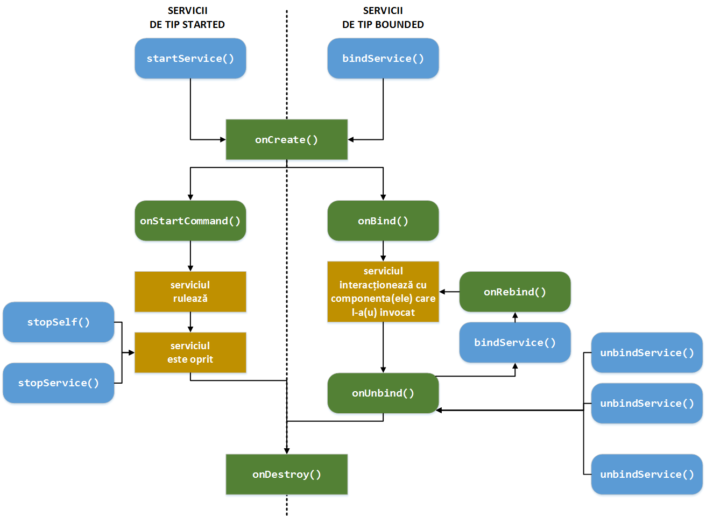

# LifeCycle

Se observă faptul că ciclul de viață al unui serviciu are loc între
metodele `onCreate()` și `onDestroy()`. De cele mai multe ori, este
necesar ca un serviciu să folosească unul sau mai multe fire de execuție
(dedicate) astfel încât să nu influențeze responsivitatea aplicației
Android. Într-o astfel de situație, firul de execuție va fi pornit pe
metoda `onCreate()` și va fi oprit pe metoda `onDestroy()`. De asemenea,
în cadrul metodei `onCreate()` au loc diferite operații de configurare
(inițializări), în timp ce în cadrul metodei `onDestroy()` realizează
eliberarea resurselor folosite. Metodele `onCreate()` și `onDestroy()`
sunt invocate pentru toate tipurile de servicii, atât pentru cele de tip
started, cât și pentru cele de tip bounded.

În cazul unui serviciu de tip started, perioada activă din ciclul de
viață este cuprinsă între apelul metodei `onStartCommand()` (apelată în
mod automat atunci când o componentă apelează metoda `startService()`,
primind ca argument obiectul de tip `Intent` care a fost folosit la
invocarea sa) și apelul metodei `onDestroy()` (apelat atunci când
serviciul este oprit, prin intermediul uneia dintre metodele
`stopSelf()` sau `stopService()`).

În cazul unui serviciu de tip bounded, perioada activă din ciclul de
viață este cuprinsă între apelul metodei `onBind()` (apelată în mod
automat atunci când o componentă apelează metoda `bindService()`,
primind ca argument obiectul de tip `Intent` care a fost folosit la
invocarea sa) și apelul metodei `onUnbind()` (apelată în mod automat
atunci când toate componentele asociate serviciului au apelat metoda
`unbindService()`).