# Laborator 06. Comunicația prin Sockeți în Android

## Realizarea Conexiunii între o Mașină Fizică și Dispozitivul Mobil

Pentru a putea comunica prin intermediul unui socket TCP, o mașină
fizică și dispozitivul mobil trebuie să se găsească în aceeași rețea,
astfel încât adresele IP ale acestora să fie vizibile între ele.

#### Comenzi utile

-    `vbox86p:/ # ip ro 
    172.16.4.0/22 dev eth1  proto kernel  scope link  src 172.16.7.89 
    192.168.57.0/24 dev eth0  proto kernel  scope link  src 192.168.57.101 
    ` interfețele, adresele, rutele (în telefon sau emulator)
-   `student@eg106:~$ ip ro
    default via 172.16.7.254 dev eno1 proto dhcp metric 100 
    169.254.0.0/16 dev eno1 scope link metric 1000 
    172.16.4.0/22 dev eno1 proto kernel scope link src 172.16.7.36 metric 100 
    172.16.101.0/24 dev vmnet1 proto kernel scope link src 172.16.101.1 
    192.168.57.0/24 dev vboxnet1 proto kernel scope link src 192.168.57.1 
    ` interfețele, adresele, rutele (mașina de dezvoltare Linux)
-   `netstat -rn` interfețele, adresele, rutele (mașina de dezvoltare
    OSX)
-   `ipconfig` interfețele, adresele, rutele (în telefon sau emulator)

### Dispozitiv Fizic

O mașină fizică și un dispozitiv fizic pot comunica:

1.  prin plasarea lor în aceeași rețea fără fir (WiFi), având adresele
    IP furnizate de un server DHCP ce rulează pe un router;
2.  prin stabilirea unei legături punct la punct, folosind Bluetooth;
3.  printr-o conexiune de date realizată prin intermediul portului USB.

Pe telefon, se accesează *Settings* → *Wireless & Networks* → *Tethering
& portable hotspot* și se selectează opțiunea *USB Tethering*

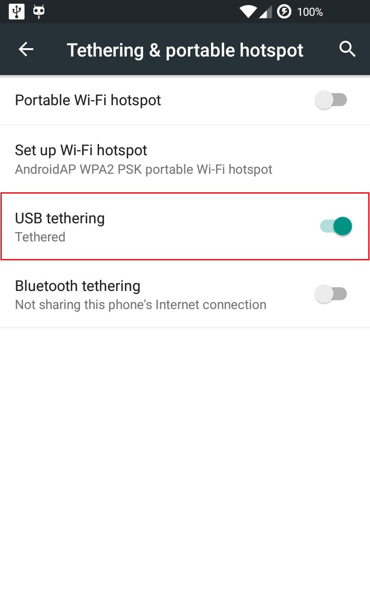

Astfel, se va activa (în mod automat) interfața `rndis0`, pentru care se
poate determina adresa Internet:

    student@eim-lab:/opt/android-sdk-linux/platform-tools$ ./adb devices
    List of devices attached
    0019531d59461f    device
    student@eim-lab:/opt/android-sdk-linux/platform-tools$ ./adb -s 0019531d59461f shell
    shell@n7000:/ $ su
    su
    shell@n7000:/ # ifconfig rndis0
    ifconfig rndis0
    rndis0: ip 192.168.42.129 mask 255.255.255.0 flags [up broadcast running multicast]
    shell@n7000:/ #

---
**Note**

Pe Linux, în situația în care dispozitivul mobil este
detectat, fără a se indica tipul său, este necesar să se pornească
serverul de ADB cu drepturi de administrator:

    student@eim-lab:/opt/android-sdk-linux/platform-tools$ ./adb devices
    List of devices attached
    0019531d59461f    ????????????
    student@eim-lab:/opt/android-sdk-linux/platform-tools$ sudo ./adb kill-server
    student@eim-lab:/opt/android-sdk-linux/platform-tools$ sudo ./adb start-server
    student@eim-lab:/opt/android-sdk-linux/platform-tools$ sudo ./adb devices
    List of devices attached
    0019531d59461f    device

Pentru dispozitivele care nu permit conectarea cu `adb shell` în modul
tethering se aplică [soluția prezentată pe
stackoverflow](http:*stackoverflow.com/questions/9210152/set-up-device-for-development-no-permissions):
trebuie creat în Ubuntu fișierul `/etc/udev/rules.d/51-android.rules` și
adăugat codul obținut cu `lsusb` pentru fabricantul telefonului. Odată
dispozitivul de rețea obținut (de exemplu `rndis0`), se folosește
`dhclient rndis0` pentru a obține o adresă IP de la telefon.

Pe Windows, dacă dispozitivul mobil nu este detectat, poate fi necesară
instalarea unor drivere suplimentare pentru stabilirea legăturii prin
intermediul portului USB. \

---

Ulterior, se determină adresa Internet a mașinii fizice, asociată
interfeței `usb0` (Linux), respectiv Ethernet (Windows).

**Linux**

    student@eim-lab:~$ sudo ifconfig usb0
    usb0      Link encap:Ethernet  HWaddr 32:ca:4b:1c:ff:7b 
              inet addr:192.168.42.170  Bcast:192.168.42.255  Mask:255.255.255.0
              inet6 addr: fe80::30ca:4bff:fe1c:ff7b/64 Scope:Link
              UP BROADCAST RUNNING MULTICAST  MTU:1500  Metric:1
              RX packets:109 errors:0 dropped:0 overruns:0 frame:0
              TX packets:319 errors:0 dropped:0 overruns:0 carrier:0
              collisions:0 txqueuelen:1000
              RX bytes:24103 (23.5 KiB)  TX bytes:64369 (62.8 KiB)

**Windows**

    C:\Program Files (x86)\Android\android-sdk\platform-tools>ipconfig

    Windows IP Configuration


    Ethernet adapter Local Area Connection:

       Connection-specific DNS Suffix  . :
       Link-local IPv6 Address . . . . . : fe80::18bf:d0be:3625:6b1%44
       IPv4 Address. . . . . . . . . . . : 192.168.42.81
       Subnet Mask . . . . . . . . . . . : 255.255.255.0
       Default Gateway . . . . . . . . . : 192.168.42.129

### Dispozitiv Virtual (Emulator)

#### Android Virtual Device

Fiecare instanță a unui dispozitiv virtual Android oferă o pereche de
porturi pentru diferite conexiuni:

-   un port de consolă, prin intermediul căruia este permis accesul prin
    telnet pentru execuția de diverse comenzi;
-   un port pentru `adb`.

Numerele folosite pentru aceste porturi sunt succesive. Implicit,
numerotarea porturilor începe de la 5554 (portul de consolă) / 5555
(portul adb). Determinarea portului poate fi realizată:

-   prin inspectarea ferestrei în care este afișat emulatorul, având
    forma *Android Emulator (55nr)*, unde nr poate lua valori cuprinse
    între 54 și 87 (doar valori impare - pentru portul de consolă,
    valorile pare fiind rezervate pentru portul adb); astfel, sunt
    suportate maxim 16 instanțe de dispozitive virtuale Android
    simultan;


-   prin rularea comenzii `adb devices`
    ```bash
    student@eim-lab:/opt/android-sdk-linux/platform-tools$ ./adb devices
    List of devices attached
    emulator-5554   device
    ```

Conectarea la consola dispozitivului virtual Android se face prin
comanda: `student@eim-lab:~$ telnet localhost 55nr`
 specificându-se portul pe care rulează emulatorul.

---
**Note**

 Este necesară și autentificarea pe dispozitivul
virtual respectiv, folosind o cheie care a fost instalată odată cu
acesta, a cărei locație este indicată. În acest sens, se folosește
comanda `auth`, urmată de cheia dispozitivului virtual. Cheia se află în
~/.emulator_console_auth_token

---

În consolă, realizarea unei legături între mașina fizică și dispozitivul
virtual Android se face prin [redirectarea
portului](http:*developer.android.com/tools/help/emulator.html#redirection),
folosind comanda `redir`, aceasta suportând mai multe opțiuni:

-   `list`;
-   `add`;
-   `del`.

<table>
<thead>
<tr class="header">
<th><strong>OPȚIUNE</strong></th>
<th><strong>DESCRIERE</strong></th>
</tr>
</thead>
<tbody>
<tr class="odd">
<td><code>list</code></td>
<td>afișează toate redirectările de port folosite la momentul respectiv</td>
</tr>
<tr class="even">
<td><code>add &lt;protocol&gt;:&lt;port_masina_fizica&gt;:&lt;port_dispozitiv_virtual&gt;</code></td>
<td>adaugă o redirectare de port<br />
✔ <code>&lt;protocol&gt;</code> poate avea doar valorile <code>tcp</code> sau <code>udp</code><br />
✔ <code>&lt;port_masina_fizica&gt;</code> reprezintă numărul portului utilizat pe mașina fizică<br />
✔ <code>&lt;port_dizpozitiv_virtual&gt;</code> reprezintă numărul portului de pe dispozitivul virtual spre care vor fi redirecționate datele<br />
</td>
</tr>
<tr class="odd">
<td><code>del &lt;protocol&gt;:&lt;port_masina_fizica&gt;</code></td>
<td>șterge o redirectare de port</td>
</tr>
</tbody>
</table>

**Exemplu**

    student@eim-lab:~$ telnet localhost 5554
    Android Console: type 'help' for a list of commands
    OK
    redir add tcp:2000:4000
    OK
    redir list
    tcp:2000  => 4000
    OK
    redir del tcp:2000
    OK
    redir list
    no active redirections
    OK
    exit
    Connection to host lost.
    student@eim-lab:~$

## Mecanisme pentru Comunicația prin Rețea în Android

Comunicația între mai multe dispozitive poate fi realizată:

1.  prin metode generale, disponibile la nivelul platformei Java:
    1.  sockeți TCP, a căror funcționalitate este implementată în
        pachetul
        [java.net](https:*docs.oracle.com/javase/8/docs/api/index.html),
        oferind acces la cele mai multe operații ce implică programarea
        de rețea (atât server, cât și client);
    2.  clasa
        [HttpURLConnection](https:*docs.oracle.com/javase/8/docs/api/java/net/HttpURLConnection.html),
        prin care este facilitat accesul la servere care folosesc
        protocolul `http`;
2.  prin mecanisme specifice Android:
    1.  clasa
        [HttpClient](http:*developer.android.com/reference/android/net/http/AndroidHttpClient.html)
        permite posibilitatea de a descărca un conținut disponibil la o
        anumită adresă Internet, identificată printr-un URL;
    2.  clasa
        [JSONObject](http:*developer.android.com/reference/org/json/JSONObject.html)
        este utilizată pentru gestiunea datelor în format JSON.

---
**Note**

De regulă, o aplicație Android nu are acces la
comunicația prin rețea decât prin intermediul unei permisiuni speciale:
```xml
<manifest ...>
  <!-- other application properties or components -->
  <uses-permission
    android:name="android.permission.INTERNET" />
  <!-- other application properties or components --> 
</manifest>
```

---

## Programarea de Rețea folosind Sockeți TCP în Android

Folosirea unui socket TCP presupune comunicația între două entități:

1.  un client care se conectează la o anumită adresă, pe un anumit port, pe care le cunoaște în prealabil;
2.  un server care așteaptă să fie invocat, la o adresă și la un port.

În Android (ca și în cazul platformei Java), clasa de bază pentru
comunicația dintre client și server este
[Socket](http:*developer.android.com/reference/java/net/Socket.html).
Aceasta pune la dispoziție un flux de intrare și un flux de ieșire prin
intermediul cărora diferite entități, ale căror adrese IP sunt vizibile
între ele, pot transmite diferite date, folosind protocolul TCP. Un
socket este reprezentat de o asociere dintre o adresă și un port.

"Ascultarea" invocărilor este realizată prin intermediul clasei
[ServerSocket](http:*developer.android.com/reference/java/net/ServerSocket.html).
În momentul în care este detectată o astfel de solicitare, este creată o
nouă conexiune, reprezentată de un obiect de tip `Socket` prin care se
va realiza comunicarea. Astfel, la nivelul serverului, fiecare client
este identificat printr-o instanță proprie a unui obiect `Socket`.

### Clientul

Conexiunea unui client la un server se poate realiza numai în situația
în care sunt cunoscute adresa IP (sau denumirea, rezolvată apoi prin
intermediul DNS) și portul la care acesta așteaptă să fie invocat.
Aceste valori sunt transmise ca parametrii în constructorul obiectului
`Socket`. Ulterior, operațiile de comunicație (citire / scriere) sunt
realizate prin operații pe fluxuri de intrare (`InputStream`) și pe
fluxuri de ieșire (`OutputStream`).

Așadar, comunicația prin intermediul unui obiect de tip `Socket`
presupune următorii pași:

**1.** deschiderea unui socket, prin transmiterea parametrilor de
identificare a gazdei (adresă IP / denumire și port) ca parametrii ai
constructorului unui obiect de tip `Socket`

``` java
String hostname = "localhost";
int port = 2000;
Socket socket = new Socket(hostname, port);
```

---
**Note**

În momentul în care se realizează o instanță a unui
obiect de tip `Socket`, pot fi generate următoarele excepții:

-   `UnknownHostException`, în situația în care se folosește o denumire
    pentru gazdă și aceasta nu poate fi rezolvată de serverul DNS
    (alternativ, poate fi furnizată chiar adresa IP, dacă este cunoscută
    în prealabil);
-   `IOException`, atunci când:
    -   conexiunea nu a fost acceptată de către server;
    -   perioada de așteptare pentru realizarea operației a fost
        depășită:
    -   s-a produs o întrerupere sau altă problemă neașteptată.

---

**2.** crearea unui flux de ieșire pentru a trimite date prin
intermediul socket-ului TCP și trimiterea efectivă a datelor:

``` java
BufferedOutputStream bufferedOutputStream = new BufferedOutputStream(socket.getOutputStream());
PrintWriter printWriter = new PrintWriter(bufferedOutputStrea, true);
```

---
**Note**

De remarcat faptul că obiectul `PrintWriter` primește
în constructor un parametru de tip `boolean` prin care se indică dacă
transmiterea efectivă a datelor este realizată sau nu în mod automat
atunci când se întâlnește caracterul `\n` (newline).\

---

Metodele implementate de clasa
[PrintWriter](http://developer.android.com/reference/java/io/PrintWriter.html)
sunt similare cu cele oferite de `PrintStream` (clasa folosită de
metodele din `System.out`), diferența fiind faptul că pot fi create mai
multe instanțe pentru seturi de caractere Unicode diferite:

-   [print()](https://developer.android.com/reference/java/io/PrintWriter.html#print(java.lang.Object));
-   [println()](https://developer.android.com/reference/java/io/PrintWriter.html#println(java.lang.Object));
-   [printf()](https://developer.android.com/reference/java/io/PrintWriter.html#printf(java.lang.String,%20java.lang.Object...));
-   [write()](https://developer.android.com/reference/java/io/PrintWriter.html#write(char[])).

Trimiterea efectivă a datelor este realizată atunci când se apelează
metoda
[flush()](https:*developer.android.com/reference/java/io/PrintWriter.html#flush())
sau automat la întâlnirea caracterului '\\n', în funcție de argumentele
cu care a fost invocat constructorul.

**3.** crearea unui flux de intrare pentru a primi date prin intermediul
socket-ului TCP și primirea efectivă a datelor:

``` java
InputStreamReader inputStreamReader = new InputStreamReader(socket.getInputStream());
BufferedReader bufferedReader = new BufferedReader(inputStreamReader);
```

Metodele implementate de clasa
[BufferedReader](http:*developer.android.com/reference/java/io/BufferedReader.html)
sunt:

-   [read()](https:*developer.android.com/reference/java/io/BufferedReader.html#read()) -
    pentru a primi un singur caracter (dacă este apelată fără
    parametrii) sau un tablou de caractere (de o anumită dimensiune,
    acestea fiind stocate într-un vector furnizat ca parametru, începând
    cu o anumită poziție);
-   [readLine()](https:*developer.android.com/reference/java/io/BufferedReader.html#readLine()) -
    pentru a primi o linie.


> Metoda `readLine()` este blocantă, așteptând un mesaj terminat prin `\n` (newline). În situația în care conexiunea este terminată, se transmite `EOF`, iar metoda întoarce valoarea `null`.

---
**Note**

Pot fi utilizate obiecte de tipul `ObjectOutputStream` și
`ObjectInputStream` pentru transmiterea de obiecte Java, atunci când
entitățile care comunică rulează în contextul unei mașini virtuale de
acest tip (JVM).

---

Se recomandă ca obținerea de referințe către fluxul de intrare respectiv
fluxul de ieșire asociate unui obiect de tip `Socket` să fie realizată
prin intermediul unor metode statice definite în cadrul unor clase
ajutător:

``` java
import java.io.BufferedReader;
import java.io.IOException;
import java.io.InputStreamReader;
import java.io.PrintWriter;
import java.net.Socket;

public class Utilities {

  public static BufferedReader getReader(Socket socket) throws IOException {
    return new BufferedReader(new InputStreamReader(socket.getInputStream()));
  }
  
  public static PrintWriter getWriter(Socket socket) throws IOException {
    return new PrintWriter(socket.getOutputStream(), true);
  }

}
```

**4.** închiderea obiectului `Socket`, atunci când acesta nu mai este
necesar

``` java
socket.close();
```

În momentul în care se apelează metoda `close()`, sunt transmise și
datele care erau stocate în zonele de memorie tampon.


### Utilizarea unui Fir de Execuție Dedicat pentru Comunicația prin Rețea

Începând cu nivelul de API 11 (Android 3.0 Honeycomb), nu este permisă
comunicația prin rețea pe același fir de execuție folosit pentru
interfața grafică și pentru interacțiunea cu utilizatorul (*eng.* UI
Thread), întrucât unele operații realizate în acest context sunt
blocante, astfel încât experiența folosirii aplicației Android ar fi
afectată. O astfel de tentativă va fi sancționată prin generarea unei
excepții de tip
[NetworkOnMainThreadException](http:*developer.android.com/reference/android/os/NetworkOnMainThreadException.html).
Din acest motiv, orice operație ce presupune folosirea unor sockeți TCP
trebuie realizată pe un fir de execuție dedicat.

Trebuie avut în vedere faptul că pe firul de execuție dedicat
comunicației prin rețea NU pot fi actualizate informațiile asociate
controalelor grafice, excepția generată în această situație fiind
[CalledFromWrongThreadException](http:*developer.android.com/tools/testing/activity_testing.html#UITestTroubleshooting).
Explicația este dată în mesajul care însoțește această excepție: numai
firul de execuție în care a fost instanțiat un control grafic (obiect de
tip `android.view.View`) are dreptul de a realiza modificări asupra
acestuia (*Only the original thread that created a view hierarchy can
touch its views*). În această situație, accesul la firul de execuție pe
care este gestionată interfața grafică poate fi obținut în mai multe
moduri:

1.  folosind metoda
    [runOnUiThread(Runnable)](http://developer.android.com/reference/android/app/Activity.html#runOnUiThread%28java.lang.Runnable%29),
    disponibilă în clasa `Activity`;
2.  folosind una din metodele
    [post(Runnable)](http://developer.android.com/reference/android/view/View.html#post%28java.lang.Runnable%29)
    sau [postDelayed(Runnable,
    long)](http:*developer.android.com/reference/android/view/View.html#postDelayed%28java.lang.Runnable,%20long%29)
    disponibile:
    1.  în clasa `android.view.View`, pentru fiecare control grafic care
        se dorește a fi accesat;
    2.  în clasa `android.os.Handler`, dacă se dorește accesarea mai
        multor controale grafice (fiind necesar ca instanțierea
        obiectului să fie realizată tot pe firul care gestionează
        interfața grafică);
3.  folosind un obiect de tip
    [AsyncTask](http:*developer.android.com/reference/android/os/AsyncTask.html),
    procesarea în rețea putând fi realizată în metoda
    `doInBackground()`, iar accesul la obiectele interfeței grafice
    fiind acordat în metodele `onProgressUpdate()` (invocată în mod
    automat de fiecare dată când se apelează metoda `publishProgress()`)
    și `onPostExecute()`.

``` java
// VARIANTA 1
   doInBackground{ /*** Net thread ***/
      socket();
      ... 
      socket.close();
      return result
    } 

    onPostExecute(String result) { /*** GUI thread ***/
      daytimeProtocolTextView.setText(result);
    }
  
// VARIANTA 2 
   doInBackground{ /*** Net thread ***/
      socket..
      publishProgress(line); 
      publishProgress(line); 
      ...
      socket.close();
      return null;
   } 
   
    onProgressUpdate(String... progres) { /*** GUI thread ***/
        welcomeMessageTextView.append(progres[0] + "\n");
    }

    onPostExecute(Void result) {} /*** GUI thread ***/
```

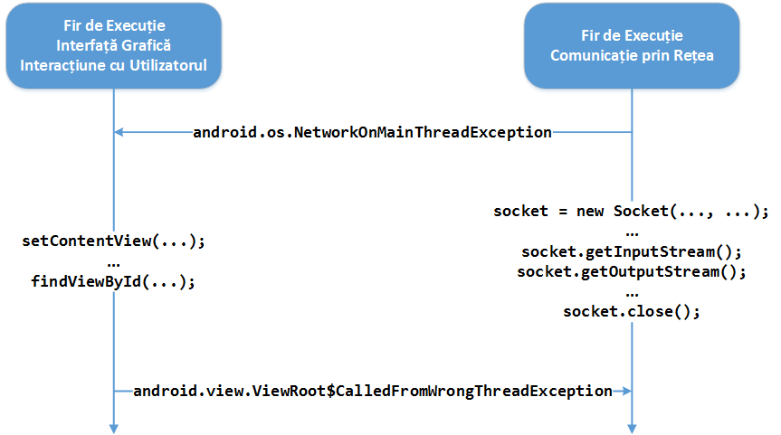

#### Exemplu

Se dorește interogarea serverului National Institute of Standards &
Technology, care oferă un serviciu de interogare a datei și orei
curente, cu o precizie ridicată, conform [Daytime Protocol
(RFC-867)](https:*tools.ietf.org/html/rfc867).

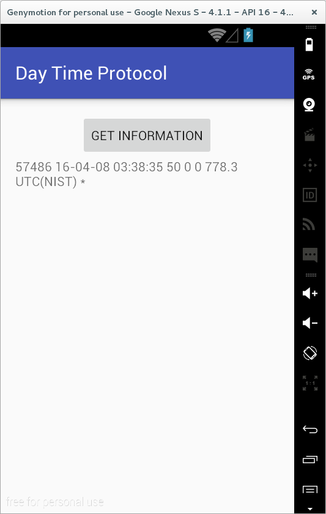

În acest sens, se va deschide un socket TCP, prin interogarea serverului
disponibil la adresa [](utcnist.colorado.edu), pe portul 13, în cadrul
unui fir de execuție separat (clasa `NISTCommunicationThread`). Întrucât
nu este necesară decât operația de primire a unor date, se va crea doar
un obiect de tip `BufferedReader`, citindu-se două linii (una fiind
vidă - așadar ignorată, cealaltă conținând informațiile necesare, care
se doresc a fi afișate). Întrucât modificarea conținutului unui control
grafic nu poate fi realizată decât din contextul firului de execuție în
care a fost creat, acesta va fi obținut prin parametrul metodei `post()`
a obiectului respectiv, doar aici fiind permisă asocierea conținutului
solicitat. În momentul în care datele au fost preluate, socket-ul TCP
poate fi închis. Pe fiecare eveniment de tip apăsare a butonului se va
crea un fir de execuție dedicat în care se va instanția un obiect de tip
`Socket`.

De remarcat faptul că obiectele interfeței grafice sunt definite ca
membrii protejați ai clasei activitate, întrucât accesul acestea trebuie
să poată fi accesate și din clasele interne, fără a se mai obține
referința către ele prin metoda `findViewById()`, care depreciază
performanțele aplicației Android.

``` java
package ro.pub.cs.systems.eim.lab06.daytimeprotocol.views;

import android.os.AsyncTask;
import android.support.v7.app.AppCompatActivity;
import android.os.Bundle;
import android.util.Log;
import android.view.View;
import android.widget.Button;
import android.widget.TextView;

import java.io.BufferedReader;
import java.io.IOException;
import java.net.Socket;
import java.net.UnknownHostException;

import ro.pub.cs.systems.eim.lab06.daytimeprotocol.R;
import ro.pub.cs.systems.eim.lab06.daytimeprotocol.general.Constants;
import ro.pub.cs.systems.eim.lab06.daytimeprotocol.general.Utilities;

public class DayTimeProtocolActivity extends AppCompatActivity {

  private Button getInformationButton;
  private TextView daytimeProtocolTextView;

  private class NISTCommunicationAsyncTask extends AsyncTask<Void, Void, String> {

    @Override
    protected String doInBackground(Void... params) {
      String dayTimeProtocol = null;
      try {
        Socket socket = new Socket(Constants.NIST_SERVER_HOST, Constants.NIST_SERVER_PORT);
        BufferedReader bufferedReader = Utilities.getReader(socket);
        bufferedReader.readLine();
        dayTimeProtocol = bufferedReader.readLine();
        Log.d(Constants.TAG, "The server returned: " + dayTimeProtocol);
      } catch (UnknownHostException unknownHostException) {
        Log.d(Constants.TAG, unknownHostException.getMessage());
        if (Constants.DEBUG) {
          unknownHostException.printStackTrace();
        }
      } catch (IOException ioException) {
        Log.d(Constants.TAG, ioException.getMessage());
        if (Constants.DEBUG) {
          ioException.printStackTrace();
        }
      }
      return dayTimeProtocol;
    }

    @Override
    protected void onPostExecute(String result) {
      daytimeProtocolTextView.setText(result);
    }
  }

  private ButtonClickListener buttonClickListener = new ButtonClickListener();
  private class ButtonClickListener implements Button.OnClickListener {

    @Override
    public void onClick(View view) {
      NISTCommunicationAsyncTask nistCommunicationAsyncTask = new NISTCommunicationAsyncTask();
      nistCommunicationAsyncTask.execute();
    }

  }

  @Override
  protected void onCreate(Bundle savedInstanceState) {
    super.onCreate(savedInstanceState);
    setContentView(R.layout.activity_day_time_protocol);

    daytimeProtocolTextView = (TextView)findViewById(R.id.daytime_protocol_text_view);

    getInformationButton = (Button)findViewById(R.id.get_information_button);
    getInformationButton.setOnClickListener(buttonClickListener);
  }
}
```

### Serverul

Un sever poate "aștepta" conexiuni de clienți prin intermediul unei
instanțe a clasei
[ServerSocket](http:*developer.android.com/reference/java/net/ServerSocket.html),
care poate primi ca parametri:

-   un port - dacă nu este specificat (sau se transmite valoarea 0),
    sistemul de operare va genera o astfel de valoare (care poate fi
    obținută ulterior prin metoda `getLocalPort()`;
-   o valoare întreagă, resprezentând numărul maxim de conexiuni care
    pot aștepta în coadă, la un moment dat;
-   o adresă - dacă nu este furnizată se folosește adresa mașinii /
    dispozitivului pe care a fost rulată, putând fi obținută prin metoda
    `getInetAddress()`.

> Se recomandă să se utilizeze un port cu o valoare în afara celor rezervate (0 - 1023). Totuși, folosirea acestor porturi este posibilă în cazul dispozitivele mobile pentru care există drepturi de root, după ce se acordă drepturi privilegiate aplicației Android.


Pentru ca un client să se poată conecta la server, pe obiectul
`ServerSocket` trebuie să se apeleze metoda
[accept()](http://developer.android.com/reference/java/net/ServerSocket.html#accept%28%29),
care se blochează ascultând invocările care ar putea fi realizate. În
momentul în care este detectată o solicitare, metoda o tratează,
returnând un obiect de tip `Socket` prin care este realizată comunicarea
propriu-zisă.

De obicei, un server invocă metoda `accept()` într-o buclă, atâta timp
cât se află în execuție. În momentul în care a fost obținut un obiect de
tip `Socket`, se recomandă ca acesta să fie transmis unui alt fir de
execuție care să gestioneze comunicația cu clientul, în caz contrar
putându-se înregistra latențe în tratarea altor solicitări de conexiune.
Mai mult, având în vedere faptul că acestea sunt plasate într-un obiect
de tip coadă (FIFO), în momentul în care aceasta este completată, nu vor
mai fi acceptate alte cereri de conexiune, acestea fiind respinse cu
motivul *Connection refused*.

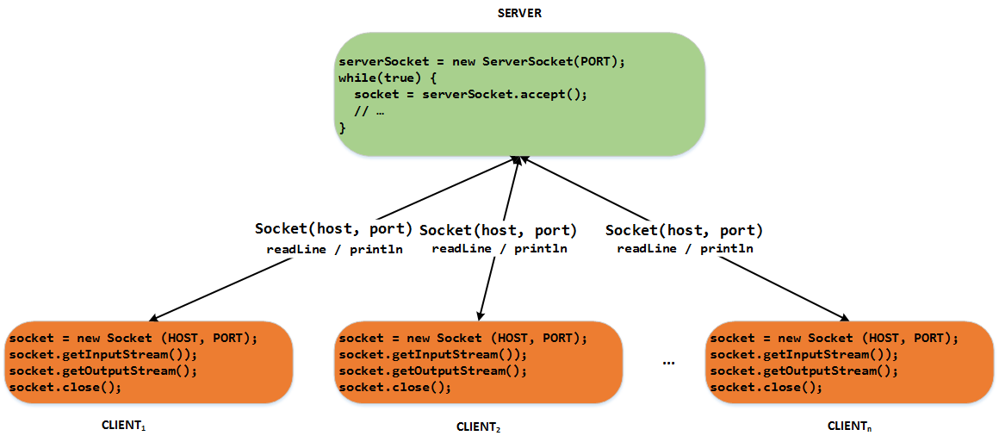

### Exemplu 1. Server cu un sigur fir de execuție

Se implementează o aplicație Android cu un singur câmp text prin care se
controlează:

-   diferite operații asupra serverului:
    -   pornire: se transmite șirul de caractere `Start Server`;
    -   oprire: se transmite șirul de caractere `Stop Server`;
-   mesajul care va fi transmis clienților care se conectează.

Astfel, serverul va accepta invocări de la clienți între momentele la
care s-au introdus șirurile de caractere `Start Server`, respectiv
`Stop Server`. Cât timp serverul este activ (ascultă solicitări de la
clienți), se pot specifica orice valoare în câmpul text, acesta fiind
transmis prin intermediul canalului de comunicație.

``` xml
<LinearLayout xmlns:android="http:*schemas.android.com/apk/res/android"
  xmlns:tools="http:*schemas.android.com/tools"
  android:layout_width="match_parent"
  android:layout_height="match_parent"
  android:orientation="vertical"
  tools:context="ro.pub.cs.systems.eim.lab06.singlethreadedserver.views.SingleThreadedActivity" >
    
  <EditText
    android:id="@+id/server_text_edit_text"
    android:layout_width="match_parent"
    android:layout_height="wrap_content"
    android:inputType="text" />

</LinearLayout>
```

În momentul în care se pornește serverul, se deschide un obiect de tipul
`ServerSocket`. Ulterior, în cadrul unui ciclu, se așteaptă invocări de
la clienți, prin intermediul metodei `accept()`, care deschide un obiect
`Socket` prin intermediul căruia se transmite textul stocat în controlul
grafic corespunzător (după ce se obține fluxul de ieșire atașat). Se
impune închiderea canalului de comunicație după ce acesta nu mai este
necesar.

În momentul în care se oprește serverul, se închide obiectul de tipul
`ServerSocket`, ceea ce va genera o excepție `java.net.SocketException`
în cadrul metodei blocante `accept()`, invalidându-se și condiția care
asigura execuția ciclului pe care erau tratate solicitările de conexiune
provenite de la clienți.

> Repornirea serverului, astfel încât să accepte din nou invocări de la clienți, presupune crearea unui nou fir de execuție (cel vechi nu poate fi refolosit).


``` java
import java.io.IOException;
import java.io.PrintWriter;
import java.net.ServerSocket;
import java.net.Socket;

import android.app.Activity;
import android.os.Bundle;
import android.text.Editable;
import android.text.TextWatcher;
import android.util.Log;
import android.view.Menu;
import android.view.MenuItem;
import android.widget.EditText;

public class SingleThreadedActivity extends Activity {

  private EditText serverTextEditText;
    
  private ServerThread singleThreadedServer;
    
  private ServerTextContentWatcher serverTextContentWatcher = new ServerTextContentWatcher();
  private class ServerTextContentWatcher implements TextWatcher {

    @Override
    public void beforeTextChanged(CharSequence charSequence, int start, int count, int after) {
    }
    
    @Override
    public void onTextChanged(CharSequence charSequence, int start, int before, int count) {
      if (charSequence.toString().equals(Constants.SERVER_START)) {
        singleThreadedServer = new ServerThread();
        singleThreadedServer.startServer();
      }
      if (charSequence.toString().equals(Constants.SERVER_STOP)) {
        singleThreadedServer.stopServer();
      }
    }
    
    @Override
    public void afterTextChanged(Editable editable) {
    }
  
  }
  
  private class ServerThread extends Thread {
  
    private boolean isRunning;
    
    private ServerSocket serverSocket;
    
    public void startServer() {
      isRunning = true;
      start();
    }
    
    public void stopServer() {
      isRunning = false;
      new Thread(new Runnable() {
        @Override
        public void run() {
          try {
            if (serverSocket != null) {
              serverSocket.close();
            }
            Log.v(Constants.TAG, "stopServer() method invoked "+serverSocket);
          } catch(IOException ioException) {
            Log.e(Constants.TAG, "An exception has occurred: "+ioException.getMessage());
            if (Constants.DEBUG) {
              ioException.printStackTrace();
            }
          }
        }
      }).start();
    }
    
    @Override
    public void run() {
      try {
        serverSocket = new ServerSocket(Constants.SERVER_PORT);
        while (isRunning) {
          Socket socket = serverSocket.accept();
          Log.v(Constants.TAG, "Connection opened with "+socket.getInetAddress()+":"+socket.getLocalPort());
          PrintWriter printWriter = Utilities.getWriter(socket);
          printWriter.println(serverTextEditText.getText().toString());
          socket.close();
          Log.v(Constants.TAG, "Connection closed");
        }
      } catch (IOException ioException) {
        Log.e(Constants.TAG, "An exception has occurred: "+ioException.getMessage());
        if (Constants.DEBUG) {
          ioException.printStackTrace();
        }
      }
    }
  }
  
  @Override
  protected void onCreate(Bundle savedInstanceState) {
    super.onCreate(savedInstanceState);
    setContentView(R.layout.activity_single_threaded);  
    
    serverTextEditText = (EditText)findViewById(R.id.server_text_edit_text);
    serverTextEditText.addTextChangedListener(serverTextContentWatcher);
  }

}
```

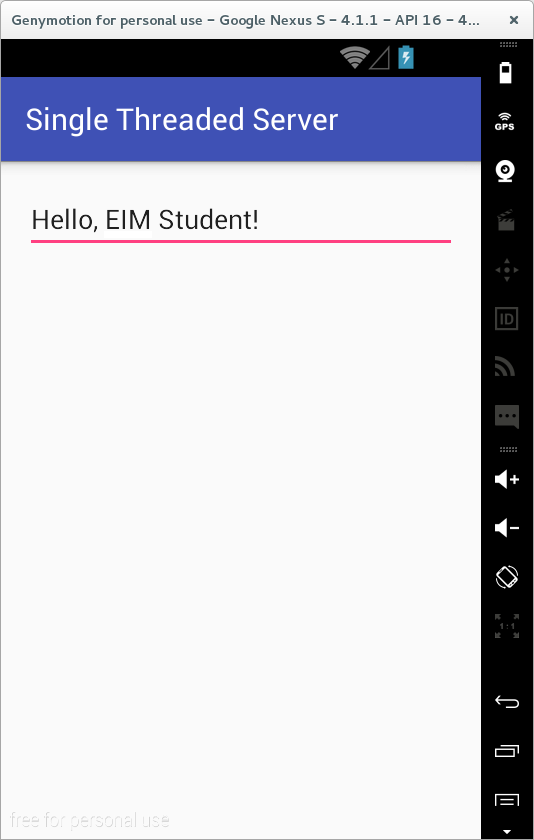

Prin intermediul utilitarului `nc` (apelat cu adresa Internet și portul
serverului) se poate interoga mesajul care a fost transmis. De asemenea,
comanda `time` măsoară timpul în care a fost executată operația
respectivă.
 ---
**Note**

Atenție, trebuie folosită versiunea
nc.traditional, varianta nc.openbsd poate avea switch-uri diferite.
Folosiți comanda `` ls -l `which nc` `` \

--- pentru a afla varianta
folosită implicit.

    student@eim-lab:~$ nc 172.16.7.89 2000
    Hello, EIM Student!
    student@eim-lab:~$ time nc 172.16.7.89 2000
    Hello, EIM Student!

    real    0m0.009s
    user    0m0.000s
    sys     0m0.000s

Există și în Android o variantă simplificată de nc, care poate fi
apelată folosind busybox:

    busybox nc ftp.ngc.com 21 
    busybox nc -l -p 5000

Fiecare comunicație dintre client și server este tratată secvențial,
ceea ce poate determina latențe semnificative în cazul în care sunt
înregistrate mai multe solicitări de acest tip concomitent.

De asemenea, în momentul în care coada în care sunt stocate este
completată, o cerere poate fi refuzată.

### Exemplu 2. Server cu fire de execuție dedicate pentru fiecare canal de comunicație în parte

Pentru ca serverul să poată trata corespunzător solicitările venite de
la clienți, fără a se înregistra latențe semnificative sau cereri
refuzate, mai ales în situația în care traficul prin canalul de
comunicație cu fiecare dintre aceștia este intens, se impune definirea
mai multor fire de execuție:

-   un fir de execuție pe care serverul așteaptă invocările;
-   câte un fir de execuție pentru comunicația cu fiecare client în
    parte.

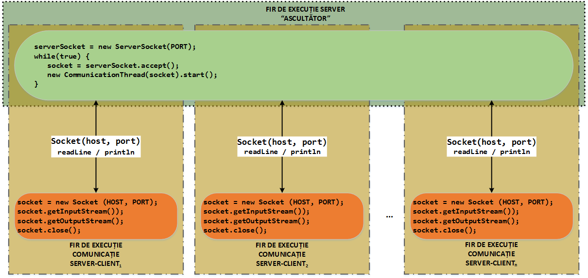

Astfel, atunci când este înregistrată o solicitare venită din partea
unui client (metoda `accept()` furnizează un obiect `Socket`
corespunzător canalului de comunicație), se creează un fir de execuție
care va gestiona comunicația dintre client și server, fără ca aceasta să
aibă un impact asupra capacității serverului de a răspunde la alte
cereri, venite din partea altor clienți, și asupra comunicației dintre
acestea.

``` java
private class CommunicationThread extends Thread {
  private Socket socket;
  
  public CommunicationThread(Socket socket) {
    this.socket = socket;
  }
  
  @Override
  public void run() {
    try {
      Log.v(Constants.TAG, "Connection opened with "+socket.getInetAddress()+":"+socket.getLocalPort());
      PrintWriter printWriter = Utilities.getWriter(socket);
      printWriter.println(serverTextEditText.getText().toString());
      socket.close();
      Log.v(Constants.TAG, "Connection closed");
    } catch (IOException ioException) {
      Log.e(Constants.TAG, "An exception has occurred: "+ioException.getMessage());
      if (Constants.DEBUG) {
        ioException.printStackTrace();
      }
    }
  }
}

private class ServerThread extends Thread {
  private boolean isRunning;
  
  private ServerSocket serverSocket;
  
  public void startServer() {
    isRunning = true;
    start();
  }
  
  public void stopServer() {
    isRunning = false;
    new Thread(new Runnable() {
      @Override
      public void run() {
        try {
          if (serverSocket != null) {
            serverSocket.close();
          }
          Log.v(Constants.TAG, "stopServer() method invoked "+serverSocket);
        } catch(IOException ioException) {
          Log.e(Constants.TAG, "An exception has occurred: "+ioException.getMessage());
          if (Constants.DEBUG) {
            ioException.printStackTrace();
          }
        }
      }
    }).start();
  }
  
  @Override
  public void run() {
    try {
      serverSocket = new ServerSocket(Constants.SERVER_PORT);
      while (isRunning) {
        Socket socket = serverSocket.accept();
        new CommunicationThread(socket).start();
      }
    } catch (IOException ioException) {
      Log.e(Constants.TAG, "An exception has occurred: "+ioException.getMessage());
      if (Constants.DEBUG) {
        ioException.printStackTrace();
      }
    }
  }
}
```

## Activitate de Laborator

**1.** Să se cloneze în directorul de pe discul local conținutul
depozitului la distanță de la
[aceasta adresa](https://www.github.com/eim-lab/Laborator06).

**2.** Să se importe în mediul integrat de dezvoltare Android Studio
proiectul `FTPServerWelcomeMessage` din directorul `labtasks`.

Se cere să se implementeze o aplicație Android care citește mesajul de
întâmpinare transmis în momentul în care se realizează o conexiune către
un server FTP.

Adresa Internet a serverului FTP la care se dorește să se realizeze
conexiunea va fi introdusă de utilizator, iar portul curent este 21
(reținut în `Constants.FTP_PORT`).

În cazul în care mesajul de întâmpinare conține mai multe linii, mesajul
este precedat de șirul de caractere `220-` (reținut în
`Constants.FTP_MULTILINE_START_CODE`). Mesajul se încheie fie cu șirul
de caractere `220`, fie cu un șir de caractere precedat de ''220 ''
(valori stocate în `Constants.FTP_MULTILINE_END_CODE1`, respectiv
`Constants.FTP_MULTILINE_END_CODE2`).


Operațiile care trebuie realizate pe metoda `doInBackground()` a firului
de execuție ce gestionează comunicația cu serverul FTP sunt:

1.  deschiderea unui socket care primește ca parametrii:
    1.  adresa Internet a serverului FTP (precizată anterior de
        utilizator, preluată din câmpul text `FTPServerAddressEditText`,
        transmis ca parametru al metodei - `params[0]`)
    2.  portul 21 (preluat din `Constants.FTP_PORT`).
2.  obținerea fluxului de intrare atașat socket-ului, printr-un apel al
    metodei `Utilities.getBufferedReader()`;
3.  citirea unei linii de pe fluxul de intrare:
    1.  dacă aceasta începe cu șirul de caractere `220-` (preluat din
        `Constants.FTP_MULTILINE_START_CODE`), mesajul este analizat;
        1.  se citesc linii de pe fluxul de intrare atașat socket-ului
            cât timp valoarea:
            1.  nu este egală cu `220` (preluat din
                `Constants.FTP_MULTILINE_END_CODE1`);
            2.  nu începe cu ''220 '' (preluat din
                `Constants.FTP_MULTILINE_END_CODE2`);
        2.  valoarea primită de la serverul FTP este inclusă în câmpul
            text `welcomeMEssageTextView` (informația se transmite, pe
            măsură ce este primită, prin metoda `publishProgress()` care
            face să se invoce automat metoda de callback
            `onProgressUpdate()` executată pe firul de execuție
            principal al aplicației Android, la care se oferă acces la
            controalele grafice);
    2.  altfel, mesajul este ignorat.
4.  închiderea socket-ului.

Să se verifice mesajul afișat în momentul în care se realizează o
conexiune la serverul [](intranet.ngcaerospace.com/).

**3.** Să se importe în mediul integrat de dezvoltare Android Studio
proiectul `SingleThreadedServer` din directorul `labtasks`.

Acesta reprezintă o aplicație Android care implementează un server ce
ascultă pe un port (2000, în `Constants.SERVER_PORT`) solicitări de
conexiune provenite de la clienți.

Pe același fir de execuție pe care se face așteptarea, este realizată și
transmiterea mesajului către client, preluat dintr-un câmp text.

Pornirea serverului se face prin introducerea în câmpul text a șirului
de caractere `Start Server`.

Oprirea serverului se face prin introducerea în câmpul text a șirului de
caractere `Stop Server`.

Preluarea invocărilor de la clienți este realizată doar atâta timp cât
serverul se află în execuție.

### Linux

Citirea mesajelor se face cu `nc` care primește ca parametrii adresa
Internet și portul serverului de pe dispozitivul Android. Prin
utilitarul `time` se verifică durata operației respective.

```shell
student@eim-lab:~$ nc 172.16.7.89 2000
Hello, EIM Student!
student@eim-lab:~$ time nc 172.16.7.89 2000
Hello, EIM Student!

real    0m0.009s
user    0m0.000s
sys     0m0.000s
```

### Windows

Citirea mesajelor se face cu `telnet` care primește ca parametrii adresa
Internet și portul serverului de pe dispozitivul Android.

În situația în care Telnet nu este disponibil, se accesează *Control
Panel* → *Programs and Features* → *Turn Windows Features on or off*,
selectându-se produsul *Telnet Client*.

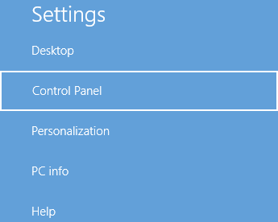

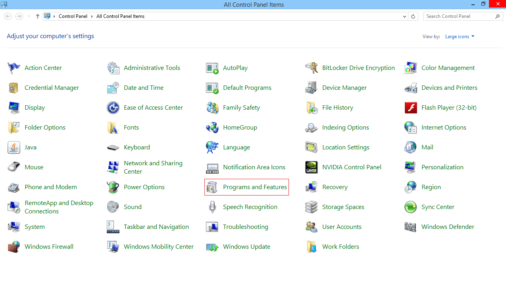


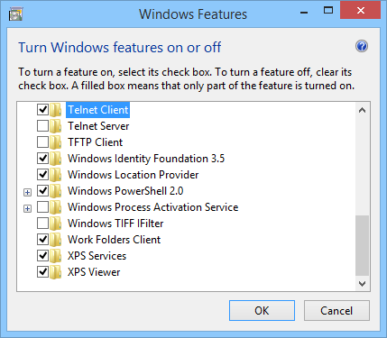

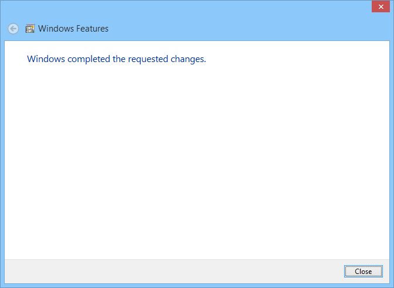

```shell
C:\Users\Student> telnet 192.168.56.101 2000
Start Server

Connection to host lost.
C:\Users\Student> telnet 192.168.56.101 2000
Connecting To 192.168.56.101...Could not open connection to the host, on port 2000: Connect failed
```
## 

**a)** Să se trimită aplicația Android în fundal prin apăsarea tastei
*Home*. Verificați conectivitatea cu serverul. De ce sunt tratate
cererile în continuare?

**b)** Să se apese tasta *Back*. De ce sunt tratate cererile în
continuare după ce aplicația Android este distrusă? Ce se întâmplă în
momentul în care se dorește să se repornească aplicația Android? Cum ar
putea fi remediată această problemă?

Indicații de Rezolvare: Aplicația Android este distrusă, însă
resursele utilizate de acestea nu sunt eliberate, motiv pentru care
serverul continuă să gestioneze solicitările primite de la clienți.

Astfel, în momentul în care se dorește să se repornească aplicația
Android, se va genera o excepție, întrucât portul pe care se dorește să
asculte serverul invocările de la clienți este deja ocupat.

```java
    04-06 00:00:00.000: E/Single Threaded Server(934): An exception has occurred: bind failed: EADDRINUSE (Address already in use)
    04-06 00:00:00.000: W/System.err(934): java.net.BindException: bind failed: EADDRINUSE (Address already in use)
    04-06 00:00:00.000: W/System.err(934):     at libcore.io.IoBridge.bind(IoBridge.java:89)
    04-06 00:00:00.000: W/System.err(934):     at java.net.PlainSocketImpl.bind(PlainSocketImpl.java:150)
    04-06 00:00:00.000: W/System.err(934):     at java.net.ServerSocket.<init>(ServerSocket.java:100)
    04-06 00:00:00.000: W/System.err(934):     at java.net.ServerSocket.<init>(ServerSocket.java:69)
```

O soluție ar putea fi eliberarea resurselor pe metoda `onDestroy()`.

``` java
@Override
public void onDestroy() {
  if (serverThread != null) {
    serverThread.stopServer();
  }
  super.onDestroy();
}
```

**c)** Să se simuleze faptul că operația de comunicare dintre client și
server durează o perioadă de timp mai mare (spre exemplu, 3 secunde). Ce
se întâmplă în momentul în care există mai multe solicitări trimise
simultan de mai mulți clienți (din console diferite)? Monitorizați
timpul de răspuns în această situație.

Indicații de Rezolvare: Metoda `Thread.sleep()`, primind ca
parametru un interval de timp (exprimat în milisecunde) simulează o
așteptare, după care execuția aplicației Android este reluată în mod
normal.

``` java
try {
  Thread.sleep(3000);
} catch (InterruptedException interruptedException) {
  Log.e(Constants.TAG, interruptedException.getMessage());
  if (Constants.DEBUG) {
    interruptedException.printStackTrace();
  }
}
```


**d)** Să se implementeze comunicația pentru fiecare conexiune dintre
client și server pe un fir de execuție separat, astfel încât pe server,
gestiunea solicitărilor provenite de la clienți să nu fie afectată.

**4.** Să se importe în mediul integrat de dezvoltare Android Studio
proiectul `ClientServerCommunication` din directorul `labtasks`.

Acesta reprezintă o aplicație Android având două fragmente, implementând
atât un server cât și un client:

1.  serverul dispune de un câmp text prin intermediul căruia:
    1.  pot fi realizate diferite operații asupra sa:
        1.  pornire, prin introducerea mesajului *Start Server*;
        2.  oprire, prin introducerea mesajului *Stop Server*.
    2.  se poate preciza un mesaj care să fie transmis către client prin
        intermediul canalului de comunicație;
2.  clientul dispune de două câmpuri text, prin care se precizează
    parametrii de conexiune la server (adresa de Internet / portul)
    precum și un buton prin intermediul căruia se realizează legătura
    propriu-zisă, fiind preluată informația din cadrul canalului de
    comunicație și afișată corespunzător.

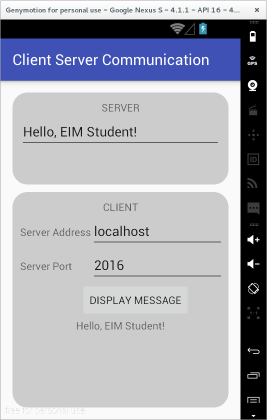

**a)** Să se implementeze funcționalitatea serverului.

În clasa `ComunicationThread`:

1.  se obține o referință către fluxul de ieșire asociat socket-ului,
    prin intermediul metodei ajutătoare `Utilities.getWriter()`;
2.  se scrie o linie conținând textul din `serverTextEditText`.

**b)** Să se implementeze funcționalitatea clientului.

În clasa `ClientAsyncTask`:

1.  se resetează conținutul câmpului text `serverMessageTextView`,
    astfel încât acesta să conțină șirul vid; acest lucru este realizat
    înainte de a rula firul de execuție dedicat, așadar pe metoda
    `onPreExecute()`;
2.  se obțin parametrii de conexiune la server (adresa de Internet,
    obținută din câmpul text `serverAddressEditText` și portul, obținut
    din câmpul text `serverPortEditText`); aceștia sunt transmiși prin
    intermediul argumentelor metodei `doInBackground()`;
3.  se deschide un socket, folosind configurația precizată de
    utilizator;
4.  se obține o referință către fluxul de intrare asociat socket-ului,
    prin intermediul metodei ajutătoare `Utilities.getReader()`;
5.  se citesc linii din contextul canalului de comunicație, atâta timp
    cât nu se întâlnește `EOF` (nu se întoarce valoarea `null`),
    valoarea fiind concatenată la câmpul text `serverMessageTextView`;
    acest lucru este realizat prin transmiterea liniilor către firul de
    execuție principal - al interfeței grafice - (unde controalele
    grafice sunt accesibile), prin intermediul metodei
    `publishProgress()` care determină apelul metodei de callback
    `onPublishProgress()`;
6.  se închide socketul.


**c)** Să se pornească serverul (se introduce textul *Start Server*). În
client, să se verifice valoarea furnizată în cazul în care se introduc
valorile `127.0.0.1` / `2000`, respectiv `localhost` / `2000`.

Să se oprească serverul (se introduce textul *Stop Server*). Să se
verifice ce valori sunt furnizate în această situație.

**d)** (doar Linux) Să se creeze o listă cu procesele care rulează la
momentul curent, textul putând fi obținut, linie cu linie, prin
intermediul unei conexiuni pe portul 2000, serverul fiind astfel simulat
pe mașina fizică.

    student@eim:~$ ps a | while read x; do echo "$x" | nc -l 2000; done

> Pe mașinile Debian, comanda `nc` se rulează cu opțiunea suplimentară `-p` pentru a se indica portul pe care se dorește ca acesta să accepte invocările.

Să se folosească clientul pentru a citi, linie cu linie, valorile
furnizate de script-ul anterior. Va trebui precizată adresa mașinii
fizice (în funcție de configurația folosită) și portul 2000

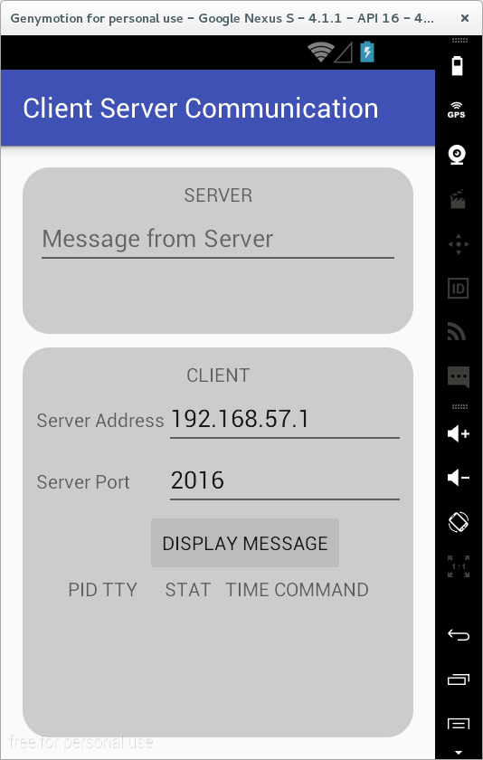
