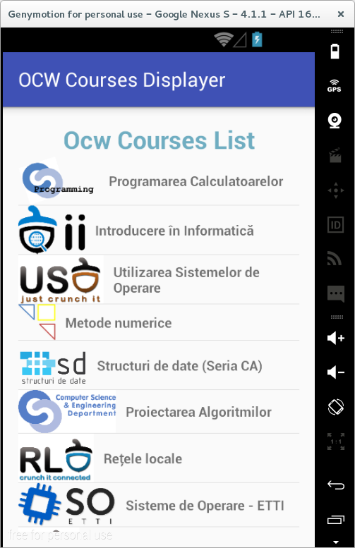

# Prelucrarea DOM (Document Object Model)

Documentele HTML au o structură arborescentă, având drept rădăcină un
document al cărui copil este o ierarhie de elemente, fiecare dintre
acestea fiind reprezentate de o etichetă.


Fiecare element poate conține mai multe atribute (fiecare dintre acestea
având o valoare asociată), putând încorpora și o valoare.

`<TipElement atribut1="valoare1" ... atributn="valoaren"> valoare </TipElement>`

Nu este însă obligatoriu ca elementul să conțină nici atribute și nici
valoare, putând avea și o structură care nu le include:

`<TipElement />`

O soluție pentru parsarea unui document HTML este reprezentată de
biblioteca [Jsoup](http://jsoup.org/packages/jsoup-1.8.2.jar).

---
**Note**

Biblioteca `jsoup-1.8.2.jar` trebuie plasată în
directorul `libs` al proiectului Android și adăugată la calea pentru
compilare (*Build Path* → *Add to Build Path...*).\

---

Pentru a intelege API-ul expus de jsoup vom studia un exemplu. Vom
lista toate materile disponibile pe platforma [Open
CourseWare](http://ocw.cs.pub.ro/courses), vizualizându-se, pentru fiecare
dintre acestea, pictograma asociată și denumirea disciplinei de învățământ.

În acest sens, se obține codul sursă al paginii HTML corespunzător,
inspectându-se elementele care conțin informațiile care se doresc a fi afișate:

-   adresa la care este stocată pictograma fiecărei discipline este
    conținută într-un element `` care are specific atributul
    `class` având valoarea `mediaright`, accesarea ei putând fi
    realizată prin intermediul proprietății `src`;
-   denumirea cursului este afișată folosind caractere îngroșate, fiind
    încapsulată în cadrul elementului `<strong>` ... `</strong>`.

Conținutul paginii Internet, sub forma unui obiect
`org.jsoup.nodes.Element`, se obține prin apelul metodei statice
`parse()` din clasa `org.jsoup.Jsoup` pe șirul de caractere ce conține
codul sursă, după care elementul rădăcină (`<html>`) este accesat ca
fiind unicul descendent direct:

```java
Element htmlTag = Jsoup.parse(pageSourceCode).child(0);
```

Lista tuturor elementelor care conțin adresele la care sunt găzduite
pictogramele disciplinelor de învâțământ se obține printr-o filtrare,
dorindu-se reținerea acelor etichete pentru care atributul `class` are
valoarea `mediaright`. Colecția astfel generată este iterată element cu
element, obținându-se apoi valoarea atributului `src`. După ce se
cunoaște adresa Internet la care se găsește imaginea respectivă, se
descarcă fluxul de intrare asociat, acesta fiind decodificat într-un
obiect `Bitmap` (după ce sunt realizate și alte operații, cum ar fi
scalarea și aplicarea transparenței).

``` java
Elements imgTagsClassMediaright = htmlTag.getElementsByAttributeValue(Constants.CLASS_ATTRIBUTE, Constants.MEDIARIGHT_VALUE);
Iterator<Element> logoIterator = imgTagsClassMediaright.iterator();
while (logoIterator.hasNext()) {
  Element imgTagClassMediaRight = logoIterator.next();
  String logoAddress = Constants.OCW_BASE_INTERNET_ADDRESS + imgTagClassMediaRight.attr(Constants.SRC_ATTRIBUTE);
  * ...
}
```

Lista tuturor denumirilor aferente obiectelor de studiu poate fi
accesată tot printr-o filtrare, menținându-se doar etichetele de tipul
`<strong>` ... `</strong>`. Pentru fiecare dintre acestea se preia
textul propriu pe care îl conțin.

``` java
Elements strongTags = htmlTag.getElementsByTag(Constants.STRONG_TAG);
Iterator<Element> nameIterator = strongTags.iterator();
while (nameIterator.hasNext()) {
  Element strongTag = nameIterator.next();
  String name = strongTag.ownText();
  * ...
}
```

Informațiile astfel obținute vor fi stocate într-un obiect de tip
adaptor asociat unei liste în cadrul căreia vor fi afișate.

Ca în cazul altor operații care implică procesări prin rețea și
actualizarea controalelor grafice pe baza datelor care au fost procesate
în acest mod, trebuie respectate următoarele reguli:

-   comunicația prin rețea se face pe un fir de execuție separat;
-   accesul la elementele din interfața grafică este permisă numai din
    contextul firului de execuție dedicat, cel care este proprietarul
    acestora.

``` java
private class OCWCoursesDisplayerAsyncTask extends AsyncTask<Void, Void, List<OCWCourseInformation>> {

  @Override
  protected List<OCWCourseInformation> doInBackground(Void... params) {
    HttpClient httpClient = new DefaultHttpClient();
    HttpGet httpGet = new HttpGet(Constants.OCW_BASE_INTERNET_ADDRESS + Constants.OCW_REFFERRENCE_INTERNET_ADDRESS);
    ResponseHandler<String> responseHandler = new BasicResponseHandler();
    List<String> logoAddressesList = new ArrayList<>();
    int logoAddressesListSize = -1;
    List<String> coursesNameList = new ArrayList();
    int coursesNameListSize = -1;
    List<OCWCourseInformation> ocwCourseInformationList = new ArrayList<>();
    int courseInformationListSize = -1;
    try {
      String pageSourceCode = httpClient.execute(httpGet, responseHandler);
      Document document = Jsoup.parse(pageSourceCode);
      Element htmlTag = document.child(0);
      Elements imgTagsClassMediaRight = htmlTag.getElementsByAttributeValue(Constants.CLASS_ATTRIBUTE, Constants.MEDIA_RIGHT_VALUE);
      Iterator<Element> logoIterator = imgTagsClassMediaRight.iterator();
      while (logoIterator.hasNext()) {
        Element imgTagClassMediaRight = logoIterator.next();
        logoAddressesList.add(Constants.OCW_BASE_INTERNET_ADDRESS + imgTagClassMediaRight.attr(Constants.SRC_ATTRIBUTE));
      }
      Elements strongTags = htmlTag.getElementsByTag(Constants.STRONG_TAG);
      Iterator<Element> nameIterator = strongTags.iterator();
      while (nameIterator.hasNext()) {
        Element strongTag = nameIterator.next();
        coursesNameList.add(strongTag.ownText());
      }
      logoAddressesListSize = logoAddressesList.size();
      coursesNameListSize = coursesNameList.size();
      if (logoAddressesListSize == coursesNameListSize) {
        courseInformationListSize = logoAddressesListSize; * = coursesNameListSize
        for (int index = 0; index < courseInformationListSize; index++) {
          OCWCourseInformation ocwCourseInformation = new OCWCourseInformation(logoAddressesList.get(index), coursesNameList.get(index));
          ocwCourseInformationList.add(ocwCourseInformation);
        }
        return ocwCourseInformationList;
      }
    } catch (ClientProtocolException clientProtocolException) {
      Log.e(Constants.TAG, clientProtocolException.getMessage());
      if (Constants.DEBUG) {
        clientProtocolException.printStackTrace();
      }
    } catch (IOException ioException) {
      Log.e(Constants.TAG, ioException.getMessage());
      if (Constants.DEBUG) {
        ioException.printStackTrace();
      }
    }
    return null;
  }

  @Override
  public void onPostExecute(List<OCWCourseInformation> ocwCourseInformationList) {
    for (final OCWCourseInformation ocwCourseInformation: ocwCourseInformationList) {
      ImageRequest profilePhotoRequest = new ImageRequest(
        ocwCourseInformation.getLogoLocation(),
        new Response.Listener<Bitmap>() {
          @Override
          public void onResponse(Bitmap bitmap) {
            ocwCourseContentList.add(new OCWCourseContent(bitmap, ocwCourseInformation.getName()));
            ocwCourseListAdapter.notifyDataSetChanged();
          }
        },
        Constants.LOGO_WIDTH,
        Constants.LOGO_HEIGHT,
        null,
        Bitmap.Config.RGB_565,
        new Response.ErrorListener() {
          public void onErrorResponse(VolleyError volleyError) {
            Log.d(Constants.TAG, volleyError.toString());
            if (Constants.DEBUG) {
              Toast.makeText(ocwCoursesListView.getContext(), ocwCoursesListView.getResources().getString(R.string.an_error_has_occurred), Toast.LENGTH_LONG)
                   .show();
            }
          }
        }
      );
      VolleyController.getInstance(ocwCoursesListView.getContext()).addToRequestQueue(profilePhotoRequest);
    }
  }
}
```

