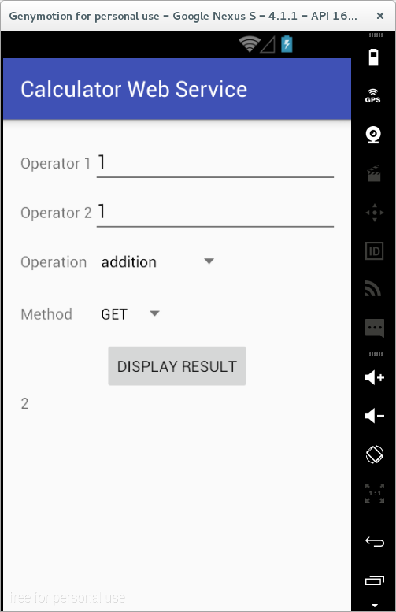

## Activitate de Laborator

**1.** În contul Github personal, să se creeze un depozit denumit
'Laborator07' in care vom pune aplicatia la care vom lucra astazi.

- Să se cloneze [scheletul laboratorului](https://github.com/eim-lab/Laborator07).
- Să se încarce conținutul descărcat în cadrul depozitului `Laborator02` de pe contul Github personal.
Ne intereseaza doar folder-ul `labtasks`.
- Să se importe în mediul integrat de dezvoltare Android Studio
proiectul `CalculatorWebService` din directorul `labtasks`.

**2a.** Din browser, vom verifica în browser funcționarea serverului
[serverului](http://jepi.cs.pub.ro/expr/)
pentru GET și POST

**2b.** Să se verifice la linia de comandă functionarea severului
```console
curl  -X  POST  --data 'operation=times&t1=9&t2=2' http://jepi.cs.pub.ro/expr/expr_post.php

curl  "http://jepi.cs.pub.ro/expr/expr_get.php?operation=times&t1=9&t2=2"
```

**2c.** Studiați implementarea serverului în php
http://jepi.cs.pub.ro/expr/

**3.** Pe baza functionalitatii serverului, se cere să se implementeze in Android un calculator, care suportă
operațiile de adunare/scădere/înmulțire/împărțire a două numere reale, pe baza
rezultatului furnizat de un serviciu web, accesibil prin HTTP, la adresele
Internet specificate în interfața `Constants`, pentru fiecare dintre metodele
suportate pentru transmiterea informațiilor:

-   `GET`: `Constants.GET_WEB_SERVICE_ADDDRESS`
-   `POST`: `Constants.POST_WEB_SERVICE_ADDRESS`

Cele două numere reale sunt specificate în cadrul unor câmpuri text. În
situația în care unul dintre acestea nu este precizat, se va afișa un
mesaj de eroare corespunzător.

Operația care se dorește a fi efectuată precum și metoda prin care vor
fi transmise informațiile către serviciul web vor putea fi selectate
prin intermediul unor liste.



Parametrii ce trebuie incluși în cadrul cererii HTTP sunt:

    operation = plus|minus|divide|times
    t1 = număr real
    t2 = număr real

Exemple:

- `GET`  
```java
    HttpGet httpGet = new HttpGet(Constants.GET_WEB_SERVICE_ADDRESS
                                  + "?" + Constants.OPERATION_ATTRIBUTE + "=" + operationsSpinner.getSelectedItem().toString()
                                  + "&" + Constants.OPERATOR1_ATTRIBUTE + "=" + operator1
                                  + "&" + Constants.OPERATOR2_ATTRIBUTE + "=" + operator2);
```

- `POST`
```java
    HttpPost httpPost = new HttpPost(Constants.POST_WEB_SERVICE_ADDRESS);
    List<NameValuePair> params = new ArrayList<NameValuePair>();        
    params.add(new BasicNameValuePair(Constants.OPERATION_ATTRIBUTE, operationsSpinner.getSelectedItem().toString()));
    params.add(new BasicNameValuePair(Constants.OPERATOR1_ATTRIBUTE, operator1));
    params.add(new BasicNameValuePair(Constants.OPERATOR2_ATTRIBUTE, operator2));
    try {
      UrlEncodedFormEntity urlEncodedFormEntity = new UrlEncodedFormEntity(params, HTTP.UTF_8);
      httpPost.setEntity(urlEncodedFormEntity);
    } catch (UnsupportedEncodingException unsupportedEncodingException) {
      Log.e(Constants.TAG, unsupportedEncodingException.getMessage());
      if (Constants.DEBUG) {
        unsupportedEncodingException.printStackTrace();
      }                     
    }
```

În cadrul unui câmp text va putea fi vizualizat răspunsul HTTP furnizat
de serviciul web.

**4.** Să se importe în mediul integrat de dezvoltare Android Studio
proiectul `XkcdCartoonDisplayer` din directorul `labtasks`.

Se cere să se implementeze o aplicație Android care afișează, într-un
control grafic de tip `ImageView`, cea mai recentă caricatură de pe
pagina Internet [xkcd](http://www.xkcd.com). De asemenea, va putea fi
vizualizat titlul acestei caricaturi, adresa Internet la care aceasta
poate fi accesată precum și butoane de legătură către caricatura
precedentă, respectiv caricatura următoare (în situația în care aceasta
există).


Pentru realizarea aplicației, vor trebui urmați următorii pași:

-   obținerea documentului html ce descrie conținutul paginii Internet
    solicitate;

    ```java
    Document document = Jsoup.parse(pageSourceCode);
    Element htmlTag = document.child(0);
    ```
-   obținerea titlului caricaturii (se poate realiza o căutare după
    eticheta `<div>` care deține un atribut `id` cu valoarea `ctitle`,
    folosind metoda
    [getElementsByAttributeValue()](http://jsoup.org/apidocs/org/jsoup/nodes/Element.html#getElementsByAttributeValue%28java.lang.String,%20java.lang.String%29));
    ulterior, se va prelua conținutul acestei etichete prin intermediul
    metodei
    [ownText()](http://jsoup.org/apidocs/org/jsoup/nodes/Element.html#ownText()):

    ```java
    Element divTagIdCtitle = htmlTag.getElementsByAttributeValue(Constants.ID_ATTRIBUTE, Constants.CTITLE_VALUE).first();
    xkcdCartoonInformation.setCartoonTitle(divTagIdCtitle.ownText());
    ```
    `
-   obținerea URL-ului imaginii care trebuie afișată (se poate realiza o
    căutare după eticheta `<div>` care deține un atribut `id` cu
    valoarea `comic`, folosind metoda `getElementsByAttributeValue()`);
    aceasta conține la rândul ei un element `` care poate fi
    accesat prin intermediul metodei
    [getElementsByTag()](http://jsoup.org/apidocs/org/jsoup/nodes/Element.html#getElementsByTag%28java.lang.String%29);
    adresa Internet a caricaturii este reprezentată de valoarea
    atributului `src`, furnizată de metoda
    [attr()](http://jsoup.org/apidocs/org/jsoup/nodes/Element.html#attr%28java.lang.String,%20java.lang.String%29):
    ```java
    Element divTagIdComic = htmlTag.getElementsByAttributeValue(Constants.ID_ATTRIBUTE, Constants.COMIC_VALUE).first();
    String cartoonInternetAddress = divTagIdComic.getElementsByTag(Constants.IMG_TAG).attr(Constants.SRC_ATTRIBUTE);
    ```
-   obținerea caricaturii, pe baza adresei Internet la care este
    găzduită, se face prin fluxul de intrare corespunzător entității
    HTTP, care va fi decodificat prin intermediul metodei
    [BitmapFactory.decodeStream()](http:*developer.android.com/reference/android/graphics/BitmapFactory.html#decodeStream(java.io.InputStream)),
    care întoarce un obiect de tip
    [Bitmap](http:*developer.android.com/reference/android/graphics/Bitmap.html);
    asocierea unui astfel de obiect ca sursă a unui control grafic ce
    tip `ImageView` se face prin intermediul metodei
    [setImageBitmap()](http:*developer.android.com/reference/android/widget/ImageView.html#setImageBitmap(android.graphics.Bitmap));

    ``` java
    Element divTagIdCtitle = htmlTag.getElementsByAttributeValue(Constants.ID_ATTRIBUTE, Constants.CTITLE_VALUE).first();
    xkcdCartoonInformation.setCartoonTitle(divTagIdCtitle.ownText());


    Element divTagIdComic = htmlTag.getElementsByAttributeValue(Constants.ID_ATTRIBUTE, Constants.COMIC_VALUE).first();
    String cartoonInternetAddress = divTagIdComic.getElementsByTag(Constants.IMG_TAG).attr(Constants.SRC_ATTRIBUTE);
    String cartoonUrl = Constants.HTTP_PROTOCOL + cartoonInternetAddress;
    xkcdCartoonInformation.setCartoonUrl(cartoonUrl);
    ```


**5.** Să se importe în mediul integrat de dezvoltare Android Studio
proiectul `GoogleSearcher` din directorul `labtasks`.

Se cere să se implementeze o aplicație Android care să realizeze o
căutare folosind motorul [Brave](http://search.brave.com), rezultatul
fiind expus printr-un control grafic de tip
[WebView](http://developer.android.com/reference/android/webkit/WebView.html).


În situația în care șirul de caractere după care se realizează căutarea
conține mai multe cuvinte (având drept delimitator caracterul spațiu),
acestea vor fi legate prin intermediul caracterului `+`.

Adresa Internet care conține rezultatele căutării după anumite cuvinte
cheie este formată din:

-   URL-ul de bază: <http://search.brave.com/>
-   lista cuvintelor cheie după care se realizează căutarea:
    search?q=cuvant_cheie<sub>1</sub>+cuvant_cheie<sub>2</sub>+...+cuvant_cheie<sub>n</sub>

**Exemplu**

În situația în care se dorește să se caute după șirul de caractere
`"android developers"`, adresa Internet la care se găsesc rezultatele
căutării este: <http://search.brave.com/search?q=android+developers>.

Încărcarea conținutului unei pagini Internet în cadrul controlului
grafic de tip `WebView` se face prin intermediul metodei
[loadDataWithBaseURL](http:*developer.android.com/reference/android/webkit/WebView.html#loadDataWithBaseURL(java.lang.String, java.lang.String, java.lang.String, java.lang.String, java.lang.String))
care primește ca parametrii:

-   URL-ul de bază, față de care vor fi rezolvate adresele relative;
-   conținutul documentului HTML;
-   tipul MIME al documentului: de regulă, se folosește `text/html`;
-   codificarea utilizată: uzual, se poate utiliza `UTF-8`;
-   istoricul anterior la care se va raporta vizualizarea paginii
    Internet curente (trebuie să aibă valoarea unei adrese valide; dacă
    se specifică valoarea `null`, valoarea sa va fi `about:blank`).

``` java
googleResultsWebView.loadDataWithBaseURL("http://search.brave.com", content, "text/html", "UTF-8", null);
```

**6.** (opțional) Să se importe în mediul integrat de dezvoltare Android
Studio proiectul `LandmarkLister` din directorul `labtasks`.

Se cere să se implementeze o aplicație Android care să afișeze
informații cu privire la obiectivele turistice dintr-un areal geografic
(desemnat prin coordonatele nord, sud, est, vest) pe baza rezultatelor
furnizate de serviciul web [Geonames
Paces](http://api.geonames.org/citiesJSON).

Detaliile care se doresc a fi vizualizate pentru fiecare obiectiv
turistic în parte sunt:

-   așezarea geografică (latitudinea și longitudinea);
-   denumirea toponimului (de regulă, localitatea în care se găsește);
-   populația;
-   descrierea localității în care poate fi vizitat;
-   numele obiectivului;
-   adresa paginii Internet la care pot fi consultate informații
    suplimentare, pe Wikipedia;
-   codul de țară.


Adresa Internet la care este disponibil rezultatul în format JSON
conține informații cu privire la coordonatele punctelor cardinale,
precum și cu privire la numele de utilizator:

-   `north`, `south`, `east`, `west` - valoarea coordonatelor
    corespunzătoare punctelor cardinale, exprimate ca numere reale, cu
    semn;
-   `username` - denumirea utilizatorului care deține drepturi de acces
    asupra acestui serviciu web (în cazul de față, `eim-2017`).
-   exemplu local "http://api.geonames.org/citiesJSON?username=eim2017&south=45&north=44&east=27&west=26"

**Exemplu**. O adresă Internet de la care pot fi accesate rezultate în
format JSON este:
[](http:*api.geonames.org/citiesJSON?north=44.1&south=-9.9&east=-22.4&west=55.2&username=pdsd).

Rezultatele sunt furnizate în următorul format:

``` json
{
  "geonames":[
               {
                 "fcodeName":"capital of a political entity",
                 "toponymName":"Mexico City",
                 "countrycode":"MX",
                 "fcl":"P",
                 "fclName":"city, village,...",
                 "name":"Mexiko-Stadt",
                 "wikipedia":"en.wikipedia.org/wiki/Mexico_City",
                 "lng":-99.12766456604,
                 "fcode":"PPLC",
                 "geonameId":3530597,
                 "lat":19.428472427036,
                 "population":12294193
               },
               {
                 "fcodeName":"capital of a political entity",
                 "toponymName":"Beijing",
                 "countrycode":"CN",
                 "fcl":"P",
                 "fclName":"city, village,...",
                 "name":"Peking",
                 "wikipedia":"en.wikipedia.org/wiki/Beijing",
                 "lng":116.397228240967,
                 "fcode":"PPLC",
                 "geonameId":1816670,
                 "lat":39.9074977414405,
                 "population":1171662
               },
               ...
             ]
}
```

Astfel, informațiile care trebuie preluate din rezultat sunt:

| atribut JSON  | tip de date | detaliu                                                                               |
|---------------|-------------|---------------------------------------------------------------------------------------|
| `lat`         | `double`    | latitudine                                                                            |
| `lng`         | `double`    | longitudine                                                                           |
| `toponymName` | `String`    | denumirea toponimului                                                                 |
| `population`  | `long`      | populație                                                                             |
| `fcodeName`   | `String`    | descriere localitate                                                                  |
| `name`        | `String`    | nume obiectiv turistic                                                                |
| `wikipedia`   | `String`    | adresa paginii Internet pe care pot fi regăsite informații suplimentare, pe Wikipedia |
| `countrycode` | `String`    | codul de țară                                                                         |

Prin urmare, pașii care trebuie urmați pentru implementarea
funcționalității sunt:

1.  construirea URL-ului, prin atașarea informațiilor preluate de la
    utilizator (coordonatele punctelor cardinale);
2.  execuția unei cereri HTTP;
3.  parsarea documentului JSON corespunzător răspunsului HTTP;
    ```java
    final ArrayList<LandmarkInformation> landMarkInformationList = new ArrayList<LandmarkInformation>();
    JSONObject result = new JSONObject(content);
    JSONArray jsonArray = result.getJSONArray(Constants.GEONAMES);
    for (int k = 0; k < jsonArray.length(); k++) {
      JSONObject jsonObject = jsonArray.getJSONObject(k);
      landMarkInformationList.add(new LandmarkInformation(
        jsonObject.getDouble(Constants.LATITUDE),
        jsonObject.getDouble(Constants.LONGITUDE),
        jsonObject.getString(Constants.TOPONYM_NAME),
        jsonObject.getLong(Constants.POPULATION),
        jsonObject.getString(Constants.FCODE_NAME),
        jsonObject.getString(Constants.NAME),
        jsonObject.getString(Constants.WIKIPEDIA_WEB_PAGE_ADDRESS),
        jsonObject.getString(Constants.COUNTRY_CODE)));
    }
    ```
5.  atașarea informațiilor obținute în cadrul unui control grafic de tip
    listă.

**7.** Să se încarce modificările realizate în cadrul depozitului
`Laborator07` de pe contul Github personal, folosind un mesaj sugestiv.
