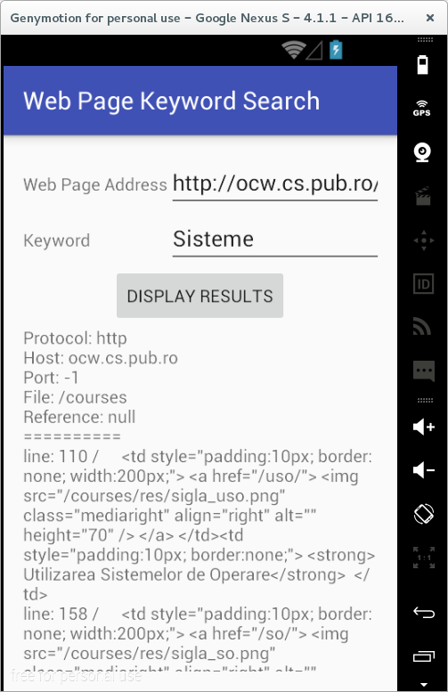

# Clasa HttpURLConnection

În Android, comunicația dintre un server web si un client poate fi
gestionată prin intermediul clasei
[HttpURLConnection](http://developer.android.com/reference/java/net/HttpURLConnection.html),
care pune la dispoziție aceleași funcționalități ca în cazul Java SE.

O aplicație ce utilizează această clasă presupune implementarea
următoarelor etape:

1.  instanțierea unui obiect
    [URL](http://developer.android.com/reference/java/net/URL.html) prin
    intermediul căruia pot fi obținute informații cu privire la resursa
    respectivă (protocolul utilizat, mașina pe care se găsește resursa
    respectivă, portul pe care poate fi accesată, fișierul accesat,
    referința vizualizată):
    -   `getProtocol()` - furnizează protocolul utilizat, în acest caz,
        `http`;
    -   `getHost()` - indică adresa mașinii care găzduiește resursa
        respectivă;
    -   `getPort()` - întoarce portul pe care s-a realizat comunicația:
        -   valoarea -1 este specifică pentru situația în care nu s-a
            precizat un port în mod explicit;
        -   valoarea 80 este transmisă numai în cazul în care aceata
            este specificată ca atare în adresa furnizată.
    -   `getFile()` - specifică calea de la care este obținută resursa;
    -   `getRef()` - precizează referința din cadrul paginii HTML (de
        regulă, de tip ancoră) care a fost solicitată.
2.  deschiderea unei conexiuni, printr-un apel al metodei
    `openConnection()`; metoda întoarce un obiect de tip `URLConnection`
    care poate fi convertit la `HttpURLConnection` prin care se oferă
    acces la:
    -   antetele de cerere: `setRequestMethod()`,
        `setRequestProperty(String, String)`;
    -   antetele de răspuns, inclusiv linia de stare:
        `getResponseCode()`, `getHeaderFields()`,
        `getResponseMessage()`;
    -   informații referitoare la mecanismele de gestiune a stării
        (cookie-uri) - în condițiile în care HTTP este un protocol fără
        stare; se utilizează clasele
        [CookieManager](http:*developer.android.com/reference/java/net/CookieManager.html),
        [CookieHandler](http:*developer.android.com/reference/java/net/CookieHandler.html),
        care gestionează la nivelul întregii mașini virtuale obiectele
        de tipul
        [HttpCookie](http:*developer.android.com/reference/java/net/HttpCookie.html).
3.  utilizarea unui flux de intrare / flux de ieșire pentru transferul
    de informații; se folosesc, obiectele / metodele:
    -   `BufferedInputStream` / `getInputStream()`;
    -   `BufferedOutputStream` / `getOutputStream()` - în acest caz,
        trebuie apelată metoda `setDoOutput()` cu parametrul `true`,
        împreună cu metodele care evită reținerea conținutului într-o
        zonă tampon (consumând astfel memorie inutilă și având un impact
        asupra latenței):
        -   `setFixedLengthStreamingMode()` - atunci când dimensiunea
            conținutului este cunoscută în prealabil;
        -   `setChunkedStreamingMode()` - atunci când dimensiunea
            conținutului nu este cunoscută
4.  închiderea conexiunii, prin intermediul metodei `disconnect()`, se
    face de regulă pe clauza `finally` a unui bloc `try-catch` pe care
    sunt gestionate operațiile ce implică comunicația prin rețea; scopul
    pentru care este utilizată aceasta metodă este dat de posibilitatea
    de reutilizare a resurselor folosite de conexiune (sockeți TCP),
    dacă proprietatea `http.keepAlive` nu specifică altfel.

Implicit, clasa `HttpURLConnection` folosește metoda `GET`.
Metoda `POST` este utilizată numai în situația în care a fost apelată în
prealabil metoda `setDoOutput(true)`.

Celelalte metode (`OPTIONS`, `HEAD`, `PUT`, `DELETE`, `TRACE`) pot fi
utilizate numai în situația în care sunt specificate explicit ca
parametru al funcției `setRequestMethod()`.


``` java
private class WebPageKeywordSearchAsyncTask extends AsyncTask<String, Void, String> {

  @Override
  protected String doInBackground(String... params) {
    HttpURLConnection httpURLConnection = null;
    StringBuilder result = new StringBuilder();
    String error = null;
    try {
      String webPageAddress = params[0];
      String keyword = params[1];
      if (webPageAddress == null || webPageAddress.isEmpty()) {
        error = "Web Page address cannot be empty";
      }
      if (keyword == null || keyword.isEmpty()) {
        error = "Keyword cannot be empty";
      }
      if (error != null) {
        return error;
      }
      URL url = new URL(webPageAddress);
      result.append("Protocol: " + url.getProtocol() + "\n");
      result.append("Host: " + url.getHost() + "\n");
      result.append("Port: " + url.getPort() + "\n");
      result.append("File: " + url.getFile() + "\n");
      result.append("Reference: " + url.getRef() + "\n");
      result.append("==========\n");
      URLConnection urlConnection = url.openConnection();
      if (urlConnection instanceof HttpURLConnection) {
        httpURLConnection = (HttpURLConnection)urlConnection;
        BufferedReader bufferedReader = Utilities.getReader(httpURLConnection);
        int currentLineNumber = 0, numberOfOccurrencies = 0;
        String currentLineContent;
        while ((currentLineContent = bufferedReader.readLine()) != null) {
          currentLineNumber++;
          if (currentLineContent.contains(keyword)) {
            result.append("line: " + currentLineNumber + " / " + currentLineContent+"\n");
            numberOfOccurrencies++;
          }
        }
        result.append("Number of occurrencies: " + numberOfOccurrencies+"\n");
        return result.toString();
      }
    } catch (MalformedURLException malformedURLException) {
      Log.e(Constants.TAG, malformedURLException.getMessage());
      if (Constants.DEBUG) {
        malformedURLException.printStackTrace();
      }
    } catch (IOException ioException) {
      Log.e(Constants.TAG, ioException.getMessage());
      if (Constants.DEBUG) {
        ioException.printStackTrace();
      }
    } finally {
      if (httpURLConnection != null) {
        httpURLConnection.disconnect();
      }
    }
    return null;
  }

  @Override
  public void onPostExecute(String result) {
    resultsTextView.setText(result);
  }

}
```



---
**Note**

Comunicația dintre serverul web și client trebuie să se
realizeze pe un fir de execuție separat, în caz contrar fiind generată
excepția `android.os.NetworkOnMainThreadException`.

---

---
**Note**

În fișierul `AndroidManifest.xml` trebuie specificată
permisiunea de acces la rețea:  
`<uses-permission android:name="android.permission.INTERNET" />`.

---

O practică curentă este de a verifica codul de răspuns transmis de a
accesa fluxul de intrare asociat resursei respective. Astfel, numai în
situația în care valoarea întoarsă de metoda `getResponseCode()` este
`HttpURLConnection.HTTP_OK` se poate continua procesarea conținutului
stocat la URL-ul accesat.
