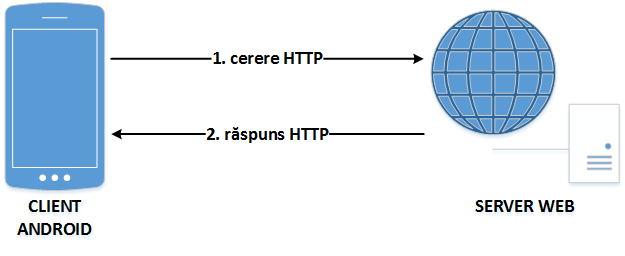
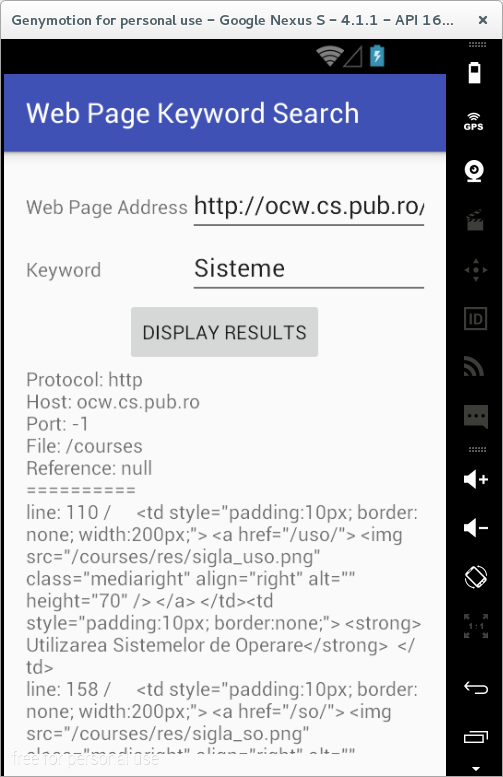
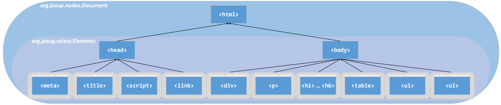
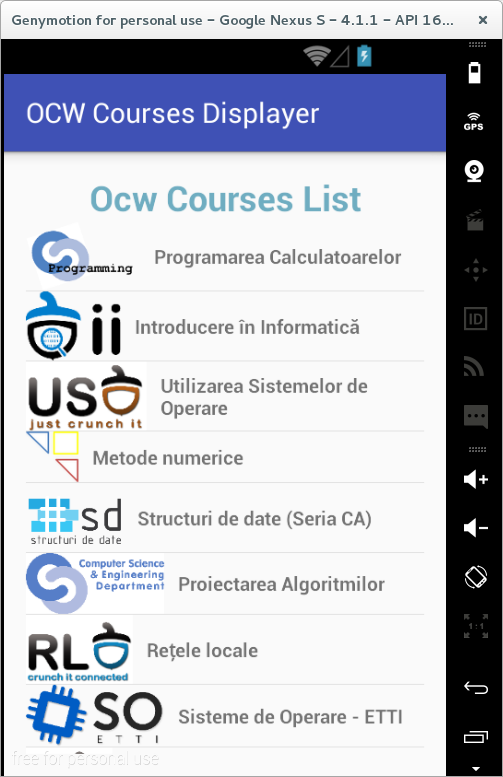
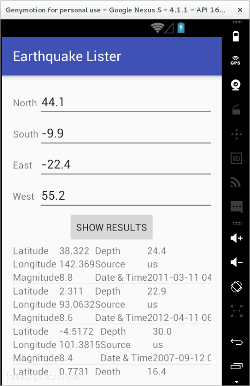
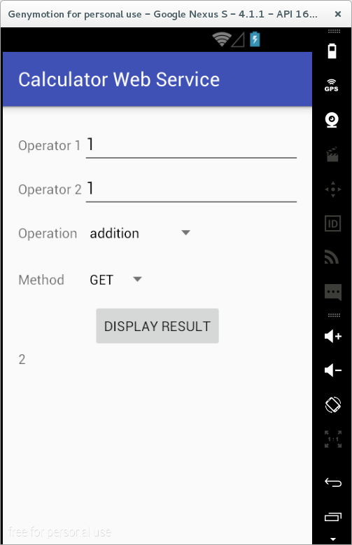
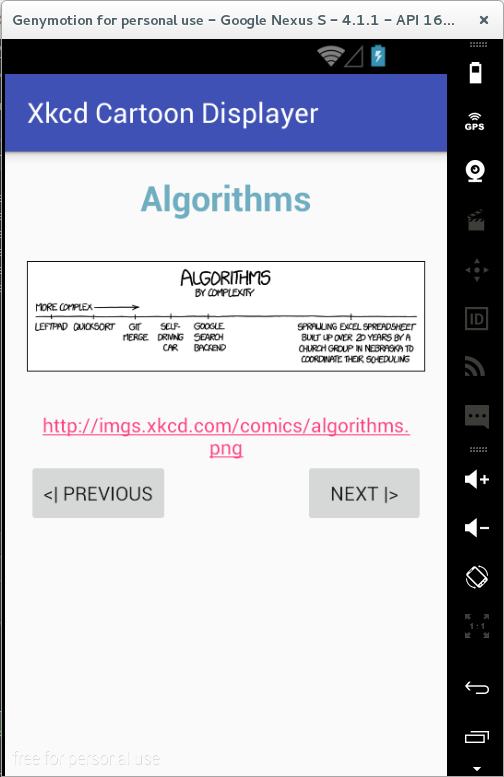
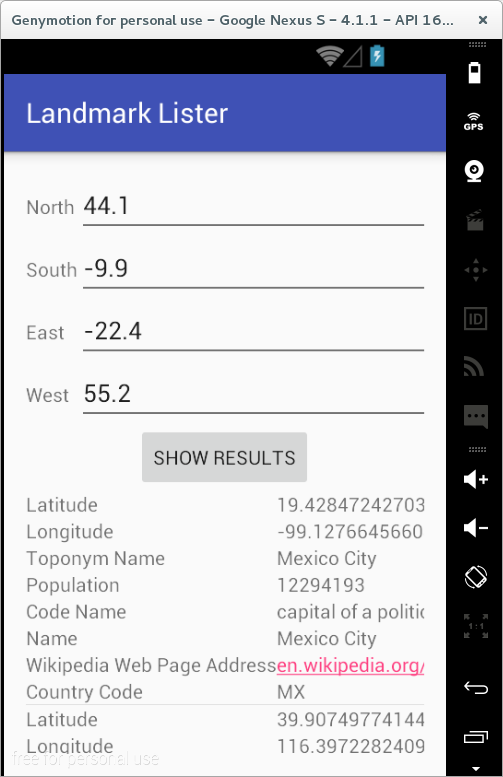

# Laborator 07. Invocarea de Servicii Web prin Protocolul HTTP

## Protocolul HTTP

De multe ori, funcționalitatea pe care o pun la dispoziție aplicațiile
Android este preluată din alte surse, datorită limitărilor impuse de
capacitatea de procesare și memorie disponibilă ale unui dispozitiv
mobil. O strategie posibilă în acest sens este utilizarea HTTP, pentru
interogarea unor servicii web, al căror rezultat este de cele mai multe
ori oferit în format JSON sau XML. De asemenea, descărcarea unor resurse
se poate face prin inspectarea codului sursă al unor pagini Internet
(documente HTML), în urma acestei operații detectându-se locația la care
acestea sunt disponibile.

**HTTP** (Hypertext Transfer Protocol) este un protocol de comunicație
responsabil cu transferul de hipertext (text structurat ce conține
legături) dintre un client (de regulă, un navigator) și un server web,
interacțiunea dintre acestea (prin intermediul unei conexiuni TCP
persistente pe portul 80) fiind reglementată de [RFC
2616](http:www.rfc-editor.org/rfc/rfc2616.txt). HTTP este un protocol
fără stare, pentru persistența informațiilor între accesări fiind
necesar să se utilizeze soluții adiacente (cookie, sesiuni, rescrierea
URL-urilor, câmpuri ascunse).

Principalele concepte cu care lucrează acest protocol sunt *cererea* și
*răspunsul*.

-   **cererea** este transmisă de client către serverul web și
    reprezintă o solicitare pentru obținerea unor resurse (identificate
    printr-un URL); aceasta conține denumirea metodei care va fi
    utilizată pentru transferul de informații, locația de unde se
    găsește resursa respectivă și versiunea de protocol;
-   **răspunsul** este transmis de serverul web către client, ca
    rezultat al solicitării primite, incluzând și o linie de stare (ce
    conține un cod care indică dacă starea comenzii) precum și alte
    informații suplimentare



### Structura unei Cereri HTTP

O cerere HTTP conține una sau mai multe linii de text ASCII, precedate
în mod necesar de denumirea metodei specificând operația ce se va
realiza asupra conținutului respectiv:

<table>
<thead>
<tr class="header">
<th><strong>DENUMIRE METODĂ</strong></th>
<th><strong>DESCRIERE</strong></th>
</tr>
</thead>
<tbody>
<tr class="odd">
<td><strong><code>GET</code></strong></td>
<td>descărcarea resursei specificate de pe serverul web pe client; majoritatea cererilor către un server web sunt de acest tip<br />
<code>GET /page.html HTTP/1.1
Host: www.server.com

</code></td>
</tr>
<tr class="even">
<td><code>HEAD</code></td>
<td>obținerea antetului unei pagini Internet, pentru a se verifica parametrii acesteia sau doar pentru a testa corectitudinea unui URL</td>
</tr>
<tr class="odd">
<td><code>PUT</code></td>
<td>încărcarea resursei specificate de pe client pe serverul web (cu suprascrierea acesteia, în cazul în care există deja); trebuie specificate și datele de autentificare, utilizatorul respectiv trebuind să aibă permisiunile necesare pentru o astfel de operașie</td>
</tr>
<tr class="even">
<td><strong><code>POST</code></strong></td>
<td>transferul de informații de către client cu privire la resursa specificată, acestea urmând a fi prelucrate de serverul web<br />
<code>POST /page.html HTTP/1.1
Host: www.server.com
attribute1=value1&amp;...&amp;attributen=valuen

</code></td>
</tr>
<tr class="odd">
<td><code>DELETE</code></td>
<td>ștergerea resursei specificate de pe serverul web, rezultatul operației depinzând de permisiunile pe care le deține utilizatorul ale cărui date de autentificare au fost transmise în antete</td>
</tr>
<tr class="even">
<td><code>TRACE</code></td>
<td>solicitare de retransmitere a cererii primite de serverul web de la client, pentru a se testa corectitudinea acesteia</td>
</tr>
<tr class="odd">
<td><code>CONNECT</code></td>
<td>rezervat pentru o utilizare ulterioară</td>
</tr>
<tr class="even">
<td><code>OPTIONS</code></td>
<td>interogare cu privire la atributele serverului web sau ale unei resurse găzduite de acesta</td>
</tr>
</tbody>
</table>

---
**Note**

Capitalizarea este importantă atunci când se precizează
denumirea metodei folosite, făcându-se distincție între minuscule și
majuscule.\

---

Cel mai frecvent, se utilizează metodele `GET` (folosită implicit, dacă
nu se specifică altfel) și `POST`.

#### GET vs. POST

Deși atât metoda `GET` cât și metoda `POST` pot fi utilizate pentru
descărcarea conținutului unei pagini Internet, transmițând către
serverul web valorile unor anumite atribute, între acestea există
anumite diferențe:

-   o cerere `GET` poate fi reținută în cache, fapt ce nu este valabil
    și pentru o cerere `POST`;
-   o cerere `GET` rămâne în istoricul aplicației de navigare, fapt ce
    nu este valabil și pentru o cerere `POST`;
-   o cerere `GET` poate fi reținută printre paginile Internet favorite
    din cadrul programului de navigare, fapt ce nu este valabil și
    pentru o cerere `POST`;
-   o cerere `GET` impune unele restricții cu privire la lungimea (maxim
    2048 caractere) și la tipul de date (doar caractere ASCII) transmise
    (prin URL), fapt ce nu este valabil și pentru o cerere `POST`;
-   o cerere `GET` nu trebuie folosită atunci când sunt implicate
    informații critice (acestea fiind vizibile în URL), fapt ce nu este
    valabil și pentru o cerere `POST`;
-   o cerere `GET` ar trebui să fie folosită doar pentru obținerea unei
    resurse, fapt ce nu este valabil și pentru o cerere `POST`.

### 

O linie de cerere HTTP poate fi succedată de unele informații
suplimentare, reprezentând **antetele de cerere**, acestea având forma
`atribut:valoare`, fiind definite următoarele proprietăți:

-   `User-Agent` - informații cu privire la browser-ul utilizat și la
    platforma pe care rulează acesta
-   informații cu privire la conținutul pe care clientul îl dorește de
    la serverul web, având capacitatea de a-l procesa; dacă serverul
    poate alege dintre mai multe resurse pe care le găzduiește, va alege
    pe cele care respectă constrângerile specificate, altfel întoarce un
    cod de eroare
    -   `Accept` - tipul MIME
    -   `Accept-Charset` - setul de caractere
    -   `Accept-Encoding` - mecanismul de codificare
    -   `Accept-Language` - limba
-   `Host` (obligatoriu) - denumirea gazdei pe care se găsește resursa
    (specificată în URL); necesară întrucât o adresă IP poate fi
    asociată mai multor nume de DNS
-   `Authorization` - informații de autentificare în cazul unor operații
    care necesită drepturi privilegiate
-   `Cookie` - transmite un cookie primit anterior
-   `Date` - data și ora la care a fost transmisă cererea

### Structura unui Răspuns HTTP

Un răspuns HTTP este format din linia de stare, antetele de răspuns și
posibile informații suplimentare, conținând o parte sau toată resursa
care a fost solicitată de client de pe serverul web.

În cadrul **liniei de stare** este inclus un cod din trei cifre care
indică dacă solicitarea a putut fi îndeplinită sau nu (situație în care
este indicată și cauza).

| **FAMILIE DE CODURI** | **SEMNIFICAȚIE** | **DESCRIERE**                                                                                                                                                                                                                                                                                                                       |
|-----------------------|------------------|-------------------------------------------------------------------------------------------------------------------------------------------------------------------------------------------------------------------------------------------------------------------------------------------------------------------------------------|
| 1xx                   | Informație       | răspuns provizoriu, constând din linia de stare și alte antete (fără conținut, terminat de o linie vidă), indicând faptul că cererea a fost primită, procesarea sa fiind încă în desfășurare; nu este utilizată în HTTP/1.0                                                                                                         |
| 2xx                   | Succes           | răspuns ce indică faptul că cererea a fost primită, înțeleasă, acceptată și procesată cu succes                                                                                                                                                                                                                                     |
| 3xx                   | Redirectare      | răspuns transmis de serverul web ce indică faptul că trebuie realizate acțiuni suplimentare din partea clientului (cu sau fără interacțiunea utilizatorului, în funcție de metoda folosită) pentru ca cererea să poată fi îndeplinită; în cazul în care redirectarea se repetă de mai multe ori, se poate suspecta o buclă infinită |
| 4xx                   | Eroare la client | răspuns transmis de serverul web ce indică faptul că cererea nu a putut fi îndeplinită, datorită unei erori la nivelul clientului; mesajul include și o entitate ce conține o descriere a situației, inclusiv tipul acesteia (permanentă sau temporară)                                                                             |
| 5xx                   | Eroare la server | cod de răspuns ce indică clientului faptul că cererea nu a putut fi îndeplinită, datorită unei erori la nivelul serverului web; mesajul include și o entitate ce conține o descriere a situației, inclusiv tipul acesteia (permanentă sau temporară)                                                                                |

Mesajul conține și **antetele de răspuns**, având forma
`atribut:valoare`, fiind definite următoarele proprietăți:

-   `Server` - informații cu privire la mașina care găzduiește resursa
    care este transmisă
-   informații cu privire la proprietățile conținutului care este
    transmis
    -   `Content-Encoding` - mecanismul de codificare
    -   `Content-Language` - limba
    -   `Content-Length` - dimensiunea
    -   `Content-Type` - tipul MIME
-   `Last-Modified` - ora și data la care pagina Internet a fost
    modificată
-   `Location` - informație prin care serverul web informează clientul
    de faptul că ar trebui folosit alt URL (resursa a fost mutată sau
    trebuie accesată o pagină Internet localizată în funcție de anumite
    preferințe)
-   `Accept-Ranges` - informație referitoare la transmiterea
    conținutului solicitat în mai multe părți, corespunzătoare unor
    intervale de octeți
-   `Set-Cookie` - transmiterea unui cookie de la serverul web la
    client, acesta trebuind să fie inclus în antetele ulterioare ale
    mesajelor schimbate între cele două entități

## Mecanisme pentru Comunicația prin HTTP în Android

### Clasa HttpURLConnection

În Android, comunicația dintre un server web si un client poate fi
gestionată prin intermediul clasei
[HttpURLConnection](http:developer.android.com/reference/java/net/HttpURLConnection.html),
care pune la dispoziție aceleași funcționalități ca în cazul Java SE.

O aplicație ce utilizează această clasă presupune implementarea
următoarelor etape:

1.  instanțierea unui obiect
    [URL](http:developer.android.com/reference/java/net/URL.html) prin
    intermediul căruia pot fi obținute informații cu privire la resursa
    respectivă (protocolul utilizat, mașina pe care se găsește resursa
    respectivă, portul pe care poate fi accesată, fișierul accesat,
    referința vizualizată):
    -   `getProtocol()` - furnizează protocolul utilizat, în acest caz,
        `http`;
    -   `getHost()` - indică adresa mașinii care găzduiește resursa
        respectivă;
    -   `getPort()` - întoarce portul pe care s-a realizat comunicația:
        -   valoarea -1 este specifică pentru situația în care nu s-a
            precizat un port în mod explicit;
        -   valoarea 80 este transmisă numai în cazul în care aceata
            este specificată ca atare în adresa furnizată.
    -   `getFile()` - specifică calea de la care este obținută resursa;
    -   `getRef()` - precizează referința din cadrul paginii HTML (de
        regulă, de tip ancoră) care a fost solicitată.
2.  deschiderea unei conexiuni, printr-un apel al metodei
    `openConnection()`; metoda întoarce un obiect de tip `URLConnection`
    care poate fi convertit la `HttpURLConnection` prin care se oferă
    acces la:
    -   antetele de cerere: `setRequestMethod()`,
        `setRequestProperty(String, String)`;
    -   antetele de răspuns, inclusiv linia de stare:
        `getResponseCode()`, `getHeaderFields()`,
        `getResponseMessage()`;
    -   informații referitoare la mecanismele de gestiune a stării
        (cookie-uri) - în condițiile în care HTTP este un protocol fără
        stare; se utilizează clasele
        [CookieManager](http:developer.android.com/reference/java/net/CookieManager.html),
        [CookieHandler](http:developer.android.com/reference/java/net/CookieHandler.html),
        care gestionează la nivelul întregii mașini virtuale obiectele
        de tipul
        [HttpCookie](http:developer.android.com/reference/java/net/HttpCookie.html).
3.  utilizarea unui flux de intrare / flux de ieșire pentru transferul
    de informații; se folosesc, obiectele / metodele:
    -   `BufferedInputStream` / `getInputStream()`;
    -   `BufferedOutputStream` / `getOutputStream()` - în acest caz,
        trebuie apelată metoda `setDoOutput()` cu parametrul `true`,
        împreună cu metodele care evită reținerea conținutului într-o
        zonă tampon (consumând astfel memorie inutilă și având un impact
        asupra latenței):
        -   `setFixedLengthStreamingMode()` - atunci când dimensiunea
            conținutului este cunoscută în prealabil;
        -   `setChunkedStreamingMode()` - atunci când dimensiunea
            conținutului nu este cunoscută
4.  închiderea conexiunii, prin intermediul metodei `disconnect()`, se
    face de regulă pe clauza `finally` a unui bloc `try-catch` pe care
    sunt gestionate operațiile ce implică comunicația prin rețea; scopul
    pentru care este utilizată aceasta metodă este dat de posibilitatea
    de reutilizare a resurselor folosite de conexiune (sockeți TCP),
    dacă proprietatea `http.keepAlive` nu specifică altfel.

Implicit, clasa `HttpURLConnection` folosește metoda `GET`.
Metoda `POST` este utilizată numai în situația în care a fost apelată în
prealabil metoda `setDoOutput(true)`.

Celelalte metode (`OPTIONS`, `HEAD`, `PUT`, `DELETE`, `TRACE`) pot fi
utilizate numai în situația în care sunt specificate explicit ca
parametru al funcției `setRequestMethod()`. \

---

``` java
private class WebPageKeywordSearchAsyncTask extends AsyncTask<String, Void, String> {

  @Override
  protected String doInBackground(String... params) {
    HttpURLConnection httpURLConnection = null;
    StringBuilder result = new StringBuilder();
    String error = null;
    try {
      String webPageAddress = params[0];
      String keyword = params[1];
      if (webPageAddress == null || webPageAddress.isEmpty()) {
        error = "Web Page address cannot be empty";
      }
      if (keyword == null || keyword.isEmpty()) {
        error = "Keyword cannot be empty";
      }
      if (error != null) {
        return error;
      }
      URL url = new URL(webPageAddress);
      result.append("Protocol: " + url.getProtocol() + "\n");
      result.append("Host: " + url.getHost() + "\n");
      result.append("Port: " + url.getPort() + "\n");
      result.append("File: " + url.getFile() + "\n");
      result.append("Reference: " + url.getRef() + "\n");
      result.append("==========\n");
      URLConnection urlConnection = url.openConnection();
      if (urlConnection instanceof HttpURLConnection) {
        httpURLConnection = (HttpURLConnection)urlConnection;
        BufferedReader bufferedReader = Utilities.getReader(httpURLConnection);
        int currentLineNumber = 0, numberOfOccurrencies = 0;
        String currentLineContent;
        while ((currentLineContent = bufferedReader.readLine()) != null) {
          currentLineNumber++;
          if (currentLineContent.contains(keyword)) {
            result.append("line: " + currentLineNumber + " / " + currentLineContent+"\n");
            numberOfOccurrencies++;
          }
        }
        result.append("Number of occurrencies: " + numberOfOccurrencies+"\n");
        return result.toString();
      }
    } catch (MalformedURLException malformedURLException) {
      Log.e(Constants.TAG, malformedURLException.getMessage());
      if (Constants.DEBUG) {
        malformedURLException.printStackTrace();
      }
    } catch (IOException ioException) {
      Log.e(Constants.TAG, ioException.getMessage());
      if (Constants.DEBUG) {
        ioException.printStackTrace();
      }
    } finally {
      if (httpURLConnection != null) {
        httpURLConnection.disconnect();
      }
    }
    return null;
  }

  @Override
  public void onPostExecute(String result) {
    resultsTextView.setText(result);
  }

}
```



---
**Note**

Comunicația dintre serverul web și client trebuie să se
realizeze pe un fir de execuție separat, în caz contrar fiind generată
excepția `android.os.NetworkOnMainThreadException`.\

---

---
**Note**

În fișierul `AndroidManifest.xml` trebuie specificată
permisiunea de acces la rețea:  
`<uses-permission android:name="android.permission.INTERNET" />`.\

---

O practică curentă este de a verifica codul de răspuns transmis de a
accesa fluxul de intrare asociat resursei respective. Astfel, numai în
situația în care valoarea întoarsă de metoda `getResponseCode()` este
`HttpURLConnection.HTTP_OK` se poate continua procesarea conținutului
stocat la URL-ul accesat.

### Apache HTTP Components

[Apache HTTP Components](https:hc.apache.org/) este un proiect
open-source, dezvoltat sub licență Apache, punând la dispoziția
utilizatorilor o bibliotecă Java pentru accesarea de resurse prin
intermediul protocolului HTTP. Funcționalitatea poate fi utilizată în
cadrul oricărei mașini virtuale Java și era inclusă și în platforma
Android până în API Level 23 (Marshmellow) [când a fost
exclusă](http:developer.android.com/about/versions/marshmallow/android-6.0-changes.html#behavior-apache-http-client),
fiind invocate probleme legate de compatibilitate pentru anumite
platforme precum și utilizarea excesivă a rețelei cu impact asupra
consumului de energie. În schimb, se recomandă utilizarea clasei
HttpURLConnection care asigură compresia datelor (în mod transparent
pentru utilizator!) precum și folosirea unui cache. Cu toate acestea,
proiectul Apache HTTP Components este în continuă dezvoltare și folosit
pe scară largă.

Componentele Apache HTTP Components sunt:

-   [HttpCore](https:hc.apache.org/httpcomponents-core-ga/index.html)
    este un set de componente de transport care pot fi utilizate pentru
    dezvoltarea de servicii robuste, la nivel de server și client; sunt
    implementate atât un model blocant pentru operații de intrare/ieșire
    (bazat pe `java.io`) cât și un model asincron, bazat pe evenimente
    (bazat pe `java.nio`);
-   [HttpClient](https:hc.apache.org/httpcomponents-client-ga/index.html)
    este o implementare a unui agent compatibil cu HTTP/1.1 care oferă
    funcționalități pentru autentificare la nivel de client, pentru
    gestiunea stării și a conexiunii;
-   [HttpAsyncClient](https:hc.apache.org/httpcomponents-asyncclient-dev/index.html)
    este un modul complementar destinat situațiilor în care se dorește
    să se ofere suport pentru un număr mare de conexiuni concurente,
    parametrii precum nivelul de transfer al datelor nu sunt foarte
    importante.

Pentru ca metodele din API-ul Apache HTTP Components să poată fi
utilizate într-o aplicație Android ce utilizează API Level este necesar
să se specifice utilizarea bibliotecii corespunzătoare, în fișierul
`build.gradle`:

``` gradle
...

android {
  compileSdkVersion 23
  buildToolsVersion "23.0.2"

  useLibrary 'org.apache.http.legacy'
}

...
```

Conform API-ului Apache HTTP Components, conexiunile HTTP sunt
gestionate mai ales prin intermediul clasei
[HttpClient](https:hc.apache.org/httpcomponents-client-ga/httpclient/apidocs/org/apache/http/client/HttpClient.html),
care oferă suport complet pentru acest protocol de comunicație.
Frecvent, ca implementare a acestei interfețe se utilizează
[DefaultHttpClient](https:hc.apache.org/httpcomponents-client-ga/httpclient/apidocs/org/apache/http/impl/client/DefaultHttpClient.html).

Un astfel de obiect poate folosit pentru transmiterea unor cereri de tip
`GET`
([HttpGet](https:hc.apache.org/httpcomponents-client-ga/httpclient/apidocs/org/apache/http/client/methods/HttpGet.html))
sau `POST`
([HttpPost](https:hc.apache.org/httpcomponents-client-ga/httpclient/apidocs/org/apache/http/client/methods/HttpPost.html))
și prelucrarea răspunsurilor corespunzătoare.

Metoda `GET` este folosită pentru obținerea conținutului unei pagini
Internet stocată la o anumită adresă.

Pașii care trebuie urmați pentru realizarea unei astfel de cereri HTTP
sunt:

1.  instanțierea unui obiect de tipul `HttpClient`;
2.  instanțierea unui obiect de tipul `HttpGet` având ca parametru
    adresa serverului web ce conține resursa care se dorește a fi
    descărcată;
3.  realizarea propriu-zisă a cererii HTTP prin apelul metodei
    `execute()` a obiectului `HttpClient`, ce primește ca parametru
    obiectul de tip `HttpGet` (încapsulând tipul metodei folosite și
    locația care va fi interogată).

``` java
try {
  HttpClient httpClient = new DefaultHttpClient();
  HttpGet httpGet = new HttpGet("http:www.server.com");
  HttpResponse httpGetResponse = httpClient.execute(httpGet);
  HttpEntity httpGetEntity = httpGetResponse.getEntity();
  if (httpGetEntity != null) {  
    * do something with the response
    Log.i(Constants.TAG, EntityUtils.toString(httpGetEntity));
  }            
} catch (Exception exception) {
  Log.e(Constants.TAG, exception.getMessage());
  if (Constants.DEBUG) {
    exception.printStackTrace();
  }
}
```

Alternativ, poate fi utilizat un obiect de tip
[ResponseHandler](https:hc.apache.org/httpcomponents-client-ga/httpclient/apidocs/org/apache/http/client/ResponseHandler.html)
(cu implementarea
[BasicResponseHandler](https:hc.apache.org/httpcomponents-client-ga/httpclient/apidocs/org/apache/http/impl/client/BasicResponseHandler.html))
care va fi transmis ca parametru metodei `execute()`, astfel încât
rezultatul acesteia să fie un șir de caractere conținând resursa care se
dorește a fi descărcată.

``` java
* ...
ResponseHandler<String> responseHandler = new BasicResponseHandler();
String content = httpClient.execute(httpGet, responseHandler);
* ...
```

În situația în care se dorește transmiterea de parametri către serverul
web, aceștia trebuie incluși în URL (în clar), fără a se depăși limita
de 2048 de caractere și folosind numai caractere ASCII:

``` java
* ...
HttpGet httpGet = new HttpGet("http:www.server.com?attribute1=value1&...&attributen=valuen");
* ...
```

Metoda `POST` este folosită atunci când se dorește generarea unui
conținut de către serverul web pe baza unor informații transmise de
client. Aceste date - având forma unei liste de tip (atribut, valoare) -
vor fi incluse în conținutul mesajului în loc de a fi integrate în
cadrul URL-ului.

Pașii care trebuie urmați pentru realizarea unei astfel de cereri HTTP
sunt:

1.  instanțierea unui obiect de tipul `HttpClient`;
2.  instanțierea unui obiect de tipul `HttpPost` având ca parametru
    adresa serverului web ce conține resursa care se dorește a fi
    descărcată;
3.  **definirea unei liste de perechi de tip (atribut, valoare) (de tip
    `List<NameValuePair>`) care vor conține informațiile transmise de
    client pe baza cărora serverul web va genera conținutul**;
4.  **atașarea datelor respective la obiectul de tip `HttpPost` (apelând
    metoda `setEntity()`) prin intermediul unei entități
    [UrlEncodedFormEntity](https:hc.apache.org/httpcomponents-client-ga/httpclient/apidocs/org/apache/http/client/entity/UrlEncodedFormEntity.html)
    care primește ca parametru informațiile ce trebuie transmise și
    mecanismul de codificare a datelor**;
5.  realizarea propriu-zisă a cererii HTTP prin apelul metodei
    `execute()` a obiectului `HttpClient`, ce primește ca parametru
    obiectul de tip `HttpPost` (încapsulând tipul metodei folosite,
    datele care se doresc a fi transmise și locația care va fi
    interogată).

``` java
try {
  HttpClient httpClient = new DefaultHttpClient();        
  HttpPost httpPost = new HttpPost("http:www.server.com");
    
  List<NameValuePair> params = new ArrayList<NameValuePair>();        
  params.add(new BasicNameValuePair("attribute1", "value1"));
  * ...
  params.add(new BasicNameValuePair("attributen", "valuen"));

  UrlEncodedFormEntity urlEncodedFormEntity = new UrlEncodedFormEntity(params, HTTP.UTF_8);
  httpPost.setEntity(urlEncodedFormEntity);
             
  HttpResponse httpPostResponse = httpClient.execute(httpPost);  
  HttpEntity httpPostEntity = httpPostResponse.getEntity();  
  if (httpPostEntity != null) {
    * do something with the response
    Log.i(Constants.TAG, EntityUtils.toString(httpPostEntity));
   }
} catch (Exception exception) {
  Log.e(Constants.TAG, exception.getMessage());
  if (Constants.DEBUG) {
    exception.printStackTrace();
  }
}
```

Prelucrarea unui răspuns HTTP se poate realiza:

-   prin prelucrarea obiectului de tip
    [HttpEntity](https:hc.apache.org/httpcomponents-client-ga/httpclient/apidocs/org/apache/http/client/entity/UrlEncodedFormEntity.html),
    utilizând fluxuri de intrare/ieșire:  
    `BufferedReader bufferedReader = null;
    StringBuilder result = new StringBuilder();
    try {
      * ...
      bufferedReader = new BufferedReader(new InputStreamReader(httpEntity.getContent()));
      int currentLineNumber = 0;
      String currentLineContent;
      while ((currentLineContent = bufferedReader.readLine()) != null) {
        currentLineNumber++;
        result.append(currentLineNumber).append(": ").append(currentLineContent).append("\n");
      }
      Log.i(Constants.TAG, result.toString());
    } catch (Exception exception) {
      Log.e(Constants.TAG, exception.getMessage());
      if (Constants.DEBUG) {
        exception.printStackTrace();
      }
    } finally {
      if(bufferedReader != null) {
        try {
          bufferedReader.close();
        } catch (IOException ioException) {
          Log.e(Constants.TAG, exception.getMessage());
          if (Constants.DEBUG) {
            ioException.printStackTrace();
          }
        }
      }
    }
    `
-   utilizând un obiect de tip `ResponseHandler`, ce furnizează
    conținutul resursei solicitate, transmis ca parametru al metodei
    `execute()` a clasei `HttpClient` (pe lângă obiectul
    `HttpGet|HttpPost`)

### Volley


[Volley](https://google.github.io/volley/) este o
bibliotecă open-source (disponibilă prin intermediul Android Open-Source
Project) ce oferă facilități pentru interogarea de resurse disponibile
prin intermediul protocolului HTTP.

Câteva dintre facilitățile puse la dispoziție de această platformă sunt:

1.  gestiune automată a cererilor (implementare sistem de priorități,
    posibilitate de manipulare a cererilor concurente, funcționalitate
    pentru anulare a unei cereri transmise anterior);
2.  utilizarea transparentă a unui sistem de caching implementat atât în
    memorie cât și pe discul local;
3.  posibilitatea de implementare a unor mecanisme specifice pentru
    retransmitere;
4.  implementarea de operații de tip RPC (Remote Procedure Call)
    executate asincron pentru popularea conținutului unor elemente din
    interfața grafică;
5.  utilitare pentru depanare.

Volley nu este adecvat pentru operații de intrare / ieșire intensive
tocmai datorită sistemului de caching, conținutul resurselor solicitate
fiind menținut în memorie în vederea realizării operației de procesare a
acestuia.

Pentru utilizarea bibliotecii Volley este necesar să se realizeze
următoarele operații:

1.  descărcarea codului sursă de la depozitul unde este întreținută
    `student@eim-lab:~$ git clone https:www.github.com/google/volley
    `
2.  referirea proiectului ca bibliotecă în Android Studio
    -   *File* -> *New* -> *Import Module...*
        
    -   indicarea locației la care au fost descărcate sursele în
        prelabil și o denumire a proiectului (tipic, `:volley`) sub care
        va fi referit
    -   specificarea dependenței față de acest proiect precum și faptul
        că este necesar ca acesta să fie compilat `...
        dependencies {
          compile fileTree(dir: 'libs', include: ['*.jar'])
          testCompile 'junit:junit:4.12'
          compile 'com.android.support:appcompat-v7:23.1.1'
          compile 'com.android.support:design:23.1.1'
          compile project(':volley')
        }
        `
    -   dacă pentru Volley se folosește API Level 23, este necesar să se
        utilizeze biblioteca `org.apache.http.legacy` întrucât
        implementarea sa utilizează Apache HTTP Components. `android {
          ...
          useLibrary 'org.apache.http.legacy'
          ...
        }
        `

Volley gestionează o structură de date
[RequestQueue](https:android.googlesource.com/platform/frameworks/volley/+/master/src/main/java/com/android/volley/RequestQueue.java)
care are rolul de a controla modul în care sunt tratate cererile.
Aceasta distribuie cererile care trebuie procesate concurent către
firele de execuție care se ocupă de comunicația prin rețea, realizând de
asemenea interogarea informațiilor care se regăsest în cache. Există
două moduri în care poate fi construit un obiect de tip `RequestQueue`:

-   `Volley.newRequestQueue(Context)` - construiește o coadă de cereri
    folosind implementările standard pentru implementarea mecanismului
    de cache și a comunicației prin rețea:
    1.  `DiskBasedCache`: pentru fiecare răspuns care a fost solicitat
        prin intermediul unei cereri se construiește un fișier dedicat,
        căruia îi corespunde un index stocat în memorie;
    2.  `BasicNetwork`: implementează funcționalitate de transport
        folosind un client HTTP (tipic, un obiect `HttpURLConnection`);
-   `Volley.newRequestQueue(Cache, Network)` permite utilizarea unui
    mecanism de cache și a unei modalități de transmisie prin rețea ai
    căror comportament și parametri sunt definiți de utilizator.

O coadă de cereri implementează următoarele metode:

-   `add()` - transmite o cerere care este inițial verificată de firul
    de execuție care verifică cache-ul astfel încât dacă răspunsul
    există stocat, va fi furnizat fără a se mai realiza comunicația prin
    reșea; în caz contrar, el va fi plasat în coada gestionată de firele
    de execuție responsabile de comunicația prin rețea, acesta fiind
    preluat în momentul în care unul dintre acestea devine disponibil;
-   `cancel()` - anulează o cerere care a fost transmisă anterior,
    împiedicând să se obțină un răspuns pe baza sa (metoda este invocată
    pe obiectul `Request`);
-   `cancelAll()` - anulează toate cererile care au atașată o anumită
    etichetă, specificată prin intermediul metodei `setTag()`; o astfel
    de abordare poate fi utilă atunci când o activitate nu mai este
    vizibilă (pe metoda `onStop()`) astfel încât să nu se mai proceseze
    răspunsuri care nu pot fi afișate; în acest fel, utilizatorul este
    scutit să verifice dacă instanța activității există sau nu pe
    metodele de callback apelate în mod automat în momentul în care
    resursa solicitată devine disponibilă sau în momentul în care s-a
    produs o excepție.

Este recomandat ca la nivelul unei aplicații Android care utilizează
comunicația prin rețea folosind protocolul HTTP să se utilizeze o
singură instanță a unui obiect de tip `RequestQueue` a cărui durată de
viață se întinde pe întreaga perioadă de execuție. Abordarea cea mai
adecvată este utilizarea unei clase Singleton care conține un obiect de
tip `RequestQueue` precum și alte funcționalități Volley, dacă este
necesar.

``` java
import android.content.Context;

import com.android.volley.Request;
import com.android.volley.RequestQueue;
import com.android.volley.toolbox.Volley;

public class VolleyController {

  private static VolleyController instance;
  private static Context context;
  private RequestQueue requestQueue;

  private VolleyController(Context context) {
    this.context = context;
    this.requestQueue = getRequestQueue();
  }

  public static synchronized VolleyController getInstance(Context context) {
    if (instance == null) {
      instance = new VolleyController(context);
    }
    return instance;
  }

  public RequestQueue getRequestQueue() {
    if (requestQueue == null) {
      requestQueue = Volley.newRequestQueue(context.getApplicationContext());
    }
    return requestQueue;
  }

  public <T> void addToRequestQueue(Request<T> request) {
    getRequestQueue().add(request);
  }

}
```

---
**Note**

 Contextul transmis ca argument metodei
`newRequestQueue()` trebuie să se refere la contextul aplicației, de
accea se utilizează metoda `getApplicationContext()`. \

---

Volley folosește mai multe fire de execuție:

1.  firul de execuție principal (al interfeței grafice), prin
    intermediul căruia este trimisă o cerere și pe care este primit
    răspunsul (pentru a fi vizualizat, de regulă, în cadrul interfeței
    grafice);
2.  firul de execuție responsabil cu implementarea mecanismului de
    caching, care verifică dacă există un răspuns pentru cerere, astfel
    încât să nu mai fie necesară comunicația prin rețea; în momentul în
    care este disponibil un răspuns pentru o cerere, aceasta este
    indexată tot de acest fir de execuție;
3.  mai multe fire de execuție care realizează comunicația prin rețea,
    care trimit o cerere și primesc un răspuns pe care îl procesează
    (operațiile de parsare sau codificare/decodificare necesită resurse
    și o perioadă de timp considerabilă).

O utilizare tipică Volley (algoritmul pe care îl utilizează această
platformă) este următoarea:

1.  firul de execuție principal plasează o cerere în coadă
2.  firul de execuție responsabil cu implementarea mecanismului de
    caching verifică dacă există un răspuns pentru cerere
    1.  dacă răspunsul pentru cerere se află în cache
        1.  se citește răspunsul din cache
        2.  se scrie rezultatul către firul de execuție principal
    2.  dacă răspunsul pentru cerere NU se află în cache
        1.  se transmite cerere în coadă
        2.  un fir de execuție care realizează comunicația prin rețea
            trimite cererea, atunci când devine disponibil, preluând
            răspunsul
            1.  răspunsul este stocat în cache, după ce poate suferi
                procesări ulterioare (parsare, codificare/decodificare)
            2.  se scrie rezultatul către firul de execuție principal

Volley definește mai multe tipuri de cerere standard, în funcție de
tipul de date pe care îl are resursa care va fi accesată prin
intermediul protocolului HTTP:

1.  [StringRequest](https:android.googlesource.com/platform/frameworks/volley/+/master/src/main/java/com/android/volley/toolbox/StringRequest.java)
    furnizează un rezultat de tip șir de caractere, în orice format,
    folosind un mecanism de codificare;
2.  [ImageRequest](https:android.googlesource.com/platform/frameworks/volley/+/master/src/main/java/com/android/volley/toolbox/ImageRequest.java)
    întoarce o resursă de tip imagine, disponibilă la o anumită locație
    (URL), aceasta fiind transmisă sub formă de bitmap decodificat (și
    posibil redimensionat, dacă se solicită acest lucru); operațiile
    costisitoare sunt realizate de firele de execuție responsabile de
    comunicația prin rețea;
    1.  [ImageLoader](https:android.googlesource.com/platform/frameworks/volley/+/master/src/main/java/com/android/volley/toolbox/ImageLoader.java)
        oferă funcționalitatea de gestiune a cache-ului, care este
        stocat în memorie (dacă s-ar fi utilizat discul local, ar fi
        existat un impact asupra firului de execuție principal),
        transmițând mai multe resurse la un moment dat;
    2.  [NetworkImageView](https:android.googlesource.com/platform/frameworks/volley/+/master/src/main/java/com/android/volley/toolbox/NetworkImageView.java)
        reprezintă un tip de element al interfeței grafice, specializat
        pentru resurse de tip imagine disponibilă la o locație la
        distanță, accesibilă prin intermediul comunicației în rețea.
3.  [JsonRequest](https:android.googlesource.com/platform/frameworks/volley/+/master/src/main/java/com/android/volley/toolbox/JsonRequest.java)
    suportă două implementări:
    1.  [JsonObjectRequest](https:android.googlesource.com/platform/frameworks/volley/+/master/src/main/java/com/android/volley/toolbox/JsonObjectRequest.java)
    2.  [JsonArrayRequest](https:android.googlesource.com/platform/frameworks/volley/+/master/src/main/java/com/android/volley/toolbox/JsonArrayRequest.java)

În situația în care se dorește implementarea unui tip de cerere definită
de utilizator, trebuie să se respecte câteva condiții:

-   clasa trebuie să fie derivată din
    [Request\<T>](https:android.googlesource.com/platform/frameworks/volley/+/master/src/main/java/com/android/volley/Request.java);
-   clasa trebuie să implementeze metodele:
    -   `parseNetworkResponse(NetworkResponse)` care construiește
        rezultatul (`Response.success()`, respectiv `Response.error()`)
        în funcție de răspunsul primit;
    -   `deliverResponse(T)` care apelează metoda de callback
        (`onResponse(T)`) atunci când răspunsul este disponibil.

``` java
public class CustomRequest<T> extends Request<T> {

  private Map<String, String> params;
  private Response.Listener<T> responseListener;
  private Response.ErrorListener errorListener;
  private Class<T> classType;

  public CustomRequest(String url, Map<String, String> params, Response.Listener<T> responseListener, Response.ErrorListener errorListener, Class<T> classType) {
    this(Method.GET, url, params, responseListener, errorListener, classType);
  }

  public CustomRequest(int method, String url, Map<String, String> params, Response.Listener<T> responseListener, Response.ErrorListener errorListener, Class<T> classType) {
    super(method, url, errorListener);
    this.params = params;
    this.responseListener = responseListener;
    this.errorListener = errorListener;
    this.classType = classType;
  }

  @Override
  protected Map<String, String> getParams() throws AuthFailureError {
    return params;
  }

  @Override
  protected Response<T> parseNetworkResponse(NetworkResponse networkResponse) {
    try {
      String response = new String(networkResponse.data, HttpHeaderParser.parseCharset(networkResponse.headers));
      if (classType.equals(JSONObject.class)) {
        return Response.success((T)new JSONObject(response), HttpHeaderParser.parseCacheHeaders(networkResponse));
      }
      if (classType.equals(JSONArray.class)) {
        return Response.success((T)new JSONArray(response), HttpHeaderParser.parseCacheHeaders(networkResponse));
      }
      return null;
    } catch (UnsupportedEncodingException unsupportedEncodingException) {
      return Response.error(new ParseError(unsupportedEncodingException));
    } catch (JSONException jsonException) {
      return Response.error(new ParseError(jsonException));
    }
  }

  @Override
  protected void deliverResponse(T jsonObject) {
    responseListener.onResponse(jsonObject);
  }

  @Override
  public void deliverError(VolleyError volleyError) {
    errorListener.onErrorResponse(volleyError);
  }

}
```

Pentru definirea unui obiect de tip `Request` este necesar să se
precizeze următoarele elemente:

-   metoda folosită pentru transmiterea cererii, definită de
    `Request.Method`;
-   locația (URL-ul) la care se găsește resursa care se dorește să fie
    accesată prin protocolul HTTP;
-   parametrii cererii;
-   metodele de callback
    -   `Response.Listener<T>`:
        -   invocată în mod automat în situația în care răspunsul este
            disponibil;
        -   trebuie să implementeze metoda `onResponse(T)`;
    -   `ErrorListener`:
        -   invocată în mod automat în situația în care s-a produs o
            eroare;
        -   trebuie să implementeze metoda
            `onErrorResponse(VolleyError)`.

``` java
Map<String, String> parameters = new HashMap<>();
parameters.put(Constants.USERNAME_ATTRIBUTE, senderUsername);
CustomRequest<JSONArray> customRequest = new CustomRequest(
  Request.Method.POST,
  Constants.USER_LIST_WEB_SERVICE_ADDRESS,
  parameters,
  new Response.Listener<JSONArray>() {
    @Override
    public void onResponse(JSONArray response) {
      try {
        for (int position = 0; position < response.length(); position++) {
          JSONObject user = response.getJSONObject(position);
          final String recipientId = user.get(Constants.USER_ID_ATTRIBUTE).toString();
          final String recipientUsername = user.get(Constants.USERNAME_ATTRIBUTE).toString();
          contact = (RelativeLayout)inflater.inflate(R.layout.contact, null);
          TextView usernameTextView = (TextView)contact.findViewById(R.id.username_text_view);
          usernameTextView.setText(recipientUsername);
          Button writeMessageButton = (Button)contact.findViewById(R.id.write_message_button);
          contactsList.addView(contact);
        }
      } catch (JSONException jsonException) {
        Log.e(Constants.TAG, jsonException.getMessage());
        if (Constants.DEBUG) {
          jsonException.printStackTrace();
        }
      }
    }
  },
  new Response.ErrorListener() {
    @Override
    public void onErrorResponse(VolleyError volleyError) {
      Snackbar.make(contactsTextView, getResources().getString(R.string.an_error_has_occurred), Snackbar.LENGTH_LONG)
              .show();
    }
  },
  JSONArray.class
);
VolleyController.getInstance(getActivity().getApplicationContext()).addToRequestQueue(customRequest);
```

## Prelucrare DOM (Document Object Model)

Documentele HTML au o structură arborescentă, având drept rădăcină un
document al cărui copil este o ierarhie de elemente, fiecare dintre
acestea fiind reprezentate de o etichetă.



Fiecare element poate conține mai multe atribute (fiecare dintre acestea
având o valoare asociată), putând încorpora și o valoare.

`<TipElement atribut1="valoare1" ... atributn="valoaren"> valoare </TipElement>`

Nu este însă obligatoriu ca elementul să conțină nici atribute și nici
valoare, putând avea și o structură care nu le include:

`<TipElement />`

O soluție pentru parsarea unui document HTML este reprezentată de
biblioteca [Jsoup](http:jsoup.org/packages/jsoup-1.8.2.jar).

---
**Note**

Biblioteca `jsoup-1.8.2.jar` trebuie plasată în
directorul `libs` al proiectului Android și adăugată la calea pentru
compilare (*Build Path* → *Add to Build Path...*).\

---

Prin intermediul metodei statice
[parse()](http:jsoup.org/apidocs/org/jsoup/Jsoup.html#parse(java.lang.String))
ce primește ca parametru conținutul resursei care se dorește a fi
analizată (codul sursă al paginii HTML), se obține un obiect
[Document](http:jsoup.org/apidocs/org/jsoup/nodes/Document.html), care
permite parcurgerea ierarhiei de elemente.

Pentru un obiect de tipul `org.jsoup.nodes.Document`, pot fi obținute
secțiunile componente `<head>` și `<meta>` prin intermediul metodelor
[head()](http:jsoup.org/apidocs/org/jsoup/nodes/Document.html#head()),
respectiv
[body()](http:jsoup.org/apidocs/org/jsoup/nodes/Document.html#body()).

Fiecare etichetă din codul sursă corespunzător unei pagini HTML este
reprezentat de un obiect
[Element](http:jsoup.org/apidocs/org/jsoup/nodes/Element.html), prin
intermediul căruia pot fi accesate toate atributele și valorile asociate
acestora.

Inclusiv nodul rădăcină (de tip `org.jsoup.nodes.Document`) este
derivat din `org.jsoup.nodes.Element`.\

---

Pentru un element, pot fi realizate următoarele operații:

-   obținerea (listei) unor elemente componente:
    -   deținând un anumit identificator - [getElementById(String
        id)](http:jsoup.org/apidocs/org/jsoup/nodes/Element.html#getElementById(java.lang.String));
    -   care au o anumită etichetă - [getElementsByTag(String
        tag)](http:jsoup.org/apidocs/org/jsoup/nodes/Element.html#getElementsByTag(java.lang.String));
    -   ce fac parte din cadrul unei clase - [getElementsByClass(String
        className)](http:jsoup.org/apidocs/org/jsoup/nodes/Element.html#getElementsByClass(java.lang.String));
    -   în funcție de o proprietate:
        -   pentru care se precizează atributul
            -   [getElementsByAttribute(String
                key)](http:jsoup.org/apidocs/org/jsoup/nodes/Element.html#getElementsByAttribute(java.lang.String));
            -   [getElementsByAttributeStarting(String
                keyPrefix)](http:jsoup.org/apidocs/org/jsoup/nodes/Element.html#getElementsByAttributeStarting(java.lang.String));
        -   pentru care se precizează valoarea
            -   [getElementsByAttributeValueStarting(String key, String
                valuePrefix)](http:jsoup.org/apidocs/org/jsoup/nodes/Element.html#getElementsByAttributeValueStarting(java.lang.String, java.lang.String))
            -   [getElementsByAttributeValueContaining(String key,
                String
                match)](http:jsoup.org/apidocs/org/jsoup/nodes/Element.html#getElementsByAttributeValueContaining(java.lang.String, java.lang.String))
            -   [getElementsByAttributeValueEnding(String key, String
                valueSuffix)](http:jsoup.org/apidocs/org/jsoup/nodes/Element.html#getElementsByAttributeValueEnding(java.lang.String, java.lang.String))
            -   [getElementsByAttributeValueMatching(String key, Pattern
                pattern)](http:jsoup.org/apidocs/org/jsoup/nodes/Element.html#getElementsByAttributeValueMatching(java.lang.String, java.util.regex.Pattern))
            -   [getElementsByAttributeValueMatching(String key, String
                regex)](http:jsoup.org/apidocs/org/jsoup/nodes/Element.html#getElementsByAttributeValueMatching(java.lang.String, java.lang.String));
        -   pentru care se precizează atât atributul cât și valoarea -
            [getElementsByAttributeValue(String key, String
            value)](http:jsoup.org/apidocs/org/jsoup/nodes/Element.html#getElementsByAttributeValue(java.lang.String, java.lang.String)).
-   navigare în cadrul ierarhiei de elemente:
    -   obținerea elementului părinte:
        [parent()](http:jsoup.org/apidocs/org/jsoup/nodes/Element.html#parent());
        în situația în care se dorește obținerea tuturor elementelor
        părinte (până la rădăcină), se poate folosi metoda
        [parents()](http:jsoup.org/apidocs/org/jsoup/nodes/Element.html#parents());
    -   obținerea elementelor copii:
        [children()](http:jsoup.org/apidocs/org/jsoup/nodes/Element.html#children()),
        [child(int
        index)](http:jsoup.org/apidocs/org/jsoup/nodes/Element.html#child(int)) -
        numerotarea făcându-se în acest caz începând cu 0.
    -   obținerea elementelor de pe același nivel:
        [siblingElements()](http:jsoup.org/apidocs/org/jsoup/nodes/Element.html#siblingElements()),
        [firstElementSibling()](http:jsoup.org/apidocs/org/jsoup/nodes/Element.html#firstElementSibling()),
        [lastElementSibling()](http:jsoup.org/apidocs/org/jsoup/nodes/Element.html#lastElementSibling()),
        [nextElementSibling()](http:jsoup.org/apidocs/org/jsoup/nodes/Element.html#nextElementSibling()),
        [previousElementSibling()](http:jsoup.org/apidocs/org/jsoup/nodes/Element.html#previousElementSibling());
-   investigarea unor informații cu privire la proprietăți:
    -   identificatorul -
        [id()](http:jsoup.org/apidocs/org/jsoup/nodes/Element.html#id());
    -   eticheta -
        [tag()](http:jsoup.org/apidocs/org/jsoup/nodes/Element.html#tag()),
        [tagName()](http:jsoup.org/apidocs/org/jsoup/nodes/Element.html#tagName());
    -   clasa / clasele -
        [className()](http:jsoup.org/apidocs/org/jsoup/nodes/Element.html#className())
        /
        [classNames()](http:jsoup.org/apidocs/org/jsoup/nodes/Element.html#classNames());
    -   atribut:
        -   lista tuturor atributelor -
            [attributes()](http:jsoup.org/apidocs/org/jsoup/nodes/TextNode.html#attributes());
        -   valoarea asociată unui anumit atribut - [attribute(String
            attributeKey)](http:jsoup.org/apidocs/org/jsoup/select/Elements.html#attr(java.lang.String));
    -   textul conținut, din care sunt eliminate caracterele albe,
        acesta fiind totodată normalizat:
        [text()](http:jsoup.org/apidocs/org/jsoup/nodes/Element.html#text());
    -   datele, pentru etichetele `<script>`, respectiv `<style>` -
        [data()](http:jsoup.org/apidocs/org/jsoup/nodes/Element.html#data()).
-   actualizarea codului sursă corespunzător paginii HTML:
    -   înainte de element:
        -   [prepend(String
            html)](http:jsoup.org/apidocs/org/jsoup/nodes/Element.html#prepend(java.lang.String))
        -   [prependText(String
            text)](http:jsoup.org/apidocs/org/jsoup/nodes/Element.html#prependText(java.lang.String))
        -   [prependElement(String
            tagName)](http:jsoup.org/apidocs/org/jsoup/nodes/Element.html#prependElement(java.lang.String))
    -   după element:
        -   [append(String
            html)](http:jsoup.org/apidocs/org/jsoup/nodes/Element.html#append(java.lang.String))
        -   [appendText(String
            text)](http:jsoup.org/apidocs/org/jsoup/nodes/Element.html#appendText(java.lang.String))
        -   [appendElement(String
            tagName)](http:jsoup.org/apidocs/org/jsoup/nodes/Element.html#appendElement(java.lang.String))
    -   lista copiilor unui element:
        -   înainte - [prependChild(Node
            child)](http:jsoup.org/apidocs/org/jsoup/nodes/Element.html#prependChild(org.jsoup.nodes.Node))
        -   după - [appendChild(Node
            child)](http:jsoup.org/apidocs/org/jsoup/nodes/Element.html#appendChild(org.jsoup.nodes.Node))
    -   prin specificarea conținutului său [html(String
        html)](http:jsoup.org/apidocs/org/jsoup/nodes/Element.html#html(java.lang.String))

Unele dintre metode ce furnizează liste de elemente întorc rezultate de
tipul
[Elements](http:jsoup.org/apidocs/org/jsoup/select/Elements.html),
care nu este altceva decât un vector de elemente (fiind derivat din
`ArrayList<Element>`), ce poate fi iterat (prin intermediul metodei
[iterator()](http:docs.oracle.com/javase/1.5.0/docs/api/java/util/List.html#iterator())).
De asemenea, pot fi obținute referințe către primul, respectiv ultimul
element din listă prin intermediul metodelor
[first()](http:jsoup.org/apidocs/org/jsoup/select/Elements.html#first()),
respectiv
[last()](http:jsoup.org/apidocs/org/jsoup/select/Elements.html#last()).

### Exemplu

Se dorește listarea disciplinelor pentru care materialele didactice sunt
disponibile pe platforma [Open
CourseWare](http:ocw.cs.pub.ro/courses), vizualizându-se, pentru
fiecare dintre acestea, pictograma asociată și denumirea disciplinei de
învățământ.

În acest sens, se obține codul sursă al paginii HTML corespunzător,
inspectându-se elementele care conțin informațiile care se doresc a fi
afișate:

-   adresa la care este stocată pictograma fiecărei discipline este
    conținută într-un element `` care are specific atributul
    `class` având valoarea `mediaright`, accesarea ei putând fi
    realizată prin intermediul proprietății `src`;
-   denumirea cursului este afișată folosind caractere îngroșate, fiind
    încapsulată în cadrul elementului `<strong>` ... `</strong>`.

Conținutul paginii Internet, sub forma unui obiect
`org.jsoup.nodes.Element`, se obține prin apelul metodei statice
`parse()` din clasa `org.jsoup.Jsoup` pe șirul de caractere ce conține
codul sursă, după care elementul rădăcină (`<html>`) este accesat ca
fiind unicul descendent direct:
`Element htmlTag = Jsoup.parse(pageSourceCode).child(0);
`

Lista tuturor elementelor care conțin adresele la care sunt găzduite
pictogramele disciplinelor de învâțământ se obține printr-o filtrare,
dorindu-se reținerea acelor etichete pentru care atributul `class` are
valoarea `mediaright`. Colecția astfel generată este iterată element cu
element, obținându-se apoi valoarea atributului `src`. După ce se
cunoaște adresa Internet la care se găsește imaginea respectivă, se
descarcă fluxul de intrare asociat, acesta fiind decodificat într-un
obiect `Bitmap` (după ce sunt realizate și alte operații, cum ar fi
scalarea și aplicarea transparenței).

``` java
Elements imgTagsClassMediaright = htmlTag.getElementsByAttributeValue(Constants.CLASS_ATTRIBUTE, Constants.MEDIARIGHT_VALUE);
Iterator<Element> logoIterator = imgTagsClassMediaright.iterator();
while (logoIterator.hasNext()) {
  Element imgTagClassMediaRight = logoIterator.next();
  String logoAddress = Constants.OCW_BASE_INTERNET_ADDRESS + imgTagClassMediaRight.attr(Constants.SRC_ATTRIBUTE);
  * ...
}
```

Lista tuturor denumirilor aferente obiectelor de studiu poate fi
accesată tot printr-o filtrare, menținându-se doar etichetele de tipul
`<strong>` ... `</strong>`. Pentru fiecare dintre acestea se preia
textul propriu pe care îl conțin.

``` java
Elements strongTags = htmlTag.getElementsByTag(Constants.STRONG_TAG);
Iterator<Element> nameIterator = strongTags.iterator();
while (nameIterator.hasNext()) {
  Element strongTag = nameIterator.next();
  String name = strongTag.ownText();
  * ...
}
```

Informațiile astfel obținute vor fi stocate într-un obiect de tip
adaptor asociat unei liste în cadrul căreia vor fi afișate.

Ca în cazul altor operații care implică procesări prin rețea și
actualizarea controalelor grafice pe baza datelor care au fost procesate
în acest mod, trebuie respectate următoarele reguli:

-   comunicația prin rețea se face pe un fir de execuție separat;
-   accesul la elementele din interfața grafică este permisă numai din
    contextul firului de execuție dedicat, cel care este proprietarul
    acestora.

``` java
private class OCWCoursesDisplayerAsyncTask extends AsyncTask<Void, Void, List<OCWCourseInformation>> {

  @Override
  protected List<OCWCourseInformation> doInBackground(Void... params) {
    HttpClient httpClient = new DefaultHttpClient();
    HttpGet httpGet = new HttpGet(Constants.OCW_BASE_INTERNET_ADDRESS + Constants.OCW_REFFERRENCE_INTERNET_ADDRESS);
    ResponseHandler<String> responseHandler = new BasicResponseHandler();
    List<String> logoAddressesList = new ArrayList<>();
    int logoAddressesListSize = -1;
    List<String> coursesNameList = new ArrayList();
    int coursesNameListSize = -1;
    List<OCWCourseInformation> ocwCourseInformationList = new ArrayList<>();
    int courseInformationListSize = -1;
    try {
      String pageSourceCode = httpClient.execute(httpGet, responseHandler);
      Document document = Jsoup.parse(pageSourceCode);
      Element htmlTag = document.child(0);
      Elements imgTagsClassMediaRight = htmlTag.getElementsByAttributeValue(Constants.CLASS_ATTRIBUTE, Constants.MEDIA_RIGHT_VALUE);
      Iterator<Element> logoIterator = imgTagsClassMediaRight.iterator();
      while (logoIterator.hasNext()) {
        Element imgTagClassMediaRight = logoIterator.next();
        logoAddressesList.add(Constants.OCW_BASE_INTERNET_ADDRESS + imgTagClassMediaRight.attr(Constants.SRC_ATTRIBUTE));
      }
      Elements strongTags = htmlTag.getElementsByTag(Constants.STRONG_TAG);
      Iterator<Element> nameIterator = strongTags.iterator();
      while (nameIterator.hasNext()) {
        Element strongTag = nameIterator.next();
        coursesNameList.add(strongTag.ownText());
      }
      logoAddressesListSize = logoAddressesList.size();
      coursesNameListSize = coursesNameList.size();
      if (logoAddressesListSize == coursesNameListSize) {
        courseInformationListSize = logoAddressesListSize; * = coursesNameListSize
        for (int index = 0; index < courseInformationListSize; index++) {
          OCWCourseInformation ocwCourseInformation = new OCWCourseInformation(logoAddressesList.get(index), coursesNameList.get(index));
          ocwCourseInformationList.add(ocwCourseInformation);
        }
        return ocwCourseInformationList;
      }
    } catch (ClientProtocolException clientProtocolException) {
      Log.e(Constants.TAG, clientProtocolException.getMessage());
      if (Constants.DEBUG) {
        clientProtocolException.printStackTrace();
      }
    } catch (IOException ioException) {
      Log.e(Constants.TAG, ioException.getMessage());
      if (Constants.DEBUG) {
        ioException.printStackTrace();
      }
    }
    return null;
  }

  @Override
  public void onPostExecute(List<OCWCourseInformation> ocwCourseInformationList) {
    for (final OCWCourseInformation ocwCourseInformation: ocwCourseInformationList) {
      ImageRequest profilePhotoRequest = new ImageRequest(
        ocwCourseInformation.getLogoLocation(),
        new Response.Listener<Bitmap>() {
          @Override
          public void onResponse(Bitmap bitmap) {
            ocwCourseContentList.add(new OCWCourseContent(bitmap, ocwCourseInformation.getName()));
            ocwCourseListAdapter.notifyDataSetChanged();
          }
        },
        Constants.LOGO_WIDTH,
        Constants.LOGO_HEIGHT,
        null,
        Bitmap.Config.RGB_565,
        new Response.ErrorListener() {
          public void onErrorResponse(VolleyError volleyError) {
            Log.d(Constants.TAG, volleyError.toString());
            if (Constants.DEBUG) {
              Toast.makeText(ocwCoursesListView.getContext(), ocwCoursesListView.getResources().getString(R.string.an_error_has_occurred), Toast.LENGTH_LONG)
                   .show();
            }
          }
        }
      );
      VolleyController.getInstance(ocwCoursesListView.getContext()).addToRequestQueue(profilePhotoRequest);
    }
  }
}
```



## Prelucrare JSON (JavaScript Object Notation) - opțional

Unele servicii web folosesc [formatul
JSON](http:en.wikipedia.org/wiki/JSON) pentru transferul de date
întrucât, spre diferență de XML care implică numeroase informații
suplimentare, acesta optimizează cantitatea de date implicate. De
asemenea, este foarte ușor pentru un utilizator uman să prelucreze
informațiile reprezentate într-un astfel de format.

Acest mecanism de reprezentare a datelor a fost utilizat inițial în
JavaScript, unde acesta descria literali sau obiecte anonime, folosite o
singură dată (fără posibilitatea de a fi reutilizate), informațiile
fiind transmise prin intermediul unor șiruri de caractere. Ulterior, a
fost preliat pe scară largă.

În principiu, informațiile reprezentate în format JSON au structura unei
colecții de perechi de tip (cheie, valoare), fiecare dintre acestea
fiind grupate într-o listă de obiecte ordonate. Nu se folosesc denumiri
de etichete, utilizându-se doar caracterele `"`, `,`, `{`, `}`, `[` și
`]`.

``` json
[
  {
    "attribute1": "value11",
    "attribute2": "value12",
    ...,
    "attributen": "value1n"
  },
  {
    "attribute1": "value21",
    "attribute2": "value22",
    ...,
    "attributen": "value2n"
  },
  ...
  {
    "attribute1": "valuem1",
    "attribute2": "valuem2",
    ...,
    "attributen": "valuemn"
  }  
]
```

În Android este suportat formatul JSON strict, așa cum este descris pe
[](http:json.org/):

-   denumirile de atribute trebuie să se găsească între ghilimele;
-   valorile de tip șir de caractere trebuie să se găsească între
    ghilimele (nu sunt permise apostroafele în acest caz).

Potrivit [RFC 4627](https:www.ietf.org/rfc/rfc4627.txt), tipul MIME al
documentelor reprezentate în format JSON treuie să fie în mod necesar
`application/json`.

Există [numeroase servicii
web](http:www.programmableweb.com/category/all/apis?data_format=21173)
care își expun funcționalitatea prin intermediul unor documente JSON:

-   [Google](https:developers.google.com/custom-search/json-api/v1/overview?csw=1);
-   [Yahoo](https:developer.yahoo.com/);
-   [Geonames](http:www.geonames.org/export/web-services.html);
-   [Twitter](https:dev.twitter.com/);
-   [Flickr](https:www.flickr.com/services/api/).

În Android, prelucrarea documentelor reprezentate în format JSON este
realizată prin intermediul clasei
[JSONObject](http:developer.android.com/reference/org/json/JSONObject.html)
care a fost integrată parțial (cu unele funcționalități lipsă), fără a
se specifica clar versiunea care este utilizată.

Un document JSON poate fi construit în mai multe moduri:

-   [JSONObject()](http:developer.android.com/reference/org/json/JSONObject.html#JSONObject%28%29) -
    construiește un obiect JSON vid, care nu conține nici o asociere
    (atribut, valoare);
-   [JSONObject(Map
    copyFrom)](http:developer.android.com/reference/org/json/JSONObject.html#JSONObject%28java.util.Map%29) -
    contruiește un obiect JSON pe baza unor asocieri prealabile; o
    astfel de metodă este utilizată mai ales în situația în care se
    dorește să se transmită informații către un serviciu web;
-   [JSONObject(String
    json)](http:developer.android.com/reference/org/json/JSONObject.html#JSONObject%28java.lang.String%29) -
    construiește un obiect JSON prin parsarea unui șir de caractere; o
    astfel de metodă este utilizată mai ales în situația în care sunt
    primite informații de la un serviciu web, care trebuie să fie
    prelucrate;
-   [JSONObject(JSONTokener
    readFrom)](http:developer.android.com/reference/org/json/JSONObject.html#JSONObject%28org.json.JSONTokener%29) -
    construiește un obiect JSON pe baza valorii următoare disponibile în
    cadrul unui obiect
    [JSONTokener](http:developer.android.com/reference/org/json/JSONTokener.html);
-   [JSONObject(JSONObject copyFrom, String\[\]
    names)](http:developer.android.com/reference/org/json/JSONObject.html#JSONObject%28org.json.JSONObject,%20java.lang.String[]%29) -
    construiește un obiect JSON prin filtrarea asocierilor existente
    într-un obiect `JSONObject`, pe baza unor denumiri de atribute
    existente.

De regulă, metodele care operează cu obiecte JSON pot genera excepția
[JSONException](http:developer.android.com/reference/org/json/JSONException.html)
în situația în care sunt întâlnite documente care nu sunt bine formate.

---
**Note**

În Android nu este implementată metoda
`JSONObject(Bean bean)` care permite construirea unui obiect JSON pe
baza unei componente Java Bean.\

---

Gestiunea obiectelor JSON se face:

-   pentru citire, prin intermediul metodelor de tip [get(String
    name)](http:developer.android.com/reference/org/json/JSONObject.html#get%28java.lang.String%29),
    care furnizează un obiect generic (de tip `Object`), aceasta fiind
    supraîncărcată și pentru tipurile `boolean`, `double`, `int`,
    `long`, `String`, `JSONObject`, `JSONArray`;
-   pentru scriere, prin intermediul metodelor de tip [put(String name,
    Object
    value)](http:developer.android.com/reference/org/json/JSONObject.html#put%28java.lang.String,%20java.lang.Object%29),
    care furnizeză un rezultat de tip `JSONObject`, existând și
    implementări specifice pentru tipurile `boolean`, `double`, `int`,
    `long`.

Verificarea faptului că un document JSON deține un anumit atribut se
face prin invocarea metodei [has(String
name)](http:developer.android.com/reference/org/json/JSONObject.html#has%28java.lang.String%29).
Funcționalitatea inversă este furnizată de metoda [isNull(String
name)](http:developer.android.com/reference/org/json/JSONObject.html#isNull%28java.lang.String%29),
aceasta verificând și dacă valoarea asociată atributului respectiv este
`null`.

Dimensiunea unui obiect `JSONObject`, reprezentat sub forma numărului de
asocieri de tip (cheie, valoare) este furnizat de metoda
[length()](http:developer.android.com/reference/org/json/JSONObject.html#length%28%29).

Reprezentarea unui obiect JSON sub forma unui șir de caractere poate fi
obținută prin intermediul metodelor:

-   [toString()](http:developer.android.com/reference/org/json/JSONObject.html#toString%28%29) -
    formă compactă;
-   [toString(int
    indentSpaces)](http:developer.android.com/reference/org/json/JSONObject.html#toString%28%29) -
    formă utilizată în scop de depanare.

Unele metode furnizează vectori de obiecte JSON, reprezentate de clasa
[JSONArray](http:developer.android.com/reference/org/json/JSONArray.html),
în care accesul la obiecte se face indexat, începând cu 0:

-   [names()](http:developer.android.com/reference/org/json/JSONObject.html#names%28%29) -
    lista numelor dintr-un obiect JSON;
-   [toJSONArray(JSONArray
    names)](http:developer.android.com/reference/org/json/JSONObject.html#toJSONArray%28org.json.JSONArray%29) -
    lista valorilor asociate unor atribute dintr-un vector de obiecte
    JSON.

### Exemplu

Se dorește să se implementeze o aplicație Android care să afișeze
informații cu privire la cutremurele care s-au produs într-un anumit
areal geografic (desemnat prin coordonatele nord, sud, est, vest) pe
baza rezultatelor furnizate de serviciul web [Geonames
Earthquakes](http:api.geonames.org/earthquakesJSON).

Detaliile care se doresc a fi vizualizate pentru fiecare cutremur în
parte sunt:

-   așezarea geografică (latitudinea și longitudinea);
-   magnitudinea;
-   adâncimea la care a avut loc;
-   sursa informației;
-   data și ora la care s-a înregistrat.



Adresa Internet la care este disponibil rezultatul în format JSON
trebuie să specifice în mod necesar informațiile cu privire la
coordonatele punctelor cardinale, precum și cu privire la numele de
utilizator:

-   `north`, `south`, `east`, `west` - valoarea coordonatelor
    corespunzătoare punctelor cardinale, exprimate ca numere reale, cu
    semn;
-   `username` - denumirea utilizatorului care deține drepturi de acces
    asupra acestui serviciu web (în cazul de față, `pdsd`).

**Exemplu**. O adresă Internet de la care pot fi accesate rezultate în
format JSON este:
[](http:api.geonames.org/earthquakesJSON?north=44.1&south=-9.9&east=-22.4&west=55.2&username=eim-lab).

Rezultatele sunt furnizate în următorul format:

``` json
{
  "earthquakes":[
                  {
                    "eqid":"c0001xgp",
                    "magnitude":8.8,
                    "lng":142.369,
                    "src":"us",
                    "datetime":"2011-03-11 04:46:23",
                    "depth":24.4,
                    "lat":38.322
                  },
                  {
                    "eqid":"c000905e",
                    "magnitude":8.6,
                    "lng":93.0632,
                    "src":"us",
                    "datetime":"2012-04-11 06:38:37",
                    "depth":22.9,
                    "lat":2.311
                  },
                  ...
                ]
}
```

Astfel, informațiile care trebuie preluate din rezultat sunt:

| atribut JSON | tip de date | detaliu                                     |
|--------------|-------------|---------------------------------------------|
| `lat`        | `double`    | latitudine                                  |
| `lng`        | `double`    | longitudine                                 |
| `magnitude`  | `double`    | magnitudinea                                |
| `depth`      | `double`    | adâncimea                                   |
| `src`        | `String`    | sursa informației                           |
| `datetime`   | `String`    | data și ora la care s-au înregistrat datele |

Prin urmare, pașii care trebuie urmați pentru implementarea
funcționalității sunt:

1.  construirea URL-ului, prin atașarea informațiilor preluate de la
    utilizator (coordonatele punctelor cardinale);
2.  execuția unei cereri HTTP;
3.  parsarea documentului JSON corespunzător răspunsului HTTP;
    `final ArrayList<EarthquakeInformation> earthquakeInformationList = new ArrayList<EarthquakeInformation>();
    JSONObject result = new JSONObject(content);
    JSONArray jsonArray = result.getJSONArray(Constants.EARTHQUAKES);
    for (int k = 0; k < jsonArray.length(); k++) {
      JSONObject jsonObject = jsonArray.getJSONObject(k);
      earthquakeInformationList.add(new EarthquakeInformation(
        jsonObject.getDouble(Constants.LATITUDE),
        jsonObject.getDouble(Constants.LONGITUDE),
        jsonObject.getDouble(Constants.MAGNITUDE),
        jsonObject.getDouble(Constants.DEPTH),
        jsonObject.getString(Constants.SOURCE),
        jsonObject.getString(Constants.DATETIME)
      ));
    }
    `
4.  atașarea informațiilor obținute în cadrul unui control grafic de tip
    listă.

## Activitate de Laborator

**1.** În contul Github personal, să se creeze un depozit denumit
'Laborator07'. Inițial, acesta trebuie să fie gol (nu trebuie să bifați
nici adăugarea unui fișier `README.md`, nici a fișierului `.gitignore`
sau a a fișierului `LICENSE`).

**2.** Să se cloneze în directorul de pe discul local conținutul
depozitului la distanță de la
[](https:www.github.com/eim-lab/Laborator07).

În urma acestei operații, directorul Laborator07 va trebui să se conțină
directoarele `labtasks`, `samples` și `solutions`.

    student@eim-lab:~$ git clone https:www.github.com/eim-lab/Laborator07.git

**3.** Să se încarce conținutul descărcat în cadrul depozitului
'Laborator07' de pe contul Github personal.
`student@eim-lab:~$ cd Laborator07
student@eim-lab:~/Laborator07$ git remote add Laborator07_perfectstudent https:github.com/perfectstudent/Laborator07
student@eim-lab:~/Laborator07$ git push Laborator07_perfectstudent master
`

**4.** Să se importe în mediul integrat de dezvoltare Android Studio
proiectul `CalculatorWebService` din directorul `labtasks`.

<https:ocw.cs.pub.ro/courses/_media/eim/laboratoare/laborator07/calculatorwebservice.zip>

**4a.** Să se verifice în browser funcționarea serverului
[serverului](http:wi-fi.cs.pub.ro/~dniculescu/didactic/eim/expr/)
pentru GET și POST

**4b.** Să se verifice la linia de comandă functionarea severului

      * <code shell> curl  -X  POST  --data 'operation=times&t1=9&t2=2' https:wi-fi.cs.pub.ro/~dniculescu/didactic/eim/expr/expr_post.php</code>
      * <code shell> curl  "https:wi-fi.cs.pub.ro/~dniculescu/didactic/eim/expr/expr_get.php?operation=times&t1=9&t2=2" </code> 

**4c.** studiați implementarea serverului în php

**4d.** Se cere să se implementeze un calculator, care suportă
operațiile de adunare/scădere/înmulțire/împărțire a două numere reale,
pe baza rezultatului furnizat de un serviciu web, accesibil prin HTTP,
la adresele Internet specificate în interfața `Constants`, pentru
fiecare dintre metodele suportate pentru transmiterea informațiilor:

-   `GET`: `Constants.GET_WEB_SERVICE_ADDDRESS`
-   `POST`: `Constants.POST_WEB_SERVICE_ADDRESS`

Cele două numere reale sunt specificate în cadrul unor câmpuri text. În
situația în care unul dintre acestea nu este precizat, se va afișa un
mesaj de eroare corespunzător.

Operația care se dorește a fi efectuată precum și metoda prin care vor
fi transmise informațiile către serviciul web vor putea fi selectate
prin intermediul unor liste.



Parametrii ce trebuie incluși în cadrul cererii HTTP sunt:

    operation = plus|minus|divide|times
    t1 = număr real
    t2 = număr real

Exemple:

-   `GET`  
    `HttpGet httpGet = new HttpGet(Constants.GET_WEB_SERVICE_ADDRESS
                                  + "?" + Constants.OPERATION_ATTRIBUTE + "=" + operationsSpinner.getSelectedItem().toString()
                                  + "&" + Constants.OPERATOR1_ATTRIBUTE + "=" + operator1
                                  + "&" + Constants.OPERATOR2_ATTRIBUTE + "=" + operator2);
    `
-   `POST`  
    `HttpPost httpPost = new HttpPost(Constants.POST_WEB_SERVICE_ADDRESS);
    List<NameValuePair> params = new ArrayList<NameValuePair>();        
    params.add(new BasicNameValuePair(Constants.OPERATION_ATTRIBUTE, operationsSpinner.getSelectedItem().toString()));
    params.add(new BasicNameValuePair(Constants.OPERATOR1_ATTRIBUTE, operator1));
    params.add(new BasicNameValuePair(Constants.OPERATOR2_ATTRIBUTE, operator2));
    try {
      UrlEncodedFormEntity urlEncodedFormEntity = new UrlEncodedFormEntity(params, HTTP.UTF_8);
      httpPost.setEntity(urlEncodedFormEntity);
    } catch (UnsupportedEncodingException unsupportedEncodingException) {
      Log.e(Constants.TAG, unsupportedEncodingException.getMessage());
      if (Constants.DEBUG) {
        unsupportedEncodingException.printStackTrace();
      }                     
    }
    `

În cadrul unui câmp text va putea fi vizualizat răspunsul HTTP furnizat
de serviciul web.

**5.** Să se importe în mediul integrat de dezvoltare Android Studio
proiectul `XkcdCartoonDisplayer` din directorul `labtasks`.

Se cere să se implementeze o aplicație Android care afișează, într-un
control grafic de tip `ImageView`, cea mai recentă caricatură de pe
pagina Internet [xkcd](http:www.xkcd.com). De asemenea, va putea fi
vizualizat titlul acestei caricaturi, adresa Internet la care aceasta
poate fi accesată precum și butoane de legătură către caricatura
precedentă, respectiv caricatura următoare (în situația în care aceasta
există).



Pentru realizarea aplicației, vor trebui urmați următorii pași:

-   obținerea documentului html ce descrie conținutul paginii Internet
    solicitate; `Document document = Jsoup.parse(pageSourceCode);
    Element htmlTag = document.child(0);
    `
-   obținerea titlului caricaturii (se poate realiza o căutare după
    eticheta `<div>` care deține un atribut `id` cu valoarea `ctitle`,
    folosind metoda
    [getElementsByAttributeValue()](http:jsoup.org/apidocs/org/jsoup/nodes/Element.html#getElementsByAttributeValue%28java.lang.String,%20java.lang.String%29));
    ulterior, se va prelua conținutul acestei etichete prin intermediul
    metodei
    [ownText()](http:jsoup.org/apidocs/org/jsoup/nodes/Element.html#ownText()):
    `Element divTagIdCtitle = htmlTag.getElementsByAttributeValue(Constants.ID_ATTRIBUTE, Constants.CTITLE_VALUE).first();
    xkcdCartoonInformation.setCartoonTitle(divTagIdCtitle.ownText());
    `
-   obținerea URL-ului imaginii care trebuie afișată (se poate realiza o
    căutare după eticheta `<div>` care deține un atribut `id` cu
    valoarea `comic`, folosind metoda `getElementsByAttributeValue()`);
    aceasta conține la rândul ei un element `` care poate fi
    accesat prin intermediul metodei
    [getElementsByTag()](http:jsoup.org/apidocs/org/jsoup/nodes/Element.html#getElementsByTag%28java.lang.String%29);
    adresa Internet a caricaturii este reprezentată de valoarea
    atributului `src`, furnizată de metoda
    [attr()](http:jsoup.org/apidocs/org/jsoup/nodes/Element.html#attr%28java.lang.String,%20java.lang.String%29):
    `Element divTagIdComic = htmlTag.getElementsByAttributeValue(Constants.ID_ATTRIBUTE, Constants.COMIC_VALUE).first();
    String cartoonInternetAddress = divTagIdComic.getElementsByTag(Constants.IMG_TAG).attr(Constants.SRC_ATTRIBUTE);
    `
-   obținerea caricaturii, pe baza adresei Internet la care este
    găzduită, se face prin fluxul de intrare corespunzător entității
    HTTP, care va fi decodificat prin intermediul metodei
    [BitmapFactory.decodeStream()](http:developer.android.com/reference/android/graphics/BitmapFactory.html#decodeStream(java.io.InputStream)),
    care întoarce un obiect de tip
    [Bitmap](http:developer.android.com/reference/android/graphics/Bitmap.html);
    asocierea unui astfel de obiect ca sursă a unui control grafic ce
    tip `ImageView` se face prin intermediul metodei
    [setImageBitmap()](http:developer.android.com/reference/android/widget/ImageView.html#setImageBitmap(android.graphics.Bitmap));


``` java
            Element divTagIdCtitle = htmlTag.getElementsByAttributeValue(Constants.ID_ATTRIBUTE, Constants.CTITLE_VALUE).first();
            xkcdCartoonInformation.setCartoonTitle(divTagIdCtitle.ownText());


            Element divTagIdComic = htmlTag.getElementsByAttributeValue(Constants.ID_ATTRIBUTE, Constants.COMIC_VALUE).first();
            String cartoonInternetAddress = divTagIdComic.getElementsByTag(Constants.IMG_TAG).attr(Constants.SRC_ATTRIBUTE);
            String cartoonUrl = Constants.HTTP_PROTOCOL + cartoonInternetAddress;
            xkcdCartoonInformation.setCartoonUrl(cartoonUrl);
```


## Opțional (request cu Volley)

-   alternativ, se poate folosi biblioteca open-source Volley, care pune
    la dispoziție un obiect specializat pentru descărcarea de imagini și
    încărcarea acestora în controalele din cadrul interfeței grafice
    (`ImageRequest`): `ImageRequest cartoonRequest = new ImageRequest(
      cartoonUrl,
      new Response.Listener<Bitmap>() {
        @Override
        public void onResponse(Bitmap bitmap) {
          xkcdCartoonImageView.setImageBitmap(bitmap);
        }
      },
      0,
      0,
      null,
      Bitmap.Config.RGB_565,
      new Response.ErrorListener() {
        public void onErrorResponse(VolleyError volleyError) {
          Log.d(Constants.TAG, volleyError.toString());
          if (Constants.DEBUG) {
            Toast.makeText(xkcdCartoonTitleTextView.getContext(), xkcdCartoonTitleTextView.getResources().getString(R.string.an_error_has_occurred), Toast.LENGTH_LONG)
                 .show();
          }
        }
      }
    );
    VolleyController.getInstance(xkcdCartoonImageView.getContext()).addToRequestQueue(cartoonRequest);
    `

-   obținerea adreselor Internet corespunzătoare caricaturilor
    anterioară, respectiv următoare, care vor fi asociate obiectului
    ascultător ce tratează evenimentul de tip apăsare al butonului
    aferent; se poate realiza o căutare după eticheta `<a>` care deține
    un atribut `rel` cu valoarea `prev`, respectiv `next`, folosind
    metoda `getElementsByAttributeValue()`); URL-ul reprezintă valoarea
    atributului `href`, furnizată de metoda `attr`:
    `Element aTagRelPrev = htmlTag.getElementsByAttributeValue(Constants.REL_ATTRIBUTE, Constants.PREVIOUS_VALUE).first();
    String previousCartoonInternetAddress = Constants.XKCD_INTERNET_ADDRESS + aTagRelPrev.attr(Constants.HREF_ATTRIBUTE);

    Element aTagRelNext = htmlTag.getElementsByAttributeValue(Constants.REL_ATTRIBUTE, Constants.NEXT_VALUE).first();
    String nextCartoonInternetAddress = Constants.XKCD_INTERNET_ADDRESS + aTagRelNext.attr(Constants.HREF_ATTRIBUTE);
    `

Structura documentului html care va trebui analizat pentru implementarea
funcționalității este (poate fi accesat și din navigator, prin
vizualizarea codului sursă al paginii Internet respective):

``` html
<div id="ctitle">Code Quality</div>
<ul class="comicNav">
  <li><a href="/1/">|&lt;</a></li>
  <li><a rel="prev" href="/1512/" accesskey="p">&lt; Prev</a></li>
  <li><a href="*c.xkcd.com/random/comic/">Random</a></li>
  <li><a rel="next" href="#" accesskey="n">Next &gt;</a></li>
  <li><a href="/">&gt;|</a></li>
</ul>
<div id="comic">
  
</div>
```

Operația de descărcare a imaginii prin HTTP trebuie să se realizeze pe
un fir de execuție separat.

O alternativă o reprezintă definirea unei clase derivate din
`AsyncTask`, ce permite execuția unor metode ce implică comunicație prin
rețea în mod asincron. Totuși, rularea sa este întreruptă în momentul în
care activitatea care l-a lansat în execuție este distrus, astfel încât
optarea pentru o astfel de soluție trebuie să se facă în momentul în
care operațiile realizate în fundal nu durează o perioadă de timp prea
mare.

``` java
private class XKCDCartoonDisplayerAsyncTask extends AsyncTask<String, Void, XKCDCartoonInformation> {

  @Override    
  protected XKCDCartoonInformation doInBackground(String... urls) {
    * get the html document corresponding to the xkcd.com website
    * parse the document in order to obtain the needed information
  }

  @Override
  protected void onPostExecute(XKCDCartoonInformation xkcdCartoonInformation) {
    * get references to the needed information
    * map the information to the corresponding widget 
  }
}
```

În metoda `doInBackground()` se plasează operațiile care trebuie
realizate asincron, acestea fiind executate pe un fir de execuție
separat (pot fi apelate aici metodele care implică comunicația prin
rețea).

Metoda `onPostExecute()` va fi invocată în momentul în care procesarea
asincronă a fost completată, primind ca parametru rezultatul furnizat de
aceasta. Execuția sa este realizată pe firul de execuție al interfeței
grafice, astfel încât din contextul acestei metode pot fi accesate
controalele grafice al căror conținut trebuie să fie actualizat.

Lansarea în execuție a unui obiect de tip `AsyncTask` se realizează
printr-un apel al metodei `execute()`:

``` java
new XKCDCartoonDisplayerAsyncTask().execute(Constants.XKCD_INTERNET_ADDRESS);
```

---
**Note**

 Atenție, site-ul xkcd a trecut la https, ceea ce
pornește un
[bug](https:stackoverflow.com/questions/29916962/javax-net-ssl-sslhandshakeexception-javax-net-ssl-sslprotocolexception-ssl-han)
din Android \< 5.0, deci pentru rulare trebuie să folosiți o imagine de
Android cu versiune mai nouă decât Lollipop. \

---

     * Nu clickați aici decât dupa ce ați rezolvat exercițiul: [[https:xkcd.com/1174/|mandatory recursive reference]]  m( 

**6.** Să se importe în mediul integrat de dezvoltare Android Studio
proiectul `GoogleSearcher` din directorul `labtasks`.

Se cere să se implementeze o aplicație Android care să realizeze o
căutare folosind motorul [Google](http:www.google.com), rezultatul
fiind expus printr-un control grafic de tip
[WebView](http:developer.android.com/reference/android/webkit/WebView.html).


În situația în care șirul de caractere după care se realizează căutarea
conține mai multe cuvinte (având drept delimitator caracterul spațiu),
acestea vor fi legate prin intermediul caracterului `+`.

Adresa Internet care conține rezultatele căutării după anumite cuvinte
cheie este formată din:

-   URL-ul de bază: <http:www.google.com/>
-   lista cuvintelor cheie după care se realizează căutarea:
    search?q=cuvant_cheie<sub>1</sub>+cuvant_cheie<sub>2</sub>+...+cuvant_cheie<sub>n</sub>

**Exemplu**

În situația în care se dorește să se caute după șirul de caractere
`"android developers"`, adresa Internet la care se găsesc rezultatele
căutării este: <http:www.google.ro/search?q=android+developers>.

Încărcarea conținutului unei pagini Internet în cadrul controlului
grafic de tip `WebView` se face prin intermediul metodei
[loadDataWithBaseURL](http:developer.android.com/reference/android/webkit/WebView.html#loadDataWithBaseURL(java.lang.String, java.lang.String, java.lang.String, java.lang.String, java.lang.String))
care primește ca parametrii:

-   URL-ul de bază, față de care vor fi rezolvate adresele relative;
-   conținutul documentului HTML;
-   tipul MIME al documentului: de regulă, se folosește `text/html`;
-   codificarea utilizată: uzual, se poate utiliza `UTF-8`;
-   istoricul anterior la care se va raporta vizualizarea paginii
    Internet curente (trebuie să aibă valoarea unei adrese valide; dacă
    se specifică valoarea `null`, valoarea sa va fi `about:blank`).

``` java
googleResultsWebView.loadDataWithBaseURL("http:www.google.com", content, "text/html", "UTF-8", null);
```

**7.** (opțional) Să se importe în mediul integrat de dezvoltare Android
Studio proiectul `LandmarkLister` din directorul `labtasks`.

Se cere să se implementeze o aplicație Android care să afișeze
informații cu privire la obiectivele turistice dintr-un areal geografic
(desemnat prin coordonatele nord, sud, est, vest) pe baza rezultatelor
furnizate de serviciul web [Geonames
Paces](http:api.geonames.org/citiesJSON).

Detaliile care se doresc a fi vizualizate pentru fiecare obiectiv
turistic în parte sunt:

-   așezarea geografică (latitudinea și longitudinea);
-   denumirea toponimului (de regulă, localitatea în care se găsește);
-   populația;
-   descrierea localității în care poate fi vizitat;
-   numele obiectivului;
-   adresa paginii Internet la care pot fi consultate informații
    suplimentare, pe Wikipedia;
-   codul de țară.



Adresa Internet la care este disponibil rezultatul în format JSON
conține informații cu privire la coordonatele punctelor cardinale,
precum și cu privire la numele de utilizator:

-   `north`, `south`, `east`, `west` - valoarea coordonatelor
    corespunzătoare punctelor cardinale, exprimate ca numere reale, cu
    semn;
-   `username` - denumirea utilizatorului care deține drepturi de acces
    asupra acestui serviciu web (în cazul de față, `pdsd`).

**Exemplu**. O adresă Internet de la care pot fi accesate rezultate în
format JSON este:
[](http:api.geonames.org/citiesJSON?north=44.1&south=-9.9&east=-22.4&west=55.2&username=pdsd).

Rezultatele sunt furnizate în următorul format:

``` json
{
  "geonames":[
               {
                 "fcodeName":"capital of a political entity",
                 "toponymName":"Mexico City",
                 "countrycode":"MX",
                 "fcl":"P",
                 "fclName":"city, village,...",
                 "name":"Mexiko-Stadt",
                 "wikipedia":"en.wikipedia.org/wiki/Mexico_City",
                 "lng":-99.12766456604,
                 "fcode":"PPLC",
                 "geonameId":3530597,
                 "lat":19.428472427036,
                 "population":12294193
               },
               {
                 "fcodeName":"capital of a political entity",
                 "toponymName":"Beijing",
                 "countrycode":"CN",
                 "fcl":"P",
                 "fclName":"city, village,...",
                 "name":"Peking",
                 "wikipedia":"en.wikipedia.org/wiki/Beijing",
                 "lng":116.397228240967,
                 "fcode":"PPLC",
                 "geonameId":1816670,
                 "lat":39.9074977414405,
                 "population":1171662
               },
               ...
             ]
}
```

Astfel, informațiile care trebuie preluate din rezultat sunt:

| atribut JSON  | tip de date | detaliu                                                                               |
|---------------|-------------|---------------------------------------------------------------------------------------|
| `lat`         | `double`    | latitudine                                                                            |
| `lng`         | `double`    | longitudine                                                                           |
| `toponymName` | `String`    | denumirea toponimului                                                                 |
| `population`  | `long`      | populație                                                                             |
| `fcodeName`   | `String`    | descriere localitate                                                                  |
| `name`        | `String`    | nume obiectiv turistic                                                                |
| `wikipedia`   | `String`    | adresa paginii Internet pe care pot fi regăsite informații suplimentare, pe Wikipedia |
| `countrycode` | `String`    | codul de țară                                                                         |

Prin urmare, pașii care trebuie urmați pentru implementarea
funcționalității sunt:

1.  construirea URL-ului, prin atașarea informațiilor preluate de la
    utilizator (coordonatele punctelor cardinale);
2.  execuția unei cereri HTTP;
3.  parsarea documentului JSON corespunzător răspunsului HTTP;
    `final ArrayList<LandmarkInformation> landMarkInformationList = new ArrayList<LandmarkInformation>();
    JSONObject result = new JSONObject(content);
    JSONArray jsonArray = result.getJSONArray(Constants.GEONAMES);
    for (int k = 0; k < jsonArray.length(); k++) {
      JSONObject jsonObject = jsonArray.getJSONObject(k);
      landMarkInformationList.add(new LandmarkInformation(
        jsonObject.getDouble(Constants.LATITUDE),
        jsonObject.getDouble(Constants.LONGITUDE),
        jsonObject.getString(Constants.TOPONYM_NAME),
        jsonObject.getLong(Constants.POPULATION),
        jsonObject.getString(Constants.FCODE_NAME),
        jsonObject.getString(Constants.NAME),
        jsonObject.getString(Constants.WIKIPEDIA_WEB_PAGE_ADDRESS),
        jsonObject.getString(Constants.COUNTRY_CODE)));
    }
    `
4.  atașarea informațiilor obținute în cadrul unui control grafic de tip
    listă.

**8.** Să se încarce modificările realizate în cadrul depozitului
'Laborator07' de pe contul Github personal, folosind un mesaj sugestiv.
`student@eim-lab:~/Laborator07$ git add *
student@eim-lab:~/Laborateclior07$ git commit -m "implemented taks for laboratory 07"
student@eim-lab:~/Laborator07$ git push Laborator07_perfectstudent master
`

## Resurse Utile

[Andrew S. TANENBAUM, David J. WETHERALL, Computer Networks, 5th
Edition, Pearson Education,
2011](http:www.amazon.com/Computer-Networks-Edition-Andrew-Tanenbaum/dp/0132126958) -
secțiunea 7.3.4, *HTTP - The HyperText Transfer Protocol*, pp. 683-692  
[List of HTTP Status
Codes](http:en.wikipedia.org/wiki/List_of_HTTP_status_codes)  
[Bill PHILLIPS, Brian HARDY, Android Programming. The Big Nerd Ranch
Guide, Pearson Technology Group,
2013](http:www.bignerdranch.com/we-write/android-programming/) -
capitolul 26, *HTTP & Background Tasks*  
[Ronan SCHWARZ, Phil DUTSON, James STEELE, Nelson TO, Android
Developer's Cookbook, Building Applications with the Android SDK, 2nd
Edition, Addison Wesley,
2013](http:books.google.ro/books/about/The_Android_Developer_s_Cookbook.html?id=Y4JR2yI2Fo0C&redir_esc=y) -
capitolul 10 - *Networking*, secțiunea *Using web content*  
[Wei Meng LEE, Beginning Android 4 Application Development, Wiley,
2012](http:eu.wiley.com/WileyCDA/WileyTitle/productCd-1118199545.html) -
capitolul 10, *Networking*, secțiunile *How to connect to the web using
HTTP*, *How to consume JSON web services*  
[Satya KOMATINENI, Dave MACLEAN, Pro Android 4, Apress,
2012](http:www.apress.com/9781430239307) - capitolul 15, *Building and
Consuming Services*  
[Android Programming Tutorials - Core
Servlets](http:www.coreservlets.com/android-tutorial) - secțiunea
*Networking II - HTTP and JSON Techniques*  
[Dezvoltarea aplicațiilor pentru
Android](http:android.rosedu.org/wiki/laborator-07-servicii-de-retea#request-uri-http) -
partea I, *Request-uri HTTP*  
[HttpURLConnection](http:developer.android.com/reference/java/net/HttpURLConnection.html)  
[Apache Http
Components](http:hc.apache.org/httpcomponents-client-4.4.x/index.html)  
[HttpClient](http:developer.android.com/reference/org/apache/http/client/HttpClient.html),
[HttpGet](http:developer.android.com/reference/org/apache/http/client/methods/HttpGet.html),
[HttpPost](http:developer.android.com/reference/org/apache/http/client/methods/HttpPost.html)  
[Jsoup](http:jsoup.org/)  
[Formatul JSON](http:en.wikipedia.org/wiki/JSON)  
[JSONObject](http:developer.android.com/reference/org/json/JSONObject.html)

### Android Developer Fundamentals

[Internet
Connection](https:docs.google.com/presentation/d/176imWmYy31qcCpkkk0mhx66LKrlhrCZPHGfEn9tBZlE/edit#slide=id.g116d7d9d49_3_13)
