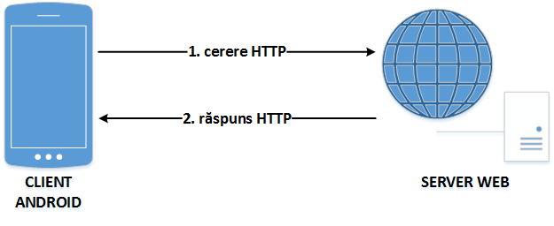

## Protocolul HTTP

De multe ori, funcționalitatea pe care o pun la dispoziție aplicațiile
Android este preluată din alte surse, datorită limitărilor impuse de
capacitatea de procesare și memorie disponibilă ale unui dispozitiv
mobil. O strategie posibilă în acest sens este utilizarea HTTP, pentru
interogarea unor servicii web, al căror rezultat este de cele mai multe
ori oferit în format JSON sau XML. De asemenea, descărcarea unor resurse
se poate face prin inspectarea codului sursă al unor pagini Internet
(documente HTML), în urma acestei operații detectându-se locația la care
acestea sunt disponibile.

**HTTP** (Hypertext Transfer Protocol) este un protocol de comunicație
responsabil cu transferul de hipertext (text structurat ce conține
legături) dintre un client (de regulă, un navigator) și un server web,
interacțiunea dintre acestea (prin intermediul unei conexiuni TCP
persistente pe portul 80) fiind reglementată de [RFC
2616](http:*www.rfc-editor.org/rfc/rfc2616.txt). HTTP este un protocol
fără stare, pentru persistența informațiilor între accesări fiind
necesar să se utilizeze soluții adiacente (cookie, sesiuni, rescrierea
URL-urilor, câmpuri ascunse).

Principalele concepte cu care lucrează acest protocol sunt *cererea* și
*răspunsul*.

-   **cererea** este transmisă de client către serverul web și
    reprezintă o solicitare pentru obținerea unor resurse (identificate
    printr-un URL); aceasta conține denumirea metodei care va fi
    utilizată pentru transferul de informații, locația de unde se
    găsește resursa respectivă și versiunea de protocol;
-   **răspunsul** este transmis de serverul web către client, ca
    rezultat al solicitării primite, incluzând și o linie de stare (ce
    conține un cod care indică dacă starea comenzii) precum și alte
    informații suplimentare

### Structura unei Cereri HTTP

O cerere HTTP conține una sau mai multe linii de text ASCII, precedate
în mod necesar de denumirea metodei specificând operația ce se va
realiza asupra conținutului respectiv:

<table>
<thead>
<tr class="header">
<th><strong>DENUMIRE METODĂ</strong></th>
<th><strong>DESCRIERE</strong></th>
</tr>
</thead>
<tbody>
<tr class="odd">
<td><strong><code>GET</code></strong></td>
<td>descărcarea resursei specificate de pe serverul web pe client; majoritatea cererilor către un server web sunt de acest tip 
<code>GET /page.html HTTP/1.1
Host: www.server.com

</code></td>
</tr>
<tr class="even">
<td><code>HEAD</code></td>
<td>obținerea antetului unei pagini Internet, pentru a se verifica parametrii acesteia sau doar pentru a testa corectitudinea unui URL</td>
</tr>
<tr class="odd">
<td><code>PUT</code></td>
<td>încărcarea resursei specificate de pe client pe serverul web (cu suprascrierea acesteia, în cazul în care există deja); trebuie specificate și datele de autentificare, utilizatorul respectiv trebuind să aibă permisiunile necesare pentru o astfel de operașie</td>
</tr>
<tr class="even">
<td><strong><code>POST</code></strong></td>
<td>transferul de informații de către client cu privire la resursa specificată, acestea urmând a fi prelucrate de serverul web 
<code>POST /page.html HTTP/1.1
Host: www.server.com
attribute1=value1&amp;...&amp;attributen=valuen

</code></td>
</tr>
<tr class="odd">
<td><code>DELETE</code></td>
<td>ștergerea resursei specificate de pe serverul web, rezultatul operației depinzând de permisiunile pe care le deține utilizatorul ale cărui date de autentificare au fost transmise în antete</td>
</tr>
<tr class="even">
<td><code>TRACE</code></td>
<td>solicitare de retransmitere a cererii primite de serverul web de la client, pentru a se testa corectitudinea acesteia</td>
</tr>
<tr class="odd">
<td><code>CONNECT</code></td>
<td>rezervat pentru o utilizare ulterioară</td>
</tr>
<tr class="even">
<td><code>OPTIONS</code></td>
<td>interogare cu privire la atributele serverului web sau ale unei resurse găzduite de acesta</td>
</tr>
</tbody>
</table>

---
**Note**

Capitalizarea este importantă atunci când se precizează
denumirea metodei folosite, făcându-se distincție între minuscule și
majuscule.\

---

Cel mai frecvent, se utilizează metodele `GET` (folosită implicit, dacă
nu se specifică altfel) și `POST`.

#### GET vs. POST

Deși atât metoda `GET` cât și metoda `POST` pot fi utilizate pentru
descărcarea conținutului unei pagini Internet, transmițând către
serverul web valorile unor anumite atribute, între acestea există
anumite diferențe:

-   o cerere `GET` poate fi reținută în cache, fapt ce nu este valabil
    și pentru o cerere `POST`;
-   o cerere `GET` rămâne în istoricul aplicației de navigare, fapt ce
    nu este valabil și pentru o cerere `POST`;
-   o cerere `GET` poate fi reținută printre paginile Internet favorite
    din cadrul programului de navigare, fapt ce nu este valabil și
    pentru o cerere `POST`;
-   o cerere `GET` impune unele restricții cu privire la lungimea (maxim
    2048 caractere) și la tipul de date (doar caractere ASCII) transmise
    (prin URL), fapt ce nu este valabil și pentru o cerere `POST`;
-   o cerere `GET` nu trebuie folosită atunci când sunt implicate
    informații critice (acestea fiind vizibile în URL), fapt ce nu este
    valabil și pentru o cerere `POST`;
-   o cerere `GET` ar trebui să fie folosită doar pentru obținerea unei
    resurse, fapt ce nu este valabil și pentru o cerere `POST`.

### 

O linie de cerere HTTP poate fi succedată de unele informații
suplimentare, reprezentând **antetele de cerere**, acestea având forma
`atribut:valoare`, fiind definite următoarele proprietăți:

-   `User-Agent` - informații cu privire la browser-ul utilizat și la
    platforma pe care rulează acesta
-   informații cu privire la conținutul pe care clientul îl dorește de
    la serverul web, având capacitatea de a-l procesa; dacă serverul
    poate alege dintre mai multe resurse pe care le găzduiește, va alege
    pe cele care respectă constrângerile specificate, altfel întoarce un
    cod de eroare
    -   `Accept` - tipul MIME
    -   `Accept-Charset` - setul de caractere
    -   `Accept-Encoding` - mecanismul de codificare
    -   `Accept-Language` - limba
-   `Host` (obligatoriu) - denumirea gazdei pe care se găsește resursa
    (specificată în URL); necesară întrucât o adresă IP poate fi
    asociată mai multor nume de DNS
-   `Authorization` - informații de autentificare în cazul unor operații
    care necesită drepturi privilegiate
-   `Cookie` - transmite un cookie primit anterior
-   `Date` - data și ora la care a fost transmisă cererea

### Structura unui Răspuns HTTP

Un răspuns HTTP este format din linia de stare, antetele de răspuns și
posibile informații suplimentare, conținând o parte sau toată resursa
care a fost solicitată de client de pe serverul web.

În cadrul **liniei de stare** este inclus un cod din trei cifre care
indică dacă solicitarea a putut fi îndeplinită sau nu (situație în care
este indicată și cauza).

| **FAMILIE DE CODURI** | **SEMNIFICAȚIE** | **DESCRIERE**                                                                                                                                                                                                                                                                                                                       |
|-----------------------|------------------|-------------------------------------------------------------------------------------------------------------------------------------------------------------------------------------------------------------------------------------------------------------------------------------------------------------------------------------|
| 1xx                   | Informație       | răspuns provizoriu, constând din linia de stare și alte antete (fără conținut, terminat de o linie vidă), indicând faptul că cererea a fost primită, procesarea sa fiind încă în desfășurare; nu este utilizată în HTTP/1.0                                                                                                         |
| 2xx                   | Succes           | răspuns ce indică faptul că cererea a fost primită, înțeleasă, acceptată și procesată cu succes                                                                                                                                                                                                                                     |
| 3xx                   | Redirectare      | răspuns transmis de serverul web ce indică faptul că trebuie realizate acțiuni suplimentare din partea clientului (cu sau fără interacțiunea utilizatorului, în funcție de metoda folosită) pentru ca cererea să poată fi îndeplinită; în cazul în care redirectarea se repetă de mai multe ori, se poate suspecta o buclă infinită |
| 4xx                   | Eroare la client | răspuns transmis de serverul web ce indică faptul că cererea nu a putut fi îndeplinită, datorită unei erori la nivelul clientului; mesajul include și o entitate ce conține o descriere a situației, inclusiv tipul acesteia (permanentă sau temporară)                                                                             |
| 5xx                   | Eroare la server | cod de răspuns ce indică clientului faptul că cererea nu a putut fi îndeplinită, datorită unei erori la nivelul serverului web; mesajul include și o entitate ce conține o descriere a situației, inclusiv tipul acesteia (permanentă sau temporară)                                                                                |

Mesajul conține și **antetele de răspuns**, având forma
`atribut:valoare`, fiind definite următoarele proprietăți:

-   `Server` - informații cu privire la mașina care găzduiește resursa
    care este transmisă
-   informații cu privire la proprietățile conținutului care este
    transmis
    -   `Content-Encoding` - mecanismul de codificare
    -   `Content-Language` - limba
    -   `Content-Length` - dimensiunea
    -   `Content-Type` - tipul MIME
-   `Last-Modified` - ora și data la care pagina Internet a fost
    modificată
-   `Location` - informație prin care serverul web informează clientul
    de faptul că ar trebui folosit alt URL (resursa a fost mutată sau
    trebuie accesată o pagină Internet localizată în funcție de anumite
    preferințe)
-   `Accept-Ranges` - informație referitoare la transmiterea
    conținutului solicitat în mai multe părți, corespunzătoare unor
    intervale de octeți
-   `Set-Cookie` - transmiterea unui cookie de la serverul web la
    client, acesta trebuind să fie inclus în antetele ulterioare ale
    mesajelor schimbate între cele două entități