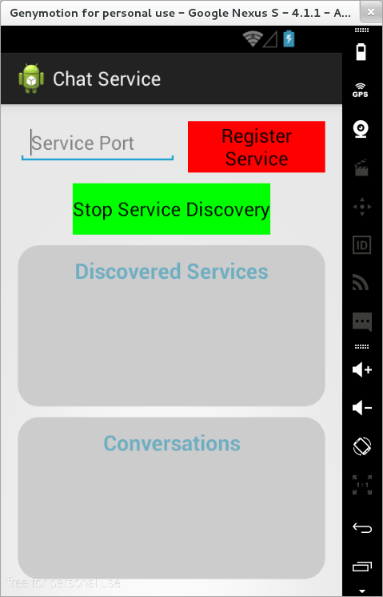
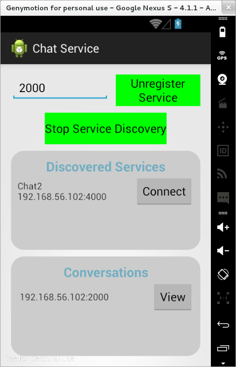
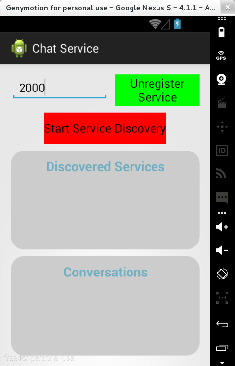
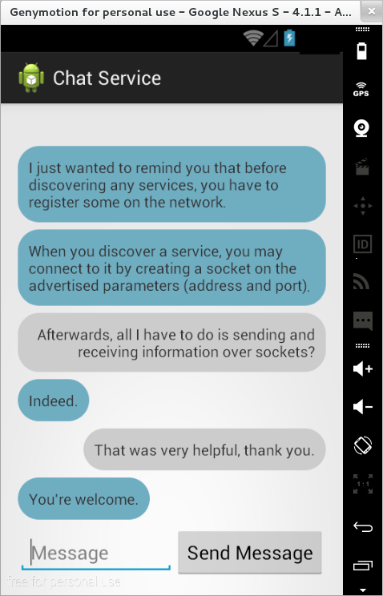
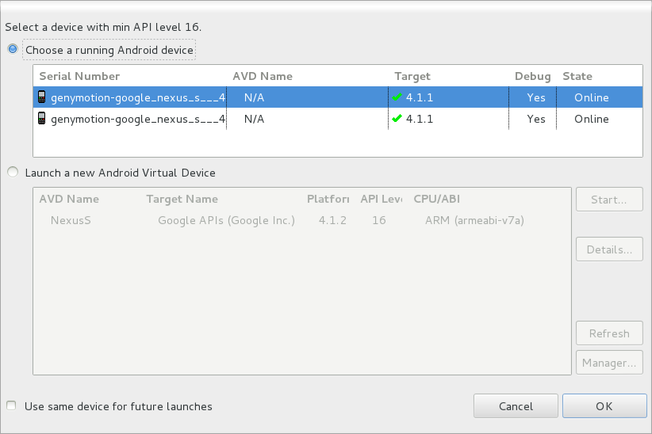

# Laborator 09. Descoperirea Serviciilor de Rețea

O problemă des întâlnită de un dispozitiv mobil este descoperirea de
funcționalități care pot fi accesate într-o rețea locală vizitată. De
obicei, se dorește stabilirea de conexiuni punct la punct peste care pot
fi tehnologiile clasice de tipul client/server sau RPC. Totodată, pot fi
expuse și servicii clasice ale unor alte dispozitive din cadrul rețelei
locale cum ar fi: calculatoare, imprimante, televizoare, ceasuri
inteligente, acestea putând fi astfel accesate fără configurare
prealabilă.

Serviciile din rețea pot fi implementate folosind două variante:

1.  [Android Network Service Discovery
    (NSD)](http:*developer.android.com/training/connect-devices-wirelessly/nsd.html),
    un protocol integrat în Android începând cu nivelul de API 16 (Jelly
    Bean), pentru implementarea de servicii disponibile în rețeaua
    locală (opțional în acest laborator);
2.  [JmDNS](http:*jmdns.sourceforge.net/), un proiect open-source care
    își propune implementarea în Java a unor funcționalități legate de
    proiectarea și dezvoltarea de servicii disponibile în rețeaua
    locală, fără a realiza nici un fel de configurări legate de
    infrastructura de comunicație.

> Atât Android NSD cât și JmDNS folosesc [multi-cast
DNS](http://www.multicastdns.org/) (utilizarea de operații DNS în rețele
de dimensiuni mici, în care nu există un server propriu-zis pentru un
astfel de serviciu) pentru accesul la servicii în rețeaua
locală.


Operațiile utilizate în implementarea serviciilor de rețea sunt:

1.  **configurarea** diferiților parametri (pregătirea mediului de
    lucru);
2.  **înregistrarea** unui serviciu, prin care celelalte dispozitive din
    rețeaua locală pot afla detalii cu privire la funcționalitatea
    oferită (tip de serviciu, adresă, port, descriere);
3.  **descoperirea** unui serviciu, prin care un dispozitiv este
    informat cu privire la serviciile care pot fi accesate în rețeaua
    locală, filtrându-le în funcție de denumire și tip;
4.  **rezolvarea** unui serviciu, prin care sunt identificate adresa și
    portul la care trebuie realizată o conexiune în vederea exploatării
    funcționalității pe care acesta o pune la dispoziție.

---
**Note**

Operațiile de înregistrare respectiv descoperire / rezolvare
sunt independente, astfel încât o aplicație poate alege doar să
înregistreze un serviciu, în timp ce altă aplicație poate doar să
descopere / rezolve serviciile din rețeua locală. Totodată, operațiile
pot fi realizate și împreună, fără a exista o ordine
prestabilită.\

---

## Tipuri de Servicii

Cele mai multe servicii accesibile prin rețeaua locală sunt descrise
prin intermediul unui tip care are de obicei forma
`_<protocol_nivel_aplicatie>._<protocol_nivel_transport>.`, unde:

-   `<protocol_nivel_aplicatie>` poate fi standard sau definit de
    utilizator;
-   `<protocol_nivel_transport>` este de regulă `tcp` sau `udp` (sau
    variații ale acestora).

Se poate consulta [lista cu tipurile de servicii
rezervate](http:*www.iana.org/assignments/service-names-port-numbers/service-names-port-numbers.xml),
gestionată de IANA (Autoritatea Internațională pentru Numere Alocate).
Unele tipuri de servicii au definite și porturile pe care pot fi
accesate.Pentru rezervarea unui astfel de tip de serviciu, este necesară
o solicitare prealabilă, care poate fi aprobată sau respinsă, după caz.

Pentru Android NSD, pentru cele mai multe servicii nespecifice, se poate
folosi tipul `_http._tcp.` (se folosește transferul de date prin HTTP
folosind protocolul de transport TCP).

În cazul JmDNS, trebuie să se precizeze faptul că serviciul rulează
local, definindu-se un tip corespunzător aplicației care implementează
funcționalitatea respectivă (`_<denumire_aplicatie>._tcp.local.`).

## Zeroconf sub Linux

Se poate crea un **advertisement** de serviciu sub Linux prin crearea
unui fișier de configurare, folosiți un alt nume în loc de
perfectdesktop:

``` xml
$ cat   /etc/avahi/services/chat.service 
<?xml version="1.0" standalone='no'?>
<!DOCTYPE service-group SYSTEM "avahi-service.dtd">
<service-group>
  <name>Chat-perfectdesktop</name>
  <service>
    <type>_chatservice._tcp</type>
    <port>5003</port>
  </service>
</service-group>
```

Se restartează severul de zeroconf cu comanda

``` shell
# /etc/init.d/avahi-daemon restart
```

Apoi se poate verifica cu tcpdump traficul specific DNS-SD care este
generat:

``` shell
#tcpdump -ni eth0 -s0 -w 'file1.pcap' 'udp port 5353'
```

Traficul capturat în file1.pcap poate fi examinat cu
`wireshark file1.pcap`. Dacă ați rulat tcpdump pe telefon, este necesară
aducerea fișierului .pcap pe desktop cu jurorul comanzii
`adb pull /sdcard/file1.pcap .`

Din alt terminal, se poate lansa o căutare de servicii de tipul
chatservice:

``` shell
#avahi-browse -rk _chatservice._tcp
```

Iar în tcpdump se observă primirea query-urilor pentru serviciu, și
răspunsul desktop-ului. Atenție, acesta nu este un serviciu care rulează
pe portul 5003, ci doar anunțul(**advertisement**) pentru serviciu.

## Configurare

Inițializarea mediului de lucru presupune instanțierea unor obiecte care
gestionează operațiile ce pot fi realizate la nivelul serviciilor de
rețea, respectiv a unor obiecte ascultător pentru evenimentele care pot
surveni în cadrul acestora.

### Android NSD (opțional)

Configurarea Android NSD presupune obținerea unei referințe către un
obiect de tipul
[NsdManager](http://developer.android.com/reference/android/net/nsd/NsdManager.html),
care oferă funcționalități referitoare la gestiunea serviciilor
existente doar în cadrul rețelei locale.

``` java
NsdManager nsdManager = (NsdManager)context.getSystemService(Context.NSD_SERVICE);
```

API-ul pe care îl pune la dispoziție un astfel de obiect este asincron,
astfel încât metodele apelate în cadrul claselor ascultător pentru
diferite evenimente (înregistrare, descoperire, rezolvare) sunt
executate în contextul unor fire de execuție dedicate, așa cum trebuie
procedat în condițiile unor operații ce implică comunicația prin rețea.

Metodele pe care le implementează un obiect de tipul `NsdManager` sunt
legate de operațiile ce pot fi realizate cu serviciile accesibile în
cadrul rețelei locale:

-   înregistrare
    -   [registerService(NsdServiceInfo, int,
        NsdManager.RegistrationListener)](http:*developer.android.com/reference/android/net/nsd/NsdManager.html#registerService%28android.net.nsd.NsdServiceInfo,%20int,%20android.net.nsd.NsdManager.RegistrationListener%29) -
        folosită pentru înregistrarea unui serviciu, care să poată fi
        disponibil ulterior în cadrul rețelei locale;
    -   [unregisterService(NsdManager.RegistrationListener)](http:*developer.android.com/reference/android/net/nsd/NsdManager.html#unregisterService%28android.net.nsd.NsdManager.RegistrationListener%29) -
        folosită pentru deînregistrarea unui serviciu, astfel încât
        acesta să nu mai poată fi accesat, atunci când nu mai este
        necesar sau aplicația Android este distrusă.
-   descoperire
    -   [discoverServices(String, int,
        NsdManager.DiscoveryListener)](http:*developer.android.com/reference/android/net/nsd/NsdManager.html#discoverServices%28java.lang.String,%20int,%20android.net.nsd.NsdManager.DiscoveryListener%29) -
        folosită pentru pornirea descoperirii de servicii accesibile în
        rețeaua locală, operație care va fi realizată permanent, până
        când se va specifica altfel (explicit), afectând resurse precum
        transferul de informații prin rețeaua locală (lățimea de bandă)
        și bateria;
    -   [stopServiceDiscovery(NsdManager.DiscoveryListener)](http:*developer.android.com/reference/android/net/nsd/NsdManager.html#stopServiceDiscovery%28android.net.nsd.NsdManager.DiscoveryListener%29) -
        folosită pentru oprirea descoperirii de servicii, atunci când
        acesta nu mai este necesară sau aplicația Android este
        întreruptă temporar.
-   rezolvare - [resolveService(NsdServiceInfo,
    NsdManager.ResolveListener)](http:*developer.android.com/reference/android/net/nsd/NsdManager.html#resolveService%28android.net.nsd.NsdServiceInfo,%20android.net.nsd.NsdManager.ResolveListener%29),
    pentru a identifica parametrii de conexiune ai unui serviciu (adresă
    și port).

Se observă că de regulă aceste metode primesc parametrii de tip:

-   [NsdServiceInfo](http:*developer.android.com/reference/android/net/nsd/NsdServiceInfo.html) -
    în care sunt stocate perechi de tipul (atribut, valoare) cu privire
    la serviciul disponibil în rețea:
    -   denumire;
    -   tip;
    -   adresă;
    -   port.
-   ascultător pentru diferite evenimente legate de operațiile cu
    serviciile accesibile în rețea (înregistrare, descoperire,
    rezolvare), fiecare definind metode care descriu comportamentul
    pentru fiecare rezultat posibil al acestora.

În fișierul `AndroidManifest.xml`, singurele permisiuni care trebuie
oferite aplicației sunt cele legate de accesul la rețeaua locală:

``` xml
<manifest xmlns:android="http:*schemas.android.com/apk/res/android"
    package="ro.pub.cs.systems.eim.lab08.chatservice"
    android:versionCode="1"
    android:versionName="1.0">
    
    <uses-permission 
        android:name="android.permission.INTERNET" />
        
    <!-- ... -->

</manifest>
```

### JmDNS

Întrucât [versiunea curentă a JmDNS
(3.4.1)](http:*sourceforge.net/projects/jmdns/) oferă o bibliotecă sub
forma unei arhive .jar care nu poate fi procesată în momentul în care
este transformată în formatul `.dex`, este necesar ca aceasta să fie
prelucrată, în sensul menținerii acelor clase care sunt strict necesare
pentru gestiunea serviciilor de rețea, și anume cele din pachetul
`javax.jmdns`.

    student@eg106:~$ jar xf jmdns.jar
    student@eg106:~$ jar cfm jmdns.jar META-INF/MANIFEST.MF javax/

JmDNS folosește pachete de tip multicast pentru a gestiona serviciile
disponibile în rețea. Politica Android este de a dezactiva implicit
astfel de transferuri, pentru a optimiza bateria, motiv pentru care
această funcționalitate trebuie activată temporar, doar pe parcursul
aplicației Android. În acest sens, trebuie obținut mutext-ul
corespunzător operațiilor de acest tip, care va fi eliberat ulterior:

``` java
public class ChatActivity extends Activity {

  * ...
  
  protected WifiManager wifiManager = null;

  @Override
  protected void onCreate(Bundle state) {
    super.onCreate(state);
  
    * ...

    WifiManager wifiManager = (WifiManager)getSystemService(Context.WIFI_SERVICE);
    multicastLock = wifiManager.createMulticastLock(Constants.TAG);
    multicastLock.setReferenceCounted(true);
    multicastLock.acquire();
  }

  @Override
  protected void onDestroy() {
    super.onDestroy();
  
    * ...
  
    if (multicastLock != null) {
      multicastLock.relase();
      multicastLock = null;
    }
  }
  
  * ...
  
}
```

Configurarea JmDNS presupune crearea unei instanțe a unui obiect de
tipul
[JmDNS](http:*jmdns.sourceforge.net/apidocs/javax/jmdns/JmDNS.html),
care oferă funcționalități referitoare la gestiunea serviciilor
existente doar în cadrul rețelei locale. Se utilizează metoda statică
[create(InetAddress,
String)](http:*jmdns.sourceforge.net/apidocs/javax/jmdns/JmDNS.html#create%28java.net.InetAddress,%20java.lang.String%29),
care primește ca parametri:

-   adresa mașinii, obținută prin intermediul metodei `getIpAddress()`
    apelată pe obiectul `ConnectionInfo` asociat obiectului care
    gestoniează interfața pentru comunicația prin intermediul rețelei
    fără fir;
-   denumirea mașinii (determinată pe baza adresei, prin rezoluție
    inversă).

``` java
try {
  WifiManager wifiManager = ((ChatActivity)context).getWifiManager();
  InetAddress address = InetAddress.getByAddress(
    ByteBuffer.allocate(4).putInt(
      Integer.reverseBytes(wifiManager.getConnectionInfo().getIpAddress())
    ).array()
  );
  String name = address.getHostName();
  Log.i(Constants.TAG, "address = " + address + " name = " + name);
  jmDns = JmDNS.create(address, name);
} catch (IOException ioException) {
  Log.e(Constants.TAG, "An exception has occurred: " + ioException.getMessage());
  if (Constants.DEBUG) {
    ioException.printStackTrace();
  }
}   
```

---
**Note**

Instanțierea unui obiect de tip `JmDNS` trebuie să se
realizeze pe firul de execuție al comunicației prin rețea, în caz
contrar generându-se o excepție de tipul
`android.os.NetworkOnMainThreadException`.\

---

API-ul pe care îl pune la dispoziție un astfel de obiect este asincron,
astfel încât metodele apelate în cadrul claselor ascultător pentru
diferite evenimente (înregistrare, descoperire, rezolvare) sunt
executate în contextul unor fire de execuție dedicate, așa cum trebuie
procedat în condițiile unor operații ce implică comunicația prin rețea.

-   înregistrare
    -   [registerService(ServiceInfo)](http:*jmdns.sourceforge.net/apidocs/javax/jmdns/JmDNS.html#registerService%28javax.jmdns.ServiceInfo%29) -
        folosită pentru înregistrarea unui serviciu, care să poată fi
        disponibil ulterior în cadrul rețelei locale;
    -   [unregisterService(ServiceInfo)](http:*jmdns.sourceforge.net/apidocs/javax/jmdns/JmDNS.html#unregisterService%28javax.jmdns.ServiceInfo%29)
        sau
        [unregisterAllServices()](http:*jmdns.sourceforge.net/apidocs/javax/jmdns/JmDNS.html#unregisterAllServices%28%29)-
        folosită pentru deînregistrarea unui serviciu, astfel încât
        acesta să nu mai poată fi accesat, atunci când nu mai este
        necesar sau aplicația Android este distrusă.
-   descoperire
    -   [addServiceListener(String,
        ServiceListener)](http:*jmdns.sourceforge.net/apidocs/javax/jmdns/JmDNS.html#addServiceListener%28java.lang.String,%20javax.jmdns.ServiceListener%29) -
        folosită pentru pornirea descoperirii de servicii accesibile în
        rețeaua locală, operație care va fi realizată permanent, până
        când se va specifica altfel (explicit), afectând resurse precum
        transferul de informații prin rețeaua locală (lățimea de bandă)
        și bateria; vor fi monitorizate doar serviciile de un anumit
        tip;
    -   [removeServiceListener(ServiceListener)](http:*jmdns.sourceforge.net/apidocs/javax/jmdns/JmDNS.html#removeServiceListener%28java.lang.String,%20javax.jmdns.ServiceListener%29) -
        folosită pentru oprirea descoperirii de servicii de un anumit
        tip, atunci când acesta nu mai este necesară sau aplicația
        Android este întreruptă temporar.
-   rezolvare - [requestServiceInfo(String,
    String)](http:*jmdns.sourceforge.net/apidocs/javax/jmdns/JmDNS.html#requestServiceInfo%28java.lang.String,%20java.lang.String%29),
    pentru a identifica parametrii de conexiune (adresă și port) ai unui
    serviciu pentru care se cunoaște tipul și denumirea.â

Se observă că de regulă aceste metode primesc parametrii de tip:

-   [ServiceInfo](http:*jmdns.sourceforge.net/apidocs/javax/jmdns/ServiceInfo.html) -
    în care sunt stocate perechi de tipul (atribut, valoare) cu privire
    la serviciul disponibil în rețea:
    -   denumire;
    -   tip / subtip;
    -   adresă / denumire dispozitiv care găzduiește serviciul;
    -   port pe care poate fi accesat serviciul;
    -   prioritate;
    -   protocol
    -   date
    -   URL.
-   ascultător pentru diferite evenimente legate de operațiile cu
    serviciile accesibile în rețea (înregistrare, descoperire,
    rezolvare), fiecare definind metode care descriu comportamentul
    pentru fiecare rezultat posibil al acestora.

Resusele asociate obiectului de tip `JmDNS` trebuie eliberate în
momentul în care acesta nu mai este necesar (aplicația Android este
distrusă):

``` java
try {
  if (jmDns != null) {
    jmDns.close();
    jmDns = null;
  }
} catch (IOException ioException) {
  Log.e(Constants.TAG, "An exception has occurred: " + ioException.getMessage());
  if (Constants.DEBUG) {
    ioException.printStackTrace();
  }
}
```

În fișierul `AndroidManifest.xml`, permisiunile care trebuie oferite
aplicației vizează:

-   accesul la Internet;
-   schimbarea politicii cu privire la procesarea pachetelor de tip
    multi-cast (implicit dezactivate, pentru a optimiza consumul de
    energie);
-   accesul la starea rețelei fără fir;
-   accesul la starea rețelei cu fir.

``` xml
<manifest xmlns:android="http:*schemas.android.com/apk/res/android"
    package="ro.pub.cs.systems.eim.lab08.chatservice"
    android:versionCode="1"
    android:versionName="1.0">
    
    <uses-permission
        android:name="android.permission.INTERNET"/>
    <uses-permission
        android:name="android.permission.CHANGE_WIFI_MULTICAST_STATE"/>
    <uses-permission
        android:name="android.permission.ACCESS_WIFI_STATE" />
    <uses-permission
        android:name="android.permission.ACCESS_NETWORK_STATE" />
        
    <!-- ... -->

</manifest>
```

## Înregistrarea / Deînregistrarea unui Serviciu

### Android NSD (opțional)

Pentru **înregistrarea unui serviciu**, se apelează metoda
[registerService(NsdServiceInfo, int,
NsdManager.RegistrationListener)](http:*developer.android.com/reference/android/net/nsd/NsdManager.html#registerService%28android.net.nsd.NsdServiceInfo,%20int,%20android.net.nsd.NsdManager.RegistrationListener%29)
din clasa `NsdManager`, ulterior serviciul putând fi accesat din cadrul
altor mașini fizice / dispozitive mobile. Aceasta primește ca parametri:

-   un obiect `NsdServiceInfo`, ce reține informații precum denumirea și
    tipul serviciului, adresa și portul mașinii / dispozitivului pe care
    va fi disponibil;

---
**Note**

 Întrucât, de regulă, odată cu înregistrarea serviciului este
pornit și un server care va aștepta invocări de la clienți, adresa și
portul pot fi preluate de la obiectul de tip `ServerSocket` astfel
instanțiat sau pot fi folosite valori obținute de la utilizator:

``` java
ServerSocket serverSocket = new ServerSocket(0);
InetAddress address = serverSocket.getInetAddress();
int port = serverSocket.getLocalPort();
```

Valoarea 0 a parametrului din constructorul obiectului `ServerSocket`
indică faptul că se va folosi un port libere, aleator. O astfel de
abordare este de preferat, întrucât se evită eventualele conflicte cu
privire la porturile ocupate. \

---

-   protocolul, în acest caz folosindu-se `NsdManager.PROTOCOL_DNS_SD`;
-   un obiect ascultător de tipul `NsdManager.RegistrationListener`,
    care trebuie să implementeze metodele:
    -   [onServiceRegistered(NsdServiceInfo)](http:*developer.android.com/reference/android/net/nsd/NsdManager.RegistrationListener.html#onServiceRegistered%28android.net.nsd.NsdServiceInfo%29),
        apelată în mod automat în momentul în care înregistrarea
        serviciului a fost realizată cu succes;
    -   [onRegistrationFailed(NsdServiceInfo,
        int)](http:*developer.android.com/reference/android/net/nsd/NsdManager.RegistrationListener.html#onRegistrationFailed%28android.net.nsd.NsdServiceInfo,%20int%29),
        apelată în mod automat în momentul în care înregistrarea
        serviciului a eșuat, oferindu-se și un cod de eroare pentru
        depanarea cauzei.

Pentru **deînregistrarea unui serviciu**, se apelează metoda
[unregisterService(NsdManager.RegistrationListener)](http:*developer.android.com/reference/android/net/nsd/NsdManager.html#unregisterService%28android.net.nsd.NsdManager.RegistrationListener%29)
din clasa `NsdManager`. Aceasta primește ca parametru un obiect
ascultător de tipul `NsdManager.RegistrationListener`, care trebuie să
implementeze metodele:

-   [onServiceUnegistered(NsdServiceInfo)](http:*developer.android.com/reference/android/net/nsd/NsdManager.RegistrationListener.html#onServiceUnregistered%28android.net.nsd.NsdServiceInfo%29),
    apelată în mod automat în momentul în care deînregistrarea
    serviciului a fost realizată cu succes;
-   [onUnregistrationFailed(NsdServiceInfo,
    int)](http:*developer.android.com/reference/android/net/nsd/NsdManager.RegistrationListener.html#onUnregistrationFailed%28android.net.nsd.NsdServiceInfo,%20int%29),
    apelată în mod automat în momentul în care deînregistrarea
    serviciului a eșuat, oferindu-se și un cod de eroare pentru
    depanarea cauzei.

---
**Note**

Odată cu deînregistrarea serviciului, se va opri și serverul
care așteaptă invocări de la clienți.\

---

``` java
public void registerNetworkService() throws Exception { 
  chatServer = new ChatServer(this);
  ServerSocket serverSocket = chatServer.getServerSocket();
  if (serverSocket == null) {
    throw new Exception("Could not get server socket");
  }
  chatServer.start();  
  
  NsdServiceInfo nsdServiceInfo  = new NsdServiceInfo();
  nsdServiceInfo.setServiceName(Constants.SERVICE_NAME);
  nsdServiceInfo.setServiceType(Constants.SERVICE_TYPE);
  nsdServiceInfo.setHost(serverSocket.getInetAddress());
  nsdServiceInfo.setPort(serverSocket.getLocalPort());
  
  nsdManager.registerService(
    nsdServiceInfo,
    NsdManager.PROTOCOL_DNS_SD,
    registrationListener
  );
}
    
public void unregisterNetworkService() {
  nsdManager.unregisterService(registrationListener);
  
  chatServer.stopThread();
  
  * ...
}
```

De regulă, metodele obiectului de tip `NsdManager.RegistrationListener`
nu vor avea alt rol cu excepția jurnalizării evenimentelor respective,
mai ales atunci când operațiile de înregistrare / deînregistrare
eșuează.

În momentul în care înregistrarea s-a realizat cu succes, se va reține
denumirea serviciului, fapt important întrucât în situația în care în
rețeaua locală există un alt serviciu cu aceeași denumire, sistemul de
operare Android va trata o astfel de situație prin atașarea unui indice
'' (x)'', indicând al câtelea serviciu duplicat a fost identificat.

În momentul în care deînregistrarea s-a realizat cu succes, nu este
necesar să se realizeze nici o operație.

``` java
NsdManager.RegistrationListener registrationListener = new RegistrationListener() {
  @Override
  public void onServiceRegistered(NsdServiceInfo nsdServiceInfo) {
    serviceName = nsdServiceInfo.getServiceName();
  }
  
  @Override
  public void onRegistrationFailed(NsdServiceInfo nsdServiceInfo, int errorCode) {
    Log.e(Constants.TAG, "An exception occured while registering the service: " + errorCode);
  }
  
  @Override
  public void onServiceUnregistered(NsdServiceInfo nsdServiceInfo) {
  }
  
  @Override
  public void onUnregistrationFailed(NsdServiceInfo nsdServiceInfo, int errorCode) {
    Log.e(Constants.TAG, "An exception occured while unregistering the service: " + errorCode);
  }
};
```

### JmDNS

Pentru **înregistrarea unui serviciu**, se apelează metoda
[registerService(ServiceInfo)](http:*jmdns.sourceforge.net/apidocs/javax/jmdns/JmDNS.html#registerService%28javax.jmdns.ServiceInfo%29)
din clasa `JmDNS`, ulterior serviciul putând fi accesat din cadrul altor
mașini fizice / dispozitive mobile.

Pentru **deînregistrarea unui serviciu**, se poate apela una din
metodele
[unregisterService(ServiceInfo)](http:*jmdns.sourceforge.net/apidocs/javax/jmdns/JmDNS.html#unregisterService%28javax.jmdns.ServiceInfo%29),
respectiv
[unregisterAllServices()](http:*jmdns.sourceforge.net/apidocs/javax/jmdns/JmDNS.html#unregisterAllServices())
din clasa `JmDNS`.

\<note>Aceste metode primesc ca parametru un obiect de tip
`ServiceInfo`, ce reține informații precum denumirea și tipul
serviciului, adresa și portul mașinii / dispozitivului pe care va fi
disponibil (ce pot fi preluate, din cadrul unui obiect de tip
`ServerSocket`).\

---

---
**Note**

JmDNS nu oferă informații cu privire la rezultatul
operațiilor de înregistrare / deînregistrare.\

---

``` java
public void registerNetworkService() throws Exception {
  chatServer = new ChatServer(this);
  ServerSocket serverSocket = chatServer.getServerSocket();
  if (serverSocket == null) {
    throw new Exception("Could not get server socket");
  }
  chatServer.start();
  
  ServiceInfo serviceInfo = ServiceInfo.create(
    Constants.SERVICE_TYPE,
    Constants.SERVICE_NAME,
    port,
    Constants.SERVICE_DESCRIPTION
  );
  
  if (jmDns != null && serviceInfo != null) {
    serviceName = serviceInfo.getName();
    jmDns.registerService(serviceInfo);
  }
}

public void unregisterNetworkService() {
  if (jmDns != null) {
    jmDns.unregisterAllServices();
  } 
  
  chatServer.stopThread();
  
  * ...
}
```

## Descoperirea Serviciilor Accesibile

Operațiile de **pornire** / **oprire** a descoperirii serviciilor
disponibile trebuie să aibă în vedere resursele afectate precum și
impactul asupra altor funcționalități cum ar fi viteza de transfer prin
rețea, respectiv autonomia.

De regulă, pornirea operației de descoperire a serviciilor disponibile
este realizată pe metoda `onResume()`, adică din momentul în care
activitatea este vizibilă.

Similar, oprirea operației de descoperire a serviciilor disponibile este
realizată pe metoda `onPause()`, adică din momentul în care activitatea
nu este vizibilă.

Totodată, este recomandat să se pună la dispoziția utilizatorilor
elemente în cadrul interfeței grafice prin intermediul cărora aceste
operații să poată fi controlate prin interacțiunea cu cei care folosesc
aplicația Android.

### Android NSD (opțional)


\*\*Pornirea \*\* operației de descoperire a serviciilor disponibile se
face prin intermediul metodei [discoverServices(String, int,
NsdManager.DiscoveryListener)](http:*developer.android.com/reference/android/net/nsd/NsdManager.html#discoverServices%28java.lang.String,%20int,%20android.net.nsd.NsdManager.DiscoveryListener%29)
din clasa `NsdManager` care primește ca parametri:

-   tipul de serviciu;
-   protocolul, în acest caz folosindu-se `NsdManager.PROTOCOL_DNS_SD`;
-   un obiect ascultător de tipul `NsdManager.DiscoveryListener`, care
    trebuie să implementeze metodele:
    -   [onDiscoveryStarted(String)](http:*developer.android.com/reference/android/net/nsd/NsdManager.DiscoveryListener.html#onDiscoveryStarted%28java.lang.String%29) -
        apelată în mod automat dacă pornirea operației de căutare a
        serviciilor a fost realizată cu succes;
    -   [onStartDiscoveryFailed(String,
        int)](http:*developer.android.com/reference/android/net/nsd/NsdManager.DiscoveryListener.html#onStartDiscoveryFailed%28java.lang.String,%20int%29) -
        apelată în mod automat dacă pornirea operației de căutare a
        serviciilor a eșuat, oferindu-se și un cod de eroare care poate
        fi folosit în scopuri de depanare.

**Oprirea** operației de descoperire a serviciilor disponibile se face
prin intermediul metodei
[stopServiceDiscovery(NsdManager.DiscoveryListener)](http:*developer.android.com/reference/android/net/nsd/NsdManager.html#stopServiceDiscovery%28android.net.nsd.NsdManager.DiscoveryListener%29)
din clasa `NsdManager` care primește ca parametru un obiect ascultător
de tipul `NsdManager.DiscoveryListener`, care trebuie să implementeze
metodele:

      * [[http:*developer.android.com/reference/android/net/nsd/NsdManager.DiscoveryListener.html#onDiscoveryStopped%28java.lang.String%29|onDiscoveryStopped(String)]] - apelată în mod automat dacă oprirea operației de căutare a serviciilor a fost realizată cu succes;
      * [[http:*developer.android.com/reference/android/net/nsd/NsdManager.DiscoveryListener.html#onStopDiscoveryFailed%28java.lang.String,%20int%29|onStopDiscoveryFailed(String, int)]] - apelată în mod automat dacă oprirea operației de căutare a serviciilor a eșuat, oferindu-se și un cod de eroare care poate fi folosit în scopuri de depanare.

``` java
public void startNetworkServiceDiscovery() {
  nsdManager.discoverServices(Constants.SERVICE_TYPE, NsdManager.PROTOCOL_DNS_SD, discoveryListener);
}
    
public void stopNetworkServiceDiscovery() {
  nsdManager.stopServiceDiscovery(discoveryListener);
  
  * ...
}
```

Pentru obiectul de tip `NsdManager.DiscoveryListener` trebuie
implementate și metodele apelate în mod automat în momentul în care un
serviciu este găsit, respectiv este pierdut:

-   [onServiceFound(NsdServiceInfo)](http:*developer.android.com/reference/android/net/nsd/NsdManager.DiscoveryListener.html#onServiceFound%28android.net.nsd.NsdServiceInfo%29) -
    se verifică parametrii serviciului descoperit (tip și denumire),
    putându-se întâlni următoarele situații:
    1.  tip de serviciu necunoscut (cu toate că descoperirea implică
        filtrarea după un tip de servicii specific);
    2.  descoperirea serviciului oferit de mașina curentă / dispozitivul
        curent - se realizează comparația dintre denumirea serviciului
        găsit și denumirea serviciului curent;
    3.  descoperirea unui serviciu oferit de o altă mașină / un alt
        dispozitiv (se poate folosi un șablon pe denumirea
        serviciului) - se trece la rezolvarea serviciului respectiv
        (prin invocarea metodei
        `resolveService(NsdServiceInfo, NsdManager.ResolveListener)` din
        cadrul obiectului de tip `NsdManager`.
-   [onServiceLost(NsdServiceInfo)](http:*developer.android.com/reference/android/net/nsd/NsdManager.DiscoveryListener.html#onServiceLost%28android.net.nsd.NsdServiceInfo%29) -
    se gestionează corespunzător lista de servicii descoperite.

---
**Note**

În cazul în care se produce o eroare (indiferent de momentul
la care are loc - pornirea sau oprirea procesului de descoperire a
serviciilor), se termină orice activitate legată de descoperirea
serviciilor.\

---

``` java
DiscoveryListener discoveryListener = new DiscoveryListener() {

  @Override
  public void onDiscoveryStarted(String serviceType) {
    Log.i(Constants.TAG, "Service discovery started: " + serviceType);
  }
  
  @Override
  public void onServiceFound(NsdServiceInfo nsdServiceInfo) {
    Log.i(Constants.TAG, "Service found: " + nsdServiceInfo);
    if (!nsdServiceInfo.getServiceType().equals(Constants.SERVICE_TYPE)) {
      Log.i(Constants.TAG, "Unknown Service Type: " + nsdServiceInfo.getServiceType());
    } else if (nsdServiceInfo.getServiceName().equals(serviceName)) {
      Log.i(Constants.TAG, "The service running on the same machine has been discovered: " + serviceName);
    } else if (nsdServiceInfo.getServiceName().contains(Constants.SERVICE_NAME_SEARCH_KEY)) {
      nsdManager.resolveService(nsdServiceInfo, resolveListener);
    }
  }
  
  @Override
  public void onServiceLost(final NsdServiceInfo nsdServiceInfo) {
    Log.i(Constants.TAG, "Service lost: " + nsdServiceInfo);
    
    ArrayList<NetworkService> discoveredServices = chatActivity.getDiscoveredServices();
    NetworkService networkService = new NetworkService(
      nsdServiceInfo.getServiceName(),
      (nsdServiceInfo.getHost() != null) ? nsdServiceInfo.getHost().toString() : null, 
      nsdServiceInfo.getPort(), 
      -1
    );
    
    if (discoveredServices.contains(networkService)) {
      int index = discoveredServices.indexOf(networkService);
      discoveredServices.remove(index);
      chatActivity.setDiscoveredServices(discoveredServices);
    }
    
    * ...
  }
  
  @Override
  public void onDiscoveryStopped(String serviceType) {
    Log.i(Constants.TAG, "Service discovery stopped: " + serviceType);
  }
  
  @Override
  public void onStartDiscoveryFailed(String serviceType, int errorCode) {
    Log.e(Constants.TAG, "Service discovery start failed - Error code:" + errorCode);
    nsdManager.stopServiceDiscovery(this);
  }
  
  @Override
  public void onStopDiscoveryFailed(String serviceType, int errorCode) {
    Log.e(Constants.TAG, "Service discovery stop failed - Error code:" + errorCode);
    nsdManager.stopServiceDiscovery(this);
  }
};
```

### JmDNS

\*\*Pornirea \*\* operației de descoperire a serviciilor disponibile se
face prin intermediul metodei [addServiceListener(String,
ServiceListener)](http:*jmdns.sourceforge.net/apidocs/javax/jmdns/JmDNS.html#addServiceListener%28java.lang.String,%20javax.jmdns.ServiceListener%29)
din clasa `JmDNS` care primește ca parametri:

-   tipul de serviciu;
-   un obiect ascultător de tipul `ServiceListener`, care reacționează
    la evenimentele legate de serviciile găsite / pierdute.

**Oprirea** operației de descoperire a serviciilor disponibile se face
prin intermediul metodei [removeServiceListener(String,
ServiceListener)](http:*jmdns.sourceforge.net/apidocs/javax/jmdns/JmDNS.html#removeServiceListener%28java.lang.String,%20javax.jmdns.ServiceListener%29)
din clasa `JmDNS` care primește ca parametru un obiect ascultător de
tipul `ServiceListener`, care reacționează la evenimentele legate de
serviciile găsite / pierdute.

Ca atare, informațiile cu privire la găsirea / pierderea serviciilor în
rețeaua locală vor fi furnizate numai între apelurile metodelor
`addServiceListener()`, respectiv `removeServiceListener()`.

``` java
public void startNetworkServiceDiscovery() {
  if (jmDns != null && serviceListener != null) {
    jmDns.addServiceListener(Constants.SERVICE_TYPE, serviceListener);
  }
}
    
public void stopNetworkServiceDiscovery() {
  if (jmDns != null && serviceListener != null) {
    jmDns.removeServiceListener(Constants.SERVICE_TYPE, serviceListener);
  }
        
  * ...
}
```

Pentru obiectul de tip `ServiceListener` trebuie implementate metodele
apelate în mod automat în momentul în care un serviciu este găsit,
respectiv este pierdut:

-   [serviceAdded(ServiceEvent)](http:*jmdns.sourceforge.net/apidocs/javax/jmdns/ServiceListener.html#serviceAdded%28javax.jmdns.ServiceEvent%29) -
    se verifică parametrii serviciului descoperit (tip și denumire),
    putându-se întâlni următoarele situații:
    1.  tip de serviciu necunoscut (cu toate că descoperirea implică
        filtrarea după un tip de servicii specific);
    2.  descoperirea serviciului oferit de mașina curentă / dispozitivul
        curent - se realizează comparația dintre denumirea serviciului
        găsit și denumirea serviciului curent;
    3.  descoperirea unui serviciu oferit de o altă mașină / un alt
        dispozitiv (se poate folosi un șablon pe denumirea
        serviciului) - se trece la rezolvarea serviciului respectiv
        (prin invocarea metodei `requestServiceInfo(String, String)` din
        cadrul obiectului de tip `JmDNS`.

---
**Note**

 Alternativ, rezolvarea serviciului descoperit poate fi
realizată ad-hoc (fără a se apela metoda `serviceResolved()`), prin
apelul metodei [getServiceInfo(String,
String)](http:*jmdns.sourceforge.net/apidocs/javax/jmdns/JmDNS.html#getServiceInfo%28java.lang.String,%20java.lang.String%29),
cu precizarea că timpul său de execuție poate fi considerabil:

``` java
ServiceInfo serviceInfo = serviceEvent.getDNS().getServiceInfo(
  serviceEvent.getType(), 
  serviceEvent.getName()
);
```

\

---

-   [serviceRemoved(ServiceEvent)](http:*jmdns.sourceforge.net/apidocs/javax/jmdns/ServiceListener.html#serviceRemoved%28javax.jmdns.ServiceEvent%29) -
    se gestionează corespunzător lista de servicii descoperite.

Un obiect de tipul
[ServiceInfo](http:*jmdns.sourceforge.net/apidocs/javax/jmdns/ServiceInfo.html)
conține, printre altele, și informații cu privire la:

-   [getInetAddresses()](http:*jmdns.sourceforge.net/apidocs/javax/jmdns/ServiceInfo.html#getInetAddresses%28%29) -
    adresele la care poate fi accesat serviciul;
-   [getPort()](http:*jmdns.sourceforge.net/apidocs/javax/jmdns/ServiceInfo.html#getPort%28%29) -
    portul pe care poate fi accesat serviciul.

``` java
ServiceListener serviceListener = new ServiceListener() {

  * ...
  
  @Override
  public void serviceAdded(ServiceEvent serviceEvent) {
    if (!serviceEvent.getType().equals(Constants.SERVICE_TYPE)) {
      Log.i(Constants.TAG, "Unknown Service Type: " + serviceEvent.getType());
    } else if (serviceEvent.getName().equals(serviceName)) {
      Log.i(Constants.TAG, "The service running on the same machine has been discovered: " + serviceName);
    } else if (serviceEvent.getName().contains(Constants.SERVICE_NAME_SEARCH_KEY)) {
      Log.i(Constants.TAG, "The service should be resolved now: " + serviceEvent);
      jmDns.requestServiceInfo(serviceEvent.getType(), serviceEvent.getName());
    }
  }
  
  @Override
  public void serviceRemoved(final ServiceEvent serviceEvent) {
    ServiceInfo serviceInfo = serviceEvent.getInfo();
    if (serviceInfo == null) {
      Log.e(Constants.TAG, "Service Info for Service is null!");
      return;
    }
    
    String[] hosts = serviceInfo.getHostAddresses();
    String host = null;
    if (hosts.length != 0) {
      host = hosts[0];
      if(host.startsWith("/")) {
        host = host.substring(1);
      }
    }
    
    int port = serviceInfo.getPort();
    
    * ...
    
    ArrayList<NetworkService> discoveredServices = chatActivity.getDiscoveredServices();
    NetworkService networkService = new NetworkService(serviceEvent.getName(), host, port, -1);
    if (discoveredServices.contains(networkService)) {
      int index = discoveredServices.indexOf(networkService);
      discoveredServices.remove(index);
      chatActivity.setDiscoveredServices(discoveredServices);
    }
  }
};
```

## Rezolvarea Serviciilor Descoperite Anterior

Rezolvarea unui serviciu descoperit anterior implică obținerea de
informații suplimentare cu privire la acesta.

Astfel, pentru un serviciu pentru care se cunoaște doar tipul și
denumirea, se poate determina, prin intermediul multi-cast DNS, adresa
și portul la care acesta este disponibil, putând fi accesat.

### Android NSD (opțional)


În cadrul metodei `onServiceFound()` din ascultătorul de tip
`DiscoveryListener`, în situația în care denumirea serviciului
corespunde unui anumit șablon (deși o astfel de condiție nu este
întotdeauna necesară), se invocă metoda [resolveService(NsdServiceInfo,
NsdManager.ResolveListener](http:*developer.android.com/reference/android/net/nsd/NsdManager.html#resolveService%28android.net.nsd.NsdServiceInfo,%20android.net.nsd.NsdManager.ResolveListener%29)
care primește ca parametri:

-   un obiect de tip `NsdServiceInfo`, serviciul care se dorește a fi
    rezolvat;
-   un obiect ascultător de tipul `NsdManager.ResolveListener`, care
    trebuie să implementeze metodele ce vor fi invocate în funcție de
    rezultatul operației de rezolvare:
    -   [onServiceResolved(NsdServiceInfo)](http:*developer.android.com/reference/android/net/nsd/NsdManager.ResolveListener.html#onServiceResolved%28android.net.nsd.NsdServiceInfo%29) -
        apelată în mod automat în situația în care rezolvarea
        serviciului a fost realizată cu succes;
    -   [onResolvedFailed(NsdServiceInfo,int)](http:*developer.android.com/reference/android/net/nsd/NsdManager.ResolveListener.html#onResolveFailed%28android.net.nsd.NsdServiceInfo,%20int%29) -
        apelată în mod automat în situația în care rezolvarea
        serviciului a eșuat.

``` java
DiscoveryListener discoveryListener = new DiscoveryListener() {
  
  * ...
  
  @Override
  public void onServiceFound(NsdServiceInfo nsdServiceInfo) {
  
    * ...
    if (nsdServiceInfo.getServiceName().contains(Constants.SERVICE_NAME_SEARCH_KEY)) {
      nsdManager.resolveService(nsdServiceInfo, resolveListener);
    }
  }
}
```

Metoda `onResolveFailed()` indică faptul că nu au putut fi obținute
informații suplimentare (adresă și port) cu privire la serviciu.
Frecvent, este furnizat codul de eroare
`NsdManager.FAILURE_INTERNAL_ERROR`, având valoarea 0, ceea ce indică
faptul că este destul de probabil ca problema să nu fi fost cauzată de o
greșeală de proiectare / dezvoltare.

Metoda `onServiceResolved()` indică faptul că au putut fi obținute
informații suplimentare (adresă și port) cu privire la serviciu. În
acest caz, se va gestiona corespunzător lista de servicii descoperite în
rețeaua locală, obținându-se și un canal de comunicație către parametrii
determinați.

``` java
ResolveListener resolveListener = new ResolveListener() {

  @Override
  public void onResolveFailed(NsdServiceInfo nsdServiceInfo, int errorCode) {
    Log.e(Constants.TAG, "Resolve failed: " + errorCode);
  }
  
  @Override
  public void onServiceResolved(NsdServiceInfo nsdServiceInfo) {
    Log.i(Constants.TAG, "Resolve succeeded: " + nsdServiceInfo);
    
    if (nsdServiceInfo.getServiceName().equals(serviceName)) {
      Log.i(Constants.TAG, "The service running on the same machine has been discovered.");
      return;
    }
    
    String host = nsdServiceInfo.getHost().toString();
    if(host.startsWith("/")) {
      host = host.substring(1);
    }
    int port = nsdServiceInfo.getPort();
    
    ArrayList<NetworkService> discoveredServices = chatActivity.getDiscoveredServices();
    NetworkService networkService = new NetworkService(nsdServiceInfo.getServiceName(), host, port, Constants.CONVERSATION_TO_SERVER);
    if (!discoveredServices.contains(networkService)) {
      discoveredServices.add(networkService);
      chatActivity.setDiscoveredServices(discoveredServices);
    }
    
    Log.i(Constants.TAG, "A service has been discovered on " + host + ":" + port);
  }
};   
```

### JmDNS

În cadrul metodei `serviceAdded()` din ascultătorul de tip
`ServiceListener`, în situația în care denumirea serviciului corespunde
unui anumit șablon (deși o astfel de condiție nu este întotdeauna
necesară), se invocă metoda [requestServiceInfo(String,
String)](http:*jmdns.sourceforge.net/apidocs/javax/jmdns/JmDNS.html#requestServiceInfo%28java.lang.String,%20java.lang.String%29)
care primește ca parametri:

-   tipul serviciului;
-   denumirea serviciului.

``` java
Service serviceListener = new ServiceListener() {
  * ...
  
  @Override
  public void serviceAdded(ServiceEvent serviceEvent) {
  
    * ...
    if (serviceEvent.getName().contains(Constants.SERVICE_NAME_SEARCH_KEY)) {
      Log.i(Constants.TAG, "The service should be resolved now: " + serviceEvent);
      jmDns.requestServiceInfo(serviceEvent.getType(), serviceEvent.getName());
    }               
  }
};
```

În situația în care operația de rezolvare a serviciului a fost realizată
cu succes, se apelează metoda
[serviceResolved(ServiceEvent)](http:*jmdns.sourceforge.net/apidocs/javax/jmdns/ServiceListener.html#serviceResolved%28javax.jmdns.ServiceEvent%29)
în cadrul aceluiași obiect ascultător (de tip `ServiceListener`).
Aceasta primește ca parametru un obiect `ServiceEvent` care încapsulează
informații cu privire la serviciul rezolvat, sub forma unui obiect de
tip `ServiceInfo`. Și în această situație se va gestiona corespunzător
lista de servicii descoperite în rețeaua locală, obținându-se și un
canal de comunicație către parametrii determinați.

``` java
ServiceListener serviceListener = new ServiceListener() {
  @Override
  public void serviceResolved(ServiceEvent serviceEvent) {
    if (serviceEvent.getName().equals(serviceName)) {
      Log.i(Constants.TAG, "The service running on the same machine has been discovered.");
      return;
    }
    
    ServiceInfo serviceInfo = serviceEvent.getInfo();
    if (serviceInfo == null) {
      Log.e(Constants.TAG, "Service Info for Service is null!");
      return;
    }
    
    String[] hosts = serviceInfo.getHostAddresses();
    String host = null;
    if (hosts.length == 0) {
      Log.e(Constants.TAG, "No host addresses returned for the service!");
      return;
    }
    host = hosts[0];
    if(host.startsWith("/")) {
      host = host.substring(1);
    }
    
    int port = serviceInfo.getPort();
    
    ArrayList<NetworkService> discoveredServices = chatActivity.getDiscoveredServices();
    NetworkService networkService = new NetworkService(serviceEvent.getName(), host, port, Constants.CONVERSATION_TO_SERVER);
    if (!discoveredServices.contains(networkService)) {
      discoveredServices.add(networkService);
      communicationToServers.add(new ChatClient(null, host, port));
      chatActivity.setDiscoveredServices(discoveredServices);
    }
    
    Log.i(Constants.TAG, "A service has been discovered on " + host + ":" + port);              
  }
  
  * ...
};
```

## Gestiunea unei Conexiuni către Servicii Disponibile

Fiecare dispozitiv poate fi avea în același timp rolul de:

-   server pentru serviciile pe care le-a înregistrat, putând primi
    solicitări din partea clienților;
-   client pentru serviciile pe care le-a descoperit, putând trimite
    solicitări către servere.

În acest sens, va trebui menținut un obiect server, care va gestiona
comunicația cu clienții.

Totodată, vor trebui menținuți mai mulți clienți, reprezentând canalele
de comunicație de tip punct-la-punct care pot fi de două tipuri:

-   canale de comunicație pentru solicitări primite (clienți);
-   canale de comunicație pentru servicii descoperite (servere).

``` java
public class NetworkServiceDiscoveryOperations {
    
  private ChatServer chatServer = null;
  
  private List<ChatClient> communicationToServers   = null;
  private List<ChatClient> communicationFromClients = null;
  
  * ...
  
}
```

Actualizarea acestor obiecte va fi realizată mai ales în situația în
care un serviciu este rezolvat, respectiv un serviciu este pierdut.

Obiectul de tip **`ChatServer`** este de fapt un fir de execuție pe care
se instanțiază un obiect de tip `ServerSocket`, așteptându-se, în bucla
principală, solicitări de la clienți, actualizându-se corespunzător
lista conținând canalele de comunicație pentru solicitările primite.

De remarcat faptul că a fost definită și o metodă pentru oprirea firului
de execuție și închiderea obiectului `ServerSocket`, aceasta urmând a fi
apelată la deînregistrarea serviciului respectiv.

``` java
public class ChatServer extends Thread {

  private NetworkServiceDiscoveryOperations networkServiceDiscoveryOperations = null;
  
  private ServerSocket serverSocket = null;
  
  public ChatServer(NetworkServiceDiscoveryOperations networkServiceDiscoveryOperations, int port) {
    this.networkServiceDiscoveryOperations = networkServiceDiscoveryOperations;
    try {
      serverSocket = new ServerSocket(port);
    } catch (IOException ioException) {
      Log.e(Constants.TAG, "An error has occurred during server run: " + ioException.getMessage());
      if (Constants.DEBUG) {
        ioException.printStackTrace();
      }
    }
  }
  
  public void run() {
    try {
      while (!Thread.currentThread().isInterrupted()) {
        Socket socket = serverSocket.accept();
        List<ChatClient> communicationFromClients = networkServiceDiscoveryOperations.getCommunicationFromClients();
        communicationFromClients.add(new ChatClient(null, socket));
        networkServiceDiscoveryOperations.setCommunicationFromClients(communicationFromClients);
      }
    } catch (IOException ioException) {
      Log.e(Constants.TAG, "An error has occurred during server run: " + ioException.getMessage());
      if (Constants.DEBUG) {
        ioException.printStackTrace();
      }
    }
  }
  
  public void stopThread() {
    interrupt();
    try {
      if (serverSocket != null) {
        serverSocket.close();
      }
    } catch (IOException ioException) {
      Log.e(Constants.TAG, "An error has occurred while closing server socket: " + ioException.getMessage());
      if (Constants.DEBUG) {
        ioException.printStackTrace();
      }
    }
  }
}
```

Obiectul de tip **`ChatClient`** definește un canal de comunicație
bidirecțional între două mașini / dispozitive, care poate fi creat pe
baza unuei adrese și a unui port (conexiune către server) sau pe baza
altui canal de comunicație (conexiune de la client).

Acesta încapsulează două fire de execuție:

1.  `SendThread` - pentru trimiterea de mesaje;
2.  `ReceiveThread` - pentru primirea de mesaje.

Atât mesajele trimise cât și mesajele trimise sunt plasate și în
interfața grafică (dacă aceasta este vizibilă) dar și într-un obiect
membru al clasei.

Au fost definite metode atât pentru pornirea cât și pentru oprirea
firelor de execuție. Astfel, firele de execuție pentru trimiterea /
primirea de mesaje rulează cât timp nu sunt întrerupte.

``` java
public class ChatClient {
  private Socket  socket  = null;
  
  private SendThread    sendThread    = null;
  private ReceiveThread receiveThread = null;
  
  private BlockingQueue<String> messageQueue        = new ArrayBlockingQueue<String>(Constants.MESSAGE_QUEUE_CAPACITY);
  private List<Message>         conversationHistory = new ArrayList<Message>();
  
  public ChatClient(final String host, final int port) {
    try {
      socket = new Socket(host, port);
    } catch (IOException ioException) {
      Log.e(Constants.TAG, "An exception has occurred while creating the socket: " + ioException.getMessage());
      if (Constants.DEBUG) {
        ioException.printStackTrace();
      }
    }
    if (socket != null) {
      startThreads();
    }
  }
  
  public ChatClient(Context context, Socket socket) {
    this.socket  = socket;
    if (socket != null) {
      startThreads();
    }
  }
  
  public void sendMessage(String message) {
    try {
      messageQueue.put(message);
    } catch (InterruptedException interruptedException) {
      Log.e(Constants.TAG, "An exception has occurred: " + interruptedException.getMessage());
      if (Constants.DEBUG) {
        interruptedException.printStackTrace();
      }
    }
  }
  
  private class SendThread extends Thread {
    @Override
    public void run() {
      PrintWriter printWriter = Utilities.getWriter(socket);
      if (printWriter != null) {
        try {
          while (!Thread.currentThread().isInterrupted()) {
            String content = messageQueue.take();
            if (content != null) {
              printWriter.println(content);
              printWriter.flush();
              Message message = new Message(content, Constants.MESSAGE_TYPE_SENT);
              conversationHistory.add(message);
              * display the message in the graphic user interface
            }
          }
        } catch (InterruptedException interruptedException) {
          Log.e(Constants.TAG, "An exception has occurred: " + interruptedException.getMessage());
          if (Constants.DEBUG) {
            interruptedException.printStackTrace();
          }
        }
      }
    }
    
    public void stopThread() {
      interrupt();
    }
  }
  
  private class ReceiveThread extends Thread {
    @Override
    public void run() {
      BufferedReader bufferedReader = Utilities.getReader(socket);
      if (bufferedReader != null) {
        try {
          while (!Thread.currentThread().isInterrupted()) {
            String content = bufferedReader.readLine();
            if (content != null) {
              Message message = new Message(content, Constants.MESSAGE_TYPE_RECEIVED);
              conversationHistory.add(message);
              * display the message in the graphic user interface
            }
          }
        } catch (IOException ioException) {
          Log.e(Constants.TAG, "An exception has occurred: " + ioException.getMessage());
          if (Constants.DEBUG) {
            ioException.printStackTrace();
          }
        }
      }
    }
    
    public void stopThread() {
      interrupt();
    }
  }
  
  public void setConversationHistory(List<Message> conversationHistory) {
    this.conversationHistory = conversationHistory;
  }
  
  public List<Message> getConversationHistory() {
    return conversationHistory;
  }
  
  public void startThreads() {
    sendThread = new SendThread();
    sendThread.start();
    
    receiveThread = new ReceiveThread();
    receiveThread.start();
  }
  
  public void stopThreads() {
    sendThread.stopThread();
    receiveThread.stopThread();
    try {
      if (socket != null) {
        socket.close();
      }
    } catch (IOException ioException) {
      Log.e(Constants.TAG, "An exception has occurred while closing the socket: " + ioException.getMessage());
      if (Constants.DEBUG) {
        ioException.printStackTrace();
      }
    }
  }
}
```

## Activitate de Laborator

Se dorește implementarea unei aplicații Android de tip mesagerie
instantanee bazată pe legături de tip punct-la-punct stabilite între
dispozitive mobile care oferă un serviciu de acest tip și dispozitive
mobile care l-au descoperit, putându-l accesa în cadrul rețelei locale.

Funcționalitățile pe care le implementează această aplicație Android
sunt:

1.  înregistrarea / deînregistrarea unui serviciu de mesagerie
    instantanee, pe un anumit port pe care îl specifică;

    Important note: trebuie folosit un port mai mare de 1024 ca sa nu fie privilegiat.
2.  pornirea / oprirea operației de descoperire a serviciilor în rețeaua
    locală;
3.  conectarea / deconectarea la un serviciu descoperit sau la un
    dispozitiv mobil care a accesat serviciul înregistrat;
4.  transmiterea de mesaje în cadrul legăturii de tip punct-la-punct.

Va fi utilizat următorul cod de culori pentru butoanele care au atașată
funcționalitatea de înregistrare / deînregistrare, respectiv pornire /
oprire:

-   roșu - serviciul este oprit;
-   verde - serviciul este pornit.



În cazul în care descoperirea serviciilor este pornită, vor fi
întreținute două liste:

-   lista cu serviciile descoperite, disponibile în cadrul altor
    dispozitive mobile din rețeaua locală;
-   lista conținând conversațiile cu alte dispozitive mobile care au
    accesat serviciul înregistrat.



În situația în care descoperirea serviciilor este oprită, lista cu
serviciile descoperite va fi vidă.



Comunicația se va realiza în cadrul unei ferestre dedicate, în care pot
fi vizualizate diferit mesajele trimise și mesajele primite. Din cadrul
acestei interfețe grafice se poate reveni în orice moment la panoul de
control.



**1.** În contul Github personal, să se creeze un depozit denumit
'Laborator08'. Inițial, acesta trebuie să fie gol (nu trebuie să bifați
nici adăugarea unui fișier `README.md`, nici a fișierului `.gitignore`
sau a a fișierului `LICENSE`).

**2.** Să se cloneze în directorul de pe discul local conținutul
depozitului la distanță de la
[](https:*www.github.com/eim-lab/Laborator09).

În urma acestei operații, directorul Laborator08 va trebui să se conțină
directoarele `labtasks` și `solutions`.

    student@eg106:~$ git clone https://www.github.com/eim-lab/Laborator08.git

**3.** Să se încarce conținutul descărcat în cadrul depozitului
'Laborator08' de pe contul Github personal.
```shell
student@eg106:~$ cd Laborator08
student@eg106:~/Laborator08$ git remote add Laborator08_perfectstudent https:*github.com/perfectstudent/Laborator08
student@eg106:~/Laborator08$ git push Laborator08_perfectstudent master
```

**4.** Să se importe în mediul integrat de dezvoltare Android Studio
proiectul `ChatServiceJmDNS` din directorul `labtasks`.

**5.** Să se ruleze aplicația Android pe două dispozitive mobile care să
se găsească în aceeași rețea.

**5a.** ---
**Note**

 În cazul Genymotion, se pot crea două imagini pentru
două dispozitive mobile (virtuale) de același tip, care vor putea fi
rulate separat, fiecare dintre acestea primind adrese Internet diferite
din intervalul `192.168.56.101` → `192.168.56.254`. Pentru interfața
WiFi, genymotion nu poate folosi decât NAT sau Bridge ([manual
Genymotion](https:*www.genymotion.com/help/desktop/faq/#network-configuration)).
Pentru acest laborator, este necesară configurația bridge.

În VirtualBox (> versiunea 4.3.26), se verifică faptul că dispozitivele
virtuale comunică între ele prin intermediul unei interfețe de rețea,
configurată să folosească Bridge.

În acest sens, trebuie realizate următoarele operații:

-   în configurația aferentă fiecărui dispozitiv virtual (*Machine* →
    *Settings* sau Ctrl + S), se va selecta *Bridge* folosind rețeaua
    astfel definită pentru interfața *Adapter 2*

<!-- -->

-   apoi se setează o adresă MAC random pentru adapter 2 (manual, sau cu
    butonul asociat)

Acestea vor putea rula instanțe diferite ale aplicației Android, fiecare
folosind <u>**o denumire proprie pentru serviciu**</u> (la valoarea
generică `Constants.SERVICE_NAME` definită în pachetul
`ro.pub.cs.systems.eim.lab08.chatservice.general` se sufixează în mod
automat un șir de caractere generat aleator, astfel încât aceasta să fie
unică în rețeaua locală).

Se verifică faptul că fiecare aplicație Android rulează pe un dispozitiv
diferit:




-   în configurația aferentă fiecărui dispozitiv virtual (*Machine* →
    *Settings* sau Ctrl + S), se va selecta *Bridged* folosind rețeaua
    astfel definită pentru interfața *Adapter 2*
-   În acest mod, fiecare emulator va fi cuplat în rețeaua
    laboratorului, iar cu comanda avahi-browse -rk \_chatservice.\_tcp
    se pot vizualiza toate instanțele care rulează în acel moment

## Telefon personal

-   Pentru a folosi telefonul personal, she recomanda reteaua wifi
    EG106, care este in bridge cu toate PCurile din sala. Se poate
    folosi un emulator in bridge ca partener pentru telefon.

<!-- -->

-   În Logcat, se pot utiliza filtre diferite pentru fiecare dintre
    dintre instanțele aplicației Android, astfel încât să se faciliteze
    procesul de depanare.

**5b.** Să se utilizeze utilitarul ZeroConf Browser, deja instalat pe
emulatoare pentru a identifica serviciile pornite în rețea. Dacă
emulatoarele sunt în aceeași rețea cu o mașină Linux, se poate rula
`avahi-browse -rk _chatservice._tcp` pentru a vizualiza serviciile
pornite


**5c.** La momentul publicării cu succes a serviciului (când butonul
devine verde), să se colecteze adresele IP locale pe care serviciul
devine vizibil. Aceasta se face în funcția OnCreateView a listener-ului
care primește schimbarea stării serviciului
(ServiceDiscoveryStatusButtonListener).

``` java
        ...
        if (view == null) {
            view = inflater.inflate(R.layout.fragment_chat_network_service, parent, false);
        }
        * List all IPs where the server is visible
        Enumeration interfaces = null;
        try {
            interfaces = NetworkInterface.getNetworkInterfaces();
        } catch (IOException e){
            Log.e(Constants.TAG, "Could not query interface list: " + e.getMessage());
            if (Constants.DEBUG) {
                e.printStackTrace();
            }
        }
        String IPs = "";
        while(interfaces.hasMoreElements())
        {
            NetworkInterface n = (NetworkInterface) interfaces.nextElement();
            Enumeration ee = n.getInetAddresses();
            while (ee.hasMoreElements())
            {
                InetAddress i = (InetAddress) ee.nextElement();
                if (i instanceof Inet4Address) {
                    if(IPs.length() > 0)
                        IPs += ", ";
                    IPs += i.getHostAddress().toString();
                }
            }
        }
        TextView LocalIPs = (TextView)view.findViewById(R.id.service_discovery_local_addr);
        LocalIPs.setText(IPs);

        return view;
```

Verificați afișarea adreselor pe care serviciul devine disponibil.
Utilitarele de explorare servicii (ZeroconfBrowser, avahi-browser) vor
vedea serviciul pe una dintre aceste adrese.

**5d.** La apăsarea butonului de publicare serviciu, se va modifica
titlul aplicatiei pentru a reflecta starea curentă a publicării:

În register:

``` java
 chatActivity.setTitle(serviceInfo.getName());
        Log.i(Constants.TAG, "Register service " +
                serviceInfo.getName() + ":" +
                serviceInfo.getTypeWithSubtype() + ":" +
                serviceInfo.getPort()
        );
```

În unregister:

``` java
chatActivity.setTitle("Chat Service JmDNS");
```

**6.** Să se implementeze rutina pentru trimiterea mesajelor, pe metoda
`run()` a firului de execuție `SendThread` din clasa `ChatClient` a
pachetului
`ro.pub.cs.systems.eim.lab08.chatservice.networkservicediscoveryoperations`.

Metoda va rula cât timp firul de execuție nu este întrerupt, informație
oferită de metoda `isInterrupted()`.

``` java
while (!Thread.currentThread().isInterrupted()) {
  * ...
}
```

Pe fiecare iterație, se vor realiza următoarele operații:

1.  se va prelua un mesaj din coada `messageQueue` (de tip
    `BlockingQueue<String>`); metoda `take()` este blocantă, în
    așteptarea unei valori care să poată fi furnizată - astfel, în
    momentul în care firul de execuție este întrerupt, se va genera o
    excepție de tipul `InterruptedException` care trebuie tratată;
2.  în cazul unui mesaj nenul, sunt realizate următoarele operații:
    1.  se trimite mesajul pe canalul de comunicație corespunzător (se
        apelează metoda `println()` a obiectului de tip `PrintWriter`);
    2.  se construiește un obiect de tip `Message`, format din:
        1.  conținut: valoarea propriu-zisă a mesajului (șirul de
            caractere);
        2.  tip: mesaj transmis (`Constants.MESSAGE_TYPE_SENT`);
    3.  se atașează mesajul istoricului conversației (obiectul
        `conversationHistory` este de tipul `List<Message>`) - în acest
        fel, chiar dacă interfața grafică nu este vizibilă la momentul
        în care este trimis mesajul, conversația poate fi încărcată
        atunci când se întâmplă acest lucru;
    4.  se afișează mesajul în fragmentul de tip
        `ChatConversationFragment` (prin intermediul metodei
        `appendMessage()`), dacă acesta este asociat activității la
        momentul respectiv `if (context != null) {
          ChatActivity chatActivity = (ChatActivity)context;
          FragmentManager fragmentManager = chatActivity.getFragmentManager();
          Fragment fragment = fragmentManager.findFragmentByTag(Constants.FRAGMENT_TAG);
          if (fragment instanceof ChatConversationFragment && fragment.isVisible()) {
            ChatConversationFragment chatConversationFragment = (ChatConversationFragment)fragment;
            chatConversationFragment.appendMessage(message);
          }
        }
        `

**7.** Să se implementeze rutina pentru primirea mesajelor, pe metoda
`run()` a firului de execuție `ReceiveThread` din clasa `ChatClient` a
pachetului
`ro.pub.cs.systems.eim.lab08.chatservice.networkservicediscoveryoperations`.

Metoda va rula cât timp firul de execuție nu este întrerupt, informație
oferită de metoda `isInterrupted()`.

``` java
while (!Thread.currentThread().isInterrupted()) {
  * ...
}
```

Pe fiecare iterație, se vor realiza următoarele operații:

1.  se primește mesajul pe canalul de comunicație corespunzător (se
    apelează metoda `readLine()` a obiectului de tip `BufferedReader`);
2.  în cazul unui mesaj nenul, sunt realizate următoarele operații:
    1.  se construiește un obiect de tip `Message`, format din:
        1.  conținut: valoarea propriu-zisă a mesajului (șirul de
            caractere);
        2.  tip: mesaj transmis (`Constants.MESSAGE_TYPE_RECEIVED`);
    2.  se atașează mesajul istoricului conversației (obiectul
        `conversationHistory` este de tipul `List<Message>`);
    3.  se afișează mesajul în fragmentul de tip
        `ChatConversationFragment` (prin intermediul metodei
        `appendMessage()`), dacă acesta este asociat activității la
        momentul respectiv.

**8.** Să se examineze folosind tcpdump/wireshark schimbul de mesaje
între dispozitive

1.  asigurați-vă folosind `ping` că telefoanele sunt în contact IP între
    ele, și cu masina host (Linux)
2.  notați adresele IP folosite de fiecare dispozitiv: pentru telefoane,
    ele sunt afișate pe rândul 2 al activitătii, pentru Linux, folosind
    comanda `ip ro`.
3.  porniți din starea în care toate butoanele sunt pe roșu (serviciul
    nu este public, iar descoperirea este inactivă). În linux,
    directorul /etc/avahi/services/ nu conține nimic

<!-- -->

  - Pe linux, cu comanda `avahi-browse -ac`, identificați serviciile și stațiile disponibile în rețeaua locală
  - Pe Android, folosind utilitarul `ZeroconfBrowser`, identificați serviciile și stațiile disponibile în rețeaua locală. Alternativă din playstore: [ServiceBrowser](https://play.google.com/store/apps/details?id=com.druk.servicebrowser) by Andriy Druk.
  - Folosind `avahi-browse -rk _chatservice._tcp`, asigurați-vă că nu există instanțe ale serviciului pe vreuna dintre mașini
    - pregătiți recoltarea pachetelor folosind comanda <code shell>tcpdump -ni any 'udp port 5353' -w ./dnssd.pcap </code> 
  - activați serviciul pe unul dintre telefoane, comanda avahi-browse de mai sus identifică apariția numelor și perechii IP/port. 
    - ce fel de mesaj este folosit pentru publicarea serviciului? 
    - observați folosirea înregistrărilor de tip PTR, SRV
    - dacă ați pornit mai multe emulatoare/telefoane, observați cumularera răspunsurilor anterioare în fiecare răspuns  
    - cum se face descoperirea serviciilor (prin ce tip de mesaje)? 

**9.** Folosind instrucțiunile din secțiunea **Zeroconf sub Linux** de
mai sus

  - pe PC-ul local publicați un serviciu pe portul 5003
      - rulați serviciul folosind `while true; do nc -v -l -p 5003; done`
  - verificați interoperabilitatea cu clienții implementați pe Android
      - puteți folosi clienți Linux cu comanda `nc <adresă> <port>` pentru a conversa cu un server descoperit la `adresa:port` (pe Android sau Linux).

**10.** Să se încarce modificările realizate în cadrul depozitului
'Laborator08' de pe contul Github personal, folosind un mesaj sugestiv.
```shell
student@eg106:~/Laborator08$ git add *
student@eg106:~/Laborator08$ git commit -m "implemented tasks for laboratory 08"
student@eg106:~/Laborator08$ git push Laborator08_perfectstudent master
```
