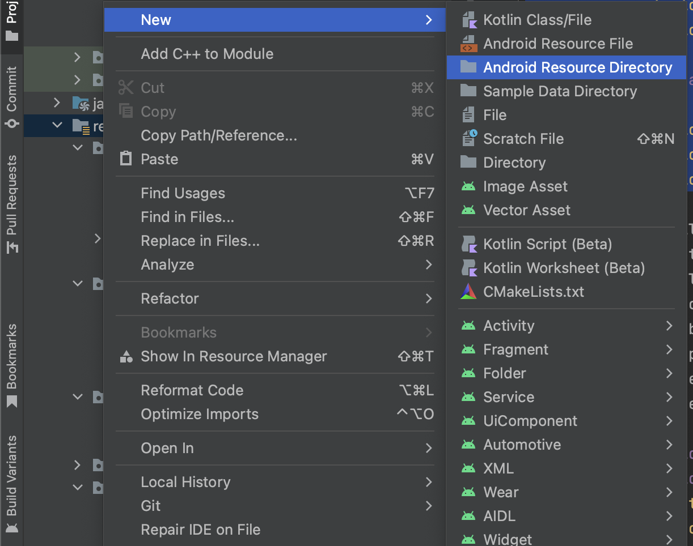

# Exercitii

La finalul acestui tutorial, veți avea o aplicație funcțională de chat care utilizează Bluetooth pentru a comunica între dispozitive Android.


## 1. Descarcarea scheletului

git clone https://github.com/nicolae1099/BluetoothChatApp-schelet.git

## 2. Implementarea metodei initViews în clasa MainActivity:
<details>
    <summary> initViews() </summary>

```java
private void initViews() {
    ListView listMainChat = findViewById(R.id.list_conversation);
    edCreateMessage = findViewById(R.id.ed_enter_message);
    Button btnSendMessage = findViewById(R.id.btn_send_msg);

    adapterMainChat = new ArrayAdapter<>(this, R.layout.message_layout);
    listMainChat.setAdapter(adapterMainChat);

    btnSendMessage.setOnClickListener(view -> sendMessage());
}
```
</details>

## 3. Implementarea metodei initBluetooth în clasa MainActivity:
<details>
    <summary> initBluetooth() </summary>

```java
private void initBluetooth() {
    bluetoothAdapter = BluetoothAdapter.getDefaultAdapter();
    if (bluetoothAdapter == null) {
        Toast.makeText(this, "No bluetooth found", Toast.LENGTH_SHORT).show();
    }
}
```
</details>


## 4. Implementarea metodei onCreate în clasa MainActivity:
Initializați componentele vizuale, Bluetooth și clasa ChatUtils în metoda onCreate() a clasei MainActivity.

<details>
    <summary> onCreate() </summary>

```java
@Override
protected void onCreate(Bundle savedInstanceState) {
    super.onCreate(savedInstanceState);
    setContentView(R.layout.activity_main);

    initViews();
    initBluetooth();
    chatUtils = new ChatUtils(MainActivity.this, handler);
}
```

</details>

## 5. Implementarea metodei onResume în clasa MainActivity:
Asigurați-vă că metoda start() a clasei ChatUtils este apelată în metoda onResume() a clasei MainActivity.

<details>
    <summary> onResume() </summary>

```java
@Override
protected void onResume() {
    super.onResume();
    if (chatUtils != null && chatUtils.getState() == ChatUtils.STATE_NONE) {
        chatUtils.start();
    }
}
```
</details>


## 6. Crearea meniului pentru activitatea MainActivity:
Trebuie dat click pe res -> New -> Android Resource Directory. Iar la Resource Type se va selecta "menu". Ulterior, se va adauga urmatorul fisier xml in cadrul acelui director.





<details>
    <summary> menu_main_activity.xml </summary>

```xml
<menu xmlns:android="http://schemas.android.com/apk/res/android">
    <item
        android:id="@+id/menu_enable_bluetooth"
        android:title="Enable Bluetooth" />
    <item
        android:id="@+id/menu_search_devices"
        android:title="Search Devices" />
</menu>
```
</details>

<details>
<summary> menu_device_list.xml </summary>

```xml
<?xml version="1.0" encoding="utf-8"?>
<menu xmlns:android="http://schemas.android.com/apk/res/android"
    xmlns:app="http://schemas.android.com/apk/res-auto">
    <item
        android:id="@+id/menu_scan_devices"
        android:icon="@drawable/ic_bluetooth_searching"
        android:title="@string/str_menu_scan_devices"
        app:showAsAction="always" />
</menu>
```

</details>

## 7. Implementarea metodelor onCreateOptionsMenu și onOptionsItemSelected în clasa MainActivity:
Creați meniul pentru a permite activarea Bluetooth și căutarea altor dispozitive.

<details>
    <summary> onCreateOptionsMenu() și onOptionsItemSelected() </summary>

```java
@Override
public boolean onCreateOptionsMenu(Menu menu) {
    getMenuInflater().inflate(R.menu.menu_main_activity, menu);
    return super.onCreateOptionsMenu(menu);
}

@Override
public boolean onOptionsItemSelected(MenuItem item) {
    if (item.getItemId() == R.id.menu_enable_bluetooth) {
        enableBluetooth();
        return true;
    } else if (item.getItemId() == R.id.menu_search_devices) {
        checkPermissions();
        return true;
    }
    return super.onOptionsItemSelected(item);
}
```

</details>

## 8. Implementarea metodei onActivityResult în clasa MainActivity:
Gestionați rezultatul activității DeviceListActivity pentru a obține adresa dispozitivului selectat și conectați-vă la acesta.

<details>
    <summary> onActivityResult() </summary>

```java
@Override
protected void onActivityResult(int requestCode, int resultCode, Intent data) {
    int SELECT_DEVICE = 102;
    if (requestCode == SELECT_DEVICE && resultCode == RESULT_OK) {
        String address = data.getStringExtra("deviceAddress");
        chatUtils.connect(bluetoothAdapter.getRemoteDevice(address));
    }
    super.onActivityResult(requestCode, resultCode, data);
}
```
</details>

## 9. Implementarea metodei enableBluetooth în clasa MainActivity:
Activați Bluetooth și faceți dispozitivul vizibil pentru alte dispozitive.

<details>
    <summary> enableBluetooth() </summary>

```java
private void enableBluetooth() {
    if (!bluetoothAdapter.isEnabled()) {
        if (ActivityCompat.checkSelfPermission(this, android.Manifest.permission.BLUETOOTH_CONNECT) != PackageManager.PERMISSION_GRANTED) {
            return;
        }
        bluetoothAdapter.enable();
    }

    if (bluetoothAdapter.getScanMode() != BluetoothAdapter.SCAN_MODE_CONNECTABLE_DISCOVERABLE) {
        Intent discoveryIntent = new Intent(BluetoothAdapter.ACTION_REQUEST_DISCOVERABLE);
        discoveryIntent.putExtra(BluetoothAdapter.EXTRA_DISCOVERABLE_DURATION, 300);
        startActivity(discoveryIntent);
    }
}
```
</details>

## 10. Implementarea metodei sendMessage în clasa MainActivity:
Trimiteți mesaje prin intermediul conexiunii Bluetooth către alt dispozitiv.

<details>
    <summary> sendMessage() </summary>

```java
private void sendMessage() {
    String message = edCreateMessage.getText().toString();
    if (!message.isEmpty()) {
        edCreateMessage.setText("");
        chatUtils.write(message.getBytes());
    }
}
```
</details>

## 11. Implementarea metodei checkPermissions în clasa MainActivity:
<details>
    <summary> checkPermissions() </summary>

```java
private void checkPermissions() {
    if (ContextCompat.checkSelfPermission(this, ACCESS_FINE_LOCATION) != PackageManager.PERMISSION_GRANTED) {
        requestPermissionLauncher.launch(ACCESS_FINE_LOCATION);
    } else {
        selectDeviceLauncher.launch(new Intent(this, DeviceListActivity.class));
    }
}
```
</details>

## 12. Implementarea metodei showPermissionDialog în clasa MainActivity:
<details>
    <summary> showPermissionDialog() </summary>

```java
private void showPermissionDialog() {
    new AlertDialog.Builder(this)
            .setCancelable(false)
            .setMessage("Location permission is required.\nPlease grant")
            .setPositiveButton("Grant", (dialogInterface, i) -> checkPermissions())
            .setNegativeButton("Deny", (dialogInterface, i) -> finish()).show();
}
```
</details>

## 13. Implementarea metodei onDestroy în clasa MainActivity:
Închideți conexiunea Bluetooth la închiderea aplicației.

<details>
    <summary> onDestroy() </summary>

```java
@Override
protected void onDestroy() {
    super.onDestroy();
    if (chatUtils != null) {
        chatUtils.stop();
    }
}
```
</details>


