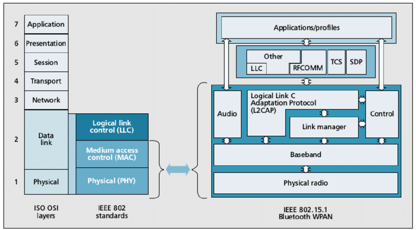
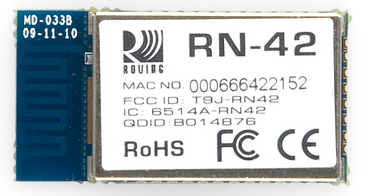

# Protocolul Bluetooth

Bluetooth este un protocol standardizat pentru trimiterea și primirea datelor printr-o legătură wireless de 2,4 GHz. Este un protocol 
securizat, perfect pentru transmisii wireless pe distanțe scurte, cu consum redus de energie și costuri scăzute, între dispozitive 
electronice.

Rețelele Bluetooth (denumite frecvent piconeturi) utilizează un model de tip master/slave pentru a controla când și unde dispozitivele pot 
trimite date. În acest model, un singur dispozitiv master poate fi conectat la până la șapte dispozitive slave diferite. Orice dispozitiv 
slave din piconet poate fi conectat doar la un singur master.

### Bluetooth Addresses

Fiecare dispozitiv Bluetooth are o adresă unică de 48 de biți, adesea abreviată BD_ADDR. Aceasta va fi de obicei prezentată sub forma unei valori hexadecimale de 12 cifre. Jumătatea cea mai semnificativă (24 de biți) a adresei este un identificator unic al organizației (OUI), care identifică producătorul. Cei 24 de biți inferiori sunt partea mai unică a adresei.

Această adresă ar trebui să fie vizibilă pe majoritatea dispozitivelor Bluetooth. De exemplu, pe acest Modul Bluetooth RN-42, adresa tipărită lângă "MAC NO." este 000666422152:

### Procesul de conectare
Crearea unei conexiuni Bluetooth între două dispozitive este un proces cu mai multe etape, care implică trei stări progresive:

- Inquiry -- Dacă două dispozitive Bluetooth nu știu absolut nimic unul despre celălalt, unul trebuie să efectueze un inquiry pentru a încerca să descopere celălalt. Un dispozitiv trimite o solicitare de inquiry, iar orice dispozitiv care ascultă o astfel de solicitare va răspunde cu adresa sa, și posibil cu numele său și alte informații.

- Paging (Connecting) -- Paging este procesul de formare a unei conexiuni între două dispozitive Bluetooth. Înainte ca această conexiune să poată fi inițiată, fiecare dispozitiv trebuie să cunoască adresa celuilalt (găsită în procesul de inquiry).

- Connection -- După ce un dispozitiv a completat procesul de paging, intră în starea de conexiune. În timp ce este conectat, un dispozitiv poate fie să participe activ, fie poate fi pus într-un mod de somn de joasă putere.

  - Active Mode -- Acesta este modul conectat obișnuit, unde dispozitivul transmite sau primește date activ.

  - Sniff Mode -- Acesta este un mod de economisire a energiei, unde dispozitivul este mai puțin activ. Va dormi și va asculta doar transmisiunile la un interval stabilit (de exemplu, la fiecare 100ms).

  - Hold Mode -- Modul Hold este un mod temporar de economisire a energiei unde un dispozitiv doarme pentru o perioadă definită și apoi se întoarce înapoi la modul activ când acel interval a trecut. Maestrul poate comanda un dispozitiv sclav să aștepte.

  - Park Mode -- Park este cel mai profund dintre modurile de somn. Un maestru poate comanda un sclav să "parceze", și acel sclav va deveni inactiv până când maestrul îi spune să se trezească.

### Bonding si Pairing

Când două dispozitive Bluetooth împărtășesc o afinitate specială unul pentru celălalt, acestea pot fi legate împreună. Dispozitivele legate stabilesc automat o conexiune ori de câte ori sunt suficient de aproape. De exemplu, când pornesc mașina, telefonul din buzunarul meu se conectează imediat la sistemul Bluetooth al mașinii pentru că împărtășesc o legătură. Nu sunt necesare interacțiuni cu interfața utilizatorului!

Legăturile sunt create printr-un proces unic numit cuplare. Când dispozitivele se cuplă, își împărtășesc adresele, numele și profilele, și de obicei le stochează în memorie. De asemenea, împărtășesc o cheie secretă comună, care le permite să se lege ori de câte ori sunt împreună în viitor.

Cuplarea necesită de obicei un proces de autentificare unde un utilizator trebuie să valideze conexiunea dintre dispozitive. Fluxul procesului de autentificare variază și depinde de obicei de capabilitățile de interfață ale unuia dintre dispozitive sau al celuilalt. Uneori, cuplarea este o operațiune simplă de tipul "Just Works" (Funcționează Pur și Simplu), unde apăsarea unui buton este tot ce este necesar pentru a cupla (acesta este comun pentru dispozitive fără UI, ca headseturile). Alteori, cuplarea implică potrivirea codurilor numerice de 6 cifre. Procesele de cuplare mai vechi, legacy (v2.0 și anterioare), implică introducerea unui cod PIN comun pe fiecare dispozitiv. Codul PIN poate varia ca lungime și complexitate de la patru numere (de exemplu, "0000" sau "1234") la un șir alfanumeric de 16 caractere.